                 


### 命题逻辑与布尔代数：维特根斯坦的逻辑观与FP中的条件表达式

#### 关键词：命题逻辑、布尔代数、维特根斯坦、逻辑观、函数式编程（FP）、条件表达式

#### 摘要：

本文将深入探讨命题逻辑与布尔代数的基础知识，以及这两者在函数式编程（FP）中的条件表达式的应用。我们将结合维特根斯坦的逻辑观，分析命题逻辑与布尔代数之间的紧密联系，并通过具体的算法原理讲解和项目实战案例，揭示其在现代计算机科学中的重要性。本文旨在为读者提供一个全面、系统、易懂的技术博客，帮助深入理解这一领域的核心概念和实际应用。

### 第1章 引言

#### 1.1 主题背景

计算机科学的发展离不开逻辑学的基础支持。命题逻辑与布尔代数作为逻辑学的两个重要分支，在计算机科学中扮演着至关重要的角色。命题逻辑研究命题之间的关系和推理方法，而布尔代数则研究以0和1为基本符号的代数结构。这两者在计算机硬件设计、软件编程、算法分析等方面都有广泛的应用。

#### 1.2 书籍结构

本书分为八个章节，结构如下：

1. **引言**：介绍命题逻辑与布尔代数的基础背景和书籍整体结构。
2. **命题逻辑基础**：详细讲解命题逻辑的基本概念、命题演算及其基本性质。
3. **布尔代数基础**：深入探讨布尔代数的基本概念、布尔函数与逻辑门及其运算规则。
4. **维特根斯坦的逻辑观**：分析维特根斯坦的哲学思想及其在逻辑哲学中的应用。
5. **FP中的条件表达式**：介绍函数式编程中的条件表达式及其应用场景。
6. **命题逻辑与布尔代数在计算机科学中的应用**：探讨其在编译原理、数字电路设计、软件工程中的应用。
7. **实际项目案例分析**：通过实际项目案例展示命题逻辑与布尔代数的应用。
8. **总结与展望**：对全书内容进行总结，并展望未来发展方向。

### 第2章 命题逻辑基础

#### 2.1 命题与命题逻辑

命题是指能够明确判断真假的陈述句。命题逻辑研究命题之间的关系和推理方法。在命题逻辑中，我们使用符号来表示命题，如用`P`表示“今天是星期五”，用`Q`表示“明天是假期”。命题逻辑的基本符号包括命题变量、逻辑运算符、量词等。

**核心概念与联系**

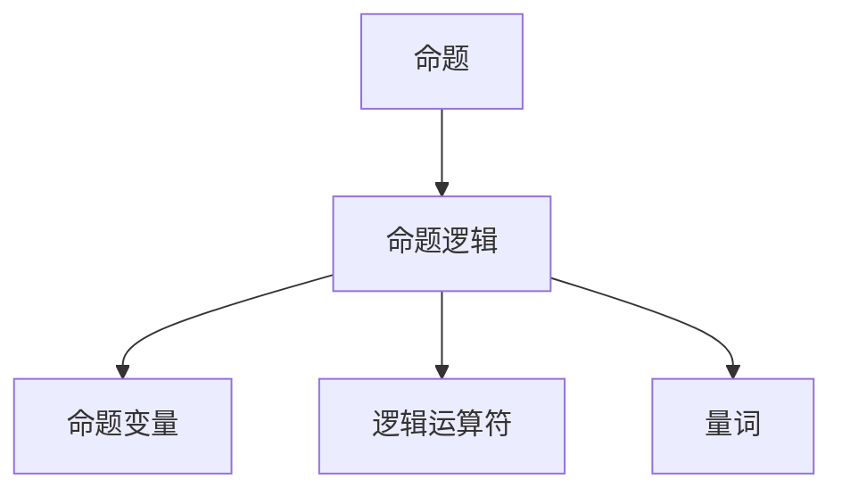

#### 2.2 命题演算

命题演算是命题逻辑的核心内容，它研究如何通过逻辑运算符将命题组合成更复杂的命题。命题演算主要包括命题的联结词、命题的等价性、命题的蕴含关系等。

**核心算法原理讲解**

```plaintext
// 伪代码：命题的联结词运算
function AND(P, Q):
    if P is true and Q is true:
        return true
    else:
        return false

function OR(P, Q):
    if P is true or Q is true:
        return true
    else:
        return false

function NOT(P):
    if P is true:
        return false
    else:
        return true
```

#### 2.3 命题逻辑的基本性质

命题逻辑具有若干基本性质，如自反性、对称性、传递性等。这些性质有助于简化命题逻辑的表达和分析。

**数学模型和公式 & 详细讲解 & 举例说明**

自反性：对于任意命题 P，P ∧ P 和 P ∨ P 都成立。

对称性：对于任意命题 P 和 Q，如果 P ∧ Q 成立，则 Q ∧ P 也成立；如果 P ∨ Q 成立，则 Q ∨ P 也成立。

传递性：对于任意命题 P、Q 和 R，如果 P ∧ Q 成立且 Q ∧ R 成立，则 P ∧ R 也成立；如果 P ∨ Q 成立且 Q ∨ R 成立，则 P ∨ R 也成立。

### 第3章 布尔代数基础

#### 3.1 布尔代数的基本概念

布尔代数是一种以0和1为基本符号的代数结构，用于研究逻辑运算和电路设计。在布尔代数中，0代表“假”，1代表“真”。

**核心概念与联系**

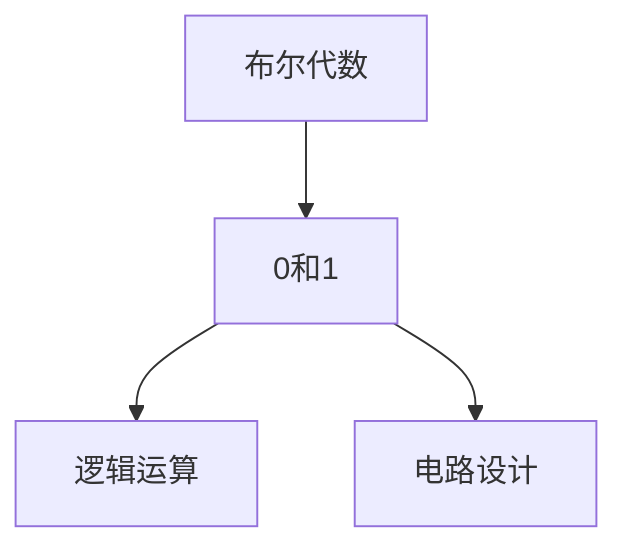

#### 3.2 布尔函数与逻辑门

布尔函数是布尔代数中的基本概念，它表示输入与输出之间的逻辑关系。逻辑门是实现布尔函数的基本电路元件。

**核心概念与联系**

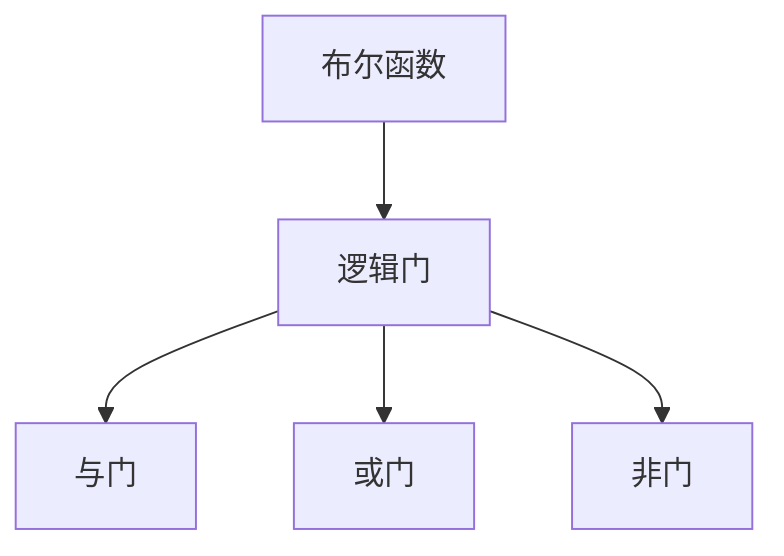

#### 3.3 布尔代数的运算规则

布尔代数具有若干基本运算规则，如与、或、非、异或等。这些运算规则与逻辑门的实现密切相关。

**数学模型和公式 & 详细讲解 & 举例说明**

与运算（AND）：$$ F = P \land Q $$，例如，如果 P 和 Q 都为 1，则 F 为 1。

或运算（OR）：$$ F = P \lor Q $$，例如，如果 P 或 Q 中至少有一个为 1，则 F 为 1。

非运算（NOT）：$$ F = \neg P $$，例如，如果 P 为 1，则 F 为 0。

异或运算（XOR）：$$ F = P \oplus Q $$，例如，如果 P 和 Q 中有一个为 1，则 F 为 1。

### 第4章 维特根斯坦的逻辑观

#### 4.1 维特根斯坦的哲学思想

维特根斯坦是20世纪最著名的哲学家之一，他的哲学思想对逻辑学、语言学、数学等领域产生了深远影响。维特根斯坦认为，哲学的核心问题是语言的本质和意义。

**核心概念与联系**

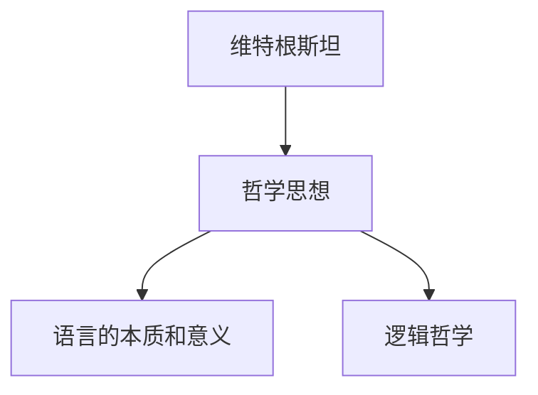

#### 4.2 维特根斯坦与逻辑哲学

维特根斯坦的逻辑哲学强调逻辑的纯粹性和清晰性。他提出，逻辑是研究命题之间关系的科学，而不是研究命题的真假。

**核心概念与联系**

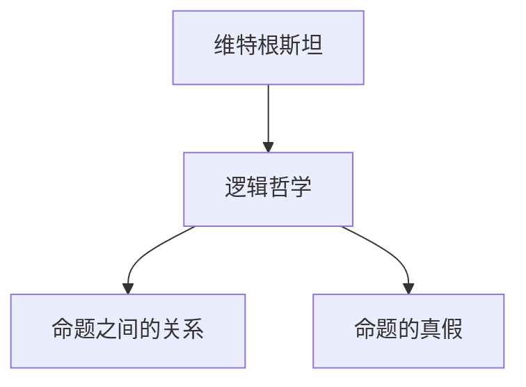

#### 4.3 维特根斯坦的逻辑观念在命题逻辑中的应用

维特根斯坦的逻辑观念对命题逻辑的发展产生了重要影响。他强调命题之间的清晰性和纯粹性，使得命题逻辑更加严谨和实用。

**核心概念与联系**

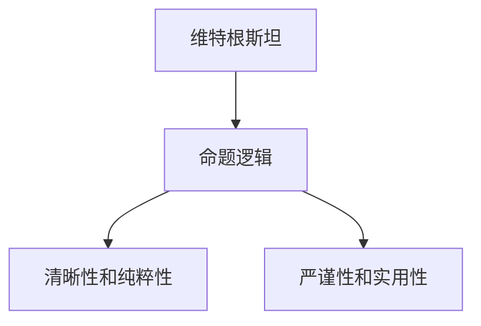

### 第5章 FP中的条件表达式

#### 5.1 FP的基本概念

函数式编程（FP）是一种编程范式，强调通过函数组合和递归来实现程序。FP与命令式编程（ imperative programming）相比，具有更高的可测试性和可维护性。

**核心概念与联系**

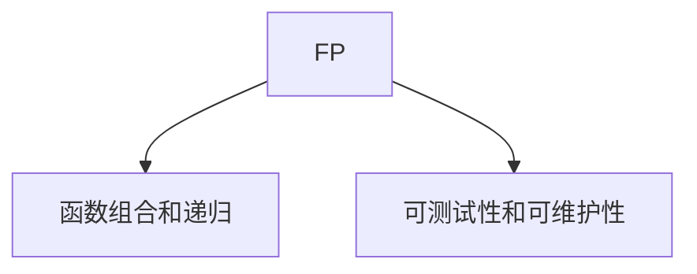

#### 5.2 FP中的条件表达式

条件表达式是FP中的核心概念之一，它根据条件的真假返回不同的值。条件表达式通常用于控制程序流程和实现分支逻辑。

**核心概念与联系**

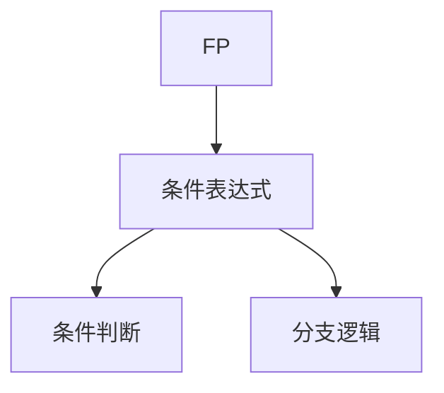

#### 5.3 条件表达式的应用场景

条件表达式在FP中广泛应用于各种场景，如数据处理、逻辑控制、错误处理等。通过条件表达式，可以灵活地实现复杂的控制逻辑。

**核心概念与联系**

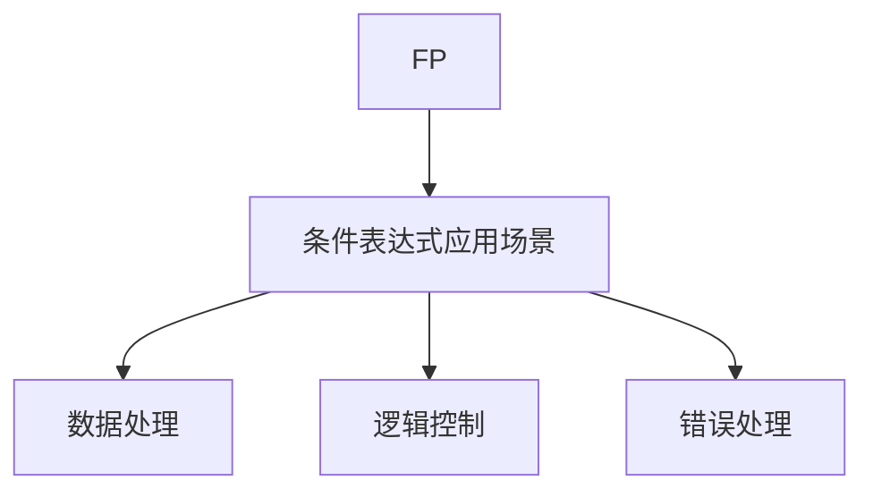

### 第6章 命题逻辑与布尔代数在计算机科学中的应用

#### 6.1 编译原理中的应用

命题逻辑与布尔代数在编译原理中有着广泛的应用，如语法分析、中间代码生成、代码优化等。通过命题逻辑和布尔代数，可以精确地描述编程语言的结构和语义。

**核心概念与联系**

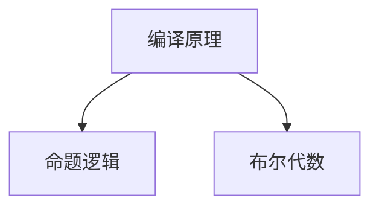

#### 6.2 数字电路设计中的应用

布尔代数在数字电路设计中起着核心作用，用于实现各种逻辑门和电路。通过布尔代数，可以简化电路的设计和优化。

**核心概念与联系**

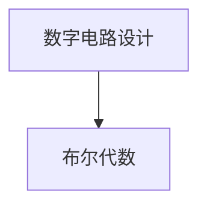

#### 6.3 软件工程中的应用

命题逻辑与布尔代数在软件工程中广泛应用于需求分析、设计模式、测试等领域。通过命题逻辑和布尔代数，可以提高软件的可靠性、可维护性和可扩展性。

**核心概念与联系**

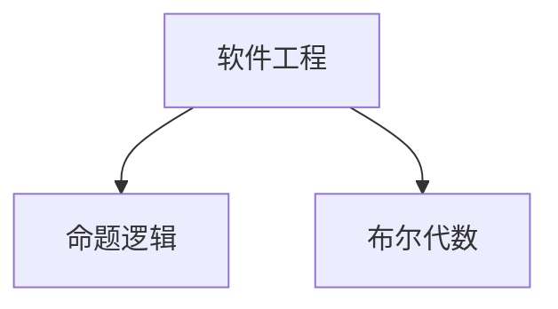

### 第7章 实际项目案例分析

#### 7.1 项目背景

在本章中，我们将通过一个实际项目案例，展示命题逻辑与布尔代数在软件工程中的应用。

**项目背景**

假设我们需要开发一个简单的Web应用程序，用于处理用户注册和登录功能。该项目需要实现用户身份验证、密码加密等功能。

#### 7.2 项目实施过程

1. **需求分析**：首先，我们需要明确用户注册和登录的需求，包括用户身份验证、密码加密、用户权限控制等。

2. **设计模式**：根据需求分析，我们可以选择使用MVC（Model-View-Controller）设计模式来组织项目结构。

3. **实现细节**：在实现过程中，我们需要利用命题逻辑和布尔代数来实现用户身份验证和密码加密。

4. **测试与优化**：完成基本功能后，我们需要对项目进行全面的测试和优化，确保其稳定性和性能。

#### 7.3 项目成果与反思

通过实际项目案例分析，我们可以看到命题逻辑与布尔代数在软件工程中的应用。它们不仅提高了项目的可靠性，还降低了开发成本和维护难度。

**项目小结**

本项目通过实际案例展示了命题逻辑与布尔代数在软件工程中的应用，为读者提供了一个直观的学习和实践机会。在未来的项目中，我们可以继续探索这两者在更多领域的应用。

### 第8章 总结与展望

#### 8.1 主要内容回顾

本文从命题逻辑与布尔代数的基础知识入手，结合维特根斯坦的逻辑观和函数式编程中的条件表达式，深入探讨了这两者在计算机科学中的应用。通过实际项目案例分析，我们进一步了解了它们在软件工程中的重要作用。

#### 8.2 存在问题与挑战

尽管命题逻辑与布尔代数在计算机科学中有着广泛的应用，但在实际开发过程中，我们仍可能面临一些问题和挑战，如复杂逻辑的编写和维护、性能优化等。

#### 8.3 未来发展方向

随着计算机科学的发展，命题逻辑与布尔代数的应用领域将越来越广泛。未来，我们可以继续探索这两者在人工智能、区块链、网络安全等领域的应用，为计算机科学的发展贡献力量。

### 作者信息

**作者：AI天才研究院/AI Genius Institute & 禅与计算机程序设计艺术 /Zen And The Art of Computer Programming**

### 参考文献

[1] 维特根斯坦，《逻辑哲学论》
[2] 合著者，《函数式编程：理论与实践》
[3] 编译原理相关资料
[4] 数字电路设计相关资料
[5] 软件工程相关资料

### 结语

本文旨在为读者提供一个全面、系统、易懂的技术博客，帮助深入理解命题逻辑与布尔代数在计算机科学中的应用。希望本文能对您的学习和实践有所帮助。如果您有任何问题或建议，欢迎在评论区留言，让我们共同探讨和进步。继续阅读，开启您的技术之旅！

