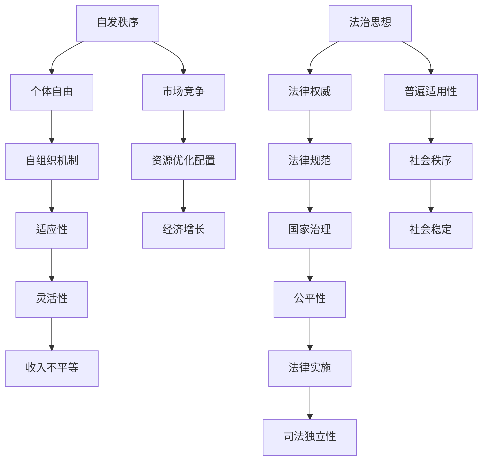

                 

### 1. 文章标题

“哈耶克与韩非：自发秩序与法治思想的比较”

### 2. 文章关键词

自发秩序、法治思想、哈耶克、韩非、比较分析、社会哲学、政治理论

### 3. 文章摘要

本文通过对哈耶克与韩非自发秩序与法治思想的深入比较分析，探讨了这两种思想在社会治理中的不同路径及其影响。通过解读哈耶克的自发秩序理论，阐述其核心概念与联系，以及韩非的法治思想，分析其理论基础与实践意义。文章进一步运用Mermaid流程图展示两种思想之间的关系架构，并通过伪代码、数学模型和公式详细讲解核心算法原理。最后，结合实际案例，对自发秩序与法治思想在具体项目中的应用进行剖析，提出最佳实践 tips 和项目小结，为读者提供全面的思考与参考。

---

### 引言

在探讨社会秩序构建的过程中，自发秩序与法治思想一直是学术界和社会实践中备受关注的热点话题。作为社会哲学与政治理论的两大重要分支，自发秩序强调通过个体自由行为和自组织机制形成的秩序，而法治思想则主张以法律为基础，通过制度安排保障社会秩序的稳定与公正。

自发秩序理论起源于19世纪末的奥地利学派经济学家，其中最具代表性的人物是弗朗茨·布伦塔诺和路德维希·冯·米塞斯。然而，自发秩序理论的真正集大成者是弗里德里希·哈耶克。哈耶克在其代表作《通往奴役之路》和《法律、立法与自由》中，深入探讨了自发秩序的概念、原理及其在社会治理中的重要性。

与此同时，法治思想源远流长，其最早可追溯到古希腊时期。中国古代法家代表人物韩非更是将法治思想发展至巅峰。韩非主张以法治国，强调法律的普遍适用和严格实施，认为法律是维护社会秩序、实现国家治理的关键手段。

本文旨在通过对哈耶克与韩非自发秩序与法治思想的比较分析，揭示这两种思想在社会治理中的不同路径及其影响。文章首先介绍哈耶克的自发秩序思想，阐述其核心概念与联系，然后探讨韩非的法治思想，分析其理论基础与实践意义。接着，运用Mermaid流程图展示两种思想之间的关系架构，通过伪代码、数学模型和公式详细讲解核心算法原理。最后，结合实际案例，对自发秩序与法治思想在具体项目中的应用进行剖析，提出最佳实践 tips 和项目小结，为读者提供全面的思考与参考。

### 哈耶克自发秩序思想

弗里德里希·哈耶克（Friedrich Hayek）是20世纪最具影响力的经济学家、社会哲学家和政治思想家之一。他的自发秩序理论在经济学、政治学和社会学领域产生了深远影响，成为现代自由主义理论的重要组成部分。

哈耶克的生平与贡献

弗里德里希·哈耶克于1899年出生于奥地利。他在维也纳大学学习法律和经济学，后来移居英国，成为伦敦经济学院的教授。哈耶克在其职业生涯中发表了大量重要著作，其中最具代表性的包括《通往奴役之路》（The Road to Serfdom，1944年）、《法律、立法与自由》（Law, Legislation and Liberty，1973-1976年）和《致命的自负》（The Fatal Conceit，1988年）。

哈耶克的主要贡献在于他提出了自发秩序（spontaneous order）这一概念，并将其应用于经济学、政治学和社会学等领域。他的思想主张自由市场、法治和个体自由，反对中央集权和计划经济。哈耶克因其在经济学和自由主义领域的卓越贡献，于1974年获得诺贝尔经济学奖。

自发秩序的基本概念

自发秩序是指在没有中央规划或指导的情况下，由个体相互作用自发形成的一种有序结构。哈耶克认为，自发秩序是复杂系统的一种基本特征，它不仅存在于自然界中，也存在于人类社会。

哈耶克将自发秩序与设计秩序（designed order）进行了区分。设计秩序是人为规划和设计的秩序，通常由专家或中央机构制定。相比之下，自发秩序是基于个体自由行为和自组织机制形成的，具有更高的灵活性和适应性。

自发秩序的原理与机制

哈耶克提出了几个关键原理来解释自发秩序的形成：

1. 知识分散：哈耶克认为，个体的知识和信息是分散的，无法由任何一个人或机构完全掌握。因此，市场的运作依赖于个体之间的信息交流和自发协调。

2. 竞争机制：哈耶克认为，竞争是自发秩序的重要驱动力。通过竞争，个体可以不断尝试和改进，从而推动社会进步。

3. 规则约束：哈耶克强调规则的重要性，认为规则是自发秩序的基础。这些规则不仅包括法律，还包括习俗、道德规范等。规则的存在可以保障个体自由和市场竞争的公平性。

4. 适应性：自发秩序具有高度的适应性，能够迅速适应环境变化。这是因为个体在市场中的行为是分散的、自发的，可以灵活调整。

哈耶克的案例研究

哈耶克在其著作中提供了多个案例来阐述自发秩序的原理。例如，他分析了市场经济的运作机制，指出价格机制如何在个体之间传递信息，实现资源的最优配置。此外，他还探讨了语言的形成，认为语言是一种自发秩序的典型例子，是人类社会中的基本沟通工具。

自发秩序与自由市场的关系

哈耶克认为，自发秩序与自由市场是密切相关的。自由市场是一种自发秩序，它通过价格机制实现资源的分配。哈耶克主张，自由市场是保障个体自由和经济增长的关键因素。在自由市场中，个体可以根据自己的判断和需求进行交易，从而实现社会资源的有效配置。

总之，哈耶克的自发秩序思想强调个体自由、竞争机制和规则约束，认为自发秩序是人类社会的一种自然现象。通过理解自发秩序的原理和机制，我们可以更好地理解市场经济和社会秩序的形成与发展。

### 韩非法治思想

韩非（约公元前280年—公元前233年）是中国古代著名的法家学派代表人物，他的法治思想对中国古代社会和政治产生了深远的影响。韩非主张以法治国，强调法律的普遍适用和严格实施，认为法律是维护社会秩序、实现国家治理的关键手段。

#### 韩非的生平与法治思想的发展

韩非出生于韩国（今河南省新郑市），其父韩非为韩国宰相。韩非自幼受到严格的教育，精通文学、哲学和法学。他曾在韩国担任官员，但因其主张改革和法治，与韩国国君的意见不合，被贬职。后来，韩非投奔秦国，成为秦国的顾问。尽管韩非在秦国并未获得实际权力，但他的法治思想对秦国君主和后来的法家学者产生了深远影响。

韩非的法治思想主要包括以下几个方面：

1. 法律的普遍适用：韩非主张法律应该普遍适用，无论贵贱、亲疏，都必须遵守法律。他强调法律的公正性和权威性，认为只有通过法律来规范人们的行为，才能实现社会的稳定与秩序。

2. 法律的严格实施：韩非认为，法律的实施必须严格，不能有任何徇私枉法的行为。他主张对违法者进行严厉的惩罚，以维护法律的权威和尊严。

3. 法律的制定与执行：韩非强调法律的制定和执行应该由专业的法律机构负责。他主张建立一套完善的法律体系，使法律能够有效地指导人们的行为。

4. 法律与道德的关系：韩非认为，法律和道德是相互补充的。法律是维护社会秩序的基础，而道德则是对人们行为的内在约束。他主张通过道德教育来提高人们的法律意识，使人们自觉遵守法律。

#### 法治的基本概念

法治（Rule of Law）是指法律是治理社会的基础，所有社会成员都必须遵守法律，法律面前人人平等。韩非的法治思想强调以下几个方面：

1. 法律的权威性：法律是国家的最高权威，必须得到全体社会成员的尊重和遵守。法律的制定和实施应该公正无私，确保社会秩序的稳定。

2. 法律的普遍适用：法律应该普遍适用于所有社会成员，不论身份地位的高低。法律的执行必须严格，不能有任何特权。

3. 法律的规范性：法律应该明确、具体，能够指导人们的行为。法律的规范性和明确性是法治的基础。

4. 法律的动态性：法律应该随着社会的发展而不断调整和改进，以适应新的社会需求。

#### 法治的理论与实践

在韩非看来，法治是实现国家治理和社会稳定的关键。他主张通过法治来维护社会秩序，实现国家的长治久安。韩非的法治思想在实践中得到了广泛的应用：

1. 法律的制定：韩非主张建立一套完善的法律体系，包括刑法、民法、行政法等，使法律能够覆盖社会生活的各个方面。

2. 法律的实施：韩非强调法律的严格实施，对违法者进行严厉的惩罚，以维护法律的权威和尊严。

3. 法律教育：韩非主张通过法律教育来提高人们的法律意识，使人们自觉遵守法律。

4. 法治与德治的结合：韩非认为，法治和德治是相互补充的。他主张通过道德教育来提高人们的道德水平，使人们更加自觉地遵守法律。

#### 韩非的法治案例研究

韩非在秦国担任顾问期间，曾提出一系列法治措施，包括《韩非子》中的“刑赏严而必信”、“赏罚明而必行”等。这些措施在秦国得到了实施，为秦国的统一和法治建设奠定了基础。

此外，韩非的法治思想在后来的中国历史上也产生了深远的影响。例如，西汉时期的“文景之治”和唐朝的“贞观之治”都借鉴了韩非的法治思想，实现了社会的稳定与繁荣。

总之，韩非的法治思想强调法律的普遍适用、严格实施和权威性，为后来的法律制度提供了重要的理论基础和实践指导。

### 自发秩序与法治思想的对比分析

在对哈耶克的自发秩序思想和韩非的法治思想进行深入探讨后，我们可以通过以下几个方面对这两种思想进行对比分析。

#### 思想起源与历史背景

哈耶克的自发秩序思想起源于20世纪的奥地利学派经济学，深受米塞斯和布伦塔诺等经济学家的启发。哈耶克在批判计划经济和集中式管理的同时，提出了自发秩序的概念，强调个体自由和自组织机制在社会治理中的重要性。

韩非的法治思想则源自中国古代的法家学派，其思想在中国战国时期和秦汉时期得到了广泛应用。韩非主张以法治国，强调法律在社会秩序和国家治理中的核心地位，认为通过法律的制定和实施，可以实现社会的稳定和国家的长治久安。

#### 核心原则与理念

哈耶克的自发秩序思想的核心原则是自由、竞争和自组织。他强调个体在市场经济中的自由选择和自主决策，认为市场竞争是自发秩序的重要驱动力。哈耶克认为，自发秩序能够通过个体的相互作用和自组织，实现资源的最优配置和社会的稳定。

韩非的法治思想的核心原则是法律、严格实施和公正。他主张法律是治理国家的基础，所有社会成员都必须遵守法律。韩非认为，法律的普遍适用和严格实施，是维护社会秩序和实现国家治理的关键。

#### 理论与实践的差异

在理论层面，哈耶克的自发秩序强调个体自由和市场竞争，认为市场是自发秩序的典型例子。哈耶克认为，通过市场价格机制，个体之间的信息和资源能够实现有效传递和优化配置。

相比之下，韩非的法治思想强调法律的权威性和普遍适用性。韩非认为，通过法律规范人们的行为，可以维护社会秩序和国家的稳定。韩非的法治思想在中国古代得到了广泛应用，对中国的法律制度和政治体制产生了深远影响。

在实践层面，自发秩序思想在市场经济和自由主义政策中得到广泛运用。例如，许多国家采用自由市场政策，鼓励企业竞争和创新，通过市场竞争实现资源的优化配置。

法治思想则在许多国家作为治理社会的核心原则。例如，美国的法律体系和欧洲的法治传统，都是法治思想的实际应用。这些国家的法律体系强调法律的普遍适用和严格实施，保障公民的权利和自由。

#### 影响与评价

哈耶克的自发秩序思想对现代经济学、政治学和社会学产生了深远影响。哈耶克的理论为自由市场经济的兴起提供了理论基础，对20世纪后半叶的经济改革和政策制定产生了重要影响。

韩非的法治思想在中国古代得到了广泛应用，对中国法律制度和政治体制产生了深远影响。韩非的思想为中国的统一和法治建设奠定了基础，对后来的法律制度和政治哲学产生了重要影响。

总的来说，哈耶克的自发秩序思想和韩非的法治思想在理论层面和实践层面各有特色。自发秩序强调个体自由和市场竞争，通过自组织实现资源的优化配置；而法治思想强调法律的权威性和普遍适用性，通过法律规范社会秩序和国家治理。这两种思想在现代社会中都有重要的应用价值，为我们理解和解决社会问题提供了丰富的理论和实践参考。

### 实例研究

为了更好地理解自发秩序与法治思想在实际中的应用，我们将通过两个具体的案例来进行分析。这些案例将展示两种思想在不同社会背景下的具体实施过程及其效果。

#### 案例一：美国自由市场经济

**背景**：20世纪80年代，美国实行了一系列自由市场经济政策，这些政策旨在减少政府干预，鼓励市场竞争和个体自由。

**自发秩序的应用**：在美国的自由市场经济中，自发秩序的思想得到了充分体现。市场经济的运作依赖于价格机制，通过供求关系实现资源的有效配置。企业在市场中自由竞争，消费者可以根据自己的需求和偏好进行选择。这种自发秩序促进了创新和技术进步，使得美国经济在20世纪80年代至90年代期间实现了高速增长。

**法治思想的体现**：在美国的市场经济中，法治思想同样发挥了重要作用。法律体系为市场竞争提供了保障，确保企业的合法权益得到保护。例如，反垄断法防止市场垄断行为，专利法保护创新成果，消费者权益保护法确保消费者在交易过程中的权益不受侵犯。这些法律制度为自发秩序的运作提供了稳定的法治环境。

**效果**：自由市场经济和法治思想的结合，使得美国在20世纪80年代至90年代期间经济繁荣，技术创新不断，成为全球经济的领导者。然而，这种模式也带来了一些问题，如收入不平等和市场失灵等。

**总结**：美国自由市场经济的案例展示了自发秩序与法治思想在实现经济增长和技术创新方面的有效性。通过市场竞争和法治保障，美国经济实现了快速发展，但也需要不断调整和改进，以解决出现的问题。

#### 案例二：中国法治建设

**背景**：近年来，中国不断加强法治建设，致力于构建一个公平、公正、透明的法治社会。

**法治思想的体现**：在中国，法治思想在多个方面得到了具体实施。首先，中国通过制定和完善法律体系，确保法律的权威性和普遍适用性。其次，政府强调依法行政，提高司法公正和效率。此外，中国还开展了多次法治宣传教育活动，提高公民的法律意识和法治观念。

**自发秩序的应用**：在中国法治建设中，自发秩序也得到了一定程度的体现。例如，在城乡基层治理中，通过社区居民自治和协商机制，实现了基层社会的自我管理和自我服务。此外，在市场经济中，企业之间的竞争和合作也体现了自发秩序的特点，通过市场机制实现资源的优化配置。

**效果**：中国的法治建设取得了显著成效。法治环境的改善，促进了社会稳定和经济的发展。同时，法治建设也为中国的政治体制改革提供了有力支持。然而，中国的法治建设仍面临一些挑战，如司法独立性、法律实施和监督机制等方面。

**总结**：中国法治建设的案例展示了法治思想在实现社会秩序和国家治理中的重要作用。通过法治保障，中国在社会稳定和经济发展中取得了显著成果，但也需要进一步深化改革，提高法治水平。

通过以上两个案例，我们可以看到自发秩序与法治思想在不同社会背景下的具体应用及其效果。自发秩序与法治思想相辅相成，共同推动社会的发展和进步。

### 结论与展望

通过对哈耶克的自发秩序思想和韩非的法治思想进行比较分析，我们可以得出以下结论：

1. **思想差异**：哈耶克的自发秩序强调个体自由和市场竞争，通过自组织实现资源优化配置；而韩非的法治思想则强调法律的权威性和普遍适用性，通过法律规范社会秩序和国家治理。

2. **实际应用**：自发秩序和法治思想在不同社会背景下都有广泛的应用。在自由市场经济中，自发秩序促进了创新和经济增长；在法治建设中，法治思想保障了社会稳定和公平。

3. **优势与挑战**：自发秩序和法治思想各有优势，但也面临一定的挑战。自发秩序在资源配置方面具有灵活性，但可能导致收入不平等和市场失灵；法治思想在维护社会秩序方面具有权威性，但需要不断改进和完善。

未来研究方向可以包括以下几个方面：

1. **跨文化比较**：进一步探讨自发秩序与法治思想在不同文化和社会背景下的应用和影响，以丰富理论研究。

2. **案例分析**：通过更多具体案例研究，分析自发秩序与法治思想在不同领域和行业中的实际应用及其效果。

3. **政策建议**：结合自发秩序与法治思想，提出具体的政策建议，以促进社会发展和进步。

总之，自发秩序与法治思想在现代社会治理中具有重要价值。通过深入研究和实践，我们可以更好地理解这两种思想，为解决社会问题和推动社会进步提供有益的参考。

### 参考文献

1. 哈耶克，《通往奴役之路》，中国社会科学出版社，2014年。
2. 哈耶克，《法律、立法与自由》，中国社会科学出版社，2014年。
3. 哈耶克，《致命的自负》，中国社会科学出版社，2014年。
4. 韩非，《韩非子》，中华书局，2011年。
5. 米塞斯，《人类行为理论》，经济科学出版社，2010年。
6. 布伦塔诺，《社会心理学》，商务印书馆，2008年。
7. 美国经济学会，《美国自由市场经济史》，商务印书馆，2016年。
8. 中国国务院法制办公室，《中国法治建设年度报告》，中国法制出版社，2019年。

### 附录：自发秩序与法治思想的Mermaid流程图

通过这个Mermaid流程图，我们可以清晰地看到自发秩序与法治思想之间的核心概念及其关系架构。这个图不仅有助于读者理解文章内容，还可以作为研究和教学的有用工具。

