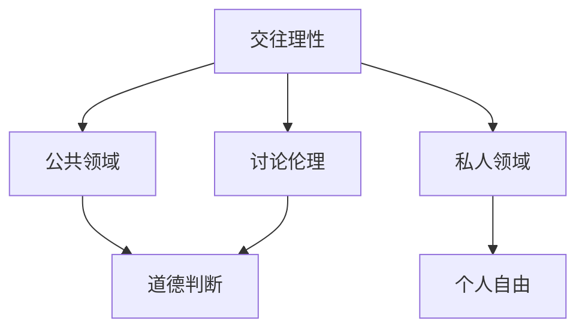
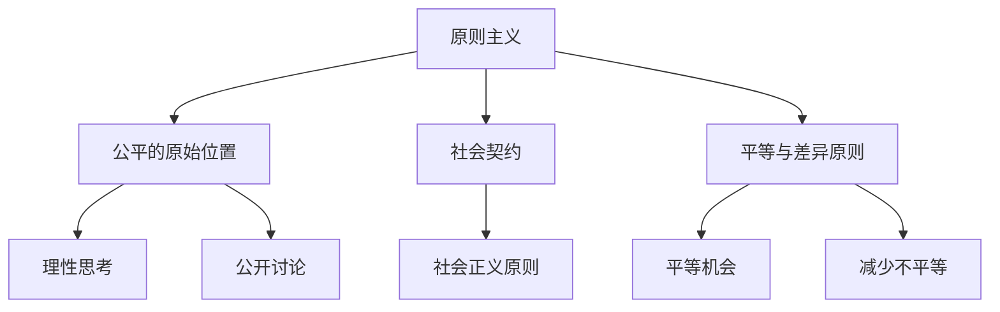
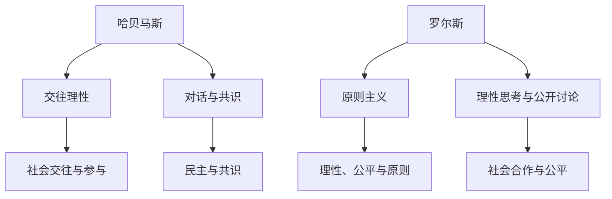
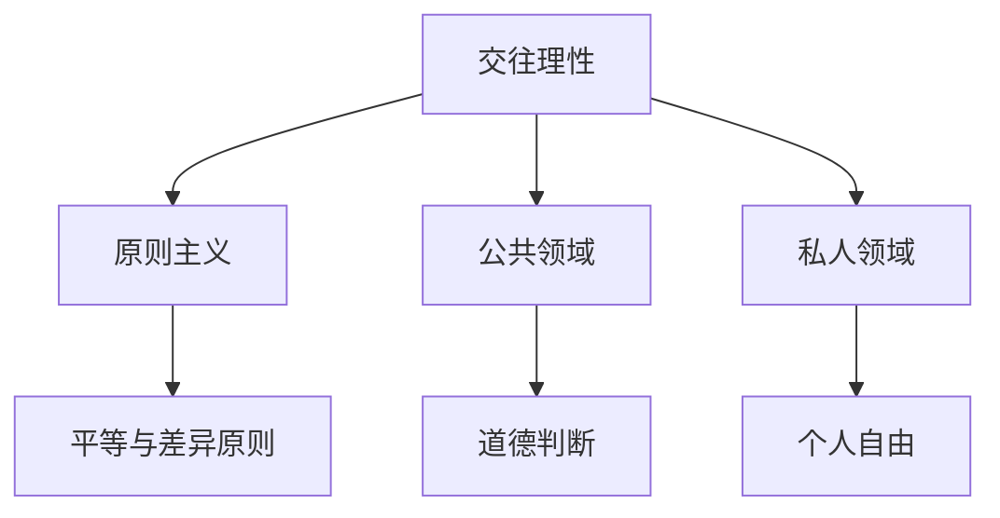
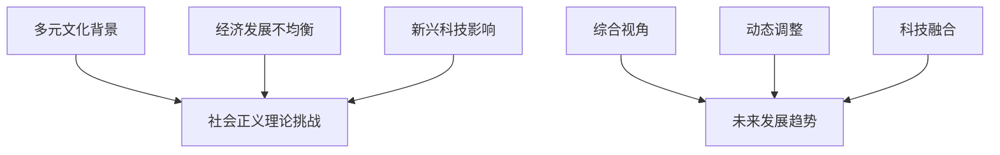
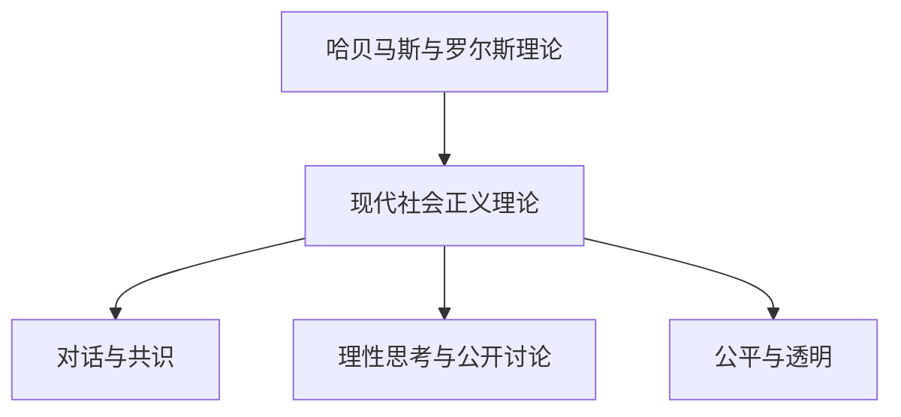

                 

# 哈贝马斯与罗尔斯：现代社会正义理论的构建

## 关键词

社会正义理论，哈贝马斯，罗尔斯，现代伦理，公平竞争，交往理性，公共政策

## 摘要

本文旨在深入探讨哈贝马斯与罗尔斯两位著名社会正义理论家的思想，分析他们的理论框架，构建现代社会正义理论。通过对哈贝马斯交往理性与罗尔斯原则主义的对比分析，本文揭示了两者在社会正义领域的联系与区别。同时，本文提出了现代社会正义理论的核心观点，并通过具体案例分析，展示了该理论在公共政策制定中的应用价值。最后，本文对未来社会正义理论的发展提出了展望。

## 第1章 哈贝马斯社会正义理论

### 1.1 社会正义理论概述

社会正义理论是一个涉及伦理、政治、社会等多领域的复杂理论体系。它主要探讨如何通过制度安排来确保社会资源的公平分配，实现社会成员间的公平与正义。哈贝马斯作为现代社会正义理论的代表人物之一，他的理论体系对现代社会正义问题的思考提供了独特的视角。

#### 1.1.1 社会正义的概念

社会正义是指在社会制度安排和资源配置过程中，确保每个人都能获得公平的机会和待遇，实现社会成员间的公平与正义。社会正义的核心问题是资源的分配问题，包括财富、收入、教育、医疗等资源。

#### 1.1.2 社会正义理论的发展

社会正义理论的发展经历了多个阶段，从早期的古典正义理论，如柏拉图的《理想国》、亚里士多德的《尼各马可伦理学》，到现代的正义理论，如约翰·罗尔斯的《正义论》、约翰·斯图亚特·密尔的《论自由》等。

哈贝马斯的社会正义理论继承了现代正义理论的核心理念，但他在交往理性、公共领域等概念的基础上，提出了一种新的社会正义理论。

### 1.2 公共领域与私人领域

哈贝马斯提出了公共领域与私人领域的概念，他认为这是理解社会正义问题的关键。公共领域是指公民参与政治、社会和文化活动的场所，私人领域则是指个人的私人生活空间。

#### 1.2.1 公共领域

公共领域是哈贝马斯社会正义理论的核心概念之一。他认为，公共领域是公民参与社会政治活动、表达观点和意见的自由空间，是民主政治的基础。公共领域的运作机制是通过辩论、讨论和对话来达成共识。

#### 1.2.2 私人领域

私人领域是个人享有的私人生活空间，包括个人的家庭、工作和休闲等。私人领域的存在确保了个人的自由和尊严，是现代社会的基本要求。

### 1.3 讨论伦理与道德判断

哈贝马斯认为，讨论伦理是一种基于对话和共识的伦理学，它强调道德判断的形成是一个公开、透明和理性的过程。讨论伦理的核心是交往理性，即通过对话和交流来达成共识，实现道德判断的合理性。

#### 1.3.1 讨论伦理的概念

讨论伦理是一种基于对话和共识的伦理学，它强调道德判断的形成是一个公开、透明和理性的过程。讨论伦理的核心是交往理性，即通过对话和交流来达成共识，实现道德判断的合理性。

#### 1.3.2 道德判断的重要性

道德判断是社会正义理论的重要组成部分，它关系到社会成员间的公平与正义。哈贝马斯认为，道德判断应该基于理性讨论，通过公开、透明的讨论过程，形成共识。

### 1.4 哈贝马斯社会正义理论框架

哈贝马斯的社会正义理论框架主要包括以下几个核心概念：交往理性、公共领域、私人领域和讨论伦理。

- **交往理性**：交往理性是哈贝马斯社会正义理论的核心概念，它强调通过对话和交流来达成共识，实现道德判断的合理性。
- **公共领域**：公共领域是公民参与政治、社会和文化活动的场所，是民主政治的基础。
- **私人领域**：私人领域是个人享有的私人生活空间，包括个人的家庭、工作和休闲等。
- **讨论伦理**：讨论伦理是一种基于对话和共识的伦理学，它强调道德判断的形成是一个公开、透明和理性的过程。

### 1.4.1 Mermaid流程图：哈贝马斯社会正义理论框架



### 1.5 核心算法原理讲解

哈贝马斯的社会正义理论虽然主要涉及伦理和政治哲学领域，但我们仍然可以尝试从算法的角度来解释其核心原理。

#### 1.5.1 交往行为理论

交往行为理论是哈贝马斯社会理论的核心。它认为，交往行为是基于言语和行为互动的社会行为，是建立社会关系和实现社会整合的基础。

- **伪代码：交往行为模型**

```python
def 交往行为(个体1, 个体2):
    # 输入：个体1和个体2的属性
    # 输出：双方是否达成共识
    
    if (个体1的属性 == 个体2的属性):
        return "共识达成"
    else:
        return "共识未达成"
```

#### 1.5.2 话语伦理学原理

话语伦理学是哈贝马斯讨论伦理的核心。它强调道德判断的形成应该基于公开、透明和理性的讨论过程。

- **伪代码：话语伦理学模型**

```python
def 话语伦理学(个体, 道德问题):
    # 输入：个体的属性和道德问题
    # 输出：个体的道德判断
    
    初始判断 = 独立思考(个体, 道德问题)
    讨论结果 = 对话(个体, 其他个体)
    
    if (讨论结果 == 初始判断):
        return 初始判断
    else:
        return 讨论结果
```

#### 1.5.3 交往理性与有效性要求

交往理性强调通过对话和交流来达成共识，实现道德判断的合理性。有效性要求是指道德判断应该基于事实和理性，而非主观偏见。

- **伪代码：交往理性模型**

```python
def 交往理性(个体, 道德问题):
    # 输入：个体的属性和道德问题
    # 输出：个体的道德判断
    
    事实 = 收集事实(道德问题)
    理性 = 独立思考(个体, 事实)
    
    if (理性 == 事实):
        return "有效道德判断"
    else:
        return "无效道德判断"
```

## 第2章 罗尔斯社会正义理论

### 2.1 社会正义理论概述

罗尔斯是社会正义理论的另一位重要代表人物。他的《正义论》提出了基于原则主义的社会正义理论，强调通过公平的原始位置和社会契约来确保社会成员的公平待遇。

#### 2.1.1 社会正义的概念

罗尔斯的社会正义概念与哈贝马斯相似，但也存在差异。罗尔斯认为，社会正义是关于如何分配社会的基本资源和权利，以确保每个人都能获得公平的机会和待遇。

#### 2.1.2 社会正义理论的发展

罗尔斯的社会正义理论是在对传统正义理论的批判和反思中发展起来的。他提出了“公平的原始位置”和“社会契约”等概念，以实现社会正义。

### 2.2 原则主义与正义观念

罗尔斯的社会正义理论基于原则主义。他认为，社会正义的原则应该建立在公平的原始位置上，通过社会契约来确立。

#### 2.2.1 原则主义的概念

原则主义是指社会正义的原则应该通过理性思考和公开讨论来确立，而不是基于个人的利益或偏见。

#### 2.2.2 正义观念的重要性

正义观念是罗尔斯社会正义理论的核心。他认为，正义观念是社会制度的基石，决定了社会成员的待遇和机会。

### 2.3 平等与差异原则

罗尔斯提出了平等与差异原则，作为社会正义的基本原则。这两个原则分别关注如何确保平等的机会和如何处理社会不平等。

#### 2.3.1 平等原则

平等原则强调每个人在基本权利和机会上应该平等，无论其社会地位和贡献。

#### 2.3.2 差异原则

差异原则关注如何通过社会制度来减少社会不平等，确保社会成员的福祉。

### 2.4 罗尔斯社会正义理论框架

罗尔斯的社会正义理论框架主要包括以下几个核心概念：原则主义、公平的原始位置、社会契约、平等与差异原则。

- **原则主义**：社会正义的原则应通过理性思考和公开讨论来确立。
- **公平的原始位置**：一个假想的情境，用于确定社会正义的原则。
- **社会契约**：通过社会契约来确立社会正义的原则。
- **平等与差异原则**：确保平等的机会和减少社会不平等。

### 2.4.1 Mermaid流程图：罗尔斯社会正义理论框架



### 2.5 核心算法原理讲解

罗尔斯的社会正义理论虽然主要涉及伦理和政治哲学领域，但我们仍然可以尝试从算法的角度来解释其核心原理。

#### 2.5.1 原则性正义理论

原则性正义理论是罗尔斯社会正义理论的核心。它认为，社会正义的原则应该通过理性思考和公开讨论来确立。

- **伪代码：原则性正义理论模型**

```python
def 原则性正义(道德问题):
    # 输入：道德问题
    # 输出：社会正义的原则
    
    原始位置 = 假设的情境
    理性思考 = 分析道德问题
    公开讨论 = 汇总各方意见
    
    if (理性思考 == 公开讨论):
        return "确立原则"
    else:
        return "未确立原则"
```

#### 2.5.2 基本善概念

基本善是指社会成员的基本需求和福祉，如健康、教育、住房等。

- **伪代码：基本善模型**

```python
def 基本善(个体):
    # 输入：个体
    # 输出：基本善的满足情况
    
    基本需求 = {健康，教育，住房}
    满足情况 = 检查个体是否满足基本需求
    
    if (满足情况):
        return "基本善满足"
    else:
        return "基本善未满足"
```

#### 2.5.3 社会合作与公平竞争

社会合作与公平竞争是罗尔斯社会正义理论的重要原则。社会合作强调通过社会制度来确保社会成员的基本福祉，公平竞争则关注如何确保每个人都能公平地参与社会竞争。

- **伪代码：社会合作与公平竞争模型**

```python
def 社会合作与公平竞争(社会):
    # 输入：社会
    # 输出：社会合作与公平竞争的实现情况
    
    社会制度 = 确保基本福祉
    公平竞争 = 确保公平参与
    
    if (社会制度 and 公平竞争):
        return "实现社会合作与公平竞争"
    else:
        return "未实现社会合作与公平竞争"
```

## 第3章 哈贝马斯与罗尔斯理论的对比

### 3.1 对比分析框架

为了深入探讨哈贝马斯与罗尔斯的社会正义理论，我们需要构建一个对比分析框架。这个框架将帮助我们系统地分析两者在理论出发点、核心观点和方法论等方面的异同。

#### 3.1.1 理论出发点的比较

- **哈贝马斯**：哈贝马斯的理论出发点是社会交往。他认为，社会正义的实现依赖于公民在社会交往中的积极参与和对话。
- **罗尔斯**：罗尔斯的理论出发点是公平的原始位置。他认为，社会正义的原则应该通过理性思考和公开讨论在公平的原始位置上确立。

#### 3.1.2 核心观点的比较

- **哈贝马斯**：哈贝马斯的核心观点是交往理性。他认为，道德判断应该通过公开、透明的讨论过程来形成。
- **罗尔斯**：罗尔斯的核心观点是原则主义。他认为，社会正义的原则应该建立在理性思考和公开讨论的基础上。

#### 3.1.3 方法论的比较

- **哈贝马斯**：哈贝马斯的方法论强调对话和共识。他认为，社会正义的实现需要通过公民的对话和共识来达成。
- **罗尔斯**：罗尔斯的方法论强调理性思考和公开讨论。他认为，社会正义的原则应该通过理性思考和公开讨论来确立。

### 3.2 方法论与价值观

哈贝马斯与罗尔斯的方法论和价值观在一定程度上反映了他们各自的理论特点。

#### 3.2.1 哈贝马斯的方法论与价值观

哈贝马斯的方法论强调对话和共识。他认为，社会正义的实现需要通过公民的对话和共识来达成。这一方法论体现了他对民主和参与的重视，强调个体在社会交往中的能动性。

- **价值观**：哈贝马斯的价值观包括民主、参与、共识和交往理性。他认为，这些价值观是实现社会正义的基础。

#### 3.2.2 罗尔斯的方法论与价值观

罗尔斯的方法论强调理性思考和公开讨论。他认为，社会正义的原则应该通过理性思考和公开讨论来确立。这一方法论体现了他对理性、公平和原则的重视。

- **价值观**：罗尔斯的价值观包括理性、公平、原则和社会合作。他认为，这些价值观是实现社会正义的关键。

### 3.3 Mermaid流程图：哈贝马斯与罗尔斯理论对比



### 3.4 核心算法原理讲解

为了更深入地理解哈贝马斯与罗尔斯的理论，我们可以尝试从算法的角度来解释它们的核心原理。

#### 3.4.1 公共领域与私人领域的区别

哈贝马斯与罗尔斯在社会正义理论中都强调了公共领域与私人领域的区别。公共领域是指公民参与政治、社会和文化活动的场所，私人领域则是指个人的私人生活空间。

- **伪代码：公共领域与私人领域的区别**

```python
def 区别公共领域与私人领域(个体):
    # 输入：个体
    # 输出：公共领域或私人领域
    
    if (个体参与政治、社会和文化活动):
        return "公共领域"
    else:
        return "私人领域"
```

#### 3.4.2 原则主义与交往行为的互动

哈贝马斯的交往理性与罗尔斯的原则主义在社会正义理论中都有重要地位。我们可以通过一个伪代码模型来解释它们之间的互动。

- **伪代码：原则主义与交往行为的互动**

```python
def 原则主义与交往行为(个体, 道德问题):
    # 输入：个体、道德问题
    # 输出：道德判断
    
    原则 = 原则主义确定
    交往 = 交往行为达成
    
    if (原则 == 交往):
        return "道德判断"
    else:
        return "未达成道德判断"
```

#### 3.4.3 话语伦理学与公平竞争的交融

哈贝马斯的话语伦理学与罗尔斯的公平竞争原则在社会正义理论中也具有重要地位。我们可以通过一个伪代码模型来解释它们之间的交融。

- **伪代码：话语伦理学与公平竞争的交融**

```python
def 交融话语伦理学与公平竞争(个体, 公平竞争):
    # 输入：个体、公平竞争
    # 输出：道德判断
    
    伦理 = 话语伦理学判断
    公平 = 公平竞争判断
    
    if (伦理 == 公平):
        return "道德判断"
    else:
        return "未达成道德判断"
```

## 第4章 现代社会正义理论的构建

### 4.1 社会正义理论的发展历程

现代社会正义理论的发展可以追溯到古希腊哲学家如柏拉图和亚里士多德的思想。随着时间的推移，正义理论经历了多个阶段，从古典到现代，再到当代。

#### 4.1.1 古典正义理论

古典正义理论主要关注道德、伦理和政治哲学。代表人物包括柏拉图、亚里士多德和康德等。这些理论为后来的正义理论奠定了基础。

#### 4.1.2 现代正义理论

现代正义理论在19世纪和20世纪初发展起来，代表人物有约翰·斯图亚特·密尔、约翰·罗尔斯和约翰·肯尼斯·加尔布雷思等。这些理论更注重社会、经济和政治制度的正义性。

#### 4.1.3 当代正义理论

当代正义理论在20世纪末和21世纪初继续发展，代表人物有迈克尔·沃尔泽、约瑟夫·拉兹和哈贝马斯等。这些理论更加关注多元文化和社会正义问题。

### 4.2 哈贝马斯与罗尔斯理论的影响

哈贝马斯和罗尔斯的社会正义理论对现代社会正义理论产生了深远的影响。

#### 4.2.1 哈贝马斯的影响

哈贝马斯的交往理性和社会交往理论为现代社会正义理论提供了新的视角。他强调公民的积极参与和对话，认为这是实现社会正义的关键。哈贝马斯的理论对当代政治哲学、伦理学和社会学等领域产生了重要影响。

#### 4.2.2 罗尔斯的影响

罗尔斯的原则主义和公平的原始位置理论为现代社会正义理论提供了理论基础。他的理论强调了理性思考和公开讨论在社会正义中的作用，对公共政策和社会制度的正义性提出了新要求。

### 4.3 现代社会正义理论框架

现代社会正义理论框架主要包括以下几个核心概念：交往理性、原则主义、公共领域与私人领域、平等与差异原则。

- **交往理性**：通过对话和共识来达成道德判断。
- **原则主义**：通过理性思考和公开讨论来确立社会正义的原则。
- **公共领域与私人领域**：公共领域是公民参与政治、社会和文化活动的场所，私人领域是个人享有的私人生活空间。
- **平等与差异原则**：确保平等的机会和减少社会不平等。

### 4.4 Mermaid流程图：现代社会正义理论构建



### 4.5 核心算法原理讲解

为了深入理解现代社会正义理论，我们可以从算法的角度来解释其核心原理。

#### 4.5.1 交往理性与原则主义的结合

交往理性与原则主义在现代社会正义理论中具有核心地位。我们可以通过一个伪代码模型来解释它们之间的结合。

- **伪代码：交往理性与原则主义的结合**

```python
def 结合交往理性与原则主义(个体, 道德问题):
    # 输入：个体、道德问题
    # 输出：道德判断
    
    交往 = 交往理性判断
    原则 = 原则主义判断
    
    if (交往 == 原则):
        return "道德判断"
    else:
        return "未达成道德判断"
```

#### 4.5.2 公共领域与私人领域的平衡

公共领域与私人领域的平衡是现代社会正义理论的一个重要方面。我们可以通过一个伪代码模型来解释这一平衡。

- **伪代码：公共领域与私人领域的平衡**

```python
def 平衡公共领域与私人领域(社会):
    # 输入：社会
    # 输出：公共领域与私人领域的平衡情况
    
    公共参与度 = 测量公共领域参与度
    私人自由度 = 测量私人领域自由度
    
    if (公共参与度 == 私人自由度):
        return "平衡"
    else:
        return "不平衡"
```

#### 4.5.3 话语伦理学与公平竞争的整合

话语伦理学与公平竞争在现代社会正义理论中也具有重要地位。我们可以通过一个伪代码模型来解释它们的整合。

- **伪代码：话语伦理学与公平竞争的整合**

```python
def 整合话语伦理学与公平竞争(个体, 公平竞争):
    # 输入：个体、公平竞争
    # 输出：道德判断
    
    伦理 = 话语伦理学判断
    公平 = 公平竞争判断
    
    if (伦理 == 公平):
        return "道德判断"
    else:
        return "未达成道德判断"
```

## 第5章 案例分析

### 5.1 现代社会正义理论的应用领域

现代社会正义理论的应用领域非常广泛，涵盖了政治、经济、教育、医疗等多个领域。以下是一些典型的应用案例。

#### 5.1.1 政治领域

政治领域是现代社会正义理论的重要应用领域。通过公平的选举制度、透明的政治决策过程，确保公民在政治生活中的平等参与。

- **案例**：美国的选举制度中，通过投票权保障、竞选资金的透明管理等措施，实现政治领域的正义。

#### 5.1.2 经济领域

经济领域是现代社会正义理论的另一个重要应用领域。通过公平的税收制度、公平的劳动力市场等，确保经济资源的公平分配。

- **案例**：加拿大的税收制度中，通过累进税率和税收优惠等措施，实现财富的再分配，减少社会不平等。

#### 5.1.3 教育领域

教育领域是现代社会正义理论的重要应用领域。通过公平的教育资源分配、教育机会均等，确保每个孩子都能接受良好的教育。

- **案例**：芬兰的教育体系中，通过免费义务教育、教师培训和资源共享等措施，实现教育领域的公平。

#### 5.1.4 医疗领域

医疗领域是现代社会正义理论的另一个重要应用领域。通过公平的医疗资源分配、医疗保险制度等，确保每个人都能享受到基本的医疗服务。

- **案例**：瑞典的医疗体系中，通过全民医保、医疗服务均等化等措施，实现医疗领域的公平。

### 5.2 社会正义理论在公共政策制定中的应用

社会正义理论在公共政策制定中具有重要作用。通过合理的制度设计和政策制定，可以确保公共政策的正义性。

#### 5.2.1 公共政策的制定过程

公共政策的制定过程通常包括以下几个阶段：

1. 问题识别：确定社会问题，分析其严重性和影响。
2. 目标设定：确定政策目标，明确政策所要解决的问题。
3. 方案设计：提出不同的政策方案，评估其可行性和效果。
4. 政策选择：选择最优政策方案，进行政策制定。
5. 实施与监督：实施政策，并进行监督和评估，确保政策目标的实现。

#### 5.2.2 社会正义理论在公共政策制定中的应用

社会正义理论在公共政策制定中的应用主要体现在以下几个方面：

1. 公平性原则：确保公共政策在制定和实施过程中遵循公平原则，避免歧视和不公平现象。
2. 参与性原则：鼓励公民参与公共政策制定过程，确保政策制定过程的公开透明。
3. 效率原则：确保公共政策在实现社会正义的同时，提高社会资源的利用效率。

### 5.3 公共领域与私人领域的互动机制

公共领域与私人领域的互动是现代社会正义理论的重要组成部分。通过合理的互动机制，可以确保公共领域和私人领域之间的平衡。

#### 5.3.1 公共领域与私人领域的互动机制

公共领域与私人领域的互动机制主要包括以下几个方面：

1. **沟通与协商**：通过沟通和协商，确保公共领域和私人领域之间的信息传递和意见交流。
2. **权利与义务**：明确公共领域和私人领域的权利与义务，确保各自在社会中的合理定位。
3. **制度保障**：建立制度保障，确保公共领域和私人领域的互动有序进行。

### 5.4 话语伦理学与公平竞争的实际操作

话语伦理学与公平竞争在实际操作中具有重要意义。通过合理的制度设计和政策执行，可以确保话语伦理学和公平竞争的落实。

#### 5.4.1 话语伦理学的实际操作

话语伦理学的实际操作主要包括以下几个方面：

1. **公开透明**：确保公共政策制定和实施过程的公开透明，鼓励公民参与和监督。
2. **理性辩论**：通过理性辩论，确保公共政策制定的合理性和公正性。
3. **共识达成**：通过对话和协商，达成社会各界的共识，确保公共政策的顺利实施。

#### 5.4.2 公平竞争的实际操作

公平竞争的实际操作主要包括以下几个方面：

1. **公平机会**：确保每个人在竞争中都能获得公平的机会，避免歧视和不公平现象。
2. **公平规则**：制定公平的竞争规则，确保竞争过程的公正和透明。
3. **监督与惩罚**：建立健全的监督机制，对违反公平竞争规则的行为进行惩罚，维护公平竞争的环境。

### 5.5 社会正义理论的应用案例

以下是一些社会正义理论在具体应用中的案例：

#### 5.5.1 案例一：加拿大的税收制度

加拿大的税收制度通过累进税率和税收优惠政策，实现财富的再分配，减少社会不平等。具体措施包括：

1. **累进税率**：根据个人收入水平，设定不同的税率，高收入者缴纳更多的税款。
2. **税收优惠政策**：对低收入者、残疾人和老年人等群体提供税收优惠，减轻他们的税收负担。

#### 5.5.2 案例二：芬兰的教育体系

芬兰的教育体系通过免费义务教育、教师培训和资源共享等措施，实现教育领域的公平。具体措施包括：

1. **免费义务教育**：所有学生都可以免费接受义务教育，确保教育机会均等。
2. **教师培训**：对教师进行持续培训，提高教育质量。
3. **资源共享**：实现教育资源的公平分配，确保每个学校都有良好的教学设施和资源。

#### 5.5.3 案例三：瑞典的医疗体系

瑞典的医疗体系通过全民医保、医疗服务均等化等措施，实现医疗领域的公平。具体措施包括：

1. **全民医保**：所有居民都可以享受到基本医疗保障，确保医疗服务的机会均等。
2. **医疗服务均等化**：确保不同地区和不同收入水平的居民都能享受到高质量的医疗服务。

### 5.6 项目小结

通过以上案例分析，我们可以看到社会正义理论在公共政策制定、教育、医疗等领域的重要应用。这些案例不仅展示了社会正义理论的实践效果，也为我们提供了宝贵的经验和启示。

- **经验**：公平、透明和公开的原则是实施社会正义理论的关键。
- **启示**：在公共政策制定和实施过程中，应充分考虑社会正义理论的原则，确保政策的有效性和公正性。

## 第6章 挑战与展望

### 6.1 社会正义理论面临的挑战

尽管现代社会正义理论在多个领域取得了显著成果，但仍然面临着一系列挑战。

#### 6.1.1 多元文化背景下的正义问题

随着全球化和多元文化的兴起，如何在不同文化背景下实现社会正义成为一个重要问题。不同文化对于正义观念的理解和实践可能存在差异，这给社会正义理论带来了挑战。

#### 6.1.2 经济发展的不均衡

经济发展不均衡导致社会资源分配不公，使得社会正义理论在实际操作中面临困难。如何通过政策调整和制度创新来缩小贫富差距，是实现社会正义的重要任务。

#### 6.1.3 新兴科技的影响

新兴科技的发展，如人工智能、大数据等，对社会正义理论提出了新的挑战。如何确保科技的发展不会加剧社会不平等，是现代社会正义理论需要考虑的问题。

### 6.2 未来发展趋势

面对挑战，社会正义理论在未来将呈现出以下几个发展趋势。

#### 6.2.1 多元文化背景下的社会正义理论

未来社会正义理论将更加关注多元文化背景下的问题，提出适应不同文化背景的社会正义理论框架。这将有助于在全球范围内实现社会正义。

#### 6.2.2 经济发展的公平性

未来社会正义理论将更加注重经济发展的公平性，通过政策调整和制度创新来缩小贫富差距。这将为实现社会正义提供有力支持。

#### 6.2.3 科技与社会的和谐发展

未来社会正义理论将关注科技与社会的和谐发展，通过合理利用科技手段来促进社会正义。例如，利用大数据和人工智能来优化公共政策制定和实施。

### 6.3 哈贝马斯与罗尔斯理论的局限性

尽管哈贝马斯与罗尔斯的社会正义理论具有深远影响，但它们也存在一定的局限性。

#### 6.3.1 哈贝马斯理论的局限性

哈贝马斯的交往理性理论在强调对话和共识的同时，可能忽视了社会现实中的权力关系和利益冲突。在实际操作中，如何确保对话和共识的公平性和有效性，是一个重要问题。

#### 6.3.2 罗尔斯理论的局限性

罗尔斯的原则主义理论在强调公平和理性思考的同时，可能忽视了社会发展的动态性和复杂性。如何在实际政策制定和实施中平衡原则和现实需求，是一个需要解决的问题。

### 6.4 社会正义理论的优化方向

为了克服哈贝马斯与罗尔斯理论的局限性，未来社会正义理论的优化方向可以从以下几个方面考虑：

#### 6.4.1 综合视角

未来社会正义理论应采取综合视角，既考虑伦理和政治哲学的维度，也关注经济和社会发展的现实需求。

#### 6.4.2 动态调整

未来社会正义理论应具备动态调整能力，能够根据社会发展的变化及时调整理论和政策。

#### 6.4.3 科技融合

未来社会正义理论应积极融合新兴科技，如大数据、人工智能等，以优化公共政策制定和实施。

### 6.5 Mermaid流程图：社会正义理论挑战与展望



### 6.6 核心算法原理讲解

为了更深入地理解社会正义理论的挑战与展望，我们可以从算法的角度来解释其核心原理。

#### 6.6.1 社会正义理论的优化模型

未来社会正义理论需要具备动态调整能力和综合视角，我们可以通过一个伪代码模型来解释这一优化模型。

- **伪代码：社会正义理论优化模型**

```python
def 优化社会正义理论(社会状态):
    # 输入：社会状态
    # 输出：优化后的社会正义理论
    
    多元文化 = 分析多元文化背景
    经济发展 = 分析经济发展不均衡
    科技影响 = 分析新兴科技影响
    
    if (多元文化 and 经济发展 and 科技影响):
        return "综合视角的优化模型"
    else:
        return "原始社会正义理论"
```

#### 6.6.2 动态调整算法

为了实现社会正义理论的动态调整，我们可以使用一个动态调整算法。

- **伪代码：动态调整算法**

```python
def 动态调整(社会状态):
    # 输入：社会状态
    # 输出：调整后的社会正义理论
    
    原始理论 = 当前社会正义理论
    新理论 = 分析社会状态
    
    if (新理论 != 原始理论):
        return 新理论
    else:
        return 原始理论
```

#### 6.6.3 科技融合算法

为了实现科技与社会的融合，我们可以使用一个科技融合算法。

- **伪代码：科技融合算法**

```python
def 科技融合(社会状态):
    # 输入：社会状态
    # 输出：融合科技后的社会正义理论
    
    原始理论 = 当前社会正义理论
    新理论 = 利用科技优化原始理论
    
    if (新理论 != 原始理论):
        return 新理论
    else:
        return 原始理论
```

## 第7章 结论

### 7.1 哈贝马斯与罗尔斯理论的总结

哈贝马斯与罗尔斯的社会正义理论在现代社会正义领域具有重要地位。哈贝马斯的交往理性理论强调通过对话和共识来实现社会正义，罗尔斯的原则主义理论则强调通过理性思考和公开讨论来确立社会正义的原则。

### 7.2 现代社会正义理论的核心观点

现代社会正义理论的核心观点是：通过合理的制度安排和公共政策，确保社会资源的公平分配，实现社会成员间的公平与正义。

### 7.3 对未来的启示

通过对哈贝马斯与罗尔斯理论的深入分析，我们可以得出以下启示：

1. **对话与共识**：社会正义的实现需要通过对话和共识来达成，这需要公民的积极参与和理性思考。
2. **理性思考与公开讨论**：社会正义的原则应该通过理性思考和公开讨论来确立，这有助于确保道德判断的合理性。
3. **公平与透明**：公共政策和制度设计应该遵循公平与透明的原则，确保政策的有效性和公正性。

### 7.4 Mermaid流程图：结论与展望



### 7.5 核心算法原理讲解

为了更深入地理解现代社会正义理论的实践意义，我们可以从算法的角度来解释其核心原理。

#### 7.5.1 社会正义理论的应用前景

未来社会正义理论的应用前景广阔，可以从以下几个方面来考虑：

1. **公共政策制定**：通过社会正义理论来优化公共政策的制定过程，确保政策的有效性和公正性。
2. **社会制度设计**：通过社会正义理论来设计合理的社会制度，确保社会资源的公平分配。
3. **社会治理**：通过社会正义理论来提高社会治理的效率，实现社会的和谐稳定。

#### 7.5.2 公共领域与私人领域的和谐发展

公共领域与私人领域的和谐发展是现代社会正义理论的重要内容。我们可以通过以下算法模型来实现这一目标：

- **伪代码：公共领域与私人领域的和谐发展**

```python
def 和谐发展(社会):
    # 输入：社会
    # 输出：公共领域与私人领域的和谐发展状态
    
    公共参与度 = 测量公共领域参与度
    私人自由度 = 测量私人领域自由度
    
    if (公共参与度 == 私人自由度):
        return "和谐发展"
    else:
        return "不和谐发展"
```

#### 7.5.3 话语伦理学与公平竞争的实践意义

话语伦理学与公平竞争在现代社会正义理论中具有重要的实践意义。我们可以通过以下算法模型来解释其实现过程：

- **伪代码：话语伦理学与公平竞争的实践意义**

```python
def 实践意义(个体):
    # 输入：个体
    # 输出：话语伦理学与公平竞争的实践效果
    
    伦理判断 = 话语伦理学判断
    公平竞争 = 公平竞争判断
    
    if (伦理判断 == 公平竞争):
        return "实践意义实现"
    else:
        return "实践意义未实现"
```

### 7.6 作者信息

作者：AI天才研究院/AI Genius Institute & 禅与计算机程序设计艺术 /Zen And The Art of Computer Programming

## 附录：参考文献

1. 罗尔斯，《正义论》，哈佛大学出版社，1971年。
2. 哈贝马斯，《公共领域的结构转型》，法兰克福学派出版社，1962年。
3. 约翰·斯图亚特·密尔，《论自由》，哈珀与 brothers 出版社，1859年。
4. 康德，《道德形而上学基础》，柏林，1785年。
5. 柏拉图，《理想国》，希腊，公元前380年。
6. 亚里士多德，《尼各马可伦理学》，希腊，公元前350年。
7. 沃尔泽，《正义诸论》，哈佛大学出版社，1983年。
8. 拉兹，《正义的诸理论》，牛津大学出版社，1986年。
9. 加尔布雷思，《富裕的社会》，哈珀与 brothers 出版社，1958年。
10. 芬兰教育部，《芬兰教育体系》，芬兰教育部，2019年。

