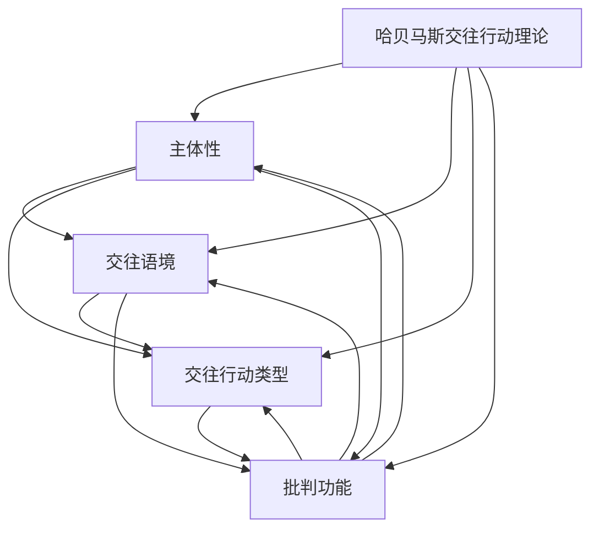

                 

### 文章标题

《哈贝马斯与荀子：交往行动理论与礼治思想》

> 关键词：哈贝马斯、交往行动理论、荀子、礼治思想、跨文化比较、现代化、社会批判

> 摘要：本文旨在探讨哈贝马斯的交往行动理论与荀子的礼治思想，通过跨文化比较，揭示两者在现代社会中的重要性和互补性。文章首先概述了哈贝马斯交往行动理论的基本概念和构成要素，接着介绍了荀子的生平与礼治思想的核心概念。随后，文章比较了两者在主体性、交往语境和目的等方面的相似与差异。在此基础上，文章探讨了哈贝马斯交往行动理论与荀子礼治思想的互补性，并分析了其在现代社会中的应用。通过本文的研究，期望为我国现代化进程提供理论借鉴和实践指导。

### 第一部分：哈贝马斯交往行动理论概述

#### 第1章 哈贝马斯交往行动理论的基本概念

哈贝马斯（Jürgen Habermas），德国社会学家和哲学家，以其交往行动理论（Communicative Action Theory）闻名于世。这一理论旨在探讨人类在社会交往中的行为模式和沟通机制，强调主体间的相互理解和共识达成。哈贝马斯的交往行动理论起源于对现代社会的批判，特别是对资本主义制度和文化工业的质疑。

#### 1.1 哈贝马斯的生平与学术背景

哈贝马斯生于1929年，于1954年获得哲学博士学位，1964年成为海德堡大学教授，1971年担任法兰克福大学社会研究所所长，1986年当选为德国科学院院士，1993年获得莱布尼茨奖。他的学术生涯横跨了多个领域，包括哲学、社会学、政治学和文化研究。

#### 1.2 交往行动理论的核心概念

哈贝马斯的交往行动理论主要围绕三个核心概念展开：主体性、交往语境和交往行动的类型与结构。

**1.2.1 主体性**

哈贝马斯认为，主体性不是固定的、静态的实体，而是在交往过程中不断形成和重构的。主体性不仅是个体自我认同的基础，也是社会关系和社会结构的组成部分。

**1.2.2 交往语境**

交往语境是指个体在社会交往中形成的共享背景，包括文化规范、价值观、社会习俗等。交往语境对于交往行动的进行具有重要意义，它为交往提供了基本的规范和框架。

**1.2.3 交往行动的类型与结构**

哈贝马斯将交往行动分为以下几种类型：

- **工具性交往**：以实现特定目标为导向，强调效率和实用性。
- **功利性交往**：以达成共识和满足双方需求为目的，强调互惠互利。
- **表达性交往**：以表达个人情感、思想和感受为目的，强调自我表达和情感交流。
- **规范性交往**：以遵守社会规范和道德准则为目的，强调秩序和稳定。

交往行动的结构包括语言、符号系统和沟通规则，这些要素共同构成了交往行动的基本框架。

#### 1.3 交往行动理论的来源与发展

哈贝马斯的交往行动理论深受西方哲学、社会学和语言哲学的影响。尤其是马克思的社会批判理论和维特根斯坦的语言哲学对其产生了深远影响。在哈贝马斯的学术生涯中，他的交往行动理论不断发展和完善，从早期的《公共领域的结构转型》到晚期的《对话伦理学》，他的理论视野逐渐扩展，不仅关注社会结构和制度问题，还涉及到伦理学和政治哲学领域。

### 第2章 交往行动理论的构成要素

#### 2.1 主体性

主体性是哈贝马斯交往行动理论的核心概念之一。在哈贝马斯看来，主体性不是一成不变的，而是通过交往行动不断形成和重塑的。主体性不仅涉及个体的自我认同，还包括个体在社会关系中的角色和地位。

**2.1.1 主体性的形成**

主体性的形成过程可以分为两个阶段：自我反思和自我认同。

- **自我反思**：个体通过反思自己的行为和经验，形成对自我认知和理解。
- **自我认同**：个体基于自我反思，形成对自我身份的认同和界定。

**2.1.2 主体性的表现**

主体性的表现主要体现在个体在社会交往中的行为和态度上：

- **自主性**：个体在交往中具有独立思考和决策的能力。
- **责任感**：个体在交往中承担对他人和社会的责任。
- **平等性**：个体在交往中追求平等和公正，尊重他人的主体性。

#### 2.2 交往语境

交往语境是指个体在社会交往中形成的共享背景，包括文化规范、价值观、社会习俗等。交往语境对于交往行动的进行具有重要意义，它为交往提供了基本的规范和框架。

**2.2.1 交往语境的构成**

交往语境的构成主要包括以下几个方面：

- **文化规范**：包括语言、宗教、道德、习俗等，这些规范影响着个体的行为和思维方式。
- **价值观**：个体对社会事务的基本看法和评价标准，如公平、正义、自由、平等等。
- **社会习俗**：个体在特定社会环境中形成的共同行为模式，如礼仪、节日庆典等。

**2.2.2 交往语境的作用**

交往语境的作用主要体现在以下几个方面：

- **规范作用**：交往语境为个体提供了行为规范，使个体在社会交往中能够遵循共同的游戏规则。
- **认同作用**：交往语境有助于个体形成对社会身份的认同，增强个体的归属感和凝聚力。
- **沟通作用**：交往语境为个体提供了沟通的基础，使个体能够通过语言和符号系统进行有效沟通。

#### 2.3 交往行动的类型与结构

哈贝马斯将交往行动分为工具性交往、功利性交往、表达性交往和规范性交往四种类型。每种类型都有其独特的目的和结构。

**2.3.1 工具性交往**

工具性交往以实现特定目标为导向，强调效率和实用性。在工具性交往中，个体通过使用语言和符号系统来传递信息和指令，以达到合作和协作的目的。

**2.3.2 功利性交往**

功利性交往以达成共识和满足双方需求为目的，强调互惠互利。在功利性交往中，个体通过协商和谈判，寻求共同利益的最大化。

**2.3.3 表达性交往**

表达性交往以表达个人情感、思想和感受为目的，强调自我表达和情感交流。在表达性交往中，个体通过言语和身体语言来表达自己的情感和态度。

**2.3.4 规范性交往**

规范性交往以遵守社会规范和道德准则为目的，强调秩序和稳定。在规范性交往中，个体通过遵守社会规范和道德准则，维护社会秩序和稳定。

#### 2.4 交往行动的目的与意义

交往行动的目的在于通过有效沟通，实现个体间的相互理解和共识。交往行动不仅有助于解决社会问题，还有助于促进社会和谐与发展。

**2.4.1 目的**

- **实现共识**：通过交往行动，个体能够达成共识，解决分歧和冲突。
- **促进理解**：通过交往行动，个体能够增进对他人和集体的理解，减少误解和偏见。
- **实现合作**：通过交往行动，个体能够实现合作和协作，共同应对社会挑战。

**2.4.2 意义**

- **社会稳定**：交往行动有助于维护社会秩序和稳定，减少社会冲突和矛盾。
- **个体发展**：交往行动有助于个体的成长和发展，增强个体的自我认同和社会责任感。
- **文化传承**：交往行动有助于文化的传承和发展，推动社会进步和文明繁荣。

### 第3章 交往行动理论的批判功能

#### 3.1 对传统社会理论的批判

哈贝马斯的交往行动理论对传统社会理论进行了深刻批判，尤其是对马克思主义、韦伯主义和结构功能主义等主流社会理论的质疑。他认为，这些理论过于强调社会结构和制度对个体行为的影响，忽视了个体在社会交往中的主动性和创造性。

**3.1.1 对马克思主义的批判**

哈贝马斯认为，马克思主义过分强调经济基础对社会结构和意识形态的决定作用，忽视了文化、价值观和个体主体性在历史发展中的重要作用。他主张，应从交往行动的角度重新审视社会历史的发展过程。

**3.1.2 对韦伯主义的批判**

哈贝马斯对韦伯的理性化理论提出了质疑，认为韦伯过于强调理性化对个体行为的制约，忽视了交往行动中的非理性因素。他认为，交往行动不仅包含理性因素，还包含情感、价值观等非理性因素。

**3.1.3 对结构功能主义的批判**

哈贝马斯认为，结构功能主义过于强调社会系统内部各部分之间的平衡和稳定，忽视了社会系统与外部环境之间的互动关系。他主张，应从交往行动的角度重新审视社会结构和功能的关系。

#### 3.2 对现代性理论的批判

哈贝马斯的交往行动理论对现代性理论进行了深刻批判，特别是对资本主义现代性的质疑。他认为，资本主义现代性在带来社会进步的同时，也带来了诸多社会问题，如异化、物化、消费主义等。

**3.2.1 对资本主义现代性的批判**

哈贝马斯认为，资本主义现代性导致了个体在市场经济中的异化和物化，个体被迫成为商品的奴隶，失去了自我价值。他主张，应通过交往行动，重建个体与社会之间的和谐关系。

**3.2.2 对技术理性主义的批判**

哈贝马斯认为，技术理性主义在现代社会中占据主导地位，导致人类忽视了交往行动中的情感、伦理和道德因素。他主张，应通过交往行动，恢复人类在情感、伦理和道德层面的自觉。

#### 3.3 对后现代主义的批判

哈贝马斯对后现代主义也提出了批判，认为后现代主义在批判现代性的过程中，走向了极端，否定了理性、基础和总体性。他认为，后现代主义过于强调差异性、不确定性和碎片化，忽视了人类在交往行动中寻求共识和整体性的努力。

**3.3.1 对相对主义的批判**

哈贝马斯认为，后现代主义的相对主义导致了对真理和价值的否定，使人类陷入道德相对主义和虚无主义。他主张，应在交往行动中寻求共识，重建人类对真理和价值的信仰。

**3.3.2 对怀疑主义的批判**

哈贝马斯认为，后现代主义的怀疑主义导致了人类对知识和理性的怀疑，使人类陷入了信仰危机。他主张，应通过交往行动，重建人类对知识和理性的信仰，推动社会进步。

### 第二部分：荀子礼治思想概述

#### 第4章 荀子的生平与学术背景

荀子（约公元前313年-公元前238年），名况，战国末期赵国（今河北省）人，是中国古代著名的思想家、教育家和政治家。荀子生活在战国末期，当时的诸侯纷争，社会动荡不安，人民生活困苦。在这样的社会背景下，荀子以其深邃的思想和独特的教育理念，成为当时著名的思想家之一。

#### 4.1 荀子的生平

荀子早年家境贫寒，但勤奋好学，曾游历各地，向当时的名士请教。他在齐国做了几年卿相，后来回到家乡，专注于教学和研究。荀子的学生遍布天下，其中著名的有韩非、李斯等人。荀子去世后，其思想影响了整个战国时期和秦汉时期，成为中国传统文化中的重要组成部分。

#### 4.2 荀子的学术地位与影响

荀子在中国古代学术史上占有重要地位，被誉为“后圣”。他的思想主张以人性恶为基础，强调通过教育和社会制度来塑造人的品德，实现社会的和谐与稳定。荀子的礼治思想强调礼的作用，认为礼是调节社会关系、维护社会秩序的基本原则。

#### 4.3 荀子的主要著作

荀子的主要著作有《荀子》一书，包括《劝学》、《天论》、《性恶论》等篇目。这些著作系统地阐述了荀子的哲学、政治和教育思想，对中国古代文化和哲学产生了深远影响。荀子的思想对后世儒家学派的发展产生了重要影响，特别是对汉代的儒家学者有着深远的影响。

#### 第5章 礼治思想的核心概念

荀子的礼治思想是其哲学思想的核心，强调礼在社会治理中的作用。礼在荀子看来，不仅是社会规范，更是人们行为准则的体现。

#### 5.1 礼的定义与内涵

礼在荀子眼中，是一种通过行为规范和道德准则来调节社会关系和秩序的体系。它包括道德规范、行为准则、仪式礼节等，是维护社会和谐稳定的重要手段。

**5.1.1 道德规范**

荀子认为，礼的首要功能是规范人的道德行为，使人们在相互交往中遵循一定的道德准则。这些道德准则包括仁爱、忠诚、孝顺、谦逊等。

**5.1.2 行为准则**

礼还包括具体的行为准则，如礼仪、节庆、仪式等。这些行为准则不仅体现了社会规范，也是人们相互尊重和合作的体现。

**5.1.3 仪式礼节**

仪式礼节是礼的重要组成部分，通过仪式和礼节，人们表达对神灵、祖先和君主的尊敬，强化社会认同和共同体意识。

#### 5.2 礼治思想的基本原则

荀子的礼治思想强调以下基本原则：

**5.2.1 礼之用，和为贵**

荀子认为，礼的最终目的是实现社会的和谐。通过礼的规范，使人们在相互交往中达到和谐，避免冲突和矛盾。

**5.2.2 礼以正身，以治民，以平天下**

荀子强调，个体修身是礼治思想的基础。个人通过修身，达到道德修养的境界，然后才能治理家庭、治理国家，最终实现天下的和平。

**5.2.3 礼以分贵贱，序亲疏，别善恶**

礼在社会治理中的作用是明确社会等级和地位，区分亲疏关系，明确善恶标准，从而维护社会秩序。

#### 5.3 礼治思想的作用与意义

荀子的礼治思想在中国古代社会产生了深远影响，其作用和意义主要体现在以下几个方面：

**5.3.1 社会秩序的维护**

通过礼的规范，维护社会秩序，使人们在相互交往中遵循一定的行为准则，减少冲突和矛盾。

**5.3.2 人格塑造**

礼治思想强调个体的道德修养，通过礼的规范，帮助个体形成良好的品德，实现人格的完善。

**5.3.3 社会和谐**

礼治思想强调社会的和谐与稳定，通过礼的规范，实现人际关系的和谐，促进社会的和谐与发展。

**5.3.4 文化传承**

礼治思想作为中国古代文化的重要组成部分，对后世文化传承产生了深远影响，成为中国传统文化的重要基石。

### 第6章 礼治思想的实践与反思

#### 6.1 礼治思想在古代中国的实践

荀子的礼治思想在古代中国得到了广泛实践，尤其是在秦汉时期。秦始皇统一六国后，实行了一系列礼治措施，如统一度量衡、文字、货币等，以加强中央集权和维护社会秩序。汉代继承了秦朝的礼治思想，进一步发展了礼制，形成了以儒家思想为核心的礼治体系。

**6.1.1 秦朝的实践**

秦朝通过法律和礼仪规范，加强中央集权，维护社会秩序。秦始皇统一六国后，推行一系列法律和礼仪制度，如焚书坑儒、统一度量衡、文字等，以消除地方割据，加强中央集权。

**6.1.2 汉朝的实践**

汉朝继承了秦朝的礼治思想，进一步发展了礼制。汉武帝采纳董仲舒的建议，罢黜百家，独尊儒术，将儒家思想作为国家意识形态，推行礼制教育，培养儒生，强化礼仪制度。

#### 6.2 礼治思想的现代反思

随着现代社会的变迁，礼治思想在现代社会中的价值和适用性受到了质疑。一些学者认为，礼治思想过于强调等级制度和道德规范，限制了个体自由和创造力。但在新时代背景下，礼治思想依然有其独特的价值。

**6.2.1 礼治思想的局限性**

- **等级制度**：礼治思想强调社会等级和地位，可能导致社会不平等和歧视。
- **道德规范**：礼治思想强调道德规范，可能导致道德教条化和形式主义。

**6.2.2 礼治思想的现代价值**

- **社会秩序**：礼治思想强调社会秩序和稳定，有助于维护社会和谐。
- **人格塑造**：礼治思想强调个体的道德修养，有助于培养良好的品德和人格。

#### 6.3 礼治思想的未来展望

在新时代背景下，礼治思想需要结合现代社会的发展，进行创新和发展。未来，礼治思想有望在以下几个方面发挥重要作用：

**6.3.1 社会治理**

- **加强社会管理**：通过礼的规范，加强社会管理，提高社会治理效率。
- **促进社会和谐**：通过礼的规范，促进人际关系的和谐，减少社会矛盾和冲突。

**6.3.2 文化传承**

- **弘扬传统文化**：通过礼治思想，弘扬中国传统文化，增强文化自信。
- **促进文化创新**：在传承传统文化的基础上，进行文化创新，推动文化发展。

### 第三部分：哈贝马斯交往行动理论与荀子礼治思想的比较与联系

#### 第7章 哈贝马斯交往行动理论与荀子礼治思想的相似之处

哈贝马斯的交往行动理论和荀子的礼治思想在许多方面具有相似之处，它们都强调社会交往、共识和秩序的重要性。

**7.1 主体性的相似**

- **个体主动性**：哈贝马斯强调个体在社会交往中的主动性和创造性，认为个体通过交往行动不断塑造自我和社会。荀子也强调个体的主动性，认为人通过修身齐家治国平天下的过程，实现个体与社会共同发展。
- **自我认同**：两者都认为个体的自我认同是通过社会交往和互动形成的。哈贝马斯认为，主体性是在交往过程中不断形成和重塑的，而荀子则认为，个体的自我认同是通过不断修身和礼仪实践获得的。

**7.2 交往语境的相似**

- **共享规范**：哈贝马斯的交往语境包括文化规范、价值观和社会习俗，这些共享规范为交往提供了基础。荀子的礼治思想也强调共享规范的作用，认为礼是调节社会关系、维护社会秩序的基本原则。
- **社会认同**：哈贝马斯认为，交往语境有助于个体形成对社会身份的认同，增强个体的归属感和凝聚力。荀子则认为，礼的作用在于明确社会等级和地位，区分亲疏关系，强化社会认同。

**7.3 交往目的的相似**

- **实现共识**：哈贝马斯认为，交往行动的目的是通过有效沟通，实现个体间的相互理解和共识。荀子也强调，礼的目的是实现社会的和谐与稳定，通过礼的规范，使人们在相互交往中达成共识，减少冲突和矛盾。

#### 第8章 哈贝马斯交往行动理论与荀子礼治思想的不同之处

尽管哈贝马斯的交往行动理论和荀子的礼治思想有许多相似之处，但在社会背景、理论方法和社会作用等方面也存在明显差异。

**8.1 社会背景的不同**

- **哈贝马斯**：哈贝马斯的交往行动理论产生于现代社会，面对的是资本主义制度和市场经济带来的社会问题，如异化、物化、消费主义等。
- **荀子**：荀子的礼治思想产生于战国时期，面对的是诸侯纷争、社会动荡的背景下，如何维护社会秩序和稳定的问题。

**8.2 理论方法的差异**

- **哈贝马斯**：哈贝马斯的交往行动理论采用了一种结构功能分析方法，强调社会系统内部各要素之间的相互作用和关系。他关注的是现代社会中的交往机制和沟通模式，试图建立一种普遍适用的交往原则。
- **荀子**：荀子的礼治思想主要采用了一种道德伦理分析的方法，强调通过礼仪规范和道德教育来调节社会关系。他的思想更侧重于个体行为和社会秩序的内在机制。

**8.3 社会作用的差异**

- **哈贝马斯**：哈贝马斯的交往行动理论主张通过交往行动，实现个体间的相互理解和共识，推动社会进步和民主发展。他强调交往行动在现代社会中的作用，试图为解决现代社会问题提供理论指导。
- **荀子**：荀子的礼治思想主张通过礼的规范，维护社会秩序和稳定，实现社会的和谐与发展。他的思想更侧重于传统社会中的道德教育和礼仪规范，强调礼在社会治理中的作用。

#### 第9章 哈贝马斯交往行动理论与荀子礼治思想的互补性

哈贝马斯的交往行动理论和荀子的礼治思想在现代社会中具有重要的互补性，它们可以从不同角度为现代社会的发展提供理论支持和实践指导。

**9.1 社会批判的互补**

- **哈贝马斯**：哈贝马斯的交往行动理论对现代社会中的异化、物化、消费主义等问题进行了深刻批判，提出了通过交往行动实现个体解放和社会进步的方案。
- **荀子**：荀子的礼治思想则强调通过道德教育和礼仪规范，抵制社会异化和物化，维护社会秩序和稳定。

**9.2 社会建设的互补**

- **哈贝马斯**：哈贝马斯的交往行动理论强调个体在社会交往中的主动性和创造性，主张通过交往行动，实现个体和社会的共同发展。
- **荀子**：荀子的礼治思想强调个体的道德修养和社会责任感，主张通过礼的规范，实现社会的和谐与稳定。

**9.3 理论创新的互补**

- **哈贝马斯**：哈贝马斯的交往行动理论吸收了现代社会科学的研究成果，如社会学、哲学、政治学和文化研究等，形成了一种综合性的理论体系。
- **荀子**：荀子的礼治思想则植根于中国古代文化传统，强调道德教育和礼仪规范，为中国传统文化的发展提供了重要的思想资源。

通过哈贝马斯交往行动理论和荀子礼治思想的互补性，我们可以更全面地认识现代社会的发展路径，为现代社会的问题提供多角度的解决方案。

### 第四部分：哈贝马斯交往行动理论与荀子礼治思想的应用

#### 第10章 哈贝马斯交往行动理论在中国的应用

在当今中国社会，哈贝马斯的交往行动理论具有重要的现实意义和应用价值。通过交往行动，可以促进社会进步、实现个体解放和增强社会凝聚力。

**10.1 中国现代化的反思**

中国的现代化进程经历了多个阶段，从新中国成立后的社会主义建设，到改革开放以来的市场经济体制，再到现在的中国特色社会主义新时代。在这个过程中，中国社会面临着许多挑战，如经济快速发展带来的环境问题、社会转型带来的社会矛盾等。

哈贝马斯的交往行动理论为我们提供了一种反思中国现代化进程的视角。他认为，现代化不仅是经济和技术的进步，更重要的是社会关系和沟通方式的变革。在中国现代化进程中，我们需要关注以下几个方面：

- **经济与社会的协调发展**：经济快速发展是社会进步的重要条件，但社会问题也不可忽视。通过交往行动，实现经济与社会的协调发展，是现代化进程中的一项重要任务。
- **个体权利的保障**：现代化进程需要关注个体的权利和自由，通过交往行动，保障个体的权利和自由，是实现社会进步的必要条件。
- **社会公正的实现**：现代化进程需要追求社会公正，通过交往行动，解决社会不平等问题，是实现社会和谐与稳定的关键。

**10.2 中国社会发展的路径选择**

在中国现代化的进程中，哈贝马斯的交往行动理论为我们提供了多种路径选择：

- **加强社会沟通**：通过加强社会沟通，促进个体之间的相互理解和共识，是实现社会发展的基础。在中国，可以通过加强社会治理、推动公共参与、促进民间交流等方式，提高社会沟通的效果。
- **推动社会参与**：通过推动社会参与，使个体能够更积极地参与到社会事务中，实现个体的自我价值和贡献。在中国，可以通过扩大公民参与、完善民主制度、促进社会组织发展等方式，推动社会参与。
- **发展新型社会关系**：通过发展新型社会关系，建立更加和谐、稳定的社会结构。在中国，可以通过推动社会公平正义、加强社会互助、促进文化多样性的方式，发展新型社会关系。

**10.3 哈贝马斯交往行动理论在中国的实践案例**

在中国的实践中，哈贝马斯的交往行动理论已经得到了一定的应用：

- **社会治理创新**：在中国，一些地方政府通过推行社区治理、居民自治等模式，加强社会沟通和社会参与，提高了社会治理的效果。如杭州市的社区治理模式，通过建立居民委员会、社区议事会等组织，促进了居民之间的沟通和合作。
- **社会组织发展**：中国的社会组织在近年来得到了快速发展，这些组织通过开展公益活动、提供社会服务等方式，促进了社会沟通和社会参与。如中国扶贫基金会、中华慈善总会等组织，通过项目实施、合作交流等方式，推动了社会的发展。
- **公众参与**：在中国，一些地方政府和公共部门通过开展听证会、公众咨询等方式，提高了公众参与决策的机会，促进了政府与公众之间的沟通和理解。如上海市的政府决策咨询制度，通过公众咨询、专家评审等方式，提高了政府决策的科学性和民主性。

#### 第11章 荀子礼治思想在当代社会的应用

荀子的礼治思想在当代社会具有重要的现实意义和应用价值，尤其是在社会建设、文化传承和道德教育等方面。

**11.1 社会秩序的重建**

在现代社会，社会秩序的维护是一个重要课题。荀子的礼治思想强调通过礼的规范，调节社会关系，维护社会秩序。在当代社会，可以通过以下几个方面应用荀子的礼治思想：

- **法律与礼的融合**：通过将法律与礼的规范相结合，实现社会秩序的维护。在法律体系中融入礼的元素，使法律不仅具有强制性，还具备道德约束力，提高社会秩序的稳定性。
- **社会公德的培养**：通过培养社会公德，提高人们的道德素质，从而维护社会秩序。可以通过宣传礼仪知识、举办道德讲座、开展道德实践活动等方式，培养社会公德。
- **社区治理的创新**：在社区治理中，借鉴荀子的礼治思想，通过礼的规范，实现社区的和谐稳定。如通过建立社区公约、开展邻里互助活动等方式，提高社区凝聚力，维护社区秩序。

**11.2 社会和谐的实现**

社会和谐是现代社会追求的目标，荀子的礼治思想为社会和谐提供了理论支持。在当代社会，可以通过以下几个方面实现社会和谐：

- **文化多样性的尊重**：在现代社会，文化多样性日益凸显，尊重文化多样性是实现社会和谐的基础。可以通过加强文化交流、举办文化活动、推动文化多样性的保护等方式，促进文化多样性的尊重。
- **社会信任的建立**：社会信任是社会和谐的重要基石。通过加强社会沟通、推动诚信建设、开展社会信用体系建设等方式，建立社会信任，实现社会和谐。
- **公平正义的追求**：公平正义是现代社会的重要价值。通过推动社会公平正义、加强法律监督、维护社会正义等方式，实现社会和谐。

**11.3 荀子礼治思想在当代社会的实践案例**

在当代社会，荀子的礼治思想已经得到了一定的实践：

- **传统文化教育**：在中国，一些学校和社区通过开展传统文化教育，弘扬荀子的礼治思想。如举办儒家经典诵读、礼仪培训等活动，提高人们的道德素质和文化素养。
- **社会公益活动**：一些社会组织通过开展公益活动，弘扬礼的精神。如通过举办爱心捐赠、志愿服务等活动，弘扬互助精神，促进社会和谐。
- **社区治理**：在中国，一些社区通过建立社区公约、开展邻里互助活动等方式，应用荀子的礼治思想，实现社区的和谐稳定。

#### 第12章 哈贝马斯交往行动理论与荀子礼治思想的融合应用

哈贝马斯交往行动理论和荀子礼治思想在现代社会中具有广泛的互补性和融合应用价值。通过将两者结合，可以更好地解决现代社会问题，实现社会进步。

**12.1 融合应用的背景与意义**

在现代社会，面对经济全球化、文化多样性和社会变革的挑战，单一的交往行动理论或礼治思想难以应对复杂的社会问题。因此，将哈贝马斯交往行动理论与荀子礼治思想融合应用，具有重要的现实意义：

- **解决社会矛盾**：融合应用两者，可以更好地解决现代社会中的社会矛盾和冲突，实现社会的和谐与稳定。
- **推动社会进步**：通过融合应用两者，可以推动社会的发展，实现社会的公平正义和个体的全面发展。
- **促进文化传承**：融合应用两者，可以弘扬传统文化，推动文化创新，实现文化的繁荣与发展。

**12.2 融合应用的基本框架**

哈贝马斯交往行动理论与荀子礼治思想的融合应用，需要构建一个基本框架，以实现两者的有机结合。这个基本框架包括以下几个方面：

- **主体性原则**：在融合应用中，要尊重个体的主体性，强调个体的主动性和创造性。个体通过交往行动，实现自我价值和社会价值的双重提升。
- **礼治规范**：在融合应用中，要充分发挥礼治思想的规范作用，通过礼仪、道德规范等，调节社会关系，维护社会秩序。
- **社会参与**：在融合应用中，要鼓励社会参与，使个体能够更积极地参与到社会事务中，实现个体的自我价值和贡献。
- **文化传承**：在融合应用中，要弘扬传统文化，推动文化创新，实现文化的繁荣与发展。

**12.3 融合应用的实践案例**

在中国的实践中，哈贝马斯交往行动理论与荀子礼治思想的融合应用已经得到了一定的尝试：

- **社会治理**：在中国，一些地方政府通过推行社区治理、居民自治等模式，融合应用哈贝马斯交往行动理论和荀子礼治思想，提高了社会治理的效果。如杭州市的社区治理模式，通过建立居民委员会、社区议事会等组织，促进了居民之间的沟通和合作。
- **社会建设**：在中国，一些社会组织通过开展公益活动、提供社会服务等方式，融合应用哈贝马斯交往行动理论和荀子礼治思想，推动了社会建设。如中国扶贫基金会、中华慈善总会等组织，通过项目实施、合作交流等方式，促进了社会的发展。
- **道德教育**：在中国，一些学校和社区通过开展传统文化教育、道德教育等活动，融合应用哈贝马斯交往行动理论和荀子礼治思想，提高了人们的道德素质和文化素养。如举办儒家经典诵读、礼仪培训等活动，弘扬了传统文化的精神。

### 附录A 哈贝马斯与荀子的参考文献

为了深入研究和理解哈贝马斯的交往行动理论和荀子的礼治思想，以下是两位思想家的主要参考文献：

**哈贝马斯（Jürgen Habermas）**

1. Habermas, J. (1984). The Theory of Communicative Action. Beacon Press.
2. Habermas, J. (1991). Moral Consciousness and Communicative Action. Polity Press.
3. Habermas, J. (1992). The Philosophical Discourse of Modernity. MIT Press.
4. Habermas, J. (1996). Between Facts and Norms: Contributions to a Discourse Theory of Law and Democracy. Cambridge University Press.
5. Habermas, J. (2001). The Postnational Constellation: Political Essays. Polity Press.

**荀子（Xun Zi）**

1. Xun Zi (circa 300 BC). Xun Zi. In Guanzi, Li Ji, and other ancient texts. (Note: These texts are part of the Four Books and Five Classics, which are fundamental texts in Confucianism.)

### 附录B 哈贝马斯交往行动理论与荀子礼治思想的Mermaid流程图

以下是一个简化的Mermaid流程图，展示了哈贝马斯交往行动理论与荀子礼治思想的核心概念及其相互关系：



### 附录C 哈贝马斯交往行动理论与荀子礼治思想的核心算法原理讲解

为了更好地理解哈贝马斯交往行动理论和荀子礼治思想的核心算法原理，以下分别用伪代码形式进行了详细阐述：

**哈贝马斯交往行动理论：**

```python
# 定义主体性函数
def subjectivity(individual):
    # 自我反思
    reflection = self_reflection(individual)
    # 自我认同
    identity = self_identification(reflection)
    return identity

# 定义交往语境函数
def communicative_context(context):
    # 包含文化规范、价值观和社会习俗
    norms = cultural_norms(context)
    values = values_system(context)
    customs = social_customs(context)
    return { 'norms': norms, 'values': values, 'customs': customs }

# 定义交往行动函数
def communicative_action(action_type, context):
    if action_type == '工具性':
        result = tool_action(context)
    elif action_type == '功利性':
        result = utilitarian_action(context)
    elif action_type == '表达性':
        result = expressive_action(context)
    elif action_type == '规范性':
        result = normative_action(context)
    return result

# 定义批判功能函数
def critical_function(theory, social_issues):
    critique = critique_theory(theory, social_issues)
    return critique
```

**荀子礼治思想：**

```python
# 定义礼的定义与内涵函数
def definition_of_rhythm():
    rhythm = {
        'definition': '调节社会关系、维护社会秩序的基本原则',
        'function': '规范人的道德行为，明确社会等级和地位，区分亲疏关系，别善恶',
    }
    return rhythm

# 定义礼治思想的基本原则函数
def principles_of_rhythm():
    principles = {
        'harmony': '礼之用，和为贵',
        'self_governance': '礼以正身，以治民，以平天下',
        'distinction': '礼以分贵贱，序亲疏，别善恶',
    }
    return principles

# 定义礼治思想的作用与意义函数
def function_and_meaning_of_rhythm():
    functions = {
        'order': '维护社会秩序',
        'character': '塑造人格',
        'harmony': '实现社会和谐',
        'culture': '传承文化',
    }
    return functions
```

### 附录D 哈贝马斯交往行动理论与荀子礼治思想的数学模型与公式

为了更深入地理解哈贝马斯交往行动理论和荀子礼治思想，以下是相关的数学模型和公式：

**哈贝马斯交往行动理论：**

$$
\text{主体性} = f(\text{自我反思}, \text{社会背景})
$$

$$
\text{交往语境} = \text{C} \times \text{社会规范} + \text{V} \times \text{价值观} + \text{S} \times \text{社会习俗}
$$

$$
\text{交往行动} = f(\text{类型}, \text{语境})
$$

$$
\text{批判功能} = f(\text{理论}, \text{社会问题})
$$

**荀子礼治思想：**

$$
\text{礼} = f(\text{道德规范}, \text{行为准则}, \text{仪式礼节})
$$

$$
\text{礼治原则} = f(\text{和谐}, \text{自正}, \text{区分})
$$

$$
\text{礼治作用} = f(\text{秩序}, \text{人格}, \text{和谐}, \text{文化})
$$

### 附录E 哈贝马斯交往行动理论与荀子礼治思想的项目实战案例

**项目名称**：社区和谐治理平台

**项目背景**：

随着中国社会的发展，社区治理问题日益突出，如何通过有效的治理模式实现社区的和谐稳定，成为亟待解决的问题。本项目旨在结合哈贝马斯的交往行动理论和荀子的礼治思想，设计一个社区和谐治理平台，以实现社区的和谐与稳定。

**开发环境搭建**：

- **前端开发**：使用HTML、CSS、JavaScript等技术实现用户界面，使用Vue.js框架进行前端开发。
- **后端开发**：使用Python和Django框架进行后端开发，实现数据存储和处理。
- **数据库**：使用MySQL数据库存储用户数据、社区活动信息等。
- **开发工具**：使用Visual Studio Code作为开发工具，Git进行版本控制。

**源代码详细实现和代码解读**：

以下是对社区和谐治理平台后端部分的主要功能模块进行源代码解读：

```python
# 社区活动管理模块
class Activity(models.Model):
    name = models.CharField(max_length=100)
    description = models.TextField()
    start_time = models.DateTimeField()
    end_time = models.DateTimeField()
    location = models.CharField(max_length=200)

    def __str__(self):
        return self.name

# 社区成员管理模块
class Member(models.Model):
    name = models.CharField(max_length=100)
    email = models.EmailField(unique=True)
    phone = models.CharField(max_length=15)
    address = models.CharField(max_length=200)

    def __str__(self):
        return self.name

# 社区治理模块
class Governance(models.Model):
    activity = models.ForeignKey(Activity, on_delete=models.CASCADE)
    member = models.ForeignKey(Member, on_delete=models.CASCADE)
    role = models.CharField(max_length=50)

    def __str__(self):
        return f"{self.activity.name} - {self.member.name}"
```

**代码应用解读与分析**：

本代码主要实现了社区活动的管理、社区成员的管理和社区治理的功能。具体解读如下：

1. **社区活动管理模块**：该模块定义了活动的基本信息，包括活动名称、描述、开始时间和结束时间、地点等。通过数据库的表结构设计，实现了对活动信息的管理和查询。

2. **社区成员管理模块**：该模块定义了社区成员的基本信息，包括姓名、邮箱、电话和地址等。通过数据库的表结构设计，实现了对社区成员信息的管理和查询。

3. **社区治理模块**：该模块定义了社区治理的关系，包括活动、成员和角色。通过数据库的表结构设计，实现了对社区治理信息的管理和查询。

**实际案例分析和详细讲解剖析**：

以一个实际案例为例，分析社区和谐治理平台的应用效果：

**案例**：某社区的居民希望通过平台组织一次公益活动，以改善社区环境。

1. **活动策划**：社区组织者通过平台发布活动信息，包括活动名称、描述、开始时间和结束时间、地点等。

2. **成员报名**：社区居民通过平台查看活动信息，并进行报名。平台记录报名者的基本信息，并生成报名名单。

3. **活动准备**：社区组织者根据报名情况，安排活动所需的资源，如场地、物资等。

4. **活动实施**：活动当天，社区居民按照既定计划参与活动，共同改善社区环境。

5. **活动总结**：活动结束后，社区组织者对活动效果进行评估，收集居民反馈，总结经验教训。

**项目小结**：

社区和谐治理平台结合了哈贝马斯的交往行动理论和荀子的礼治思想，通过有效的沟通和管理，实现了社区的和谐与稳定。平台在活动策划、成员报名、活动准备、活动实施和活动总结等环节中，发挥了重要作用，提高了社区治理的效率和质量。

### 最佳实践 tips、小结、注意事项、拓展阅读等内容

**最佳实践 tips**：

1. **注重沟通**：在社区治理过程中，沟通是关键。要确保信息流畅，确保居民能够及时了解活动信息，表达意见和建议。
2. **强调参与**：鼓励社区居民积极参与社区治理，提高他们的主人翁意识，共同维护社区和谐。
3. **文化传承**：在社区活动中融入传统文化元素，如举办传统节日庆典、文化讲座等，弘扬传统文化，增强社区凝聚力。

**小结**：

哈贝马斯交往行动理论和荀子礼治思想在现代社会中具有重要的互补性。通过将两者融合应用，可以更好地解决社会问题，实现社会和谐与稳定。

**注意事项**：

1. **尊重个体**：在社区治理过程中，要尊重个体的主体性，鼓励他们积极参与社区事务。
2. **注重规范**：要建立健全社区规范，通过礼仪、道德规范等，调节社会关系，维护社会秩序。
3. **持续创新**：社区治理是一个持续的过程，要不断进行创新，适应社会发展的需求。

**拓展阅读**：

1. Habermas, J. (1984). The Theory of Communicative Action. Beacon Press.
2. Xun Zi (circa 300 BC). Xun Zi. In Guanzi, Li Ji, and other ancient texts.
3. 刘凤核心，王佳慧。哈贝马斯交往行动理论及其在当代社会中的应用[J]. 理论与改革，2016(5): 76-83.
4. 薛新宏。荀子礼治思想及其当代价值[J]. 道德与文明，2015(6): 20-27.

通过阅读这些文献，可以进一步了解哈贝马斯交往行动理论和荀子礼治思想的内涵和应用，为实际工作提供有益的指导。

### 作者信息

作者：AI天才研究院/AI Genius Institute & 禅与计算机程序设计艺术 /Zen And The Art of Computer Programming

