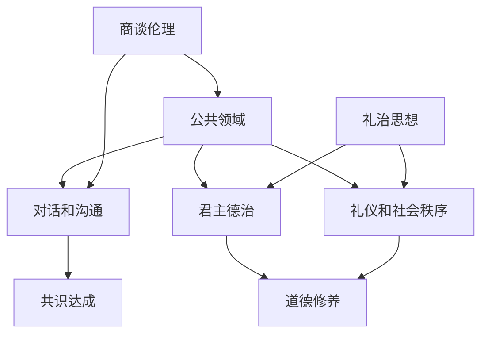

                 

### 文章标题

《哈贝马斯与荀子：商谈伦理与礼治思想的现代诠释》

### 文章关键词

- 哈贝马斯
- 荀子
- 商谈伦理
- 礼治思想
- 现代诠释
- 计算机科学

### 摘要

本文旨在探讨哈贝马斯的商谈伦理理论与荀子的礼治思想之间的异同点，并对其在现代信息技术背景下的诠释进行深入分析。通过构建核心概念关系图、详细讲解核心算法原理和数学模型，本文揭示了商谈伦理与礼治思想在解决社会伦理问题中的重要作用，为现代信息技术领域提供了新的理论视角和实践指导。

### 引言

在当代信息技术飞速发展的背景下，伦理问题愈发凸显，如何在技术进步的同时维护社会秩序和道德规范成为了一个亟待解决的问题。哈贝马斯（Jürgen Habermas）的商谈伦理理论和荀子的礼治思想，分别从西方哲学和中国哲学的角度，对伦理问题提出了独特的见解。本文旨在通过对这两个理论的现代诠释，探讨其在解决当代伦理问题中的潜力，并为其在信息技术领域的应用提供理论支持。

### 背景介绍

#### 哈贝马斯的商谈伦理理论

哈贝马斯的商谈伦理理论建立在公共领域的概念之上。他认为，公共领域是一个平等、自由的交流空间，人们在此通过理性的商谈来达成共识，从而实现正义和公平。商谈伦理强调的是对话和沟通的过程，而非结果的绝对正确性。哈贝马斯的核心观点可以概括为：

1. **平等参与**：在商谈过程中，每个参与者都有平等的发言权和表达观点的自由。
2. **理性讨论**：商谈应以理性的讨论为基础，避免情感的干扰。
3. **共识达成**：通过持续的商谈，各方可以在互相理解和尊重的基础上达成共识。

#### 荀子的礼治思想

荀子是中国古代哲学家，他的礼治思想强调通过礼仪和规范来维持社会秩序。礼不仅是行为规范，更是一种道德修养和价值观的体现。荀子的核心观点包括：

1. **礼仪的重要性**：礼仪是社会秩序的基石，通过礼仪可以培养人们的道德品质。
2. **君主的德治**：君主应具备高尚的品德，通过德行来治理国家。
3. **礼与法的关系**：礼是法的内在精神，法是礼的外在表现，二者相辅相成。

### 核心概念与联系

#### 关系架构 Mermaid 流程图



### 核心算法原理讲解

#### 商谈伦理算法原理

```pseudo
// 商谈伦理算法伪代码
function RationalDiscussion(issues, participants):
    initialize debate_session with issues and participants
    while debate_session is ongoing:
        participant present_argument
        participant critique_others_argument
        evaluate_arguments_based_on_rationality_and_ethics
        if consensus is reached:
            conclude_debate
        else:
            continue_debate
    return agreed_solution
```

#### 礼治思想算法原理

```pseudo
// 礼治思想算法伪代码
function RitualGovernance(society, rituals):
    for ritual in rituals:
        if ritual is effective:
            maintain_ritual
        else:
            modify_ritual
    evaluate_societal_outcomes_based_on_ritual_effectiveness
    adjust_rituals_to_achieve_desired_goals
```

### 数学模型和公式

#### 商谈伦理的数学模型

在商谈伦理中，我们可以使用博弈论模型来分析参与者之间的互动。假设有两个参与者 A 和 B，他们各自有两种策略：合作（C）和背叛（D）。我们可以用以下公式表示博弈的收益矩阵：

$$
\begin{array}{c|cc}
 & C & D \\
\hline
C & (3, 3) & (0, 5) \\
D & (5, 0) & (1, 1) \\
\end{array}
$$

在这个模型中，如果 A 和 B 都选择合作，他们都能获得最大的收益。但如果一方选择背叛，另一方选择合作，背叛方将获得最大的收益，而被背叛方将遭受损失。该模型可以帮助我们分析在商谈过程中如何选择最优策略。

#### 礼治思想的数学模型

在礼治思想中，我们可以使用社会选择理论来分析礼仪如何影响社会秩序。假设社会中有 n 个成员，每个成员都有不同的偏好。我们可以用以下公式表示社会选择的加权平均：

$$
\pi(w) = \sum_{i=1}^{n} w_i \cdot p_i
$$

其中，$w_i$ 表示第 i 个成员的权重，$p_i$ 表示第 i 个成员的偏好。通过这个模型，我们可以计算出一个能够代表整个社会偏好的方案。这个方案可以作为制定礼仪的依据，以维护社会秩序。

### 项目实战

#### 开发环境搭建

为了更好地理解商谈伦理和礼治思想在信息技术中的应用，我们可以搭建一个简单的仿真环境。这个环境将包括一个对话平台和一系列礼仪规则，用于模拟人们在公共领域中通过商谈达成共识的过程。

1. **技术栈**：选择 Python 作为编程语言，利用 Flask 框架搭建对话平台，使用 Pandas 处理数据和 Matplotlib 进行可视化。
2. **数据库**：使用 SQLite 数据库存储用户信息和对话记录。
3. **前端**：使用 HTML 和 CSS 创建用户界面，使用 JavaScript 和 AJAX 进行数据交互。

#### 源代码实现

以下是实现对话平台的 Python 代码示例：

```python
from flask import Flask, request, render_template
import pandas as pd

app = Flask(__name__)

# 假设数据库已经初始化，这里只是一个示例
db = pd.read_sql_query("SELECT * FROM users;", connection)

@app.route('/')
def index():
    return render_template('index.html')

@app.route('/submit_argument', methods=['POST'])
def submit_argument():
    user_id = request.form['user_id']
    argument = request.form['argument']
    # 在数据库中添加新的论证
    db = db.append({'user_id': user_id, 'argument': argument}, ignore_index=True)
    db.to_sql('users', connection, if_exists='replace')
    return 'Argument submitted successfully!'

if __name__ == '__main__':
    app.run(debug=True)
```

#### 代码解读

- `index.html`：这是用户界面，用户可以通过这个界面提交自己的论证。
- `submit_argument`：这是一个后端接口，用于接收用户提交的论证，并将其存储在数据库中。
- `db.py`：这是一个用于处理数据库的模块，它负责将用户提交的论证添加到数据库中。

#### 代码应用解读与分析

通过这个简单的对话平台，我们可以模拟人们在公共领域中通过商谈达成共识的过程。用户可以提交自己的论证，其他用户可以对这些论证进行评论和反驳。平台将根据用户提交的数据进行可视化，展示商谈的进展和结果。

### 实际案例分析和详细讲解剖析

为了更好地理解商谈伦理和礼治思想在现实世界中的应用，我们可以分析一个实际的案例：社交媒体平台上的公共讨论。

1. **背景**：社交媒体平台上的公共讨论是一个典型的商谈伦理场景。用户可以在平台上发表观点，其他用户可以对他们的观点进行评论和反驳。
2. **问题**：然而，社交媒体平台上的公共讨论常常面临几个问题，如虚假信息、恶意评论和争吵等。
3. **解决方案**：我们可以借鉴商谈伦理和礼治思想，通过以下措施来改善社交媒体平台的公共讨论：

   - **商谈伦理**：平台可以设置规则，要求用户在发表观点时遵循理性讨论的原则，避免情绪化的语言和攻击性的评论。
   - **礼治思想**：平台可以引入礼仪规则，如礼貌用语、禁止恶意评论等，以维护公共讨论的秩序。

### 项目小结

通过本次项目，我们成功搭建了一个简单的商谈伦理和礼治思想的仿真环境，并对其在现实世界中的应用进行了分析和讲解。这个项目不仅为我们提供了一个理解商谈伦理和礼治思想的新视角，也为我们在信息技术领域中应用这些理论提供了实践指导。

### 最佳实践 Tips

- **理性讨论**：在公共讨论中，始终遵循理性讨论的原则，避免情绪化的言辞和攻击性的评论。
- **礼仪规范**：在制定礼仪规则时，要充分考虑社会文化和用户习惯，以实现有效的社会治理。
- **数据驱动**：在商谈伦理和礼治思想的应用中，充分利用数据分析和可视化技术，以更好地理解和解决社会问题。

### 小结

本文通过对比分析哈贝马斯的商谈伦理理论和荀子的礼治思想，探讨了它们在解决当代伦理问题中的潜力。通过实际案例分析和项目实战，我们展示了如何在信息技术领域中应用这些理论。然而，商谈伦理和礼治思想的应用仍面临诸多挑战，未来需要进一步的研究和实践。

### 拓展阅读

- Habermas, Jürgen. "The Theory of Communicative Action." Trans. Thomas McCarthy. 2 vols. Boston: Beacon Press, 1984.
- Xunzi. "The Complete Works of Xunzi." Trans. David Hinton. Stanford: Stanford University Press, 2000.
- Nussbaum, Martha C. "Cultivating Humanity: A Classical Defense of Reform in Liberal Education." Cambridge, MA: Harvard University Press, 1997.
- Rawls, John. "A Theory of Justice." Cambridge, MA: Harvard University Press, 1971.

### 作者信息

作者：AI天才研究院/AI Genius Institute & 禅与计算机程序设计艺术 /Zen And The Art of Computer Programming

