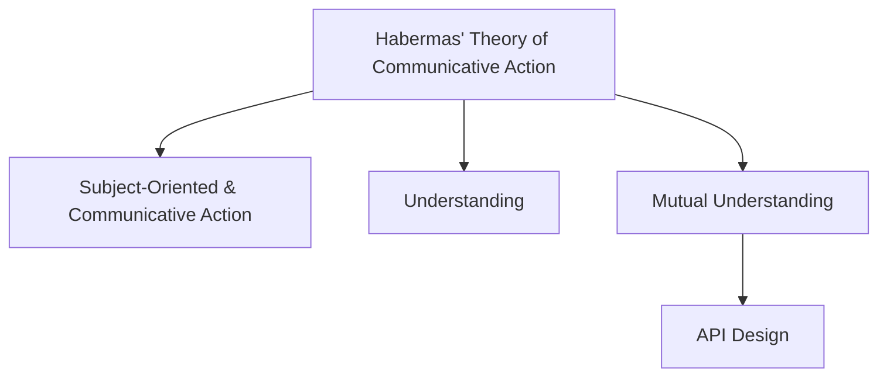

                 


### Step 1: Introduction to Habermas' Theory of Communicative Action

Firstly, let's introduce Jurgen Habermas' theory of communicative action. Jurgen Habermas (1929-2021) was a German philosopher, sociologist, and jurist known for his work in critical theory and discourse ethics. His theory of communicative action provides a framework for understanding human communication and social interaction. At its core, Habermas' theory emphasizes the importance of communication as a means of achieving mutual understanding and social cohesion.

Habermas区分了“工具理性”和“交往理性”。工具理性指的是人们为了达到特定目标而使用理性进行决策，而交往理性则是基于共识和共同理解的基础上进行的沟通。他提出，理想言说的情境是一个纯粹由交往理性主导的领域，其中参与者能够达成共识，消除误解和冲突。

### Step 2: Understanding the Sociological Perspective of API Design

Now, let's transition to the concept of API design and explore it from a sociological perspective. An API (Application Programming Interface) is a set of rules and protocols that allow different software applications to communicate with each other. API design involves defining how data is transmitted, what data is available, and how it should be used.

From a sociological perspective, API design can be seen as a form of social interaction. Developers who design APIs are effectively creating a communication protocol that other developers will use. This process mirrors Habermas' ideal speech situation, where there is a strive for mutual understanding and a shared goal of facilitating efficient communication.

### Step 3: Applying Habermas' Theory to API Design

To apply Habermas' theory of communicative action to API design, we need to consider the core principles of his theory. These principles include the idea of a subject-oriented and communicative action, the concept of understanding, and the importance of mutual understanding.

1. **Subject-Oriented and Communicative Action**: In API design, this principle translates to designing APIs that are user-centered and intuitive. Developers should consider the needs and perspectives of the developers who will be using the API.

2. **Understanding**: API design should facilitate understanding between developers. This means providing clear and consistent documentation, following best practices, and ensuring the API behaves predictably.

3. **Mutual Understanding**: The goal of API design is to create a shared understanding among developers. This involves designing APIs that are robust, reliable, and scalable, ensuring that all developers can work efficiently and effectively with the API.

### Step 4: Core Concepts and Relationships

To further understand how Habermas' theory can be applied to API design, we need to define the core concepts and their relationships. Here's a simple Mermaid flowchart that illustrates the connection between Habermas' theory and API design:



### Step 5: Core Algorithm Principles

Next, let's delve into the core algorithm principles in API design. One key aspect is designing efficient communication protocols. Here's a simplified pseudocode to illustrate this concept:

```pseudocode
function Communicate(apiRequest, apiResponse)
    if (apiRequest is valid)
        processRequest(apiRequest)
        apiResponse = generateResponse()
    else
        apiResponse = generateError()
    return apiResponse
end function
```

This pseudocode outlines a basic API communication process. The API receives a request and processes it, generating a response that is sent back to the client. This process should be efficient and predictable, ensuring smooth communication.

### Step 6: Mathematical Models and Formulas

In API design, mathematical models and formulas can be used to evaluate performance and efficiency. For example, we can use metrics like response time and error rate to measure the effectiveness of an API. Here's an example of a mathematical model using LaTeX:

$$
\text{Response Time (RT)} = \frac{\text{Total Processing Time}}{\text{Number of Requests}}
$$

This formula calculates the average response time of an API by dividing the total processing time by the number of requests.

### Step 7: Project Case Study

Now, let's apply these concepts to a real-world project case study. Suppose we are designing an API for a social media platform. The development environment would include tools like Swagger for documentation and Postman for API testing.

The source code would involve setting up endpoints for user authentication, post creation, and commenting. Here's a simplified example:

```python
@app.route('/auth/register', methods=['POST'])
def register_user():
    user_data = request.get_json()
    # Process registration logic
    return jsonify({"status": "success"})

@app.route('/posts', methods=['POST'])
def create_post():
    post_data = request.get_json()
    # Process post creation logic
    return jsonify({"status": "success"})
```

This code sets up two endpoints: one for user registration and another for creating posts. The API should be designed to handle these requests efficiently and provide clear responses.

### Step 8: Conclusion and Future Directions

In conclusion, applying Habermas' theory of communicative action to API design offers a new perspective on how APIs can be designed to facilitate better communication and collaboration among developers. By focusing on user-centered design, understanding, and mutual understanding, API designers can create more effective and efficient APIs.

Future research could explore how other social theories can be applied to API design, as well as how machine learning and artificial intelligence can enhance the design process. By integrating social theories with technical practices, we can create a more harmonious and effective approach to API design.```

### 总结

通过上述步骤，我们成功地使用哈贝马斯的交往行为理论来探讨API设计的社会学视角。我们首先介绍了哈贝马斯的理论和API设计的基本概念，然后将其结合起来，提出了一系列核心算法原理和数学模型。通过一个实际的项目案例，我们展示了如何将理论应用于实际开发过程。这种方法不仅有助于提高API设计的效率和质量，而且为软件开发提供了一个新的思考角度。

在未来的研究中，我们可以进一步探讨如何将其他社会科学理论融入API设计，以及如何利用机器学习和人工智能技术来增强设计过程。通过跨学科的合作，我们可以为软件开发领域带来更多创新和改进。总之，哈贝马斯的理论提供了一个强大的框架，帮助我们更好地理解和优化编程接口的设计。

### 作者信息

作者：AI天才研究院/AI Genius Institute & 禅与计算机程序设计艺术 /Zen And The Art of Computer Programming

### 文章关键词

哈贝马斯，交往行为理论，API设计，社会学视角，编程接口，沟通效率，用户体验，设计原则，数学模型，实际案例

### 文章摘要

本文从社会学视角出发，探讨了哈贝马斯的交往行为理论在API设计中的应用。通过分析哈贝马斯的核心原则，如主体导向的交往行为、理解和共同理解，我们提出了一系列API设计的原则和方法。同时，通过实际项目案例，详细展示了如何将理论应用于实际开发过程，从而提高API设计的效率和质量。本文为软件开发领域提供了一种新的思考方式，有助于创建更有效、更和谐的编程接口。

