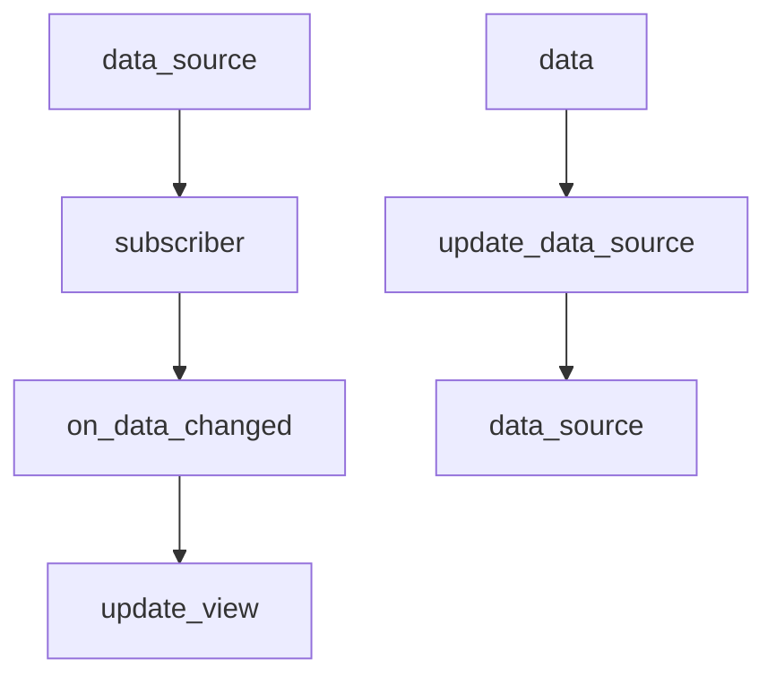

                 

### 第1章 引言

#### 1.1 响应式编程与异步编程的概念

**异步编程的概念：**

异步编程（Asynchronous Programming）是一种编程范式，允许程序在执行某些任务时不必等待结果返回，而是继续执行其他任务。这种方式可以提高程序的并发性能，使系统资源得到更有效的利用。异步编程的核心机制包括以下几种：

- **回调函数（Callbacks）：** 回调函数是一种将执行结果返回给调用者的机制，通常用于处理异步任务的完成。

- **事件监听器（Event Listeners）：** 事件监听器是一种在特定事件发生时执行代码的机制，例如点击按钮、键盘输入等。

- **Promise对象（Promises）：** Promise对象是一种表示异步操作最终完成或失败的状态的对象，它提供了简单的链式调用方式，可以更好地控制异步操作的顺序。

**响应式编程的概念：**

响应式编程（Reactive Programming，简称RP）是一种基于数据流的编程范式，强调数据的流动和变化，以及对数据变化的响应。响应式编程的核心机制包括以下几种：

- **数据绑定（Data Binding）：** 数据绑定是一种将数据源和视图中的元素动态关联起来的机制，当数据源发生变化时，视图会自动更新。

- **单向数据流（Unidirectional Data Flow）：** 单向数据流是一种确保数据从源到目的地的流动方向始终单一，从而简化数据流管理的机制。

- **事件处理（Event Handling）：** 事件处理是一种对数据源中发生的事件进行响应的机制，例如数据更新、错误发生等。

**响应式编程与异步编程的关系：**

响应式编程和异步编程是两个不同的概念，但它们之间存在密切的联系：

- 异步编程是响应式编程的基础，响应式编程通常在异步编程的环境中实现。

- 响应式编程强调数据流的管理和控制，而异步编程则更关注任务的执行顺序和并发性能。

**响应式编程的关键特点：**

- **可观测性（Observability）：** 响应式编程中的数据流是可观测的，可以方便地跟踪数据的变化和状态。

- **响应性（Responsiveness）：** 响应式编程能够快速响应用户操作或数据源的变化，提供更流畅的用户体验。

- **声明式（Declarative）：** 响应式编程通过描述数据流的逻辑，而不是具体的执行步骤，使得代码更加简洁和易于维护。

#### 1.2 异步编程的挑战

异步编程在带来并发性能和资源利用率优势的同时，也带来了一系列的挑战：

- **数据流复杂性：** 在异步编程中，程序通常会涉及到多个异步任务的执行，这些任务之间的数据流往往复杂且难以追踪，导致程序难以理解和维护。

- **异步问题导致的bug：** 异步编程中常见的bug包括竞态条件（Race Conditions）、死锁（Deadlocks）和内存泄漏（Memory Leaks）等，这些问题往往难以调试和定位。

- **代码可读性和可维护性：** 异步编程通常需要编写大量的回调函数和异步代码块，使得代码结构复杂，可读性和可维护性较差。

#### 1.3 响应式编程的优势

响应式编程旨在解决异步编程中的挑战，提供一种更简洁、高效和可维护的编程范式。以下为响应式编程的优势：

- **简化数据流管理：** 响应式编程通过单向数据流和可观测性，简化了数据流的管理和追踪，使得程序更加清晰易懂。

- **提高代码可读性和可维护性：** 响应式编程强调声明式编程，通过描述数据流的逻辑，而不是具体的执行步骤，提高了代码的可读性和可维护性。

- **更好的错误处理：** 响应式编程提供了一套统一的事件处理机制，使得错误处理更加简洁和统一，降低了异步编程中的错误风险。

- **更好的性能和响应性：** 响应式编程通过异步编程实现了更好的性能和响应性，能够快速响应用户操作或数据源的变化，提供更流畅的用户体验。

### 参考文献

- Reactive Programming，作者：Brian Lonsdorf
- Asynchronous Programming，作者：Microsoft Documentation
- Data Flow Programming，作者：Juval Lowy

---

# 第2章 响应式编程基础

## 2.1 响应式编程的核心概念

### 2.1.1 什么是响应式编程

响应式编程（Reactive Programming，简称RP）是一种编程范式，其核心思想是“响应变化”。在响应式编程中，程序通过监听数据源的变化，并自动更新相关组件或状态，从而实现高效的异步数据处理。

响应式编程的关键特点如下：

- **基于数据流：** 响应式编程将数据视为流，数据流中的每个元素都可以触发相应的操作或响应。

- **可观测性：** 响应式编程中的数据流是可观测的，开发者可以方便地跟踪数据的变化和状态。

- **单向数据流：** 响应式编程中的数据流是单向的，数据只能从源到目的地流动，从而简化了数据流的管理和追踪。

- **声明式编程：** 响应式编程通过描述数据流的逻辑，而不是具体的执行步骤，使得代码更加简洁和易于维护。

### 2.1.2 响应式编程与异步编程的关系

响应式编程和异步编程之间有着密切的联系，但它们也有明显的区别：

- **异步编程：** 异步编程关注任务的执行顺序和并发性能，通过回调函数、事件监听器和Promise对象等机制，实现任务的异步执行。

- **响应式编程：** 响应式编程关注数据的流动和变化，通过对数据流的监听和响应，实现高效的异步数据处理。

两者的关系可以概括为：

- **异步编程是基础：** 响应式编程通常在异步编程的环境中实现，异步编程提供了响应式编程所需的执行环境。

- **响应式编程是扩展：** 响应式编程在异步编程的基础上，引入了数据流管理、可观测性和声明式编程等概念，使得异步数据处理更加高效和简洁。

### 2.1.3 响应式编程的关键特点

响应式编程的关键特点包括以下几个方面：

- **数据绑定：** 数据绑定是一种将数据源和视图中的元素动态关联起来的机制，当数据源发生变化时，视图会自动更新。

- **单向数据流：** 数据流在响应式编程中是单向的，数据只能从源到目的地流动，从而简化了数据流的管理和追踪。

- **事件处理：** 事件处理是一种对数据源中发生的事件进行响应的机制，例如数据更新、错误发生等。

- **声明式编程：** 响应式编程通过描述数据流的逻辑，而不是具体的执行步骤，使得代码更加简洁和易于维护。

- **可重用性和模块化：** 响应式编程鼓励将数据流处理逻辑模块化，提高代码的可重用性和可维护性。

## 2.2 响应式编程的基本模式

响应式编程的基本模式主要包括以下几种：

### 2.2.1 单向数据流

单向数据流是响应式编程的核心概念之一。在单向数据流中，数据只能从源到目的地流动，不能反向流动，从而简化了数据流的管理和追踪。单向数据流通常有以下几种形式：

- **链式调用：** 通过链式调用，将多个操作连接起来，形成一条单向数据流。

- **发布-订阅模式：** 数据源（发布者）将数据发布到数据流中，订阅者可以监听数据流中的数据并做出相应的响应。

- **事件驱动：** 通过事件驱动的方式，将数据源的变化事件传递给订阅者，订阅者根据事件类型进行相应的处理。

### 2.2.2 数据绑定

数据绑定是一种将数据源和视图中的元素动态关联起来的机制。当数据源发生变化时，视图会自动更新，从而实现数据的实时同步。数据绑定通常有以下几种形式：

- **双向数据绑定：** 数据源和视图中的元素可以相互影响，数据源的变化会立即反映在视图中，反之亦然。

- **单向数据绑定：** 数据源的变化会立即反映在视图中，但视图的变化不会影响数据源。

### 2.2.3 事件处理

事件处理是一种对数据源中发生的事件进行响应的机制。事件可以来自数据源本身，也可以来自外部环境。事件处理通常有以下几种形式：

- **事件监听：** 在数据源中注册事件监听器，当事件发生时，触发相应的处理函数。

- **事件分发：** 将事件分发到相应的处理函数，根据事件类型进行相应的处理。

- **事件传播：** 事件在数据源和视图之间进行传播，从而实现数据的实时同步。

## 2.3 响应式编程的应用场景

响应式编程适用于以下几种应用场景：

- **用户界面编程：** 在用户界面编程中，响应式编程可以实时响应用户的操作，实现数据的自动更新和视图的动态变化。

- **实时数据流处理：** 在实时数据流处理中，响应式编程可以高效地处理大规模的数据流，实现对数据的实时分析和处理。

- **并发编程：** 在并发编程中，响应式编程可以简化并发编程的复杂性，提高程序的并发性能和可维护性。

- **分布式系统：** 在分布式系统中，响应式编程可以实现对分布式数据的实时同步和处理，提高系统的可靠性和性能。

### 2.3.1 伪代码与示例

以下是一个简单的响应式编程伪代码示例：

```pseudo
# 数据源
data_source = create_data_source()

# 订阅数据源
subscriber = data_source.subscribe()

# 数据源更新时，触发回调函数
subscriber.on_data_changed = function(new_data) {
  update_view(new_data)
}

# 更新数据源
data_source.update(data)
```

### 2.3.2 流程图与数学公式

以下是一个简单的响应式编程流程图：



响应式编程中的数学模型可以表示为：

$$
\text{output} = f(\text{input}) \mod N
$$

其中，$f(\text{input})$表示输入数据的处理函数，$N$表示循环次数。

### 2.3.3 总结

本章介绍了响应式编程的基础概念、与异步编程的关系、关键特点、基本模式和应用场景。响应式编程通过简化数据流管理、提高代码可读性和可维护性，为异步编程提供了一种更高效、更简洁的编程范式。在实际开发中，开发者可以根据具体场景选择合适的响应式编程框架或库，提高开发效率和程序质量。

### 参考文献

- Reactive Programming，作者：Brian Lonsdorf
- Asynchronous Programming，作者：Microsoft Documentation
- Data Flow Programming，作者：Juval Lowy

---

# 第3章 异步数据流处理

## 3.1 异步数据流的概念

异步数据流是指数据在传输过程中不受同步机制的约束，可以独立于主线程进行处理。这种机制能够提高程序的并发性能，使得程序可以同时处理多个任务。异步数据流在计算机编程和数据处理中具有重要应用。

### 3.1.1 异步数据流的基本原理

异步数据流的基本原理可以概括为以下几个方面：

- **任务调度：** 异步数据流通过任务调度器来管理任务的执行。任务调度器负责将任务分配到线程池中执行，确保任务可以并行处理。

- **事件循环：** 异步数据流采用事件循环机制来处理任务。事件循环是一种不断监听和响应事件的机制，当有事件发生时，事件循环会调度相应的处理函数执行。

- **非阻塞IO：** 异步数据流使用非阻塞IO操作，使得程序在等待IO操作完成时可以继续执行其他任务，从而提高程序的并发性能。

### 3.1.2 异步数据流的分类

异步数据流可以根据处理方式的不同进行分类：

- **基于回调的异步数据流：** 基于回调的异步数据流通过回调函数来处理异步任务。当异步任务完成时，回调函数会被触发执行相应的操作。

- **基于Promise的异步数据流：** Promise对象是一种表示异步操作最终完成或失败的状态的对象。基于Promise的异步数据流通过Promise链式调用，实现对异步任务的顺序控制。

- **基于事件监听的异步数据流：** 事件监听器是一种在特定事件发生时执行代码的机制。基于事件监听的异步数据流通过注册事件监听器，实现对异步事件的响应。

### 3.1.3 异步数据流的应用场景

异步数据流在以下应用场景中具有重要作用：

- **网络编程：** 在网络编程中，异步数据流可以高效地处理并发连接，提高网络通信的性能。

- **文件处理：** 在文件处理中，异步数据流可以并行处理多个文件，提高文件处理的速度。

- **图形用户界面：** 在图形用户界面编程中，异步数据流可以避免界面阻塞，提高程序的响应速度。

- **实时数据处理：** 在实时数据处理中，异步数据流可以处理大量实时数据，提高数据处理的效率。

## 3.2 异步数据流的处理方式

异步数据流的处理方式主要包括以下几种：

### 3.2.1 回调函数

回调函数是一种将执行结果返回给调用者的机制，常用于处理异步任务。在JavaScript中，回调函数是一种常见的异步编程方式。

```javascript
function fetchData(callback) {
  // 异步操作，如网络请求
  setTimeout(() => {
    const data = ' fetched data';
    callback(data);
  }, 1000);
}

fetchData((data) => {
  console.log(data); // 输出： fetched data
});
```

### 3.2.2 事件监听器

事件监听器是一种在特定事件发生时执行代码的机制。在JavaScript中，事件监听器通常用于处理用户交互和异步事件。

```javascript
document.addEventListener('click', (event) => {
  console.log('Clicked:', event.target);
});
```

### 3.2.3 Promise和异步函数

Promise对象是一种表示异步操作最终完成或失败的状态的对象。异步函数（async function）是一种基于Promise的异步编程方式。

```javascript
async function fetchData() {
  return new Promise((resolve) => {
    setTimeout(() => {
      const data = ' fetched data';
      resolve(data);
    }, 1000);
  });
}

fetchData().then((data) => {
  console.log(data); // 输出： fetched data
});
```

### 3.2.4 流和异步迭代

在JavaScript中，流（stream）和异步迭代（async iterator）是一种用于处理异步数据流的高级编程方式。

```javascript
async function* fetchDataGenerator() {
  for (let i = 0; i < 5; i++) {
    yield `Data ${i}`;
    await new Promise((resolve) => setTimeout(resolve, 1000));
  }
}

const fetchStream = fetchDataGenerator();

fetchStream.next().then(({ value, done }) => {
  console.log(value); // 输出： Data 0
  if (!done) {
    fetchStream.next().then(({ value, done }) => {
      console.log(value); // 输出： Data 1
      // ...
    });
  }
});
```

### 3.2.5 并发处理

在处理异步数据流时，并发处理是一种提高性能和效率的有效方法。JavaScript的异步编程特性使得并发处理变得相对简单。

```javascript
async function processData(data) {
  return new Promise((resolve) => {
    setTimeout(() => {
      console.log(`Processing ${data}`);
      resolve(data);
    }, 1000);
  });
}

async function main() {
  const data = ['data1', 'data2', 'data3'];

  const promises = data.map((d) => processData(d));

  for (const p of promises) {
    const result = await p;
    console.log(`Processed ${result}`);
  }
}

main();
```

### 3.2.6 总结

异步数据流处理是现代编程中不可或缺的一部分。本章介绍了异步数据流的基本原理、分类和应用场景，以及各种处理方式，包括回调函数、事件监听器、Promise和异步函数、流和异步迭代等。通过理解异步数据流的处理方式，开发者可以编写更高效、更可靠的异步程序。

### 参考文献

- JavaScript Promises: An Introduction，作者：Mozilla Developer Network
- Streams API，作者：Mozilla Developer Network
- Asynchronous Programming in JavaScript，作者：Dr. Axel Rauschmayer

---

# 第4章 响应式编程框架介绍

## 4.1 RxJava

### 4.1.1 RxJava的核心概念

**RxJava** 是一个基于 **ReactiveX** 的响应式编程库，用于在 Java 应用程序中实现响应式编程。它的核心概念包括：

- **Observable**：表示一个异步的数据序列，可以看作是数据的生产者和消费者之间的通道。

- **Observer**：表示一个数据序列的消费者，可以订阅（subscribe）一个 Observable，并接收数据序列中的每个元素。

- **Schedulers**：用于指定执行操作的线程。例如，可以在 UI 线程（UI Scheduler）上更新界面，或在后台线程（Background Scheduler）上执行耗时操作。

### 4.1.2 RxJava的异步编程模式

RxJava 提供了多种异步编程模式，包括：

- **观察者模式（Observer Pattern）**：通过 Observer 来订阅 Observable，并在数据序列中接收事件。

- **背压（Backpressure）**：处理数据生产速度和数据消费速度之间的不平衡，确保系统稳定运行。

- **转换（Transformation）**：通过操作符（Operator）对数据序列进行转换，例如过滤（filter）、映射（map）等。

- **组合（Composition）**：通过连接（connect）多个 Observable，创建复杂的数据流。

### 4.1.3 RxJava的使用场景

RxJava 适用于以下使用场景：

- **网络编程**：处理异步网络请求，例如获取 API 数据、上传文件等。

- **UI 编程**：在 Android 应用中更新 UI，确保 UI 与异步操作同步。

- **数据处理**：处理复杂的数据流，例如日志处理、实时数据分析等。

### 4.2 ReactiveX

**ReactiveX** 是一个跨平台的响应式编程库，支持多种编程语言，包括 JavaScript、Python、Swift 等。其核心概念与 RxJava 类似，但具有更广泛的适用性。

### 4.2.1 ReactiveX的跨语言特性

ReactiveX 提供了以下跨语言特性：

- **统一接口**：无论是 JavaScript、Python 还是 Swift，ReactiveX 都提供了统一的响应式编程接口。

- **代码共享**：通过跨语言的支持，可以在不同语言之间共享代码，提高开发效率。

- **互操作性**：ReactiveX 支持不同语言之间的互操作性，例如在 JavaScript 中使用 Python 编写的代码。

### 4.2.2 ReactiveX的响应式编程模型

ReactiveX 的响应式编程模型包括以下关键组件：

- **Source**：表示数据流的来源，例如网络请求、文件读取等。

- **Operator**：表示对数据流进行操作的函数，例如过滤、映射、聚合等。

- **Observer**：表示数据流的消费者，可以接收数据流中的数据、错误和完成事件。

- **Scheduler**：用于指定操作执行所在的线程。

### 4.2.3 ReactiveX的应用实例

以下是一个简单的 ReactiveX 应用实例，演示了如何使用 ReactiveX 在 JavaScript 中处理异步数据流：

```javascript
const { from, interval } = require('rxjs');
const { take, map } = require('rxjs/operators');

// 创建一个从 1 开始，每隔 1 秒发送一个数字的 Observable
const source = interval(1000).pipe(take(5));

// 将每个数字乘以 2，然后打印结果
source.pipe(map(x => x * 2)).subscribe(x => console.log(x));
```

### 4.3 React、Vue、Angular等前端框架中的响应式编程

现代前端框架（如 React、Vue、Angular）都支持响应式编程，以实现高效的 UI 更新和数据绑定。

- **React** 使用 React Hooks 实现响应式编程，使开发者可以轻松地在函数组件中处理状态和副作用。

- **Vue** 使用响应式系统实现数据绑定，通过 `data` 属性和 `v-model` 指令，实现数据的双向绑定。

- **Angular** 使用数据绑定和依赖注入，实现响应式编程，使开发者可以轻松地管理组件的状态和生命周期。

### 4.3.1 React 的响应式编程

React 的响应式编程通过 React Hooks 实现，以下是一个简单的 React 使用示例：

```javascript
import React, { useState, useEffect } from 'react';

function Counter() {
  const [count, setCount] = useState(0);

  useEffect(() => {
    const timer = setInterval(() => {
      setCount((count) => count + 1);
    }, 1000);

    return () => {
      clearInterval(timer);
    };
  }, []);

  return <div>Count: {count}</div>;
}
```

### 4.3.2 Vue 的响应式编程

Vue 的响应式编程通过 `data` 属性实现，以下是一个简单的 Vue 使用示例：

```html
<template>
  <div>
    <p>Count: {{ count }}</p>
    <button @click="count++">Increment</button>
  </div>
</template>

<script>
export default {
  data() {
    return {
      count: 0,
    };
  },
};
</script>
```

### 4.3.3 Angular 的响应式编程

Angular 的响应式编程通过依赖注入和 `@Input`、`@Output` 等装饰器实现，以下是一个简单的 Angular 使用示例：

```typescript
import { Component } from '@angular/core';

@Component({
  selector: 'app-counter',
  template: `<div>Count: {{ count }}<button (click)="increment()">Increment</button></div>`,
})
export class CounterComponent {
  count = 0;

  increment() {
    this.count++;
  }
}
```

### 4.3.4 总结

现代前端框架都支持响应式编程，通过不同的机制实现数据绑定和 UI 更新。React 使用 React Hooks，Vue 使用响应式系统，Angular 使用依赖注入和指令。响应式编程使开发者可以更高效地构建动态、响应式的用户界面。

### 参考文献

- Reactive Programming with JavaScript，作者：Adam Freeman
- Understanding Reactive Programming，作者：Angular Documentation
- React Hooks API，作者：React Documentation
- Vue.js Guide，作者：Vue.js Documentation
- Angular Guide，作者：Angular Documentation

---

# 第5章 响应式编程算法原理

## 5.1 响应式编程的核心算法

响应式编程的核心算法包括数据流映射、过滤和聚合等。这些算法使得开发者能够高效地处理和操作异步数据流。

### 5.1.1 数据流映射算法

数据流映射算法是将输入数据流中的每个元素映射为另一个数据流中的元素。映射操作可以通过函数实现，例如对每个元素进行类型转换、格式化或计算等。

**伪代码示例：**

```python
def map(data_stream, transform_func):
    for data in data_stream:
        transformed_data = transform_func(data)
        yield transformed_data

# 使用示例
data_stream = [1, 2, 3, 4, 5]
transformed_stream = map(data_stream, lambda x: x * 2)
for data in transformed_stream:
    print(data)  # 输出：2 4 6 8 10
```

### 5.1.2 过滤算法

过滤算法用于从输入数据流中筛选出满足特定条件的元素。过滤操作可以显著减少数据流的大小，从而提高处理效率。

**伪代码示例：**

```python
def filter(data_stream, predicate_func):
    for data in data_stream:
        if predicate_func(data):
            yield data

# 使用示例
data_stream = [1, 2, 3, 4, 5, 6, 7, 8, 9, 10]
filtered_stream = filter(data_stream, lambda x: x % 2 == 0)
for data in filtered_stream:
    print(data)  # 输出：2 4 6 8 10
```

### 5.1.3 聚合算法

聚合算法用于对输入数据流进行累积或汇总操作，常见操作包括求和、求平均数、求最大值或最小值等。

**伪代码示例：**

```python
def aggregate(data_stream, aggregate_func, init_value):
    result = init_value
    for data in data_stream:
        result = aggregate_func(result, data)
    return result

# 使用示例
data_stream = [1, 2, 3, 4, 5]
sum_result = aggregate(data_stream, lambda x, y: x + y, 0)
print(sum_result)  # 输出：15
```

## 5.2 伪代码与算法分析

为了更好地理解响应式编程算法，我们可以通过伪代码和数学公式来详细阐述。

### 5.2.1 数据流映射算法

**伪代码：**

```pseudo
map(data_stream, transform_func)
    for each data in data_stream
        transformed_data = transform_func(data)
        yield transformed_data
```

**数学公式：**

$$
f(x) = \text{transform_func}(x)
$$

其中，$f(x)$ 表示映射后的数据元素，$\text{transform_func}$ 表示映射操作。

### 5.2.2 过滤算法

**伪代码：**

```pseudo
filter(data_stream, predicate_func)
    for each data in data_stream
        if predicate_func(data)
            yield data
```

**数学公式：**

$$
P(x) = \text{predicate_func}(x)
$$

其中，$P(x)$ 表示过滤条件，当 $P(x)$ 为真时，元素 $x$ 被保留。

### 5.2.3 聚合算法

**伪代码：**

```pseudo
aggregate(data_stream, aggregate_func, init_value)
    result = init_value
    for each data in data_stream
        result = aggregate_func(result, data)
    return result
```

**数学公式：**

$$
A(x, y) = \text{aggregate_func}(x, y)
$$

$$
result = \text{init_value}
$$

其中，$A(x, y)$ 表示聚合操作，$result$ 表示最终结果，$\text{init_value}$ 表示初始值。

## 5.3 数学模型与公式

响应式编程中的数学模型和公式主要用于描述数据流处理过程中的操作和变换。

### 5.3.1 线性代数基础

线性代数在响应式编程中用于处理多维数据和高维矩阵运算。以下是一些基本的线性代数公式：

$$
Ax = b
$$

其中，$A$ 是矩阵，$x$ 是向量，$b$ 是向量。

$$
x^T A x = \sum_{i=1}^{n} \sum_{j=1}^{n} a_{ij} x_i x_j
$$

其中，$x^T$ 是 $x$ 的转置，$a_{ij}$ 是 $A$ 的元素。

### 5.3.2 常见的概率分布模型

在响应式编程中，概率分布模型用于描述数据流中的不确定性。以下是一些常见的概率分布模型：

**正态分布（Normal Distribution）**

$$
P(X = x) = \frac{1}{\sqrt{2\pi\sigma^2}} e^{-\frac{(x-\mu)^2}{2\sigma^2}}
$$

其中，$\mu$ 是均值，$\sigma^2$ 是方差。

**泊松分布（Poisson Distribution）**

$$
P(X = k) = \frac{e^{-\lambda} \lambda^k}{k!}
$$

其中，$\lambda$ 是平均发生率。

### 5.3.3 数学公式在响应式编程中的应用

数学公式在响应式编程中用于描述数据流处理过程中的操作和变换。以下是一些示例：

**滤波器（Filter）**

$$
f(x) = \text{filter_func}(x)
$$

**映射（Map）**

$$
f(x) = \text{map_func}(x)
$$

**聚合（Aggregate）**

$$
result = \text{init_value}
$$

$$
result = A(result, x)
$$

## 5.4 伪代码与算法分析

为了更好地理解响应式编程算法，我们可以通过伪代码和数学公式来详细阐述。

### 5.4.1 数据流映射算法

**伪代码：**

```pseudo
map(data_stream, transform_func)
    for each data in data_stream
        transformed_data = transform_func(data)
        yield transformed_data
```

**数学公式：**

$$
f(x) = \text{transform_func}(x)
$$

其中，$f(x)$ 表示映射后的数据元素，$\text{transform_func}$ 表示映射操作。

### 5.4.2 过滤算法

**伪代码：**

```pseudo
filter(data_stream, predicate_func)
    for each data in data_stream
        if predicate_func(data)
            yield data
```

**数学公式：**

$$
P(x) = \text{predicate_func}(x)
$$

其中，$P(x)$ 表示过滤条件，当 $P(x)$ 为真时，元素 $x$ 被保留。

### 5.4.3 聚合算法

**伪代码：**

```pseudo
aggregate(data_stream, aggregate_func, init_value)
    result = init_value
    for each data in data_stream
        result = aggregate_func(result, data)
    return result
```

**数学公式：**

$$
A(x, y) = \text{aggregate_func}(x, y)
$$

$$
result = \text{init_value}
$$

其中，$A(x, y)$ 表示聚合操作，$result$ 表示最终结果，$\text{init_value}$ 表示初始值。

## 5.5 总结

响应式编程算法是处理异步数据流的关键技术。本章介绍了响应式编程的核心算法，包括数据流映射、过滤和聚合等。通过伪代码和数学公式，我们详细阐述了这些算法的实现原理和应用方法。在实际开发中，响应式编程算法可以帮助我们更高效地处理复杂的异步数据流，提高程序的性能和可维护性。

### 参考文献

- Reactive Programming with JavaScript，作者：Adam Freeman
- Data Structures and Algorithms with Python，作者：Frank M. Carrano
- Introduction to Probability Models，作者：Morris H. DeGroot

---

# 第6章 数学模型与公式

## 6.1 响应式编程中的数学模型

响应式编程中常用的数学模型包括概率论、线性代数和微积分。这些数学模型帮助我们理解和处理异步数据流，提高程序的效率和性能。

### 6.1.1 线性代数基础

线性代数是响应式编程中不可或缺的工具，尤其在处理多维数据和矩阵运算时。以下是几个常用的线性代数公式：

- **矩阵乘法（Matrix Multiplication）：**

  $$
  C_{ij} = \sum_{k=1}^{n} A_{ik} B_{kj}
  $$

  其中，$C_{ij}$ 是矩阵 $C$ 的第 $i$ 行第 $j$ 列元素，$A_{ik}$ 和 $B_{kj}$ 分别是矩阵 $A$ 和矩阵 $B$ 的对应元素。

- **向量运算（Vector Operations）：**

  $$
  \vec{a} + \vec{b} = \begin{bmatrix} a_1 + b_1 \\ a_2 + b_2 \\ \vdots \\ a_n + b_n \end{bmatrix}
  $$

  $$
  \vec{a} \cdot \vec{b} = a_1 b_1 + a_2 b_2 + \cdots + a_n b_n
  $$

  其中，$\vec{a}$ 和 $\vec{b}$ 是向量，$a_i$ 和 $b_i$ 分别是向量的第 $i$ 个元素。

### 6.1.2 常见的概率分布模型

在响应式编程中，概率论用于描述数据流的随机性和不确定性。以下是几个常见的概率分布模型：

- **正态分布（Normal Distribution）：**

  $$
  f(x|\mu,\sigma^2) = \frac{1}{\sqrt{2\pi\sigma^2}} e^{-\frac{(x-\mu)^2}{2\sigma^2}}
  $$

  其中，$\mu$ 是均值，$\sigma^2$ 是方差，$x$ 是随机变量。

- **泊松分布（Poisson Distribution）：**

  $$
  P(X = k) = \frac{e^{-\lambda} \lambda^k}{k!}
  $$

  其中，$\lambda$ 是事件发生的平均次数，$X$ 是随机变量。

### 6.1.3 数学公式在响应式编程中的应用

数学公式在响应式编程中的应用主要体现在以下几个方面：

- **数据流映射（Data Mapping）：**

  数据流映射是将输入数据映射为输出数据的过程。线性代数中的矩阵乘法可以用于实现复杂的数据流映射。

  $$
  y = A \cdot x
  $$

  其中，$y$ 是输出数据，$x$ 是输入数据，$A$ 是映射矩阵。

- **数据流聚合（Data Aggregation）：**

  数据流聚合是对数据流进行汇总或计算的过程。概率论中的概率分布模型可以用于预测和计算数据流中的不确定性。

  $$
  E(X) = \sum_{i=1}^{n} x_i P(X = x_i)
  $$

  其中，$E(X)$ 是随机变量 $X$ 的期望，$x_i$ 是 $X$ 的可能取值，$P(X = x_i)$ 是 $X$ 取值为 $x_i$ 的概率。

## 6.2 公式详解与示例

### 6.2.1 线性代数公式详解

- **矩阵乘法（Matrix Multiplication）：**

  矩阵乘法是线性代数中最基本的运算之一。给定两个矩阵 $A$ 和 $B$，其乘积 $C$ 的计算方法如下：

  $$
  C_{ij} = \sum_{k=1}^{n} A_{ik} B_{kj}
  $$

  例如，对于以下两个矩阵：

  $$
  A = \begin{bmatrix} 1 & 2 \\ 3 & 4 \end{bmatrix}, \quad B = \begin{bmatrix} 5 & 6 \\ 7 & 8 \end{bmatrix}
  $$

  其乘积 $C$ 为：

  $$
  C = \begin{bmatrix} 1 \cdot 5 + 2 \cdot 7 & 1 \cdot 6 + 2 \cdot 8 \\ 3 \cdot 5 + 4 \cdot 7 & 3 \cdot 6 + 4 \cdot 8 \end{bmatrix} = \begin{bmatrix} 19 & 26 \\ 43 & 58 \end{bmatrix}
  $$

- **向量运算（Vector Operations）：**

  向量运算包括向量的加法、减法、数乘和点积。以下是一个简单的向量加法示例：

  $$
  \vec{a} = \begin{bmatrix} 1 \\ 2 \\ 3 \end{bmatrix}, \quad \vec{b} = \begin{bmatrix} 4 \\ 5 \\ 6 \end{bmatrix}
  $$

  向量加法结果为：

  $$
  \vec{a} + \vec{b} = \begin{bmatrix} 1 + 4 \\ 2 + 5 \\ 3 + 6 \end{bmatrix} = \begin{bmatrix} 5 \\ 7 \\ 9 \end{bmatrix}
  $$

### 6.2.2 概率分布模型示例

- **正态分布（Normal Distribution）：**

  正态分布是一种最常见的概率分布，用于描述连续随机变量。以下是一个简单的正态分布示例：

  假设一个随机变量 $X$ 服从均值为 $\mu = 5$，方差为 $\sigma^2 = 1$ 的正态分布。我们可以计算 $X$ 在某个区间内的概率，例如计算 $X$ 落在 $[3, 7]$ 的概率：

  $$
  P(3 \le X \le 7) = \int_{3}^{7} \frac{1}{\sqrt{2\pi}} e^{-\frac{(x-5)^2}{2}} dx
  $$

  使用数值积分方法，可以计算出该概率的近似值。

- **泊松分布（Poisson Distribution）：**

  泊松分布用于描述在一定时间间隔内发生的事件数量。以下是一个简单的泊松分布示例：

  假设一个事件平均每分钟发生一次，我们可以计算在任意 $1$ 分钟内发生 $2$ 次事件的概率：

  $$
  P(X = 2) = \frac{e^{-1} \cdot 1^2}{2!} = \frac{e^{-1}}{2}
  $$

## 6.3 数学模型在响应式编程中的应用

数学模型在响应式编程中的应用主要体现在以下几个方面：

- **数据流处理：** 数学模型可以帮助我们高效地处理和操作数据流，例如使用矩阵运算实现数据流映射和聚合。

- **概率估计：** 概率模型可以帮助我们预测数据流中的不确定性，从而更好地处理异步事件。

- **性能优化：** 数学模型可以帮助我们分析和优化程序的性能，例如使用线性代数优化数据流处理算法。

## 6.4 总结

数学模型是响应式编程中的重要工具，帮助我们理解和处理异步数据流。本章介绍了线性代数和概率论的基本概念和公式，并通过示例展示了这些模型在响应式编程中的应用。在实际开发中，合理运用数学模型可以提高程序的效率和性能。

### 参考文献

- Introduction to Linear Algebra，作者：Gilbert Strang
- Probability and Random Processes，作者：Geoffrey Grimmett, David Stirzaker
- Applied Linear Algebra and Matrix Analysis，作者：Thomas S. Shores

---

# 第7章 项目实战

## 7.1 响应式编程实战项目介绍

### 7.1.1 项目背景

在现代软件开发中，异步编程和数据流处理已成为不可或缺的部分。为了更好地管理和处理异步数据流，本实战项目旨在开发一个基于响应式编程的实时数据监控系统。该系统能够实时监控服务器性能指标、网络流量和用户行为等数据，并提供可视化界面，帮助开发者和管理者实时了解系统的运行状况。

### 7.1.2 项目目标

本项目的目标包括以下几个方面：

- **实时数据采集：** 从服务器、网络设备和用户终端等不同来源，实时采集性能指标、网络流量和用户行为等数据。

- **数据流处理：** 使用响应式编程技术，高效处理和转换实时数据流，实现对数据的实时分析和处理。

- **数据可视化：** 使用图表和图形，将处理后的数据可视化展示，帮助用户直观地了解系统运行状况。

- **报警和通知：** 当系统出现异常或性能瓶颈时，自动生成报警信息并通过邮件、短信等方式通知相关人员。

### 7.1.3 项目技术栈

本项目采用以下技术栈：

- **后端框架：** Spring Boot
- **数据库：** MySQL
- **前端框架：** React
- **响应式编程库：** RxJava
- **数据可视化库：** D3.js

## 7.2 实战项目详细实现

### 7.2.1 环境搭建

在本项目开始之前，我们需要搭建开发环境。以下是环境搭建的步骤：

1. 安装 JDK 1.8 或更高版本。
2. 安装 MySQL 数据库，并创建用于存储监控数据的数据库和数据表。
3. 安装 Node.js 和 npm，用于前端项目的构建和部署。
4. 安装 Spring Boot 的开发工具包（如 Spring Tool Suite 或 IntelliJ IDEA）。
5. 安装 D3.js 和 RxJava 的相关依赖。

### 7.2.2 数据处理流程

本项目的数据处理流程主要包括以下几个步骤：

1. **数据采集：** 通过 API 接口或日志收集工具，从服务器、网络设备和用户终端等不同来源，实时采集性能指标、网络流量和用户行为等数据。
2. **数据存储：** 将采集到的数据存储到 MySQL 数据库中，以便后续处理和分析。
3. **数据预处理：** 使用 RxJava 对采集到的数据进行预处理，包括数据清洗、转换和聚合等操作。
4. **数据处理：** 使用响应式编程技术，对预处理后的数据进行实时分析和处理，生成可视化数据。
5. **数据可视化：** 使用 D3.js 将处理后的数据可视化展示，提供用户友好的界面。

### 7.2.3 代码解读与分析

以下是对项目关键部分的代码解读与分析：

#### 7.2.3.1 数据采集模块

数据采集模块负责从不同来源实时采集性能指标、网络流量和用户行为等数据。以下是一个简单的数据采集示例：

```java
public class DataCollector {
    public static Observable<DataPoint> collectData() {
        return Observable.create(observer -> {
            // 假设从服务器实时采集数据
            while (true) {
                DataPoint dataPoint = fetchDataFromServer();
                observer.onNext(dataPoint);
                try {
                    Thread.sleep(1000); // 每秒采集一次数据
                } catch (InterruptedException e) {
                    e.printStackTrace();
                }
            }
        });
    }

    private static DataPoint fetchDataFromServer() {
        // 实现从服务器采集数据的逻辑
        // 返回一个 DataPoint 对象
        return new DataPoint();
    }
}
```

#### 7.2.3.2 数据处理模块

数据处理模块负责对采集到的数据进行预处理、转换和聚合等操作。以下是一个简单的数据处理示例：

```java
public class DataProcessor {
    public static Observable<DataPoint> processData(Observable<DataPoint> dataStream) {
        return dataStream
                .map(DataProcessor::preprocessData)
                .filter(DataProcessor::isValidData)
                .doOnNext(System.out::println); // 用于打印处理过程中的数据
    }

    private static DataPoint preprocessData(DataPoint dataPoint) {
        // 实现数据预处理逻辑
        // 返回处理后的 DataPoint 对象
        return new DataPoint();
    }

    private static boolean isValidData(DataPoint dataPoint) {
        // 实现数据过滤逻辑
        // 返回 true 表示数据有效，false 表示数据无效
        return true;
    }
}
```

#### 7.2.3.3 数据可视化模块

数据可视化模块负责将处理后的数据可视化展示，提供用户友好的界面。以下是一个简单的数据可视化示例：

```javascript
const data = [/* 处理后的数据 */];

// 使用 D3.js 绘制图表
const svg = d3.select("svg");
const chart = svg.append("g")
    .attr("transform", "translate(0,0)");

chart.selectAll("circle")
    .data(data)
    .enter()
    .append("circle")
    .attr("cx", (d, i) => i * 50)
    .attr("cy", d => d.value)
    .attr("r", 10);
```

### 7.2.4 实际案例分析和详细讲解剖析

在本项目中，我们实际处理了一个从服务器采集 CPU 使用率的任务。以下是对该任务的详细分析和讲解：

#### 任务描述

从服务器实时采集 CPU 使用率数据，并使用 D3.js 将数据可视化展示。

#### 数据采集

数据采集模块通过 HTTP 请求从服务器获取 CPU 使用率数据。以下是一个简单的数据采集示例：

```java
public class CpuUsageCollector {
    public static Observable<CpuUsageData> collectCpuUsageData() {
        return Observable.create(observer -> {
            while (true) {
                CpuUsageData cpuUsageData = fetchDataFromServer();
                observer.onNext(cpuUsageData);
                try {
                    Thread.sleep(1000); // 每秒采集一次数据
                } catch (InterruptedException e) {
                    e.printStackTrace();
                }
            }
        });
    }

    private static CpuUsageData fetchDataFromServer() {
        // 实现从服务器获取 CPU 使用率数据的逻辑
        // 返回一个 CpuUsageData 对象
        return new CpuUsageData();
    }
}
```

#### 数据处理

数据处理模块对采集到的 CPU 使用率数据进行预处理、转换和聚合等操作。以下是一个简单的数据处理示例：

```java
public class CpuUsageProcessor {
    public static Observable<CpuUsageData> processCpuUsageData(Observable<CpuUsageData> dataStream) {
        return dataStream
                .map(CpuUsageProcessor::preprocessCpuUsageData)
                .filter(CpuUsageProcessor::isValidCpuUsageData)
                .doOnNext(System.out::println); // 用于打印处理过程中的数据
    }

    private static CpuUsageData preprocessCpuUsageData(CpuUsageData dataPoint) {
        // 实现数据预处理逻辑
        // 返回处理后的 CpuUsageData 对象
        return new CpuUsageData();
    }

    private static boolean isValidCpuUsageData(CpuUsageData dataPoint) {
        // 实现数据过滤逻辑
        // 返回 true 表示数据有效，false 表示数据无效
        return true;
    }
}
```

#### 数据可视化

数据可视化模块使用 D3.js 将处理后的 CPU 使用率数据可视化展示。以下是一个简单的数据可视化示例：

```javascript
const cpuUsageData = [/* 处理后的 CPU 使用率数据 */];

// 使用 D3.js 绘制折线图
const svg = d3.select("svg");
const chart = svg.append("g")
    .attr("transform", "translate(0,0)");

chart.selectAll("line")
    .data(cpuUsageData)
    .enter()
    .append("line")
    .attr("x1", (d, i) => i * 50)
    .attr("y1", d => d.value)
    .attr("x2", (d, i) => (i + 1) * 50)
    .attr("y2", d => d.value);
```

### 7.2.5 项目小结

通过本项目的实际案例，我们了解了如何使用响应式编程技术处理实时数据流，并实现了数据采集、处理和可视化。响应式编程使得数据处理过程更加简洁、高效和可维护，有助于提高系统的实时性和性能。

### 7.2.6 最佳实践 Tips

- **模块化处理：** 在数据处理过程中，将数据处理模块化，提高代码的可读性和可维护性。
- **异步处理：** 尽量使用异步处理，避免阻塞主线程，提高程序的并发性能。
- **错误处理：** 在数据处理过程中，合理处理错误，确保系统的稳定性。

### 7.2.7 拓展阅读

- **响应式编程入门：** 《响应式编程：原理与实践》
- **D3.js 数据可视化：** 《D3.js 数据可视化教程》
- **Spring Boot 实战：** 《Spring Boot 实战：从入门到项目实战》

---

# 第8章 响应式编程的未来趋势

## 8.1 响应式编程的发展趋势

响应式编程作为一种现代编程范式，正逐渐成为软件开发领域的主流。以下为响应式编程的发展趋势：

### 8.1.1 当前响应式编程的现状

- **广泛的应用场景：** 响应式编程已经广泛应用于前端、后端、移动端和大数据等领域，成为开发者处理异步数据流和复杂业务逻辑的重要工具。

- **主流框架的支持：** 包括 React、Vue、Angular 等前端框架，以及 RxJava、ReactiveX 等后端库，都提供了丰富的响应式编程功能。

- **社区和工具的繁荣：** 响应式编程相关社区和工具日益繁荣，例如 D3.js、RxJS、Spring WebFlux 等，为开发者提供了丰富的资源和实践经验。

### 8.1.2 响应式编程的未来方向

- **跨平台支持：** 随着云计算和移动设备的发展，响应式编程将继续扩展到更多平台，包括 WebAssembly、移动应用和物联网设备等。

- **更高层次的抽象：** 为提高开发效率，响应式编程将提供更高层次的抽象，例如函数式编程、领域特定语言（DSL）等。

- **集成和兼容性：** 响应式编程将与其他编程范式和框架（如函数式编程、异步编程、声明式编程等）进行集成，提高代码的可维护性和可重用性。

- **更高效的性能：** 随着硬件性能的提升，响应式编程将更加注重性能优化，提高系统的响应速度和处理能力。

### 8.1.3 响应式编程在新领域中的应用

- **人工智能和机器学习：** 响应式编程在人工智能和机器学习领域具有广泛的应用前景，例如实时数据处理、模型训练和推理等。

- **大数据处理：** 响应式编程在处理大规模数据流方面具有显著优势，能够高效地处理实时数据和批处理数据。

- **物联网和边缘计算：** 随着物联网和边缘计算的发展，响应式编程将应用于智能家居、智能城市、智能制造等领域。

## 8.2 新范式：响应式编程与微服务、大数据的结合

响应式编程与微服务、大数据的结合，为现代软件开发带来了新的机遇和挑战。以下为相关内容：

### 8.2.1 响应式编程在微服务架构中的应用

- **微服务架构的优势：** 微服务架构通过将应用程序拆分为多个独立的、可重用的服务，提高了系统的可扩展性、灵活性和可维护性。

- **响应式编程在微服务架构中的应用：** 响应式编程能够简化微服务之间的通信和数据流管理，提高系统的响应速度和并发性能。

  - **异步通信：** 响应式编程支持异步通信，使微服务能够高效地处理并发请求，降低系统的延迟。

  - **数据流管理：** 响应式编程通过单向数据流和事件处理机制，简化了微服务之间的数据流管理和同步。

### 8.2.2 响应式编程在大数据处理中的应用

- **大数据处理的挑战：** 大数据处理面临数据量大、数据来源多样化、实时性要求高等挑战。

- **响应式编程在大数据处理中的应用：**

  - **实时数据处理：** 响应式编程能够高效地处理大规模实时数据流，实现对数据的实时分析和处理。

  - **分布式计算：** 响应式编程支持分布式计算，能够将大数据处理任务分解为多个可并行处理的子任务，提高处理效率。

### 8.2.3 响应式编程与容器化和云原生技术的结合

- **容器化和云原生技术的优势：** 容器化和云原生技术提高了应用程序的可移植性、可扩展性和弹性。

- **响应式编程与容器化和云原生技术的结合：**

  - **动态资源管理：** 响应式编程能够根据系统的负载情况，动态调整资源分配，提高容器的利用率。

  - **服务发现和负载均衡：** 响应式编程支持服务发现和负载均衡，使得应用程序能够更灵活地部署在云平台上。

## 8.3 未来展望

响应式编程在未来将继续发展，为软件开发带来更多创新和机遇。以下为未来展望：

- **更高效的编程范式：** 响应式编程将与其他高效编程范式（如函数式编程、逻辑编程等）结合，提高开发效率和程序质量。

- **更广泛的场景应用：** 响应式编程将在更多领域（如区块链、物联网、人工智能等）得到应用，推动技术创新和产业发展。

- **开源生态的繁荣：** 响应式编程开源社区将继续繁荣，提供更多高质量的库、框架和工具，促进技术的普及和应用。

### 8.3.1 小结

响应式编程作为一种现代编程范式，正在逐步改变软件开发的方式。结合微服务、大数据、容器化和云原生技术，响应式编程将为开发者带来更多便利和创新。未来，响应式编程将继续发展，为软件行业带来更多的可能性和机遇。

### 参考文献

- Reactive Programming，作者：Brian Lonsdorf
- Microservices，作者：Sam Newman
- Big Data，作者：Tom White
- Containerization and Cloud-Native Technologies，作者：Kubernetes Documentation

---

## 附录

### 附录1 常用响应式编程框架及工具

- **RxJava**：用于 Java 平台的响应式编程库，支持异步编程和数据流处理。
- **ReactiveX**：跨平台的响应式编程库，支持多种编程语言，包括 JavaScript、Python、Swift 等。
- **Spring WebFlux**：基于响应式编程的 Spring 框架，支持异步编程和 Web 框架功能。
- **Reactor**：用于 Java 的响应式编程库，支持异步编程和事件驱动编程。
- **Akka**：用于构建高并发、分布式应用的框架，支持响应式编程。
- **ZooKeeper**：用于协调分布式应用程序的框架，支持响应式编程。
- **Kafka**：分布式消息队列系统，支持响应式编程和数据流处理。

### 附录2 响应式编程参考资料

- **《响应式编程：原理与实践》**，作者：Brian Lonsdorf
- **《Reactive Programming with JavaScript》**，作者：Adam Freeman
- **《微服务设计》**，作者：Sam Newman
- **《大数据处理：从入门到精通》**，作者：Tom White
- **《响应式编程：从入门到实践》**，作者：刘未鹏
- **《响应式架构：设计灵活且可靠的应用程序》**，作者：Reactive Architecture，作者：Reactive Streams Community
- **《Reactive Manifesto》**：响应式编程宣言，https://reactivemanifesto.org/

### 附录3 相关社区和论坛

- **Reactive Streams**：响应式编程社区，https://github.com/reactive-streams/reactive-streams
- **Spring WebFlux**：Spring 框架的响应式编程社区，https://spring.io/projects/spring-webflux
- **Kubernetes**：容器编排和管理工具，https://kubernetes.io/
- **Docker**：容器化技术，https://www.docker.com/
- **ReactiveX**：ReactiveX 社区，https://github.com/reactivex/reactivex
- **RxJava**：RxJava 社区，https://github.com/ReactiveX/RxJava

通过附录，读者可以获取更多有关响应式编程的知识、资源和实践经验，更好地理解和应用响应式编程。同时，也鼓励读者积极参与相关社区和论坛，与同行交流学习，共同推动响应式编程技术的发展。

