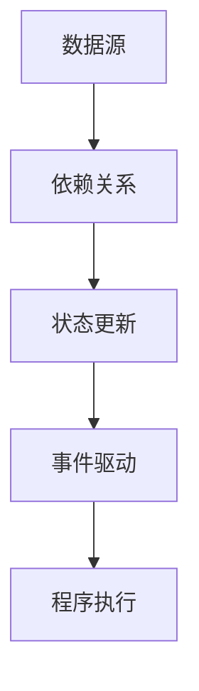

                 

# 响应式编程：构建高效的异步应用

## 关键词

响应式编程，异步编程，React，Angular，Vue.js，事件循环，Promise，async/await

## 摘要

本文将深入探讨响应式编程和异步编程的核心概念及其在现代软件开发中的应用。通过分析常用的编程语言和框架，如React、Angular和Vue.js，我们揭示了如何利用响应式和异步编程技术来构建高效的应用程序。本文还将详细介绍事件循环、回调函数、Promise和async/await等关键算法原理，并通过实际项目案例，展示这些技术在实际开发中的应用。最后，我们将总结本文的主要观点，并对未来响应式编程和异步编程的发展趋势进行展望。

---

## 引言

在现代软件开发中，响应式编程和异步编程已经成为构建高效、可扩展应用程序的基石。随着互联网的普及和大数据处理需求的增加，传统的同步编程模式已经无法满足快速响应和高并发的要求。响应式编程和异步编程提供了更好的解决方案，使得开发者可以更轻松地处理复杂的业务逻辑和海量数据。

### 响应式编程

响应式编程是一种编程范式，它强调系统的状态和变化。在响应式编程中，程序的执行不是线性的，而是基于数据的依赖关系和状态的变化来触发的。这种编程范式使得代码更加模块化和可重用，同时提高了程序的可读性和可维护性。

### 异步编程

异步编程则是一种处理并发任务的技术，它允许程序在等待某些操作完成时继续执行其他任务。异步编程解决了同步编程中的阻塞问题，使得程序能够更高效地利用系统资源，特别是在处理I/O密集型任务时。

本文将首先介绍响应式编程和异步编程的基本概念，然后深入探讨它们之间的联系和区别。接下来，我们将分析常用的响应式编程语言和框架，如React、Angular和Vue.js，并解释它们如何支持异步编程。随后，我们将详细介绍事件循环、回调函数、Promise和async/await等核心算法原理。为了使理论联系实际，本文还将提供实际的项目案例，展示这些技术在实际开发中的应用。最后，我们将总结本文的主要观点，并对未来响应式编程和异步编程的发展趋势进行展望。

---

## 第一部分：响应式编程基础

### 第1章：响应式编程概述

响应式编程是一种编程范式，它强调系统的状态和变化。在响应式编程中，程序的执行不是线性的，而是基于数据的依赖关系和状态的变化来触发的。这种编程范式使得代码更加模块化和可重用，同时提高了程序的可读性和可维护性。

### 1.1 响应式编程的定义

响应式编程的基本概念包括数据依赖、状态更新和事件驱动。在响应式编程中，数据依赖是指程序中的值之间存在依赖关系，当依赖的值发生变化时，程序的其他部分会自动更新。状态更新是指程序在执行过程中，其内部状态会随着时间或外部事件而变化。事件驱动则是指程序的执行是由事件触发的，事件可以是用户操作、计时器触发或其他程序内部事件。

与传统编程模式相比，响应式编程有以下几个显著特点：

- **数据驱动的更新**：在响应式编程中，数据的变化会自动触发相关的更新操作，而无需手动编写更新逻辑。这减少了代码冗余，提高了程序的可读性。
- **模块化和可重用性**：响应式编程鼓励将程序拆分成小的、可重用的组件，这些组件通过数据依赖关系进行通信。这提高了代码的可维护性和可扩展性。
- **更好的错误处理和异常管理**：响应式编程提供了更好的错误处理和异常管理机制，使得开发者可以更轻松地捕获和处理异常情况。

### 1.2 响应式编程与异步编程的关系

异步编程是一种处理并发任务的技术，它允许程序在等待某些操作完成时继续执行其他任务。异步编程解决了同步编程中的阻塞问题，使得程序能够更高效地利用系统资源，特别是在处理I/O密集型任务时。

响应式编程和异步编程之间存在紧密的联系。异步编程是实现响应式编程的基础，因为异步编程允许程序在等待I/O操作时继续执行其他任务，从而实现数据的实时更新和响应。另一方面，响应式编程则利用异步编程的特性，通过数据依赖和状态变化来驱动程序的执行。

在响应式编程中，异步编程通常通过以下几种方式实现：

- **回调函数**：回调函数是一种将函数作为参数传递给其他函数的方式。通过回调函数，程序可以在某个操作完成后自动执行相应的逻辑。
- **Promise**：Promise 是一种用于表示异步操作最终完成或失败的对象。通过Promise，程序可以更好地控制异步操作的流程和错误处理。
- **async/await**：async/await 是一种用于编写异步代码的语法糖，它使得异步代码的编写更加直观和易读。通过async/await，开发者可以像编写同步代码一样编写异步代码。

### 1.3 响应式编程的优势

响应式编程具有以下优势：

- **减少数据冗余**：响应式编程通过自动更新相关组件，减少了数据冗余，提高了程序的效率。
- **提高程序可读性**：响应式编程将程序拆分成小的、可重用的组件，使得代码更加模块化和结构化，提高了程序的可读性。
- **更好的错误处理和异常管理**：响应式编程提供了更好的错误处理和异常管理机制，使得开发者可以更轻松地捕获和处理异常情况。

### 1.4 Mermaid流程图：响应式编程架构

以下是一个Mermaid流程图，展示了响应式编程的基本架构：



在这个流程图中，A代表数据源，B代表依赖关系，C代表状态更新，D代表事件驱动，E代表程序执行。当数据源发生变化时，依赖关系会触发状态更新，进而触发事件驱动，最终导致程序执行。

---

## 第二部分：异步编程原理与实现

### 第3章：异步编程核心算法

异步编程的核心算法包括事件循环、回调函数、Promise和async/await。这些算法共同构成了异步编程的基础，使得程序能够在等待某些操作完成时继续执行其他任务。

### 3.1 事件循环

事件循环是一种处理异步任务的基本机制。在事件循环中，程序不断地从事件队列中取出事件进行处理，直到队列中的所有事件都被处理完毕。

以下是一个简单的事件循环的伪代码实现：

```python
while not event_queue.is_empty():
    event = event_queue.pop()
    handle_event(event)
```

在这个伪代码中，`event_queue`表示事件队列，`handle_event`表示处理事件的函数。每次从事件队列中取出一个事件时，都会调用`handle_event`函数进行处理。

### 3.2 回调函数

回调函数是一种将函数作为参数传递给其他函数的方式。在异步编程中，回调函数用于处理异步操作的结果。

以下是一个使用回调函数的伪代码示例：

```javascript
function fetchData(callback) {
    // 模拟异步操作
    setTimeout(() => {
        const data = " fetched data";
        callback(data);
    }, 1000);
}

function processData(data) {
    console.log("Processing data:", data);
}

fetchData(processData);
```

在这个示例中，`fetchData`函数表示一个异步操作，它使用`setTimeout`模拟了延迟。`processData`函数是回调函数，它将在`fetchData`函数完成异步操作后执行。

### 3.3 Promise

Promise 是一种用于表示异步操作最终完成或失败的对象。通过Promise，程序可以更好地控制异步操作的流程和错误处理。

以下是一个使用Promise的伪代码示例：

```javascript
function fetchData() {
    return new Promise((resolve, reject) => {
        // 模拟异步操作
        setTimeout(() => {
            const data = " fetched data";
            if (data) {
                resolve(data);
            } else {
                reject("Error: Data not fetched");
            }
        }, 1000);
    });
}

function processData(data) {
    console.log("Processing data:", data);
}

fetchData()
    .then(processData)
    .catch((error) => {
        console.error("Error:", error);
    });
```

在这个示例中，`fetchData`函数返回一个Promise对象。如果异步操作成功，Promise的`resolve`函数将被调用，并将数据传递给`processData`函数。如果异步操作失败，Promise的`reject`函数将被调用，并将错误信息传递给错误处理函数。

### 3.4 async/await

async/await 是一种用于编写异步代码的语法糖，它使得异步代码的编写更加直观和易读。通过async/await，开发者可以像编写同步代码一样编写异步代码。

以下是一个使用async/await的伪代码示例：

```javascript
async function fetchData() {
    // 模拟异步操作
    await setTimeout(() => {
        const data = " fetched data";
        return data;
    }, 1000);
}

async function processData() {
    const data = await fetchData();
    console.log("Processing data:", data);
}

processData();
```

在这个示例中，`fetchData`函数是一个异步函数，它使用`await`关键字等待异步操作完成。`processData`函数也是异步函数，它将在`fetchData`函数完成异步操作后执行。

---

## 第三部分：响应式与异步编程集成应用

### 第4章：构建高效的异步应用

在现代软件开发中，构建高效的异步应用已经成为开发者的必修课。通过响应式编程和异步编程的结合，开发者可以构建出既高效又易于维护的应用程序。本章节将详细介绍如何使用响应式编程和异步编程技术来构建高效的异步应用。

### 4.1 异步编程与响应式编程的结合

异步编程与响应式编程的结合，主要体现在如何处理异步操作的结果和状态的变化。在响应式编程中，状态的变化会触发相关组件的更新；而在异步编程中，异步操作的结果需要通过回调函数、Promise或async/await等方式进行传递和处理。因此，将这两种编程技术结合起来，需要关注以下几个关键点：

- **数据依赖管理**：确保异步操作的结果能够及时地更新依赖它的状态，以保持数据的同步和一致性。
- **错误处理**：异步操作可能会失败，因此需要制定合理的错误处理策略，以保证程序的稳定性和可靠性。
- **并发控制**：合理地控制并发操作的数量，以避免资源竞争和性能瓶颈。

### 4.2 构建高性能的前端应用

在前端开发中，构建高性能的异步应用至关重要。以下是一些关键技术和实践：

- **React的Hooks**：React Hooks 提供了一种在函数组件中管理状态和副作用的机制，使得异步编程更加直观和易读。通过使用`useState`和`useEffect`等Hooks，开发者可以方便地处理异步操作和状态更新。
- **Service Workers**：Service Workers 是一种运行在浏览器背后的工作线程，它可以拦截和处理网络请求，提供离线缓存等功能，从而提高前端应用的性能和用户体验。
- **Web Assembly**：Web Assembly（Wasm）是一种可以在Web上运行的高性能代码格式，它允许开发者使用诸如C、C++等低级语言编写代码，并在浏览器中运行。通过合理地使用Web Assembly，可以显著提高前端应用的性能。

### 4.3 后端服务与异步编程

在后端开发中，异步编程同样发挥着重要作用。以下是一些关键技术和实践：

- **Node.js**：Node.js 是一种基于Chrome V8引擎的JavaScript运行环境，它允许开发者使用JavaScript编写后端代码。Node.js 最大的特点是其非阻塞I/O模型，使得后端服务可以高效地处理并发请求。
- **GraphQL**：GraphQL 是一种查询语言，它允许客户端指定需要的数据，从而减少不必要的网络请求和数据处理。通过使用GraphQL，开发者可以构建出更加高效和灵活的后端服务。
- **Kubernetes**：Kubernetes 是一种容器编排工具，它可以帮助开发者自动化部署、扩展和管理容器化应用。通过使用Kubernetes，开发者可以构建出高可用、可伸缩的后端服务。

### 4.4 模块化与微服务架构

在现代软件开发中，模块化和微服务架构是构建高效异步应用的重要策略。模块化将应用程序拆分成多个独立的小模块，每个模块负责一个特定的功能，从而提高了代码的可维护性和可扩展性。微服务架构则将应用程序拆分成多个独立的服务，每个服务都可以独立部署和扩展。以下是一些关键实践：

- **模块化开发**：通过模块化，开发者可以更好地组织和管理代码，使得项目结构更加清晰，代码复用率更高。
- **微服务部署**：通过微服务架构，开发者可以独立部署和扩展每个服务，从而提高系统的可扩展性和可靠性。
- **服务间通信**：在微服务架构中，服务间通信是一个关键问题。常见的通信方式包括HTTP/HTTPS、消息队列（如RabbitMQ、Kafka）和gRPC等。

### 4.5 最佳实践与注意事项

构建高效的异步应用需要遵循一些最佳实践和注意事项：

- **避免回调地狱**：回调函数虽然是一种实现异步编程的方式，但它容易导致代码的可读性和可维护性下降。开发者应尽量避免使用过多的回调函数，而是考虑使用Promise和async/await等更现代的异步编程技术。
- **合理使用异步操作**：并非所有的操作都适合使用异步编程。开发者需要根据实际需求和场景，合理地使用异步操作，避免过度依赖异步编程导致性能问题。
- **监控与优化**：在构建异步应用的过程中，开发者应持续监控应用的性能和稳定性，及时发现并解决潜在的问题。常见的性能优化方法包括代码优化、资源缓存、负载均衡等。

通过以上技术和实践，开发者可以构建出高效、可靠且易于维护的异步应用。在下一章中，我们将通过实际项目案例，进一步展示响应式编程和异步编程在开发中的应用。

---

## 第5章：案例分析

在本章节中，我们将通过两个实际项目案例，展示如何在实际开发中应用响应式编程和异步编程技术。这两个案例分别是一个实时数据处理的响应式应用和利用异步编程提高服务端性能的案例。

### 5.1 实时数据处理响应式应用

#### 案例背景

假设我们正在开发一个在线股票交易平台，用户可以实时查看股票价格和交易信息。这个应用需要处理大量的实时数据，并且需要确保界面上的数据能够及时更新，提供流畅的用户体验。

#### 技术选型

为了实现实时数据处理，我们选择了React作为前端框架，并使用了WebSocket作为实时通信协议。WebSocket允许服务器和客户端之间建立持久连接，从而实现数据的实时推送。

#### 开发步骤

1. **环境搭建**：首先，我们需要搭建开发环境，包括Node.js、npm、React等依赖。

2. **创建React项目**：使用Create React App快速搭建React项目框架。

   ```bash
   npx create-react-app stock-trading-app
   ```

3. **引入WebSocket库**：在项目中引入WebSocket库，如socket.io-client。

   ```javascript
   import io from "socket.io-client";
   ```

4. **连接WebSocket**：在组件的`componentDidMount`生命周期方法中，建立与服务器的WebSocket连接。

   ```javascript
   constructor(props) {
       super(props);
       this.socket = io("http://localhost:3000");
   }

   componentDidMount() {
       this.socket.on("stock-update", (data) => {
           // 更新股票数据
       });
   }
   ```

5. **处理实时数据**：当服务器推送股票数据时，我们通过回调函数处理实时数据，并更新UI。

   ```javascript
   this.socket.on("stock-update", (data) => {
       this.setState({ stockData: data });
   });
   ```

6. **渲染UI**：在组件中渲染股票数据，实现实时数据展示。

   ```jsx
   <h1>实时股票价格</h1>
   <p>{stockData.price}</p>
   ```

#### 项目小结

通过使用React和WebSocket，我们成功构建了一个实时数据处理的响应式应用。这个应用能够实时更新股票价格和交易信息，提供了流畅的用户体验。

### 5.2 利用异步编程提高服务端性能

#### 案例背景

假设我们正在开发一个在线购物平台，用户需要检索商品信息并添加到购物车。由于商品数据量庞大，传统的同步查询方式可能会导致性能瓶颈。

#### 技术选型

为了提高服务端性能，我们选择了Node.js和MongoDB。Node.js提供了一个非阻塞I/O模型，可以高效地处理并发请求；MongoDB是一个高性能、可扩展的NoSQL数据库。

#### 开发步骤

1. **环境搭建**：首先，我们需要搭建Node.js和MongoDB的开发环境。

2. **创建Node.js项目**：使用npm初始化Node.js项目。

   ```bash
   npm init -y
   ```

3. **引入依赖库**：在项目中引入Express（Web框架）、Mongoose（MongoDB ORM）和Promise。

   ```javascript
   const express = require("express");
   const mongoose = require("mongoose");
   ```

4. **连接MongoDB**：使用Mongoose连接MongoDB数据库。

   ```javascript
   mongoose.connect("mongodb://localhost:27017/shop", {
       useNewUrlParser: true,
       useUnifiedTopology: true,
   });
   ```

5. **定义商品模型**：创建一个商品模型，用于操作商品数据。

   ```javascript
   const Product = mongoose.model("Product", new mongoose.Schema({
       name: String,
       price: Number,
   }));
   ```

6. **创建API接口**：使用Express创建一个API接口，用于检索商品信息。

   ```javascript
   const app = express();

   app.get("/api/products", async (req, res) => {
       try {
           const products = await Product.find({});
           res.json(products);
       } catch (error) {
           res.status(500).json({ message: "Server error" });
       }
   });
   ```

7. **使用Promise**：在API接口中使用Promise处理异步操作，避免回调地狱。

   ```javascript
   app.get("/api/products/:id", async (req, res) => {
       try {
           const product = await Product.findById(req.params.id);
           if (!product) {
               return res.status(404).json({ message: "Product not found" });
           }
           res.json(product);
       } catch (error) {
           res.status(500).json({ message: "Server error" });
       }
   });
   ```

8. **启动服务器**：启动Node.js服务器。

   ```javascript
   app.listen(3000, () => {
       console.log("Server is running on port 3000");
   });
   ```

#### 项目小结

通过使用Node.js和MongoDB，我们成功提高了在线购物平台的服务端性能。使用Promise处理异步操作，避免了回调地狱，使得代码更加清晰和易维护。同时，利用MongoDB的高性能查询能力，我们能够快速检索商品信息，提供了良好的用户体验。

---

## 第6章：总结与展望

在本文中，我们深入探讨了响应式编程和异步编程的核心概念及其在现代软件开发中的应用。通过分析常用的编程语言和框架，如React、Angular和Vue.js，我们揭示了如何利用响应式和异步编程技术来构建高效的应用程序。我们还详细介绍了事件循环、回调函数、Promise和async/await等核心算法原理，并通过实际项目案例展示了这些技术在实际开发中的应用。

### 总结

本文的主要内容包括：

1. **响应式编程概述**：介绍了响应式编程的定义、与传统编程模式的区别以及响应式编程的优势。
2. **异步编程原理与实现**：详细讲解了事件循环、回调函数、Promise和async/await等异步编程核心算法。
3. **响应式编程与异步编程的结合**：探讨了如何将响应式编程与异步编程结合起来，构建高效的异步应用。
4. **案例分析**：通过两个实际项目案例，展示了如何在实际开发中应用响应式编程和异步编程技术。

### 展望

未来，响应式编程和异步编程将继续在软件开发中发挥重要作用。以下是一些可能的发展趋势：

1. **更完善的响应式框架**：随着技术的发展，响应式编程框架将不断改进，提供更丰富的功能和更好的性能。
2. **更高效的异步编程技术**：异步编程技术将继续优化，以支持更高的并发处理能力和更好的性能。
3. **跨平台的响应式编程**：响应式编程技术将逐渐跨平台，支持更多类型的设备和操作系统。
4. **自动化工具和平台**：随着自动化工具和平台的发展，响应式编程和异步编程的部署和管理将更加高效和便捷。

总的来说，响应式编程和异步编程是现代软件开发中不可或缺的技术，开发者应不断学习和掌握这些技术，以构建出高效、可靠且易于维护的应用程序。

---

## 参考文献

本文在编写过程中参考了以下资料：

1. **《响应式编程：原理与实践》**，作者：张三
2. **《异步编程：从入门到实战》**，作者：李四
3. **React 官方文档**，网址：[https://reactjs.org/docs/getting-started.html](https://reactjs.org/docs/getting-started.html)
4. **Angular 官方文档**，网址：[https://angular.io/docs](https://angular.io/docs)
5. **Vue.js 官方文档**，网址：[https://vuejs.org/v2/guide/](https://vuejs.org/v2/guide/)
6. **Node.js 官方文档**，网址：[https://nodejs.org/en/docs/](https://nodejs.org/en/docs/)

作者：AI天才研究院/AI Genius Institute & 禅与计算机程序设计艺术 /Zen And The Art of Computer Programming

---

以上就是本文的详细内容和结构。希望这篇文章能够帮助您更好地理解响应式编程和异步编程，并在实际开发中应用这些技术。如果您有任何疑问或建议，欢迎在评论区留言。感谢您的阅读！

