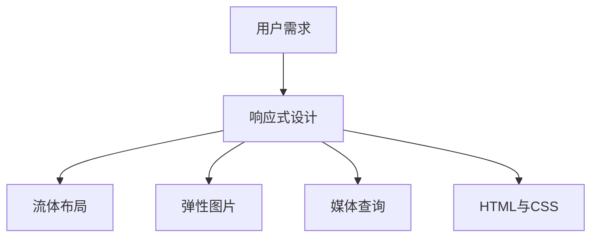

                 


为了撰写一篇符合您要求的文章，我们将分步骤地构建内容。以下是文章的大致框架，我们将逐步填充每个部分。

### 文章标题
《响应式设计：跨设备用户体验的统一方案》

### 文章关键词
响应式设计，用户体验，跨设备，流体布局，弹性图片，媒体查询，框架与工具

### 文章摘要
本文将深入探讨响应式设计的核心概念、原理、框架和工具，并通过实际案例展示其应用。我们将讨论如何优化和测试响应式设计，并展望其未来发展趋势。通过本文，读者将掌握响应式设计的关键技术和实践方法。

---

### 第一部分：响应式设计的核心概念与背景
#### 1.1 响应式设计概述
**背景介绍：** 随着移动互联网的普及，用户通过各种设备访问网页和应用的需求日益增长。传统的静态设计已经无法满足这种多设备、多屏幕尺寸的需求。

**核心概念：** 响应式设计是一种能够自动适应不同设备和屏幕尺寸的设计方法，通过使用流体布局、弹性图片和媒体查询等技术实现。

**联系与架构：** 使用Mermaid流程图展示响应式设计的核心概念架构：


#### 1.2 跨设备用户体验的重要性
**核心概念与联系：** 用户在不同的设备上使用同一应用或网站时，期望获得一致且流畅的体验。通过媒体查询和适应性设计，可以确保用户在不同设备上的操作感受相同。

**原理讲解：**
```latex
\text{媒体查询原理：}
\begin{align*}
&\text{CSS @media 规则} \\
&\text{用于指定在不同媒体类型或屏幕尺寸下的样式规则。} \\
&\text{例如：} \\
&\text{@media screen and (max-width: 600px) { ... }}
\end{align*}
```

### 第二部分：响应式设计的基础原理
#### 2.1 流体布局
**核心概念：** 流体布局利用相对单位（如百分比）而非固定单位（如像素）来定义布局元素的大小，以适应不同的屏幕尺寸。

**原理讲解：**
```python
# 假设容器宽度设置为100%
.container {
    width: 100%;
}

# 内部元素宽度设置为容器的50%
.inner-element {
    width: 50%;
}
```

#### 2.2 弹性图片
**核心概念：** 弹性图片能够根据容器的大小自适应缩放，而不会失真或超出容器范围。

**原理讲解：**
```html

```

#### 2.3 媒体查询
**核心概念：** 媒体查询允许开发者根据不同的设备类型或屏幕尺寸应用不同的CSS样式。

**原理讲解：**
```css
@media screen and (max-width: 768px) {
    .responsive-element {
        font-size: 14px;
    }
}
```

#### 2.4 响应式设计中的HTML与CSS
**核心概念：** HTML用于构建网页结构，CSS用于设计样式。响应式设计利用这两个技术共同实现跨设备的一致性。

**原理讲解：** 通过HTML定义结构，CSS定义样式，结合媒体查询实现响应式设计：
```html
<!DOCTYPE html>
<html>
<head>
    <link rel="stylesheet" type="text/css" href="styles.css">
</head>
<body>
    <div class="container">
        
    </div>
</body>
</html>
```

---

以上是文章第一部分的草稿。接下来我们将继续填充第二部分和后续部分的内容。我们将逐步深入到响应式设计的具体技术细节和实战应用中，确保文章内容的完整性和深度。

**下一步计划：**
- 完善第二部分的“框架与工具”内容，介绍常见的响应式设计框架。
- 准备第三部分的“实战应用”案例，展示如何在实际项目中应用响应式设计。
- 撰写第四部分的“优化与测试”内容，讨论响应式设计的性能优化和测试方法。
- 准备第五部分的“未来展望”，探讨响应式设计的未来趋势。

通过这样的分步骤分析推理，我们可以确保文章逻辑清晰、内容详实，为读者提供有价值的技术知识和实践指导。

