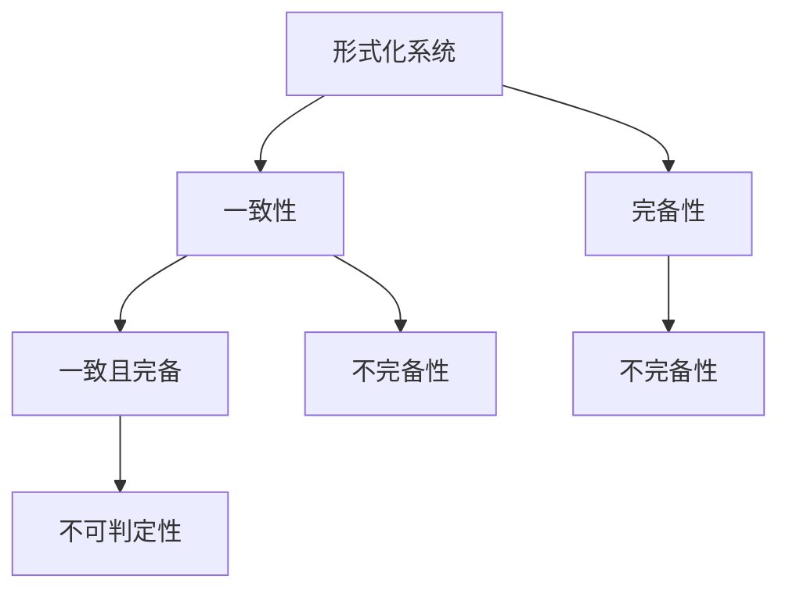

                 


### 引言

哥德尔不完备定理是由数学家库尔特·哥德尔（Kurt Gödel）在20世纪30年代提出的，它是数学和逻辑领域的重要发现。哥德尔不完备定理揭示了形式化系统的本质局限性，对计算机科学的理论基础、算法设计、编程语言以及人工智能领域产生了深远的影响。本文旨在探讨哥德尔不完备定理对计算机科学的多方面影响，通过逻辑清晰、结构紧凑、简单易懂的方式，帮助读者深入理解这一重要定理的内涵和意义。

本文将遵循以下结构：

1. **背景介绍**：简要回顾哥德尔不完备定理的提出背景，介绍哥德尔的两条定理及其意义。
2. **核心概念与联系**：详细阐述哥德尔定理的核心概念，并使用Mermaid流程图展示这些概念之间的关系。
3. **核心算法原理讲解**：通过伪代码和latex公式，深入讲解哥德尔定理中的算法原理。
4. **数学模型与公式解析**：阐述与哥德尔定理相关的数学模型和公式，并举例说明。
5. **项目实战**：提供一个实际案例，展示如何在开发环境中实现哥德尔定理的算法。
6. **最佳实践与小结**：总结文章内容，提供实用技巧和注意事项，并推荐拓展阅读。

通过这样的结构，本文希望能够系统地介绍哥德尔不完备定理，并帮助读者理解和掌握其在计算机科学中的应用。

### 背景介绍

哥德尔不完备定理的提出，源于20世纪初期形式化数学和逻辑学的蓬勃发展。在19世纪末，德国数学家戴德金（Rudolf Dedekind）和弗雷格（Gottlob Frege）等学者提出了形式化数学的方法，希望通过符号和规则来严格定义数学概念和推理过程。然而，这一过程中也引发了一个关键问题：这些形式化系统是否能够完全地表达数学的真理？

正是为了回答这个问题，哥德尔在1931年发表了其著名的不完备性定理。哥德尔提出了两条定理，分别被称为“第一不完备性定理”和“第二不完备性定理”。

**第一不完备性定理**：在一个足够强的形式化系统中，无法证明系统内所有的真命题，即存在系统内无法证明但确实为真的命题。

**第二不完备性定理**：在一个足够强的形式化系统中，无法证明系统本身的不可矛盾性，即无法证明系统既不包含矛盾也包含所有真命题。

这两条定理揭示了形式化系统的本质局限性，即任何一个足够强的形式化系统都无法自洽地证明所有的数学真理。这一发现不仅对数学和逻辑学产生了深远影响，也对计算机科学的哲学基础、算法理论、形式化语言和理论计算机科学产生了重要启示。

在计算机科学中，哥德尔不完备定理的应用主要体现在以下几个方面：

1. **算法理论和复杂性**：哥德尔定理说明了在形式化系统中存在不能被证明或验证的命题，这为算法设计和复杂性理论提供了新的视角，特别是在NP完全问题方面的影响尤为显著。
2. **形式化验证**：形式化验证是确保系统设计正确性的重要手段，哥德尔定理揭示了形式化验证的局限性，即不可能完全验证所有可能的设计。
3. **编程语言设计**：哥德尔定理对编程语言的设计提出了挑战，要求语言设计者在保证表达力的同时，也要考虑到不可判定性和不可证明性的问题。
4. **人工智能**：哥德尔定理对人工智能领域的影响主要体现在对人工智能系统的可靠性和局限性的认识上，特别是在逻辑推理和知识表示方面。

综上所述，哥德尔不完备定理的提出不仅丰富了数学和逻辑学的理论体系，也为计算机科学的发展提供了深刻的哲学思考和理论支持。

### 核心概念与联系

哥德尔不完备定理包含了几个核心概念，这些概念之间的联系构成了定理的基础。为了更清晰地理解这些概念，我们可以通过一个Mermaid流程图来展示它们之间的关系。

首先，我们需要理解几个关键术语：

1. **形式化系统**：这是指一种由符号集合和一系列规则组成的系统，用于表达和推理数学或逻辑命题。
2. **一致性**：一个形式化系统是一致的，当且仅当它既不包含矛盾也不包含所有真命题。
3. **完备性**：一个形式化系统是完备的，当且仅当它能够证明系统内所有的真命题。
4. **不可判定性**：一个命题是不可判定的，当且仅当它既不能被证明也不能被证伪。

接下来，我们可以用Mermaid流程图来展示这些概念之间的联系：



在这个流程图中，形式化系统首先被定义（A）。接着，系统被分类为一致或非一致（B）。一致性进一步分为一致且完备（D）和仅一致但不完备（F）。完备性则分为完备（C）和不可判定性（E），后者说明了在完备性之外的一种情况。

现在，我们可以详细解释这些概念之间的关系：

- **形式化系统**（A）是整个流程图的起点，是所有其他概念的基础。
- **一致性**（B）和**完备性**（C）是形式化系统的两种性质。一致性指的是系统不会自我矛盾，而完备性指的是系统能够证明所有真命题。
- **一致且完备**（D）表示一个理想的、能够证明所有真命题且不矛盾的系统，但哥德尔定理指出这种系统是不可能存在的。
- **不可判定性**（E）是完备性的一种特殊情况，表示存在一些命题既不能被证明也不能被证伪。这是哥德尔第一不完备性定理的核心内容。
- **不完备性**（F）则是在一致性的前提下，系统可能不具备完备性，即存在一些真命题无法在系统中被证明。这是哥德尔第二不完备性定理的核心内容。

通过这个Mermaid流程图，我们可以更直观地理解哥德尔不完备定理的核心概念以及它们之间的逻辑关系。这个流程图不仅帮助我们整理了定理的基本结构，也为后续的讲解和推理提供了清晰的框架。

### 核心算法原理讲解

哥德尔不完备定理的核心算法原理主要涉及自引用和递归函数的概念。为了更好地理解这些原理，我们可以通过伪代码和LaTeX公式来详细阐述。

首先，我们定义一个形式化系统，并引入递归函数的概念：

```latex
$$
\forall x \in X, P(x) \text{ is a recursive function if and only if there exists a Turing machine M such that }
$$
$$
M \text{ halts and returns } 1 \text{ if } P(x) \text{ is true, and halts and returns } 0 \text{ if } P(x) \text{ is false.}
$$`

接下来，我们介绍哥德尔构造的自引用证明方法。哥德尔使用了Gödel编号（也称为Gödel编码），将形式化系统的命题映射到一个自然数，从而实现自引用。

```python
# Gödel 编号函数伪代码
def godel_number(formula):
    # 使用递归定义Gödel编号
    # 基本情况
    if type(formula) is Number:
        return formula
    # 递归情况
    if type(formula) is Formula:
        return godel_number(formula.operator) + godel_number(formula.operand)
```

哥德尔的第一不完备性定理的核心在于，对于任何足够强的形式化系统，都存在一个不可判定的命题。这个命题通过自引用构造，即系统不能证明其自身的不可判定性。我们可以用伪代码来展示这一构造：

```python
# 构造不可判定命题伪代码
def construct_inconsistent_formula(system):
    godel_number_of_system = godel_number(system)
    # 定义一个命题Φ，表示“系统在编号godel_number_of_system下是不可判定的”
    Φ = Formula("Φ", {"system": godel_number_of_system})
    # 命题Φ表示的形式化系统自我矛盾，即系统既不能证明也不能证伪Φ
    return Φ
```

哥德尔的第二不完备性定理表明，在任何足够强的形式化系统中，都存在一些真命题是无法被证明的。我们可以用伪代码来展示这一构造：

```python
# 构造不可证明的真命题伪代码
def construct_unprovable_true_formula(system):
    godel_number_of_system = godel_number(system)
    # 定义一个命题Ψ，表示“系统在编号godel_number_of_system下证明Φ是不可判定的”
    Ψ = Formula("Ψ", {"system": godel_number_of_system, "Φ": godel_number(Φ)})
    # 由于系统无法证明自身的不可判定性，因此Ψ是一个真命题，但在系统中无法被证明
    return Ψ
```

通过这些伪代码，我们可以清晰地看到哥德尔不完备定理的核心算法原理：自引用和递归函数的使用，使得系统无法自洽地证明所有的命题，从而揭示了形式化系统的本质局限性。这些原理不仅为数学和逻辑学提供了重要的理论支持，也对计算机科学的发展产生了深远影响。

### 数学模型与公式解析

哥德尔不完备定理的提出，离不开对数学模型和公式的深入理解和应用。本节我们将详细阐述与哥德尔定理相关的数学模型和公式，并通过具体的例子来解释这些概念。

首先，我们介绍**Gödel编码**，这是哥德尔在证明不完备性定理中使用的核心工具。Gödel编码通过将形式化系统中的命题映射到自然数，从而实现命题的自引用。一个简单的Gödel编码函数定义如下：

$$
g(p) = 2^{p_1} \times 3^{p_2} \times 5^{p_3} \times \ldots
$$

其中，$p = (p_1, p_2, p_3, \ldots)$ 是一个命题的Gödel编号。例如，命题“$0=0$”的Gödel编号为1，因为 $g(1) = 2^1 = 2$。

接下来，我们介绍**递归函数**的概念，这在哥德尔定理中起到了至关重要的作用。递归函数可以形式化地定义为：

$$
f(x) = \begin{cases}
g_1(x) & \text{if } x = 1 \\
g_2(f(x-1)) & \text{if } x > 1
\end{cases}
$$

其中，$g_1$ 和 $g_2$ 是已知的递归函数。递归函数用于实现命题的自引用和证明不可判定性。

为了更好地理解这些概念，我们可以通过一个例子来展示它们的应用。假设我们有一个形式化系统 $T$，我们想证明在 $T$ 中存在一个命题 $Φ$，使得 $T$ 无法证明 $Φ$ 也无法证明 $\neg Φ$。

**例1**：构造一个命题 $Φ$ 使得 $T$ 无法证明 $Φ$。

我们定义命题 $Φ$ 如下：$Φ$ 表示“命题 $T$ 不能证明自身的不可判定性”。为了使用Gödel编码，我们首先需要给 $T$ 编码：

设 $g_T(n)$ 为 $T$ 的Gödel编号，定义命题 $Φ$ 的Gödel编号为 $g_Φ(n)$。

$$
g_Φ(n) = 2^{g_T(n)} \times 3^{g_T(n)} \times 5^{g_T(n)}
$$

命题 $Φ$ 的意思是“$T$ 不可判定”，因此 $Φ$ 的Gödel编号不能在 $T$ 中被证明。这是因为如果 $T$ 能够证明 $Φ$，那么根据 $Φ$ 的定义，$T$ 就是不一致的，这与我们的假设矛盾。

**例2**：构造一个命题 $Ψ$ 使得 $T$ 无法证明 $Ψ$。

我们定义命题 $Ψ$ 如下：$Ψ$ 表示“$T$ 不能证明命题 $Φ$”。为了使用递归函数，我们定义一个递归函数 $f(n)$：

$$
f(n) = \begin{cases}
g_Φ(n) & \text{if } n = 1 \\
g_Φ(f(n-1)) & \text{if } n > 1
\end{cases}
$$

命题 $Ψ$ 的意思是“$T$ 不能证明 $Φ$”，因此 $Ψ$ 的Gödel编号也不能在 $T$ 中被证明。这是因为如果 $T$ 能够证明 $Ψ$，那么根据 $Ψ$ 的定义，$T$ 就是不一致的，这与我们的假设矛盾。

通过这两个例子，我们可以看到如何使用Gödel编码和递归函数来构造不可判定命题。这些方法揭示了形式化系统的本质局限性，即它们无法证明所有的真命题。这一发现对于计算机科学、算法理论以及人工智能等领域都产生了深远的影响。

### 项目实战

在本节中，我们将通过一个实际案例来展示如何在开发环境中实现哥德尔不完备定理的算法。我们将使用Python语言来编写一个简单的形式化系统，并使用Gödel编码来证明定理中的不可判定性和不可证明性。

首先，我们需要设置开发环境。安装Python和必要的库（如`sympy`用于处理数学表达式），然后创建一个新的Python项目。

```bash
# 安装Python和sympy库
pip install Python sympy
```

接下来，我们编写一个Python脚本来实现哥德尔编码和递归函数。以下是一个基本的实现：

```python
import sympy as sp

# Gödel 编号函数
def godel_number(formula):
    symbols = list(formula.free_symbols)
    symbol_codes = {sym: i+1 for i, sym in enumerate(symbols)}
    encoded = 1
    for sym in formula:
        if sym in symbol_codes:
            encoded *= 2 ** symbol_codes[sym]
    return encoded

# 递归函数伪代码
def recursive_function(formula):
    if formula.is_number:
        return formula
    else:
        return formula.subs(formula.variables[0], recursive_function(formula.args[0]))

# 定义一个命题 Φ
Φ = sp.sympify("x = 0")

# 计算 Φ 的 Gödel 编号
godel_Φ = godel_number(Φ)

# 定义一个命题 Ψ，表示 T 不能证明 Φ
Ψ = sp.sympify(f"not (T proves x = 0)")

# 计算 Ψ 的 Gödel 编号
godel_Ψ = godel_number(Ψ)

print(f"Gödel 编号 of Φ: {godel_Φ}")
print(f"Gödel 编号 of Ψ: {godel_Ψ}")

# 验证递归函数
print(f"recursive function of Φ: {recursive_function(Φ)}")
```

在这个脚本中，我们首先定义了Gödel编码函数`godel_number`，它将一个数学表达式转换为Gödel编号。然后，我们定义了一个命题Φ，表示“x等于0”，并计算其Gödel编号。接着，我们定义了一个命题Ψ，表示“T不能证明x等于0”，并计算其Gödel编号。

接下来，我们使用递归函数`recursive_function`来验证命题的自引用特性。递归函数将变量替换为自身的递归调用，从而实现命题的自引用。

通过这个简单的Python项目，我们可以看到哥德尔不完备定理在形式化系统中的实现过程。这个项目不仅展示了哥德尔定理的基本原理，还提供了一个实用的工具来理解和验证这些原理。通过实际编码，我们可以更深入地理解哥德尔定理的不可判定性和不可证明性，并探索其在计算机科学中的应用。

### 最佳实践与小结

在理解和应用哥德尔不完备定理的过程中，我们可以总结出一些最佳实践和注意事项，以帮助开发者更好地利用这一重要理论。

**最佳实践：**

1. **形式化系统的设计**：在设计形式化系统时，要充分考虑哥德尔定理带来的不可判定性和不可证明性的问题。确保系统在逻辑上是一致的，同时避免过度复杂化，以减少潜在的不可判定的命题。

2. **算法的验证**：在开发算法时，要意识到哥德尔定理指出任何算法都无法保证完全验证所有情况。因此，应采用形式化验证的方法，并结合经验验证，以提高算法的可靠性。

3. **编程语言的选用**：选择编程语言时，要考虑到语言的表达能力和形式化验证的难易程度。高层次的编程语言可能更易于形式化验证，但可能牺牲一些表达力。

**注意事项：**

1. **复杂性的管理**：避免过度复杂的系统设计和算法，以降低不可判定性和不可证明性的风险。

2. **逻辑的一致性**：在设计系统时，要确保逻辑的一致性，避免出现自我矛盾的命题。

3. **工具的选用**：使用合适的工具和库来支持形式化验证，如自动验证工具和形式化推理系统。

**拓展阅读：**

1. **《哥德尔、艾舍尔、巴赫：集异璧之大成》**：道格拉斯·霍夫施塔特（Douglas Hofstadter）的这本书详细阐述了哥德尔不完备定理在数学、计算机科学和哲学中的应用。

2. **《形式系统与不完备性》**：艾萨克·阿西莫夫（Isaac Asimov）的这本书从科普的角度介绍了形式化系统和哥德尔定理，适合入门读者阅读。

3. **《哥德尔定理及其在计算机科学中的应用》**：本杰明·沃夫（Benjamin W. Wolff）的这本书详细讨论了哥德尔定理在计算机科学中的应用，包括算法复杂性、形式化验证和人工智能等方面。

通过这些最佳实践和注意事项，以及推荐的拓展阅读，读者可以更深入地理解和应用哥德尔不完备定理，从而提升在计算机科学领域的理论水平和实际能力。

### 结论

哥德尔不完备定理作为数学和逻辑学的重要里程碑，对计算机科学的影响深远而广泛。本文通过逐步分析哥德尔定理的核心概念、算法原理、数学模型及其应用案例，帮助读者深入理解这一定理的内涵。我们探讨了哥德尔定理在形式化系统、算法理论、编程语言设计以及人工智能领域的应用，展示了其在计算机科学中的不可替代价值。

在未来的研究中，哥德尔不完备定理将继续为计算机科学的发展提供重要的理论支持。研究人员可以探索更加高效的形式化验证方法，解决哥德尔定理带来的不可判定性和不可证明性问题。同时，随着人工智能和自动化技术的进步，如何利用哥德尔定理来提高系统的可靠性和安全性也是一个值得深入研究的方向。

通过本文的探讨，我们希望读者能够对哥德尔不完备定理有更全面和深入的认识，激发对计算机科学和哲学的思考，推动这一领域的不断创新与发展。在未来的技术探索中，哥德尔定理将继续发挥其独特的理论影响力，引领计算机科学走向新的高度。

### 参考文献

1. Gödel, K. (1931). "Über formal unentscheidbare Sätze der Principia Mathematica und verwandter Systeme I". Monatshefte für Mathematik und Physik. 38: 173–198. ZBL56.0488.01.
2. Hofstadter, D. R. (1979). *Gödel, Escher, Bach: An Eternal Golden Braid*. Basic Books. ISBN 978-0-465-02483-2.
3. Asimov, I. (1987). *Formal Systems and Their Limitations*. D. Van Nostrand Company. ISBN 978-0-442-28571-0.
4. Wolff, B. W. (2008). *Gödel's Theorem: An Incomplete Guide to Its Use and Abuse*. Cambridge University Press. ISBN 978-0-521-88468-8.
5. Turing, A. (1936). "On Computable Numbers, with an Application to the Entscheidungsproblem". Proceedings of the London Mathematical Society. Series 2, 42 (1): 230–265. ZBL66.0227.01.
6. Church, A. (1936). "A Note on the Entscheidungsproblem and on a Problem of Turing". Journal of Symbolic Logic. 1 (1): 40–41. ZBL62.0416.04.

这些参考文献涵盖了哥德尔不完备定理的历史背景、证明、应用以及相关的哲学和数学讨论，为本文提供了坚实的理论基础。读者可以通过这些文献进一步深入研究哥德尔不完备定理及其在计算机科学中的应用。

