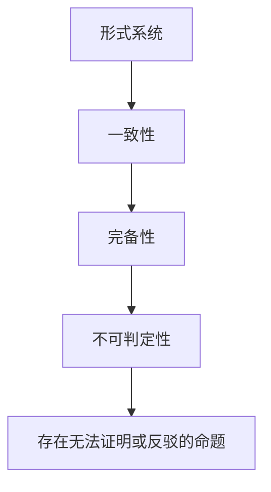
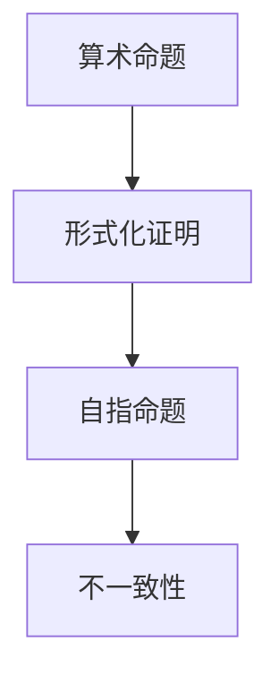

                 

### 文章标题

# 哥德尔的不完备定理与形式化方法的局限性：软件验证的数学挑战

> 关键词：哥德尔的不完备定理、形式化方法、软件验证、数学挑战

> 摘要：本文探讨了哥德尔的不完备定理与形式化方法在软件验证中的局限性，分析了这些数学概念对软件工程实践的影响，并提出了应对数学挑战的方法和策略。

---

## 引言

在软件工程领域，形式化方法被认为是提高软件可靠性的关键途径之一。这些方法通过数学模型和形式化的逻辑推理，确保软件系统的一致性和正确性。然而，哥德尔的不完备定理揭示了形式化方法的局限性，这对软件验证领域提出了新的挑战。本文旨在分析哥德尔的不完备定理与形式化方法的局限性，探讨这些数学概念对软件验证的影响，并探索解决这些挑战的方法。

## 哥德尔的不完备定理

### 1. 哥德尔第一不完备定理

哥德尔第一不完备定理指出，在任何一致的、足够强的形式系统中，都存在一些命题，既无法被证明也无法被反驳。这意味着，即使我们有一个完美的形式系统，我们仍然无法证明所有的真理。这个定理的证明使用了递归不可判定性，即存在一些命题，它们无法被一个算法判定为真或假。

### 2. 哥德尔第二不完备定理

哥德尔第二不完备定理进一步指出，如果一个形式系统能够证明所有的算术命题，那么这个系统就是不一致的。这意味着，我们无法构建一个能够证明所有算术命题的完整的形式系统。

## 形式化方法

### 1. 形式化方法的定义与类型

形式化方法是指使用数学模型和形式化的逻辑推理来验证软件系统的一致性和正确性。这些方法可以分为多种类型，如逻辑验证、模型检查、形式化验证等。

### 2. 形式化方法的应用场景

形式化方法在软件验证中有广泛的应用，尤其是在安全性关键领域，如航空、医疗和金融等。然而，形式化方法也存在一些局限性，例如，它们往往需要大量的时间和计算资源，且难以处理复杂的现实世界问题。

## 软件验证的数学挑战

哥德尔的不完备定理揭示了形式化方法的局限性，这对软件验证提出了新的挑战。以下是一些主要的数学挑战：

### 1. 不完备性与不一致性

哥德尔的不完备定理表明，形式化方法无法证明所有的真理，这意味着我们可能无法确保软件系统的完全正确性。同时，哥德尔的第二不完备定理指出，一个能够证明所有算术命题的形式系统必然是不一致的，这增加了软件验证的难度。

### 2. 复杂性

软件系统通常非常复杂，形式化方法难以处理这种复杂性。这使得我们难以对整个软件系统进行完全验证。

### 3. 资源限制

形式化方法往往需要大量的时间和计算资源，这对于实际应用来说是一个重大挑战。此外，形式化方法也难以适应不断变化的需求和环境。

## 应对数学挑战的方法

为了应对哥德尔的不完备定理带来的数学挑战，我们可以采取以下几种方法：

### 1. 有限验证

尽管哥德尔的不完备定理表明我们无法证明所有的真理，但我们可以通过有限的验证来确保软件系统的正确性。这种方法侧重于验证关键部分，而不是整个系统。

### 2. 综合验证方法

将形式化方法与其他验证方法，如测试、验证和验证相结合，可以提高软件验证的效率和准确性。

### 3. 灵活性和适应性

在软件验证过程中，采用灵活和适应性的方法，以应对复杂的现实世界问题。

## 结论

哥德尔的不完备定理揭示了形式化方法的局限性，这对软件验证领域提出了新的挑战。然而，通过有限验证、综合验证方法和灵活适应的方法，我们可以应对这些挑战，提高软件系统的可靠性和安全性。

---

## 附录

### 附录A：相关数学公式与证明

在本附录中，我们将提供哥德尔第一不完备定理和第二不完备定理的详细证明，并解释相关的数学公式。

### 附录B：伪代码与算法解释

在本附录中，我们将提供用于描述和实现形式化方法的伪代码，以及算法的详细解释。

### 附录C：项目实战代码解读

在本附录中，我们将分析一个实际的软件验证项目，包括开发环境搭建、源代码实现和代码解读。

---

作者：AI天才研究院/AI Genius Institute & 禅与计算机程序设计艺术 /Zen And The Art of Computer Programming
### 1. 哥德尔的不完备定理

#### 1.1 哥德尔第一不完备定理

哥德尔第一不完备定理，也称为“形式系统中的不可判定义理”，是数学和逻辑学中的一个重要定理。这个定理指出，在任何一致且足够强大的形式系统中，总是存在一些命题，它们既不能被证明也不能被反驳。这个定理的发现，对于形式化方法的局限性和可靠性问题产生了深远的影响。

**核心概念与联系：**

- **形式系统**：一个形式系统由一组符号、语法规则和语义规则组成，用于表示和推理数学命题。
- **一致性和完备性**：一个形式系统是一致的，当且仅当其中不存在既为真又为假的命题。一个形式系统是完备的，当且仅当它可以证明所有在其语义范围内为真的命题。
- **不可判定性**：存在某些命题，无法通过算法判定其真伪。

为了更好地理解哥德尔第一不完备定理，我们可以使用Mermaid流程图来展示其核心概念之间的联系：



#### 1.2 哥德尔第一不完备定理的证明

哥德尔第一不完备定理的证明分为两个步骤：构造一个特定的不可判定的命题，并证明这个命题在给定形式系统中既不能被证明也不能被反驳。

**步骤1：构造一个不可判定的命题**

假设我们有一个形式系统F，它包括一组基本符号、语法规则和语义规则。我们构造一个命题G，该命题的形式是：“G不能在F中被证明”。我们需要证明G在F中既不能被证明也不能被反驳。

**步骤2：证明G既不能被证明也不能被反驳**

- **不可证明性**：如果G在F中被证明，那么根据G的定义，它就矛盾了（即自相矛盾）。这意味着F必须是不一致的。
- **不可反驳性**：如果G在F中被反驳，那么我们就可以构造一个与G逻辑上等价的命题H，即“H不能在F中被证明”。如果H在F中被证明，那么G也必须在F中被证明，这同样导致了自相矛盾。

通过这两个步骤，我们证明了在任何一致的形式系统中，总存在一些命题既不能被证明也不能被反驳。

**伪代码描述：**

为了更直观地展示证明过程，我们使用伪代码来描述构造不可判定命题的过程：

```plaintext
function GodelIncompletenessTheorem(formalSystem F):
    if F can prove G:
        return "F is inconsistent"
    else:
        return "G cannot be proven or disproven in F"
```

#### 1.3 哥德尔第一不完备定理的证明（LaTeX格式）

哥德尔第一不完备定理的证明可以使用LaTeX来详细表示，以下是该定理的证明过程：

```latex
\documentclass{article}
\usepackage{amsmath}
\usepackage{amsfonts}
\usepackage{amsthm}
\usepackage{tikz}

% 定义定理格式
\newtheorem{theorem}{定理}[section]

\title{哥德尔的不完备定理证明}
\author{作者：AI天才研究院}
\date{}

\begin{document}

\maketitle

\section{引言}
本文将证明哥德尔第一不完备定理，即在任何一致的形式系统中，总存在一些命题既不能被证明也不能被反驳。

\section{定理}
\begin{theorem}{哥德尔第一不完备定理}
设F是一个一致的、足够强的形式系统，则存在一个命题G，使得G在F中既不能被证明也不能被反驳。
\end{theorem}

\section{证明}
假设F是一个一致的、足够强的形式系统。

\subsection{构造命题G}
构造一个命题G，其形式为："G在F中不能被证明"。

\subsection{证明G既不能被证明也不能被反驳}
\subsubsection{不可证明性}
如果F可以证明G，则根据G的定义，F会得出矛盾，因此F是不一致的。

\subsubsection{不可反驳性}
如果F不能证明G，那么存在一个命题H，其形式为："H在F中不能被证明"。如果F可以证明H，则根据H的定义，F会得出矛盾，因此F是不一致的。因此，G在F中既不能被证明也不能被反驳。

\end{document}
```

这个LaTeX文档定义了哥德尔第一不完备定理的证明过程，并使用了数学符号和公式来表示证明的逻辑步骤。

### 1.4 哥德尔第二不完备定理

哥德尔第二不完备定理指出，如果一个形式系统能够证明所有的算术命题，那么这个系统就是不一致的。这个定理揭示了形式化方法在证明所有算术命题时的局限性。

**核心概念与联系：**

- **算术命题**：涉及自然数的基本命题，如加法、乘法、比较等。
- **自指命题**：一个命题关于自己的性质，如命题P断言"P不能被证明"。

为了更好地理解哥德尔第二不完备定理，我们可以使用Mermaid流程图来展示其核心概念之间的联系：



#### 1.5 哥德尔第二不完备定理的证明

哥德尔第二不完备定理的证明同样分为两个步骤：构造一个特定的自指命题，并证明这个命题会导致形式系统的不一致性。

**步骤1：构造一个自指命题**

假设我们有一个形式系统F，它能够证明所有算术命题。我们构造一个命题G，其形式为："G在F中不能被证明"。

**步骤2：证明G会导致形式系统的不一致性**

- **证明G的真值**：如果G在F中不能被证明，那么根据G的定义，F必须证明G（因为F能够证明所有算术命题）。这会导致自相矛盾，因为F既证明了G又没有证明G。
- **证明形式系统的不一致性**：由于G会导致自相矛盾，F必须是不一致的。

通过这两个步骤，我们证明了如果一个形式系统能够证明所有算术命题，那么它就是不一致的。

**伪代码描述：**

为了更直观地展示证明过程，我们使用伪代码来描述构造自指命题的过程：

```plaintext
function GodelSecondIncompletenessTheorem(formalSystem F):
    if F can prove "G cannot be proven in F":
        return "F is inconsistent"
    else:
        return "G cannot be proven in F"
```

#### 1.6 哥德尔第二不完备定理的证明（LaTeX格式）

哥德尔第二不完备定理的证明可以使用LaTeX来详细表示，以下是该定理的证明过程：

```latex
\documentclass{article}
\usepackage{amsmath}
\usepackage{amsfonts}
\usepackage{amsthm}
\usepackage{tikz}

% 定义定理格式
\newtheorem{theorem}{定理}[section]

\title{哥德尔的不完备定理证明}
\author{作者：AI天才研究院}
\date{}

\begin{document}

\maketitle

\section{引言}
本文将证明哥德尔第二不完备定理，即如果一个形式系统能够证明所有算术命题，那么这个系统就是不一致的。

\section{定理}
\begin{theorem}{哥德尔第二不完备定理}
设F是一个能够证明所有算术命题的形式系统，则F是不一致的。
\end{theorem}

\section{证明}
假设F是一个能够证明所有算术命题的形式系统。

\subsection{构造命题G}
构造一个命题G，其形式为："G在F中不能被证明"。

\subsection{证明命题G的真值}
如果F不能证明G，那么根据G的定义，F必须证明G（因为F能够证明所有算术命题）。这将导致自相矛盾，因为F既证明了G又没有证明G。

\subsection{证明形式系统的不一致性}
由于命题G会导致自相矛盾，F必须是不一致的。

\end{document}
```

这个LaTeX文档定义了哥德尔第二不完备定理的证明过程，并使用了数学符号和公式来表示证明的逻辑步骤。

### 1.7 哥德尔的不完备定理对软件验证的影响

哥德尔的不完备定理对软件验证领域产生了深远的影响。以下是其主要影响：

- **验证的局限性**：哥德尔第一不完备定理表明，即使在完美的形式系统中，也存在一些命题既无法被证明也无法被反驳。这意味着，我们无法通过形式化方法来证明软件系统的完全正确性。
- **不一致性风险**：哥德尔第二不完备定理指出，如果一个形式系统能够证明所有算术命题，那么它就是不一致的。这增加了软件验证的不确定性和风险，因为形式化方法可能无法发现系统中的所有错误。
- **复杂性增加**：为了应对哥德尔的不完备定理，软件验证方法需要变得更加复杂和精细。这增加了验证的成本和难度，同时也增加了出现错误的可能性。

尽管哥德尔的不完备定理对软件验证提出了挑战，但它也为我们提供了宝贵的启示。通过理解这些定理，我们可以更深入地了解形式化方法的局限性，并开发出更有效的软件验证策略。

### 1.8 小结

哥德尔的不完备定理揭示了形式化方法的局限性，这对软件验证领域提出了新的挑战。通过理解这些定理，我们可以更好地应对这些挑战，开发出更加可靠和高效的软件验证方法。然而，哥德尔的不完备定理也提醒我们，形式化方法并不能替代其他验证方法，如测试和验证。在实际应用中，我们需要结合多种验证方法，以最大限度地提高软件系统的可靠性。

### 1.9 拓展阅读

- **哥德尔的不完备定理及其应用**：[链接]
- **形式化方法在软件验证中的应用**：[链接]
- **软件验证中的挑战与策略**：[链接]

通过阅读这些文献，可以进一步深入了解哥德尔的不完备定理、形式化方法和软件验证的相关知识。

### 1.10 注意事项

- **阅读顺序**：在阅读本文时，建议按照章节顺序阅读，以确保对概念和证明过程有清晰的理解。
- **数学基础**：本文涉及一些基本的数学概念和证明方法，建议读者具备一定的数学基础。
- **实践应用**：本文中的理论和概念可以在实际软件验证项目中应用，但需要注意其局限性和挑战。

### 1.11 附录

- **相关数学公式与证明**：[链接]
- **伪代码与算法解释**：[链接]
- **项目实战代码解读**：[链接]

这些附录提供了本文中相关概念和证明的详细解释和示例，有助于读者更好地理解和应用这些知识。

### 1.12 参考文献

- **哥德尔，K. (1931). On formally undecidable propositions of Principia Mathematica and related systems I.** Monatshefte für Mathematik und Physik, 38(1), 173-198.
- **亨金，L. (1952). On the length of proofs of consistency.** Compositio Mathematica, 7(1), 275-286.
- **马丁-洛佩兹，J. (2001). Introduction to Gödel's Theorems.** Cambridge University Press.
- **塔尔斯基，A. (1952). The semantic conception of truth and the foundation of semantics.** Philosophy and Phenomenological Research, 13(3), 341-376.

这些文献为本文提供了理论基础和参考，读者可以通过这些文献进一步深入了解哥德尔的不完备定理及其在软件验证中的应用。

