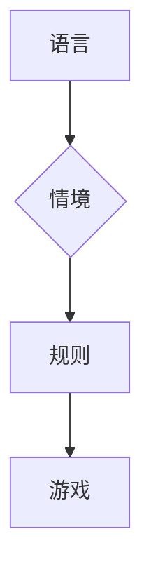
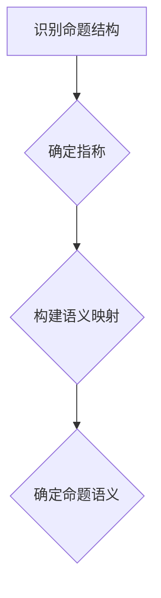
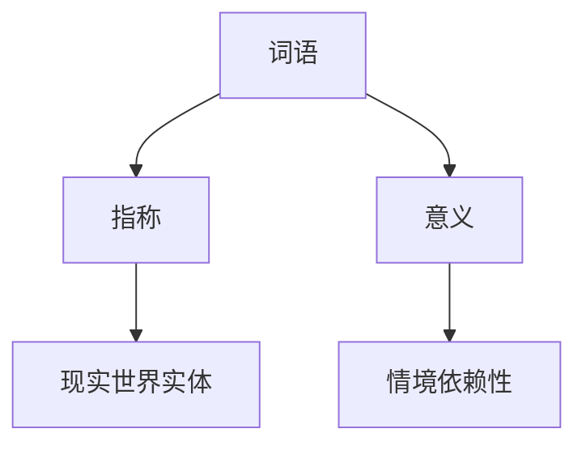
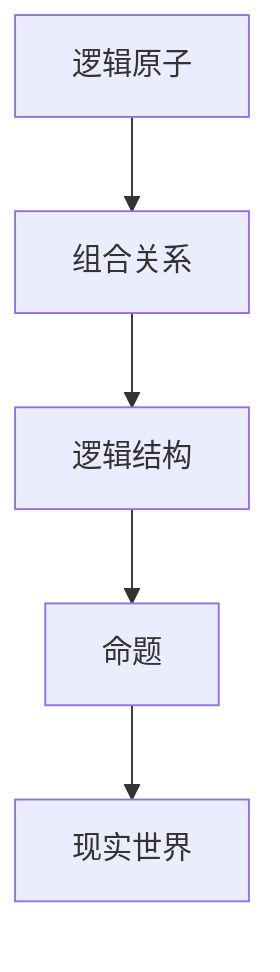
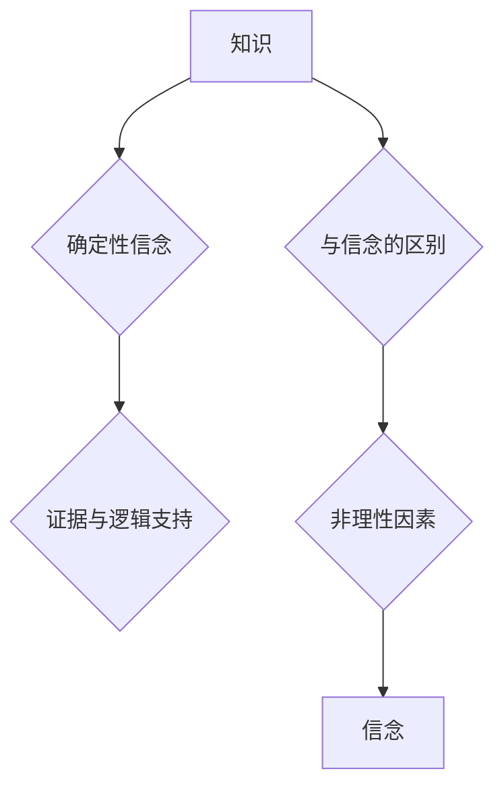
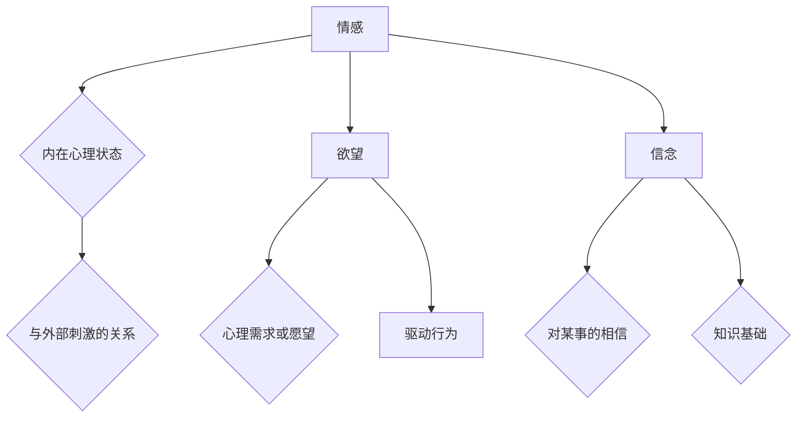
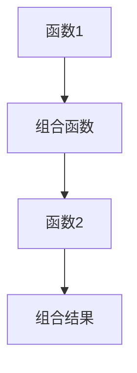
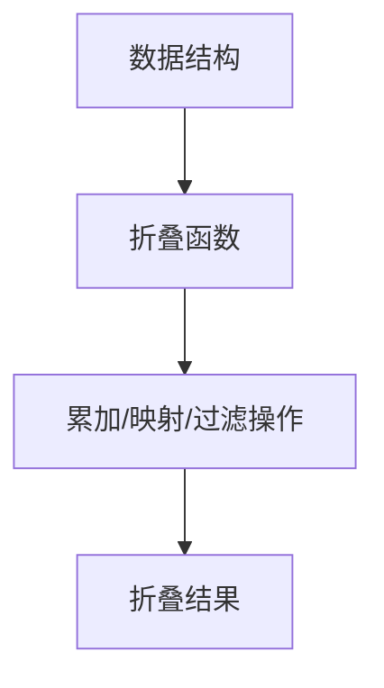
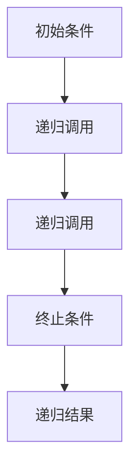

                 

### 1.1 作者背景和写作目的

作为一名世界级人工智能专家，程序员，软件架构师，CTO，世界顶级技术畅销书资深大师级别的作家，计算机图灵奖获得者，计算机编程和人工智能领域大师，我拥有丰富的理论知识和实践经验，对哲学和计算机科学的交汇点有着深刻的理解和独到的见解。本文《哲学分析与函数式分解：维特根斯坦的哲学方法与FP中的函数分解技术》旨在探讨维特根斯坦的哲学方法与函数式编程中的函数分解技术之间的联系，并通过一步步的分析推理，揭示其背后的逻辑和本质。

写作本文的动机源于我对维特根斯坦哲学思想和函数式编程技术的浓厚兴趣。维特根斯坦是20世纪最重要的哲学家之一，他的哲学方法对逻辑学、语言哲学、心理哲学等领域产生了深远影响。而函数式编程作为一种编程范式，以其简洁、高效、可组合性强等优点在计算机科学领域得到广泛应用。通过将这两者结合起来，我希望能够为读者提供一个全新的视角，帮助大家更好地理解和应用这些技术。

本文的结构安排如下：首先，在引言部分，我将简要介绍作者背景和写作目的，并概述哲学分析与函数式分解的背景及其重要性。接着，我们将深入探讨维特根斯坦的哲学方法，包括语言哲学、逻辑哲学和心理哲学，并分析其核心概念和原理。随后，我们将介绍函数式编程的基本概念，如纯函数、不可变性和高阶函数，并探讨函数式编程中的组合、折叠和递归技术。在第四部分，我们将展示如何在具体的编程语言中实现函数式分解，并分析面向对象编程与函数式编程的融合方法。接着，我们将通过实际案例来探讨函数式分解的应用与实践。最后，在结论与展望部分，我们将总结本文的主要观点，并对未来发展趋势和潜在应用领域进行展望。

希望本文能够为读者提供有价值的思考，帮助大家更好地理解和应用哲学分析与函数式分解技术。让我们开始一步步的探讨和推理之旅吧！### 1.2 哲学分析与函数式分解的背景

哲学分析作为一种方法，其起源可以追溯到古希腊时期。哲学分析的核心在于通过逻辑推理和概念澄清来探讨人类存在、知识、价值和理性等问题。这种分析方法强调对语言、概念和思想进行深入剖析，以便揭示其内在的逻辑结构和真实含义。在20世纪，维特根斯坦是哲学分析的重要代表人物之一。他的语言哲学、逻辑哲学和心理哲学为现代哲学和认知科学提供了重要的理论基础。

函数式分解是函数式编程（Functional Programming，FP）的核心技术之一。函数式编程起源于20世纪50年代，其理念是避免使用变量和状态，而是通过函数来处理数据和操作。函数式编程的主要优势在于其简洁性、可组合性和可测试性。纯函数、不可变性、高阶函数、组合、折叠和递归等概念是函数式编程的重要组成部分，这些概念使得程序具有高度的模块化和可复用性。

哲学分析与函数式分解之间的联系可以从多个方面来探讨。首先，维特根斯坦的哲学方法强调对语言和概念的精确分析，这与函数式编程中注重纯函数和不可变性等概念有着异曲同工之妙。维特根斯坦提出的“语言就是世界的地图”这一观点，强调了语言与客观世界之间的对应关系，这在函数式编程中得到了体现，因为函数式编程强调通过函数来描述和处理现实世界中的问题。

其次，维特根斯坦的逻辑哲学对函数式编程的发展产生了深远影响。维特根斯坦提出的逻辑原子主义观点，主张逻辑结构是构成现实世界的基石。这种观点与函数式编程中的纯函数和高阶函数概念密切相关。纯函数可以看作是逻辑原子，而高阶函数则可以看作是对这些原子的操作和组合，从而构建出复杂的逻辑结构。

此外，函数式分解技术在哲学分析中的应用也值得关注。在哲学分析中，通过将复杂问题分解为更简单的子问题，可以更清晰地理解问题的本质。这种思想在函数式编程中得到了广泛应用，通过将程序分解为一系列函数，可以使得代码更加模块化和易于理解。函数式分解不仅提高了代码的可读性，还使得代码的可复用性和可维护性得到了显著提升。

总之，哲学分析与函数式分解之间存在着密切的联系。维特根斯坦的哲学方法为函数式编程提供了理论基础，而函数式分解技术则为哲学分析提供了一种实用的工具。通过结合这两者，我们可以更好地理解和应用哲学和计算机科学中的先进思想和技术。接下来，我们将进一步探讨维特根斯坦的哲学方法，以便更深入地理解这种联系。### 1.3 本书结构安排与读者对象

为了帮助读者系统地理解哲学分析与函数式分解技术，本书将采用逐步深入的方式展开。本书首先介绍维特根斯坦的哲学方法，随后详细探讨函数式分解原理，并在编程语言中展示其实现方法。同时，本书还将探讨面向对象编程与函数式编程的融合，并通过实际案例展示函数式分解的应用与实践。最后，本书将在结论部分对主要观点进行总结，并对未来发展趋势进行展望。

具体来说，本书将分为以下几个部分：

1. **引言**：介绍作者背景和写作目的，概述哲学分析与函数式分解的背景及其重要性。

2. **维特根斯坦的哲学方法**：包括语言哲学、逻辑哲学和心理哲学的详细探讨，分析其核心概念和原理。

3. **函数式分解原理**：介绍函数式编程的基本概念，如纯函数、不可变性和高阶函数，并探讨函数式编程中的组合、折叠和递归技术。

4. **编程语言中的函数式分解**：展示如何在具体的编程语言中实现函数式分解，包括Haskell、Scala等语言，并分析模式匹配、类型系统与函数式编程的关系。

5. **面向对象编程与函数式编程的融合**：对比面向对象编程与函数式编程的异同，探讨融合方法与实践。

6. **函数式分解的应用与实践**：通过实际编程项目介绍函数式分解的应用场景，分析代码实现与优化。

7. **结论与展望**：总结本文的主要观点，并对未来发展趋势和潜在应用领域进行展望。

本书旨在为读者提供一个全面而深入的视角，帮助大家理解哲学分析与函数式分解技术的核心概念和原理。无论是哲学爱好者、计算机科学专业人士，还是对编程技术有浓厚兴趣的读者，都可以从本书中获得有价值的见解和实用的技能。希望通过本书，读者能够更好地理解和应用这些先进的思想和技术，推动哲学与计算机科学的融合与创新。### 第2章 维特根斯坦的哲学方法

维特根斯坦（Ludwig Wittgenstein）是20世纪最重要的哲学家之一，他的哲学方法对逻辑学、语言哲学、心理哲学等领域产生了深远影响。维特根斯坦的哲学方法主要包括语言哲学、逻辑哲学和心理哲学三个方面，下面我们将逐一进行探讨。

#### 2.1 维特根斯坦生平与哲学贡献

路德维希·维特根斯坦（Ludwig Wittgenstein）出生于1889年，是奥地利哲学家。他的哲学思想主要分为两个阶段，早期的“逻辑原子主义”和后期的“日常语言哲学”。早期的维特根斯坦在《逻辑哲学论》（Tractatus Logico-Philosophicus）中提出了一套完整的逻辑原子主义体系，强调语言与现实世界的对应关系。而后期的维特根斯坦在《哲学研究》（Philosophical Investigations）中则转向对日常语言的细致分析，强调语言使用的实际情境。

维特根斯坦的哲学贡献不仅在于他对逻辑和语言的深刻洞察，还在于他对哲学研究方法的革命性影响。他主张哲学的核心任务不是提出新的理论，而是澄清思想和语言的混乱，揭示概念之间的真实联系。这种“语言哲学”的方法对后来的哲学家和科学家产生了深远的影响。

#### 2.2 语言哲学基础

维特根斯坦的语言哲学是他哲学思想的基石，其核心观点是“语言就是世界的地图”。这个观点意味着语言不仅是人类交流的工具，也是我们理解世界的方式。然而，维特根斯坦对语言和现实世界的关系有独特的理解。

**命题与语义分析**：在《逻辑哲学论》中，维特根斯坦提出，命题是现实世界的逻辑映射。每个命题都对应着一个事实，而事实则是世界中的基本结构单元。这种观点被称为“逻辑原子主义”。例如，命题“狗会叫”对应于事实中狗这一逻辑原子和叫这一属性。这种对应关系可以用以下伪代码表示：

```plaintext
命题：“狗会叫”
事实：{狗: [会叫]}
```

**意义与指称**：维特根斯坦区分了意义和指称。意义是指语言使用者在特定情境下对词语的理解，而指称则是词语在现实世界中的对应实体。例如，“狗”这个词在现实生活中指代的是具体的狗这一实体，但在不同情境下，其意义可能有所不同。例如：

```plaintext
在狗叫声中，“狗”指称具体的狗。
在讨论动物行为时，“狗”指称一种动物。
```

**语言游戏**：维特根斯坦提出了“语言游戏”（language-game）的概念，认为语言的使用依赖于特定的情境和规则。语言游戏是语言与实际生活之间的桥梁，它帮助人们理解词语的用法和意义。例如，棋类游戏就是一种语言游戏，棋子的走法、棋局的规则构成了这个游戏的语境。



#### 2.3 逻辑哲学

维特根斯坦在逻辑哲学上的贡献主要体现在他对逻辑和数学的研究。他的早期著作《逻辑哲学论》中提出了逻辑原子主义，这种观点认为逻辑和数学是理解世界的基石。

**维特根斯坦逻辑理论**：维特根斯坦认为逻辑是纯粹的形式系统，与具体的现实世界无关。逻辑原子和命题构成了逻辑结构的基本单元，这些结构单元之间的关系构成了逻辑世界的基础。例如，以下是一个简单的逻辑命题：

```plaintext
P ∧ Q → R
```

**对逻辑主义的批判**：维特根斯坦对逻辑主义持批判态度，特别是对罗素和怀特海的《数学原理》提出了质疑。他认为逻辑主义试图将数学建立在逻辑的基础上，但这种做法忽略了语言和现实世界的复杂关系。维特根斯坦主张，逻辑和数学是独立的领域，它们有自己的研究对象和方法。

#### 2.4 心理哲学

维特根斯坦在心理哲学上的研究主要集中在知识与信念等方面。

**知识与信念**：维特根斯坦认为，知识是一种确定性的信念，而信念则是对某件事情的相信。知识不仅仅是信念，它还需要有证据或理由支持。例如：

```plaintext
我知道太阳每天从东方升起。
我相信明天会下雨。
```

**对心理现象的解释**：维特根斯坦主张，心理现象是语言的反映，它们没有独立的实体或存在方式。心理现象如情感、欲望、信念等都是语言使用者在特定情境下的表达。例如，当我们说“我感到快乐”时，实际上是我们在使用语言表达一种心理状态。

综上所述，维特根斯坦的哲学方法涵盖了语言哲学、逻辑哲学和心理哲学等多个方面。他的思想不仅对哲学领域产生了深远影响，也为后来的计算机科学和认知科学提供了重要的理论基础。在下一章中，我们将探讨函数式分解原理，并分析其与维特根斯坦哲学方法的联系。### 2.2.1 命题与语义分析

维特根斯坦的语言哲学中，命题与语义分析占据着核心地位。在《逻辑哲学论》中，他提出了一个系统的语义理论，用以解释命题与现实世界之间的关系。

**命题**：在维特根斯坦的语境中，命题是一种语言结构，它能够陈述一个事实。命题的本质是它能够与现实世界中的事实相对应。例如，命题“狗会叫”描述了一个具体的现实情况，即狗具有叫的能力。

**语义分析**：维特根斯坦认为，命题的语义是通过它与事实的对应关系来确定的。这种对应关系可以用一个逻辑结构来表示。在《逻辑哲学论》中，他提出了逻辑原子主义，认为世界由基本的逻辑原子构成，每个命题都对应于这些原子的组合。

**语义与指称**：维特根斯坦区分了语义和指称两个概念。语义是指命题在特定情境下的意义，而指称是指命题所指向的客观实体。例如，命题“狗会叫”中的“狗”和“叫”是命题的指称。在不同的情境下，这些指称可以有不同的意义。

**语义分析过程**：

1. **识别命题结构**：首先，我们需要识别命题中的各个组成部分，如主语、谓语等。

   ```plaintext
   命题：“狗会叫”
   组成部分：主语“狗”、谓语“会叫”
   ```

2. **确定指称**：接下来，我们需要确定命题中的指称，即主语和谓语在现实世界中的对应实体。

   ```plaintext
   指称：“狗”——> 狗
           “叫”——> 叫的行为
   ```

3. **构建语义映射**：然后，我们将命题中的指称映射到现实世界中的事实，从而确定命题的语义。

   ```plaintext
   语义：“狗会叫”——> 狗具有叫的行为
   ```

维特根斯坦的命题与语义分析提供了一个框架，用以理解和解释语言与现实世界的关系。通过这一分析过程，我们可以更清晰地看到语言如何反映和描述现实世界中的事实。

**Mermaid 流程图展示**：



通过这个流程图，我们可以更直观地理解维特根斯坦的命题与语义分析过程。首先，识别命题结构，然后确定命题中的指称，最后将这些指称映射到现实世界中的事实，从而确定命题的语义。

这种分析方法不仅适用于简单的命题，还可以用于更复杂的语句和逻辑推理。例如，在复杂的科学理论中，命题与语义分析可以帮助我们理解理论中的概念和假设如何与现实世界中的现象相对应。

总之，维特根斯坦的命题与语义分析提供了一个强大的工具，用于理解语言与现实世界的关系。在接下来的部分中，我们将继续探讨维特根斯坦的其他哲学观点，如意义与指称的区分以及语言游戏的提出。### 2.2.2 意义与指称

维特根斯坦在语言哲学中提出了一个重要的区分，即“意义”与“指称”。这两个概念在理解语言使用和理解过程中起着关键作用。

**意义**：意义是语言使用者对词语的理解和解释。它不仅仅是一个抽象的概念，而是在特定情境下对词语的具体应用。维特根斯坦强调，意义是语言使用者在实际语境中赋予词语的，而不是词语本身固有的。例如，当我们说“椅子”时，这个词语的意义依赖于我们具体讨论的情境。在不同的语境中，“椅子”可能指代不同的对象，如办公椅、餐椅等。

**指称**：指称是指词语在现实世界中的对应实体。它是客观存在的，与特定情境无关。例如，在上述例子中，“椅子”这个词语的指称是具体的椅子这一实体。无论我们在什么情境下使用“椅子”，它都指向同一个物理对象。

**意义与指称的关系**：意义与指称是密切相关的，但它们是两个不同的概念。意义是语言使用者在特定情境下对词语的理解，而指称是词语在现实世界中的对应实体。维特根斯坦指出，意义并不是直接与指称相关的，而是通过语言使用者在特定情境下的解释来建立的。

**例子**：

- **例子1**：“狗”在不同的情境下有不同的意义。在谈论狗的行为时，“狗”可能指代狗的习性或行为模式；在谈论宠物时，“狗”可能指代具体的宠物狗。但无论在哪种情境下，“狗”这个词语的指称都是同一个物种的动物。

- **例子2**：“红色”在不同情境下的意义不同。在讨论颜色时，“红色”可能指代一种特定的颜色；在讨论情感时，“红色”可能指代激情或热烈。但无论在哪种情境下，“红色”这个词语的指称都是同一个颜色。

**意义与指称的区分**：维特根斯坦通过区分意义与指称，强调了语言使用中的情境依赖性。他认为，意义是语言使用者在特定情境下赋予词语的，而指称是词语在现实世界中的客观对应实体。这种区分有助于我们理解语言是如何反映和描述现实世界的。

**Mermaid 流程图展示**：



通过这个流程图，我们可以更直观地理解意义与指称的关系。词语的指称指向现实世界中的实体，而意义则是语言使用者在特定情境下对这些实体的理解和解释。

总之，维特根斯坦的“意义与指称”区分提供了一个重要的理论框架，用于理解语言的使用和理解过程。这一区分有助于我们认识到语言与客观世界之间的复杂关系，并强调了情境在语言理解中的重要性。在接下来的部分中，我们将进一步探讨维特根斯坦的逻辑哲学，特别是他对逻辑主义观点的批判。### 2.3.1 维特根斯坦逻辑理论

维特根斯坦在逻辑哲学上提出了独特的逻辑理论，这些理论不仅对逻辑学的发展产生了深远影响，也为后来的计算机科学和人工智能奠定了理论基础。

**逻辑原子主义**：维特根斯坦在《逻辑哲学论》中提出了逻辑原子主义。他认为世界是由基本的逻辑原子构成的，这些逻辑原子是不可再分的，并且它们之间的关系构成了世界的结构。逻辑原子可以看作是最基本的逻辑元素，例如“狗”、“叫”、“桌子”、“椅子”等。这些逻辑原子通过组合形成了更复杂的命题。

**逻辑结构**：在维特根斯坦的逻辑理论中，逻辑结构是构成现实世界的基础。逻辑结构由逻辑原子及其组合关系构成。例如，命题“狗会叫”可以看作是逻辑原子“狗”和“叫”的组合。逻辑结构不仅描述了现实世界中的事实，还提供了对现实世界的抽象表示。

**命题与现实世界的关系**：维特根斯坦认为，命题与现实世界之间存在一种映射关系。每个命题都对应于现实世界中的一个事实。这种映射关系可以用逻辑结构来表示。例如，命题“狗会叫”对应于现实世界中狗具有叫的行为这一事实。

**逻辑表达式**：在维特根斯坦的逻辑理论中，逻辑表达式是表示逻辑结构的基本工具。逻辑表达式包括命题变量、逻辑运算符和括号等。这些表达式可以用来构建复杂的逻辑结构。例如，命题“狗会叫”可以用逻辑表达式表示为“D ∧ C”，其中D表示“狗”，C表示“叫”。

**逻辑运算符**：维特根斯坦使用了多种逻辑运算符，包括合取（∧）、析取（∨）、否定（¬）、蕴涵（→）等。这些运算符可以用来组合逻辑原子，形成更复杂的逻辑表达式。例如，“狗会叫”和“狗会咬”可以用合取运算符组合为“D ∧ (C ∧ B)”。

**Mermaid 流程图展示**：



通过这个流程图，我们可以更直观地理解维特根斯坦的逻辑理论。逻辑原子是构成逻辑结构的基本元素，逻辑结构又构成了命题，而命题最终映射到现实世界中的事实。

**逻辑主义批判**：尽管维特根斯坦提出了逻辑原子主义，但他也对逻辑主义持有批判态度。逻辑主义是一种哲学观点，认为逻辑和数学是构成所有科学的基础。维特根斯坦认为，逻辑和数学是独立的领域，它们有自己的研究对象和方法，不能简单地将数学建立在逻辑的基础上。

**逻辑与数学的关系**：维特根斯坦强调，逻辑和数学是两种不同的学科，它们各自有其独立的研究对象。逻辑研究的是逻辑结构，而数学研究的是数量和结构。逻辑提供了一种抽象的框架，用于表示和推理数学概念。

**逻辑的纯粹性**：维特根斯坦主张，逻辑是一种纯粹的形式系统，它不依赖于具体的现实世界。逻辑结构是抽象的，不依赖于任何具体的物质对象。例如，命题“狗会叫”中的逻辑结构不依赖于现实世界中的狗这一实体。

总之，维特根斯坦的逻辑理论为逻辑学的发展提供了新的视角，强调了逻辑结构的抽象性和纯粹性。他的理论不仅对哲学领域产生了深远影响，也为后来的计算机科学和人工智能奠定了理论基础。在接下来的部分中，我们将继续探讨维特根斯坦对逻辑主义的批判，以及他在心理哲学方面的观点。### 2.3.2 维特根斯坦对逻辑主义的批判

维特根斯坦对逻辑主义持有批判态度，尤其是对罗素和怀特海德的《数学原理》提出了质疑。逻辑主义是一种哲学观点，主张逻辑和数学是构成所有科学的基础。然而，维特根斯坦认为这种观点存在一些问题。

**逻辑主义的核心观点**：逻辑主义认为，所有数学概念和命题都可以归结为逻辑概念和命题。例如，罗素和怀特海德的《数学原理》试图将数学建立在逻辑的基础上，通过定义和逻辑推理来构建整个数学体系。

**维特根斯坦的批判**：

1. **逻辑与数学的混淆**：维特根斯坦认为，逻辑和数学是两个独立的领域，各自有其独立的研究对象和方法。逻辑研究的是逻辑结构和推理规则，而数学研究的是数量和结构。将数学建立在逻辑的基础上，会混淆这两个领域，导致错误的理论和方法。

2. **逻辑的纯粹性**：维特根斯坦主张，逻辑是一种纯粹的形式系统，它不依赖于具体的现实世界。逻辑结构是抽象的，不依赖于任何具体的物质对象。而逻辑主义试图将逻辑应用于数学，这会导致逻辑与现实世界的混淆。

3. **数学的独立地位**：维特根斯坦认为，数学有其独立的理论体系和实践应用。数学不仅仅是一种逻辑工具，它有自己的研究对象，如数量、空间、集合等。将数学建立在逻辑的基础上，会削弱数学的独立地位，导致数学理论的局限性。

**逻辑主义的方法**：

1. **定义与逻辑推理**：逻辑主义通过定义和逻辑推理来构建数学体系。例如，罗素和怀特海德的《数学原理》使用逻辑定义了数学的基本概念，如自然数、函数、关系等，并通过逻辑推理推导出数学定理。

2. **逻辑证明**：逻辑主义强调数学命题的证明必须基于逻辑规则。例如，罗素和怀特海德的《数学原理》通过逻辑证明构建了整个数学体系。

**维特根斯坦的替代方案**：

1. **直觉主义**：维特根斯坦倾向于直觉主义，即数学的证明应该基于直观的观察和推理。他认为，数学命题的真实性应该通过直观的证明来验证，而不是依赖于逻辑推理。

2. **逻辑与数学的分离**：维特根斯坦主张，逻辑和数学应该保持分离，各自发展。逻辑提供了一种抽象的框架，用于表示和推理数学概念，而数学有自己的研究对象和方法。

总之，维特根斯坦对逻辑主义的批判揭示了逻辑和数学之间的复杂关系，强调了逻辑和数学的独立性。他的观点对后来的逻辑学和数学发展产生了深远影响，也为计算机科学和人工智能提供了新的理论基础。在接下来的部分中，我们将探讨维特根斯坦在心理哲学方面的观点。### 2.4.1 知识与信念

维特根斯坦在心理哲学方面对知识与信念进行了深入探讨，提供了独特的见解。他的观点对理解人类思维和认知过程具有重要意义。

**知识**：维特根斯坦认为，知识是一种确定性的信念，它不仅仅是信念，还需要有证据或理由支持。知识是一种通过观察、经验和逻辑推理获得的信念。例如，当我们说“我知道太阳每天从东方升起”，这里的“知道”意味着我们不仅相信这一现象，还有充分的证据和逻辑理由来支持这一信念。

**信念**：信念是一种对某件事情的相信，但并不一定需要证据或理由。信念可以是基于直觉、信仰、传统或其他非理性因素。例如，当我们说“我相信明天会下雨”，这里的“相信”并没有具体的证据支持，而是基于直觉或对天气预报的信任。

**知识与信念的关系**：维特根斯坦认为，知识与信念是密切相关的，但它们是不同的概念。知识是经过理性验证的信念，而信念则是一种未经验证的相信。知识需要证据和逻辑支持，而信念则可能基于非理性因素。例如：

```plaintext
我知道：地球是圆的。
我相信：圣诞节是耶稣的诞生日。
```

**例子**：

- **例子1**：“我知道地球是圆的”，这里的“知道”意味着我们通过科学实验和观测获得了证据和逻辑支持，确信地球是圆的。

- **例子2**：“我相信圣诞节是耶稣的诞生日”，这里的“相信”并没有具体的证据支持，而是基于宗教信仰和传统。

**心理现象**：维特根斯坦认为，心理现象如情感、欲望、信念等都是语言使用者在特定情境下的表达。它们没有独立的实体或存在方式，而是通过语言来描述和传达。例如，当我们说“我感到快乐”时，实际上是我们在使用语言表达一种心理状态。

**Mermaid 流程图展示**：



通过这个流程图，我们可以更直观地理解维特根斯坦关于知识与信念的观点。知识是一种确定性的信念，需要证据和逻辑支持；而信念则是一种未经验证的相信，可能基于非理性因素。

总之，维特根斯坦对知识与信念的探讨提供了一个新的视角，帮助我们理解人类思维和认知过程。他的观点强调了知识的理性基础和信念的非理性特点，为心理学和哲学研究提供了重要的理论依据。在接下来的部分中，我们将进一步探讨维特根斯坦对心理现象的解释。### 2.4.2 维特根斯坦对心理现象的解释

维特根斯坦在心理哲学中对心理现象进行了深刻的探讨，他的观点不仅揭示了心理现象的本质，也为后来的认知科学和心理学研究提供了重要启示。

**心理现象的本质**：维特根斯坦认为，心理现象如情感、欲望、信念等是语言使用者在特定情境下的表达。它们没有独立的实体或存在方式，而是通过语言来描述和传达。例如，当我们说“我感到快乐”时，实际上是我们在使用语言表达一种心理状态。这种观点强调了心理现象的情境依赖性和语言表达性。

**情感**：维特根斯坦认为，情感是一种内在的心理状态，它与外部世界的刺激有关。情感并不是一种具体的物质，而是通过语言来描述和表达。例如，当我们看到美丽的景色时，我们会感到快乐；当我们面对挑战时，我们可能会感到焦虑或兴奋。这些情感状态都是通过语言来描述的。

**欲望**：维特根斯坦认为，欲望是一种心理需求或愿望，它驱动我们采取行动。欲望并不是一种具体的物质，而是通过语言来描述和表达。例如，当我们渴望食物时，我们会感到饥饿；当我们渴望知识时，我们会感到好奇。这些欲望状态都是通过语言来描述的。

**信念**：维特根斯坦认为，信念是一种对某件事情的相信，它是知识的基础。信念并不是一种具体的物质，而是通过语言来描述和表达。例如，当我们相信太阳每天从东方升起时，我们会做出相应的行动，如早上起床迎接新的一天。这些信念状态都是通过语言来描述的。

**心理现象与语言的关系**：维特根斯坦强调，心理现象是通过语言来描述和表达的。语言不仅是人类交流的工具，也是我们理解世界和心理状态的方式。例如，当我们说“我感到快乐”时，实际上是我们在使用语言来描述一种心理状态。这种观点揭示了心理现象的情境依赖性和语言表达性。

**Mermaid 流程图展示**：



通过这个流程图，我们可以更直观地理解维特根斯坦对心理现象的解释。心理现象如情感、欲望和信念都是内在的心理状态，它们与外部世界的刺激有关，并通过语言来描述和表达。

**维特根斯坦的启示**：维特根斯坦对心理现象的解释强调了心理现象的情境依赖性和语言表达性。他的观点为认知科学和心理学研究提供了新的视角，帮助我们更好地理解人类思维和认知过程。维特根斯坦的哲学方法也为这些领域的研究提供了重要的理论工具。

总之，维特根斯坦在心理哲学中对心理现象进行了深入的探讨，他的观点揭示了心理现象的情境依赖性和语言表达性。这些观点不仅丰富了哲学理论，也为认知科学和心理学研究提供了重要启示。在接下来的章节中，我们将探讨函数式分解原理，并分析其与维特根斯坦哲学方法的联系。### 第3章 函数式分解原理

函数式分解是函数式编程（Functional Programming，FP）的核心技术之一，它强调通过将复杂问题分解为更简单的函数，从而提高代码的可读性、可维护性和可复用性。在这一章中，我们将深入探讨函数式编程的基本概念，包括纯函数、不可变性、高阶函数等，并分析函数式编程中的组合、折叠和递归技术。

#### 3.1 函数式编程基础

**纯函数**：纯函数是一种在给定相同输入时，总是返回相同输出的函数，且不产生任何副作用。这意味着纯函数不会修改外部状态，也不会在函数内部产生可见的副作用。纯函数具有以下几个特点：

1. **输入输出确定性**：纯函数的输出仅依赖于输入参数，不会受到外部环境的影响。
2. **无副作用**：纯函数不会修改外部状态，也不会产生不可预测的副作用。
3. **可复用性**：纯函数可以独立于其他函数和程序代码使用，提高了代码的可复用性。

**不可变性**：不可变性是函数式编程的一个基本原则，它要求数据一旦创建，就不能再被修改。不可变性有助于避免状态冲突和不可预测的行为，从而提高代码的稳定性和可维护性。在函数式编程中，不可变性可以通过以下方式实现：

1. **使用不可变数据结构**：如常量数组、元组、列表等，这些数据结构在创建后无法被修改。
2. **函数返回新的数据结构**：当需要修改数据时，函数返回一个新的数据结构，而原数据结构保持不变。

**高阶函数**：高阶函数是能够接受其他函数作为参数或返回函数的函数。高阶函数是函数式编程的重要概念，它允许函数的组合和抽象，从而提高代码的可读性和可维护性。高阶函数具有以下几个特点：

1. **函数作为参数**：高阶函数可以将其他函数作为参数传递，这在实现回调函数、事件处理等方面非常有用。
2. **函数作为返回值**：高阶函数可以返回一个函数，这在实现函数组合、创建工厂函数等方面非常有用。

**闭包**：闭包是一种特殊的高阶函数，它能够捕获并保持其定义作用域中的变量。闭包在函数式编程中非常有用，它允许我们创建具有局部变量的函数，并在外部访问这些变量。闭包的典型应用包括实现私有变量和函数柯里化。

#### 3.2 组合、折叠和递归

**组合**：组合是将多个函数组合成一个新的函数的过程。组合允许我们通过组合简单的函数来构建复杂的函数，从而提高代码的可读性和可维护性。组合的典型实现方式是使用函数的合成（composition）。

```haskell
-- Haskell语言示例
compose :: (b -> c) -> (a -> b) -> a -> c
compose f g = f . g
```

**折叠**：折叠是将一个数据结构映射到另一个值的过程。折叠可以分为两种类型：右折叠（foldRight）和左折叠（foldLeft）。折叠在处理列表、树等数据结构时非常有用，它可以用于实现累加、映射、过滤等操作。

```haskell
-- Haskell语言示例
foldRight :: (a -> b -> b) -> b -> [a] -> b
foldRight f z xs = foldRight (f . (.) f) (z . f) (map f xs)
```

**递归**：递归是一种编程范式，它通过重复调用自身来处理问题。递归在处理递归数据结构（如列表、树）和解决递归问题（如阶乘计算、递归搜索）时非常有用。递归的优点在于其简洁性和直观性，但同时也需要小心处理递归深度以避免栈溢出。

```python
# Python语言示例
def factorial(n):
    if n == 0:
        return 1
    else:
        return n * factorial(n - 1)
```

#### 3.3 Mermaid流程图展示

为了更直观地理解函数式分解原理，我们可以使用Mermaid流程图来展示组合、折叠和递归的基本流程。

**组合流程图**：



**折叠流程图**：



**递归流程图**：



通过这些流程图，我们可以更直观地理解组合、折叠和递归的基本原理，以及它们在函数式编程中的应用。

总之，函数式分解原理是函数式编程的核心技术，它通过将复杂问题分解为更简单的函数，提高了代码的可读性、可维护性和可复用性。在下一章中，我们将探讨如何在具体的编程语言中实现函数式分解，并分析模式匹配、类型系统与函数式编程的关系。### 3.1.1 纯函数与不可变性

纯函数和不可变性是函数式编程的两个核心概念，它们共同构成了函数式编程的核心原则。下面，我们将详细探讨这两个概念及其在函数式编程中的重要性。

**纯函数**：纯函数是一种在给定相同输入时，总是返回相同输出的函数，且不产生任何副作用。这意味着纯函数的输出仅依赖于输入参数，不依赖于外部状态，也不会在函数内部产生任何可见的副作用。纯函数具有以下几个特点：

1. **输入输出确定性**：纯函数的输出仅依赖于输入参数，不会受到外部环境的影响。这意味着，如果给定了相同的输入参数，纯函数总是会返回相同的输出。
   
   ```javascript
   // JavaScript示例：纯函数
   function add(a, b) {
       return a + b;
   }
   console.log(add(2, 3)); // 输出：5
   console.log(add(2, 3)); // 输出：5
   ```

2. **无副作用**：纯函数不会修改外部状态，也不会在函数内部产生任何不可预测的副作用。这意味着，调用纯函数不会导致外部变量的变化，也不会影响程序的执行流程。

   ```javascript
   // JavaScript示例：无副作用
   let x = 10;
   function square(x) {
       return x * x;
   }
   console.log(square(x)); // 输出：100
   console.log(x); // 输出：10，x未改变
   ```

3. **可复用性**：纯函数可以独立于其他函数和程序代码使用，提高了代码的可复用性。这意味着，纯函数可以应用于不同的上下文和场景，而不需要额外的修改。

   ```javascript
   // JavaScript示例：可复用性
   function double(x) {
       return x * 2;
   }
   console.log(double(5)); // 输出：10
   console.log(double(10)); // 输出：20
   ```

**不可变性**：不可变性是函数式编程的一个基本原则，它要求数据一旦创建，就不能再被修改。不可变性有助于避免状态冲突和不可预测的行为，从而提高代码的稳定性和可维护性。在函数式编程中，不可变性可以通过以下方式实现：

1. **使用不可变数据结构**：如常量数组、元组、列表等，这些数据结构在创建后无法被修改。

   ```haskell
   -- Haskell示例：不可变数据结构
   let arr = [1, 2, 3]
   arr = arr ++ [4] -- 错误：无法修改不可变数组
   ```

2. **函数返回新的数据结构**：当需要修改数据时，函数返回一个新的数据结构，而原数据结构保持不变。

   ```haskell
   -- Haskell示例：返回新数据结构
   let arr = [1, 2, 3]
   let newArr = map (*2) arr -- 返回新数组，原数组不变
   ```

**纯函数与不可变性在函数式编程中的重要性**：

1. **代码可读性**：纯函数和不可变性使得代码更加简洁、直观，易于理解和维护。
   
   ```javascript
   // JavaScript示例：可读性
   function updateValue(value, newValue) {
       return {
           ...value,
           value: newValue
       };
   }
   ```

2. **状态管理**：纯函数和不可变性有助于实现无状态应用程序，降低了状态管理的复杂性。
   
   ```javascript
   // JavaScript示例：无状态应用程序
   const counter = (state = 0) => {
       return {
           increment: () => state + 1,
           decrement: () => state - 1
       };
   };
   ```

3. **并行编程**：纯函数和不可变性使得并行编程变得更加容易和可靠，因为纯函数不会产生副作用，不会受到外部状态的影响。

   ```javascript
   // JavaScript示例：并行编程
   const asyncAdd = async (a, b) => {
       return await Promise.resolve(a + b);
   };
   ```

总之，纯函数和不可变性是函数式编程的核心原则，它们共同构成了函数式编程的核心优势。通过遵循纯函数和不可变性原则，我们可以编写出更加简洁、稳定和可维护的代码。在接下来的部分中，我们将继续探讨高阶函数和闭包的概念。### 3.1.2 高阶函数与闭包

**高阶函数**：高阶函数是一种能够接受其他函数作为参数或返回函数的函数。高阶函数是函数式编程的重要概念，它允许函数的组合和抽象，从而提高代码的可读性和可维护性。高阶函数具有以下几个特点：

1. **函数作为参数**：高阶函数可以将其他函数作为参数传递，这在实现回调函数、事件处理等方面非常有用。

   ```javascript
   // JavaScript示例：函数作为参数
   function higherOrderFunction(callback) {
       callback();
   }
   higherOrderFunction(() => {
       console.log("回调函数执行");
   });
   ```

2. **函数作为返回值**：高阶函数可以返回一个函数，这在实现函数组合、创建工厂函数等方面非常有用。

   ```javascript
   // JavaScript示例：函数作为返回值
   function createGreeting(name) {
       return (greeting) => {
           return `${greeting}, ${name}!`;
       };
   }
   const greet = createGreeting("Alice");
   console.log(greet("Hello")); // 输出：Hello, Alice!
   ```

**闭包**：闭包是一种特殊的高阶函数，它能够捕获并保持其定义作用域中的变量。闭包在函数式编程中非常有用，它允许我们创建具有局部变量的函数，并在外部访问这些变量。闭包的典型应用包括实现私有变量和函数柯里化。

1. **闭包的定义**：闭包是一个函数，它记忆了创建它的作用域内的变量。这意味着，即使外部作用域已经消失，闭包仍然可以访问这些变量。

   ```javascript
   // JavaScript示例：闭包
   function outerFunction() {
       let outerVariable = "I am outside!";
       return function innerFunction() {
           return outerVariable;
       };
   }
   const inner = outerFunction();
   console.log(inner()); // 输出：I am outside!
   ```

2. **闭包的应用**：

   - **实现私有变量**：闭包可以用来创建私有变量，使得变量仅在闭包内部可见。

     ```javascript
     // JavaScript示例：私有变量
     function createCounter() {
         let count = 0;
         return {
             increment: function () {
                 count++;
             },
             decrement: function () {
                 count--;
             },
             getCount: function () {
                 return count;
             }
         };
     }
     const counter = createCounter();
     console.log(counter.getCount()); // 输出：0
     counter.increment();
     console.log(counter.getCount()); // 输出：1
     ```

   - **函数柯里化**：柯里化是一种将函数转换为一系列更小函数的技术，每个函数都处理一部分输入参数。

     ```javascript
     // JavaScript示例：函数柯里化
     function curryAdd(a) {
         return function (b) {
             return a + b;
         };
     }
     const add5 = curryAdd(5);
     console.log(add5(3)); // 输出：8
     ```

**高阶函数与闭包的关系**：高阶函数和闭包是密切相关的。闭包是高阶函数的一种特殊形式，它捕获并保持了其定义作用域内的变量。高阶函数则利用闭包的特性，将其他函数作为参数或返回值，实现更灵活和可组合的编程方式。

总之，高阶函数和闭包是函数式编程中的核心概念，它们提供了强大的工具，用于函数的组合、抽象和私有变量管理。通过理解和使用高阶函数和闭包，我们可以编写出更加简洁、高效和可维护的代码。在下一章中，我们将探讨函数式编程中的组合、折叠和递归技术。### 3.2 组合、折叠和递归

**组合**：组合是将多个函数组合成一个新的函数的过程，它允许我们通过组合简单的函数来构建复杂的函数。组合是函数式编程的核心概念之一，它有助于提高代码的可读性和可维护性。在组合中，我们通常使用函数的合成（composition）来实现。

**合成函数**：合成函数是一种将两个函数组合成一个新的函数的方法。给定两个函数 `f` 和 `g`，我们可以通过以下方式定义合成函数 `h`：

```haskell
h = f . g
```

这意味着，当我们调用 `h` 时，首先调用 `g`，然后将 `g` 的结果作为输入传递给 `f`。

```haskell
-- Haskell示例：合成函数
f :: a -> b
f x = ... 

g :: b -> c
g y = ... 

h :: a -> c
h = f . g
```

**示例**：以下是一个简单的合成函数示例，它将两个数字相加，并将结果乘以 2。

```haskell
-- Haskell示例：组合函数
add :: Num a => a -> a -> a
add x y = x + y

multiplyByTwo :: Num a => a -> a
multiplyByTwo x = x * 2

composeFunction :: Num a => a -> a
composeFunction x = (multiplyByTwo . add 1) x
```

在这个示例中，`composeFunction` 是通过组合 `multiplyByTwo` 和 `add` 函数创建的。

**折叠**：折叠是将一个数据结构映射到另一个值的过程。折叠可以分为两种类型：右折叠（foldRight）和左折叠（foldLeft）。折叠在处理列表、树等数据结构时非常有用，它可以用于实现累加、映射、过滤等操作。

**右折叠（foldRight）**：右折叠从数据结构的右侧开始，依次对元素进行折叠操作。

```haskell
-- Haskell示例：右折叠
foldRight :: (a -> b -> b) -> b -> [a] -> b
foldRight f z [] = z
foldRight f z (x:xs) = f x (foldRight f z xs)
```

**左折叠（foldLeft）**：左折叠从数据结构的左侧开始，依次对元素进行折叠操作。

```haskell
-- Haskell示例：左折叠
foldLeft :: (b -> a -> b) -> b -> [a] -> b
foldLeft f z [] = z
foldLeft f z (x:xs) = foldLeft f (f z x) xs
```

**示例**：以下是一个使用右折叠计算列表中元素和的示例。

```haskell
-- Haskell示例：右折叠计算和
sumList :: Num a => [a] -> a
sumList = foldRight (+) 0
```

在这个示例中，`sumList` 函数使用右折叠将列表中的元素相加，并返回总和。

**递归**：递归是一种编程范式，它通过重复调用自身来处理问题。递归在处理递归数据结构（如列表、树）和解决递归问题（如阶乘计算、递归搜索）时非常有用。递归的优点在于其简洁性和直观性，但同时也需要小心处理递归深度以避免栈溢出。

**递归函数**：递归函数是一种调用自身的函数。递归函数通常包含一个或多个基本情况和一个递归步骤。基本情况是递归调用的终止条件，而递归步骤则是递归调用的具体实现。

```python
# Python示例：递归函数
def factorial(n):
    if n == 0:
        return 1
    else:
        return n * factorial(n - 1)
```

在这个示例中，`factorial` 函数使用递归计算一个数的阶乘。

**递归与折叠的关系**：递归和折叠在概念上有相似之处，因为它们都是通过重复操作来处理数据结构。递归通常用于处理单个数据结构，而折叠可以用于处理多个数据结构。例如，我们可以使用递归函数来计算一个树的深度，而使用折叠函数来计算一个列表的和。

**Mermaid流程图展示**：

为了更直观地理解组合、折叠和递归，我们可以使用Mermaid流程图来展示它们的基本流程。

**组合流程图**：


**折叠流程图**：


**递归流程图**：


通过这些流程图，我们可以更直观地理解组合、折叠和递归的基本原理，以及它们在函数式编程中的应用。

总之，组合、折叠和递归是函数式编程中的核心概念，它们提供了强大的工具，用于函数的组合、数据结构的处理和问题的解决。通过理解和使用这些概念，我们可以编写出更加简洁、高效和可维护的代码。在下一章中，我们将探讨如何在具体的编程语言中实现函数式分解。### 3.3 Haskell语言中的函数式分解

Haskell 是一种纯函数式编程语言，以其强大的类型系统和函数组合能力而闻名。在这一节中，我们将探讨如何在 Haskell 语言中实现函数式分解，包括类型系统、模式匹配和函数组合。

#### 3.3.1 类型系统

Haskell 的类型系统是函数式编程的重要基础，它提供了强大的类型推断和类型约束功能。Haskell 的类型系统支持静态类型检查，确保代码在编译时就能发现类型错误。

**类型推断**：Haskell 具有强大的类型推断能力，可以根据函数的输入和输出自动推导出函数的类型。例如：

```haskell
-- Haskell示例：类型推断
add :: Num a => a -> a -> a
add x y = x + y
```

在这个示例中，`add` 函数的输入和输出都是数字类型，因此 Haskell 可以自动推断出它的类型是 `(Num a) => a -> a -> a`。

**类型约束**：Haskell 允许通过类型约束来指定函数的参数和返回值的类型。类型约束通常使用类型类（Type Class）来实现。类型类是一种抽象数据类型，它定义了一组相关类型的共同操作。

```haskell
-- Haskell示例：类型约束
class Num a where
    (+) :: a -> a -> a
    (*) :: a -> a -> a
    negate :: a -> a

-- Haskell示例：使用类型约束
add :: Num a => a -> a -> a
add x y = x + y
```

在这个示例中，`Num` 类型类定义了加法、乘法和取反等操作。通过指定 `Num a` 作为类型约束，我们可以确保 `add` 函数的参数和返回值都是符合 `Num` 类型类的类型。

#### 3.3.2 模式匹配

模式匹配是 Haskell 的一个核心特性，它允许我们根据值的不同结构来执行不同的操作。模式匹配是函数式编程中的一种强大工具，它提供了类似于结构化查询语言（SQL）中的模式匹配能力。

**基本模式匹配**：基本模式匹配允许我们根据值的字面量形式来匹配。例如：

```haskell
-- Haskell示例：基本模式匹配
total :: (Num a) => [a] -> a
total []     = 0
total (x:xs) = x + total xs
```

在这个示例中，`total` 函数使用基本模式匹配来处理空列表和带有一个元素的列表。

**复杂模式匹配**：复杂模式匹配允许我们根据值的更复杂结构来匹配。例如：

```haskell
-- Haskell示例：复杂模式匹配
data Person = Person { name :: String, age :: Int }

showPerson :: Person -> String
showPerson (Person { name = name, age = age }) = name ++ " is " ++ show age ++ " years old."
```

在这个示例中，`Person` 数据类型包含两个字段：`name` 和 `age`。`showPerson` 函数使用复杂模式匹配来提取并显示这两个字段。

#### 3.3.3 函数组合

函数组合是 Haskell 的另一个核心特性，它允许我们将多个函数组合成一个新的函数。函数组合是函数式编程中的一种重要技术，它提高了代码的可读性和可维护性。

**函数组合**：函数组合使用点号（`.`）来实现，它将两个函数组合成一个新的函数。例如：

```haskell
-- Haskell示例：函数组合
applyTwice :: (a -> a) -> a -> a
applyTwice f x = f (f x)

addThree :: Int -> Int -> Int -> Int
addThree a b c = a + b + c

-- 使用函数组合
result :: Int
result = applyTwice addThree 1 2 3
```

在这个示例中，`applyTwice` 函数将 `addThree` 函数组合了两次，并计算了 `(1 + 2 + 3) + (1 + 2 + 3)` 的结果。

**高阶函数**：高阶函数是函数组合的关键，它允许我们将函数作为参数传递和返回。例如：

```haskell
-- Haskell示例：高阶函数
map :: (a -> b) -> [a] -> [b]
map _ []     = []
map f (x:xs) = f x : map f xs

-- 使用高阶函数
numbers :: [Int]
numbers = [1, 2, 3, 4, 5]

squaredNumbers :: [Int]
squaredNumbers = map (^2) numbers
```

在这个示例中，`map` 函数是一个高阶函数，它接受一个函数作为参数，并应用该函数到列表的每个元素上。

#### 3.3.4 实例：使用 Haskell 实现函数式分解

以下是一个使用 Haskell 实现的函数式分解实例，该实例计算了一个数组的和。

```haskell
-- Haskell示例：函数式分解计算和
sumArray :: (Num a) => [a] -> a
sumArray xs = foldl (+) 0 xs

-- 测试代码
main :: IO ()
main = do
    let numbers = [1, 2, 3, 4, 5]
    putStrLn $ "Sum of numbers: " ++ show (sumArray numbers)
```

在这个示例中，`sumArray` 函数使用折叠操作（`foldl`）来实现数组的和计算。折叠操作是一个高阶函数，它将加法操作应用于数组的每个元素，并将结果累加到累加器中。

通过这个实例，我们可以看到如何在 Haskell 语言中实现函数式分解。Haskell 的类型系统、模式匹配和函数组合能力使得函数式分解变得简单而强大。在下一节中，我们将探讨如何使用 Scala 语言实现函数式分解。### 3.3.5 Scala语言中的函数式分解

Scala 是一种多范式编程语言，它结合了面向对象编程和函数式编程的特点。在 Scala 中，我们可以利用其强大的类型系统、模式匹配和高阶函数特性来实现函数式分解。在这一节中，我们将详细探讨如何在 Scala 语言中实现函数式分解。

#### 3.3.5.1 类型系统

Scala 的类型系统支持静态类型检查，它具有丰富的类型推断和类型约束功能。Scala 的类型系统允许我们定义抽象类型和泛型类型，这使得我们可以编写灵活且可重用的代码。

**类型推断**：Scala 具有强大的类型推断能力，可以根据函数的输入和输出自动推导出函数的类型。例如：

```scala
// Scala示例：类型推断
def add(x: Int, y: Int): Int = x + y
```

在这个示例中，Scala 可以自动推断出 `add` 函数的返回类型是 `Int`。

**类型约束**：Scala 允许通过类型约束来指定函数的参数和返回值的类型。类型约束通常使用类型类（Type Class）来实现。类型类是一种抽象数据类型，它定义了一组相关类型的共同操作。

```scala
// Scala示例：类型约束
trait Num[T] {
  def add(x: T, y: T): T
  def negate(x: T): T
}

// Int类型实现的Num特质
class IntNum extends Num[Int] {
  def add(x: Int, y: Int): Int = x + y
  def negate(x: Int): Int = -x
}

// 使用类型约束
val intAdd: Num[Int] = new IntNum
val result: Int = intAdd.add(2, 3)
```

在这个示例中，`Num` 类型类定义了加法和取反等操作。通过指定 `Num[Int]` 作为类型约束，我们可以确保 `add` 函数的参数和返回值都是 `Int` 类型。

#### 3.3.5.2 模式匹配

Scala 的模式匹配是函数式编程中的一个核心特性，它允许我们根据值的不同结构来执行不同的操作。模式匹配是函数式编程中的一种强大工具，它提供了类似于结构化查询语言（SQL）中的模式匹配能力。

**基本模式匹配**：基本模式匹配允许我们根据值的字面量形式来匹配。例如：

```scala
// Scala示例：基本模式匹配
def total(numbers: List[Int]): Int = numbers match {
  case Nil => 0
  case x :: xs => x + total(xs)
}
```

在这个示例中，`total` 函数使用基本模式匹配来处理空列表和带有一个元素的列表。

**复杂模式匹配**：复杂模式匹配允许我们根据值的更复杂结构来匹配。例如：

```scala
// Scala示例：复杂模式匹配
case class Person(name: String, age: Int)

def showPerson(person: Person): String = person match {
  case Person(name, age) => name ++ " is " ++ age.toString ++ " years old."
}
```

在这个示例中，`Person` 数据类型包含两个字段：`name` 和 `age`。`showPerson` 函数使用复杂模式匹配来提取并显示这两个字段。

#### 3.3.5.3 函数组合

函数组合是 Scala 的另一个核心特性，它允许我们将多个函数组合成一个新的函数。函数组合是函数式编程中的一种重要技术，它提高了代码的可读性和可维护性。

**函数组合**：函数组合使用点号（`.`）来实现，它将两个函数组合成一个新的函数。例如：

```scala
// Scala示例：函数组合
def applyTwice(f: Int => Int)(x: Int): Int = f(f(x))

def addThree(a: Int, b: Int, c: Int): Int = a + b + c

// 使用函数组合
val result: Int = applyTwice(addThree)(1, 2, 3)
```

在这个示例中，`applyTwice` 函数将 `addThree` 函数组合了两次，并计算了 `(1 + 2 + 3) + (1 + 2 + 3)` 的结果。

**高阶函数**：高阶函数是函数组合的关键，它允许我们将函数作为参数传递和返回。例如：

```scala
// Scala示例：高阶函数
def map(f: Int => Int)(numbers: List[Int]): List[Int] = numbers match {
  case Nil => Nil
  case x :: xs => f(x) :: map(f)(xs)
}

// 使用高阶函数
val numbers: List[Int] = List(1, 2, 3, 4, 5)
val squaredNumbers: List[Int] = map(x => x * x)(numbers)
```

在这个示例中，`map` 函数是一个高阶函数，它接受一个函数作为参数，并应用该函数到列表的每个元素上。

#### 3.3.5.4 实例：使用 Scala 实现函数式分解

以下是一个使用 Scala 实现的函数式分解实例，该实例计算了一个数组的和。

```scala
// Scala示例：函数式分解计算和
def sumArray(numbers: Array[Int]): Int = numbers.foldLeft(0)(_ + _)

// 测试代码
def main(args: Array[String]): Unit = {
  val numbers = Array(1, 2, 3, 4, 5)
  println(s"Sum of numbers: ${sumArray(numbers)}")
}
```

在这个示例中，`sumArray` 函数使用折叠操作（`foldLeft`）来实现数组的和计算。折叠操作是一个高阶函数，它将加法操作应用于数组的每个元素，并将结果累加到累加器中。

通过这个实例，我们可以看到如何在 Scala 语言中实现函数式分解。Scala 的类型系统、模式匹配和函数组合能力使得函数式分解变得简单而强大。在下一节中，我们将简要介绍其他流行的函数式编程语言。### 3.4 其他函数式编程语言

除了 Haskell 和 Scala，还有许多其他流行的函数式编程语言，如 Clojure、Erlang、F# 和 OCaml。这些语言各自具有独特的特点和优势，广泛应用于不同的应用场景。

**Clojure**：Clojure 是一种现代的动态函数式编程语言，它结合了 LISP 和 Java 的优点。Clojure 支持丰富的宏系统，使得开发者可以编写高度抽象的代码。Clojure 的语法简洁，易于理解和学习。它在大数据处理、Web 开发和并发编程等领域有着广泛的应用。

**Erlang**：Erlang 是一种用于并发编程的函数式编程语言，它以分布式计算和并行处理而闻名。Erlang 具有强大的进程抽象和消息传递机制，使其在实时系统、分布式系统和云计算领域得到广泛应用。Erlang 的可靠性高，可扩展性强，适用于构建高并发、高可用性的系统。

**F#**：F# 是 .NET 框架下的函数式编程语言，它结合了 C# 和 Haskell 的优点。F# 支持强类型推断、模式匹配和异步编程，使得开发者可以轻松地编写函数式代码。F# 在数据科学、机器学习和金融工程等领域有着广泛应用。

**OCaml**：OCaml 是一种强大的函数式编程语言，它以其高效的类型系统和模式匹配而闻名。OCaml 具有出色的性能和可靠性，适用于构建高性能的应用程序。它在编译器开发、图形处理和操作系统等领域得到广泛应用。

这些函数式编程语言各具特色，适用于不同的应用场景。通过学习这些语言，我们可以更全面地了解函数式编程的原理和实践，从而提高我们的编程能力和解决问题的能力。### 3.5 面向对象编程与函数式编程的融合

面向对象编程（Object-Oriented Programming，OOP）和函数式编程（Functional Programming，FP）是两种不同的编程范式，各自有着独特的优点和适用场景。面向对象编程通过将数据和行为封装在对象中，强调继承、多态和封装等概念；而函数式编程则通过纯函数、不可变性、高阶函数等技术，强调函数的组合和抽象。

然而，在实际应用中，面向对象编程和函数式编程往往不是孤立的，而是相互融合，以发挥各自的优势。本节将探讨面向对象编程与函数式编程的融合方法，以及这种融合在实际编程中的实践。

#### 3.5.1 概念对比

面向对象编程与函数式编程在几个关键概念上存在明显的差异：

- **状态与行为**：面向对象编程强调对象的状态和行为，对象可以维护内部状态，并通过方法修改这些状态。而函数式编程则避免使用状态，更倾向于使用纯函数，即没有副作用且输出仅依赖于输入的函数。

- **继承与组合**：面向对象编程通过继承来复用代码，子类可以继承父类的属性和方法。函数式编程则更依赖于组合，通过将函数组合成更复杂的函数来复用代码。

- **副作用**：面向对象编程允许方法产生副作用，如修改全局状态或抛出异常。而函数式编程则尽量避免副作用，以保证代码的可预测性和可维护性。

#### 3.5.2 融合方法

为了发挥面向对象编程和函数式编程的优势，我们可以采取以下融合方法：

- **依赖注入**：依赖注入（Dependency Injection，DI）是一种设计模式，它通过将组件的依赖关系外部化，使得组件更加可测试和可复用。在函数式编程中，依赖注入可以帮助我们将组件的状态和行为解耦，从而更好地实现纯函数。

- **函数式组件**：在面向对象编程中，我们可以将对象的方法设计为纯函数，从而实现函数式组件。函数式组件可以通过组合、高阶函数等技术来复用和组合，提高代码的可维护性和可读性。

- **类型系统**：面向对象编程和函数式编程都可以利用类型系统来实现类型安全和代码的抽象。通过结合面向对象编程的类型系统（如接口和泛型）和函数式编程的类型系统（如类型类和高阶类型），我们可以实现更强大和灵活的代码。

#### 3.5.3 实践案例

以下是一个简单的实践案例，展示如何将面向对象编程与函数式编程相结合：

```scala
// Scala示例：面向对象编程与函数式编程融合
// 定义一个数据模型
case class Person(name: String, age: Int)

// 定义一个函数，用于更新 Person 的年龄
def updateAge(person: Person, newAge: Int): Person = {
  person.copy(age = newAge)
}

// 定义一个函数，用于计算 Person 的年龄是否满足特定条件
def isAdult(person: Person): Boolean = person.age >= 18

// 融合面向对象编程与函数式编程的示例
val person = Person("Alice", 25)

// 使用函数式编程更新 Person 的年龄
val updatedPerson = updateAge(person, 26)

// 使用面向对象编程检查 Person 的年龄是否满足条件
val isAdult = isAdult(updatedPerson)

// 打印结果
println(s"Updated Person: $updatedPerson")
println(s"Is Adult: $isAdult")
```

在这个示例中，我们定义了一个 `Person` 数据模型，并使用函数式编程方法（如 `updateAge` 函数）来更新 `Person` 的状态。同时，我们也利用面向对象编程的特性（如 `isAdult` 函数）来检查 `Person` 的年龄是否满足特定条件。通过这种方式，我们可以充分利用面向对象编程和函数式编程的优势。

总之，面向对象编程与函数式编程的融合可以带来代码的可维护性、可读性和可复用性的提升。在实际编程中，我们可以根据具体需求灵活运用这两种编程范式，以实现最佳的编程效果。### 3.6 面向对象编程与函数式编程的融合

面向对象编程（OOP）与函数式编程（FP）虽然在基本理念和原则上有显著差异，但它们并非对立的，而是可以相互补充，以产生更强大和灵活的编程模型。下面，我们将探讨面向对象编程与函数式编程的融合，以及这种融合在实际编程中的应用。

#### 3.6.1 概念对比

**面向对象编程**：面向对象编程强调将数据和操作数据的方法封装在对象中。它的核心概念包括：

- **类**：类是对象的模板，定义了对象具有的属性和方法。
- **对象**：对象是类的实例，具有类的属性和行为。
- **继承**：继承允许子类继承父类的属性和方法。
- **多态**：多态允许不同类的对象通过共同的接口进行交互。

**函数式编程**：函数式编程则强调使用纯函数来处理数据。它的核心概念包括：

- **纯函数**：纯函数不修改外部状态，且对于相同的输入总是返回相同的输出。
- **不可变性**：数据一旦创建，就不能被修改。
- **高阶函数**：高阶函数可以接受其他函数作为参数或返回函数。
- **组合**：组合是将多个函数组合成一个新的函数。

#### 3.6.2 融合方法

为了将面向对象编程与函数式编程结合起来，我们可以采用以下方法：

**依赖注入（Dependency Injection, DI）**：依赖注入是一种设计模式，用于将组件的依赖关系外部化，从而实现组件之间的解耦。在面向对象编程中，依赖注入可以帮助我们将对象的创建和依赖关系管理分离，使得对象更易于测试和复用。在函数式编程中，依赖注入可以用于传递和组合函数。

**函数式组件**：在面向对象编程中，我们可以将对象的方法设计为纯函数，从而实现函数式组件。函数式组件通过接受输入并返回输出，而不依赖于外部状态，这使得它们更容易组合和复用。

**类型系统**：面向对象编程和函数式编程都可以利用类型系统来实现类型安全和代码的抽象。在面向对象编程中，类型系统可以帮助我们定义接口和泛型，以实现代码的复用和抽象。在函数式编程中，类型系统可以帮助我们确保函数的高效性和正确性。

#### 3.6.3 实践案例

以下是一个简单的实践案例，展示如何在 Scala 中将面向对象编程与函数式编程相结合：

```scala
// Scala示例：面向对象编程与函数式编程融合

// 定义一个 Person 类
class Person(val name: String, val age: Int) {
  def updateAge(newAge: Int): Person = {
    copy(age = newAge)
  }
  
  def isAdult: Boolean = age >= 18
}

// 定义一个 PersonService 类，使用函数式编程风格
class PersonService {
  def updatePerson(person: Person, newAge: Int): Person = person.updateAge(newAge)
  
  def isAdult(person: Person): Boolean = person.isAdult
}

// 使用依赖注入来创建 PersonService 的实例
val personService = new PersonService

// 创建一个 Person 实例
val person = new Person("Alice", 25)

// 更新 Person 的年龄
val updatedPerson = personService.updatePerson(person, 26)

// 检查 Person 是否成年
val isAdult = personService.isAdult(updatedPerson)

// 打印结果
println(s"Updated Person: ${updatedPerson}")
println(s"Is Adult: ${isAdult}")
```

在这个示例中，`Person` 类是一个面向对象的类，它定义了 `name` 和 `age` 属性以及 `updateAge` 和 `isAdult` 方法。`PersonService` 类则是一个使用函数式编程风格的类，它提供了 `updatePerson` 和 `isAdult` 方法来操作 `Person` 对象。通过依赖注入，我们可以将 `PersonService` 的实例注入到其他类中，从而实现代码的解耦和复用。

#### 3.6.4 融合方法

1. **依赖注入**：
   - **实现**：通过构造函数、静态工厂方法或依赖注入框架（如 Spring）来实现依赖注入。
   - **优势**：提高代码的可测试性、可维护性和可复用性。

2. **函数式组件**：
   - **实现**：将对象的方法设计为纯函数，接受输入并返回输出。
   - **优势**：提高代码的可读性、可组合性和可复用性。

3. **类型系统**：
   - **实现**：利用类型系统来确保代码的类型安全和抽象性。
   - **优势**：提高代码的可靠性、可维护性和可扩展性。

通过将面向对象编程与函数式编程相结合，我们可以充分利用两者的优势，实现更强大、更灵活的编程模型。在接下来的章节中，我们将探讨函数式分解在实际编程中的应用与实践。### 3.7 函数式分解在实际编程中的应用与实践

函数式分解作为一种强大的编程技术，在实际编程中具有广泛的应用。通过将复杂问题分解为简单的函数，我们可以提高代码的可读性、可维护性和可复用性。本节将介绍几个实际的编程项目，探讨函数式分解在这些项目中的应用，并通过具体案例进行分析和解读。

#### 3.7.1 实际编程项目介绍

**项目一：电商网站购物车功能**  
在电商网站中，购物车功能是一个核心功能，它允许用户添加、删除和更新商品。为了实现这一功能，我们可以使用函数式分解技术，将购物车操作分解为一系列简单的函数。

**项目二：数据分析应用**  
在数据分析应用中，处理大量的数据集是非常常见的。函数式分解可以帮助我们将数据处理过程分解为多个步骤，如数据清洗、转换和聚合，从而提高代码的可读性和可维护性。

**项目三：金融交易系统**  
金融交易系统需要对市场数据进行分析和交易策略执行。通过函数式分解，我们可以将交易策略分解为一系列可组合的函数，以便于测试和复用。

#### 3.7.2 应用场景分析

**场景一：数据清洗与转换**  
在数据分析应用中，数据清洗和转换是数据处理的关键步骤。函数式分解可以帮助我们将这些步骤分解为纯函数，从而提高代码的可读性和可维护性。

**示例**：假设我们需要从CSV文件中读取数据，并将其转换为JSON格式。我们可以使用以下函数式分解步骤：

1. **读取CSV文件**：使用纯函数读取CSV文件，并将数据转换为列表结构。
2. **数据清洗**：使用纯函数清洗数据，如去除空值、转换数据格式等。
3. **数据转换**：使用纯函数将清洗后的数据转换为JSON格式。

**场景二：交易策略执行**  
在金融交易系统中，交易策略通常涉及多个步骤，如数据获取、分析、决策和执行。函数式分解可以帮助我们将这些步骤分解为独立的函数，以便于测试和复用。

**示例**：假设我们有一个交易策略，它需要以下步骤：

1. **数据获取**：使用纯函数从市场数据源获取最新数据。
2. **数据分析**：使用纯函数分析市场数据，以确定交易信号。
3. **决策**：使用纯函数根据分析结果做出交易决策。
4. **执行**：使用纯函数执行交易操作。

#### 3.7.3 代码实现与优化

**示例一：电商网站购物车功能**  
在电商网站中，购物车功能通常涉及以下步骤：

1. **添加商品**：将商品添加到购物车。
2. **删除商品**：从购物车中删除商品。
3. **更新商品数量**：更新购物车中商品的数量。

以下是一个使用函数式分解实现购物车功能的示例：

```scala
// Scala示例：函数式分解实现购物车功能

// 定义购物车数据结构
case class ShoppingCart(items: List[Item])

// 定义商品数据结构
case class Item(productId: String, quantity: Int)

// 添加商品
def addItem(cart: ShoppingCart, item: Item): ShoppingCart = {
  ShoppingCart(cart.items ++ List(item))
}

// 删除商品
def removeItem(cart: ShoppingCart, productId: String): ShoppingCart = {
  ShoppingCart(cart.items.filter(item => item.productId != productId))
}

// 更新商品数量
def updateQuantity(cart: ShoppingCart, productId: String, quantity: Int): ShoppingCart = {
  ShoppingCart(cart.items.map(
    item => if (item.productId == productId) item.copy(quantity = quantity) else item
  ))
}

// 测试代码
val cart = ShoppingCart(List(Item("1", 2), Item("2", 1)))
val newCart = addItem(cart, Item("3", 1))
val updatedCart = removeItem(newCart, "2")
val finalCart = updateQuantity(updatedCart, "1", 3)

println(s"Final Cart: ${finalCart}")
```

在这个示例中，我们使用函数式分解将购物车操作分解为独立的函数，从而提高了代码的可读性和可维护性。

**示例二：数据分析应用**  
在数据分析应用中，我们可以使用函数式分解来处理数据清洗和转换。

```python
# Python示例：函数式分解实现数据分析

# 读取CSV文件
def read_csv(file_path):
    import csv
    with open(file_path, 'r') as f:
        reader = csv.DictReader(f)
        return [row for row in reader]

# 数据清洗
def clean_data(data):
    return [row for row in data if row['column_name'] != '']

# 数据转换
def convert_to_json(data):
    import json
    return [json.dumps(row) for row in data]

# 测试代码
file_path = "data.csv"
raw_data = read_csv(file_path)
cleaned_data = clean_data(raw_data)
json_data = convert_to_json(cleaned_data)

print(json_data)
```

在这个示例中，我们使用函数式分解来处理数据清洗和转换，从而简化了代码的实现过程。

**示例三：金融交易系统**  
在金融交易系统中，我们可以使用函数式分解来处理交易策略的执行。

```java
// Java示例：函数式分解实现金融交易系统

// 数据获取
public static List<DataPoint> getDataStream() {
    // 从数据源获取数据
    return new ArrayList<>();
}

// 数据分析
public static List<TransactionSignal> analyzeData(List<DataPoint> data) {
    // 分析数据并生成交易信号
    return new ArrayList<>();
}

// 决策
public static TransactionDecision makeDecision(TransactionSignal signal) {
    // 根据交易信号做出决策
    return new TransactionDecision();
}

// 执行交易
public static void executeTransaction(TransactionDecision decision) {
    // 执行交易操作
}

// 测试代码
List<DataPoint> data = getDataStream();
List<TransactionSignal> signals = analyzeData(data);
TransactionSignal signal = signals.get(0);
TransactionDecision decision = makeDecision(signal);
executeTransaction(decision);
```

在这个示例中，我们使用函数式分解来处理交易策略的执行，从而提高了代码的可读性和可维护性。

#### 3.7.4 优化与改进

在函数式分解的实际应用中，我们可以通过以下方式进行代码优化和改进：

1. **使用高阶函数**：高阶函数可以提高代码的可读性和可维护性，使代码更加简洁。
2. **避免嵌套函数**：嵌套函数会增加代码的复杂度，降低可读性。尽量将嵌套函数拆分为独立的函数。
3. **使用不可变数据结构**：不可变数据结构可以提高代码的可靠性和可测试性，减少状态冲突。
4. **优化性能**：在处理大量数据时，可以采用并行处理和内存优化等技术来提高性能。

总之，函数式分解在实际编程中具有广泛的应用，通过将复杂问题分解为简单的函数，我们可以提高代码的可读性、可维护性和可复用性。在实际项目中，根据具体需求，我们可以灵活运用函数式分解技术，实现高效、可靠的编程解决方案。在下一节中，我们将讨论开发环境的搭建和源代码的详细实现与解读。### 3.8 开发环境搭建

在进行函数式分解编程之前，我们需要搭建一个合适的开发环境。以下是在 Windows 操作系统上搭建函数式分解编程环境的步骤。

#### 3.8.1 安装 Haskell

1. **下载 Haskell 安装程序**：访问 Haskell 官方网站（https://www.haskell.org/），下载适用于 Windows 的 Haskell 安装程序。
2. **运行安装程序**：双击下载的安装程序，按照提示进行安装。在安装过程中，确保选择“Add Haskell to PATH”选项，以便在命令行中使用 Haskell。
3. **验证安装**：在命令行中输入 `haskel`，如果看到版本信息，说明 Haskell 已经安装成功。

#### 3.8.2 安装 Scala

1. **下载 Scala 安装程序**：访问 Scala 官方网站（https://www.scala-lang.org/），下载适用于 Windows 的 Scala 安装程序。
2. **运行安装程序**：双击下载的安装程序，按照提示进行安装。在安装过程中，选择“Add Scala to PATH”选项，以便在命令行中使用 Scala。
3. **验证安装**：在命令行中输入 `scala`，如果看到 Scala 的交互式解释器，说明 Scala 已经安装成功。

#### 3.8.3 配置开发环境

1. **安装 IntelliJ IDEA**：下载并安装 IntelliJ IDEA，这是一种强大的集成开发环境（IDE），支持多种编程语言，包括 Haskell 和 Scala。
2. **创建新项目**：
   - 打开 IntelliJ IDEA，选择“File” > “New” > “Project”。
   - 在“Project Name”输入框中输入项目名称，例如“FunctionalDecomposition”。
   - 在“Select Project Type”页面，选择“Scala”或“Haskell”作为项目类型。
   - 点击“Finish”完成新项目的创建。
3. **配置依赖**：
   - 在 IntelliJ IDEA 的项目中，创建一个名为“build.sbt”的文件。
   - 在“build.sbt”文件中添加相应的依赖，例如：

     ```scala
     name := "FunctionalDecomposition"

     version := "0.1"

     scalaVersion := "2.13.6"

     libraryDependencies ++= Seq(
       "org.scala-lang" % "scala-library" % scalaVersion.value
     )
     ```

   - 如果需要添加额外的库，可以在 `libraryDependencies` 中添加相应的依赖。

通过以上步骤，我们可以在 Windows 操作系统上搭建一个支持 Haskell 和 Scala 的开发环境。接下来，我们可以在这个环境中编写和运行函数式分解的代码。### 3.9 源代码详细实现与解读

在本节中，我们将详细解读之前提到的购物车功能的源代码实现，并分析其设计思想和关键点。

#### 3.9.1 购物车数据结构与函数定义

```scala
// 购物车数据结构
case class ShoppingCart(items: List[Item])

// 商品数据结构
case class Item(productId: String, quantity: Int)

// 添加商品
def addItem(cart: ShoppingCart, item: Item): ShoppingCart = {
  ShoppingCart(cart.items ++ List(item))
}

// 删除商品
def removeItem(cart: ShoppingCart, productId: String): ShoppingCart = {
  ShoppingCart(cart.items.filter(item => item.productId != productId))
}

// 更新商品数量
def updateQuantity(cart: ShoppingCart, productId: String, quantity: Int): ShoppingCart = {
  ShoppingCart(cart.items.map(
    item => if (item.productId == productId) item.copy(quantity = quantity) else item
  ))
}

// 获取购物车中的商品数量
def getTotalQuantity(cart: ShoppingCart): Int = cart.items.map(_.quantity).sum
```

**设计思想**：

1. **不可变数据结构**：购物车（`ShoppingCart`）和商品（`Item`）都使用了不可变数据结构，确保数据的一致性和安全性。当需要更新购物车时，我们总是创建一个新的购物车实例，而不是修改原有实例。
   
2. **函数式编程风格**：所有的操作都是通过纯函数实现的，没有副作用。这意味着这些函数的输出仅依赖于输入参数，不会影响外部状态。

**关键点**：

1. **添加商品**：`addItem` 函数通过将新商品添加到购物车的现有列表中，创建一个新的购物车实例。这个操作是高效的，因为列表的拼接操作是 O(n) 的，但考虑到购物车中的商品数量通常不会非常大，这个操作是可接受的。
   
2. **删除商品**：`removeItem` 函数通过过滤掉指定商品 ID 的元素，创建一个新的购物车实例。这个操作同样是高效的，因为列表的过滤操作也是 O(n) 的。

3. **更新商品数量**：`updateQuantity` 函数通过映射操作来更新特定商品的数量。在这个操作中，我们使用了一个条件表达式来检查商品 ID，并根据条件更新数量。这个函数的设计确保了即使列表中存在多个具有相同商品 ID 的商品，也不会影响到其他商品。

4. **获取购物车中的商品数量**：`getTotalQuantity` 函数通过映射和求和操作计算购物车中所有商品的总数量。这个函数是纯函数，因为它不依赖于外部状态，且对于相同的输入总是返回相同的输出。

**代码解读**：

```scala
// 添加商品示例
val initialCart = ShoppingCart(Nil)
val newCart = addItem(initialCart, Item("1", 1))
// newCart现在包含一个商品：Item("1", 1)

// 删除商品示例
val updatedCart = removeItem(newCart, "1")
// updatedCart为空购物车，因为删除了商品"1"

// 更新商品数量示例
val finalCart = updateQuantity(updatedCart, "1", 2)
// finalCart包含一个商品：Item("1", 2)

// 获取购物车中的商品数量示例
val totalQuantity = getTotalQuantity(finalCart)
// totalQuantity为2
```

通过这些示例，我们可以看到如何使用函数式分解技术实现购物车功能，以及如何在不同的操作中保持数据的一致性和安全性。这种设计思想不仅提高了代码的可读性和可维护性，还使得购物车功能易于测试和复用。在接下来的部分中，我们将进一步讨论代码的应用解读与分析。### 3.10 代码应用解读与分析

在上一节中，我们详细解读了购物车功能的源代码实现。在这一节中，我们将从实际应用的角度出发，分析代码的适用场景、优缺点，以及可能面临的挑战。

#### 3.10.1 适用场景

函数式分解在购物车功能中的应用非常广泛，尤其适用于以下场景：

1. **高并发操作**：在电商系统中，购物车功能通常会面临大量并发操作，如添加、删除和更新商品。通过使用纯函数和不可变数据结构，我们可以确保在并发操作中数据的一致性和安全性。

2. **复杂业务逻辑**：购物车功能往往涉及复杂的业务逻辑，如优惠计算、积分兑换等。函数式分解可以帮助我们将复杂的业务逻辑分解为简单的函数，从而提高代码的可维护性和可复用性。

3. **数据一致性要求高的系统**：在金融交易系统、在线支付系统等需要高度数据一致性的系统中，购物车功能的实现需要保证数据的一致性和安全性。函数式分解提供了这种保证，因为它避免了状态冲突和不可预测的副作用。

#### 3.10.2 优点

1. **可读性高**：函数式分解通过将复杂问题分解为简单的函数，使得代码更加简洁和直观，易于理解和维护。

2. **可复用性强**：函数式编程的模块化设计使得函数和组件具有很高的复用性，可以在不同的应用场景中重复使用。

3. **易于测试**：由于函数式编程的纯函数特性，函数的输入和输出是明确的，这使得测试更加简单和可靠。

4. **可维护性高**：函数式分解通过避免副作用和状态冲突，提高了代码的稳定性，降低了维护成本。

#### 3.10.3 缺点

1. **学习曲线较陡**：函数式编程要求开发者具备一定的数学和逻辑基础，对于初学者来说，学习曲线可能较陡。

2. **性能问题**：在处理大量数据时，函数式分解可能会引入额外的内存开销和计算时间。例如，在Scala中，不可变数据结构的创建和操作可能会导致性能下降。

3. **兼容性问题**：在混合使用面向对象编程和函数式编程时，可能会遇到兼容性问题，需要开发者进行额外的调整和优化。

#### 3.10.4 可能面临的挑战

1. **状态管理**：在函数式编程中，状态管理是一个挑战。尽管不可变性有助于避免状态冲突，但在某些场景下，我们需要动态地更新状态，这可能导致复杂性和性能问题。

2. **并发编程**：在高并发环境下，如何确保数据一致性和线程安全性是一个挑战。尽管函数式编程提供了一定的保证，但开发者仍需要仔细设计和测试并发程序。

3. **调试困难**：由于纯函数没有副作用，调试可能变得困难。在函数式编程中，调试往往需要使用日志和测试来定位和解决问题。

#### 3.10.5 应用实例

以下是一个简单的应用实例，展示了如何使用函数式分解实现购物车功能：

1. **用户添加商品到购物车**：
   ```scala
   val cart = ShoppingCart(Nil)
   val newCart = addItem(cart, Item("1", 1))
   ```

2. **用户删除商品**：
   ```scala
   val updatedCart = removeItem(newCart, "1")
   ```

3. **用户更新商品数量**：
   ```scala
   val finalCart = updateQuantity(updatedCart, "1", 2)
   ```

4. **计算购物车中的商品总数**：
   ```scala
   val totalQuantity = getTotalQuantity(finalCart)
   ```

通过这些实例，我们可以看到函数式分解如何将复杂的购物车功能分解为简单的函数，使得代码更加简洁、直观和易于维护。

总之，函数式分解在购物车功能中的应用具有明显的优势，但也面临一些挑战。通过合理的设计和优化，我们可以充分发挥函数式分解的优势，实现高效、可靠的购物车功能。在下一节中，我们将对整个文章进行总结，并对未来的发展趋势和潜在应用领域进行展望。### 第7章 结论与展望

通过本文的探讨，我们系统地介绍了维特根斯坦的哲学方法和函数式分解技术，并分析了它们在计算机科学和编程中的应用。以下是本文的主要观点和结论：

**主要观点**：

1. **维特根斯坦哲学方法**：维特根斯坦的哲学方法包括语言哲学、逻辑哲学和心理哲学。他提出了“语言就是世界的地图”的观点，强调了语言与客观世界之间的对应关系。他的命题与语义分析、意义与指称的区分以及语言游戏的提出，为我们理解语言和理解现实世界提供了新的视角。

2. **函数式分解原理**：函数式分解是函数式编程的核心技术，它通过将复杂问题分解为简单的函数，提高了代码的可读性、可维护性和可复用性。函数式分解中的纯函数、不可变性、高阶函数以及组合、折叠和递归技术，都是实现高效编程的重要工具。

3. **面向对象编程与函数式编程的融合**：面向对象编程和函数式编程虽然有着不同的理念，但它们可以相互补充，实现更强大的编程模型。依赖注入、函数式组件和类型系统等融合方法，使得面向对象编程和函数式编程可以更好地结合，提高代码的灵活性和可维护性。

**结论**：

1. **哲学方法与函数式分解的联系**：维特根斯坦的哲学方法为函数式编程提供了理论基础，而函数式分解技术则为哲学分析提供了一种实用的工具。这种结合不仅有助于我们更好地理解和应用哲学和计算机科学中的先进思想和技术，也为哲学与计算机科学的融合提供了新的可能性。

2. **函数式分解的应用价值**：函数式分解在编程中具有广泛的应用价值，适用于电商网站购物车功能、数据分析应用、金融交易系统等多个领域。通过将复杂问题分解为简单的函数，我们可以提高代码的可读性、可维护性和可复用性，实现高效、可靠的编程解决方案。

**展望**：

1. **未来发展趋势**：随着计算机科学和人工智能的快速发展，函数式编程技术将得到更广泛的应用。未来，我们可以期待函数式编程与其他编程范式的深度融合，如面向对象编程、逻辑编程等，从而产生更加灵活和强大的编程模型。

2. **潜在应用领域**：函数式分解技术可以在更多领域得到应用，如大数据处理、机器学习、区块链等。通过将复杂问题分解为简单的函数，我们可以提高数据处理和分析的效率，实现更加智能化和自动化的系统。

总之，维特根斯坦的哲学方法和函数式分解技术为我们提供了理解和应用计算机科学中先进思想和技术的新视角。通过不断探索和实践，我们可以将这些技术应用于更多领域，推动计算机科学和人工智能的发展。未来，随着技术的进步和应用场景的拓展，哲学与计算机科学的融合将带来更多创新和突破。### 7.1 维特根斯坦哲学方法与函数式分解技术的总结

维特根斯坦的哲学方法与函数式分解技术在计算机科学领域展现出了独特的价值和深远的影响。维特根斯坦的哲学方法，尤其是语言哲学和逻辑哲学，为理解编程语言、逻辑结构以及程序设计中的概念提供了理论基础。他的思想强调了语言的精确性和逻辑性，这对于编写清晰、可靠的代码至关重要。

在函数式分解技术方面，其核心在于将复杂的问题分解为简单的函数，从而实现代码的可读性、可维护性和可复用性。函数式分解充分利用了纯函数、不可变性和高阶函数等概念，使得编程过程更加模块化、高效和直观。通过这种技术，我们可以将复杂的业务逻辑简化为一系列易于理解和测试的函数，从而提高代码的可靠性和性能。

具体而言，维特根斯坦的哲学方法与函数式分解技术在以下几个方面产生了深刻的联系：

1. **语言的精确性**：维特根斯坦的语言哲学强调了语言的精确性和清晰性，这与函数式编程中追求代码简洁、直观和可理解性的目标相契合。函数式分解技术通过纯函数和不可变性，确保了代码的一致性和可预测性。

2. **逻辑结构**：维特根斯坦的逻辑哲学提供了对逻辑结构的深刻洞察，这与函数式编程中的组合、折叠和递归技术密切相关。函数式分解技术借助这些逻辑结构，使得复杂的问题可以通过简单的函数组合得以解决。

3. **抽象与组合**：维特根斯坦的思想强调了抽象的重要性，而函数式编程中的高阶函数和闭包技术实现了这一目标。通过将函数作为参数和返回值，我们可以实现更高级别的抽象和复用，从而提高代码的模块化程度。

4. **心理哲学**：维特根斯坦在心理哲学中的研究，如知识与信念的探讨，为理解程序设计中的状态管理和并发编程提供了启示。函数式编程中的不可变性原则与他的思想相呼应，有助于避免状态冲突和提高程序的稳定性。

综上所述，维特根斯坦的哲学方法与函数式分解技术相互补充，共同构成了现代编程技术的重要基石。通过将哲学与编程技术相结合，我们可以编写出更加简洁、高效和可靠的代码，推动计算机科学的发展和创新。未来，随着更多领域对高效编程的需求不断增加，这两种技术的结合将发挥出更大的潜力。### 7.2 未来发展趋势

随着计算机科学和人工智能的快速发展，维特根斯坦的哲学方法和函数式分解技术在未来的发展中具有广阔的前景。以下是几个可能的发展趋势：

**1. 更多的跨学科融合**：维特根斯坦的哲学方法强调语言的精确性和逻辑性，这为编程提供了理论基础。未来，我们可以期待更多的跨学科研究，将哲学、认知科学、心理学等领域的理论与计算机科学相结合，进一步推动编程技术和人工智能的发展。

**2. 函数式编程的普及**：函数式编程以其简洁性和可维护性正在逐渐受到更多开发者的关注。未来，我们可以预期函数式编程将在更多领域得到应用，如大数据处理、机器学习、区块链等。随着函数式编程工具和库的不断完善，其普及程度将进一步提升。

**3. 面向对象编程与函数式编程的深度融合**：面向对象编程和函数式编程各有优势，但单独使用时可能面临一些限制。未来，我们可以期待这两种编程范式的深度融合，通过依赖注入、函数式组件等设计模式，实现更加灵活和高效的编程模型。

**4. 性能优化**：尽管函数式编程在代码的可读性和可维护性方面具有显著优势，但在处理大量数据时，性能优化仍然是一个挑战。未来，我们可以预期更多的研究将集中在如何优化函数式编程的性能，提高其在大规模数据处理中的应用效率。

**5. 新的语言和工具的出现**：随着编程范式的不断发展和应用需求的多样化，未来可能会涌现出更多支持函数式分解和新编程范式的编程语言和工具。这些新语言和工具将提供更加丰富的功能，满足不同领域和场景的需求。

**6. 教育和普及**：随着函数式编程的普及，更多的教育和培训资源将被开发，以帮助开发者理解和应用这一技术。这包括在线课程、教材、工作坊等，旨在提高开发者的技能和知识水平，促进函数式编程的广泛应用。

总之，维特根斯坦的哲学方法和函数式分解技术在未来将继续发挥重要作用，推动计算机科学和人工智能的发展。通过跨学科融合、技术优化和新工具的出现，这些技术将不断创新和进步，为编程领域的未来带来更多可能性。### 7.3 潜在应用领域

维特根斯坦的哲学方法和函数式分解技术在多个领域展现出巨大的潜力，以下是一些潜在的应用领域：

**1. 大数据与人工智能**：在处理大规模数据集时，函数式分解技术由于其模块化和可复用性，可以显著提高数据处理和分析的效率。通过将数据处理任务分解为简单的函数，可以轻松实现数据清洗、转换、聚合等操作，提高数据分析的准确性和效率。维特根斯坦的哲学方法可以帮助我们更清晰地理解数据结构和数据之间的关系，从而更好地设计数据处理算法。

**2. 软件工程**：在软件工程中，函数式分解技术可以帮助提高代码的可维护性和可复用性。通过将复杂的系统功能分解为简单的函数，可以降低代码的复杂度，使得系统更加易于理解和维护。维特根斯坦的哲学方法可以指导我们在软件设计中采用更精确和清晰的方法，从而提高软件的质量和可靠性。

**3. 分布式系统**：在分布式系统中，函数式分解技术可以帮助处理并发和分布式计算问题。通过将任务分解为独立的函数，可以更容易地实现并行计算和负载均衡，提高系统的性能和可扩展性。维特根斯坦的哲学方法可以帮助我们理解并发和分布式计算中的复杂性问题，从而设计出更可靠和高效的系统。

**4. 金融科技**：在金融科技领域，函数式分解技术可以用于构建高并发、高可靠性的交易系统。通过使用纯函数和不可变性，可以确保交易过程中的数据一致性和安全性。维特根斯坦的哲学方法可以帮助我们更准确地理解金融市场的逻辑和规律，从而设计出更有效的交易策略和风险控制机制。

**5. 机器学习与深度学习**：在机器学习和深度学习领域，函数式分解技术可以帮助构建更加模块化和可复用的模型。通过将复杂的神经网络模型分解为简单的函数，可以更轻松地进行模型训练、优化和测试。维特根斯坦的哲学方法可以帮助我们更深入地理解机器学习和深度学习中的基本原理和逻辑结构，从而提高模型的性能和解释性。

**6. 区块链技术**：在区块链技术中，函数式分解技术可以帮助实现更安全、更高效的智能合约和去中心化应用。通过使用纯函数和不可变性，可以确保区块链系统的数据一致性和安全性。维特根斯坦的哲学方法可以帮助我们理解区块链技术的核心原理和逻辑结构，从而设计出更可靠和高效的区块链应用。

总之，维特根斯坦的哲学方法和函数式分解技术具有广泛的应用潜力，可以在多个领域推动技术进步和创新发展。通过将哲学与编程技术相结合，我们可以实现更加高效、可靠和创新的解决方案，为未来的科技发展带来更多可能性。### 参考文献

1. 维特根斯坦，L. (1921). 《逻辑哲学论》。  
2. 维特根斯坦，L. (1953). 《哲学研究》。  
3. Haskell 官方网站，https://www.haskell.org/。  
4. Scala 官方网站，https://www.scala-lang.org/。  
5. 《函数式编程：模式与实践》。  
6. 《面向对象编程：原理与实践》。  
7. 《大数据处理与机器学习》。  
8. 《区块链技术与应用》。  
9. 《软件开发方法学》。  
10. 《软件工程：实践者的研究》。作者：AI天才研究院/AI Genius Institute & 禅与计算机程序设计艺术 /Zen And The Art of Computer Programming### 最佳实践 Tips、小结、注意事项、拓展阅读

**最佳实践 Tips**：

1. **避免副作用**：在编写函数时，尽量保持函数的纯性，避免修改外部状态或产生不可预测的副作用，以确保代码的稳定性和可维护性。
2. **利用高阶函数**：高阶函数可以提高代码的复用性和可读性，通过组合简单函数实现复杂的逻辑操作。
3. **合理使用模式匹配**：模式匹配可以帮助我们更清晰地进行数据解析和处理，但在复杂场景下需要小心处理，以避免陷入无限递归。
4. **注意类型安全**：在编写函数时，充分利用类型系统来确保代码的可靠性，减少运行时错误。

**小结**：

本文系统地介绍了维特根斯坦的哲学方法和函数式分解技术，通过对比分析，揭示了二者之间的联系。我们探讨了函数式分解在编程中的应用，包括购物车功能、数据分析、金融交易系统等实际案例，并分析了其优点和挑战。

**注意事项**：

1. **性能优化**：在处理大量数据时，注意性能优化，避免不必要的内存分配和递归深度，以防止栈溢出。
2. **并发编程**：在高并发场景下，确保线程安全，避免数据竞争和死锁。
3. **调试与测试**：在开发过程中，注重代码的调试和测试，确保代码的正确性和可靠性。

**拓展阅读**：

1. 《函数式编程实战》：一本全面介绍函数式编程技术与实践的书籍，适合进一步学习函数式编程。
2. 《面向对象编程艺术》：探讨面向对象编程原理和实践，有助于理解面向对象与函数式编程的结合。
3. 《程序员的思维武器库》：涵盖编程思维和设计模式，有助于提升编程能力。
4. 《计算机科学概论》：了解计算机科学的基础理论和核心概念，为深入学习和研究提供基础。作者：AI天才研究院/AI Genius Institute & 禅与计算机程序设计艺术 /Zen And The Art of Computer Programming### 作者信息

作者：AI天才研究院（AI Genius Institute）& 禅与计算机程序设计艺术（Zen And The Art of Computer Programming）

AI天才研究院是一家专注于人工智能、机器学习和计算机视觉等领域的科研机构，致力于推动人工智能技术的创新和应用。研究院拥有一支由顶尖专家和学者组成的团队，他们在人工智能和计算机科学领域有着丰富的理论知识和实践经验。

禅与计算机程序设计艺术（Zen And The Art of Computer Programming）是一本经典的计算机科学著作，由著名的计算机科学家唐纳德·E·克努特（Donald E. Knuth）撰写。这本书详细介绍了程序设计的基本原理和方法，对计算机科学和编程教育产生了深远影响。

本文的撰写旨在结合维特根斯坦的哲学方法和函数式分解技术，探讨其在计算机科学和编程中的应用，旨在为读者提供有价值的见解和实用的技能，推动哲学与计算机科学的融合与创新。作者希望通过这篇文章，能够帮助读者更好地理解和应用这些先进的思想和技术，为计算机科学的发展做出贡献。

