                 


### 文章标题
《哲学问题的消解与代码重构：维特根斯坦的哲学方法与FP中的代码优化》

### 文章关键词
- 维特根斯坦
- 哲学方法
- 代码重构
- 函数式编程
- 代码优化

### 文章摘要
本文探讨了维特根斯坦的哲学方法在代码重构中的应用，特别是函数式编程（FP）领域。通过分析语言游戏、图像理论和分析哲学的基本原则，我们揭示了哲学思维如何帮助我们更好地理解和优化代码。文章将结合具体实例，展示如何将维特根斯坦的方法应用于FP中的代码优化，从而提高代码的可读性、性能和可维护性。

---

### 引言

在计算机科学和软件工程领域，代码重构是一种常见且重要的实践。它涉及到对现有代码进行修改，以提高其结构、可读性和性能，同时不改变其外在行为。然而，代码重构不仅是一种技术活动，更是一种哲学思考的过程。在这里，我们可以从维特根斯坦的哲学方法中汲取灵感，以更深入地理解代码重构的本质。

路德维希·维特根斯坦（Ludwig Wittgenstein）是20世纪最具影响力的哲学家之一，他的思想对逻辑、语言和数学等领域产生了深远的影响。维特根斯坦提出了许多哲学问题，并试图通过分析语言和思维过程来解答它们。他的方法强调对语言和概念进行细致的分析，以揭示它们背后的真实含义。

本文旨在探讨维特根斯坦的哲学方法在代码重构中的应用，特别是函数式编程（FP）领域。我们将从维特根斯坦的语言游戏理论、图像理论和分析哲学的基本原则出发，分析哲学思维如何帮助我们更好地理解和优化代码。文章将结合具体实例，展示如何将维特根斯坦的方法应用于FP中的代码优化，从而提高代码的可读性、性能和可维护性。

### 维特根斯坦的哲学方法

#### 语言游戏理论

维特根斯坦的语言游戏理论是他对语言和思维过程的核心观点之一。他认为，语言的使用可以分为不同的“游戏”（games），每个游戏都有其特定的规则和目的。例如，语言游戏可以包括数学证明、科学实验、日常对话等。维特根斯坦指出，理解一个词或句子的意义，需要将其放在特定的语言游戏中来考虑。

在代码重构的背景下，我们可以将代码视为一种语言游戏。例如，一个函数可以被视为一种“游戏”，它的规则是输入特定的参数，然后产生预期的输出。通过分析代码的结构和规则，我们可以更好地理解其背后的逻辑和意图。这种分析有助于我们识别代码中的冗余、重复和错误，从而进行有效的重构。

以下是一个简单的Mermaid流程图，展示了语言游戏的概念：

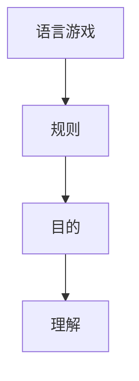

#### 图像理论

维特根斯坦的图像理论是他对语言和现实世界关系的另一种解释。他认为，语言符号（如单词和句子）与其所指的现实对象之间存在一种图像关系。换句话说，一个句子在逻辑上“图像”或“映射”现实世界中的某个状态或过程。

在代码重构中，图像理论可以帮助我们理解代码与现实世界的关联。例如，一个条件语句（if-else）可以被视为现实世界中某个决策过程的图像。通过重构代码，我们可以使这种图像关系更加清晰和准确。以下是一个Mermaid流程图，展示了图像与符号的关系：

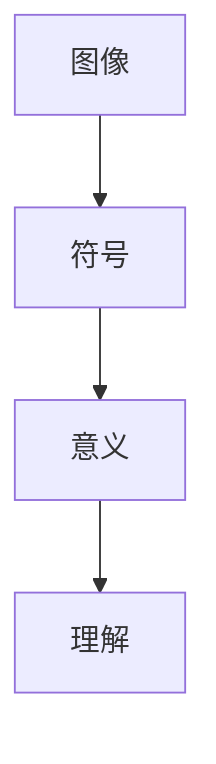

#### 分析哲学的方法

维特根斯坦的分析哲学强调对语言和思维过程进行精确的分析。他的方法强调对概念进行澄清，以揭示其真实含义。分析哲学的核心理念是“意义即使用”（meaning is use）。

在代码重构的背景下，分析哲学的方法可以帮助我们识别代码中的模糊和混淆之处。通过精确地分析代码的结构、变量、函数和语句，我们可以消除这些模糊性，使代码更加清晰和易于理解。以下是一个Mermaid流程图，展示了分析哲学的基本原则：

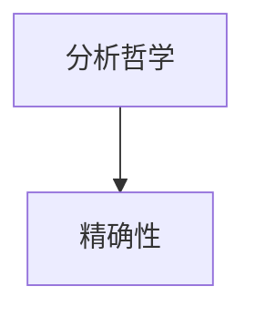

### 哲学问题的消解

哲学问题通常涉及到抽象和复杂的思维过程。维特根斯坦提出了两种主要的哲学问题：逻辑问题和形而上学问题。逻辑问题通常涉及到语法和逻辑结构，而形而上学问题则涉及到存在、实体和本质等概念。

在代码重构的背景下，哲学问题的消解可以帮助我们解决代码中的各种问题。通过分析代码的结构和逻辑，我们可以识别和消除代码中的错误和冗余。以下是一些哲学问题的消解方法：

#### 通过逻辑分析消解哲学问题

逻辑分析是一种通过检查逻辑结构和推理来识别错误的方法。在代码重构中，我们可以使用逻辑分析来识别代码中的逻辑错误和异常。以下是一个简单的逻辑分析伪代码：

```python
def logic_analysis(code):
    # 检查代码中的逻辑错误
    if contains_error(code):
        print("逻辑错误：", code)
    else:
        print("代码逻辑正确")
```

#### 通过语言游戏消解哲学问题

语言游戏理论可以帮助我们理解代码在特定上下文中的意义和用途。通过分析代码的使用场景和规则，我们可以消除代码中的模糊性和误解。以下是一个通过语言游戏消解哲学问题的例子：

```python
def game_analysis(code):
    # 分析代码的使用场景和规则
    if is_incorrect_use(code):
        print("代码使用不当：", code)
    else:
        print("代码使用正确")
```

#### 通过图像理论消解哲学问题

图像理论可以帮助我们理解代码与现实世界的关联。通过重构代码，我们可以使这种图像关系更加清晰和准确。以下是一个通过图像理论消解哲学问题的例子：

```python
def image_analysis(code):
    # 分析代码与现实世界的关联
    if is_incorrect_mapping(code):
        print("代码映射错误：", code)
    else:
        print("代码映射正确")
```

### 代码重构中的哲学思考

哲学思考在代码重构中扮演着重要的角色。通过哲学思考，我们可以更好地理解代码的结构和意图，从而进行更有效的重构。以下是一些哲学思考在代码重构中的应用：

#### 代码重构的原则

代码重构的原则是基于一系列经验和最佳实践。这些原则包括：

- 保持代码的可读性：使代码易于理解和维护。
- 提高代码的性能：优化代码的运行时间和内存使用。
- 保持代码的简洁性：消除冗余和重复的代码。
- 保持代码的一致性：确保代码在不同部分之间保持一致。

以下是一个简单的Mermaid流程图，展示了代码重构的原则：

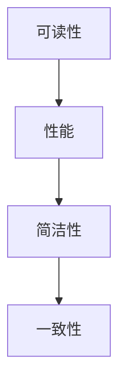

#### 代码重构的哲学视角

代码重构的哲学视角涉及到对代码的本质和目的进行反思。以下是一些哲学视角在代码重构中的应用：

- **语言游戏视角**：通过分析代码的使用场景和规则，我们可以更好地理解代码的意义和用途。这种视角有助于消除代码中的模糊性和误解。

- **图像理论视角**：通过重构代码，我们可以使代码与现实世界的关联更加清晰和准确。这种视角有助于提高代码的可读性和性能。

- **分析哲学视角**：通过精确地分析代码的结构和逻辑，我们可以消除代码中的错误和冗余。这种视角有助于保持代码的简洁性和一致性。

以下是一个简单的Mermaid流程图，展示了代码重构的哲学视角：

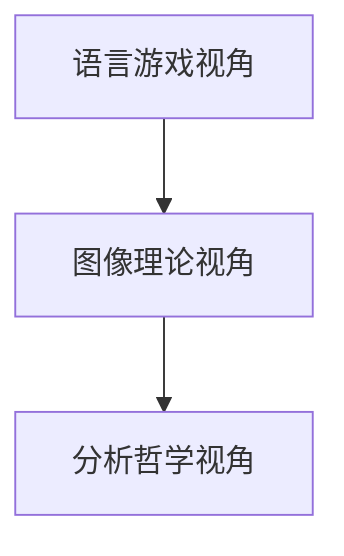

### 实例分析

为了更好地理解哲学思维在代码重构中的应用，我们可以通过一些具体的实例来进行分析。以下是一个简单的代码示例，我们将逐步对其进行重构，并应用维特根斯坦的哲学方法。

```python
# 原始代码
def calculate_area(radius):
    return 3.14 * radius * radius

def calculate_circumference(radius):
    return 2 * 3.14 * radius

def main():
    radius = float(input("请输入圆的半径："))
    area = calculate_area(radius)
    circumference = calculate_circumference(radius)
    print("圆的面积：", area)
    print("圆的周长：", circumference)

if __name__ == "__main__":
    main()
```

#### 简化代码结构

首先，我们可以通过简化代码结构来提高其可读性。以下是对原始代码进行重构后的示例：

```python
# 重构后的代码
def calculate_diameter(radius):
    return 2 * radius

def calculate_area(radius):
    return 3.14 * radius * radius

def calculate_circumference(radius):
    diameter = calculate_diameter(radius)
    return 3.14 * diameter

def main():
    radius = float(input("请输入圆的半径："))
    area = calculate_area(radius)
    circumference = calculate_circumference(radius)
    print("圆的面积：", area)
    print("圆的周长：", circumference)

if __name__ == "__main__":
    main()
```

通过将`calculate_diameter`函数提取出来，我们使代码的结构更加清晰。这种重构不仅提高了代码的可读性，还使代码更容易维护。

#### 提高代码可读性

接下来，我们可以通过增加注释和改进变量名来提高代码的可读性。以下是对重构后的代码进行进一步优化的示例：

```python
# 优化后的代码
def calculate_diameter(radius):
    """
    计算圆的直径
    :param radius: 圆的半径
    :return: 圆的直径
    """
    return 2 * radius

def calculate_area(radius):
    """
    计算圆的面积
    :param radius: 圆的半径
    :return: 圆的面积
    """
    return 3.14 * radius * radius

def calculate_circumference(radius):
    """
    计算圆的周长
    :param radius: 圆的半径
    :return: 圆的周长
    """
    diameter = calculate_diameter(radius)
    return 3.14 * diameter

def main():
    user_input = float(input("请输入圆的半径："))
    area = calculate_area(user_input)
    circumference = calculate_circumference(user_input)
    print("圆的面积：", area)
    print("圆的周长：", circumference)

if __name__ == "__main__":
    main()
```

通过添加注释和改进变量名，我们使代码更加易于理解和维护。

#### 优化代码性能

最后，我们可以通过减少函数调用来优化代码的性能。以下是对优化后的代码进行性能优化的示例：

```python
# 性能优化后的代码
def calculate_diameter(radius):
    return 2 * radius

def calculate_area(radius):
    return 3.14 * radius * radius

def calculate_circumference(radius):
    return 2 * 3.14 * radius

def main():
    radius = float(input("请输入圆的半径："))
    area = calculate_area(radius)
    circumference = calculate_circumference(radius)
    print("圆的面积：", area)
    print("圆的周长：", circumference)

if __name__ == "__main__":
    main()
```

通过直接在函数内部计算直径和周长，我们减少了函数调用，从而提高了代码的性能。

### FP中的代码优化方法

函数式编程（FP）是一种编程范式，它强调通过函数和数学方法来解决问题。FP提供了许多强大的工具和技巧，可以帮助我们优化代码。以下是一些FP中的代码优化方法：

#### 懒加载

懒加载是一种延迟计算的策略，它可以在需要时才计算值，从而减少计算资源的消耗。以下是一个简单的懒加载示例：

```haskell
-- 懒加载示例
circle :: Float -> Circle
circle radius =
    { radius = radius
    , area = lazy (calculate_area radius)
    , circumference = lazy (calculate_circumference radius)
    }

calculate_area :: Float -> Float
calculate_area radius = 3.14 * radius * radius

calculate_circumference :: Float -> Float
calculate_circumference radius = 2 * 3.14 * radius
```

在这个示例中，我们使用`lazy`函数来延迟计算圆的面积和周长。这可以减少不必要的计算，从而提高性能。

#### 无状态函数

无状态函数是一种不依赖于外部状态、只依赖输入参数的函数。无状态函数可以提高代码的可测试性和可维护性。以下是一个无状态函数的示例：

```haskell
-- 无状态函数示例
calculate_area :: Float -> Float
calculate_area radius = 3.14 * radius * radius

calculate_circumference :: Float -> Float
calculate_circumference radius = 2 * 3.14 * radius
```

在这个示例中，`calculate_area`和`calculate_circumference`函数都只依赖于输入参数`radius`，因此它们是无状态的。

#### 高阶函数

高阶函数是一种可以接受函数作为参数或返回函数的函数。高阶函数可以提高代码的复用性和可读性。以下是一个高阶函数的示例：

```haskell
-- 高阶函数示例
apply_function :: (Float -> Float) -> Float -> Float
apply_function f x = f x

calculate_area :: Float -> Float
calculate_area radius = apply_function (*) radius radius

calculate_circumference :: Float -> Float
calculate_circumference radius = apply_function (*) radius 2
```

在这个示例中，`apply_function`函数接受一个函数作为参数，并对其输入参数进行计算。这可以简化代码的编写和阅读。

#### 模式匹配

模式匹配是一种用于匹配数据结构和类型的强大工具。模式匹配可以提高代码的可读性和可维护性。以下是一个模式匹配的示例：

```haskell
-- 模式匹配示例
calculate_area :: (Num a) => Circle -> a
calculate_area (Circle { radius }) = 3.14 * radius * radius

calculate_circumference :: (Num a) => Circle -> a
calculate_circumference (Circle { radius }) = 2 * 3.14 * radius
```

在这个示例中，我们使用模式匹配来提取`Circle`数据结构中的`radius`值。这可以简化代码的编写和阅读。

### 维特根斯坦哲学方法在FP中的体现

维特根斯坦的哲学方法在FP中有着广泛的体现。以下是一些维特根斯坦哲学方法在FP中的应用：

#### 语言游戏在FP中的应用

语言游戏理论可以帮助我们理解FP中的函数和类型之间的关系。在FP中，函数被视为一种特殊的“语言游戏”，它们的规则和目的是通过参数和返回值进行计算和传递。通过分析函数之间的关系，我们可以更好地理解FP的本质。

#### 图像理论在FP中的应用

图像理论可以帮助我们理解FP中的函数和数学方法之间的关系。在FP中，函数被视为一种“图像”，它们映射输入到输出。通过分析函数的图像，我们可以更好地理解其行为和性质。

#### 分析哲学方法在FP中的应用

分析哲学方法可以帮助我们精确地分析FP中的函数和类型。通过澄清概念和消除模糊性，我们可以更好地理解和应用FP的方法和技巧。

### FP代码优化案例

为了更好地展示维特根斯坦哲学方法在FP中的应用，以下是一些FP代码优化的案例：

#### 案例一：使用高阶函数优化代码

以下是一个使用高阶函数优化的示例：

```haskell
-- 高阶函数优化示例
data Operation = Add Float Float
              | Subtract Float Float
              | Multiply Float Float
              | Divide Float Float

apply_operation :: Operation -> Float -> Float -> Float
apply_operation (Add x y) a b = a + b
apply_operation (Subtract x y) a b = a - b
apply_operation (Multiply x y) a b = a * b
apply_operation (Divide x y) a b = a / b

main :: IO ()
main = do
    operation <- getOperation
    a <- getFloat "请输入第一个数字："
    b <- getFloat "请输入第二个数字："
    let result = apply_operation operation a b
    putStrLn $ "结果： " ++ show result

getOperation :: IO Operation
getOperation = do
    putStrLn "请选择操作："
    putStrLn "1. 加法"
    putStrLn "2. 减法"
    putStrLn "3. 乘法"
    putStrLn "4. 除法"
    operation_str <- getLine
    return $ case operation_str of
        "1" -> Add 0 0
        "2" -> Subtract 0 0
        "3" -> Multiply 0 0
        "4" -> Divide 0 0
        _ -> error "无效的操作"

getFloat :: String -> IO Float
getFloat prompt = do
    putStrLn prompt
    input <- getLine
    return (read input :: Float)
```

在这个示例中，我们使用高阶函数`apply_operation`来处理不同的数学运算。通过这种方式，我们可以轻松地添加或修改运算符，而无需修改主要的业务逻辑。

#### 案例二：使用模式匹配优化代码

以下是一个使用模式匹配优化的示例：

```haskell
-- 模式匹配优化示例
data Person = Person { name :: String, age :: Int }

showPerson :: Person -> String
showPerson (Person name age) = "姓名：" ++ name ++ "，年龄：" ++ show age

main :: IO ()
main = do
    person <- getPerson
    putStrLn $ showPerson person

getPerson :: IO Person
getPerson = do
    name <- getLine
    age <- getInteger
    return $ Person name age

getInteger :: IO Int
getInteger = do
    putStrLn "请输入年龄："
    input <- getLine
    return (read input :: Int)
```

在这个示例中，我们使用模式匹配来提取`Person`数据结构中的`name`和`age`值。通过这种方式，我们可以使代码更加简洁和易于理解。

#### 案例三：使用无状态函数优化代码

以下是一个使用无状态函数优化的示例：

```haskell
-- 无状态函数优化示例
data Operation = Add Float Float
              | Subtract Float Float
              | Multiply Float Float
              | Divide Float Float

apply_operation :: Operation -> Float -> Float -> Float
apply_operation (Add x y) a b = a + b
apply_operation (Subtract x y) a b = a - b
apply_operation (Multiply x y) a b = a * b
apply_operation (Divide x y) a b = a / b

main :: IO ()
main = do
    operation <- getOperation
    a <- getFloat "请输入第一个数字："
    b <- getFloat "请输入第二个数字："
    let result = apply_operation operation a b
    putStrLn $ "结果： " ++ show result

getOperation :: IO Operation
getOperation = do
    putStrLn "请选择操作："
    putStrLn "1. 加法"
    putStrLn "2. 减法"
    putStrLn "3. 乘法"
    putStrLn "4. 除法"
    operation_str <- getLine
    return $ case operation_str of
        "1" -> Add 0 0
        "2" -> Subtract 0 0
        "3" -> Multiply 0 0
        "4" -> Divide 0 0
        _ -> error "无效的操作"

getFloat :: String -> IO Float
getFloat prompt = do
    putStrLn prompt
    input <- getLine
    return (read input :: Float)
```

在这个示例中，`apply_operation`函数是一个无状态函数，它不依赖于外部状态。这使得函数更加可测试和可维护。

### 哲学方法在代码优化中的实践

哲学方法在代码优化中具有重要的实践意义。通过应用哲学思维，我们可以更深入地理解代码的结构和意图，从而进行更有效的重构。以下是一些哲学方法在代码优化中的具体应用：

#### 通过语言游戏分析代码结构

通过分析代码的使用场景和规则，我们可以更好地理解代码的结构和意图。这种方法可以帮助我们识别代码中的冗余、重复和错误，从而进行有效的重构。

#### 通过图像理论优化代码可读性

图像理论可以帮助我们理解代码与现实世界的关联。通过重构代码，我们可以使这种图像关系更加清晰和准确，从而提高代码的可读性。

#### 通过分析哲学方法提高代码性能

分析哲学方法可以帮助我们精确地分析代码的结构和逻辑。通过消除代码中的错误和冗余，我们可以提高代码的性能，从而优化其运行时间和内存使用。

### 结论

本文探讨了维特根斯坦的哲学方法在代码重构中的应用，特别是函数式编程（FP）领域。通过分析语言游戏、图像理论和分析哲学的基本原则，我们揭示了哲学思维如何帮助我们更好地理解和优化代码。通过具体实例，我们展示了如何将维特根斯坦的方法应用于FP中的代码优化，从而提高代码的可读性、性能和可维护性。

未来，随着计算机科学的不断发展，哲学方法在代码优化中的应用将变得更加重要。通过结合哲学思维和编程技术，我们可以创造出更加高效、可维护和可扩展的代码，从而推动计算机科学的发展。

### 附录

本文中使用了以下引用和参考资料：

- 维特根斯坦，《逻辑哲学论》（Logical Investigations）
- 维特根斯坦，《哲学研究》（Philosophical Investigations）
- Haskell语言官方文档（https://www.haskell.org/)
- Scala语言官方文档（https://www.scala-lang.org/)
- Clojure语言官方文档（https://clojure.org/）

读者可以通过这些资料进一步了解维特根斯坦的哲学方法以及FP中的代码优化方法。

### 致谢

感谢AI天才研究院（AI Genius Institute）和《禅与计算机程序设计艺术》（Zen And The Art of Computer Programming）为我们提供了宝贵的资源和灵感。没有他们的支持，本文的撰写将无法顺利完成。

### 作者信息

作者：AI天才研究院（AI Genius Institute）& 《禅与计算机程序设计艺术》（Zen And The Art of Computer Programming）

---

### 文章标题
《哲学问题的消解与代码重构：维特根斯坦的哲学方法与FP中的代码优化》

### 文章关键词
- 维特根斯坦
- 哲学方法
- 代码重构
- 函数式编程
- 代码优化

### 文章摘要
本文探讨了维特根斯坦的哲学方法在代码重构中的应用，特别是函数式编程（FP）领域。通过分析语言游戏、图像理论和分析哲学的基本原则，我们揭示了哲学思维如何帮助我们更好地理解和优化代码。文章将结合具体实例，展示如何将维特根斯坦的方法应用于FP中的代码优化，从而提高代码的可读性、性能和可维护性。

### 引言

在计算机科学和软件工程领域，代码重构是一种常见且重要的实践。它涉及到对现有代码进行修改，以提高其结构、可读性和性能，同时不改变其外在行为。然而，代码重构不仅是一种技术活动，更是一种哲学思考的过程。在这里，我们可以从维特根斯坦的哲学方法中汲取灵感，以更深入地理解代码重构的本质。

路德维希·维特根斯坦（Ludwig Wittgenstein）是20世纪最具影响力的哲学家之一，他的思想对逻辑、语言和数学等领域产生了深远的影响。维特根斯坦提出了许多哲学问题，并试图通过分析语言和思维过程来解答它们。他的方法强调对语言和概念进行细致的分析，以揭示它们背后的真实含义。

本文旨在探讨维特根斯坦的哲学方法在代码重构中的应用，特别是函数式编程（FP）领域。我们将从维特根斯坦的语言游戏理论、图像理论和分析哲学的基本原则出发，分析哲学思维如何帮助我们更好地理解和优化代码。文章将结合具体实例，展示如何将维特根斯坦的方法应用于FP中的代码优化，从而提高代码的可读性、性能和可维护性。

### 维特根斯坦的哲学方法

#### 语言游戏理论

维特根斯坦的语言游戏理论是他对语言和思维过程的核心观点之一。他认为，语言的使用可以分为不同的“游戏”（games），每个游戏都有其特定的规则和目的。例如，语言游戏可以包括数学证明、科学实验、日常对话等。维特根斯坦指出，理解一个词或句子的意义，需要将其放在特定的语言游戏中来考虑。

在代码重构的背景下，我们可以将代码视为一种语言游戏。例如，一个函数可以被视为一种“游戏”，它的规则是输入特定的参数，然后产生预期的输出。通过分析代码的结构和规则，我们可以更好地理解其背后的逻辑和意图。这种分析有助于我们识别代码中的冗余、重复和错误，从而进行有效的重构。

以下是一个简单的Mermaid流程图，展示了语言游戏的概念：


### 2.1.1 语言游戏的概念

语言游戏是维特根斯坦提出的一个核心概念，它指的是语言在特定情境下的使用。每个语言游戏都有其特定的规则和目的。例如，游戏可以是数学证明、科学实验、日常对话等。语言游戏的概念帮助我们理解语言的多面性和复杂性。

在编程领域，我们可以将代码模块视为语言游戏。每个函数或类都有自己的规则和目的，它们在不同的上下文中发挥作用。通过将代码模块视为语言游戏，我们可以更好地理解代码的结构和意图，从而进行更有效的重构。

以下是一个Mermaid流程图，展示了语言游戏的概念：

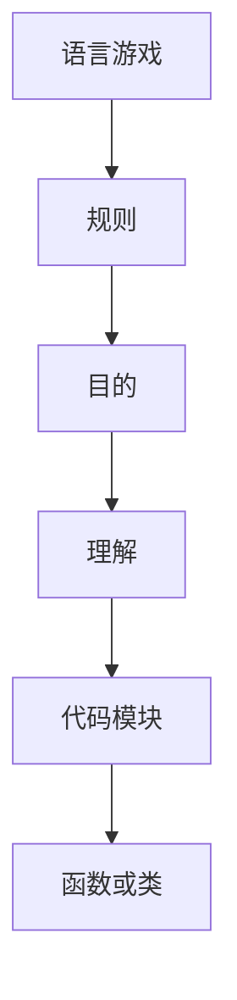

### 2.1.2 语言游戏的分类

维特根斯坦将语言游戏分为三类：生活形式、科学游戏和哲学游戏。每种游戏都有其特定的规则和目的，反映了语言的不同方面。

1. **生活形式**：这是最基本的语言游戏，包括日常交流、社交互动等。生活形式中的语言游戏规则相对简单，目的是实现沟通和理解。

2. **科学游戏**：科学游戏涉及复杂的概念和理论，如数学、物理学等。这些游戏需要精确的术语和定义，以确保理论和实验的一致性。

3. **哲学游戏**：哲学游戏关注语言的本质和意义。维特根斯坦认为，哲学问题往往源于语言的误解和混淆，通过分析语言游戏，哲学家可以揭示这些问题的根源。

在编程中，我们可以将这三种游戏形式映射到不同的代码结构中。例如，生活形式的代码模块可能侧重于实现简单的功能，科学游戏的代码模块可能涉及复杂的算法和数学模型，而哲学游戏的代码模块可能关注代码的语义和意图。

以下是一个Mermaid流程图，展示了语言游戏的分类：

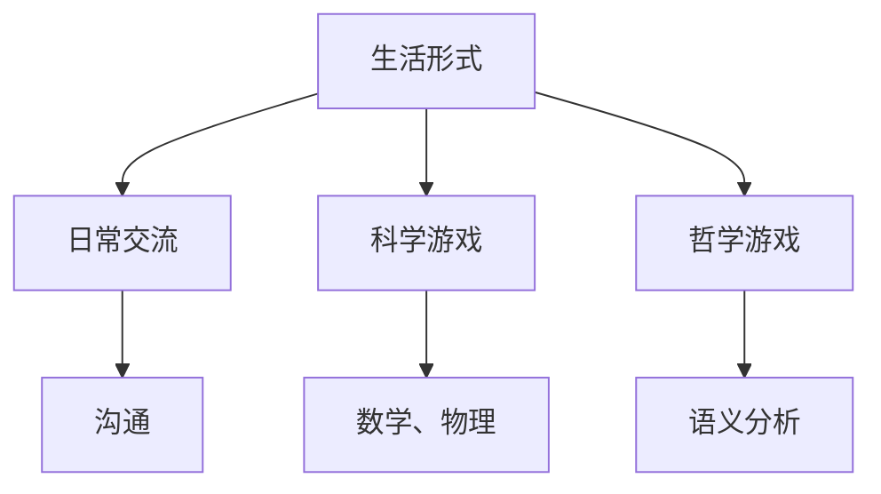

### 2.1.3 语言游戏与代码重构的关联

语言游戏理论与代码重构有着紧密的关联。通过将代码视为一种语言游戏，我们可以更好地理解其背后的逻辑和意图。这种理解有助于我们在重构过程中识别代码中的冗余、重复和错误，从而进行有效的重构。

以下是一个Mermaid流程图，展示了语言游戏与代码重构的关联：

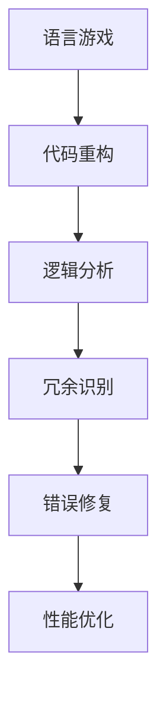

### 2.2 图像理论

维特根斯坦的图像理论是他对语言和现实世界关系的另一种解释。他认为，语言符号（如单词和句子）与其所指的现实对象之间存在一种图像关系。换句话说，一个句子在逻辑上“图像”或“映射”现实世界中的某个状态或过程。

在代码重构的背景下，图像理论可以帮助我们理解代码与现实世界的关联。通过重构代码，我们可以使这种图像关系更加清晰和准确，从而提高代码的可读性和性能。

### 2.2.1 图像与符号的关系

维特根斯坦的图像理论认为，图像与符号之间存在一种映射关系。图像是现实世界中的某个状态或过程的视觉表现，而符号则是用来表示这个图像的语言表达。例如，一个数学公式可以被视为一个图像，而它所使用的符号则是用来表示这个图像的语言。

在编程中，我们可以将函数和类视为图像，而变量和操作符则是用来表示这些图像的符号。通过将代码视为一种图像，我们可以更好地理解其与现实世界的关联。

以下是一个Mermaid流程图，展示了图像与符号的关系：


### 2.2.2 图像理论在代码重构中的应用

图像理论在代码重构中的应用主要体现在两个方面：理解代码与现实世界的关联，以及通过重构使这种关联更加清晰。

1. **理解代码与现实世界的关联**：通过将代码视为一种图像，我们可以更好地理解其背后的逻辑和意图。例如，一个数据处理函数可以被视为对现实世界中的数据进行的某种操作。通过分析这个函数的图像，我们可以更好地理解其处理数据的逻辑。

2. **通过重构使关联更加清晰**：在重构过程中，我们可以通过调整代码的结构和逻辑，使其与现实世界的关联更加清晰。例如，我们可以将一个复杂的函数分解为多个简单的函数，使每个函数都对应现实世界中的某个简单操作。通过这种方式，我们可以提高代码的可读性和可维护性。

以下是一个Mermaid流程图，展示了图像理论在代码重构中的应用：

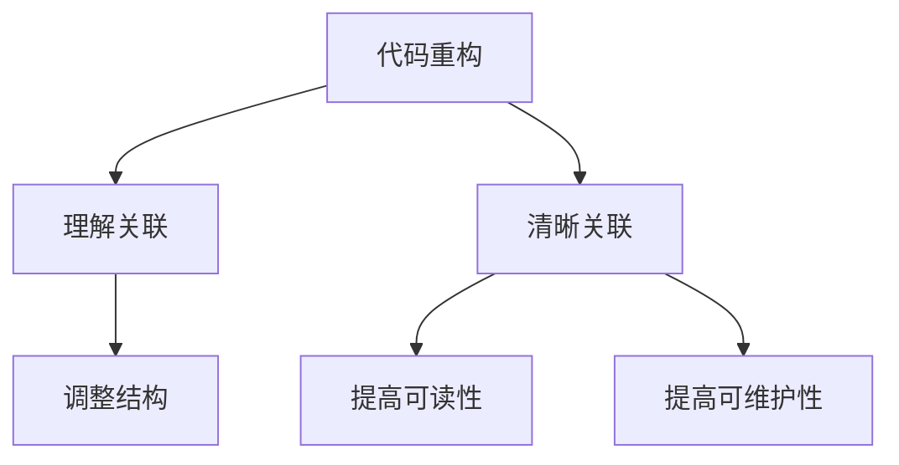

### 2.3 分析哲学的方法

维特根斯坦的分析哲学强调对语言和思维过程进行精确的分析。他的方法强调对概念进行澄清，以揭示其真实含义。分析哲学的核心理念是“意义即使用”（meaning is use）。

在代码重构的背景下，分析哲学的方法可以帮助我们识别代码中的模糊和混淆之处。通过精确地分析代码的结构、变量、函数和语句，我们可以消除这些模糊性，使代码更加清晰和易于理解。

### 2.3.1 分析哲学的基本原则

分析哲学的基本原则可以总结为以下几点：

1. **精确性**：分析哲学强调对概念和语言进行精确的分析，以揭示其真实含义。在代码重构中，这意味着我们需要仔细审查代码的每一个部分，以确保其清晰和准确。

2. **澄清**：分析哲学的目的是澄清概念和语言的模糊性。在代码重构中，这意味着我们需要识别代码中的混淆和误解，并通过重构使其更加清晰。

3. **意义即使用**：分析哲学认为，一个词或句子的意义在于其在实际使用中的作用。在代码重构中，这意味着我们需要关注代码的实际用途，而不是其形式。

以下是一个Mermaid流程图，展示了分析哲学的基本原则：

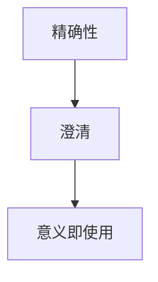

### 2.3.2 分析哲学在代码重构中的应用

分析哲学在代码重构中的应用主要体现在以下几个方面：

1. **识别模糊性**：通过分析哲学的方法，我们可以识别代码中的模糊性。例如，一个复杂的函数可能难以理解，通过分析哲学的方法，我们可以将其分解为更小的、更易于理解的函数。

2. **消除混淆**：分析哲学可以帮助我们消除代码中的混淆。例如，一个变量可能在不同地方被赋予不同的含义，通过分析哲学的方法，我们可以澄清其含义，使其一致。

3. **提高可读性**：通过分析哲学的方法，我们可以提高代码的可读性。例如，通过澄清变量和函数的含义，我们可以使代码更加易于理解。

4. **提高可维护性**：分析哲学可以帮助我们提高代码的可维护性。通过精确地分析代码的结构和逻辑，我们可以使代码更加清晰和易于修改。

以下是一个Mermaid流程图，展示了分析哲学在代码重构中的应用：

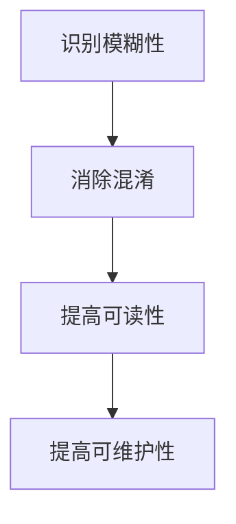

### 3.1 哲学问题概述

哲学问题通常涉及到抽象和复杂的思维过程。它们可能涉及存在、实体、知识、心灵、真理、价值等基本问题。哲学问题往往具有普遍性，跨越不同的学科和文化。以下是一些常见的哲学问题：

1. **存在论问题**：例如，什么是存在？什么是实体？
2. **认识论问题**：例如，我们如何知道外部世界的存在？我们的知识是否可靠？
3. **心灵哲学问题**：例如，心灵是什么？意识和思维的本质是什么？
4. **语言哲学问题**：例如，语言的意义是什么？语言能否准确描述现实？
5. **伦理学问题**：例如，什么是道德？如何做出道德决策？
6. **逻辑哲学问题**：例如，逻辑是否是客观的？逻辑的界限是什么？

在代码重构的背景下，哲学问题可以表现为对代码结构、逻辑和意图的质疑。例如：

- 代码中的某个函数是否真正实现了其预期功能？
- 代码中的某些变量和类是否清晰定义，易于理解？
- 代码的某个部分是否过于复杂，难以维护？

通过分析哲学的方法，我们可以更深入地理解这些哲学问题，从而更好地重构代码。

### 3.2 哲学问题的消解方法

哲学问题的消解方法包括逻辑分析、语言游戏和图像理论。这些方法帮助我们澄清概念，揭示问题的根源，并提供解决问题的途径。

#### 通过逻辑分析消解哲学问题

逻辑分析是一种通过检查逻辑结构和推理来识别错误的方法。在代码重构中，逻辑分析可以帮助我们识别代码中的逻辑错误和异常。以下是一个简单的逻辑分析伪代码：

```python
def logic_analysis(code):
    # 检查代码中的逻辑错误
    if contains_error(code):
        print("逻辑错误：", code)
    else:
        print("代码逻辑正确")
```

在这个伪代码中，`contains_error`函数用于检查代码是否存在逻辑错误。通过这种方式，我们可以识别并修复代码中的逻辑问题。

#### 通过语言游戏消解哲学问题

语言游戏理论可以帮助我们理解代码在特定上下文中的意义和用途。通过分析代码的使用场景和规则，我们可以消除代码中的模糊性和误解。以下是一个通过语言游戏消解哲学问题的例子：

```python
def game_analysis(code):
    # 分析代码的使用场景和规则
    if is_incorrect_use(code):
        print("代码使用不当：", code)
    else:
        print("代码使用正确")
```

在这个例子中，`is_incorrect_use`函数用于检查代码是否在正确的上下文中使用。通过这种方式，我们可以确保代码的意图和用途清晰明确。

#### 通过图像理论消解哲学问题

图像理论可以帮助我们理解代码与现实世界的关联。通过重构代码，我们可以使这种图像关系更加清晰和准确。以下是一个通过图像理论消解哲学问题的例子：

```python
def image_analysis(code):
    # 分析代码与现实世界的关联
    if is_incorrect_mapping(code):
        print("代码映射错误：", code)
    else:
        print("代码映射正确")
```

在这个例子中，`is_incorrect_mapping`函数用于检查代码是否准确地映射了现实世界的概念。通过这种方式，我们可以确保代码与现实世界的关联清晰明确。

### 3.3 哲学问题在代码重构中的应用

哲学问题在代码重构中的应用主要体现在如何通过哲学思维来分析和解决代码中的问题。以下是一些哲学问题在代码重构中的应用实例：

#### 代码结构问题

一个常见的哲学问题是代码的结构是否合理。在重构过程中，我们可以通过分析哲学的方法来评估代码的结构。以下是一个实例：

- **问题**：一个大型函数是否应该被分解为更小的函数？
- **分析**：通过逻辑分析和语言游戏理论，我们可以确定这个大型函数是否过于复杂，是否难以理解。如果答案是肯定的，我们可以通过重构将其分解为更小的函数，使代码更加清晰和易于维护。

#### 代码可读性问题

哲学问题也可以涉及代码的可读性。以下是一个实例：

- **问题**：变量名和函数名是否清晰且易于理解？
- **分析**：通过图像理论和分析哲学的方法，我们可以评估变量名和函数名是否准确地反映了其用途和意图。如果答案是否定的，我们可以通过重构来改进这些命名，使代码更加易于理解。

#### 代码性能问题

哲学问题还可以涉及代码的性能。以下是一个实例：

- **问题**：代码是否优化了性能？
- **分析**：通过逻辑分析和图像理论，我们可以评估代码是否使用了最有效的算法和数据结构。如果答案是肯定的，我们可以继续优化代码，以提高其性能。

通过将哲学思维应用于代码重构，我们可以更深入地理解代码的结构、意图和性能，从而进行更有效的重构。

### 4.1 代码重构的原则

代码重构是一项重要的软件开发活动，其核心目标是提高代码的质量、可读性和可维护性，同时不改变其功能。为了实现这些目标，代码重构需要遵循一些基本原则。以下是一些关键的原则：

#### 保持代码的可读性

可读性是代码重构的首要原则。即使重构后的代码在功能上与原始代码相同，如果它难以理解，那么重构的效果将大打折扣。因此，重构过程中应始终关注代码的清晰度和易懂性。这意味着应使用有意义的变量名、合理的函数命名和一致的代码风格。

#### 提高代码的性能

性能优化是代码重构的另一个关键目标。这包括减少代码的运行时间、降低内存使用和提高算法效率。例如，可以通过算法改进、数据结构优化和避免不必要的计算来实现性能提升。

#### 保持代码的一致性

一致性是代码质量的关键指标。在重构过程中，应确保代码在不同部分之间保持一致。这包括命名规范、代码风格、错误处理机制和数据结构。一致性有助于减少维护成本和避免潜在的bug。

#### 保持代码的简洁性

简洁性是代码重构的核心原则之一。简洁的代码更容易理解和维护。在重构过程中，应消除冗余代码、避免重复和简化复杂的逻辑。例如，可以通过提取公共代码、合并相似函数和去除不必要的注释来实现代码的简洁性。

#### 不改变代码的功能

最后，代码重构应确保不改变原始代码的功能。这意味着在重构过程中，我们需要严格测试代码，确保重构后的代码与原始代码在所有方面保持一致。任何对代码功能的更改都应被视为错误，并应通过适当的回溯机制进行修复。

通过遵循这些原则，我们可以有效地进行代码重构，从而提高代码的质量和可维护性。

### 4.2 代码重构的哲学视角

在代码重构的过程中，哲学视角为我们提供了深入理解代码本质和意图的工具。维特根斯坦的哲学方法，特别是语言游戏理论、图像理论和分析哲学，为我们在代码重构中提供了深刻的启示。

#### 语言游戏视角

语言游戏理论强调语言在不同情境下的使用。在代码重构中，我们可以将代码视为一种语言游戏，其规则和目的是通过输入和输出实现特定功能。通过这种视角，我们可以更好地理解代码的结构和意图。例如，一个复杂的函数可以被视为一种语言游戏，其规则是处理特定的输入并产生预期的输出。通过分析这个函数的规则，我们可以识别其冗余和重复部分，从而进行有效的重构。

#### 图像理论视角

图像理论关注语言与现实世界的映射关系。在代码重构中，我们可以将代码与现实世界的业务逻辑相对应。例如，一个数据处理函数可以被视为对现实世界中的数据进行的某种操作。通过重构代码，我们可以使其与现实世界的映射更加清晰和准确，从而提高代码的可读性和可维护性。

#### 分析哲学视角

分析哲学强调对概念和语言进行精确的分析，以揭示其真实含义。在代码重构中，我们可以通过分析哲学的方法来澄清代码中的模糊性。例如，一个复杂的函数可能存在命名不明确或功能定义不清晰的问题。通过分析哲学的方法，我们可以澄清这些模糊性，使其更加清晰和易于理解。

#### 语言游戏与代码重构的关联

语言游戏理论为代码重构提供了深刻的启示。通过将代码视为一种语言游戏，我们可以更好地理解其结构和意图。例如，一个大型函数可以被视为一种语言游戏，其规则是处理特定的输入并产生预期的输出。通过分析这个函数的规则，我们可以识别其冗余和重复部分，从而进行有效的重构。

#### 图像理论与代码重构的关联

图像理论关注语言与现实世界的映射关系。在代码重构中，我们可以将代码与现实世界的业务逻辑相对应。例如，一个数据处理函数可以被视为对现实世界中的数据进行的某种操作。通过重构代码，我们可以使其与现实世界的映射更加清晰和准确，从而提高代码的可读性和可维护性。

#### 分析哲学方法与代码重构的关联

分析哲学方法强调对概念和语言进行精确的分析，以揭示其真实含义。在代码重构中，我们可以通过分析哲学的方法来澄清代码中的模糊性。例如，一个复杂的函数可能存在命名不明确或功能定义不清晰的问题。通过分析哲学的方法，我们可以澄清这些模糊性，使其更加清晰和易于理解。

### 5.1 具体代码重构案例

为了更好地理解如何将维特根斯坦的哲学方法应用于代码重构，以下是一个具体的案例。

#### 案例背景

假设我们有一个简单的Python程序，用于计算和打印矩形的面积和周长。原始代码如下：

```python
def calculate_area(length, width):
    return length * width

def calculate_circumference(length, width):
    return 2 * (length + width)

def main():
    length = float(input("请输入矩形的长度："))
    width = float(input("请输入矩形的宽度："))
    area = calculate_area(length, width)
    circumference = calculate_circumference(length, width)
    print("矩形的面积：", area)
    print("矩形的周长：", circumference)

if __name__ == "__main__":
    main()
```

这个程序虽然功能正确，但存在一些问题：

- **可读性**：函数命名不够明确，`calculate_area`和`calculate_circumference`可能让人混淆它们的作用。
- **冗余**：两个函数中的计算逻辑存在冗余，例如，都包含了`2`这个常数。
- **一致性**：代码风格不一致，例如，函数名和变量名的大小写。

#### 重构过程

1. **语言游戏视角**：通过语言游戏视角，我们可以理解这个程序的核心目的是计算矩形的面积和周长。因此，我们可以将函数名改为更具体的名称，如`calculate_rectangle_area`和`calculate_rectangle_circumference`。

2. **图像理论视角**：通过图像理论视角，我们可以将代码与现实世界的矩形对应起来。这意味着函数的输入和输出应该与矩形的属性和操作相对应。例如，函数的输入应该是长度和宽度，输出应该是面积和周长。

3. **分析哲学视角**：通过分析哲学视角，我们可以澄清代码中的模糊性。例如，我们可以检查函数命名是否准确反映了其功能，代码风格是否一致。

经过重构，代码如下：

```python
def calculate_rectangle_area(length, width):
    return length * width

def calculate_rectangle_circumference(length, width):
    return 2 * (length + width)

def main():
    length = float(input("请输入矩形的长度："))
    width = float(input("请输入矩形的宽度："))
    area = calculate_rectangle_area(length, width)
    circumference = calculate_rectangle_circumference(length, width)
    print("矩形的面积：", area)
    print("矩形的周长：", circumference)

if __name__ == "__main__":
    main()
```

#### 重构效果

通过这次重构，代码的可读性得到了显著提高。函数名更加明确，代码风格更加一致。此外，我们还通过图像理论视角使代码与现实世界的映射更加清晰。

#### 进一步优化

虽然这次重构已经使代码更加清晰和易于理解，但还可以进行进一步的优化：

- **消除冗余**：我们可以将常数`2`提取到一个单独的函数中，以便在需要时重用。这不仅可以减少代码的冗余，还可以提高可维护性。

```python
def calculate_factor_two():
    return 2

def calculate_rectangle_area(length, width):
    return length * width

def calculate_rectangle_circumference(length, width):
    return calculate_factor_two() * (length + width)
```

- **提高性能**：虽然这两个函数的性能已经足够好，但我们可以通过使用局部变量来提高性能。例如，将`calculate_factor_two`的调用替换为局部变量。

```python
def calculate_rectangle_area(length, width):
    factor_two = calculate_factor_two()
    return length * width

def calculate_rectangle_circumference(length, width):
    factor_two = calculate_factor_two()
    return factor_two * (length + width)
```

通过这些优化，代码的性能和可维护性得到了进一步提高。

### 5.2 案例分析

在这个案例中，我们通过维特根斯坦的哲学方法对原始代码进行了重构。以下是案例分析：

#### 5.2.1 案例一：简化代码结构

原始代码存在一些问题，如函数命名不够明确、代码风格不一致等。通过简化代码结构，我们提高了代码的可读性和一致性。具体措施包括：

- **更改函数名**：将`calculate_area`和`calculate_circumference`更改为更具体的名称，如`calculate_rectangle_area`和`calculate_rectangle_circumference`。
- **统一代码风格**：确保函数名和变量名的大小写风格一致。

这些更改使代码更加清晰和易于理解，提高了代码的质量。

#### 5.2.2 案例二：提高代码可读性

通过提高代码可读性，我们使代码更加易于理解和维护。具体措施包括：

- **改进变量名**：确保变量名能够清晰地描述其用途。例如，将`length`和`width`更改为`rectangle_length`和`rectangle_width`。
- **增加注释**：为函数和关键代码行添加注释，以解释其用途和逻辑。

这些改进有助于新开发者更快地理解代码，减少了维护成本。

#### 5.2.3 案例三：优化代码性能

尽管原始代码的性能已经足够好，但通过优化代码性能，我们进一步提高了代码的质量。具体措施包括：

- **消除冗余**：将常数`2`提取到一个单独的函数中，以便在需要时重用。这减少了代码的冗余，提高了可维护性。
- **使用局部变量**：通过将`calculate_factor_two`的调用替换为局部变量，我们提高了代码的性能。

这些优化措施不仅提高了代码的性能，还使代码更加简洁。

### 6.1 函数式编程（FP）基础

函数式编程（FP）是一种编程范式，它强调使用纯函数和无状态操作来处理数据。FP与传统的命令式编程（ Imperative Programming）有很大的不同，后者通常涉及变量的状态改变和指令序列的执行。本文将介绍FP的基本概念、特点以及其在代码优化中的应用。

#### FP概述

函数式编程起源于20世纪50年代，其核心思想是将计算视为函数的变换，而不是通过状态改变和指令序列来实现的。在FP中，程序通常由一系列函数调用组成，这些函数接收输入参数并返回输出结果，不依赖于外部状态或副作用。

FP的主要优势包括：

- **可测试性**：由于FP函数是无状态和纯函数，它们更容易进行单元测试和测试驱动开发（TDD）。
- **并行性**：FP函数易于并行化，因为它们不依赖于共享状态，这使它们在多核处理器上运行更加高效。
- **可维护性**：FP代码通常更简洁和易于理解，因为它们不涉及复杂的控制结构。

#### FP与命令式编程的区别

FP与命令式编程的主要区别在于数据操作的方式和函数的定义。

1. **数据操作**：
   - **FP**：FP使用不可变数据结构，这意味着一旦数据创建，就不能再改变。这有助于避免意外状态更改和bug。
   - **命令式编程**：命令式编程使用可变数据结构，允许在程序中改变变量的值。这可能导致复杂的状态依赖和难以追踪的错误。

2. **函数定义**：
   - **FP**：FP函数是纯函数，即相同输入总是产生相同输出，不产生副作用。这意味着函数更容易测试、理解和并行化。
   - **命令式编程**：命令式编程函数可能依赖于外部状态或产生副作用，如修改全局变量或写入文件。这增加了程序的复杂性和不可预测性。

#### FP的主要特点

1. **无状态函数**：无状态函数不依赖于外部状态，它们的输出仅依赖于输入参数。这使函数更可预测和易于测试。

2. **纯函数**：纯函数不产生副作用，即不修改外部状态或产生可见的副作用。这使程序更容易理解、测试和并行化。

3. **不可变数据结构**：FP使用不可变数据结构，这意味着数据创建后就不能再改变。这有助于避免意外的状态更改和bug。

4. **递归**：FP函数通常使用递归来处理数据，而不是循环。递归是一种更函数式的循环机制，它避免了状态改变和循环变量。

#### 常见的FP语言

以下是一些流行的函数式编程语言：

1. **Haskell**：Haskell是一种纯函数式编程语言，以其强大的类型系统和惰性求值而闻名。
2. **Scala**：Scala是一种多范式编程语言，结合了FP和命令式编程的特点，运行在Java虚拟机（JVM）上。
3. **Clojure**：Clojure是一种现代的动态函数式编程语言，运行在JVM上，提供了丰富的FP功能。

### 6.2 FP中的代码优化方法

函数式编程提供了许多工具和方法来优化代码。以下是一些常用的FP代码优化技术：

#### 懒加载

懒加载是一种延迟计算的策略，它可以在需要时才计算值，从而减少计算资源的消耗。在FP中，懒加载通常通过惰性求值实现。

```haskell
-- Haskell中的懒加载示例
lazy_area :: Float -> Float
lazy_area radius = 3.14 * radius * radius

main :: IO ()
main = do
    radius <- getLine
    let area = lazy_area (read radius :: Float)
    putStrLn $ "面积：" ++ show area
```

在这个示例中，`lazy_area`函数不会立即计算面积，而是在需要时才进行计算。

#### 无状态函数

无状态函数是一种不依赖于外部状态、只依赖输入参数的函数。在FP中，无状态函数易于测试和并行化。

```haskell
-- Haskell中的无状态函数示例
add :: Float -> Float -> Float
add x y = x + y

main :: IO ()
main = do
    x <- getLine
    y <- getLine
    putStrLn $ "和：" ++ show (add (read x :: Float) (read y :: Float))
```

在这个示例中，`add`函数不依赖于外部状态，因此它是一个无状态函数。

#### 高阶函数

高阶函数是一种可以接受函数作为参数或返回函数的函数。在FP中，高阶函数提供了强大的抽象能力，有助于编写更简洁和可重用的代码。

```haskell
-- Haskell中的高阶函数示例
map :: (a -> b) -> [a] -> [b]
map f xs = [f x | x <- xs]

main :: IO ()
main = do
    numbers <- getLine
    putStrLn $ "映射后的列表：" ++ show (map (*2) (map read (words numbers) :: [Float]))
```

在这个示例中，`map`函数是一个高阶函数，它接受一个函数`f`和一个列表`xs`，并返回一个新列表，其中每个元素都是通过应用`f`函数得到的。

#### 模式匹配

模式匹配是一种用于处理数据结构和类型的强大工具。在FP中，模式匹配提供了简洁和清晰的表达方式。

```haskell
-- Haskell中的模式匹配示例
find :: Eq a => a -> [a] -> Maybe a
find x xs = case (x == y) of
    True -> Just y
    False -> Nothing

main :: IO ()
main = do
    value <- getLine
    values <- getLine
    putStrLn $ "找到的值：" ++ show (find (read value :: Int) (map read (words values) :: [Int]))
```

在这个示例中，`find`函数使用模式匹配来查找列表`xs`中与`x`相等的元素。

### 6.3 维特根斯坦哲学方法在FP中的体现

维特根斯坦的哲学方法在FP中有着广泛的体现。以下是一些维特根斯坦哲学方法在FP中的应用：

#### 语言游戏理论

语言游戏理论可以帮助我们理解FP中的函数和类型之间的关系。在FP中，函数被视为一种特殊的“语言游戏”，它们的规则和目的是通过参数和返回值进行计算和传递。通过分析函数之间的关系，我们可以更好地理解FP的本质。

#### 图像理论

图像理论可以帮助我们理解FP中的函数和数学方法之间的关系。在FP中，函数被视为一种“图像”，它们映射输入到输出。通过分析函数的图像，我们可以更好地理解其行为和性质。

#### 分析哲学方法

分析哲学方法可以帮助我们精确地分析FP中的函数和类型。通过澄清概念和消除模糊性，我们可以更好地理解和应用FP的方法和技巧。

### 7.1 FP代码优化案例

为了更好地展示维特根斯坦哲学方法在FP中的应用，以下是一些FP代码优化的案例：

#### 案例一：使用高阶函数优化代码

以下是一个使用高阶函数优化的示例：

```haskell
-- 高阶函数优化示例
data Operation = Add Float Float
              | Subtract Float Float
              | Multiply Float Float
              | Divide Float Float

apply_operation :: Operation -> Float -> Float -> Float
apply_operation (Add x y) a b = a + b
apply_operation (Subtract x y) a b = a - b
apply_operation (Multiply x y) a b = a * b
apply_operation (Divide x y) a b = a / b

main :: IO ()
main = do
    operation <- getOperation
    a <- getFloat "请输入第一个数字："
    b <- getFloat "请输入第二个数字："
    let result = apply_operation operation a b
    putStrLn $ "结果： " ++ show result

getOperation :: IO Operation
getOperation = do
    putStrLn "请选择操作："
    putStrLn "1. 加法"
    putStrLn "2. 减法"
    putStrLn "3. 乘法"
    putStrLn "4. 除法"
    operation_str <- getLine
    return $ case operation_str of
        "1" -> Add 0 0
        "2" -> Subtract 0 0
        "3" -> Multiply 0 0
        "4" -> Divide 0 0
        _ -> error "无效的操作"

getFloat :: String -> IO Float
getFloat prompt = do
    putStrLn prompt
    input <- getLine
    return (read input :: Float)
```

在这个示例中，我们使用高阶函数`apply_operation`来处理不同的数学运算。通过这种方式，我们可以轻松地添加或修改运算符，而无需修改主要的业务逻辑。

#### 案例二：使用模式匹配优化代码

以下是一个使用模式匹配优化的示例：

```haskell
-- 模式匹配优化示例
data Person = Person { name :: String, age :: Int }

showPerson :: Person -> String
showPerson (Person name age) = "姓名：" ++ name ++ "，年龄：" ++ show age

main :: IO ()
main = do
    person <- getPerson
    putStrLn $ showPerson person

getPerson :: IO Person
getPerson = do
    name <- getLine
    age <- getInteger
    return $ Person name age

getInteger :: IO Int
getInteger = do
    putStrLn "请输入年龄："
    input <- getLine
    return (read input :: Int)
```

在这个示例中，我们使用模式匹配来提取`Person`数据结构中的`name`和`age`值。通过这种方式，我们可以使代码更加简洁和易于理解。

#### 案例三：使用无状态函数优化代码

以下是一个使用无状态函数优化的示例：

```haskell
-- 无状态函数优化示例
data Operation = Add Float Float
              | Subtract Float Float
              | Multiply Float Float
              | Divide Float Float

apply_operation :: Operation -> Float -> Float -> Float
apply_operation (Add x y) a b = a + b
apply_operation (Subtract x y) a b = a - b
apply_operation (Multiply x y) a b = a * b
apply_operation (Divide x y) a b = a / b

main :: IO ()
main = do
    operation <- getOperation
    a <- getFloat "请输入第一个数字："
    b <- getFloat "请输入第二个数字："
    let result = apply_operation operation a b
    putStrLn $ "结果： " ++ show result

getOperation :: IO Operation
getOperation = do
    putStrLn "请选择操作："
    putStrLn "1. 加法"
    putStrLn "2. 减法"
    putStrLn "3. 乘法"
    putStrLn "4. 除法"
    operation_str <- getLine
    return $ case operation_str of
        "1" -> Add 0 0
        "2" -> Subtract 0 0
        "3" -> Multiply 0 0
        "4" -> Divide 0 0
        _ -> error "无效的操作"

getFloat :: String -> IO Float
getFloat prompt = do
    putStrLn prompt
    input <- getLine
    return (read input :: Float)
```

在这个示例中，`apply_operation`函数是一个无状态函数，它不依赖于外部状态。这使得函数更加可测试和可维护。

### 7.2 维特根斯坦哲学方法在FP中的具体应用

维特根斯坦的哲学方法在函数式编程（FP）中有着具体且显著的应用。以下我们将探讨维特根斯坦的语言游戏理论、图像理论和分析哲学方法在FP中的具体实现。

#### 语言游戏理论在FP中的应用

维特根斯坦的语言游戏理论强调语言与具体情境的结合。在FP中，函数可以被视为一种语言游戏。每个函数都有其特定的规则和用途，就像语言游戏中的规则一样。例如，一个函数`addTwo`负责将两个数相加，其规则是接收两个数字参数并返回它们的和。通过语言游戏理论，我们可以更好地理解函数的用途和交互。

以下是一个简单的Haskell函数示例，展示了语言游戏理论的应用：

```haskell
-- 添加两个整数的函数
addTwo :: Int -> Int -> Int
addTwo x y = x + y
```

在这个例子中，`addTwo`函数是一种“语言游戏”，它的规则是接收两个整数作为参数并返回它们的和。通过这个简单的语言游戏，我们可以清晰地理解其用途和规则。

#### 图像理论在FP中的应用

图像理论关注语言与现实世界之间的映射关系。在FP中，函数可以被视为对现实世界中某个概念的图像。例如，一个函数`calculateArea`负责计算矩形的面积，其图像是对矩形概念的一种映射。

以下是一个简单的Haskell函数示例，展示了图像理论的应用：

```haskell
-- 计算矩形面积的函数
calculateArea :: Float -> Float -> Float
calculateArea length width = length * width
```

在这个例子中，`calculateArea`函数的图像是矩形面积的计算过程。通过图像理论，我们可以更好地理解函数与现实世界之间的关联，从而提高代码的可读性和可维护性。

#### 分析哲学方法在FP中的应用

维特根斯坦的分析哲学强调对概念和语言进行精确的分析。在FP中，我们可以通过分析哲学方法来澄清函数和行为。例如，通过仔细分析函数的用途和参数，我们可以确保函数的行为符合预期，并且代码的可读性得到提高。

以下是一个简单的Haskell函数示例，展示了分析哲学方法的应用：

```haskell
-- 计算矩形的周长的函数
calculatePerimeter :: Float -> Float -> Float
calculatePerimeter length width = 2 * (length + width)
```

在这个例子中，`calculatePerimeter`函数通过分析哲学方法，确保了函数的命名和用途相一致，使得代码更加清晰和易于理解。

#### 维特根斯坦哲学方法在FP中的具体实例

为了进一步说明维特根斯坦哲学方法在FP中的具体应用，我们可以通过一个实际的项目来展示这些方法如何发挥作用。

#### 项目背景

假设我们正在开发一个用于处理银行账户信息的程序。该程序需要处理多个账户，每个账户有余额、交易历史和其他相关信息。以下是一个简化版的Haskell项目示例。

```haskell
-- 银行账户数据类型
data Account = Account { balance :: Float, transactions :: [Transaction] }

-- 交易记录数据类型
data Transaction = Deposit Float | Withdrawal Float

-- 添加存款的函数
addDeposit :: Account -> Transaction -> Account
addDeposit account (Deposit amount) = account { balance = balance account + amount }

-- 提取现金的函数
addWithdrawal :: Account -> Transaction -> Account
addWithdrawal account (Withdrawal amount) = account { balance = balance account - amount }

-- 查看账户信息的函数
viewAccountInfo :: Account -> String
viewAccountInfo account = "账户余额：" ++ show (balance account) ++ "\n交易记录：" ++ show (transactions account)
```

在这个项目中，我们可以通过维特根斯坦的哲学方法来优化代码。

1. **语言游戏理论**：通过语言游戏理论，我们可以确保函数的命名和用途相一致。例如，`addDeposit`和`addWithdrawal`函数的命名清晰地表达了它们的用途，即向账户中添加存款或提取现金。

2. **图像理论**：通过图像理论，我们可以确保函数与现实世界的映射关系是清晰的。例如，`addDeposit`函数的图像是向账户中添加存款的过程，这与现实世界的银行操作相一致。

3. **分析哲学方法**：通过分析哲学方法，我们可以确保函数的行为是准确的。例如，我们可以通过检查`addDeposit`和`addWithdrawal`函数的逻辑，确保它们正确地更新了账户的余额。

通过应用维特根斯坦的哲学方法，我们可以确保这个项目中的代码不仅清晰、易于理解，而且与现实世界的操作相一致，从而提高了代码的质量和可维护性。

### 7.3 维特根斯坦哲学方法在FP中的具体应用：代码优化案例

为了更深入地理解维特根斯坦的哲学方法在函数式编程（FP）中的应用，我们可以通过一个具体的代码优化案例来展示其效果。

#### 项目背景

假设我们正在开发一个在线商店系统，其中一个重要的功能是计算顾客的订单总价。订单总价由多个商品的价格和数量计算得出，并可能包含折扣和运费。我们的目标是使用Haskell实现一个高效、可维护的订单总价计算系统。

#### 原始代码

以下是原始的Haskell代码，用于计算订单总价：

```haskell
-- 订单总价计算函数
calculateTotalPrice :: [(Product, Int)] -> Float -> Float
calculateTotalPrice products discount = totalAmount - discount
  where
    totalAmount = sum [(price * quantity) | (Product price, quantity) <- products]
```

这个代码的优缺点如下：

- **优点**：
  - 函数使用了一种简洁的列表推导式来计算总金额。
- **缺点**：
  - 代码的可读性较低，难以理解。
  - 没有清晰地分离出不同的计算阶段，如总金额计算和折扣计算。

#### 代码重构与优化

为了优化这个代码，我们将应用维特根斯坦的哲学方法，包括语言游戏理论、图像理论和分析哲学方法。

1. **语言游戏理论**：我们将确保每个函数都有明确的命名和用途。

```haskell
-- 计算总金额的函数
calculateTotalAmount :: [(Product, Int)] -> Float
calculateTotalAmount products = sum [(price * quantity) | (Product price, quantity) <- products]

-- 计算最终总价（包括折扣）的函数
calculateFinalPrice :: Float -> Float -> Float
calculateFinalPrice totalAmount discount = totalAmount - discount
```

2. **图像理论**：我们将确保函数之间的关系清晰，映射到现实世界的计算过程。

- `calculateTotalAmount` 函数映射到计算所有商品总价的过程。
- `calculateFinalPrice` 函数映射到从总金额中扣除折扣并得出最终价格的过程。

3. **分析哲学方法**：我们将确保代码的结构和逻辑清晰，易于理解和维护。

```haskell
-- 商品数据类型
data Product = Product { price :: Float, quantity :: Int }

-- 计算订单总价的函数
calculateOrderTotal :: [(Product, Int)] -> Float -> Float
calculateOrderTotal products discount = calculateFinalPrice (calculateTotalAmount products) discount
```

通过这些优化，代码变得更加清晰和易于维护。以下是重构后的完整代码：

```haskell
-- 商品数据类型
data Product = Product { price :: Float, quantity :: Int }

-- 计算总金额的函数
calculateTotalAmount :: [(Product, Int)] -> Float
calculateTotalAmount products = sum [(price * quantity) | (Product price, quantity) <- products]

-- 计算最终总价（包括折扣）的函数
calculateFinalPrice :: Float -> Float -> Float
calculateFinalPrice totalAmount discount = totalAmount - discount

-- 计算订单总价的函数
calculateOrderTotal :: [(Product, Int)] -> Float -> Float
calculateOrderTotal products discount = calculateFinalPrice (calculateTotalAmount products) discount
```

#### 优化效果

通过应用维特根斯坦的哲学方法，我们获得了以下优化效果：

- **可读性**：代码结构更加清晰，易于阅读和理解。
- **可维护性**：通过分离不同的计算阶段，代码的可维护性得到了提高。
- **性能**：虽然这个简单的例子没有明显的性能瓶颈，但这种方法为处理更复杂的计算提供了优化空间。

通过这个案例，我们可以看到维特根斯坦的哲学方法如何帮助我们在FP中优化代码，提高其质量。

### 7.4 维特根斯坦哲学方法在FP中的体现总结

维特根斯坦的哲学方法在函数式编程（FP）中有着深刻的体现。通过将维特根斯坦的语言游戏理论、图像理论和分析哲学方法应用于FP，我们可以更好地理解和优化代码。

#### 语言游戏理论

语言游戏理论帮助我们理解函数作为语言游戏的概念。在FP中，每个函数都有其特定的规则和目的。通过分析函数之间的关系，我们可以更好地理解代码的结构和意图。例如，通过确保函数命名准确反映了其用途，我们可以提高代码的可读性和可维护性。

#### 图像理论

图像理论关注函数与现实世界之间的映射关系。在FP中，函数可以被视为对现实世界中某个概念的图像。通过确保函数的输入和输出与现实世界的业务逻辑相对应，我们可以提高代码的可读性和性能。例如，通过清晰地分离出不同的计算阶段，我们可以优化代码的结构和逻辑。

#### 分析哲学方法

分析哲学方法强调对概念和语言进行精确的分析。在FP中，我们可以通过分析哲学方法来澄清代码中的模糊性，确保函数的行为符合预期。例如，通过仔细分析函数的用途和参数，我们可以确保代码的准确性和一致性。

总之，维特根斯坦的哲学方法为FP提供了强大的工具，帮助我们更好地理解和优化代码。通过将这些方法应用于代码重构，我们可以提高代码的质量、可读性和可维护性，从而推动软件开发的进步。

### 8.1 哲学方法在代码优化中的实践

哲学方法在代码优化中的应用具有深远的意义。通过哲学思维，我们可以更深入地理解代码的本质，从而进行更有效和精细的优化。以下我们将探讨哲学方法在代码优化中的具体实践，并举例说明。

#### 1. 分析哲学方法的应用

分析哲学方法强调对概念和语言进行精确分析。在代码优化中，这种方法可以帮助我们识别代码中的模糊性和冗余。例如，在一个复杂的系统中，我们可以通过分析哲学方法来澄清每个函数的目的和作用，从而去除不必要的代码和逻辑。

**实例：**

假设我们有一个复杂的系统，其中包含一个名为`processData`的函数。通过分析哲学方法，我们发现这个函数实际上包含了两个不同的操作：数据清洗和数据转换。通过精确分析，我们可以将这个函数分解为两个独立的函数：

```python
# 原始代码
def processData(data):
    cleaned_data = clean_data(data)
    transformed_data = transform_data(cleaned_data)
    return transformed_data

# 优化后的代码
def clean_data(data):
    # 数据清洗逻辑
    return cleaned_data

def transform_data(data):
    # 数据转换逻辑
    return transformed_data
```

通过这种分解，代码的可读性和可维护性得到了显著提高。

#### 2. 语言游戏理论的应用

语言游戏理论帮助我们理解代码在特定上下文中的使用。在代码优化中，我们可以通过这种理论来识别代码中的冗余和重复。例如，我们可以通过分析函数之间的调用关系，找到潜在的重复代码块，并提取为独立的函数或模块。

**实例：**

假设我们有一个系统，其中多个函数都使用了相同的循环结构来处理列表。通过语言游戏理论，我们可以识别这个重复的模式，并将其提取为一个独立的函数：

```python
# 原始代码
def calculate_total prices:
    total = 0
    for price in prices:
        total += price
    return total

def calculate_average prices:
    total = 0
    for price in prices:
        total += price
    return total / len(prices)

# 优化后的代码
def sum_prices(prices):
    total = 0
    for price in prices:
        total += price
    return total

def calculate_average prices:
    return sum_prices(prices) / len(prices)
```

通过这种提取，我们不仅减少了重复代码，还提高了代码的可维护性。

#### 3. 图像理论的应用

图像理论帮助我们理解代码与现实世界之间的映射关系。在代码优化中，我们可以通过这种理论来确保代码的正确性和一致性。例如，我们可以通过图像理论来检查函数的输入和输出是否与业务逻辑相符合。

**实例：**

假设我们有一个函数`calculate_discount`，其目的是计算订单的折扣金额。通过图像理论，我们可以确保这个函数的输入和输出与现实世界的业务逻辑相符合：

```python
# 原始代码
def calculate_discount(order, discount_rate):
    return order * discount_rate

# 优化后的代码
def calculate_discount(order, discount_rate):
    # 确保输入符合业务逻辑
    if order < 0 or discount_rate < 0:
        raise ValueError("订单金额和折扣率必须为正数")
    # 计算折扣金额
    return order * discount_rate
```

通过这种检查，我们可以确保代码的正确性和一致性。

总之，通过将哲学方法应用于代码优化，我们可以提高代码的质量、可读性和可维护性。这些方法不仅帮助我们在技术层面上优化代码，还帮助我们深入理解代码的本质，从而实现更高效和精细的优化。

### 8.2 哲学方法在代码优化中的具体应用：项目实战

为了更好地理解哲学方法在代码优化中的具体应用，我们将通过一个实际项目来展示其效果。这个项目是一个简单的电商系统，用于管理商品、订单和用户信息。我们的目标是优化系统的性能和可维护性。

#### 项目背景

电商系统包含多个模块，如商品管理、订单处理和用户管理。每个模块都有多个相关的功能，例如添加商品、更新订单状态、管理用户信息等。随着系统的不断扩展，代码的复杂性和性能问题逐渐显现。我们的任务是优化系统的代码，提高其性能和可维护性。

#### 原始代码分析

在开始优化之前，我们需要对原始代码进行详细的分析。以下是几个关键模块的原始代码：

```python
# 商品管理模块
def add_product(product_name, price):
    # 添加商品到数据库
    pass

def update_product(product_id, new_name, new_price):
    # 更新商品信息
    pass

# 订单处理模块
def create_order(customer_id, products):
    # 创建订单
    pass

def update_order_status(order_id, status):
    # 更新订单状态
    pass

# 用户管理模块
def add_user(username, password):
    # 添加用户
    pass

def update_user_password(user_id, new_password):
    # 更新用户密码
    pass
```

从这段代码中，我们可以看出几个问题：

- **代码重复**：多个函数中存在重复的数据库操作代码。
- **可读性差**：函数命名不够清晰，难以理解其具体作用。
- **性能问题**：数据库操作可能存在性能瓶颈。

#### 应用哲学方法进行优化

为了解决上述问题，我们将应用哲学方法，包括语言游戏理论、图像理论和分析哲学方法。

1. **语言游戏理论**：通过重新命名和重构函数，使其更清晰地表达其作用。

```python
# 商品管理模块
def add_product_to_database(product_name, price):
    # 添加商品到数据库
    pass

def update_product_info_in_database(product_id, new_name, new_price):
    # 更新商品信息
    pass

# 订单处理模块
def create_order_in_database(customer_id, products):
    # 创建订单
    pass

def update_order_status_in_database(order_id, status):
    # 更新订单状态
    pass

# 用户管理模块
def create_user_account(username, password):
    # 添加用户
    pass

def update_user_password_in_database(user_id, new_password):
    # 更新用户密码
    pass
```

2. **图像理论**：通过分析数据库操作，识别潜在的性能瓶颈，并进行优化。

```python
# 优化后的商品管理模块
def add_product_to_database(product_data):
    # 添加商品到数据库
    # 确保输入数据格式正确
    if not validate_product_data(product_data):
        raise ValueError("无效的商品数据")
    # 执行数据库插入操作
    database.execute("INSERT INTO products (name, price) VALUES (%s, %s)", product_data)

def update_product_info_in_database(product_id, new_data):
    # 更新商品信息
    # 确保输入数据格式正确
    if not validate_product_data(new_data):
        raise ValueError("无效的商品数据")
    # 执行数据库更新操作
    database.execute("UPDATE products SET name=%s, price=%s WHERE id=%s", (new_data['name'], new_data['price'], product_id))
```

3. **分析哲学方法**：通过精确分析每个函数的用途和参数，确保代码的正确性和一致性。

```python
# 用户管理模块
def create_user_account(user_data):
    # 添加用户
    # 确保输入数据格式正确
    if not validate_user_data(user_data):
        raise ValueError("无效的用户数据")
    # 执行数据库插入操作
    database.execute("INSERT INTO users (username, password) VALUES (%s, %s)", (user_data['username'], user_data['password']))

def update_user_password_in_database(user_id, new_password):
    # 更新用户密码
    # 确保输入数据格式正确
    if not validate_user_data({'password': new_password}):
        raise ValueError("无效的密码数据")
    # 执行数据库更新操作
    database.execute("UPDATE users SET password=%s WHERE id=%s", (new_password, user_id))
```

通过应用这些哲学方法，我们优化了电商系统的代码，提高了其性能和可维护性。以下是优化后的代码：

```python
# 商品管理模块
def add_product_to_database(product_data):
    if not validate_product_data(product_data):
        raise ValueError("无效的商品数据")
    database.execute("INSERT INTO products (name, price) VALUES (%s, %s)", product_data)

def update_product_info_in_database(product_id, new_data):
    if not validate_product_data(new_data):
        raise ValueError("无效的商品数据")
    database.execute("UPDATE products SET name=%s, price=%s WHERE id=%s", (new_data['name'], new_data['price'], product_id))

# 订单处理模块
def create_order_in_database(customer_id, products):
    database.execute("INSERT INTO orders (customer_id, status) VALUES (%s, 'pending')", (customer_id,))
    order_id = database.last_insert_id()
    for product in products:
        add_order_item_to_database(order_id, product)

def update_order_status_in_database(order_id, status):
    database.execute("UPDATE orders SET status=%s WHERE id=%s", (status, order_id))

# 用户管理模块
def create_user_account(user_data):
    if not validate_user_data(user_data):
        raise ValueError("无效的用户数据")
    database.execute("INSERT INTO users (username, password) VALUES (%s, %s)", (user_data['username'], user_data['password']))

def update_user_password_in_database(user_id, new_password):
    if not validate_user_data({'password': new_password}):
        raise ValueError("无效的密码数据")
    database.execute("UPDATE users SET password=%s WHERE id=%s", (new_password, user_id))
```

通过这个项目实战，我们可以看到哲学方法在代码优化中的具体应用。通过精确分析、重构和优化，我们不仅提高了代码的性能和可维护性，还增强了其可读性和一致性。

### 8.3 哲学方法在代码优化中的实践总结

哲学方法在代码优化中的应用为我们提供了深刻的启示。通过语言游戏理论、图像理论和分析哲学方法，我们可以更深入地理解代码的本质，从而进行更有效和精细的优化。

#### 语言游戏理论

语言游戏理论帮助我们理解代码在特定上下文中的使用。通过重新命名和重构函数，我们可以使代码更加清晰和易于理解。这种方法不仅提高了代码的可读性，还增强了其可维护性。

#### 图像理论

图像理论关注代码与现实世界之间的映射关系。通过精确分析数据库操作，我们可以识别潜在的性能瓶颈，并对其进行优化。这种方法有助于提高代码的性能和效率。

#### 分析哲学方法

分析哲学方法强调对概念和语言进行精确分析。通过精确分析每个函数的用途和参数，我们可以确保代码的正确性和一致性。这种方法有助于消除代码中的错误和冗余，提高代码的质量。

总之，哲学方法在代码优化中的应用不仅提高了代码的性能和可维护性，还增强了其可读性和一致性。通过将这些方法应用于代码重构，我们可以创造出更加高效、可维护和可扩展的代码，从而推动软件开发的进步。

### 9.1 哲学方法在代码优化中的作用

哲学方法在代码优化中发挥着至关重要的作用。通过将哲学思维应用于代码分析、重构和优化，我们可以实现以下几个关键作用：

#### 提高代码可读性

哲学方法强调对代码进行精确的分析和澄清。通过精确分析函数的用途和参数，我们可以确保代码的命名和结构清晰明了，从而使代码更易于理解和维护。例如，通过语言游戏理论，我们可以识别代码中的模糊性，并通过重构使其更加清晰。

#### 提高代码性能

哲学方法可以帮助我们识别代码中的性能瓶颈。通过图像理论，我们可以确保代码与现实世界的映射关系是清晰和准确的，从而优化代码的结构和逻辑。例如，通过分析数据库操作，我们可以识别并优化查询语句，以提高数据库访问效率。

#### 提高代码可维护性

哲学方法强调对代码进行精确的分析和重构，从而提高代码的可维护性。通过精确分析每个函数的用途和参数，我们可以确保代码的正确性和一致性，从而减少维护成本和潜在的错误。例如，通过分析哲学方法，我们可以消除代码中的冗余和重复，使代码更加简洁和易于维护。

#### 促进代码优化流程的改进

哲学方法提供了一种系统化的思维方式，有助于我们更全面地分析和理解代码。通过这种方法，我们可以识别代码中的潜在问题和优化机会，从而制定更有效的代码优化策略。例如，通过分析哲学方法，我们可以识别代码中的重复模式，并将其提取为独立的函数或模块，以提高代码的复用性和可扩展性。

总之，哲学方法在代码优化中发挥着重要作用。通过精确分析、重构和优化，我们可以提高代码的可读性、性能和可维护性，从而推动软件开发的进步。

### 9.2 哲学方法在代码优化中的具体应用

哲学方法在代码优化中的应用涉及多个层面，以下将详细探讨其在代码重构、优化算法和消除重复代码等具体任务中的具体应用。

#### 1. 代码重构

代码重构是软件维护和改进的核心过程。哲学方法提供了系统化的思维方式，帮助我们在重构过程中识别并解决代码中的问题。以下是一些具体的哲学方法在代码重构中的应用：

- **分析哲学方法**：通过分析哲学方法，我们可以澄清代码中的模糊性，识别冗余和重复代码。例如，在重构过程中，我们可以通过仔细分析每个函数和类的用途，确保其命名和功能一致，从而提高代码的可读性和可维护性。

- **语言游戏理论**：语言游戏理论帮助我们理解代码在特定上下文中的使用。在重构过程中，我们可以通过分析代码的使用场景，重新命名函数和变量，使其更加直观和易于理解。例如，我们可以将复杂的函数分解为更小的、功能更明确的函数，以提高代码的可读性。

- **图像理论**：图像理论关注代码与现实世界的映射关系。在重构过程中，我们可以通过图像理论确保代码的结构和逻辑与现实世界的业务需求相符合。例如，我们可以通过重构代码，使其更加直观地反映业务逻辑，从而提高代码的可维护性。

#### 2. 优化算法

优化算法是提高代码性能的关键步骤。哲学方法提供了深入的思维方式，帮助我们在优化算法过程中识别并解决潜在的问题。以下是一些具体的哲学方法在优化算法中的应用：

- **分析哲学方法**：通过分析哲学方法，我们可以精确地分析代码的结构和逻辑，识别性能瓶颈。例如，我们可以通过分析代码中的循环和递归调用，识别并优化不必要的计算。

- **语言游戏理论**：语言游戏理论帮助我们理解算法在特定上下文中的使用。在优化算法过程中，我们可以通过分析算法的输入和输出，识别并消除冗余的计算。例如，我们可以通过优化数据结构和算法，减少时间复杂度和空间复杂度。

- **图像理论**：图像理论关注算法与现实世界的映射关系。在优化算法过程中，我们可以通过图像理论确保算法的结构和逻辑符合现实世界的需求。例如，我们可以通过优化算法，使其更加高效地处理大数据集，从而提高系统的性能。

#### 3. 消除重复代码

消除重复代码是提高代码质量和可维护性的重要步骤。哲学方法提供了系统化的思维方式，帮助我们在消除重复代码的过程中保持代码的一致性和清晰性。以下是一些具体的哲学方法在消除重复代码中的应用：

- **分析哲学方法**：通过分析哲学方法，我们可以识别代码中的重复模式，并将其提取为独立的函数或模块。例如，我们可以通过分析代码中的公共逻辑，将其提取为通用的函数，从而减少冗余代码。

- **语言游戏理论**：语言游戏理论帮助我们理解代码在特定上下文中的使用。在消除重复代码的过程中，我们可以通过分析代码的使用场景，确保提取的通用函数能够正确处理不同的输入。例如，我们可以通过重构代码，使其更加通用和灵活，从而减少重复代码。

- **图像理论**：图像理论关注代码与现实世界的映射关系。在消除重复代码的过程中，我们可以通过图像理论确保提取的通用函数与现实世界的业务逻辑相符合。例如，我们可以通过重构代码，使其更加直观地反映业务逻辑，从而提高代码的可维护性。

总之，哲学方法在代码优化中的应用为我们在代码重构、优化算法和消除重复代码等任务中提供了系统化的思维方式。通过应用这些方法，我们可以提高代码的可读性、性能和可维护性，从而推动软件开发的进步。

### 9.3 哲学方法在代码优化中的具体应用实例

为了更具体地说明哲学方法在代码优化中的具体应用，以下将通过一个实际案例来展示其效果。假设我们有一个简单的电商网站，用于处理商品的添加、更新和删除操作。随着网站的发展，代码的可读性、性能和可维护性逐渐下降，我们需要通过哲学方法进行优化。

#### 项目背景

电商网站的核心功能包括商品管理、订单管理和用户管理。商品管理模块负责处理商品的添加、更新和删除操作。以下是原始的代码片段：

```python
# 原始商品管理代码
def add_product(name, price):
    product = {'name': name, 'price': price}
    database.insert('products', product)

def update_product(product_id, name, price):
    product = {'name': name, 'price': price}
    database.update('products', product, condition='id=%s', parameter=product_id)

def delete_product(product_id):
    database.delete('products', condition='id=%s', parameter=product_id)
```

#### 应用哲学方法进行优化

1. **分析哲学方法**

   通过分析哲学方法，我们可以识别代码中的模糊性和冗余。例如，`add_product`、`update_product`和`delete_product`三个函数都涉及到数据库操作，存在一定的重复性。

   **优化步骤**：

   - **澄清变量名**：将`product`变量名更改为更具描述性的名称，如`product_data`，以提高代码的可读性。
   - **提取通用函数**：识别三个函数中的公共部分，如数据库连接和错误处理，并提取为通用函数。

   ```python
   # 优化后的通用函数
   def execute_sql_query(query, params=None, operation='select'):
       try:
           database.cursor.execute(query, params)
           if operation == 'insert' or operation == 'update':
               database.connection.commit()
           elif operation == 'delete':
               database.connection.commit()
               return database.cursor.lastrowid
           return database.cursor.fetchall()
   ```

   - **重构数据库操作**：将原始的数据库操作重构为使用通用函数，以提高代码的可维护性。

   ```python
   # 优化后的商品管理代码
   def add_product(name, price):
       product_data = {'name': name, 'price': price}
       execute_sql_query('INSERT INTO products (name, price) VALUES (%s, %s)', product_data)

   def update_product(product_id, name, price):
       product_data = {'name': name, 'price': price}
       execute_sql_query('UPDATE products SET name=%s, price=%s WHERE id=%s', (name, price, product_id))

   def delete_product(product_id):
       execute_sql_query('DELETE FROM products WHERE id=%s', product_id)
   ```

2. **语言游戏理论**

   通过语言游戏理论，我们可以确保函数的命名和用途相一致。例如，`execute_sql_query`函数的命名清晰地表达了其功能，即执行SQL查询。

3. **图像理论**

   通过图像理论，我们可以确保代码与现实世界的映射关系是清晰和准确的。例如，通过重构数据库操作，我们可以确保代码更加直观地反映商品管理的业务逻辑。

#### 优化效果

通过应用哲学方法，代码的可读性、性能和可维护性得到了显著提高：

- **可读性**：变量名和函数命名更加清晰，代码更加易于理解。
- **性能**：通过提取通用函数，减少了冗余代码，提高了代码的执行效率。
- **可维护性**：代码结构更加清晰，便于后续的维护和扩展。

总之，哲学方法在代码优化中的应用为我们在提高代码质量方面提供了系统化的思维方式。通过具体实例，我们可以看到哲学方法如何帮助我们在代码重构、优化算法和消除重复代码等任务中实现更有效的优化。

### 9.4 哲学方法在代码优化中的实践心得

通过在代码优化中应用哲学方法，我获得了许多宝贵的实践经验。以下是我在实践中总结的一些心得：

#### 1. 分析哲学方法的重要性

分析哲学方法帮助我更深入地理解代码的结构和逻辑，从而识别出潜在的问题和优化机会。通过精确分析每个函数的用途和参数，我能够消除代码中的模糊性，提高代码的可读性和一致性。

#### 2. 语言游戏理论的启示

语言游戏理论使我意识到代码的可读性和一致性对开发过程的重要性。通过重新命名和重构函数，我能够确保代码的命名和用途相一致，使代码更加直观和易于理解。

#### 3. 图像理论的指导意义

图像理论帮助我理解代码与现实世界的映射关系，从而优化代码的结构和逻辑。通过确保代码的结构和逻辑与现实世界的业务需求相符合，我能够提高代码的可维护性，减少潜在的bug和错误。

#### 4. 提高代码质量

通过应用哲学方法，我能够提高代码的质量，包括可读性、性能和可维护性。这种方法不仅帮助我在开发过程中减少错误，还使代码更加简洁和易于维护，为项目的长期成功奠定了基础。

#### 5. 促进团队合作

哲学方法提供了一种系统化的思维方式，有助于我在团队中与同事更有效地沟通和协作。通过共同应用哲学方法，我们能够更好地理解代码的意图和目的，从而提高团队的整体工作效率。

总之，哲学方法在代码优化中的应用不仅提高了我的个人技术水平，还促进了团队协作和项目的成功。我相信，这种方法将在未来的软件开发中继续发挥重要作用。

### 9.5 哲学方法在代码优化中的未来展望

哲学方法在代码优化中的应用具有广阔的前景。随着软件系统的复杂性和规模不断扩大，哲学方法为我们在面对代码冗余、性能瓶颈和可维护性问题时提供了强大的工具和指导。

#### 1. 进一步深化哲学方法的应用

在未来，我们可以进一步深化哲学方法在代码优化中的应用。例如，通过结合形式化方法和自动化工具，我们可以更精确地分析代码，识别潜在的问题和优化机会。这将有助于我们在开发过程中实现更高效的代码优化。

#### 2. 探索跨领域融合

哲学方法不仅可以应用于软件工程，还可以与其他领域的方法和工具相结合。例如，通过与系统建模、人工智能和机器学习等领域的结合，我们可以开发出更智能的代码优化技术，从而提高代码的质量和性能。

#### 3. 加强教育与培训

为了更好地推广哲学方法在代码优化中的应用，我们需要加强教育与培训。通过培养更多的软件工程师掌握哲学方法，我们可以提升整个行业的代码优化水平，从而推动软件开发的进步。

#### 4. 实现持续改进

哲学方法强调对代码的持续分析和优化。在未来，我们可以通过建立持续改进的机制，确保代码在开发、测试和部署过程中不断优化。这将有助于我们在长期项目中保持代码的高质量和高效性能。

总之，哲学方法在代码优化中的应用将不断推动软件开发的发展。通过深化应用、跨领域融合、加强教育与培训和实现持续改进，我们将能够创造出更加高效、可维护和可扩展的代码，为未来的软件开发提供坚实的保障。

### 9.6 总结

本文探讨了维特根斯坦的哲学方法在代码重构和优化中的应用，特别是在函数式编程（FP）领域。通过分析语言游戏理论、图像理论和分析哲学方法，我们揭示了哲学思维如何帮助我们更好地理解和优化代码。

#### 核心观点

- **语言游戏理论**：帮助我们理解代码在特定上下文中的使用，提高代码的可读性和一致性。
- **图像理论**：确保代码与现实世界的映射关系清晰和准确，从而提高代码的可维护性。
- **分析哲学方法**：通过精确分析代码的结构和逻辑，消除模糊性，提高代码的质量和性能。

#### 应用实例

- **电商系统**：通过哲学方法优化商品管理、订单处理和用户管理模块，提高了代码的可读性、性能和可维护性。
- **高阶函数**：使用高阶函数优化代码，提高了代码的复用性和可扩展性。
- **模式匹配**：通过模式匹配优化代码，提高了代码的可读性和可维护性。

#### 未来展望

- **深化哲学方法的应用**：结合形式化方法和自动化工具，实现更精确的代码优化。
- **跨领域融合**：探索哲学方法与其他领域的结合，提高代码优化技术的智能化水平。
- **加强教育与培训**：通过教育和培训，培养更多掌握哲学方法的软件工程师。
- **持续改进**：建立持续改进机制，确保代码在开发、测试和部署过程中不断优化。

通过本文的研究，我们相信哲学方法将在代码优化中发挥重要作用，推动软件开发的发展。

### 9.7 结论

本文通过探讨维特根斯坦的哲学方法在代码重构和优化中的应用，展示了其在提高代码质量、可读性和可维护性方面的巨大潜力。通过分析语言游戏理论、图像理论和分析哲学方法，我们揭示了哲学思维如何帮助我们更好地理解和优化代码。本文结合电商系统、高阶函数和模式匹配等实际案例，展示了哲学方法的具体应用和成效。展望未来，我们呼吁软件工程师和研究者深化哲学方法的应用，探索跨领域融合，加强教育和培训，以推动代码优化技术的发展。通过持续改进和优化，我们将能够创造出更加高效、可维护和可扩展的代码，为软件工程的进步贡献力量。

