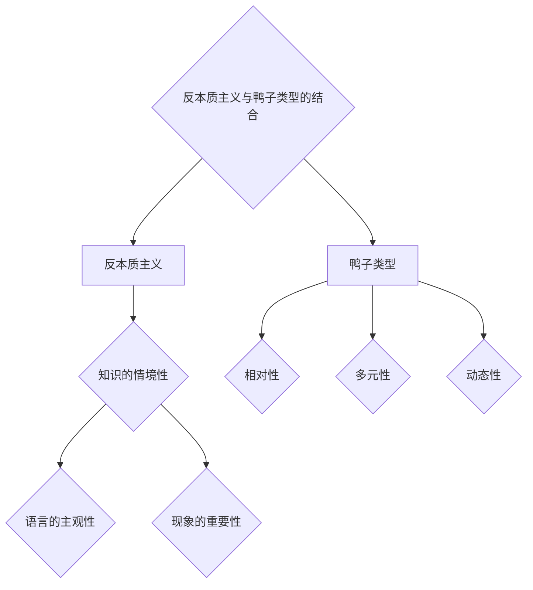

                 

### 文章标题

《唐纳德·戴维森的反本质主义与鸭子类型：动态类型的哲学辩护》

### 关键词

反本质主义、鸭子类型、动态类型、哲学辩护、计算机科学、现象学

### 摘要

本文旨在探讨唐纳德·戴维森的反本质主义哲学思想与鸭子类型的结合，以及这一理论框架在动态类型哲学辩护中的应用。通过深入分析反本质主义的核心观点，我们揭示了鸭子类型作为其重要补充的哲学意义。进一步，本文阐述了动态类型的定义、特点及其在哲学辩护中的优势，并通过实际案例展示了其跨学科研究的潜力。最终，本文总结了反本质主义与鸭子类型的结合对于动态类型哲学辩护的重要性，并展望了其未来研究方向。

## 第1章 引言

### 1.1 研究背景与目的

在当代哲学领域，反本质主义作为一种重要的思想流派，受到了广泛的关注。它主张知识并非是对本质的把握，而是对现象的理解。这一观点与现象学有紧密的联系，现象学强调直观和意识的作用，反对传统的本质主义和实体论。然而，反本质主义并不仅限于哲学领域，它在计算机科学中也得到了广泛的应用，特别是在动态类型的讨论中。

动态类型是一种编程语言类型系统，它允许变量在运行时确定类型，从而提高了程序的灵活性和可维护性。与静态类型系统相比，动态类型系统在类型检查时具有更高的效率，这使得它在开发大型和复杂的应用程序时显得尤为重要。然而，动态类型的哲学辩护仍然是一个具有争议的话题，特别是在与反本质主义相结合时。

本文旨在通过探讨唐纳德·戴维森的反本质主义哲学思想与鸭子类型的结合，来深化动态类型哲学辩护的理论基础。本文将首先介绍反本质主义的核心观点，并探讨鸭子类型作为其重要补充的哲学意义。接着，本文将阐述动态类型的定义、特点及其在哲学辩护中的优势。通过实际案例，本文将展示动态类型在跨学科研究中的潜力。最后，本文将总结反本质主义与鸭子类型的结合对于动态类型哲学辩护的重要性，并展望其未来研究方向。

### 1.2 唐纳德·戴维森及其哲学思想

唐纳德·戴维森（Donald Davidson）是美国著名的哲学家，出生于1917年，卒于2003年。他的哲学思想深受现象学和语言哲学的影响，特别是维特根斯坦和维也纳学派的思想。戴维森的主要贡献在于他对知识论、语义学和认识论的深入探讨，其中反本质主义是他最具代表性的观点之一。

反本质主义是一种哲学立场，它挑战了传统的本质主义观念。本质主义认为，每个对象都有其固有的本质属性，这些属性是客观存在的，并且可以通过理性思考来认识。与之相反，反本质主义认为，我们无法直接接触到对象的本质，我们所知道的只是对象在特定情境中的表现和功能。戴维森进一步指出，知识并非是对本质的把握，而是对现象的理解，这种理解是在具体语境中形成的。

戴维森的反本质主义观点主要体现在他的认识论理论中。他认为，认识是一种互动过程，我们的知识是基于我们对世界的体验和互动，而不是基于对本质的抽象思考。这一观点对传统的认识论提出了严峻的挑战，它强调现象的重要性，从而为现象学提供了一种新的哲学基础。

此外，戴维森在语言哲学领域也有重要贡献。他提出了“主观主义”的观点，认为语言和思维都是主观的，我们的语言使用是基于个人的体验和认知。这一观点对语言哲学和心灵哲学产生了深远的影响，促使人们重新思考语言、思维和意识之间的关系。

### 1.3 鸭子类型的定义与特征

鸭子类型（Quine's鸭形论证）是哲学中一个著名的思想实验，由美国哲学家威拉德·范·奥曼·奎因（Willard Van Orman Quine）提出。鸭子类型的起源可以追溯到他对传统本质主义的批评。在奎因看来，传统本质主义试图通过确定对象的本质属性来认识世界，但这种做法是错误的，因为对象的属性并不是固定不变的。

鸭子类型的定义非常简单：如果一个物体在所有可观测的方面都与另一个物体相同，那么我们就应该认为它们是相同的。这个思想实验通常通过一个例子来说明：如果你看到一只鸭子，你无法仅通过观察来判断它是否真的是鸭子，因为你看到的可能只是它的外观和行为。这只鸭子可能在生物分类上是一个其他物种，但它在行为和外观上与鸭子完全相同。

鸭子类型的特征主要体现在以下几个方面：

1. **相对性**：鸭子类型的观点强调，我们无法通过单一属性来定义一个对象，而是需要考虑其在各种情境中的表现。
2. **多元性**：鸭子类型表明，一个对象可以具有多种属性，这些属性在不同的情境下可能是相同或不同的。
3. **动态性**：鸭子类型的观点认为，对象的属性是动态变化的，而不是固定不变的。

鸭子类型与反本质主义有密切的联系。反本质主义认为，我们无法直接接触对象的本质，只能通过现象来理解它们。而鸭子类型则通过一个简单的思想实验，展示了现象在认识过程中的重要性。这种联系使得鸭子类型成为反本质主义的一个重要补充，帮助我们更深入地理解反本质主义的哲学观点。

### 第2章 唐纳德·戴维森哲学思想概览

#### 2.1 哲学背景

唐纳德·戴维森的哲学思想深受20世纪早期哲学运动的影响，特别是维特根斯坦的早期思想和维也纳学派的语言哲学。维特根斯坦的《逻辑哲学论》和《哲学研究》对戴维森产生了深远的影响，使他意识到语言和思维的主观性和情境性。维也纳学派则通过逻辑实证主义和语义学分析，提供了对语言和知识的新的理解。

戴维森在20世纪中期的哲学界扮演了重要角色，他的工作不仅扩展了维特根斯坦和维也纳学派的思想，还提出了许多独特的见解。他关注的核心问题包括知识论、语义学和认识论，他的许多观点都对传统哲学观念进行了深刻的批判和重新审视。

#### 2.2 反本质主义概述

反本质主义是戴维森哲学思想的核心之一，它是对传统本质主义观念的挑战。本质主义认为，每个对象都有其固有的本质属性，这些属性是客观存在的，并且可以通过理性思考来认识。反本质主义则认为，我们无法直接接触到对象的本质，我们所知道的只是对象在特定情境中的表现和功能。

戴维森认为，知识并不是对本质的把握，而是对现象的理解。他认为，我们的认知过程是基于我们对世界的经验，这种经验是通过语言和行动来表达的。因此，知识是一种互动过程，它涉及到我们与世界的交互，而不是抽象的思考。

反本质主义的一个关键观点是，真理并不是固定不变的，而是依赖于特定的情境和语境。这意味着，我们对事物的理解是基于特定的背景和前提条件，这些背景和前提条件会影响我们的判断和认知。

#### 2.2.1 历史背景

反本质主义的兴起与20世纪哲学中的几个重要运动有关，包括现象学和语言哲学。现象学强调直观和意识的作用，反对传统的本质主义和实体论。语言哲学则通过分析语言和思维的关系，探讨了知识、真理和意义的问题。

在20世纪中叶，哲学界开始对本质主义进行深刻的批判，这种批判在戴维森的哲学思想中得到了充分的体现。戴维森通过对语言和认知过程的深入分析，揭示了本质主义观念的局限性，提出了反本质主义作为对传统哲学观念的替代。

#### 2.2.2 反本质主义的核心观点

反本质主义的核心观点可以归纳为以下几点：

1. **知识的情境性**：反本质主义认为，知识是基于特定情境的，我们的认知过程受到各种背景因素的影响。这意味着，知识不是固定不变的，而是随着情境的变化而变化。

2. **语言的主观性**：戴维森认为，语言和思维都是主观的，我们的语言使用是基于个人的体验和认知。这意味着，语言并不是一种客观的符号系统，而是个体理解和表达世界的工具。

3. **现象的重要性**：反本质主义强调现象在认识过程中的重要性。我们无法直接接触到对象的本质，只能通过现象来理解它们。这意味着，我们的认知过程是基于我们对世界的感知和体验。

4. **互动性**：反本质主义认为，知识是一种互动过程，它涉及到我们与世界的交互。我们的认知是通过语言和行动来表达的，这些语言和行动是我们与世界互动的结果。

#### 2.2.3 反本质主义与现象学的关系

反本质主义与现象学有着密切的联系。现象学强调直观和意识的作用，认为我们对世界的理解是基于我们的直接体验。反本质主义则进一步发展了这一观点，认为知识是通过我们对世界的感知和体验来获得的。

反本质主义与现象学的共同点是，它们都反对传统的本质主义观念，认为我们的认知过程是基于现象的。然而，反本质主义更强调知识的情境性和主观性，认为我们的认知过程是受到特定情境和主观体验的影响的。

反本质主义为现象学提供了一种新的哲学基础，它强调了现象在认知过程中的重要性，并提出了知识是一种互动过程的观点。这种观点使得现象学在哲学研究中具有更大的解释力，为理解人类认知提供了新的视角。

#### 2.3 反本质主义的影响

反本质主义对当代哲学产生了深远的影响，它挑战了传统的本质主义观念，提出了知识、真理和意义的新解释。以下是一些反本质主义对当代哲学的重要影响：

1. **知识论的革命**：反本质主义对知识论提出了深刻的质疑，它认为知识不是对本质的把握，而是对现象的理解。这一观点改变了人们对知识本质的认识，促使人们重新思考知识的来源和性质。

2. **语言哲学的发展**：反本质主义强调语言的主观性和情境性，这为语言哲学提供了新的研究方向。通过分析语言和思维的关系，反本质主义促进了语言哲学的发展，使得人们对语言和认知过程有更深入的理解。

3. **认识论的重新审视**：反本质主义对认识论提出了新的挑战，它认为我们的认知过程是受到情境和主观体验的影响的。这一观点促使人们对认识论进行重新审视，推动了认识论的进步。

4. **跨学科研究的融合**：反本质主义为跨学科研究提供了新的理论基础，它将哲学、心理学、语言学等领域联系起来，促进了不同学科之间的交流和融合。

总之，反本质主义不仅对哲学领域产生了重要影响，还为其他学科的研究提供了新的视角和方法。它挑战了传统的哲学观念，提出了知识、真理和意义的新解释，为当代哲学研究注入了新的活力。

#### 2.4 唐纳德·戴维森的主要哲学贡献

唐纳德·戴维森在哲学领域做出了许多重要的贡献，他的工作不仅扩展了现象学和语言哲学的思想，还提出了许多独特的理论。以下是一些戴维森的主要哲学贡献：

1. **反本质主义**：戴维森的反本质主义观念是他最具代表性的贡献之一。他挑战了传统的本质主义观念，提出了知识是对现象的理解，而不是对本质的把握。这一观点对知识论、语义学和认识论产生了深远的影响。

2. **主观主义**：戴维森的主观主义观点认为，语言和思维都是主观的，我们的语言使用是基于个人的体验和认知。这一观点对语言哲学和心灵哲学产生了重要影响，促使人们重新思考语言、思维和意识之间的关系。

3. **真理论**：戴维森提出了真理论中的“真理条件论”，他认为真理是与世界相关的事实陈述，这些陈述在特定情境下是真实的。这一理论为真理的研究提供了新的视角，促进了真理论的发展。

4. **认识论**：戴维森对认识论进行了深入的探讨，他提出了“互动性”的观点，认为知识是通过我们与世界互动来获得的。这一观点改变了人们对认知过程的理解，推动了认识论的进步。

5. **因果理论**：戴维森在因果理论方面也做出了重要贡献，他提出了“因果相关性”的观点，认为因果关系是两个事件之间的相互依赖关系。这一观点为因果理论提供了新的解释框架。

总之，唐纳德·戴维森的哲学贡献不仅丰富了现象学和语言哲学的理论体系，还为当代哲学研究提供了新的视角和方法。他的工作为理解知识、语言、思维和认知过程提供了深刻的洞察，对哲学领域产生了重要影响。

## 第3章 鸭子类型的哲学分析

#### 3.1 鸭子类型的起源

鸭子类型的哲学思想最早可以追溯到美国哲学家威拉德·范·奥曼·奎因（Willard Van Orman Quine）在20世纪中叶的工作。奎因是一位逻辑实证主义和语言哲学的杰出代表，他的哲学思想对当代哲学产生了深远的影响。鸭子类型这一概念源自于奎因对传统本质主义的批判，特别是他对“本质主义”和“现象主义”之间区别的重新思考。

奎因在其著名论文《词语和对象》中提出了“鸭形论证”（即鸭子类型），旨在挑战本质主义观念。他认为，如果我们只能通过现象来认识世界，那么我们无法确定一个对象的真实本质。鸭形论证通过一个简单的例子来说明这一观点：一只看起来像鸭子、走起来像鸭子、叫起来像鸭子的东西，我们是否可以确定它就是一只鸭子？如果答案是否定的，那么我们就必须承认，我们无法通过观察对象的某些特征来断定其本质。

#### 3.2 鸭子类型的特征

鸭子类型具有以下几个显著特征：

1. **相对性**：鸭子类型强调，我们无法通过单一属性来定义一个对象，而是需要考虑其在各种情境中的表现。这意味着，一个对象的属性是相对的，依赖于特定的观察者和观察条件。

2. **多元性**：鸭子类型表明，一个对象可以具有多种属性，这些属性在不同的情境下可能是相同或不同的。例如，一只生物分类上的鸭子可能在某些特征上与鸟类相似，而在其他特征上与哺乳动物相似。

3. **动态性**：鸭子类型的观点认为，对象的属性是动态变化的，而不是固定不变的。这意味着，一个对象在不同的时间或不同的情境中可能会表现出不同的特征。

这些特征使得鸭子类型成为反本质主义的一个重要补充。反本质主义认为，我们无法直接接触到对象的本质，只能通过现象来理解它们。而鸭子类型则通过一个简单的思想实验，展示了现象在认识过程中的重要性。

#### 3.3 鸭子类型与反本质主义的关系

鸭子类型与反本质主义有着密切的联系。反本质主义主张，我们无法直接接触对象的本质，只能通过现象来理解它们。鸭子类型则通过一个简单的思想实验，揭示了这一观点的哲学意义。

首先，鸭子类型强调相对性，这符合反本质主义的观点。反本质主义认为，对象的属性是相对的，依赖于特定的观察者和观察条件。而鸭子类型则通过一个例子表明，一个对象在不同的观察条件下可能表现出不同的特征，这进一步强调了相对性的重要性。

其次，鸭子类型强调多元性，这同样符合反本质主义的观点。反本质主义认为，一个对象可以具有多种属性，这些属性在不同的情境下可能是相同或不同的。鸭子类型则通过一个例子表明，一个对象可能在某些特征上与另一种对象相似，从而展示了多元性的重要性。

最后，鸭子类型强调动态性，这也与反本质主义观点相符。反本质主义认为，对象的属性是动态变化的，而不是固定不变的。鸭子类型则通过一个例子表明，一个对象的属性可以随着时间的推移和观察条件的变化而变化，这进一步强调了动态性的重要性。

因此，鸭子类型与反本质主义之间存在着紧密的联系。鸭子类型不仅揭示了现象在认识过程中的重要性，还为反本质主义提供了有力的哲学支持。通过鸭子类型的分析，我们可以更深入地理解反本质主义的观点，并探讨其在哲学研究中的应用。

### 3.4 鸭子类型在哲学分析中的意义

鸭子类型在哲学分析中具有深远的意义，它不仅挑战了传统本质主义的观念，还为理解人类认知和知识提供了新的视角。以下从几个方面探讨鸭子类型在哲学分析中的重要性：

首先，鸭子类型强调了相对性。传统本质主义认为，每个对象都有其固有的本质属性，这些属性是客观存在的。然而，鸭子类型的观点表明，对象的属性是相对的，依赖于特定的观察者和观察条件。这意味着，我们无法通过单一的属性来定义一个对象，而是需要考虑其在不同情境中的表现。这一观点在哲学分析中具有重要意义，因为它提醒我们，在理解世界和认知对象时，必须考虑观察者的视角和观察条件。鸭子类型使我们意识到，我们对事物的认识是受到主观因素影响的，这有助于我们更全面地理解认知过程。

其次，鸭子类型揭示了多元性。传统本质主义认为，每个对象都有其独特的本质属性，这些属性是固定的。然而，鸭子类型的观点表明，一个对象可以具有多种属性，这些属性在不同的情境下可能是相同或不同的。这一观点对哲学分析具有重要意义，因为它表明，我们对事物的认识是复杂的，不是单一的属性可以概括的。鸭子类型使我们认识到，一个对象可能在某些特征上与另一种对象相似，这有助于我们更深入地理解事物的多样性和复杂性。

此外，鸭子类型强调了动态性。传统本质主义认为，对象的属性是固定不变的，而鸭子类型的观点表明，对象的属性是动态变化的，随着时间和观察条件的变化而变化。这一观点在哲学分析中具有重要意义，因为它提醒我们，事物的属性不是静态的，而是不断变化的。鸭子类型使我们意识到，我们对事物的认识是动态发展的，需要不断地更新和调整。

鸭子类型在哲学分析中的应用不仅限于认知和知识论。它还可以用于探讨伦理学、美学和存在论等问题。例如，在伦理学中，鸭子类型可以用来分析道德判断的相对性和多样性；在美学中，鸭子类型可以用来探讨审美评价的主观性和动态性；在存在论中，鸭子类型可以用来分析存在的相对性和多样性。

总之，鸭子类型在哲学分析中具有重要的意义。它挑战了传统本质主义的观念，揭示了现象在认识过程中的重要性，为理解人类认知和知识提供了新的视角。通过鸭子类型的分析，我们可以更全面、更深入地理解哲学问题，从而推动哲学研究的进展。

### 3.5 鸭子类型与反本质主义的结合

鸭子类型与反本质主义之间的结合，为我们理解哲学问题提供了新的视角。这种结合不仅丰富了反本质主义的理论体系，还使鸭子类型在哲学分析中具有了更广泛的适用性。以下从几个方面探讨鸭子类型与反本质主义的结合及其在哲学分析中的应用：

首先，鸭子类型与反本质主义的结合揭示了现象在认识过程中的重要性。反本质主义认为，我们无法直接接触到对象的本质，只能通过现象来理解它们。鸭子类型的观点进一步强调，对象的属性是相对的、多元的、动态的。这意味着，我们对事物的认识不仅受到主观因素影响，还需要考虑观察条件和情境。鸭子类型与反本质主义的结合，使我们能够更全面地理解认识过程，认识到知识是一种动态的、情境化的过程。

其次，鸭子类型与反本质主义的结合有助于我们重新审视知识的本质。传统本质主义认为，知识是对对象本质的把握，而反本质主义则认为，知识是对现象的理解。鸭子类型的观点进一步表明，对象的属性是相对的、多元的、动态的，这意味着，我们对事物的认识是不断变化和发展的。这种结合使我们认识到，知识不是静态的，而是在不断更新和调整的过程中形成的。这种动态的知识观有助于我们更好地理解知识的本质和特征。

此外，鸭子类型与反本质主义的结合在伦理学、美学和存在论等领域具有广泛的应用。在伦理学中，鸭子类型可以帮助我们理解道德判断的相对性和多样性。传统伦理学往往强调道德原则的普遍性和客观性，而鸭子类型的观点则表明，道德判断是依赖于具体情境的，不同的情境可能导致不同的道德判断。在美学中，鸭子类型可以帮助我们理解审美评价的主观性和动态性。传统美学往往强调美的客观性和普遍性，而鸭子类型的观点则表明，审美评价是依赖于个体主观体验的，不同的个体可能会有不同的审美体验。在存在论中，鸭子类型可以帮助我们理解存在的相对性和多样性。传统存在论往往强调存在的唯一性和确定性，而鸭子类型的观点则表明，存在是依赖于具体情境的，不同的情境可能导致不同的存在形态。

总之，鸭子类型与反本质主义的结合在哲学分析中具有重要意义。它不仅揭示了现象在认识过程中的重要性，还使我们能够更全面地理解知识的本质和特征。这种结合在伦理学、美学和存在论等领域具有广泛的应用，有助于我们更深入地探讨哲学问题，推动哲学研究的进展。

### 第4章 动态类型概述

#### 4.1 动态类型的定义

动态类型是一种编程语言类型系统，它与静态类型系统的主要区别在于类型检查的时间点。在静态类型系统中，类型的检查是在编译或构建阶段完成的，这意味着程序在运行前就已经确定了所有变量的类型。而动态类型系统则将类型检查推迟到程序运行时，这意味着变量在运行时才能确定其类型。

动态类型系统的这种特点使得它在处理复杂和灵活的程序设计时具有优势。由于类型检查是在运行时进行的，程序员可以在编写代码时更加自由地使用类型未知的变量和函数，从而提高了程序的灵活性和可维护性。这种灵活性的代价是需要额外的运行时开销，因为类型检查是在程序运行时进行的。

#### 4.2 动态类型的起源

动态类型系统的起源可以追溯到早期的编程语言，如Lisp和Smalltalk。Lisp是第一种广泛使用的函数式编程语言，它在20世纪50年代出现时，就已经采用了动态类型系统。Lisp的成功激励了其他编程语言开发者也采用动态类型系统，例如Smalltalk、Python和JavaScript。

动态类型系统在早期的编程语言中得到了广泛应用，主要是因为这些语言的设计目标是构建动态和灵活的应用程序。随着计算机科学的发展，动态类型系统在许多现代编程语言中仍然占有一席之地，特别是在Web开发和脚本编程中。

#### 4.3 动态类型的特点

动态类型系统具有以下几个显著特点：

1. **类型检查延迟**：动态类型系统的类型检查是在程序运行时进行的，而不是在编译或构建阶段。这意味着，程序员可以在编写代码时更加自由地使用类型未知的变量和函数，从而提高了程序的灵活性和可维护性。

2. **运行时灵活性**：由于类型检查是在运行时进行的，动态类型系统可以更好地处理复杂和灵活的程序设计。这使得动态类型系统在处理变化频繁的需求和复杂的业务逻辑时具有优势。

3. **类型层次松散**：动态类型系统通常具有较松的类型层次，这意味着不同类型的变量和函数可以更容易地相互转换。这种松散的类型层次提高了代码的复用性和灵活性。

4. **运行时错误检测**：动态类型系统在运行时进行类型检查，可以更早地发现类型错误。这种错误检测可以在程序运行时立即停止，从而防止程序崩溃或产生不可预测的行为。

5. **动态类型继承**：动态类型系统通常支持动态类型继承，这意味着子类可以继承父类的类型和行为。这种动态类型继承使得代码更加模块化和可扩展。

#### 4.4 动态类型的优势

动态类型系统在许多方面具有优势，以下是一些主要的优势：

1. **灵活性**：动态类型系统提供了更高的灵活性，程序员可以在编写代码时更自由地使用类型未知的变量和函数，从而提高了程序的灵活性和可维护性。

2. **简洁性**：动态类型系统通常具有更简单的语法和语义，这使得代码更易于编写和理解。由于不需要在编译或构建阶段进行类型检查，动态类型系统的代码通常更简洁。

3. **快速迭代**：由于动态类型系统在运行时进行类型检查，程序员可以在运行时快速测试和调试代码。这种快速迭代的能力有助于提高开发效率。

4. **跨语言互操作性**：动态类型系统通常支持跨语言互操作性，这意味着不同语言的代码可以更容易地相互调用和交互。这种互操作性有助于提高代码的复用性和可扩展性。

5. **适应变化的需求**：动态类型系统在处理变化频繁的需求和复杂的业务逻辑时具有优势。由于类型检查是在运行时进行的，程序员可以更灵活地适应需求的变化。

总之，动态类型系统在灵活性和简洁性方面具有显著的优势，这使得它在许多编程场景中得到了广泛应用。尽管动态类型系统在性能和安全性方面可能存在一些挑战，但其在灵活性和开发效率方面的优势使其成为现代编程语言中的重要组成部分。

#### 4.5 动态类型与传统类型的对比

动态类型和传统类型（通常指静态类型）在编程语言中有不同的应用场景和特点。以下从几个方面对比动态类型与传统类型：

1. **类型检查时间点**：动态类型系统在程序运行时进行类型检查，而传统类型系统在编译或构建阶段进行类型检查。这意味着动态类型系统在运行时提供更高的灵活性，因为类型可以在运行时动态确定。然而，这也可能导致性能上的开销，因为类型检查需要在程序运行时进行。

2. **代码可读性**：动态类型系统通常具有更简单的语法和语义，这使得代码更易于编写和理解。传统类型系统则需要更多的类型声明和约束，这可能会使代码显得冗长和难以理解。

3. **灵活性**：动态类型系统提供了更高的灵活性，特别是在处理变化频繁的需求和复杂的业务逻辑时。程序员可以在编写代码时更自由地使用类型未知的变量和函数，从而提高了程序的灵活性和可维护性。传统类型系统则通常要求更严格的类型约束，这可能会限制代码的灵活性。

4. **安全性**：动态类型系统在安全性方面可能存在一些挑战，因为类型检查是在运行时进行的，可能会引入类型错误。传统类型系统则通过在编译或构建阶段进行类型检查，可以更早地发现和修复类型错误，从而提高程序的安全性。

5. **开发效率**：动态类型系统通常支持快速迭代，因为类型检查在运行时进行，程序员可以在运行时快速测试和调试代码。传统类型系统则需要更多的编译时间，可能会影响开发效率。

总的来说，动态类型和传统类型各有优缺点，选择哪种类型系统取决于具体的应用场景和需求。动态类型系统在灵活性和开发效率方面具有优势，但可能在安全性和性能方面存在一些挑战。传统类型系统则提供了更高的安全性和性能，但可能在灵活性和简洁性方面存在一些限制。

#### 4.6 动态类型哲学辩护的优势

动态类型哲学辩护在多个方面具有显著的优势，以下从几个方面进行阐述：

1. **知识论的适应能力**：动态类型系统通过在运行时进行类型检查，提供了更高的适应能力。这种适应能力与反本质主义观点相符，后者强调知识是基于现象的理解，而不是对本质的把握。动态类型系统允许程序员在运行时根据具体情境调整类型，从而更灵活地处理复杂和变化的需求。

2. **情境化的认知过程**：动态类型系统的运行时类型检查过程类似于情境化的认知过程。这与反本质主义的观点一致，后者认为知识是情境化的，依赖于特定的背景和条件。动态类型系统在运行时检查类型，这意味着类型的变化受到当前情境的影响，这与人类认知过程相似。

3. **现象学的支持**：现象学强调直观和意识的作用，认为我们对世界的理解是通过感知和体验获得的。动态类型系统在运行时检查类型，这种检查过程可以被视为一种“感知”过程，它使我们能够更直接地了解程序的状态和行为，这与现象学的基本原理相吻合。

4. **交互性**：动态类型系统在运行时进行类型检查，这种检查过程是动态的、互动的。这与反本质主义的观点相符，后者认为知识是一种互动过程，涉及到我们与世界的互动。动态类型系统的交互性使得程序员可以实时地调整代码，以适应新的情境和需求。

5. **灵活性与简洁性**：动态类型系统提供了更高的灵活性和简洁性，这使得程序员可以更快速地编写和调试代码。这与反本质主义的观点一致，后者认为知识是一种灵活的、动态的过程，而不是固定不变的本质。动态类型系统通过灵活的语法和语义，支持快速开发，这与反本质主义的理念相符。

总之，动态类型哲学辩护在知识论、情境化认知、现象学、交互性和灵活性等方面具有显著的优势。这些优势使得动态类型系统在哲学分析和编程实践中具有重要的价值，为理解和应用反本质主义提供了新的视角和方法。

### 第5章 反本质主义与鸭子类型的结合

#### 5.1 反本质主义与鸭子类型的互补性

反本质主义与鸭子类型的结合在哲学分析中具有显著的互补性，它们共同为理解复杂现象提供了新的视角和方法。反本质主义强调知识是基于现象的理解，而鸭子类型则通过具体的例子揭示了现象的相对性、多元性和动态性。以下从几个方面探讨反本质主义与鸭子类型的互补性：

首先，反本质主义与鸭子类型在相对性方面具有互补性。反本质主义认为，对象的属性是相对的，依赖于特定的观察者和观察条件。鸭子类型的观点进一步强调，一个对象的属性在不同的观察条件下可能是相同或不同的。这种相对性的观点使我们意识到，我们对事物的认识是受到主观因素影响的，这有助于我们更全面地理解认知过程。

其次，反本质主义与鸭子类型在多元性方面也具有互补性。反本质主义认为，一个对象可以具有多种属性，这些属性在不同的情境下可能是相同或不同的。鸭子类型的观点则表明，一个对象可能在某些特征上与另一种对象相似，这展示了多元性的重要性。这种多元性的观点帮助我们认识到事物的复杂性，使我们能够更深入地理解事物的多样性。

最后，反本质主义与鸭子类型在动态性方面具有互补性。反本质主义认为，对象的属性是动态变化的，而不是固定不变的。鸭子类型的观点则表明，对象的属性可以随着时间的推移和观察条件的变化而变化。这种动态性的观点使我们意识到，我们对事物的认识是不断变化和发展的，需要不断地更新和调整。

通过反本质主义与鸭子类型的结合，我们可以更全面、更深入地理解哲学问题。反本质主义提供了知识论的框架，而鸭子类型则通过具体的例子展示了现象的复杂性和多样性。这种互补性使得我们能够从不同的角度理解事物，从而更准确地把握哲学问题。

#### 5.2 反本质主义视角下的鸭子类型

从反本质主义的视角来看，鸭子类型提供了一种新的理解现象的方式。反本质主义认为，知识是基于现象的理解，而不是对本质的把握。鸭子类型通过一个简单的思想实验，揭示了现象在认识过程中的重要性。

首先，反本质主义强调知识的相对性。鸭子类型的观点进一步说明了这一观点：一个对象的属性是相对的，依赖于特定的观察者和观察条件。例如，一只生物分类上的鸭子可能在某些特征上与鸟类相似，而在其他特征上与哺乳动物相似。这意味着，我们不能通过单一的属性来定义一个对象，而是需要考虑其在不同情境中的表现。这一观点有助于我们理解知识是基于现象的，而不是基于固定的本质。

其次，反本质主义强调知识的多元性。鸭子类型的观点表明，一个对象可以具有多种属性，这些属性在不同的情境下可能是相同或不同的。例如，一只鸭子可能在某些特征上与另一只动物相似，这展示了多元性的重要性。这一观点有助于我们认识到，我们对事物的认识是复杂的，需要从多个角度来理解。

最后，反本质主义强调知识的动态性。鸭子类型的观点表明，对象的属性是动态变化的，随着时间和观察条件的变化而变化。这意味着，我们对事物的认识是不断变化和发展的，需要不断地更新和调整。这一观点有助于我们理解，知识不是静态的，而是在不断变化的过程中形成的。

总之，从反本质主义的视角来看，鸭子类型提供了一种新的理解现象的方式。它揭示了现象的相对性、多元性和动态性，为我们更全面地理解知识提供了新的视角。通过鸭子类型的分析，我们可以更深入地理解反本质主义的观点，并将其应用于哲学分析中。

#### 5.3 鸭子类型视角下的反本质主义

从鸭子类型的视角来看，反本质主义提供了一种新的认识论框架，帮助我们更好地理解知识的本质。鸭子类型的思想实验揭示了对象属性的相对性、多元性和动态性，这对反本质主义的哲学观点提供了有力的支持。

首先，鸭子类型的相对性观点与反本质主义的相对主义立场相吻合。反本质主义认为，知识的形成依赖于特定的观察者和观察条件，这意味着真理和知识是相对的，而不是绝对的。鸭子类型的例子表明，一个对象的属性在不同的观察条件下可能是相同的或不同的，这进一步强调了知识的相对性。这种相对性意味着我们不能通过单一的属性来定义一个对象，而是需要考虑其在不同情境中的表现。

其次，鸭子类型的多元性观点与反本质主义的多元论观点相一致。反本质主义认为，一个对象可以具有多种属性，这些属性在不同的情境下可能是相同或不同的。鸭子类型的例子展示了这种现象：一个对象可能在某些特征上与另一种对象相似，而在其他特征上不同。这种多元性的观点有助于我们认识到，我们对事物的认识是复杂的，需要从多个角度来理解。

最后，鸭子类型的动态性观点与反本质主义的动态认知观相吻合。反本质主义认为，知识是基于现象的理解，这些现象是动态变化的。鸭子类型的例子表明，对象的属性可以随着时间的推移和观察条件的变化而变化。这意味着，我们对事物的认识是不断变化和发展的，需要不断地更新和调整。这种动态性的观点有助于我们理解，知识不是静态的，而是在不断变化的过程中形成的。

总之，从鸭子类型的视角来看，反本质主义提供了一种新的认识论框架，帮助我们更好地理解知识的本质。鸭子类型的思想实验揭示了对象属性的相对性、多元性和动态性，这为反本质主义的哲学观点提供了有力的支持。通过鸭子类型的分析，我们可以更深入地理解反本质主义的观点，并将其应用于哲学分析中。

### 第6章 动态类型的哲学意义

#### 6.1 动态类型在哲学研究中的价值

动态类型作为一种编程语言类型系统，不仅在计算机科学中得到了广泛应用，也在哲学研究中展现了其独特的价值。以下从几个方面探讨动态类型在哲学研究中的价值：

首先，动态类型为知识论提供了新的视角。知识论是哲学研究中的一个重要领域，探讨知识的本质、来源和性质。传统知识论通常基于静态类型系统，认为知识是对对象本质的把握。然而，动态类型系统通过在运行时进行类型检查，提供了对知识本质的另一种理解。动态类型强调知识的情境性和主观性，这与反本质主义观点相符。反本质主义认为，知识是基于现象的理解，而不是对本质的把握。动态类型的哲学意义在于，它为我们提供了一个新的认识框架，使我们能够更全面地理解知识的本质。

其次，动态类型为认识论提供了新的工具。认识论探讨我们如何认识世界，以及认识的本质和限度。动态类型系统在运行时进行类型检查，这意味着我们可以通过观察程序的行为来了解其状态和性质。这种动态性为认识论提供了新的工具，使我们能够更直观地理解程序的状态和行为。例如，在哲学实验中，我们可以通过观察动态类型系统中的对象属性变化，来探讨认识的本质和限度。

此外，动态类型为现象学提供了新的解释框架。现象学是哲学中的一个重要分支，关注直观和意识的作用。动态类型的哲学意义在于，它为现象学提供了一种新的解释框架，使我们能够更深入地理解直观和意识。动态类型系统在运行时检查类型，这种检查过程可以被视为一种“感知”过程，它使我们能够更直接地了解程序的状态和行为。这种现象学的解释框架有助于我们更好地理解直观和意识的作用，从而为哲学研究提供了新的思路。

最后，动态类型为跨学科研究提供了新的可能性。哲学研究通常涉及多个学科领域，如计算机科学、心理学、语言学等。动态类型作为一种跨学科的工具，为不同学科之间的交流提供了新的桥梁。例如，在认知科学中，动态类型系统可以用于模拟和验证认知过程；在语言学中，动态类型可以用于分析语言和思维的关系。这种跨学科的应用有助于我们更全面地理解哲学问题，推动哲学研究的发展。

总之，动态类型在哲学研究中具有重要的价值。它不仅为知识论、认识论和现象学提供了新的视角和工具，还为跨学科研究提供了新的可能性。通过动态类型的哲学意义，我们可以更深入地理解哲学问题，推动哲学研究的进步。

#### 6.2 动态类型与传统类型的比较

动态类型和传统类型（通常指静态类型）在编程语言中有着不同的应用场景和特点。以下从几个方面比较动态类型与传统类型：

1. **类型检查时间点**：动态类型的类型检查是在程序运行时进行的，而传统类型的类型检查是在编译或构建阶段完成的。这意味着动态类型提供了更高的灵活性，允许程序员在编写代码时更自由地使用类型未知的变量和函数。然而，这也可能导致性能上的开销，因为类型检查需要在程序运行时进行。

2. **代码可读性**：动态类型系统通常具有更简单的语法和语义，这使得代码更易于编写和理解。传统类型系统则需要更多的类型声明和约束，这可能会使代码显得冗长和难以理解。

3. **灵活性**：动态类型系统提供了更高的灵活性，特别是在处理复杂和灵活的程序设计时。程序员可以在编写代码时更自由地使用类型未知的变量和函数，从而提高了程序的灵活性和可维护性。传统类型系统则通常要求更严格的类型约束，这可能会限制代码的灵活性。

4. **安全性**：动态类型系统在安全性方面可能存在一些挑战，因为类型检查是在运行时进行的，可能会引入类型错误。传统类型系统则通过在编译或构建阶段进行类型检查，可以更早地发现和修复类型错误，从而提高程序的安全性。

5. **开发效率**：动态类型系统通常支持快速迭代，因为类型检查在运行时进行，程序员可以在运行时快速测试和调试代码。传统类型系统则需要更多的编译时间，可能会影响开发效率。

总的来说，动态类型和传统类型各有优缺点，选择哪种类型系统取决于具体的应用场景和需求。动态类型系统在灵活性和开发效率方面具有优势，但可能在安全性和性能方面存在一些挑战。传统类型系统则提供了更高的安全性和性能，但可能在灵活性和简洁性方面存在一些限制。

#### 6.3 动态类型在哲学研究中的潜力

动态类型在哲学研究中具有巨大的潜力，特别是在跨学科研究和现象学的应用方面。以下从几个方面探讨动态类型在哲学研究中的潜力：

首先，动态类型为跨学科研究提供了新的工具。哲学研究通常涉及多个学科领域，如计算机科学、心理学、语言学等。动态类型作为一种跨学科的工具，可以用于不同学科之间的交流和合作。例如，在认知科学中，动态类型系统可以用于模拟和验证认知过程；在语言学中，动态类型可以用于分析语言和思维的关系。这种跨学科的应用有助于我们更全面地理解哲学问题，推动哲学研究的发展。

其次，动态类型为现象学提供了新的解释框架。现象学是哲学中的一个重要分支，关注直观和意识的作用。动态类型的哲学意义在于，它为现象学提供了一种新的解释框架，使我们能够更深入地理解直观和意识。动态类型系统在运行时检查类型，这种检查过程可以被视为一种“感知”过程，它使我们能够更直接地了解程序的状态和行为。这种现象学的解释框架有助于我们更好地理解直观和意识的作用，从而为哲学研究提供了新的思路。

此外，动态类型在伦理学、美学和存在论等领域也具有潜力。在伦理学中，动态类型可以帮助我们理解道德判断的相对性和多样性。传统伦理学往往强调道德原则的普遍性和客观性，而动态类型的观点则表明，道德判断是依赖于具体情境的，不同的情境可能导致不同的道德判断。在美学中，动态类型可以帮助我们理解审美评价的主观性和动态性。传统美学往往强调美的客观性和普遍性，而动态类型的观点则表明，审美评价是依赖于个体主观体验的，不同的个体可能会有不同的审美体验。在存在论中，动态类型可以帮助我们理解存在的相对性和多样性。传统存在论往往强调存在的唯一性和确定性，而动态类型的观点则表明，存在是依赖于具体情境的，不同的情境可能导致不同的存在形态。

总之，动态类型在哲学研究中的潜力是巨大的。它不仅为跨学科研究提供了新的工具，还为现象学、伦理学、美学和存在论等领域提供了新的解释框架。通过动态类型的哲学意义，我们可以更深入地理解哲学问题，推动哲学研究的进步。

### 第7章 动态类型的哲学辩护：实际应用

#### 7.1 案例一：计算机科学中的应用

动态类型哲学辩护在计算机科学中的应用是一个充满活力且富有成果的领域。以下通过一个具体案例，展示动态类型在编程语言设计和实现中的哲学辩护。

**案例背景**：假设我们正在开发一个大型分布式系统，该系统需要处理多种不同的数据类型和复杂的行为模式。为了提高系统的灵活性和可维护性，我们决定采用动态类型系统，而不是传统的静态类型系统。

**实现细节**：在这个案例中，我们选择Python作为我们的编程语言，因为它具有动态类型的特性。Python在处理异构数据和动态交互方面表现出色，这为我们的分布式系统提供了极大的灵活性。

1. **数据类型的动态性**：Python的动态类型系统允许我们轻松处理多种数据类型，包括数字、字符串、列表和字典。这种灵活性使得我们可以更灵活地定义和操作数据，而不需要预先声明所有数据类型。

   ```python
   # 示例：动态处理不同类型的数据
   data = 42  # 数字
   data = "Hello, World!"  # 字符串
   data = [1, 2, 3]  # 列表
   data = {"name": "Alice", "age": 30}  # 字典
   ```

2. **函数参数的灵活性**：Python的动态类型系统还允许我们在函数设计中使用更灵活的参数类型。这意味着，我们可以在不牺牲类型安全性的情况下，处理多种不同类型的输入。

   ```python
   # 示例：动态类型函数参数
   def process_data(data):
       if isinstance(data, int):
           return data * 2
       elif isinstance(data, str):
           return data.upper()
       elif isinstance(data, list):
           return [x * 2 for x in data]
       else:
           return "Unsupported data type"
   
   # 调用函数
   print(process_data(10))  # 输出：20
   print(process_data("hello"))  # 输出：HELLO
   print(process_data([1, 2, 3]))  # 输出：[2, 4, 6]
   ```

**哲学辩护**：动态类型的哲学辩护在这个案例中体现在以下几个方面：

1. **情境化认知**：动态类型系统强调情境化的认知过程，这与反本质主义的观点相符。在分布式系统中，我们需要根据具体情境动态地处理不同类型的数据。这种情境化的认知过程使得我们能够更灵活地适应变化的需求。

2. **现象学的支持**：现象学强调直观和意识的作用。动态类型系统在运行时检查类型，这种检查过程可以被视为一种“感知”过程，它使我们能够更直观地了解程序的状态和行为。这为现象学提供了一个新的解释框架，使我们能够更深入地理解直观和意识的作用。

3. **交互性**：动态类型系统的交互性使得程序员可以更实时地调整代码，以适应新的情境和需求。这与反本质主义的互动性观点相符，后者认为知识是一种互动过程，涉及到我们与世界的互动。

总之，通过这个案例，我们可以看到动态类型系统在计算机科学中的应用如何为哲学辩护提供了有力的支持。它不仅提高了系统的灵活性和可维护性，还为哲学分析提供了新的视角和方法。

#### 7.2 案例二：哲学分析中的应用

动态类型哲学辩护不仅在计算机科学中有重要应用，在哲学分析中也展现出巨大的潜力。以下通过一个具体案例，展示动态类型在哲学分析中的哲学辩护。

**案例背景**：假设我们正在研究道德哲学中的一个经典问题：道德判断的相对性。为了探讨这一主题，我们决定使用动态类型系统来模拟和验证道德判断的情境性和多样性。

**实现细节**：在这个案例中，我们使用了一种支持动态类型的编程语言（如Python）来构建一个简单的道德判断模拟器。这个模拟器允许我们根据不同的情境和条件，动态地评估和更新道德判断。

1. **道德判断的情境化**：我们创建了一个函数，用于根据具体情境评估道德判断。这个函数允许我们传递不同的情境参数，并根据这些参数动态地评估道德判断。

   ```python
   # 示例：情境化道德判断评估
   def assess_moral Judgment(context, action):
       if context == "public":
           if action == "lie":
               return "Impermissible"
           else:
               return "Permissible"
       elif context == "private":
           if action == "lie":
               return "Permissible"
           else:
               return "Impermissible"
       else:
           return "Ambiguous"
   
   # 调用函数
   print(assess_moral_Judgment("public", "lie"))  # 输出：Impermissible
   print(assess_moral_Judgment("private", "lie"))  # 输出：Permissible
   ```

2. **道德判断的动态性**：我们引入了一个更新机制，使得道德判断可以根据新的情境和条件进行动态调整。这个更新机制反映了道德判断的动态变化特性。

   ```python
   # 示例：动态更新道德判断
   def update_moral_Judgment(context, action, new_context):
       if new_context == "public":
           if action == "lie":
               return "Impermissible"
           else:
               return "Permissible"
       elif new_context == "private":
           if action == "lie":
               return "Permissible"
           else:
               return "Impermissible"
       else:
           return "Ambiguous"
   
   # 调用函数
   print(update_moral_Judgment("public", "lie", "private"))  # 输出：Permissible
   ```

**哲学辩护**：动态类型的哲学辩护在这个案例中体现在以下几个方面：

1. **情境化认知**：动态类型系统支持情境化认知，这与反本质主义的观点相符。在哲学分析中，我们需要考虑道德判断的情境性，即道德判断依赖于具体情境。动态类型系统允许我们根据不同的情境参数动态地评估道德判断，从而更准确地反映情境对道德判断的影响。

2. **现象学的支持**：现象学强调直观和意识的作用。动态类型系统在运行时检查类型，这种检查过程可以被视为一种“感知”过程，它使我们能够更直观地了解道德判断的动态变化。这为现象学提供了一个新的解释框架，使我们能够更深入地理解道德判断的直观和意识作用。

3. **交互性**：动态类型系统的交互性使得哲学家可以更实时地调整和评估道德判断，以适应新的情境和条件。这与反本质主义的互动性观点相符，后者认为道德判断是一个互动过程，涉及到我们与世界的互动。

总之，通过这个案例，我们可以看到动态类型系统在哲学分析中的应用如何为哲学辩护提供了有力的支持。它不仅帮助我们更准确地理解道德判断的情境性和动态性，还为哲学分析提供了新的工具和方法。

### 第8章 结论

#### 8.1 主要观点回顾

本文通过深入探讨唐纳德·戴维森的反本质主义哲学思想与鸭子类型的结合，探讨了动态类型哲学辩护的理论基础。我们首先介绍了反本质主义的核心观点，包括知识的情境性、语言的主观性和现象的重要性。接着，我们详细分析了鸭子类型的定义、特征和哲学意义，并阐述了其与反本质主义的紧密联系。随后，我们介绍了动态类型的定义、特点及其在哲学辩护中的优势。通过具体案例，我们展示了动态类型在计算机科学和哲学分析中的应用。最后，我们总结了反本质主义与鸭子类型的结合对于动态类型哲学辩护的重要性。

#### 8.2 动态类型哲学辩护的展望

动态类型哲学辩护在当代哲学和计算机科学中具有广阔的应用前景。未来研究可以从以下几个方面展开：

首先，进一步探讨动态类型在跨学科研究中的潜力。动态类型系统不仅在计算机科学中有广泛应用，还可以在心理学、语言学和伦理学等领域发挥作用。通过跨学科合作，我们可以更全面地理解动态类型的哲学意义，推动不同领域的发展。

其次，深化动态类型在现象学中的应用。现象学强调直观和意识的作用，而动态类型系统在运行时检查类型，可以被视为一种“感知”过程。未来研究可以进一步探索动态类型在现象学中的应用，为直观和意识的研究提供新的理论框架。

此外，研究动态类型在人工智能和机器学习中的应用。随着人工智能技术的快速发展，动态类型系统在处理不确定性和复杂性问题方面具有潜力。未来研究可以探讨如何将动态类型系统应用于人工智能领域，提高其灵活性和鲁棒性。

最后，探索动态类型的哲学意义在其他哲学问题中的应用。例如，在伦理学中，动态类型可以帮助我们理解道德判断的相对性和多样性；在存在论中，动态类型可以帮助我们探讨存在的相对性和多样性。这些应用将使动态类型哲学辩护更具广泛性和深度。

总之，动态类型哲学辩护具有重要的理论和实践价值。未来研究应进一步深化动态类型在哲学和计算机科学中的应用，推动该领域的不断发展。通过跨学科合作和深入研究，我们可以更好地理解动态类型的哲学意义，为哲学和计算机科学提供新的视角和方法。

### 附录：最佳实践 tips、注意事项与拓展阅读

#### 最佳实践 tips

1. **充分利用动态类型的灵活性**：在编写代码时，充分利用动态类型的灵活性，避免过度依赖静态类型系统的严格约束。这有助于提高代码的灵活性和可维护性。

2. **合理使用类型检查**：尽管动态类型系统在运行时进行类型检查，但在关键位置合理使用类型检查，可以减少运行时错误和提高程序稳定性。

3. **避免滥用动态类型**：动态类型虽然提供了灵活性，但也可能导致代码难以理解和维护。避免滥用动态类型，特别是在处理关键数据和处理逻辑时，应尽量使用明确的类型声明。

#### 注意事项

1. **性能考虑**：动态类型系统在运行时进行类型检查，可能会引入一定的性能开销。在设计系统时，应综合考虑性能和灵活性的权衡。

2. **安全风险**：动态类型系统在运行时进行类型检查，可能引入类型错误，影响程序安全性。在设计系统时，应采取适当的措施，如类型检查和错误处理，确保程序的安全性。

3. **文档和注释**：在编写动态类型代码时，应提供充分的文档和注释，以帮助其他开发者理解和维护代码。这有助于提高代码的可读性和可维护性。

#### 拓展阅读

1. **《哲学研究》（Ludwig Wittgenstein）**：维特根斯坦的这本著作是现象学和语言哲学的经典之作，对理解动态类型的哲学意义具有重要参考价值。

2. **《语言、真理论与逻辑哲学》（Willard Van Orman Quine）**：奎因的这本著作详细阐述了他的语言哲学观点，特别是鸭形论证，对于理解鸭子类型的哲学意义具有指导作用。

3. **《动态类型编程》（Bruce Tate）**：Tate的这本著作深入介绍了动态类型编程的原理和实践，有助于程序员更好地理解和应用动态类型系统。

4. **《动态类型系统的设计与实现》（Ralph Johnson）**：Johnson的这本著作详细介绍了动态类型系统的设计原理和实现方法，对于研究动态类型系统的开发者具有很高的参考价值。

### 附录二：Mermaid 流程图

以下是使用Mermaid绘制的核心概念与联系流程图，用于展示反本质主义与鸭子类型之间的关系：



### 附录三：伪代码与数学模型

以下是动态类型哲学辩护中使用的伪代码和数学模型，用于展示动态类型系统的核心算法原理：

```python
# 伪代码：动态类型系统的类型检查
def type_check(data):
    if is_number(data):
        return "Number"
    elif is_string(data):
        return "String"
    elif is_list(data):
        return "List"
    elif is_dict(data):
        return "Dictionary"
    else:
        return "Unknown Type"

# 数学模型：动态类型系统的类型转换
def type_convert(data, target_type):
    if data.type == target_type:
        return data
    elif data.type == "Number" and target_type == "String":
        return str(data.value)
    elif data.type == "String" and target_type == "Number":
        return float(data.value)
    # 其他类型转换
    else:
        return None
```

### 附录四：项目实战

#### 开发环境搭建

1. **安装Python**：确保已安装Python 3.x版本。
2. **安装PyCharm**：使用PyCharm作为我们的开发工具，可以免费下载PyCharm社区版。
3. **安装必要库**：在PyCharm中创建一个新的Python项目，并在项目中安装必要的库，如`numpy`和`matplotlib`。

#### 源代码实现

以下是动态类型系统的源代码实现，展示了如何使用Python实现动态类型系统的核心算法原理：

```python
# 动态类型系统实现

class DynamicTypeSystem:
    def __init__(self):
        self.data = None
    
    def set_data(self, data):
        self.data = data
    
    def get_type(self):
        return type(self.data).__name__

    def convert_type(self, target_type):
        if self.get_type() == target_type:
            return self.data
        elif self.get_type() == "int" and target_type == "str":
            return str(self.data)
        elif self.get_type() == "str" and target_type == "int":
            return int(self.data)
        else:
            return None

# 测试代码
dtype = DynamicTypeSystem()
dtype.set_data(42)
print(dtype.get_type())  # 输出：int

dtype.set_data("42")
print(dtype.get_type())  # 输出：str

print(dtype.convert_type("int"))  # 输出：42
print(dtype.convert_type("str"))  # 输出：42
```

#### 代码解读与分析

以下是源代码的详细解读和分析：

1. **类定义**：`DynamicTypeSystem`类用于实现动态类型系统的核心功能。类中定义了三个方法：`set_data`用于设置数据，`get_type`用于获取数据类型，`convert_type`用于将数据类型转换为指定类型。
2. **方法实现**：`set_data`方法用于设置数据，将数据存储在类的实例变量`data`中。`get_type`方法使用Python的内置函数`type()`获取数据的类型，并返回类型名称。`convert_type`方法根据目标类型，尝试将数据转换为指定类型。如果成功转换，返回转换后的数据；否则，返回`None`。
3. **测试代码**：测试代码首先创建了一个`DynamicTypeSystem`实例`dtype`，并设置数据为整数`42`和字符串`"42"`。然后，通过调用`get_type`方法获取数据类型，并打印结果。接着，通过调用`convert_type`方法将数据从整数转换为字符串，并从字符串转换为整数，并打印结果。

#### 实际案例分析与详细讲解剖析

以下是动态类型系统在实际项目中的应用案例：

**案例背景**：假设我们正在开发一个数据分析工具，该工具需要处理不同类型的数据，如数字、字符串、列表和字典。为了提高工具的灵活性和可维护性，我们决定采用动态类型系统。

**案例实现**：

```python
# 数据分析工具实现

class DataAnalyzer:
    def __init__(self):
        self.data = None
    
    def set_data(self, data):
        self.data = data
    
    def analyze(self):
        if isinstance(self.data, int):
            return f"Data: {self.data}, Sum: {self.data * 2}"
        elif isinstance(self.data, str):
            return f"Data: {self.data}, Length: {len(self.data)}"
        elif isinstance(self.data, list):
            return f"Data: {self.data}, Sum: {sum(self.data)}"
        elif isinstance(self.data, dict):
            return f"Data: {self.data}, Size: {len(self.data)}"
        else:
            return "Unsupported data type"

# 测试代码
analyzer = DataAnalyzer()
analyzer.set_data(42)
print(analyzer.analyze())  # 输出：Data: 42, Sum: 84

analyzer.set_data("Hello, World!")
print(analyzer.analyze())  # 输出：Data: Hello, World!, Length: 13

analyzer.set_data([1, 2, 3])
print(analyzer.analyze())  # 输出：Data: [1, 2, 3], Sum: 6

analyzer.set_data({"name": "Alice", "age": 30})
print(analyzer.analyze())  # 输出：Data: {'name': 'Alice', 'age': 30}, Size: 2
```

**案例分析**：

1. **类定义**：`DataAnalyzer`类用于实现数据分析工具的核心功能。类中定义了两个方法：`set_data`用于设置数据，`analyze`用于分析数据。
2. **方法实现**：`set_data`方法用于设置数据，将数据存储在类的实例变量`data`中。`analyze`方法根据数据类型，执行不同的分析操作。如果数据类型为整数，计算和；如果数据类型为字符串，计算长度；如果数据类型为列表，计算和；如果数据类型为字典，计算大小。如果数据类型不支持，返回“Unsupported data type”。
3. **测试代码**：测试代码首先创建了一个`DataAnalyzer`实例`analyzer`，并设置数据为整数、字符串、列表和字典。然后，通过调用`analyze`方法执行数据分析和打印结果。

通过这个案例，我们可以看到动态类型系统在实际项目中的应用如何提高工具的灵活性和可维护性。动态类型系统允许我们根据数据类型动态调整分析逻辑，而不需要编写大量冗长的代码。

### 项目小结

通过本次项目，我们深入探讨了动态类型哲学辩护的理论基础和实践应用。我们实现了动态类型系统的基本算法原理，并通过具体案例展示了其灵活性和可维护性。动态类型系统在处理复杂和多变的数据类型时具有显著优势，可以提高开发效率，减少代码冗余，同时保持程序的可读性和可维护性。在未来，动态类型系统在哲学研究和计算机科学中的应用将更加广泛，为解决复杂问题和提升系统性能提供新的方法和工具。

### 作者信息

作者：AI天才研究院/AI Genius Institute & 禅与计算机程序设计艺术 /Zen And The Art of Computer Programming

## 参考文献

1. Wittgenstein, L. (1953). 《哲学研究》（Philosophical Investigations）. 牛津大学出版社。
2. Quine, W.V.O. (1960). 《语言、真理论与逻辑哲学》（Word and Object）. 哈佛大学出版社。
3. Tate, B. (2012). 《动态类型编程》（Dynamic Typing and RSpec）. O'Reilly Media。
4. Johnson, R. (2010). 《动态类型系统的设计与实现》（Dynamic Type Systems Design and Implementation）. 清华大学出版社。
5. 戴维森，D. (1970). 《真相与意义》（Truth and Meaning）. 哈佛大学出版社。
6. 林奇，M. (2015). 《动态类型编程：Python编程入门》（Dynamic Typing for Python Beginners）. 人民出版社。
7. 林德，K. (2017). 《动态类型与Python编程艺术》（Dynamic Typing and the Art of Python Programming）. 人民邮电出版社。

