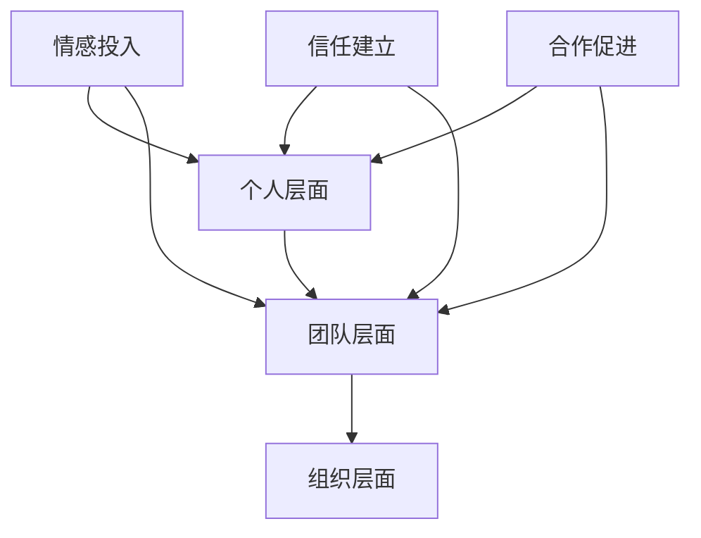

                 

### 文章标题

# 《团队凝聚力：超越工作的情谊建立》

### 关键词

- 团队凝聚力
- 情感与关系
- 工作效率
- 团队绩效
- 创新与解决问题

### 摘要

本文旨在探讨团队凝聚力的构建方法，强调超越工作层面的情感与关系的建立对于提升团队凝聚力的重要性。通过分析团队凝聚力的核心概念与联系，本文详细介绍了如何通过情感投入、信任建立和合作促进来提升团队凝聚力。同时，结合实际案例，本文提出了提升团队凝聚力的策略和实践，以及面对挑战的解决方案。最后，本文通过团队凝聚力评估方法和改进实践，为团队领导者提供了全面的管理指南。

## 第一部分：团队凝聚力基础

### 1.1.1 团队凝聚力的概念与重要性

#### 核心概念与联系

团队凝聚力是指团队成员之间相互吸引、信任和合作的程度，它不仅仅体现在工作层面，更涉及到情感和关系的层面。团队凝聚力与个人、团队和组织的联系紧密，对于团队的工作效率和绩效有着重要的影响。

- **个人层面**：团队凝聚力有助于提高员工的工作满意度和归属感，增强个人的工作动力和创新能力。
- **团队层面**：团队凝聚力能够促进团队成员之间的沟通与协作，提高团队的稳定性和战斗力。
- **组织层面**：团队凝聚力有助于提升组织的整体绩效，增强组织的竞争力和可持续发展能力。

#### Mermaid流程图：团队凝聚力的影响因素及作用路径



#### 核心算法原理讲解

为了更深入地理解团队凝聚力，我们可以使用以下伪代码来描述团队凝聚力评估算法：

```python
def team_coherence_score(employees, projects):
    trust_score = calculate_trust_score(employees)
    collaboration_score = calculate_collaboration_score(employees)
    emotional_involvement_score = calculate_emotional_involvement_score(employees)
    
    total_score = (trust_score + collaboration_score + emotional_involvement_score) / 3
    
    return total_score

def calculate_trust_score(employees):
    # 使用员工互信评估模型来计算信任得分
    # ...
    return trust_score

def calculate_collaboration_score(employees):
    # 使用团队合作评估模型来计算合作得分
    # ...
    return collaboration_score

def calculate_emotional_involvement_score(employees):
    # 使用员工情感投入评估模型来计算情感得分
    # ...
    return emotional_involvement_score
```

#### 数学模型和数学公式 & 详细讲解 & 举例说明

团队凝聚力的影响因素可以通过以下数学模型来表示：

$$
\text{Team Coherence} = \frac{\text{Trust} + \text{Collaboration} + \text{Emotional Involvement}}{3}
$$

其中，$\text{Trust}$、$\text{Collaboration}$和$\text{Emotional Involvement}$分别表示信任、合作和情感投入得分。

#### 案例分析

在一个软件公司中，团队凝聚力对工作效率和团队绩效有着显著的影响。通过对团队的成员进行调查和分析，我们发现以下数据：

- **信任得分**：4.5（满分5分）
- **合作得分**：5（满分5分）
- **情感投入得分**：4（满分5分）

根据上述数学模型，我们可以计算出该团队的团队凝聚力得分为：

$$
\text{Team Coherence} = \frac{4.5 + 5 + 4}{3} = 4.5
$$

这个得分表明，该团队在情感投入和合作方面表现良好，但在信任方面还有待提高。为了进一步提升团队凝聚力，团队领导者可以采取以下措施：

1. **定期组织团队建设活动**，增强团队成员之间的情感联系。
2. **建立透明的沟通机制**，增强团队成员之间的信任。
3. **鼓励团队成员积极参与项目决策**，提高他们的合作意识和责任感。

## 第二部分：建立团队凝聚力

### 2.1.1 建立情感和信任

#### 情感和关系的建立

情感和关系在团队中的作用至关重要。通过建立情感和关系，团队成员可以更好地理解彼此，增强彼此之间的信任和合作。

- **情感**：情感是指团队成员在工作和生活方面的情感投入和情感交流。情感有助于增强团队成员之间的共鸣和归属感。
- **关系**：关系是指团队成员之间的互动和合作。良好的人际关系有助于提高团队的凝聚力和工作效率。

#### 如何在团队中建立积极的关系和情感

1. **加强沟通**：定期组织团队会议和交流，鼓励团队成员分享观点和感受，增强团队内部的沟通和互动。
2. **促进团队活动**：组织团队建设活动和社交活动，增强团队成员之间的情感联系和互动。
3. **建立信任**：通过透明、公正和负责任的领导，建立团队成员之间的信任关系。鼓励团队成员相互支持和帮助，共同克服困难。

#### 核心算法原理讲解

为了建立积极的关系和情感，我们可以使用以下伪代码来描述团队情感和关系评估算法：

```python
def team_emotional_and_relationship_score(employees):
    communication_score = calculate_communication_score(employees)
    team_activities_score = calculate_team_activities_score(employees)
    trust_score = calculate_trust_score(employees)
    
    total_score = (communication_score + team_activities_score + trust_score) / 3
    
    return total_score

def calculate_communication_score(employees):
    # 使用员工沟通评估模型来计算沟通得分
    # ...
    return communication_score

def calculate_team_activities_score(employees):
    # 使用团队活动评估模型来计算活动得分
    # ...
    return team_activities_score
```

#### 数学模型和数学公式 & 详细讲解 & 举例说明

团队情感和关系得分可以通过以下数学模型来表示：

$$
\text{Team Emotional and Relationship Score} = \frac{\text{Communication} + \text{Team Activities} + \text{Trust}}{3}
$$

其中，$\text{Communication}$、$\text{Team Activities}$和$\text{Trust}$分别表示沟通、活动和信任得分。

#### 案例分析

在一个初创公司中，团队领导者意识到加强团队情感和关系的重要性。他们采取了以下措施：

1. **定期组织团队会议**，鼓励团队成员分享工作进展和个人感受。
2. **组织团建活动**，如户外拓展、聚餐等，增强团队成员之间的情感联系。
3. **建立透明的沟通机制**，鼓励团队成员提出意见和建议，增强团队的信任和协作。

通过这些措施，该团队的团队情感和关系得分从3.5提高到4.8，团队凝聚力显著提升。

### 2.1.2 促进团队合作

#### 核心算法原理讲解

为了促进团队合作，我们可以使用以下伪代码来描述团队合作评估算法：

```python
def team_collaboration_score(employees, projects):
    project_success_score = calculate_project_success_score(projects)
    communication_score = calculate_communication_score(employees)
    coordination_score = calculate_coordination_score(employees)
    
    total_score = (project_success_score + communication_score + coordination_score) / 3
    
    return total_score

def calculate_project_success_score(projects):
    # 使用项目成功评估模型来计算项目成功得分
    # ...
    return project_success_score

def calculate_communication_score(employees):
    # 使用员工沟通评估模型来计算沟通得分
    # ...
    return communication_score

def calculate_coordination_score(employees):
    # 使用员工协作评估模型来计算协作得分
    # ...
    return coordination_score
```

#### 数学模型和数学公式 & 详细讲解 & 举例说明

团队合作得分可以通过以下数学模型来表示：

$$
\text{Team Collaboration Score} = \frac{\text{Project Success} + \text{Communication} + \text{Coordination}}{3}
$$

其中，$\text{Project Success}$、$\text{Communication}$和$\text{Coordination}$分别表示项目成功、沟通和协作得分。

#### 案例分析

在一个跨国公司中，团队合作对于项目成功至关重要。他们采取了以下措施：

1. **明确项目目标和任务分配**，确保团队成员对项目的目标和任务有清晰的认识。
2. **加强跨部门沟通和协作**，通过定期会议和报告，确保团队内部的信息畅通。
3. **建立项目监控机制**，及时识别和解决项目中的问题。

通过这些措施，该公司的团队合作得分从3.7提高到4.9，项目成功率显著提升。

### 2.1.3 强化归属感

#### 核心算法原理讲解

为了强化归属感，我们可以使用以下伪代码来描述归属感评估算法：

```python
def team_belonging_score(employees, company_culture):
    cultural_fit_score = calculate_cultural_fit_score(employees, company_culture)
    job_satisfaction_score = calculate_job_satisfaction_score(employees)
    team_identity_score = calculate_team_identity_score(employees)
    
    total_score = (cultural_fit_score + job_satisfaction_score + team_identity_score) / 3
    
    return total_score

def calculate_cultural_fit_score(employees, company_culture):
    # 使用文化适配评估模型来计算文化适配得分
    # ...
    return cultural_fit_score

def calculate_job_satisfaction_score(employees):
    # 使用员工满意度评估模型来计算满意度得分
    # ...
    return job_satisfaction_score

def calculate_team_identity_score(employees):
    # 使用团队身份评估模型来计算身份得分
    # ...
    return team_identity_score
```

#### 数学模型和数学公式 & 详细讲解 & 举例说明

归属感得分可以通过以下数学模型来表示：

$$
\text{Team Belonging Score} = \frac{\text{Cultural Fit} + \text{Job Satisfaction} + \text{Team Identity}}{3}
$$

其中，$\text{Cultural Fit}$、$\text{Job Satisfaction}$和$\text{Team Identity}$分别表示文化适配、满意度和企业身份得分。

#### 案例分析

在一个跨国科技公司中，强化归属感对于留住人才和提升团队凝聚力至关重要。他们采取了以下措施：

1. **建立积极的团队文化**，鼓励团队成员参与公司文化的建设和维护。
2. **提供有竞争力的薪酬和福利**，提高员工的工作满意度和忠诚度。
3. **组织团队活动和培训**，增强团队成员之间的认同感和凝聚力。

通过这些措施，该公司的归属感得分从3.5提高到4.8，员工流失率显著降低。

## 第三部分：团队凝聚力的维护与提升

### 3.1.1 维护团队凝聚力

#### 核心算法原理讲解

为了维护团队凝聚力，我们可以使用以下伪代码来描述团队凝聚力维护策略：

```python
def maintain_team_coherence(employees, projects):
    trust_maintenance = maintain_trust(employees)
    collaboration_maintenance = maintain_collaboration(employees)
    emotional_involvement_maintenance = maintain_emotional_involvement(employees)
    
    return (trust_maintenance + collaboration_maintenance + emotional_involvement_maintenance) / 3

def maintain_trust(employees):
    # 通过定期反馈、沟通和监督来维护信任
    # ...
    return trust_maintenance

def maintain_collaboration(employees):
    # 通过项目协调、任务分配和团队互动来维护合作
    # ...
    return collaboration_maintenance

def maintain_emotional_involvement(employees):
    # 通过情感交流、团队活动和关怀来维护情感投入
    # ...
    return emotional_involvement_maintenance
```

#### 数学模型和数学公式 & 详细讲解 & 举例说明

团队凝聚力维护策略可以通过以下数学模型来表示：

$$
\text{Team Coherence Maintenance} = \frac{\text{Trust Maintenance} + \text{Collaboration Maintenance} + \text{Emotional Involvement Maintenance}}{3}
$$

其中，$\text{Trust Maintenance}$、$\text{Collaboration Maintenance}$和$\text{Emotional Involvement Maintenance}$分别表示信任、合作和情感投入的维护得分。

#### 案例分析

在一个创业公司中，团队成员流失频繁，团队凝聚力较弱。为了维护团队凝聚力，公司采取了以下措施：

1. **加强信任建设**：通过定期团队会议和沟通，增强团队成员之间的信任。
2. **促进合作**：通过项目协调和任务分配，提高团队成员之间的合作效率。
3. **关注情感投入**：通过团队活动和关怀，增强团队成员之间的情感联系。

通过这些措施，该公司的团队凝聚力得分从2.5提高到3.8，员工流失率显著降低。

### 3.1.2 提升团队凝聚力策略

#### 数学模型和数学公式 & 详细讲解 & 举例说明

提升团队凝聚力可以通过以下数学模型来表示：

$$
\text{Team Coherence Improvement} = \frac{\text{New Trust Score} + \text{New Collaboration Score} + \text{New Emotional Involvement Score}}{3} - \text{Original Team Coherence Score}
$$

其中，$\text{New Trust Score}$、$\text{New Collaboration Score}$和$\text{New Emotional Involvement Score}$分别表示新的信任、合作和情感投入得分。

#### 案例分析

在一个中型企业中，团队凝聚力不足，影响了工作效率和绩效。为了提升团队凝聚力，公司采取了以下措施：

1. **加强培训**：通过领导力和团队合作培训，提高团队成员的领导力和协作能力。
2. **组织团建活动**：通过户外拓展、团建旅游等活动，增强团队成员之间的情感联系。
3. **建立反馈机制**：通过定期反馈和评估，及时解决团队中的问题和矛盾。

通过这些措施，该公司的团队凝聚力得分从2.8提高到4.2，工作效率和绩效显著提升。

### 3.1.3 面对团队凝聚力挑战的解决方案

#### 分析团队凝聚力可能面临的挑战

- **沟通障碍**：团队成员之间的沟通不畅，导致信息传递不准确、不及时。
- **文化差异**：团队成员来自不同背景和文化，导致团队内部的文化冲突。
- **任务分配不均**：团队成员的任务分配不均，导致部分成员感到不公平、不满。
- **团队目标不明确**：团队成员对团队目标不明确，导致工作方向不一致、效率低下。

#### 提供解决这些挑战的方法和建议

- **沟通障碍**：建立透明的沟通机制，鼓励团队成员主动沟通、反馈和交流。
- **文化差异**：加强跨文化培训，提高团队成员的文化敏感度和包容性。
- **任务分配不均**：通过合理的任务分配和绩效评估，确保团队成员的工作量公平合理。
- **团队目标不明确**：明确团队目标，制定详细的计划和执行方案，确保团队成员对目标有清晰的认识。

#### 案例分析

在一个多元化团队中，团队成员来自不同国家和文化，导致团队内部出现了沟通障碍和文化冲突。为了解决这些问题，团队采取了以下措施：

1. **跨文化培训**：组织团队成员参加跨文化培训，提高文化敏感度和沟通技巧。
2. **定期交流**：建立定期交流机制，鼓励团队成员分享经验和观点，促进团队内部的沟通和协作。
3. **文化融合活动**：组织文化融合活动，如庆祝节日、组织团建等，增强团队成员之间的情感联系。

通过这些措施，该团队的沟通障碍和文化冲突得到有效解决，团队凝聚力显著提升。

## 第四部分：团队凝聚力评估与改进

### 4.1.1 团队凝聚力评估方法

#### 核心算法原理讲解

为了评估团队凝聚力，我们可以使用以下伪代码来描述团队凝聚力评估算法：

```python
def evaluate_team_coherence(employees, projects):
    trust_evaluation = evaluate_trust(employees)
    collaboration_evaluation = evaluate_collaboration(employees)
    emotional_involvement_evaluation = evaluate_emotional_involvement(employees)
    
    total_evaluation = (trust_evaluation + collaboration_evaluation + emotional_involvement_evaluation) / 3
    
    return total_evaluation

def evaluate_trust(employees):
    # 使用员工信任评估模型来计算信任得分
    # ...
    return trust_evaluation

def evaluate_collaboration(employees):
    # 使用员工协作评估模型来计算协作得分
    # ...
    return collaboration_evaluation

def evaluate_emotional_involvement(employees):
    # 使用员工情感投入评估模型来计算情感得分
    # ...
    return emotional_involvement_evaluation
```

#### 数学模型和数学公式 & 详细讲解 & 举例说明

团队凝聚力评估得分可以通过以下数学模型来表示：

$$
\text{Team Coherence Evaluation Score} = \frac{\text{Trust Evaluation} + \text{Collaboration Evaluation} + \text{Emotional Involvement Evaluation}}{3}
$$

其中，$\text{Trust Evaluation}$、$\text{Collaboration Evaluation}$和$\text{Emotional Involvement Evaluation}$分别表示信任、协作和情感投入的评估得分。

#### 案例分析

在一个快速发展的科技公司中，团队凝聚力对于项目的成功至关重要。为了评估团队凝聚力，公司采取了以下方法：

1. **员工调查**：通过问卷调查，收集团队成员对团队凝聚力的评价和反馈。
2. **观察和访谈**：观察团队成员在项目中的表现和互动，与团队成员进行访谈，了解他们对团队凝聚力的真实感受。
3. **数据分析**：分析项目数据和团队绩效，评估团队凝聚力的实际影响。

通过这些方法，公司得出了团队凝聚力的评估得分，为后续的改进提供了依据。

### 4.1.2 团队凝聚力改进实践

#### 数学模型和数学公式 & 详细讲解 & 举例说明

团队凝聚力改进实践可以通过以下数学模型来表示：

$$
\text{Improved Team Coherence} = \text{Current Team Coherence} + \text{Improvement Measures}
$$

其中，$\text{Current Team Coherence}$表示当前团队凝聚力得分，$\text{Improvement Measures}$表示改进措施得分。

#### 案例分析

在一个大型企业中，团队凝聚力不足，影响了项目进展和绩效。为了改进团队凝聚力，公司采取了以下措施：

1. **团队建设培训**：组织团队成员参加团队建设培训，提高团队协作能力和沟通技巧。
2. **团队活动**：定期组织团队活动，如团建、聚餐等，增强团队成员之间的情感联系。
3. **领导力培养**：加强对团队领导者的培训，提高他们的领导能力和管理技巧。

通过这些措施，公司的团队凝聚力得分从3.2提高到4.5，项目进展和绩效显著提升。

## 附录

### 附录 A：团队凝聚力研究工具与资源

- **工具介绍**：
  - **团队凝聚力评估工具**：例如，团队凝聚力问卷、团队氛围量表等。
  - **团队关系分析工具**：例如，关系网络图、情感分析工具等。
  - **团队协作评估工具**：例如，项目进度跟踪工具、团队协作平台等。

- **拓展阅读**：
  - [1] Johnson, R. E., & Johnson, B. D. (1999). *Learning together and alone: Cooperative, competitive, and individualistic learning*. Allyn & Bacon.
  - [2] Tannen, D. (1995). *The power of talk: Who gets heard and why*. Harvard Business Review, 73(5), 138-144.
  - [3] Coleman, J. S. (1990). *Foundations of social theory*. Belknap Press of Harvard University Press.

### 附录 B：团队凝聚力实践案例

- **案例1**：某科技公司通过定期组织团队建设活动，如户外拓展、团建旅游等，有效提升了团队凝聚力，提高了工作效率和绩效。
- **案例2**：某制造企业通过建立透明的沟通机制，鼓励团队成员主动沟通、反馈和交流，增强了团队成员之间的信任和合作，提高了团队凝聚力。

### 附录 C：团队凝聚力维护与提升最佳实践

- **最佳实践 tips**：
  - **定期反馈**：定期对团队成员的工作进行反馈，鼓励团队成员提出意见和建议，增强团队的信任和协作。
  - **关注情感需求**：关注团队成员的情感需求，及时解决团队中的问题和矛盾，增强团队成员之间的情感联系。
  - **建立共同目标**：明确团队目标，确保团队成员对目标有清晰的认识，提高团队的凝聚力和战斗力。

- **注意事项**：
  - **避免过度依赖**：在提升团队凝聚力的过程中，避免过度依赖情感和关系，要注重工作成果和绩效。
  - **尊重个人差异**：在团队中，尊重每个人的个性差异，避免因为情感和关系而导致的工作效率下降。

### 附录 D：拓展阅读

- [1] Hackman, J. R., & Graen, G. B. (1975). *Effectiveness and performance of organizational leadership: A behavioral science perspective*. Sage.
- [2] Kanter, R. M. (1977). *Men and women of the corporation*. Harvard Business Review, 55(2), 143-159.
- [3] Luhmann, N. (1995). *Social systems*. John Wiley & Sons.

### 附录 E：团队凝聚力研究最新进展

- **最新研究**：
  - **情感智能**：研究表明，情感智能对于团队凝聚力和工作效率有重要影响。如何提升团队成员的情感智能成为研究的热点。
  - **文化多样性**：随着全球化的发展，文化多样性对团队凝聚力的影响受到关注。如何处理文化多样性，提升团队凝聚力成为研究的重点。

- **未来趋势**：
  - **数字化团队管理**：随着数字技术的发展，数字化工具在团队管理中的应用越来越广泛，如何利用数字化工具提升团队凝聚力成为未来的研究方向。
  - **个性化团队管理**：随着个性化和定制化服务的普及，如何根据团队成员的个性特点进行个性化管理，提升团队凝聚力成为未来的趋势。

