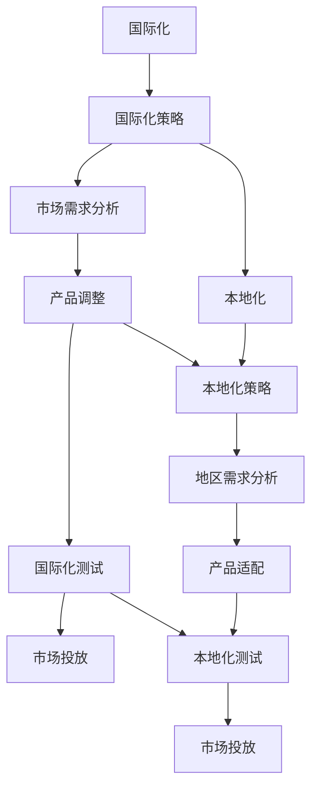
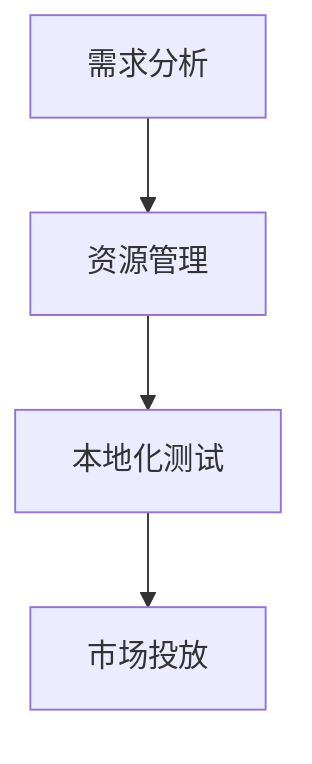
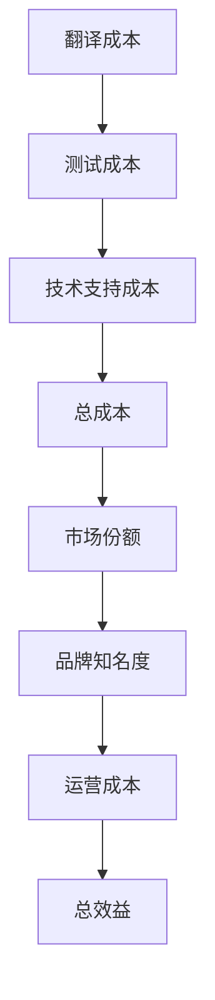
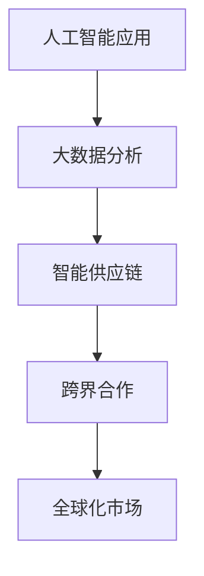

                 

### 文章标题

# 国际化与本地化：拓展全球市场的技术挑战

> 关键词：国际化、本地化、全球市场、技术挑战、多语言处理、文化差异

> 摘要：本文将探讨国际化与本地化在拓展全球市场的技术挑战。通过对国际化与本地化的基础概念、技术基础、流程方法、应用案例、技术挑战与解决方案、市场影响与策略以及最佳实践与未来趋势的详细分析，为企业和开发者提供全面的技术指导。

## 引言

在全球化浪潮的推动下，企业和开发者越来越重视国际化和本地化的重要性。国际化（Internationalization）与本地化（Localization）是拓展全球市场不可或缺的两个概念，它们共同构成了企业产品和服务全球化的重要技术基础。

国际化是指将产品或服务设计成能够适应多种语言和地区市场的过程。其核心目的是使产品或服务具备适应不同语言、文化和社会环境的能力，从而提高其国际市场竞争力。

本地化则是在国际化的基础上，针对特定地区市场的特点和需求，对产品或服务进行细化和适配的过程。本地化不仅要考虑语言文字的转换，还需关注文化差异、法规要求、用户习惯等多方面因素。

本文将从以下几个部分展开讨论：

1. **国际化与本地化的基础概念**：介绍国际化与本地化的定义、目的和重要性。
2. **国际化与本地化的技术基础**：探讨多语言处理、国际化标准和本地化工具等关键技术。
3. **国际化与本地化的流程与方法**：详细讨论国际化与本地化的流程和方法，包括需求分析、资源管理、本地化测试等。
4. **国际化与本地化的应用案例**：分析不同行业和领域的国际化与本地化实践。
5. **国际化与本地化的技术挑战与解决方案**：讨论国际化与本地化中可能遇到的技术挑战和解决方案。
6. **国际化与本地化对市场和业务的影响**：分析国际化与本地化对市场和业务的影响，包括成本、效益和市场策略。
7. **国际化与本地化的最佳实践与未来趋势**：总结最佳实践，预测国际化与本地化的未来发展趋势。

### 1. 国际化与本地化的基础概念

国际化与本地化是两个紧密相关的概念，但它们在目标和实施过程中有着明确的区别。

#### 1.1 国际化的定义

国际化是指企业将其产品或服务扩展到全球市场，使其能够适应不同国家和地区的文化和语言需求。国际化的核心目标是提高产品的全球市场竞争力，使其在多种语言和文化环境中都能被有效使用。

国际化不仅涉及语言转换，还包括文化适应、技术兼容性、法规遵守等多方面内容。通过国际化，企业可以降低市场进入壁垒，拓展全球市场份额。

#### 1.2 本地化的定义

本地化则是在国际化的基础上，针对特定地区市场的特点和需求，对产品或服务进行细化和适配。本地化的目标是确保产品或服务在目标市场中的可用性和接受度，使其更加符合当地用户的习惯和偏好。

本地化涉及的语言转换只是其中的一部分，更重要的是对文化、法律、习惯等方面的适应。例如，在食品行业中，不同地区的消费者对食品口味、包装、标签等有不同的要求。

#### 1.3 国际化与本地化的联系

国际化与本地化之间存在着密切的联系和互动。国际化是本地化的前提，只有先将产品或服务国际化，才能进行本地化适配。而本地化则是对国际化的补充和深化，通过本地化，企业可以更好地满足不同地区市场的需求，提高市场竞争力。

为了更好地理解国际化与本地化的关系，我们可以使用Mermaid流程图来展示这两个概念之间的流程和联系：



#### 1.4 国际化与本地化的目的与重要性

国际化和本地化对于企业拓展全球市场具有重要意义。

国际化可以为企业带来以下几个方面的好处：

1. **扩大市场份额**：通过国际化，企业可以将产品或服务推广到全球市场，从而提高市场份额和销售额。
2. **降低成本**：国际化可以降低企业在特定市场中的运营成本，提高运营效率。
3. **提高品牌知名度**：国际化可以帮助企业建立全球品牌形象，提高品牌知名度和认可度。

本地化则能够帮助企业更好地满足不同地区市场的需求，具体表现在：

1. **提升用户体验**：通过本地化，企业可以确保产品或服务在目标市场中的可用性和用户体验。
2. **提高市场接受度**：本地化使产品或服务更符合当地市场的文化和习惯，从而提高市场接受度和用户满意度。
3. **增强竞争力**：本地化可以帮助企业在竞争激烈的市场中脱颖而出，提高市场竞争力。

总之，国际化与本地化是企业在全球化背景下拓展市场的重要策略，通过有效实施这两项策略，企业可以更好地适应不同市场和用户需求，提高市场竞争力。

### 2. 国际化与本地化的技术基础

国际化与本地化的实现离不开一系列关键技术，包括多语言处理、国际化标准和本地化工具。这些技术为国际化与本地化提供了坚实的基础，使得产品和服务能够更好地适应不同地区和文化环境。

#### 2.1 多语言处理技术

多语言处理（Multilingual Processing）技术是国际化与本地化的核心组成部分。它包括自然语言处理（Natural Language Processing，NLP）、机器翻译（Machine Translation，MT）和语音识别（Speech Recognition）等多个方面。

**自然语言处理**：NLP是一种人工智能技术，用于理解和生成人类语言。在国际化与本地化过程中，NLP技术可以用于文本分析、语言理解、情感分析等任务，从而帮助企业和开发者更好地理解不同语言之间的差异和共性。

**机器翻译**：MT技术则是将一种语言翻译成另一种语言，使得跨语言交流变得更加便捷。随着深度学习技术的发展，MT的准确性逐渐提高，已经成为国际化与本地化的重要工具。

**语音识别**：语音识别技术可以将语音信号转换为文本，使得语音交互成为可能。这对于那些不熟悉键盘输入的用户来说，是一种便捷的交互方式。

以下是一个简单的多语言处理伪代码实现，展示了文本分析、机器翻译和语音识别的基本流程：

```python
def multilingual_processing(text, source_language, target_language):
    # 文本分析
    text_analysis = nlp_analysis(text, source_language)
    
    # 机器翻译
    translated_text = mt_translation(text_analysis, target_language)
    
    # 语音识别
    voice_text = speech_recognition(translated_text)
    
    return voice_text
```

#### 2.2 国际化标准

国际化标准（Internationalization Standards）是确保产品和服务在不同语言和文化环境中都能正常运行的重要规范。以下是一些常见的国际化标准：

**Unicode**：Unicode是一种字符编码标准，用于表示世界上所有语言的文本。它解决了不同语言之间的字符冲突问题，使得跨语言处理变得更加简单。

**I18N和L10N**：I18N（Internationalization）和L10N（Localization）是国际化与本地化的缩写。I18N涉及将产品或服务设计成能够适应多种语言和地区的通用形式，而L10N则是在I18N的基础上，针对特定地区进行细化和适配。

**W3C Internationalization Guidelines**：W3C（World Wide Web Consortium）发布的国际化指南为Web开发提供了详细的国际化最佳实践。这些指南涵盖了HTML、CSS和JavaScript等多个方面，帮助开发者构建国际化Web应用。

以下是一个国际化标准的伪代码实现，展示了如何在HTML中实现多语言支持：

```html
<!DOCTYPE html>
<html lang="en">
<head>
    <meta charset="UTF-8">
    <title>Internationalized Website</title>
</head>
<body>
    <h1> Welcome to Our Website </h1>
    <select name="language" id="language">
        <option value="en">English</option>
        <option value="fr">Français</option>
        <option value="es">Español</option>
    </select>
    <script>
        function changeLanguage() {
            var selectedLanguage = document.getElementById("language").value;
            // Load language-specific content based on the selectedLanguage
        }
    </script>
</body>
</html>
```

#### 2.3 本地化工具

本地化工具（Localization Tools）是国际化与本地化过程中不可或缺的辅助工具。这些工具可以帮助企业高效地处理多语言文本、管理翻译资源和进行本地化测试。

**翻译记忆系统（Translation Memory System，TMS）**：TMS是一种用于管理翻译资源的工具，它可以将已翻译的文本片段存储在数据库中，以便在未来的翻译任务中重复使用。这样不仅提高了翻译效率，还能保持翻译的一致性。

**本地化测试工具（Localization Testing Tools）**：本地化测试工具用于检测国际化产品在目标语言和文化环境中的正确性和可用性。这些工具可以自动识别和修复国际化产品中的错误，确保产品在本地化后的质量和用户体验。

以下是一个本地化工具的伪代码实现，展示了如何使用TMS进行翻译资源管理：

```python
class TranslationMemory:
    def __init__(self):
        self.translations = {}

    def add_translation(self, source_text, target_text):
        self.translations[source_text] = target_text

    def get_translation(self, source_text):
        return self.translations.get(source_text, None)
```

总之，国际化与本地化的技术基础是多语言处理、国际化标准和本地化工具。通过有效利用这些技术，企业可以更好地实现产品的国际化与本地化，拓展全球市场。

### 3. 国际化与本地化的流程与方法

国际化与本地化的成功实施离不开科学的流程和方法。本文将详细讨论国际化与本地化的需求分析、资源管理、本地化测试等关键流程，并结合伪代码和示例进行说明。

#### 3.1 需求分析

需求分析是国际化与本地化的第一步，它旨在确定产品或服务在不同地区的市场需求和用户习惯。以下是一个需求分析的过程：

1. **市场调研**：通过市场调研，了解目标市场的文化、语言、法规等背景信息，为后续的国际化与本地化提供依据。

2. **用户需求分析**：收集和分析目标用户的需求和偏好，了解他们在使用产品或服务时的体验和期望。

3. **需求文档编写**：将调研和分析结果编写成需求文档，明确国际化与本地化的具体要求和目标。

以下是一个需求分析伪代码实现：

```python
def market_research(target_region):
    # 收集目标市场的文化、语言、法规等信息
    return region_info

def user_request_analysis():
    # 收集用户需求和偏好
    return user_requests

def create_requirements_document(region_info, user_requests):
    # 编写需求文档
    return requirements_document
```

#### 3.2 资源管理

资源管理是国际化与本地化的核心环节，它包括语言资源、翻译资源和技术资源的管理。以下是一个资源管理的过程：

1. **语言资源规划**：根据需求分析的结果，规划所需的语言资源，包括语言种类、语言版本等。

2. **翻译资源管理**：使用翻译记忆系统（TMS）管理已翻译的文本资源，提高翻译效率。

3. **技术资源管理**：确保国际化与本地化所需的技术支持，如多语言处理工具、本地化测试工具等。

以下是一个资源管理伪代码实现：

```python
class LanguageResource:
    def __init__(self, language_list):
        self.language_list = language_list

def translation_memory_system():
    # 创建翻译记忆系统
    return tms

def technical_resources_management():
    # 确保技术支持
    return technical_resources
```

#### 3.3 本地化测试

本地化测试是确保国际化产品或服务在目标市场中的正确性和可用性的关键环节。以下是一个本地化测试的过程：

1. **功能测试**：测试产品或服务的功能是否在目标市场中正常运行，包括界面功能、数据兼容性等。

2. **美学测试**：测试产品或服务的界面、图标、字体等是否符合目标市场的审美标准。

3. **用户体验测试**：测试产品或服务的用户体验是否在目标市场中得到优化。

以下是一个本地化测试伪代码实现：

```python
def functional_test(product):
    # 测试产品功能
    return test_results

def aesthetic_test(product):
    # 测试产品美学
    return test_results

def user_experience_test(product):
    # 测试用户体验
    return test_results
```

#### 3.4 流程与方法总结

国际化与本地化的流程和方法包括需求分析、资源管理、本地化测试等环节。通过科学的流程和方法，企业可以确保产品或服务在不同市场中得到有效适配，提高市场竞争力。

以下是一个国际化与本地化流程的Mermaid流程图：



通过以上流程和方法的详细讨论，企业可以更好地实施国际化与本地化策略，拓展全球市场。

### 4. 国际化与本地化的应用案例

国际化与本地化在各个行业中都有广泛的应用，以下将分析几个典型行业的国际化与本地化实践。

#### 4.1 游戏

游戏行业是国际化与本地化的典范。由于游戏具有高度的文化依赖性，不同地区的玩家对游戏内容、界面设计、音效等有不同需求。以下是一个游戏国际化与本地化的案例：

**案例背景**：一款名为《英雄联盟》（League of Legends）的电子竞技游戏，在全球拥有庞大的玩家群体。为了满足不同地区的玩家需求，游戏开发商Riot Games进行了深入的国际化与本地化工作。

**国际化与本地化实践**：

1. **多语言支持**：游戏提供了多种语言选项，玩家可以根据自己的语言偏好选择游戏界面、游戏说明等。

2. **文化适应**：不同地区的游戏角色、地图和故事情节进行了本地化调整，以符合当地文化习惯。例如，在中国市场，游戏增加了与中华文化相关的元素，如中国风格的地图和英雄。

3. **本地化测试**：Riot Games通过全球测试团队，对游戏进行多语言和文化的测试，确保游戏在不同市场中都能正常运行。

**效果评估**：《英雄联盟》在全球多个市场取得了巨大成功，玩家满意度高，成为全球电子竞技的代表之一。

#### 4.2 电子商务

电子商务是另一个高度依赖国际化与本地化的行业。以下是一个电子商务平台的国际化与本地化案例：

**案例背景**：亚马逊（Amazon）是全球最大的电子商务平台之一，其国际化与本地化策略对其全球扩张至关重要。

**国际化与本地化实践**：

1. **多语言网站**：亚马逊提供了多种语言版本的网站，使得不同语言的用户都能轻松访问和使用。

2. **本地化支付方式**：亚马逊根据不同市场的支付习惯，提供了多样化的支付方式，如信用卡、电子钱包、银行转账等。

3. **物流配送**：亚马逊在全球设立了多个物流中心，实现了本地化的物流配送服务，提高了用户购物体验。

**效果评估**：通过有效的国际化与本地化策略，亚马逊成功进入了多个国际市场，销售额持续增长。

#### 4.3 金融科技

金融科技（FinTech）行业在国际化与本地化方面也有许多成功实践。以下是一个金融科技公司的案例：

**案例背景**：汇丰银行（HSBC）是一家全球领先的金融服务提供商，其金融科技平台在国际化与本地化方面进行了大量投入。

**国际化与本地化实践**：

1. **多货币交易**：汇丰银行支持多种货币的交易，使得全球客户可以方便地进行跨国支付和结算。

2. **本地化金融产品**：汇丰银行根据不同地区的金融监管要求和用户需求，开发了多样化的金融产品，如储蓄账户、信用卡、投资产品等。

3. **合规性管理**：汇丰银行在全球多个市场遵守当地的金融法规，确保其金融科技平台在不同市场中的合规性。

**效果评估**：通过国际化与本地化策略，汇丰银行在全球金融科技市场中保持了领先地位。

#### 4.4 总结

国际化与本地化在不同行业中的应用各有特点，但核心目标是一致的：提高产品或服务的全球市场竞争力。通过深入分析这些案例，企业可以借鉴成功经验，制定适合自己的国际化与本地化策略。

### 5. 国际化与本地化的技术挑战与解决方案

在国际化与本地化的过程中，企业会遇到一系列技术挑战。以下将讨论这些挑战，并提出相应的解决方案。

#### 5.1 跨语言翻译准确性

跨语言翻译准确性是国际化中面临的一个主要挑战。由于不同语言之间存在语法、词汇和语义的差异，翻译准确性往往难以保证。以下是一些解决方案：

**1. 机器翻译与人工翻译结合**：机器翻译（MT）虽然准确性有限，但可以大幅提高翻译效率。结合人工翻译，可以弥补机器翻译的不足，提高整体翻译质量。

伪代码实现：
```python
def combined_translation(source_text, target_language):
    # 使用机器翻译进行初步翻译
    machine_translated_text = mt_translation(source_text, target_language)
    
    # 进行人工翻译
    human_translated_text = human_translation(machine_translated_text, target_language)
    
    return human_translated_text
```

**2. 翻译记忆系统（TMS）**：TMS可以存储已翻译的文本片段，提高重复文本的翻译准确性。

伪代码实现：
```python
class TranslationMemory:
    def __init__(self):
        self.translations = {}

    def add_translation(self, source_text, target_text):
        self.translations[source_text] = target_text

    def get_translation(self, source_text):
        return self.translations.get(source_text, None)
```

**3. 机器翻译质量评估**：定期对机器翻译质量进行评估，根据评估结果调整和优化机器翻译模型。

伪代码实现：
```python
def mt_quality_evaluation(target_text, reference_text):
    # 计算翻译质量得分
    quality_score = calculate_quality_score(target_text, reference_text)
    
    # 根据质量得分调整机器翻译模型
    adjust_mt_model(quality_score)
```

#### 5.2 文化差异

文化差异是国际化与本地化中另一个重大挑战。不同地区的文化习俗、价值观和表达方式可能截然不同，导致产品和服务在本地化过程中需要做出相应调整。以下是一些解决方案：

**1. 文化调研**：在国际化与本地化前，进行深入的文化调研，了解目标市场的文化特点和用户习惯。

伪代码实现：
```python
def cultural_research(target_region):
    # 收集目标市场的文化信息
    return cultural_info
```

**2. 本地化团队**：组建本地化团队，包括语言专家、文化顾问和技术人员，确保产品和服务在不同市场中的文化适应性。

伪代码实现：
```python
class LocalizationTeam:
    def __init__(self, language_experts, cultural_advisors, tech_team):
        self.language_experts = language_experts
        self.cultural_advisors = cultural_advisors
        self.tech_team = tech_team
```

**3. 用户反馈**：通过用户反馈和测试，不断调整和优化产品或服务的文化适应性。

伪代码实现：
```python
def user_feedback_analysis(feedback):
    # 分析用户反馈
    adjusted_product = analyze_feedback(feedback)
    return adjusted_product
```

#### 5.3 技术兼容性

国际化与本地化要求产品或服务在不同技术平台上都能正常运行。技术兼容性成为国际化过程中的一大挑战。以下是一些解决方案：

**1. 技术平台调研**：在国际化前，了解目标市场的技术平台和用户偏好，确保产品兼容。

伪代码实现：
```python
def tech_platform_research(target_region):
    # 收集目标市场的技术平台信息
    return tech_platform_info
```

**2. 技术兼容性测试**：在国际化与本地化过程中，进行多平台兼容性测试，确保产品在不同技术平台上都能正常运行。

伪代码实现：
```python
def compatibility_test(product, platforms):
    # 测试产品在不同技术平台上的兼容性
    test_results = test_compatibility(product, platforms)
    return test_results
```

**3. 技术支持**：提供本地化技术支持，帮助用户解决技术问题，提高用户满意度。

伪代码实现：
```python
def technical_support(product, users):
    # 提供技术支持
    support_requests = handle_support_requests(product, users)
    return support_requests
```

通过以上解决方案，企业可以更好地应对国际化与本地化过程中的技术挑战，提高产品或服务的全球市场竞争力。

### 6. 国际化与本地化对市场和业务的影响

国际化与本地化不仅是技术问题，更是市场策略的重要组成部分。它们对市场和业务的影响深远，涉及到成本、效益和市场策略等方面。

#### 6.1 成本与效益分析

国际化与本地化涉及到一系列成本，包括翻译成本、测试成本、技术支持成本等。以下是对这些成本和效益的分析：

**成本分析**：

1. **翻译成本**：翻译是国际化过程中的主要成本之一，尤其是对于大型软件或内容。翻译成本取决于文本的复杂度和所需的语言数量。

2. **测试成本**：本地化测试需要投入大量时间和资源，包括功能测试、美学测试和用户体验测试等。测试成本与测试的细致程度和目标市场的数量有关。

3. **技术支持成本**：提供本地化技术支持需要雇佣多语言技术人员，这涉及到人力成本和培训成本。

**效益分析**：

1. **扩大市场份额**：通过国际化与本地化，企业可以将产品或服务推广到更多地区，从而扩大市场份额，提高销售额。

2. **提升品牌知名度**：国际化与本地化有助于提高品牌在全球市场的知名度和认可度，增强品牌形象。

3. **降低运营成本**：国际化与本地化可以提高生产效率，降低运营成本。例如，通过本地化测试，可以提前发现和修复产品缺陷，减少售后成本。

**成本与效益对比**：

通过合理的成本控制和有效的市场策略，国际化与本地化可以为企业带来显著的效益。以下是一个简化的成本与效益对比图表：



#### 6.2 市场策略

国际化与本地化需要企业制定有效的市场策略，以最大化市场收益。以下是一些关键的市场策略：

**1. 市场调研**：在进入新市场前，进行详细的市场调研，了解目标市场的文化、消费习惯、竞争态势等。

**2. 目标市场选择**：根据市场调研结果，选择最具潜力的目标市场。优先考虑市场规模、增长潜力、竞争环境等因素。

**3. 定位策略**：明确产品或服务的市场定位，根据目标市场的需求和偏好，制定相应的定位策略。

**4. 市场推广**：采用多样化的市场推广手段，如在线广告、社交媒体、合作伙伴关系等，提高产品在目标市场的知名度。

**5. 本地化营销**：针对不同市场，制定本地化的营销策略，包括广告语、促销活动、公关活动等。

**6. 客户服务**：提供本地化的客户服务，包括多语言支持、本地化技术支持等，提高客户满意度和忠诚度。

以下是一个国际化市场策略的伪代码实现：

```python
def market_strategy(target_market):
    # 进行市场调研
    market_survey = conduct_market_research(target_market)
    
    # 选择目标市场
    selected_markets = select_target_markets(market_survey)
    
    # 制定定位策略
    positioning_strategy = create_positioning_strategy(selected_markets)
    
    # 制定市场推广策略
    marketing_strategy = create_marketing_strategy(selected_markets)
    
    # 提供本地化客户服务
    customer_service = provide_localized_customer_service(selected_markets)
    
    return market_strategy
```

通过科学的市场策略，企业可以在国际化过程中实现成本效益最大化，提高市场竞争力。

### 7. 国际化与本地化的最佳实践与未来趋势

国际化与本地化是企业拓展全球市场的重要策略，其成功实施需要遵循一系列最佳实践和关注未来发展趋势。

#### 7.1 最佳实践

**1. 系统规划**：在国际化与本地化项目启动前，进行全面的系统规划，明确项目目标、资源需求和实施步骤。

**2. 多语言处理**：采用先进的机器翻译技术和自然语言处理工具，提高翻译准确性和效率。

**3. 文化适应**：重视文化差异，进行深入的文化调研，确保产品在本地化过程中符合目标市场的文化和价值观。

**4. 用户反馈**：收集并分析用户反馈，不断优化产品和服务，提高用户体验。

**5. 跨部门合作**：建立跨部门团队，包括技术、市场、销售和客户服务等部门，确保项目顺利进行。

以下是一个国际化与本地化最佳实践流程的伪代码实现：

```python
def best_practices_internationalization_localization():
    # 系统规划
    system_planning = conduct_system_planning()

    # 多语言处理
    multilingual_processing = apply_multilingual_techniques()

    # 文化适应
    cultural_adaptation = perform_cultural_research()

    # 用户反馈
    user_feedback = collect_and_analyze_user_feedback()

    # 跨部门合作
    cross_department_collaboration = establish_cross_department_teams()

    return best_practices
```

#### 7.2 未来趋势

国际化与本地化在未来将继续发展，以下是一些关键趋势：

**1. 人工智能应用**：人工智能将在国际化与本地化中发挥更大作用，如自动化翻译、自然语言处理和智能客服等。

**2. 大数据分析**：通过大数据分析，企业可以更准确地了解不同市场的需求和用户行为，优化国际化与本地化策略。

**3. 智能供应链**：智能供应链将实现全球市场的快速响应和高效运营，提高国际化产品的供应链效率。

**4. 跨界合作**：国际化与本地化将更加依赖跨界合作，如与本地企业、政府和行业协会的合作，提高市场进入速度。

以下是一个国际化与本地化未来趋势分析图：



通过遵循最佳实践和关注未来趋势，企业可以更好地实施国际化与本地化策略，提高全球市场竞争力。

### 结论

国际化与本地化是企业在全球市场中立于不败之地的关键策略。本文通过对国际化与本地化的基础概念、技术基础、流程方法、应用案例、技术挑战与解决方案、市场影响与策略以及最佳实践与未来趋势的详细分析，为企业和开发者提供了全面的技术指导。

国际化与本地化不仅涉及到语言和文化，还包括技术标准、资源管理和市场策略等方面。通过科学规划和有效实施，企业可以更好地适应全球市场的需求，提高产品竞争力，实现全球化扩张。

未来，随着人工智能和大数据技术的发展，国际化与本地化将变得更加智能和高效。企业应积极拥抱这些技术，不断提升自身国际化与本地化的能力，以应对全球市场的挑战和机遇。

最后，作者感谢读者对本文的关注，希望本文能为您的国际化与本地化实践提供有益的参考。

### 作者信息

作者：AI天才研究院/AI Genius Institute & 禅与计算机程序设计艺术 /Zen And The Art of Computer Programming

感谢您的阅读，希望本文对您的国际化与本地化实践有所帮助。让我们共同探索全球市场，开启新的篇章。🌍🚀💡

