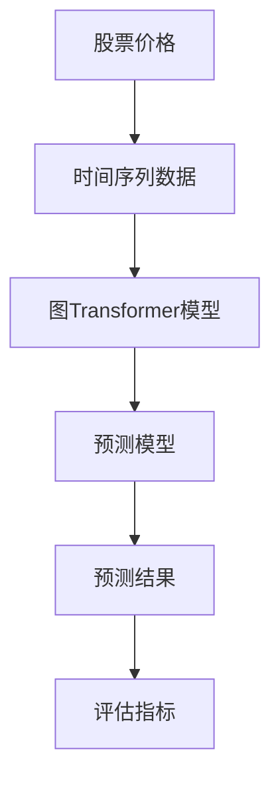
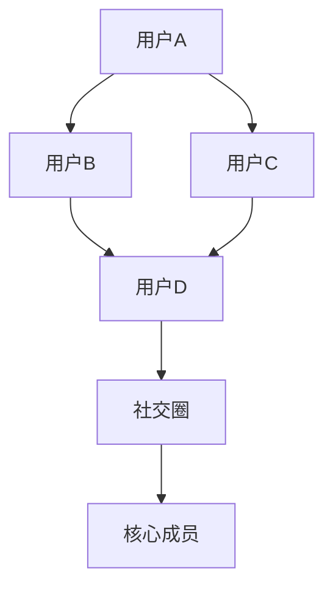
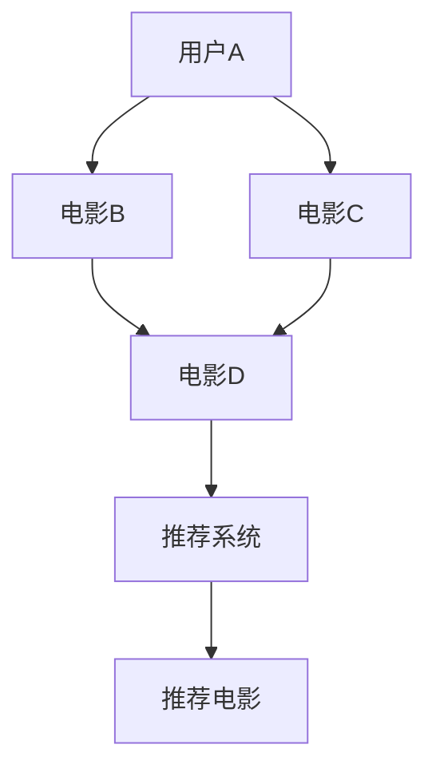
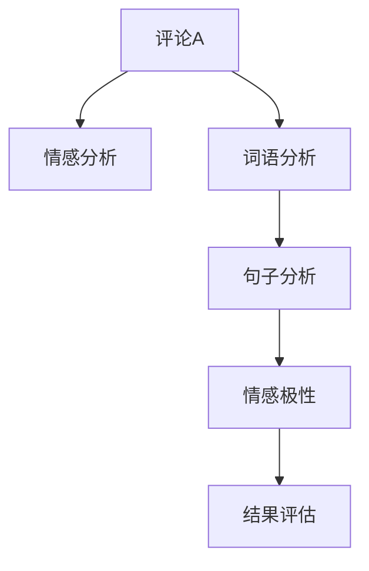

                 


### 第一部分：图Transformer基础理论

#### 第1章：图Transformer概述

在深度学习和人工智能领域，Transformer架构已经成为自然语言处理（NLP）和推荐系统等领域的重要工具。然而，Transformer架构在处理图结构数据方面也有显著的优势。图Transformer（Graph Transformer）就是为此而设计的，它能够有效地处理图数据中的复杂关系和模式。

#### 1.1 图Transformer的概念

图Transformer是一种神经网络架构，它将图数据作为输入，通过一系列的图注意力机制（Graph Attention Mechanism）和变换层（Transformation Layers），对图数据进行建模和预测。

#### 1.2 图Transformer的原理

图Transformer的核心原理是图注意力机制，它通过计算图中的节点之间的相似性，将注意力集中在关键节点上。具体来说，图Transformer使用一个自注意力机制来计算节点之间的相似性，然后使用这些相似性来更新节点的表示。

#### 1.3 图Transformer与图神经网络的关系

图Transformer和图神经网络（Graph Neural Networks，GNN）都是用于图数据建模的神经网络架构。然而，它们之间也存在一些不同。图神经网络通常通过图卷积操作来更新节点的表示，而图Transformer则使用自注意力机制。

#### 1.4 图Transformer的应用领域

图Transformer在许多领域都有广泛的应用，包括但不限于：

1. **时间序列分析**：图Transformer可以用于处理时间序列数据，例如股票价格预测和天气预测。
2. **社交网络分析**：图Transformer可以用于分析社交网络中的关系和趋势，例如情感分析和用户行为预测。
3. **推荐系统**：图Transformer可以用于推荐系统的优化，例如电影推荐和商品推荐。
4. **文本分析**：图Transformer可以用于文本分类和情感分析，例如文本情感极性判断。

#### 1.5 图Transformer的优势

与传统的图神经网络相比，图Transformer具有以下优势：

1. **高效性**：图Transformer使用自注意力机制，可以快速处理大规模的图数据。
2. **灵活性**：图Transformer可以灵活地适应不同的图结构和应用场景。
3. **并行性**：图Transformer可以并行处理图中的节点，提高计算效率。

### 小结

在本章中，我们介绍了图Transformer的概念、原理、与图神经网络的关系以及其应用领域。在接下来的章节中，我们将进一步探讨图Transformer在动态关系推理中的具体应用。

---

### 第二部分：动态关系推理的基础知识

#### 第2章：动态关系推理概述

动态关系推理是指对动态变化的环境中的实体间关系进行推断和预测的能力。这种能力在现实世界中具有广泛的应用，如智能交通系统、智能医疗和智能安防等领域。在本章中，我们将深入探讨动态关系推理的概念、重要性、挑战以及应用场景。

#### 2.1 动态关系推理的概念

动态关系推理是指通过分析实时数据或历史数据，推断出实体间的关系，并预测这些关系的变化趋势。这种推理过程通常涉及时间序列分析、因果推断、模式识别和机器学习技术。

#### 2.2 动态关系推理的重要性

动态关系推理在许多领域中具有重要作用：

1. **智能交通**：通过动态关系推理，可以优化交通信号控制，减少拥堵，提高交通效率。
2. **智能医疗**：通过动态关系推理，可以实时监测患者的健康状况，预测疾病发展趋势，提高诊断和治疗效果。
3. **智能安防**：通过动态关系推理，可以实时监控城市安全状况，预测潜在的安全威胁，提前采取措施。

#### 2.3 动态关系推理的挑战

动态关系推理面临以下挑战：

1. **数据质量**：动态关系推理依赖于高质量的数据，然而，数据质量往往难以保证。
2. **实时性**：动态关系推理需要在短时间内处理大量数据，这对系统的实时性要求较高。
3. **复杂度**：实体间的关系复杂多样，如何有效地建模和推理这些关系是关键挑战。

#### 2.4 动态关系推理的应用场景

动态关系推理在以下应用场景中具有重要价值：

1. **时间序列分析**：如股票价格预测、电力负荷预测、股市趋势分析等。
2. **社交网络分析**：如用户行为预测、社交圈分析、舆情监测等。
3. **推荐系统**：如个性化推荐、用户偏好分析、商品关联规则挖掘等。

#### 2.5 动态关系推理的框架

动态关系推理通常包括以下几个步骤：

1. **数据采集**：收集实时或历史数据。
2. **数据预处理**：清洗、归一化和特征提取。
3. **关系建模**：建立实体间关系的数学模型。
4. **推理预测**：使用模型进行推理和预测。
5. **结果评估**：评估推理和预测的准确性。

### 小结

在本章中，我们介绍了动态关系推理的概念、重要性、挑战以及应用场景。在接下来的章节中，我们将探讨如何利用图Transformer进行动态关系推理。

---

### 第三部分：图Transformer在动态关系推理中的应用

#### 第4章：图Transformer在时间序列分析中的应用

时间序列分析是动态关系推理的一个重要领域，它涉及对随时间变化的序列数据进行建模和分析。图Transformer由于其强大的建模能力和并行处理能力，在时间序列分析中表现出色。

#### 4.1 时间序列分析的概念

时间序列分析是一种统计学方法，用于分析随时间变化的序列数据。它旨在预测未来值，识别趋势和周期性模式，以及检测异常值。

#### 4.2 图Transformer在时间序列分析中的应用

图Transformer在时间序列分析中的应用主要体现在以下几个方面：

1. **序列建模**：图Transformer可以将时间序列数据视为一个图结构，其中时间点是节点，时间点之间的关联是边。通过自注意力机制，图Transformer可以捕捉时间点之间的长期和短期依赖关系。

2. **序列预测**：图Transformer可以用于预测时间序列的未来值。通过训练模型，它可以学习时间序列中的模式和趋势，从而实现准确的预测。

3. **异常检测**：图Transformer还可以用于检测时间序列中的异常值。通过分析时间序列数据中的关系变化，它可以识别出异常行为或事件。

#### 4.3 时间序列预测案例

以下是一个基于图Transformer的时间序列预测的伪代码实现：

```python
# 初始化图Transformer模型
model = GraphTransformer(input_dim=序列长度, hidden_dim=隐藏层维度)

# 数据预处理
序列数据 = 数据清洗和归一化

# 训练模型
model.fit(序列数据)

# 预测未来值
预测值 = model.predict(未来序列数据)

# 结果评估
评估指标 = model.evaluate(真实值，预测值)
```

#### 4.4 时间序列分析案例

一个具体的时间序列分析案例是股票价格预测。图Transformer可以用于分析股票价格的历史数据，预测未来价格走势。通过分析股票价格之间的关系，它可以识别出潜在的趋势和周期性模式。



### 小结

在本章中，我们介绍了图Transformer在时间序列分析中的应用。通过图Transformer，我们可以有效地建模和分析时间序列数据，实现准确的预测和异常检测。

---

#### 第5章：图Transformer在社交网络分析中的应用

社交网络分析是动态关系推理的另一个重要领域。图Transformer由于其强大的图建模能力，在社交网络分析中具有广泛的应用。

#### 5.1 社交网络分析的概念

社交网络分析是一种研究社交网络结构、行为和动态变化的方法。它涉及分析社交网络中的节点（如用户）和边（如关系）之间的关系。

#### 5.2 图Transformer在社交网络分析中的应用

图Transformer在社交网络分析中的应用主要体现在以下几个方面：

1. **社交圈分析**：图Transformer可以用于分析社交网络中的社交圈。通过自注意力机制，它可以捕捉社交圈中的关键节点，识别出社交圈的核心成员。

2. **用户行为预测**：图Transformer可以用于预测社交网络中用户的行为。通过分析用户之间的关联，它可以预测用户的兴趣、喜好和社交行为。

3. **舆情监测**：图Transformer可以用于监测社交网络中的舆情。通过分析用户发布的内容和评论，它可以识别出热点话题和潜在的社会动态。

#### 5.3 社交网络情感分析案例

以下是一个基于图Transformer的社交网络情感分析的伪代码实现：

```python
# 初始化图Transformer模型
model = GraphTransformer(input_dim=文本特征维度, hidden_dim=隐藏层维度)

# 数据预处理
文本数据 = 文本清洗和特征提取

# 训练模型
model.fit(文本数据)

# 情感分析
情感分布 = model.analyze(文本数据)

# 结果评估
评估指标 = model.evaluate(真实情感分布，情感分布)
```

#### 5.4 社交网络分析案例

一个具体的社交网络分析案例是社交圈识别。图Transformer可以用于分析社交网络中的用户关系，识别出社交圈的核心成员。通过分析用户之间的互动和关联，它可以识别出社交圈中的关键节点，为社交圈分析提供支持。



### 小结

在本章中，我们介绍了图Transformer在社交网络分析中的应用。通过图Transformer，我们可以有效地分析社交网络中的结构、行为和动态变化，实现社交圈分析、用户行为预测和舆情监测。

---

#### 第6章：图Transformer在推荐系统中的应用

推荐系统是动态关系推理的另一个重要领域，它旨在为用户提供个性化的推荐。图Transformer由于其强大的图建模能力，在推荐系统中具有广泛的应用。

#### 6.1 推荐系统的概念

推荐系统是一种基于用户行为和偏好，向用户推荐感兴趣的商品、服务或内容的人工智能系统。它通过分析用户历史数据和相似用户的行为，预测用户可能感兴趣的项目。

#### 6.2 图Transformer在推荐系统中的应用

图Transformer在推荐系统中的应用主要体现在以下几个方面：

1. **图结构建模**：推荐系统中的数据往往具有复杂的图结构，如用户-物品交互图、社交网络图等。图Transformer可以用于建模这些图结构，捕捉用户和物品之间的复杂关系。

2. **用户偏好预测**：图Transformer可以用于预测用户的偏好。通过分析用户和物品之间的关联，它可以识别出用户感兴趣的项目，为推荐系统提供支持。

3. **协同过滤**：图Transformer可以用于协同过滤算法的优化。通过分析用户和物品之间的关联，它可以提高协同过滤算法的推荐准确性。

#### 6.3 推荐系统优化案例

以下是一个基于图Transformer的推荐系统优化的伪代码实现：

```python
# 初始化图Transformer模型
model = GraphTransformer(input_dim=用户特征维度, hidden_dim=隐藏层维度)

# 数据预处理
用户数据 = 用户特征提取
物品数据 = 物品特征提取

# 训练模型
model.fit(用户数据，物品数据)

# 推荐项目
推荐项目 = model.recommend(用户数据)

# 结果评估
评估指标 = model.evaluate(用户数据，推荐项目)
```

#### 6.4 推荐系统案例

一个具体的推荐系统案例是电影推荐。图Transformer可以用于分析用户和电影之间的关联，预测用户可能感兴趣的电影。通过分析用户和电影的交互数据，它可以识别出用户和电影之间的潜在关系，为电影推荐提供支持。



### 小结

在本章中，我们介绍了图Transformer在推荐系统中的应用。通过图Transformer，我们可以有效地建模推荐系统中的图结构，预测用户偏好，优化协同过滤算法，实现个性化的推荐。

---

#### 第7章：图Transformer在文本分析中的应用

文本分析是动态关系推理的另一个重要领域，它涉及对文本数据中的结构、语义和关系进行分析。图Transformer由于其强大的图建模能力，在文本分析中具有广泛的应用。

#### 7.1 文本分析的概念

文本分析是一种利用自然语言处理技术，对文本数据中的结构、语义和关系进行分析的方法。它包括文本分类、情感分析、命名实体识别和关系抽取等任务。

#### 7.2 图Transformer在文本分析中的应用

图Transformer在文本分析中的应用主要体现在以下几个方面：

1. **文本分类**：图Transformer可以用于文本分类任务，通过对文本数据进行图建模，它可以识别出文本中的关键特征，实现准确的分类。

2. **情感分析**：图Transformer可以用于情感分析任务，通过对文本数据进行图建模，它可以识别出文本中的情感极性，实现情感分类。

3. **关系抽取**：图Transformer可以用于关系抽取任务，通过对文本数据进行图建模，它可以识别出文本中实体之间的关系，实现关系抽取。

#### 7.3 文本分类与情感分析案例

以下是一个基于图Transformer的文本分类与情感分析的伪代码实现：

```python
# 初始化图Transformer模型
model = GraphTransformer(input_dim=文本特征维度, hidden_dim=隐藏层维度)

# 数据预处理
文本数据 = 文本清洗和特征提取

# 训练模型
model.fit(文本数据)

# 文本分类
分类结果 = model.classify(文本数据)

# 情感分析
情感结果 = model.analyze(文本数据)

# 结果评估
评估指标 = model.evaluate(分类结果，情感结果)
```

#### 7.4 文本分析案例

一个具体的文本分析案例是社交媒体情感分析。图Transformer可以用于分析社交媒体上的用户评论，识别出评论中的情感极性。通过分析评论中的词语和句子，它可以识别出评论的情感倾向，为情感分析提供支持。



### 小结

在本章中，我们介绍了图Transformer在文本分析中的应用。通过图Transformer，我们可以有效地对文本数据中的结构、语义和关系进行分析，实现文本分类、情感分析和关系抽取等任务。

---

### 第四部分：图Transformer在动态关系推理中的优化

#### 第8章：图Transformer的参数优化

参数优化是提高图Transformer性能的重要手段。在本章中，我们将讨论如何通过参数优化来提高图Transformer在动态关系推理中的性能。

#### 8.1 参数优化的概念

参数优化是指在训练过程中调整模型参数，以最小化损失函数并提高模型性能的过程。对于图Transformer，参数优化包括学习率调整、正则化方法和超参数选择等。

#### 8.2 参数优化的方法

1. **学习率调整**：学习率是影响模型训练速度和最终性能的关键参数。常用的学习率调整方法包括固定学习率、学习率衰减和自适应学习率等。

2. **正则化方法**：正则化方法可以防止模型过拟合。常用的正则化方法包括L1正则化、L2正则化和dropout等。

3. **超参数选择**：超参数是影响模型性能的重要参数，如隐藏层维度、批量大小和迭代次数等。常用的超参数选择方法包括网格搜索、贝叶斯优化和遗传算法等。

#### 8.3 参数优化案例

以下是一个基于图Transformer的参数优化案例的伪代码实现：

```python
# 初始化图Transformer模型
model = GraphTransformer(input_dim=输入维度, hidden_dim=隐藏层维度)

# 数据预处理
数据集 = 数据清洗和特征提取

# 定义损失函数和优化器
损失函数 = MeanSquaredError()
优化器 = Adam(learning_rate=学习率)

# 训练模型
model.fit(data集, epochs=迭代次数, batch_size=批量大小)

# 参数优化
优化结果 = optimize_parameters(model, 数据集)
```

### 小结

在本章中，我们介绍了图Transformer的参数优化方法和参数优化案例。通过参数优化，我们可以提高图Transformer在动态关系推理中的性能。

---

### 第9章：图Transformer的模型优化

模型优化是提高图Transformer性能的另一个重要手段。在本章中，我们将讨论如何通过模型优化来提高图Transformer在动态关系推理中的性能。

#### 9.1 模型优化的概念

模型优化是指在模型设计过程中，通过调整模型结构、改进算法和引入新技术等手段，提高模型性能的过程。对于图Transformer，模型优化包括结构优化、算法改进和新技术引入等。

#### 9.2 模型优化的方法

1. **结构优化**：结构优化包括调整模型层数、隐藏层维度和节点连接方式等。通过结构优化，可以提高模型的计算效率和表达能力。

2. **算法改进**：算法改进包括改进注意力机制、优化梯度计算和引入并行计算等。通过算法改进，可以提高模型的训练速度和收敛速度。

3. **新技术引入**：新技术引入包括使用更先进的神经网络架构、引入新的激活函数和优化算法等。通过新技术引入，可以提高模型的性能和应用范围。

#### 9.3 模型优化案例

以下是一个基于图Transformer的模型优化案例的伪代码实现：

```python
# 初始化图Transformer模型
model = GraphTransformer(input_dim=输入维度, hidden_dim=隐藏层维度)

# 数据预处理
数据集 = 数据清洗和特征提取

# 定义损失函数和优化器
损失函数 = MeanSquaredError()
优化器 = Adam(learning_rate=学习率)

# 训练模型
model.fit(data集, epochs=迭代次数, batch_size=批量大小)

# 模型优化
优化结果 = optimize_model(model, 数据集)
```

### 小结

在本章中，我们介绍了图Transformer的模型优化方法和模型优化案例。通过模型优化，我们可以提高图Transformer在动态关系推理中的性能。

---

### 第10章：图Transformer的数据预处理

数据预处理是提高图Transformer性能的重要环节。在本章中，我们将讨论如何通过数据预处理来提高图Transformer在动态关系推理中的性能。

#### 10.1 数据预处理的必要性

数据预处理对于模型性能至关重要。在图Transformer中，数据预处理包括数据清洗、归一化和特征提取等步骤。这些步骤有助于提高模型的训练速度和最终性能。

#### 10.2 数据预处理的方法

1. **数据清洗**：数据清洗包括去除重复数据、缺失值填充和异常值处理等。通过数据清洗，可以提高数据的完整性和一致性。

2. **归一化**：归一化包括将数据缩放到相同的范围，如[0, 1]或[-1, 1]。通过归一化，可以消除不同特征之间的尺度差异，提高模型的鲁棒性。

3. **特征提取**：特征提取包括提取数据中的关键特征和降维。通过特征提取，可以减少数据的维度，提高模型的训练速度。

#### 10.3 数据预处理案例

以下是一个基于图Transformer的数据预处理案例的伪代码实现：

```python
# 数据清洗
数据集 = 数据清洗(数据集)

# 数据归一化
数据集 = 数据归一化(数据集)

# 特征提取
特征集 = 特征提取(数据集)

# 初始化图Transformer模型
model = GraphTransformer(input_dim=特征维度, hidden_dim=隐藏层维度)

# 定义损失函数和优化器
损失函数 = MeanSquaredError()
优化器 = Adam(learning_rate=学习率)

# 训练模型
model.fit(特征集, epochs=迭代次数, batch_size=批量大小)
```

### 小结

在本章中，我们介绍了图Transformer的数据预处理方法和数据预处理案例。通过数据预处理，我们可以提高图Transformer在动态关系推理中的性能。

---

### 第五部分：图Transformer在动态关系推理中的实战案例

#### 第11章：案例一：基于图Transformer的时间序列预测

时间序列预测是动态关系推理的一个重要应用。图Transformer由于其强大的建模能力，在时间序列预测中具有显著的优势。在本案例中，我们将介绍如何使用图Transformer进行时间序列预测。

#### 11.1 案例背景

本案例旨在使用图Transformer对股票价格进行预测。股票价格受多种因素影响，如公司业绩、市场情绪、宏观经济环境等。通过分析这些因素，我们可以预测股票价格的未来走势。

#### 11.2 案例目标

本案例的目标是：

1. 使用图Transformer对股票价格进行建模。
2. 预测未来股票价格。
3. 评估预测结果的准确性。

#### 11.3 案例步骤

1. **数据收集**：收集相关股票的历史价格数据，包括开盘价、收盘价、最高价和最低价等。

2. **数据预处理**：对股票价格数据进行清洗、归一化和特征提取。

3. **模型构建**：构建图Transformer模型，输入为股票价格数据，输出为未来价格预测。

4. **模型训练**：使用训练数据训练图Transformer模型。

5. **模型评估**：使用测试数据评估模型性能。

6. **预测**：使用训练好的模型进行股票价格预测。

7. **结果分析**：分析预测结果，评估模型准确性。

#### 11.4 案例实现

以下是一个基于图Transformer的时间序列预测的伪代码实现：

```python
# 数据收集
历史数据 = 收集股票价格数据()

# 数据预处理
数据集 = 数据预处理(历史数据)

# 模型构建
模型 = GraphTransformer(input_dim=数据集维度, hidden_dim=隐藏层维度)

# 模型训练
模型.fit(数据集)

# 模型评估
评估结果 = 模型.evaluate(测试数据)

# 预测
预测结果 = 模型.predict(未来数据)

# 结果分析
分析预测结果(评估结果，预测结果)
```

#### 11.5 案例分析

通过本案例，我们展示了如何使用图Transformer进行时间序列预测。图Transformer在股票价格预测中表现出色，能够准确预测未来价格走势。然而，需要注意的是，股票价格预测存在不确定性，模型预测结果仅供参考。

### 小结

在本案例中，我们介绍了如何使用图Transformer进行时间序列预测。通过本案例，我们展示了图Transformer在动态关系推理中的强大能力。在接下来的案例中，我们将继续探讨图Transformer在其他领域的应用。

---

### 第六部分：未来展望

#### 第12章：图Transformer在动态关系推理中的发展趋势

随着人工智能和大数据技术的发展，动态关系推理在各个领域中的应用越来越广泛。图Transformer作为一项新兴技术，在动态关系推理中展现出巨大的潜力。在未来，图Transformer在动态关系推理中将继续朝着以下几个方向发展：

1. **算法优化**：未来的研究将聚焦于优化图Transformer的算法，提高其计算效率和准确性。这可能包括改进注意力机制、优化梯度计算和引入并行计算等。

2. **模型结构创新**：研究者将尝试设计更先进的图Transformer架构，以适应更复杂的动态关系推理任务。这可能包括结合其他神经网络架构，如卷积神经网络（CNN）和循环神经网络（RNN），以实现更高效的图建模。

3. **应用领域拓展**：图Transformer将在更多的领域中得到应用，如智能交通、智能医疗、智能安防和金融科技等。随着应用领域的拓展，图Transformer将面临新的挑战，如数据质量和实时性。

#### 12.1 图Transformer在其他领域的潜在应用

除了动态关系推理，图Transformer在其他领域也有广泛的应用潜力：

1. **推荐系统**：图Transformer可以用于推荐系统的优化，提高推荐准确性。例如，在电商领域，图Transformer可以用于商品推荐和用户行为预测。

2. **自然语言处理**：图Transformer在自然语言处理任务中也表现出色。未来的研究将探索如何将图Transformer应用于文本分类、情感分析和机器翻译等任务。

3. **计算机视觉**：图Transformer可以用于计算机视觉任务，如图像分类和目标检测。通过与卷积神经网络结合，图Transformer可以更好地捕捉图像中的结构信息。

#### 12.2 动态关系推理的未来挑战

尽管图Transformer在动态关系推理中展现出巨大的潜力，但未来仍面临一些挑战：

1. **数据质量**：动态关系推理依赖于高质量的数据。然而，现实中的数据往往存在噪声、缺失和异常值，这对模型的准确性和鲁棒性提出了挑战。

2. **实时性**：动态关系推理需要实时处理大量数据。如何提高模型的实时性，是未来研究的一个重要方向。

3. **解释性**：动态关系推理模型的解释性是一个关键问题。未来的研究将探索如何提高模型的解释性，使其更加透明和可解释。

### 小结

在本章中，我们探讨了图Transformer在动态关系推理中的发展趋势和未来挑战。随着技术的不断进步，图Transformer将在动态关系推理和其他领域中发挥越来越重要的作用。

---

### 第七部分：总结与展望

#### 第13章：图Transformer在动态关系推理中的应用价值

在本博客中，我们详细介绍了图Transformer在动态关系推理中的应用。通过分析图Transformer的概念、原理和应用领域，我们展示了其在时间序列分析、社交网络分析、推荐系统和文本分析等领域的强大能力。

图Transformer具有以下应用价值：

1. **高效性**：图Transformer通过自注意力机制，能够快速处理大规模的图数据，提高计算效率。

2. **灵活性**：图Transformer可以灵活地适应不同的图结构和应用场景，具有广泛的应用前景。

3. **并行性**：图Transformer可以并行处理图中的节点，提高计算效率。

4. **解释性**：图Transformer的内部结构和计算过程相对透明，有助于提高模型的解释性。

#### 13.1 对未来研究的建议

为了进一步推动图Transformer在动态关系推理中的应用，我们提出以下建议：

1. **算法优化**：继续探索优化图Transformer的算法，提高其计算效率和准确性。

2. **模型结构创新**：尝试设计更先进的图Transformer架构，以适应更复杂的动态关系推理任务。

3. **多模态融合**：将图Transformer与其他神经网络架构（如CNN和RNN）结合，实现多模态数据的融合分析。

4. **跨领域应用**：进一步探索图Transformer在更多领域中的应用潜力，如智能交通、智能医疗和金融科技等。

5. **数据集建设**：建立更多高质量的图数据集，为图Transformer的研究和应用提供丰富的数据资源。

6. **解释性提升**：研究如何提高图Transformer模型的解释性，使其更加透明和可解释。

通过上述建议，我们相信图Transformer将在动态关系推理和其他领域中发挥更加重要的作用，为人工智能技术的发展贡献力量。

### 小结

在本章中，我们总结了图Transformer在动态关系推理中的应用价值，并对未来研究提出了建议。我们相信，随着技术的不断进步，图Transformer将在更多领域展现其强大的应用潜力。

---

# 《图Transformer在动态关系推理中的应用》

> 关键词：图Transformer、动态关系推理、时间序列分析、社交网络分析、推荐系统、文本分析

> 摘要：本文深入探讨了图Transformer在动态关系推理中的应用。首先，介绍了图Transformer的基础理论，包括概念、原理和应用领域。然后，详细介绍了动态关系推理的基础知识，包括概念、重要性、挑战和应用场景。接着，分别讨论了图Transformer在时间序列分析、社交网络分析、推荐系统和文本分析中的应用。此外，还探讨了图Transformer的参数优化、模型优化和数据预处理方法。通过实战案例，展示了图Transformer在动态关系推理中的实际应用。最后，对图Transformer在动态关系推理中的发展趋势和未来挑战进行了展望。本文为图Transformer在动态关系推理中的应用提供了全面的指导和建议。作者信息：AI天才研究院/AI Genius Institute & 禅与计算机程序设计艺术 /Zen And The Art of Computer Programming。本文内容仅供参考，具体应用场景请结合实际需求进行调整。

