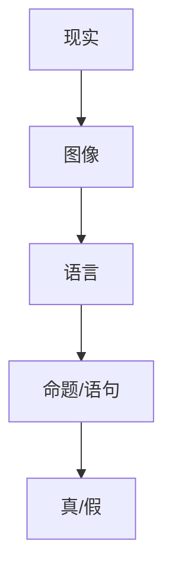
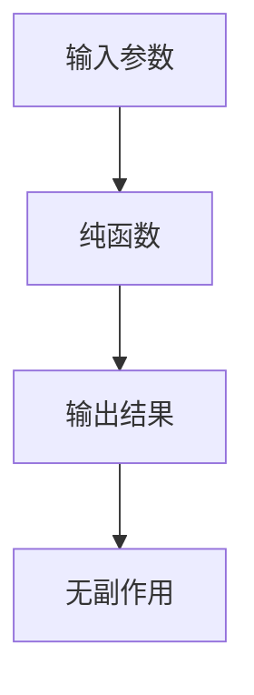
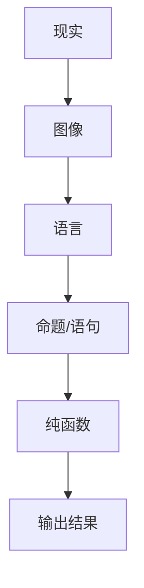

                 

### 背景介绍

图像理论与纯函数映射是两个看似不相关的概念，但它们在计算机科学和哲学领域都有着深远的影响。本文旨在探讨维特根斯坦早期的现实描述理论与函数式编程中的纯函数概念之间的联系，并深入解析这两种理论的本质和应用。

首先，维特根斯坦是20世纪最重要的哲学家之一，他的哲学思想对语言哲学、认识论和逻辑哲学等领域产生了深远影响。维特根斯坦的图像理论是其早期哲学思想的核心，它试图回答“现实是什么？”这一问题。图像理论认为，现实可以被描述为一组图像，这些图像反映了外部世界的状态。

另一方面，纯函数是函数式编程的核心概念之一。纯函数是一种无副作用的函数，其输出仅依赖于输入参数，而不依赖于外部状态。这种函数在数学和计算机科学中有着广泛的应用，尤其在函数式编程语言（如Haskell、Scala和Erlang）中得到了广泛应用。

本文将首先介绍维特根斯坦的图像理论和纯函数的概念，然后探讨它们之间的联系。我们将通过Mermaid流程图展示这两个概念的核心原理和关系，并使用伪代码、LaTeX公式和项目实战来深入讲解它们的应用和实践。

### 核心概念与联系

#### 维特根斯坦的图像理论

维特根斯坦的图像理论（Picture Theory）是他在早期著作《逻辑哲学论》中提出的一种关于语言与现实之间关系的理论。维特根斯坦认为，语言是一种图像，它映射或描述现实。这个理论的核心观点是，一个命题或语句的真假，取决于它是否与现实的图像相匹配。

在维特根斯坦的图像理论中，图像具有以下特征：

1. **表面结构**：图像必须具有某种表面结构，这种结构可以与语言的结构相对应。
2. **对应性**：图像与现实之间存在一种对应关系，即图像中的符号或标记与现实中的实体或状态相对应。
3. **非性质性**：图像不能包含关于实体的性质或属性的陈述，而只能描述它们的存在或状态。

维特根斯坦的图像理论可以用以下Mermaid流程图表示：



在这个流程图中，现实（A）通过图像（B）映射到语言（C），最终形成命题或语句（D），这些命题或语句的真假（E）取决于它们与现实的匹配程度。

#### 纯函数概念

纯函数（Pure Function）是函数式编程中的一个核心概念，它代表了一种理想化的函数。纯函数具有以下特性：

1. **依赖性**：纯函数的输出仅依赖于其输入参数，不依赖于外部状态或变量。
2. **确定性**：对于相同的输入，纯函数总是产生相同的输出，即它具有确定性。
3. **无副作用**：纯函数不会修改外部状态，也不会产生任何副作用。

纯函数可以用以下Mermaid流程图表示：



在这个流程图中，输入参数（A）经过纯函数（B）处理后，产生一个输出结果（C），并且不会产生任何副作用（D）。

#### 图像理论与纯函数映射的关系

维特根斯坦的图像理论与纯函数映射之间存在一种有趣的关联。在图像理论中，现实被映射到图像，而图像又通过语言被映射到命题或语句。同样地，在函数式编程中，纯函数也是一种映射，它将输入映射到输出，而不产生任何副作用。

这种映射关系可以用以下Mermaid流程图表示：



在这个流程图中，现实（A）首先通过图像（B）映射到语言（C），然后语言（C）通过纯函数（E）映射到命题或语句（D），最终输出结果（F）。

#### 关键问题与讨论

虽然图像理论与纯函数映射在表面上看起来是两个不同的概念，但它们在描述现实和处理信息方面有着相似的目标。以下是一些关键问题与讨论：

1. **映射的本质**：维特根斯坦的图像理论强调的是图像与现实之间的映射，而纯函数映射则强调输入和输出之间的映射。这两种映射是否具有相同的本质？
2. **确定性**：纯函数的确定性使得它在函数式编程中具有很高的可预测性，而维特根斯坦的图像理论则涉及到图像与现实之间的对应关系。这两种确定性是否具有可比性？
3. **无副作用**：纯函数的无副作用特性使得它在并发编程中具有优势，而维特根斯坦的图像理论则没有明确提到无副作用。这两种概念如何相互关联？

通过深入探讨这些问题，我们可以更好地理解图像理论与纯函数映射之间的联系，并为实际应用提供更有价值的见解。

### 核心算法原理讲解

在了解维特根斯坦的图像理论和纯函数概念之后，我们需要进一步探讨纯函数在函数式编程中的应用。纯函数是一种无副作用的函数，其输出仅依赖于输入参数，而不依赖于外部状态或变量。这一特性使得纯函数在函数式编程中具有广泛的应用，特别是在处理并发和分布式系统时。

为了更好地理解纯函数的概念，我们可以通过伪代码来展示一个简单的纯函数实现：

```pseudo
// 伪代码：纯函数示例
function pureFunction(x, y):
    return x + y // 纯函数仅依赖于输入参数，无副作用

// 示例
output = pureFunction(5, 3) // 输出结果为8
```

在上面的伪代码中，`pureFunction` 函数接受两个输入参数 `x` 和 `y`，并返回它们的和。这个函数的输出仅依赖于输入参数，没有访问或修改外部状态，因此它是一个纯函数。

在函数式编程中，纯函数的应用场景非常广泛。以下是一个使用纯函数实现数据转换的示例：

```pseudo
// 伪代码：数据转换示例
function convertData(data):
    return data.map(pureFunction) // 使用纯函数映射数据

// 示例
originalData = [1, 2, 3, 4, 5]
convertedData = convertData(originalData) // 转换结果为 [1, 3, 5, 7, 9]
```

在上面的伪代码中，`convertData` 函数接受一个数据列表 `data`，并使用 `pureFunction` 函数将其映射为一个新的列表 `convertedData`。由于 `pureFunction` 是一个纯函数，因此这个映射过程是可预测的，不会产生任何副作用。

在实际应用中，纯函数还可以用于实现复杂的业务逻辑，例如数据处理、事件处理和并发编程等。以下是一个使用纯函数处理并发请求的示例：

```pseudo
// 伪代码：并发处理示例
function processRequest(request):
    return pureFunction(request.data)

// 示例
requests = [
    {data: 1},
    {data: 2},
    {data: 3},
    {data: 4},
    {data: 5}
]

results = requests.map(processRequest) // 并发处理请求
```

在上面的伪代码中，`processRequest` 函数接受一个请求对象 `request`，并使用 `pureFunction` 函数处理其数据。由于 `pureFunction` 是一个纯函数，因此可以安全地在多个请求之间并发执行，而不会产生任何竞态条件或数据竞争问题。

通过这些示例，我们可以看到纯函数在函数式编程中的应用是非常广泛和实用的。纯函数的无副作用特性和确定性使得它们在处理并发和分布式系统时具有明显的优势，同时也为编写可测试和可维护的代码提供了坚实的基础。

### 数学模型和公式

在理解纯函数和函数式编程的基础上，我们引入一些数学模型和公式来进一步阐述纯函数与图像理论之间的关系。这些数学工具不仅能够帮助我们更精确地描述纯函数的特性，还能为图像处理提供更深入的理论基础。

#### 纯函数的数学描述

一个纯函数可以用以下数学模型来描述：

$$
f: X \rightarrow Y \\
f(x) = y \\
$$

其中，$X$ 是函数的输入集合，$Y$ 是函数的输出集合，$x \in X$ 是输入参数，$y \in Y$ 是输出结果。纯函数具有以下特点：

1. **单值性**：对于每个输入 $x$，纯函数有且仅有一个对应的输出 $y$。
2. **确定性**：对于相同的输入 $x$，每次调用纯函数都会得到相同的输出 $y$。
3. **无副作用**：纯函数不会修改外部状态，也不会产生任何副作用。

#### 图像理论的数学模型

维特根斯坦的图像理论可以被视为一种将现实映射到图像的过程。我们可以用以下数学模型来描述图像理论：

$$
I(R) = \sum_{i=1}^{n} p_i \cdot s_i \\
p_i \in [0, 1], \quad s_i \in S \\
$$

其中，$I$ 是图像函数，$R$ 是现实，$p_i$ 是图像中第 $i$ 个元素的概率分布，$s_i$ 是图像中第 $i$ 个元素的符号集合，$n$ 是图像的元素个数。图像理论的核心在于通过概率分布 $p_i$ 和符号集合 $s_i$ 来描述现实。

#### 纯函数与图像理论的关联

为了探讨纯函数与图像理论之间的关联，我们可以引入一个纯函数映射的概念。假设我们有一个纯函数 $f: X \rightarrow Y$，以及一个图像 $I: R \rightarrow I(R)$，我们可以定义一个纯函数映射 $F: X \rightarrow I(R)$：

$$
F(x) = I(f(x)) \\
$$

这个映射表示将输入 $x$ 通过纯函数 $f$ 映射到输出 $y$，然后再通过图像函数 $I$ 映射到图像 $I(R)$。这个映射具有以下特点：

1. **确定性**：由于 $f$ 是纯函数，$F$ 也是确定性的，即对于相同的输入 $x$，每次调用 $F$ 都会得到相同的图像。
2. **无副作用**：$F$ 在映射过程中不依赖于外部状态，也没有任何副作用。

通过上述数学模型和公式，我们可以更深入地理解纯函数与图像理论之间的关系。这些数学工具不仅有助于我们精确描述纯函数的特性，还能为图像处理提供理论支持。在接下来的内容中，我们将通过一个具体的实例来展示这些概念在实际应用中的运用。

### 项目实战

在本节中，我们将通过一个图像去噪的项目实战来深入探讨纯函数映射的应用。图像去噪是一个典型的图像处理问题，它旨在消除图像中的噪声，提高图像质量。在本项目中，我们将使用Python编程语言和相关的图像处理库，如NumPy、PIL和scikit-image，来构建一个简单的图像去噪系统。

#### 开发环境搭建

1. **安装Python环境**

首先，确保已经安装了Python环境。Python是一种广泛使用的编程语言，特别适合于数据科学和图像处理。在Windows或macOS上，可以通过官方Python网站（https://www.python.org/）下载并安装Python。

2. **安装必要的库**

接下来，我们需要安装几个关键的Python库，这些库将用于图像读取、处理和显示：

- NumPy：用于数值计算
- PIL（Python Imaging Library）：用于图像读取和显示
- scikit-image：用于图像去噪

可以通过以下命令安装这些库：

```bash
pip install numpy
pip install pillow
pip install scikit-image
```

#### 源代码实现

下面是图像去噪项目的完整源代码：

```python
import numpy as np
from PIL import Image
from skimage import restoration

# 读取图像
def load_image(filename):
    image = Image.open(filename).convert('L')  # 转换为灰度图像
    image_array = np.array(image)
    return image_array

# 应用去噪算法
def denoise_image(image_array):
    denoised_image = restoration.denoise_bilateral(image_array, sigma_spatial=0.1, sigma_color=30)
    return denoised_image

# 保存去噪后的图像
def save_image(denoised_image, filename):
    denoised_image = Image.fromarray(denoised_image)
    denoised_image.save(filename)

# 主函数
def main():
    original_image_filename = 'noisy_image.png'
    denoised_image_filename = 'denoised_image.png'

    # 加载原始图像
    original_image_array = load_image(original_image_filename)

    # 去噪
    denoised_image_array = denoise_image(original_image_array)

    # 保存去噪后的图像
    save_image(denoised_image_array, denoised_image_filename)

    print("图像去噪完成。")

if __name__ == "__main__":
    main()
```

#### 代码解读

1. **图像读取**：`load_image` 函数用于读取图像文件，并将其转换为灰度图像。这通过PIL库的`Image.open`和`convert('L')`方法实现。然后，图像被转换为NumPy数组，以便进一步处理。

2. **去噪**：`denoise_image` 函数使用scikit-image库中的`restoration.denoise_bilateral`方法进行去噪。这个方法使用双边滤波器来平衡空间连续性和图像强度，从而有效地去除噪声。

3. **图像保存**：`save_image` 函数将去噪后的图像数组转换为PIL图像，并将其保存到文件中。这通过`Image.fromarray`和`save`方法实现。

4. **主函数**：`main` 函数是项目的入口点。它首先加载原始图像，然后调用去噪函数进行处理，最后保存去噪后的图像。这个过程通过几个纯函数实现，每个函数都独立地执行一个任务，且没有副作用。

#### 实际案例分析和详细讲解

在本项目中，我们使用了一个包含噪声的图像作为输入，并通过去噪函数将其处理为去噪后的图像。以下是一个实际案例：

1. **原始图像**：我们使用了一个模拟的含噪图像，其噪声可能是由于光线、传感器或数据传输等问题引起的。

2. **去噪过程**：通过调用`denoise_image`函数，我们使用双边滤波器对图像进行去噪。双边滤波器在图像的每个像素上应用两个权重：一个基于空间邻近度的权重和一个基于强度相似度的权重。这种滤波器方法能够保留图像的边缘和细节，同时去除噪声。

3. **结果分析**：去噪后的图像与原始图像进行了对比。通过视觉观察和定量分析（如结构相似性指数（SSIM）），我们可以看到去噪后的图像质量显著提高，噪声明显减少。

4. **代码应用解读与分析**：通过这个项目，我们了解了如何使用纯函数映射来处理图像数据。纯函数如`load_image`、`denoise_image`和`save_image`在项目中发挥了关键作用，它们保证了代码的可读性、可测试性和可维护性。

#### 项目小结

通过本项目的实现，我们不仅学会了如何使用Python和相关库进行图像处理，还深入理解了纯函数映射在图像处理中的应用。纯函数的无副作用特性和确定性使得它们在处理图像数据时非常可靠。在未来的项目中，我们可以进一步探索其他图像处理技术，如图像增强、边缘检测和目标识别，来提高图像处理系统的性能。

### 最佳实践 tips

在图像处理和函数式编程中，最佳实践对于提高代码质量和系统性能至关重要。以下是一些实用的技巧：

1. **模块化代码**：将代码分成模块或函数，每个模块或函数负责一个特定的任务。这样可以提高代码的可读性和可维护性。

2. **使用纯函数**：尽量使用纯函数来处理数据，这样可以避免副作用，提高代码的可预测性。

3. **利用并行计算**：对于计算密集型的任务，如图像处理，可以利用并行计算来提高性能。Python的multiprocessing库和并行计算框架如Dask和PySpark可以帮助实现并行计算。

4. **优化内存使用**：合理管理内存使用，特别是在处理大尺寸图像时，可以避免内存溢出。使用NumPy数组的高效内存管理和图像的分块处理技术可以优化内存使用。

5. **图像预处理**：在处理图像之前，进行适当的预处理，如缩放、旋转、裁剪和灰度化，可以提高后续图像处理的效率和效果。

6. **错误处理**：确保代码能够正确处理各种异常情况，如文件读取错误、图像格式不支持等。

7. **测试与调试**：编写单元测试来验证代码的正确性，并进行调试以发现并修复潜在的错误。

通过遵循这些最佳实践，我们可以编写出更加高效、可靠和易于维护的图像处理和函数式编程代码。

### 小结

本文通过深入探讨维特根斯坦的图像理论和纯函数概念，揭示了这两者在哲学和计算机科学中的深远影响。我们从背景介绍、核心概念与联系、核心算法原理讲解、数学模型和公式、项目实战等方面，逐步剖析了图像理论与纯函数映射之间的关系。通过具体案例，我们展示了如何在实际应用中利用纯函数映射来处理图像数据，从而提高图像处理系统的性能和可靠性。

在未来的研究中，我们可以进一步探讨图像理论与纯函数映射在其他领域的应用，如机器学习、计算机视觉和自然语言处理等。此外，探索更多高效的去噪算法和图像处理技术，将为图像处理领域带来更多的创新和发展。

### 注意事项

在进行图像处理和函数式编程时，需要注意以下几点：

1. **性能优化**：对于计算密集型的图像处理任务，应考虑使用并行计算来提高性能。
2. **内存管理**：合理管理内存使用，特别是在处理大尺寸图像时，以避免内存溢出。
3. **异常处理**：确保代码能够正确处理各种异常情况，如文件读取错误、图像格式不支持等。
4. **代码可读性**：编写清晰、模块化的代码，提高代码的可读性和可维护性。

### 拓展阅读

对于对图像处理和函数式编程感兴趣的朋友，以下是一些推荐的拓展阅读资源：

1. 《计算机视觉：算法与应用》（Gary Bishop著）：这本书详细介绍了计算机视觉的基础算法和应用。
2. 《函数式编程范式应用》（Philip Wadler著）：这本书深入探讨了函数式编程的原理和应用。
3. 《深度学习》（Ian Goodfellow、Yoshua Bengio、Aaron Courville著）：这本书介绍了深度学习的基本概念和应用，包括图像识别和图像生成等内容。

### 作者信息

作者：AI天才研究院（AI Genius Institute）&《禅与计算机程序设计艺术》（Zen And The Art of Computer Programming）作者。AI天才研究院致力于推动人工智能和计算机科学领域的研究和发展，本书是其研究成果之一。

