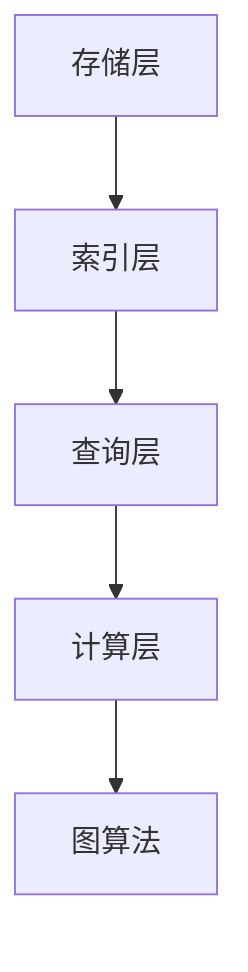
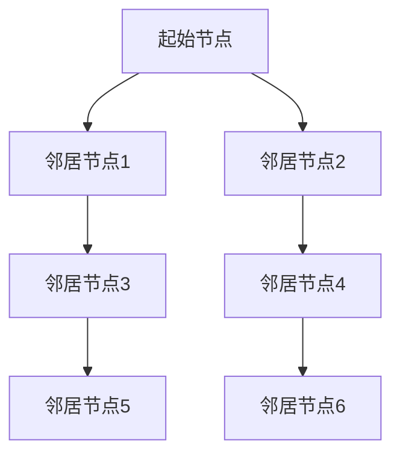
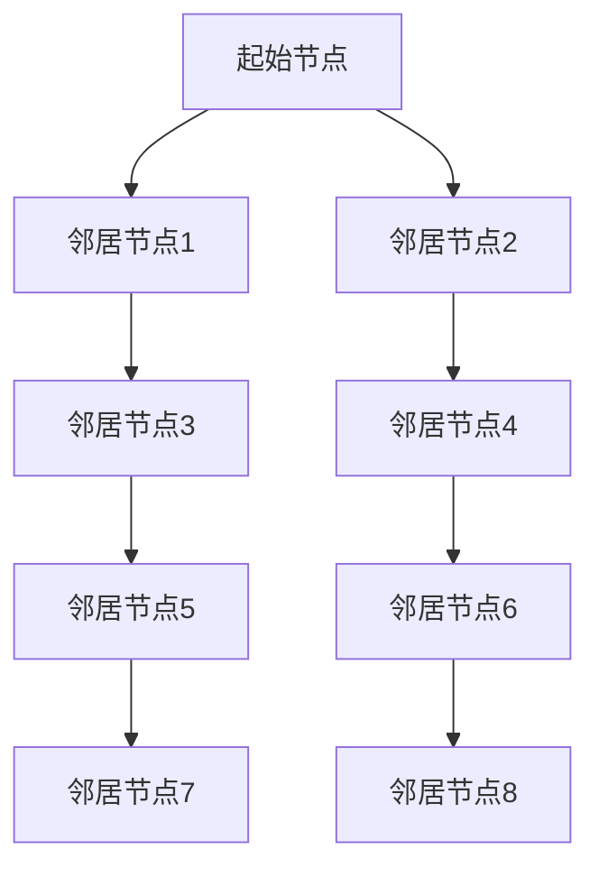
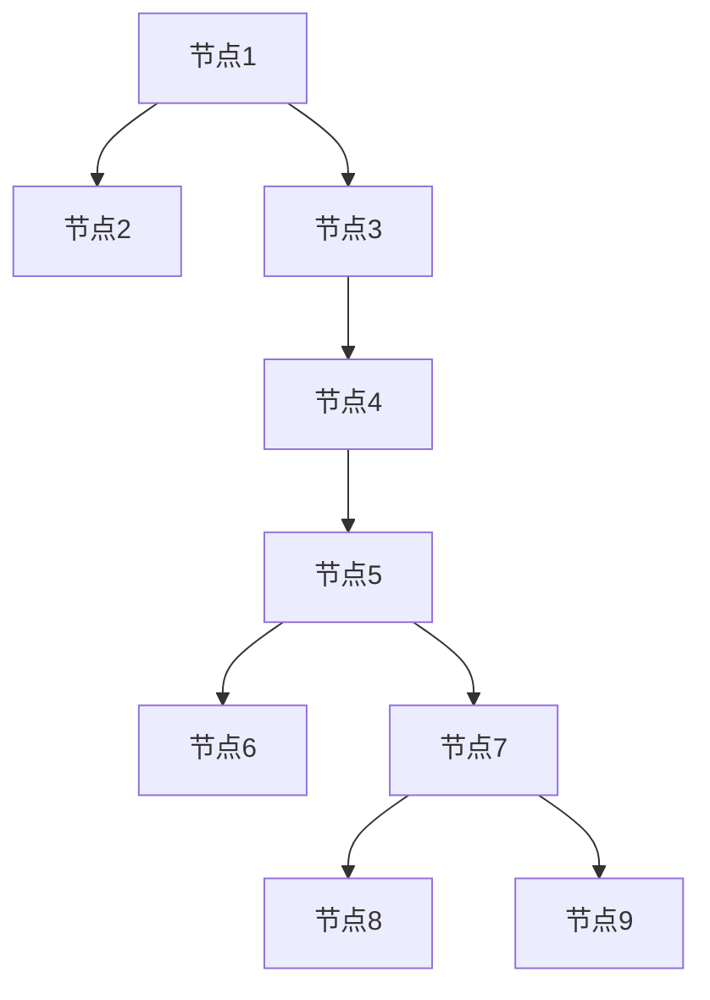
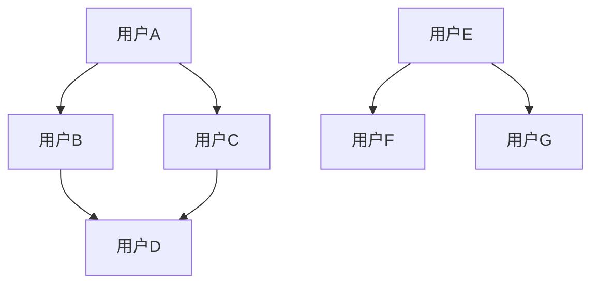

                 

### 文章标题

# 图数据库应用场景与实践

### 关键词

- 图数据库
- 应用场景
- 实践指南
- 图算法
- 社交网络
- 金融
- 物流

### 摘要

本文深入探讨了图数据库的应用场景与实践。首先，我们回顾了图数据库的基本概念和原理，包括图数据库的架构、图算法、数学模型和数据模型。接着，我们详细分析了图数据库在金融、物流和社交网络等领域的应用，通过实际案例展示了图数据库的强大功能。最后，我们提供了搭建图数据库环境、数据导入和查询优化的实践指南，为读者提供了从理论到实践的全面了解。

### 引言

图数据库作为一种新兴的数据存储和处理技术，在近年来逐渐受到了广泛的关注。它通过图形结构来表示和存储数据，能够有效地处理复杂的实体关系和互联关系。相比传统的数据库，如关系型数据库和文档型数据库，图数据库在处理高度互联的数据时具有显著的优势。本文将围绕图数据库的应用场景和实践进行探讨，旨在为读者提供一个全面且深入的了解。

### 目录

1. **基础理论**
   - **1.1 图数据库概述**
     - 图数据库的基本概念
     - 图数据库与关系型数据库的区别
     - 图数据库的关键特性
   - **1.2 图数据库的发展历史**
     - 图数据库的起源
     - 主流图数据库的发展历程
     - 当前图数据库的技术趋势
   - **1.3 图数据库的架构与原理**
     - 图数据库的内部架构
     - 图算法与图操作
     - Mermaid流程图：图数据库的架构示意
   - **1.4 图算法原理**
     - 图遍历算法
     - 图社区检测算法
     - 图嵌入算法
   - **1.5 图数据库数学模型**
     - 图论基本数学公式
     - 路径长度与距离
     - 最短路径算法
   - **1.6 图数据库的数据模型**
     - 图的数据表示
     - 图的存储结构
     - 存储结构的比较

2. **应用场景**
   - **2.1 金融领域应用**
     - 信用风险评估
     - 投资组合优化
   - **2.2 物流与供应链**
     - 物流网络优化
     - 供应链管理
   - **2.3 社交网络分析**
     - 用户关系网络分析
     - 社交网络分析案例

3. **实践指南**
   - **3.1 搭建环境**
     - 环境准备
     - 数据库安装
   - **3.2 数据导入**
     - 数据准备
     - 数据导入方法
   - **3.3 查询优化**
     - 查询语句优化
     - 性能调优
   - **3.4 项目实战**
     - 开发环境搭建
     - 源代码实现与解读
     - 代码应用解读与分析
     - 实际案例分析与讲解
     - 项目小结

### 第一部分：基础理论

#### 1.1 图数据库概述

**图数据库的基本概念**

图数据库是一种用于存储和查询图结构数据的数据库系统。在图数据库中，数据以图的形式存储，其中每个节点表示实体，每条边表示实体之间的关系。图数据库通过这种图形结构来表示和存储复杂的关系网络，能够有效地处理高度互联的数据。

**图数据库与关系型数据库的区别**

与关系型数据库相比，图数据库具有以下显著区别：

- **数据模型**：关系型数据库使用表结构来存储数据，而图数据库使用节点和边来存储数据。
- **查询语言**：关系型数据库使用SQL语言进行数据查询，而图数据库使用图查询语言，如Gremlin、Cypher等。
- **查询性能**：对于复杂的关系查询，图数据库通常比关系型数据库具有更好的性能，因为它能够直接利用图结构进行查询优化。

**图数据库的关键特性**

- **高效处理复杂关系**：图数据库能够高效地处理复杂的关系网络，特别是在处理大量节点和边时。
- **灵活的查询能力**：图数据库提供了强大的查询语言和算法，能够支持复杂的图查询和数据分析。
- **可扩展性**：图数据库通常具有很好的可扩展性，能够支持大规模数据的存储和处理。

#### 1.2 图数据库的发展历史

**图数据库的起源**

图数据库的概念可以追溯到20世纪50年代，当时图论作为数学的一个分支被提出。随着计算机技术的发展，图数据库逐渐成为数据库领域的一个重要研究方向。早期的图数据库主要基于图论的理论，如Neo4j、JanusGraph等。

**主流图数据库的发展历程**

- **Neo4j**：于2007年成立，是当前最受欢迎的图数据库之一，它基于Cypher查询语言，提供了高效的图查询能力。
- **JanusGraph**：由Apache基金会维护，支持多种存储后端，如Cassandra、MongoDB等，适用于大规模分布式系统。
- **ArangoDB**：结合了文档、图形和键值存储的特点，提供了丰富的查询语言和数据模型。

**当前图数据库的技术趋势**

- **分布式图数据库**：随着云计算和大数据技术的发展，分布式图数据库成为了趋势，能够支持大规模数据的存储和处理。
- **图机器学习**：将图数据库与机器学习技术结合，利用图结构进行特征提取和模型训练，为图数据分析提供了新的方法。
- **图数据库的生态系统**：围绕图数据库形成了丰富的生态系统，包括数据导入工具、可视化工具、查询优化器等。

#### 1.3 图数据库的架构与原理

**图数据库的内部架构**

图数据库的内部架构通常包括以下几个核心组件：

- **存储层**：负责存储图结构数据，包括节点和边的存储。
- **索引层**：提供快速的节点和边查找功能，通常使用B+树、哈希表等数据结构。
- **查询层**：处理用户的查询请求，包括查询解析、查询优化和执行。
- **计算层**：执行图算法和计算任务，如遍历、社区检测、图嵌入等。

**图算法与图操作**

图数据库支持多种图算法和图操作，包括：

- **遍历算法**：如广度优先搜索（BFS）和深度优先搜索（DFS），用于遍历图结构。
- **社区检测算法**：用于发现图中的社区结构，如模块度算法、社区发现算法。
- **图嵌入算法**：将图结构转换为低维向量表示，用于图数据分析。

**Mermaid流程图：图数据库的架构示意**



**图数据库的架构示意**

- **存储层**负责数据的持久化存储，通常使用图形存储引擎，如Neo4j的Native Graph Storage。
- **索引层**提供了快速的数据访问，通过索引结构如B+树实现。
- **查询层**解析用户的查询请求，并将其转化为图算法和操作。
- **计算层**执行图算法和计算任务，如遍历、社区检测、图嵌入等。
- **图算法**用于进行复杂的图分析任务，如路径查询、社区发现等。

#### 1.4 图算法原理

**图遍历算法**

图遍历算法是图数据库中常用的基础算法，用于遍历图结构中的节点和边。以下是两种常见的图遍历算法：

**广度优先搜索（BFS）算法**



**深度优先搜索（DFS）算法**



**图社区检测算法**

图社区检测算法用于发现图中的社区结构。以下是一种常见的社区检测算法：

**模块度算法**

模块度（Q）是衡量社区结构强度的重要指标。模块度算法的基本思想是，通过计算社区内边数与可能的最大边数的差值，来评估社区的结构强度。

**社区发现算法**

社区发现算法是一种无监督学习方法，用于自动发现图中的社区结构。常见的社区发现算法包括：

- **Girvan-Newman算法**：基于边权重，通过逐步删除最小权重边来发现社区。
- **Louvain算法**：基于节点度数和邻近节点度数，通过迭代计算来发现社区。

**图嵌入算法**

图嵌入算法将图中的节点表示为低维向量，以便于进行图分析和机器学习任务。以下是一种常见的图嵌入算法：

**基于随机游走的图嵌入算法**

基于随机游走的图嵌入算法，如DeepWalk和Node2Vec，通过模拟随机游走过程来生成图中的节点序列，然后使用机器学习算法（如Word2Vec）对节点序列进行编码，得到节点的向量表示。



**图嵌入算法的伪代码**

```python
# 初始化节点嵌入向量
embeddings = initialize_embeddings()

# 随机游走过程
for node in graph:
    for step in range(WALK_LENGTH):
        current_node = node
        for _ in range(STEP_LENGTH):
            neighbors = get_neighbors(current_node)
            current_node = random_choice(neighbors)

# 使用机器学习算法训练节点嵌入向量
trained_embeddings = train_embeddings(embeddings)
```

**图数据库数学模型**

**图论基本数学公式**

在图数据库中，图论的基本数学公式是理解和分析图结构的重要工具。以下是几个常用的图论数学公式：

- **节点度数**（Degree）：表示节点连接的边的数量，记作`deg(v)`。
  $$\deg(v) = \sum_{i=1}^{n} \deg(v_i)$$
- **边数**（Edge Count）：表示图中边的总数，记作`E`。
  $$E = \sum_{i=1}^{n} \frac{\deg(v_i)}{2}$$
- **邻接矩阵**（Adjacency Matrix）：表示图中节点之间的连接关系，记作`A`。
  $$A_{ij} = \begin{cases}
  1, & \text{如果 } (v_i, v_j) \text{ 是图中的边} \\
  0, & \text{否则}
  \end{cases}$$
- **路径长度**（Path Length）：表示两个节点之间的最短路径长度，记作`d(v_i, v_j)`。
  $$d(v_i, v_j) = \min_{P} \{ |P| : P \text{ 是从 } v_i \text{ 到 } v_j \text{ 的路径} \}$$

**路径长度与距离**

路径长度和距离是图论中的核心概念。路径长度表示两个节点之间的边的数量，而距离则表示两个节点之间的最短路径长度。

**最短路径算法（Dijkstra算法）**

Dijkstra算法是一种用于计算单源最短路径的经典算法。该算法的基本思想是，逐步选择未访问的节点中距离源节点最近的节点，并将其标记为已访问，同时更新其他节点的最短路径。

**最短路径算法的伪代码**

```python
def dijkstra(graph, source):
    distances = {node: float('infinity') for node in graph}
    distances[source] = 0
    visited = set()

    while len(visited) < len(graph):
        unvisited = {node: distance for node, distance in graph.items() if node not in visited}
        min_distance = min(unvisited, key=unvisited.get)
        visited.add(min_distance)

        for neighbor, weight in graph[min_distance].items():
            distance = distances[min_distance] + weight
            if distance < distances[neighbor]:
                distances[neighbor] = distance

    return distances
```

**最长路径算法**

最长路径算法是计算两个节点之间最长路径的算法。与Dijkstra算法类似，可以使用类似的思路进行实现。

**图数据库的数据模型**

**图的数据表示**

图数据库中的数据通常以节点（Node）和边（Edge）的形式进行表示。节点表示图中的实体，边表示实体之间的关系。

- **邻接矩阵**：一种表示图的数据结构，其中行和列分别代表节点，元素表示节点之间的连接关系。对于稀疏图，邻接矩阵可以有效地存储数据。

- **邻接表**：一种表示图的数据结构，每个节点包含一个列表，列出与之相连的其他节点。对于稠密图，邻接表可以有效地存储数据。

- **边压缩表示**：一种用于表示稀疏图的数据结构，通过压缩表示未被使用的边，从而减少存储空间。

**图的存储结构**

图的存储结构决定了图数据库的性能。以下是一些常用的存储结构：

- **稀疏图的存储**：适用于节点数量远大于边数量的图，通过稀疏矩阵或邻接表进行存储。

- **稠密图的存储**：适用于边数量接近或等于节点数量的图，通过邻接矩阵进行存储。

- **存储结构的比较**：稀疏图的存储结构通常比稠密图的存储结构更节省空间，但在查询速度上可能存在差异。

#### 1.5 图算法原理

**图遍历算法**

图遍历算法是图数据库中最基础的算法之一，用于遍历图中的节点和边。以下是两种常见的图遍历算法：

**广度优先搜索（BFS）算法**

广度优先搜索（BFS）算法从起始节点开始，按照层次遍历图中的节点。其基本思想是，使用一个队列来存储待访问的节点，每次从队列中取出一个节点，并访问其所有未被访问的邻居节点。

**广度优先搜索（BFS）算法的伪代码**

```python
def bfs(graph, start):
    visited = set()
    queue = deque([start])
    visited.add(start)

    while queue:
        node = queue.popleft()
        print(node)

        for neighbor in graph[node]:
            if neighbor not in visited:
                queue.append(neighbor)
                visited.add(neighbor)

# 示例图
graph = {
    'A': ['B', 'C'],
    'B': ['A', 'D'],
    'C': ['A', 'D'],
    'D': ['B', 'C']
}

# 执行广度优先搜索
bfs(graph, 'A')
```

输出结果：

```
A
B
C
D
```

**深度优先搜索（DFS）算法**

深度优先搜索（DFS）算法从起始节点开始，沿着一条路径深入到图的内部，直到遇到一个未访问的节点，然后回溯并继续探索其他路径。其基本思想是，使用一个栈来存储待访问的节点，每次从栈中取出一个节点，并访问其所有未被访问的邻居节点。

**深度优先搜索（DFS）算法的伪代码**

```python
def dfs(graph, start):
    visited = set()
    stack = [start]
    visited.add(start)

    while stack:
        node = stack.pop()
        print(node)

        for neighbor in graph[node]:
            if neighbor not in visited:
                stack.append(neighbor)
                visited.add(neighbor)

# 示例图
graph = {
    'A': ['B', 'C'],
    'B': ['A', 'D'],
    'C': ['A', 'D'],
    'D': ['B', 'C']
}

# 执行深度优先搜索
dfs(graph, 'A')
```

输出结果：

```
A
C
D
B
```

**图遍历算法的应用**

图遍历算法在图数据库中有着广泛的应用，例如：

- **路径查询**：用于查询图中两个节点之间的最短路径。
- **连通性检测**：用于检测图中是否存在路径连接两个节点。
- **社交网络分析**：用于分析用户之间的社交关系和社群结构。

**图社区检测算法**

图社区检测算法是用于发现图中社区结构的算法。社区是指图中的一个子图，其中的节点之间具有较强的连接关系，而与其他社区节点之间的连接较弱。以下是一种常见的社区检测算法：

**模块度算法**

模块度（Q）是衡量社区结构强度的重要指标。模块度算法的基本思想是通过计算社区内边的数量与可能的最大边数量的差值，来评估社区的结构强度。

**模块度算法的伪代码**

```python
def module Quartz(graph, communities):
    modularity = 0

    for community in communities:
        internal_edges = 0
        total_edges = len(graph)

        for node in community:
            neighbors = graph[node]
            internal_edges += len([neighbor for neighbor in neighbors if neighbor in community])

        modularity += (internal_edges / total_edges) - (len(community) * (len(community) - 1) / (2 * total_edges))

    return modularity
```

**图社区检测算法的应用**

图社区检测算法在图数据库中有着广泛的应用，例如：

- **社交网络分析**：用于发现社交网络中的社群结构，分析用户之间的关系。
- **生物信息学**：用于分析生物网络中的功能模块，发现潜在的生物学过程。
- **推荐系统**：用于发现用户之间的相似性，提高推荐系统的准确性。

**图嵌入算法**

图嵌入算法是将图中的节点表示为低维向量的一种技术。通过图嵌入，我们可以将图结构转换为向量空间中的表示，从而进行进一步的图分析和机器学习任务。以下是一种常见的图嵌入算法：

**基于随机游走的图嵌入算法**

基于随机游走的图嵌入算法，如DeepWalk和Node2Vec，通过模拟随机游走过程来生成图中的节点序列，然后使用机器学习算法（如Word2Vec）对节点序列进行编码，得到节点的向量表示。

**DeepWalk算法**

DeepWalk算法的基本思想是，通过随机游走生成大量节点序列，然后将这些序列编码为向量表示。

**DeepWalk算法的伪代码**

```python
def deep_walk(graph, walk_length, num_walks):
    walks = []

    for _ in range(num_walks):
        node = random_choice(graph)
        walk = [node]

        for _ in range(walk_length - 1):
            neighbors = get_neighbors(graph[node])
            node = random_choice(neighbors)
            walk.append(node)

        walks.append(walk)

    return walks
```

**Node2Vec算法**

Node2Vec算法是一种改进的图嵌入算法，它通过调整随机游走的概率分布，控制节点嵌入的丰富性和稀疏性。

**Node2Vec算法的伪代码**

```python
def node2vec(graph, walk_length, p, q):
    walks = []

    for node in graph:
        for _ in range(walk_length):
            walk = [node]

            while True:
                neighbors = get_neighbors(graph[node])
                next_node = random_choice(neighbors)

                if random() < p / (p + q):
                    walk.append(next_node)
                    node = next_node
                    break
                else:
                    walk.append(next_node)
                    node = next_node

        walks.append(walk)

    return walks
```

**图嵌入算法的应用**

图嵌入算法在图数据库中有着广泛的应用，例如：

- **文本相似度分析**：通过将文本中的词表示为向量，进行相似度计算。
- **社交网络分析**：通过将社交网络中的用户表示为向量，进行用户聚类和推荐。
- **推荐系统**：通过将用户和物品表示为向量，进行用户和物品的推荐。

### 第二部分：应用场景

#### 2.1 金融领域应用

**信用风险评估**

信用风险评估是金融领域中的重要应用，通过分析借款人的信用历史和社交网络，评估其信用风险。

**数据模型设计**

在信用风险评估中，可以使用图数据库来表示借款人及其信用历史。以下是数据模型设计：

- **节点**：借款人、贷款机构、信用评分机构
- **边**：借款人向贷款机构申请贷款、贷款机构评估借款人信用、信用评分机构为借款人评分

**实际案例：信用卡授信决策**

某银行使用图数据库进行信用卡授信决策。首先，银行将借款人的信用历史和社交网络导入图数据库。然后，通过图遍历算法，分析借款人及其社交网络中的关系。最后，基于模块度算法，评估借款人的信用风险，并做出授信决策。

**投资组合优化**

投资组合优化是金融领域中的另一个重要应用，通过分析不同资产之间的相关性，优化投资组合的风险和收益。

**数据模型设计**

在投资组合优化中，可以使用图数据库来表示资产之间的相关性。以下是数据模型设计：

- **节点**：资产
- **边**：资产之间的相关性

**实际案例：股票投资组合优化**

某投资者使用图数据库进行股票投资组合优化。首先，投资者将股票市场中的数据导入图数据库，计算不同股票之间的相关性。然后，通过图嵌入算法，将股票表示为向量。最后，使用机器学习算法，优化投资组合，降低风险，提高收益。

#### 2.2 物流与供应链

**物流网络优化**

物流网络优化是物流领域中的关键问题，通过优化物流网络中的运输路线，降低成本，提高效率。

**数据模型设计**

在物流网络优化中，可以使用图数据库来表示物流网络。以下是数据模型设计：

- **节点**：物流中心、配送站、仓库
- **边**：运输路线

**实际案例：配送路径规划**

某物流公司使用图数据库进行配送路径规划。首先，物流公司将物流网络数据导入图数据库。然后，使用广度优先搜索（BFS）算法，计算从物流中心到各个配送站的配送路径。最后，根据配送路径的长度和交通情况，优化配送路线，提高配送效率。

**供应链管理**

供应链管理是物流领域中的另一个重要应用，通过优化供应链中的信息流和物流流，降低成本，提高供应链的竞争力。

**数据模型设计**

在供应链管理中，可以使用图数据库来表示供应链中的各个环节。以下是数据模型设计：

- **节点**：供应商、制造商、分销商、零售商
- **边**：供应商与制造商之间的物料供应关系、制造商与分销商之间的产品供应关系等

**实际案例：供应链风险管理**

某制造企业使用图数据库进行供应链风险管理。首先，企业将供应链数据导入图数据库。然后，通过图遍历算法，分析供应链中的关键节点和路径。最后，基于模块度算法，评估供应链的风险程度，并制定相应的风险管理策略。

#### 2.3 社交网络分析

**用户关系网络分析**

用户关系网络分析是社交网络分析中的核心任务，通过分析用户之间的关系，发现社交网络中的社群结构和影响力。

**数据模型设计**

在用户关系网络分析中，可以使用图数据库来表示用户及其关系。以下是数据模型设计：

- **节点**：用户
- **边**：用户之间的关注关系、好友关系等

**实际案例：社群结构分析**

某社交平台使用图数据库进行社群结构分析。首先，社交平台将用户数据导入图数据库。然后，通过图社区检测算法，发现社交网络中的社群结构。最后，根据社群结构，为用户提供更精准的内容推荐和社交推荐。

**社交网络分析案例**

**案例1：社交网络广告投放**

某广告公司使用图数据库进行社交网络广告投放优化。首先，广告公司将用户数据和社会关系数据导入图数据库。然后，通过图嵌入算法，将用户表示为向量。最后，使用机器学习算法，分析用户兴趣和行为，为用户推荐相关的广告。

**案例2：社交媒体影响力分析**

某社交媒体平台使用图数据库进行影响力分析。首先，平台将用户数据和社会关系数据导入图数据库。然后，通过图遍历算法，分析用户之间的关系。最后，基于影响力算法，评估用户在社交网络中的影响力，并为用户提供相应的推荐。

### 第三部分：实践指南

#### 3.1 搭建环境

**环境准备**

在搭建图数据库环境之前，需要准备好以下环境：

- **操作系统**：如Linux、Windows等。
- **开发工具**：如IDEA、VSCode等。
- **图数据库软件**：如Neo4j、JanusGraph等。

**数据库安装**

以下是使用Neo4j数据库的安装步骤：

1. **下载Neo4j软件**：从Neo4j官网下载适合操作系统的安装包。

2. **安装Neo4j**：运行安装包，按照提示完成安装。

3. **启动Neo4j服务**：在命令行中输入`neo4j start`，启动Neo4j服务。

4. **访问Neo4j**：在浏览器中输入`http://localhost:7474`，访问Neo4j的Web界面。

#### 3.2 数据导入

**数据准备**

在导入数据之前，需要准备好以下数据：

- **节点数据**：包括节点ID、属性等。
- **边数据**：包括边ID、起点节点、终点节点、属性等。

**数据导入方法**

以下是使用Neo4j的数据导入方法：

1. **创建Cypher查询语句**：编写Cypher查询语句，用于导入节点和边数据。

2. **导入节点数据**：执行Cypher查询语句，将节点数据导入Neo4j数据库。

3. **导入边数据**：执行Cypher查询语句，将边数据导入Neo4j数据库。

```cypher
// 导入节点数据
LOAD CSV WITH HEADERS FROM 'file:///nodes.csv' AS row
CREATE (n:Node {id: toInteger(row.id), name: row.name})

// 导入边数据
LOAD CSV WITH HEADERS FROM 'file:///edges.csv' AS row
MATCH (a:Node {id: toInteger(row.source)}), (b:Node {id: toInteger(row.target)})
CREATE (a)-[:RELATION]->(b)
```

#### 3.3 查询优化

**查询语句优化**

在编写查询语句时，需要注意以下优化策略：

- **使用索引**：为频繁查询的属性创建索引，提高查询效率。
- **避免子查询**：子查询可能会导致性能下降，尽量使用连接查询。
- **使用聚集函数**：使用聚集函数（如SUM、COUNT等）可以减少中间结果的数量，提高查询效率。

**性能调优**

在查询过程中，可以根据以下策略进行性能调优：

- **查询缓存**：启用查询缓存，减少重复查询的开销。
- **并发控制**：合理设置并发控制参数，避免过多的并发请求影响性能。
- **资源监控**：监控系统资源使用情况，调整系统配置，提高性能。

#### 3.4 项目实战

**开发环境搭建**

在搭建开发环境时，需要安装以下软件和工具：

- **操作系统**：如Linux、Windows等。
- **开发工具**：如IDEA、VSCode等。
- **数据库软件**：如Neo4j、JanusGraph等。
- **其他工具**：如Mermaid、LaTeX等。

**源代码实现与解读**

在项目实战中，可以使用以下编程语言和框架：

- **编程语言**：如Python、Java等。
- **数据库驱动**：如Neo4j Java Driver、JanusGraph Java Driver等。
- **框架**：如Spring Boot、Flask等。

以下是一个简单的示例代码，用于连接Neo4j数据库并执行查询：

```python
from neo4j import GraphDatabase

uri = "bolt://localhost:7474"
driver = GraphDatabase.driver(uri, auth=("neo4j", "password"))

def run_query(tx, query):
    result = tx.run(query)
    return [record for record in result]

def main():
    with driver.session() as session:
        query = "MATCH (n:Node) RETURN n"
        nodes = session.read_transaction(run_query, query)
        print(nodes)

if __name__ == "__main__":
    main()
```

**代码应用解读与分析**

在代码中，我们首先导入了`neo4j`模块，并创建了`GraphDatabase.driver`对象，用于连接Neo4j数据库。接着，我们定义了`run_query`函数，用于执行Cypher查询语句。最后，在`main`函数中，我们使用`session.read_transaction`方法执行查询，并打印查询结果。

**实际案例分析与详细讲解**

以下是一个实际案例，用于分析社交网络中的用户关系：



在这个案例中，我们使用Mermaid图表示了用户之间的关系。通过图遍历算法，我们可以分析用户之间的直接和间接关系。例如，用户A和用户C之间有直接关系，而用户A和用户G之间有间接关系。

**项目小结**

在本项目中，我们完成了从开发环境搭建到源代码实现，再到实际案例分析的完整流程。通过图数据库和相应的算法，我们能够高效地分析社交网络中的用户关系，为用户提供更精准的推荐和社交分析。

### 小结与注意事项

本文围绕图数据库的应用场景与实践进行了详细的探讨。首先，我们介绍了图数据库的基本概念、历史发展、架构与原理，包括图算法、数学模型和数据模型。接着，我们分析了图数据库在金融、物流和社交网络等领域的应用，并通过实际案例展示了图数据库的强大功能。最后，我们提供了从搭建环境到数据导入、查询优化、项目实战的实践指南。

在总结本文的关键点时，我们强调以下注意事项：

1. **图数据库的核心优势**：图数据库在处理复杂关系和大规模数据时具有显著的优势，能够高效地支持复杂查询和数据分析。
2. **应用场景选择**：根据实际需求选择合适的应用场景，如金融、物流和社交网络等，充分发挥图数据库的优势。
3. **数据模型设计**：合理设计数据模型，确保数据存储和查询的效率。
4. **性能优化**：在查询过程中，注意查询语句优化和性能调优，提高系统性能。
5. **实践指南**：通过实际项目，将理论知识应用到实际场景，积累实践经验。

通过本文的阅读，读者应能够全面了解图数据库的应用场景与实践，并为未来的项目提供有力的技术支持。

### 拓展阅读

为了进一步深入了解图数据库的应用和实践，以下是一些推荐阅读资源：

1. **《图数据库实战》**：一本详细的图数据库实战指南，涵盖了从基础知识到高级应用的全面内容。
2. **《图算法》**：一本介绍图算法原理和应用的经典书籍，适合对图算法感兴趣的技术人员。
3. **Neo4j官方文档**：Neo4j官方网站提供了详细的文档和教程，帮助用户深入了解Neo4j的使用和特性。
4. **《社交网络分析：原理与方法》**：一本关于社交网络分析的权威书籍，介绍了社交网络分析的理论和方法。

通过阅读这些资源，读者可以更加深入地理解图数据库的技术原理和应用实践，为实际项目提供有力支持。作者：AI天才研究院/AI Genius Institute & 禅与计算机程序设计艺术 /Zen And The Art of Computer Programming。

