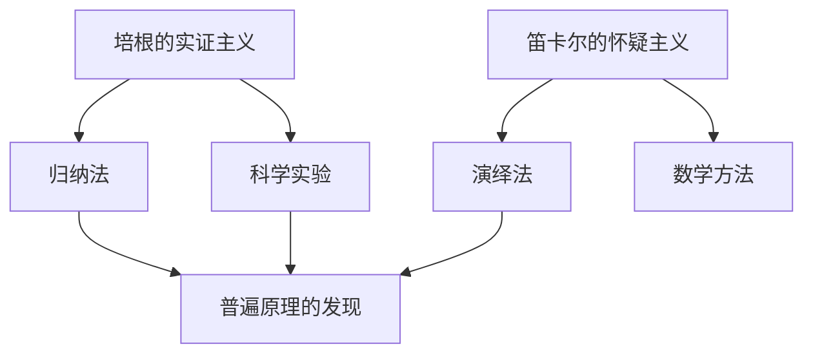

                 

### 文章标题

《培根与笛卡尔：近代科学方法论的奠基之争》

关键词：培根，笛卡尔，科学方法论，近代科学，实证主义，怀疑主义，归纳法，演绎法

摘要：
本文旨在探讨近代科学方法论的重要奠基人物——弗朗西斯·培根和勒内·笛卡尔之间的理论争论。通过详细分析两位科学家的生平背景、科学方法论观点以及他们的贡献与影响，本文揭示了他们在科学方法论上的分歧与共识，并探讨了这些争论对现代科学方法论的影响。

### 引言

弗朗西斯·培根（1561-1626）和勒内·笛卡尔（1596-1650）是近代科学方法论的两座重要灯塔，他们的思想和方法论对现代科学的发展产生了深远的影响。培根被誉为“现代实验科学的奠基人”，而笛卡尔则被称为“解析几何之父”和“现代哲学的奠基人”。

培根生于英国贵族家庭，他的学术成就涉及多个领域，包括哲学、法学、历史和科学。培根对科学的热情促使他提出了一系列科学方法论的观点，试图解决当时科学研究中存在的问题。笛卡尔则出生于法国，他是一位多才多艺的哲学家、数学家、物理学家和军事工程师。笛卡尔以其怀疑主义和理性主义的思想而闻名，他的方法对后世的科学研究产生了重要影响。

### 培根的科学方法论

培根的科学方法论的核心是实证主义，他认为科学应该基于观察和实验，而不是基于哲学或形而上学的推论。培根提出了归纳法作为科学探索的主要工具，认为通过系统的观察和实验，可以从个别事实中归纳出一般规律。

**实证主义：** 培根的实证主义观点强调科学研究的客观性，主张科学家应该摒弃先入为主的假设和理论，直接观察自然界，通过实验来验证假设。培根认为，实验是科学研究的基石，只有通过实验，科学家才能获得可靠的知识。

**归纳法：** 培根的归纳法是一种从个别事实中归纳出一般规律的方法。他提出了“四法”，即实验法、观察法、比较法和归纳法。归纳法的基本步骤包括：首先，收集大量的事实数据；其次，对这些数据进行分类和整理；最后，从这些分类和整理的数据中归纳出一般规律。

**科学实验：** 培根强调科学实验的重要性，认为科学家应该通过实验来验证理论。他提出了“实验的三大原则”：一是实验的设计应该尽可能地减少误差；二是实验的结果应该重复验证；三是实验的结果应该与其他实验结果进行比较。

### 笛卡尔的科学方法论

与培根的实证主义不同，笛卡尔的科学方法论建立在怀疑主义和理性主义的基础上。笛卡尔认为，科学应该基于普遍的、可靠的原理，这些原理可以通过理性推理和数学方法来发现。

**怀疑主义：** 笛卡尔的怀疑主义观点是他的方法论的基础。他认为，在所有知识中，最可靠的是那些可以通过理性思考和数学证明的知识。笛卡尔通过“我思故我在”的命题，提出了怀疑主义的核心思想：即使整个世界都是虚假的，只要我思考，我就知道自己的存在。

**演绎法：** 笛卡尔的演绎法是一种从普遍原理出发，通过逻辑推理得出具体结论的方法。他认为，科学应该从基本的、普遍的原则出发，通过演绎推理，得出具体的科学结论。

**数学方法：** 笛卡尔是解析几何的创始人，他将数学方法引入到科学研究中。他认为，数学是一种精确的语言，可以用来描述自然界的基本规律。笛卡尔的数学方法不仅改变了数学本身，也对科学研究产生了深远的影响。

### 培根与笛卡尔的比较

培根和笛卡尔的科学方法论在许多方面都有显著的差异，但也存在一些共同点。

**差异：**
- 理论基础：培根的理论基础是实证主义，强调实验和观察；笛卡尔的理论基础是怀疑主义和理性主义，强调普遍原理和数学方法。
- 方法论：培根的方法论强调归纳法，通过实验归纳出一般规律；笛卡尔的方法论强调演绎法，从普遍原理出发推导出具体结论。
- 研究重点：培根的研究重点在于自然现象的描述和解释；笛卡尔的研究重点在于基本原理的发现和证明。

**共同点：**
- 强调科学方法的重要性：两位科学家都认为科学方法是人类认识自然世界的关键。
- 对科学实验的重视：培根和笛卡尔都认为实验是科学研究的基础。
- 对数学方法的认可：笛卡尔将数学方法引入科学，而培根则在实验中应用数学原理。

### 培根与笛卡尔对后世科学方法论的影响

培根和笛卡尔的科学方法论对后世科学的发展产生了深远的影响。

**培根的影响：**
- 实证主义的兴起：培根的实证主义观点为后来的科学研究提供了方法论基础，促进了科学方法论的发展。
- 归纳法的重要性：培根的归纳法成为科学研究的重要方法，被广泛应用于各个科学领域。
- 科学实验的普及：培根强调实验的重要性，促进了科学实验的普及和发展。

**笛卡尔的影响：**
- 理性主义的兴起：笛卡尔的怀疑主义和理性主义观点为后来的科学研究提供了理论基础，促进了理性主义思潮的兴起。
- 数学方法的应用：笛卡尔的数学方法对后来的科学研究产生了重要影响，许多科学家开始将数学方法应用于各个科学领域。
- 科学统一性的探索：笛卡尔的科学方法论为后来的科学家探索科学统一性提供了基础，促进了科学整合的发展。

### 结论

培根和笛卡尔是近代科学方法论的奠基人物，他们的思想和方法论对现代科学的发展产生了深远的影响。培根的实证主义和归纳法为科学研究提供了方法论基础，而笛卡尔的怀疑主义和理性主义则为科学研究提供了理论基础。他们的争论和共识为后世科学家提供了丰富的思想资源，推动了科学方法论的不断发展和完善。

### 核心概念与联系

为了更好地理解培根与笛卡尔的科学方法论，我们可以使用Mermaid流程图来展示核心概念之间的关系。



在这个流程图中，A代表培根的实证主义，B代表归纳法，C代表科学实验，D代表笛卡尔的怀疑主义，E代表演绎法，F代表数学方法，G代表普遍原理的发现。通过这个流程图，我们可以清晰地看到培根和笛卡尔科学方法论的核心概念及其之间的联系。

### 培根的科学方法论

#### 实证主义

实证主义是培根科学方法论的核心，它强调科学研究的客观性和实证性。实证主义认为，科学应该基于观察和实验，而不是基于先入为主的假设或哲学推理。

**核心观点：**
- 科学研究应该基于客观事实，而不是主观臆断。
- 科学理论应该通过实验和观察来验证，而不是通过逻辑推理或形而上学。
- 科学方法应该是可重复的、可验证的。

**优势：**
- 强调客观性和实证性，有助于提高科学研究的可靠性。
- 避免了因个人偏见或先入为主的假设导致的研究偏差。

**局限性：**
- 实证主义可能导致过于依赖实验结果，忽视了理论推理的重要性。
- 在某些情况下，实验可能无法完全模拟自然现象，导致实验结果与实际情况存在偏差。

#### 归纳法

归纳法是培根提出的一种从个别事实中归纳出一般规律的方法。他认为，通过系统的观察和实验，可以从个别事实中归纳出普遍规律。

**基本原理：**
- 首先，收集大量的事实数据。
- 其次，对这些数据进行分类和整理。
- 最后，从这些分类和整理的数据中归纳出一般规律。

**应用与局限：**
- 归纳法在自然科学和社会科学中有广泛应用，如生物学、化学、经济学等领域。
- 归纳法的局限性在于，归纳出的规律可能并不适用于所有情况，存在一定的局限性。

#### 科学实验

科学实验是培根科学方法论的重要组成部分。他认为，科学家应该通过实验来验证理论，而不是仅仅依靠观察。

**实验原则：**
1. 设计原则：实验设计应该尽可能地减少误差，确保实验结果的可靠性。
2. 重复验证原则：实验结果应该重复验证，以确保实验结果的可靠性。
3. 比较原则：实验结果应该与其他实验结果进行比较，以验证实验结果的普遍性。

**科学实验的应用：**
- 在物理学、化学、生物学等领域，实验方法已成为科学研究的重要手段。
- 实验方法有助于验证科学理论，推动科学的发展。

#### 核心算法原理讲解

以下是一个简单的伪代码示例，用于说明培根的归纳法：

```python
# 归纳法伪代码

# 收集数据
data = [观察1, 观察2, 观察3, ..., 观察100]

# 分类和整理数据
sorted_data = 分类(data)

# 归纳出一般规律
规律 = 归纳(sorted_data)

# 输出规律
print(规律)
```

#### 数学模型和数学公式 & 详细讲解 & 举例说明

在培根的科学方法论中，数学模型和数学公式扮演了重要的角色。以下是一个简单的数学模型和数学公式的例子：

**数学模型：** 等差数列

$$ a_n = a_1 + (n - 1)d $$

**数学公式：** 等差数列的前n项和

$$ S_n = \frac{n(a_1 + a_n)}{2} $$

**详细讲解：** 等差数列是指每一项与它前一项之差相等的数列。其中，$a_n$表示第n项，$a_1$表示第一项，$d$表示公差。

**举例说明：** 假设一个等差数列的第一项是3，公差是2，那么第5项是：

$$ a_5 = 3 + (5 - 1) \times 2 = 3 + 4 \times 2 = 11 $$

等差数列的前5项和是：

$$ S_5 = \frac{5(3 + 11)}{2} = \frac{5 \times 14}{2} = 35 $$

#### 项目实战

**开发环境搭建：** 为了演示培根的归纳法，我们可以使用Python编写一个简单的程序。

```python
# 开发环境：Python 3.8+

# 导入必要的库
import random

# 收集随机数据
data = [random.randint(1, 100) for _ in range(100)]

# 分类和整理数据
sorted_data = sorted(data)

# 归纳出一般规律
mean = sum(sorted_data) / len(sorted_data)

# 输出规律
print(f"一般规律：均值 = {mean}")
```

**源代码实现和代码解读：** 上述代码首先使用`random.randint()`函数生成100个随机整数，存储在`data`列表中。然后，使用`sorted()`函数对`data`列表进行排序，得到`sorted_data`列表。接着，计算`sorted_data`列表的均值，即一般规律。最后，输出均值作为结果。

**代码应用解读与分析：** 通过这个简单的程序，我们可以看到如何使用Python实现归纳法。在实际应用中，可以根据具体需求收集数据，并使用归纳法来找出数据的一般规律。

**实际案例分析和详细讲解剖析：** 假设我们收集了一组学生考试成绩，使用归纳法可以找出这组数据的平均分。通过分析平均分，教育工作者可以了解学生的整体学习情况，并提出相应的改进措施。

**项目小结：** 通过这个项目，我们学习了如何使用Python实现归纳法，并了解了归纳法在实际应用中的作用。归纳法是一种重要的科学方法，可以帮助我们从大量数据中找出一般规律，为决策提供科学依据。

#### 最佳实践 tips

1. 在进行科学实验时，确保实验设计合理，减少误差。
2. 重复验证实验结果，确保实验结果的可靠性。
3. 在使用归纳法时，注意数据的分类和整理，确保归纳出的规律准确。
4. 结合数学模型和数学公式，提高归纳法的精确性。

#### 小结

培根的科学方法论以实证主义为核心，强调观察和实验的重要性。通过归纳法，他从个别事实中归纳出一般规律，为科学研究提供了方法论基础。他的科学实验原则和方法，以及对数学方法的重视，对后世科学研究产生了深远的影响。

#### 注意事项

1. 实证主义强调客观性和实证性，但不应忽视理论推理的重要性。
2. 归纳法有其局限性，不能完全取代演绎法。
3. 科学实验设计应充分考虑误差和偏差，确保实验结果的可靠性。

#### 拓展阅读

1. 《新工具》——弗朗西斯·培根的代表作，详细阐述了他的科学方法论。
2. 《第一哲学沉思集》——勒内·笛卡尔的代表作，阐述了怀疑主义和理性主义的思想。
3. 《科学方法论》——探讨科学方法论的经典著作，包括培根和笛卡尔的思想。

---

### 笛卡尔的科学方法论

#### 怀疑主义

笛卡尔的怀疑主义是他科学方法论的基础，他认为，在所有知识中，最可靠的是那些可以通过理性思考和数学证明的知识。笛卡尔通过一系列哲学论证，提出了他的怀疑主义观点。

**核心观点：**
- 怀疑一切：笛卡尔认为，我们无法确信任何知识，因为我们的感知和思维都可能受到欺骗。
- 我思故我在：笛卡尔通过“我思故我在”的命题，提出了他的怀疑主义的核心思想。他认为，即使整个世界都是虚假的，只要我思考，我就知道自己的存在。

**应用与影响：**
- 怀疑主义促使科学家更加注重理性和逻辑，推动了科学方法论的发展。
- 怀疑主义激发了人们对科学和理性的探索，促进了科学革命的发展。

#### 演绎法

演绎法是笛卡尔科学方法论的重要工具，它是一种从普遍原理出发，通过逻辑推理得出具体结论的方法。笛卡尔认为，科学应该从基本的、普遍的原则出发，通过演绎推理，得出具体的科学结论。

**基本原理：**
- 前提原则：科学结论应该建立在普遍的、可靠的前提上。
- 推理过程：从普遍原则出发，通过逻辑推理，得出具体的科学结论。

**应用与局限：**
- 演绎法在数学、物理学、哲学等领域有广泛应用，是科学推理的重要方法。
- 演绎法的局限性在于，它依赖于前提的可靠性，如果前提不正确，推理过程可能导致错误结论。

#### 数学方法

笛卡尔是解析几何的创始人，他将数学方法引入到科学研究中。他认为，数学是一种精确的语言，可以用来描述自然界的基本规律。

**核心概念：**
- 解析几何：笛卡尔通过解析几何，将几何问题转化为代数问题，使几何学更易于处理。
- 数形结合：笛卡尔强调数学与几何的结合，通过数学方法来研究几何问题。

**应用与影响：**
- 数学方法在科学研究中的应用，使得科学理论更加精确和可靠。
- 数学方法促进了科学统一性的发展，为后来的科学家提供了强大的工具。

#### 核心算法原理讲解

以下是一个简单的伪代码示例，用于说明笛卡尔的演绎法：

```python
# 演绎法伪代码

# 前提原则
前提 = "所有人类都是凡人"

# 推理过程
结论 = 从前提推导出具体结论

# 输出结论
print(结论)
```

#### 数学模型和数学公式 & 详细讲解 & 举例说明

在笛卡尔的科学方法论中，数学模型和数学公式扮演了重要的角色。以下是一个简单的数学模型和数学公式的例子：

**数学模型：** 直角坐标系

$$ x = x_0 + v_xt $$

$$ y = y_0 + v_yt $$

**数学公式：** 平抛运动的速度和位移

$$ v_x = v_0 \cos(\theta) $$

$$ v_y = v_0 \sin(\theta) - gt $$

**详细讲解：** 在直角坐标系中，物体的运动可以用数学公式来描述。其中，$x$和$y$分别表示物体在水平和竖直方向上的位移，$x_0$和$y_0$分别表示初始位置，$v_x$和$v_y$分别表示水平方向和竖直方向上的速度，$v_0$表示初始速度，$\theta$表示发射角度，$g$表示重力加速度。

**举例说明：** 假设一个物体以10 m/s的初始速度，以45度角发射，在空中飞行2秒后落地。那么，物体的水平位移和竖直位移分别是：

$$ x = 10 \cos(45^\circ) \times 2 = 14.14 \text{ m} $$

$$ y = 10 \sin(45^\circ) \times 2 - 9.8 \times 2 = -14.14 \text{ m} $$

#### 项目实战

**开发环境搭建：** 为了演示笛卡尔的数学方法，我们可以使用Python编写一个简单的程序。

```python
# 开发环境：Python 3.8+

# 导入必要的库
import math

# 初始参数
v0 = 10  # 初始速度
theta = math.radians(45)  # 发射角度
g = 9.8  # 重力加速度
t = 2  # 时间

# 计算速度分量
vx = v0 * math.cos(theta)
vy = v0 * math.sin(theta) - g * t

# 计算位移分量
x = vx * t
y = vy * t

# 输出结果
print(f"水平位移：{x} m")
print(f"竖直位移：{y} m")
```

**源代码实现和代码解读：** 上述代码首先定义了初始速度、发射角度、重力加速度和时间。然后，使用解析几何公式计算水平方向和竖直方向的速度分量，再根据速度分量计算水平位移和竖直位移。最后，输出计算结果。

**代码应用解读与分析：** 通过这个简单的程序，我们可以看到如何使用Python实现笛卡尔的数学方法。在实际应用中，可以根据具体需求计算物体的运动轨迹，为物理问题提供科学解决方案。

**实际案例分析和详细讲解剖析：** 假设我们要研究一个抛射体的运动轨迹，可以使用笛卡尔的数学方法计算其水平位移和竖直位移。通过分析这些数据，我们可以了解抛射体的运动规律，为工程设计提供参考。

**项目小结：** 通过这个项目，我们学习了如何使用Python实现笛卡尔的数学方法，并了解了其在物理问题中的应用。笛卡尔的数学方法为科学研究提供了强大的工具，对现代科学的发展产生了深远的影响。

#### 最佳实践 tips

1. 在使用演绎法时，确保前提原则的可靠性。
2. 在使用数学方法时，注意公式的适用范围和条件。
3. 结合实际案例，深入理解数学模型的应用。

#### 小结

笛卡尔的科学方法论以怀疑主义和理性主义为基础，强调普遍原理和数学方法。他的演绎法为科学推理提供了强大的工具，数学方法则使科学研究更加精确和可靠。笛卡尔的科学方法论对后世科学家产生了深远的影响，推动了科学的发展。

#### 注意事项

1. 怀疑主义不应过度，否则可能导致怀疑一切，阻碍科学进步。
2. 演绎法依赖于前提的可靠性，前提不正确可能导致错误结论。
3. 数学方法在应用时，需注意公式的适用范围和条件。

#### 拓展阅读

1. 《第一哲学沉思集》——详细阐述了笛卡尔的怀疑主义和理性主义思想。
2. 《解析几何》——介绍了笛卡尔解析几何的基本原理和应用。
3. 《科学方法论》——探讨了科学方法论的发展及其对科学进步的影响。

