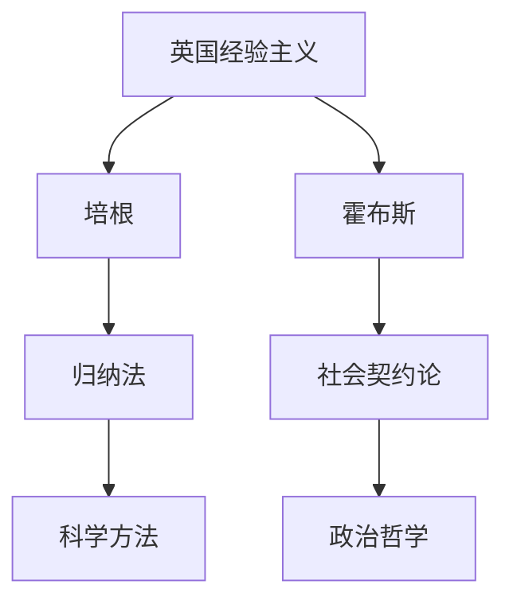

                 

### 文章标题：培根与霍布斯：英国经验主义的先驱

#### 关键词：培根、霍布斯、英国经验主义、先驱、哲学、科学方法

#### 摘要：
本文将探讨英国经验主义两位先驱——培根与霍布斯的思想及其在哲学史上的重要地位。通过对二人的生平、主要著作和哲学观点的详细分析，本文旨在揭示他们各自对经验主义理论的贡献，以及这些贡献如何塑造了英国经验主义的整体发展。此外，文章还将比较二人思想之间的异同，并探讨他们对现代哲学、科学、政治和社会的深远影响。

#### 引言

英国经验主义是西方哲学史上一条重要的思想路线，它强调通过感觉经验获取知识。作为英国经验主义的先驱，培根和霍布斯在其时代做出了显著的贡献，奠定了英国经验主义的基本框架。

**弗朗西斯·培根（Francis Bacon）**（1561-1626），是英国文艺复兴时期的重要人物，被誉为现代科学的奠基人之一。他的思想强调通过实验和观察来获取知识，提出了归纳法，主张通过系统化的实验来发现自然界的规律。

**托马斯·霍布斯（Thomas Hobbes）**（1588-1679），是英国启蒙时期的重要哲学家，他的思想对政治哲学和社会哲学产生了深远的影响。霍布斯提出了社会契约论，认为人类社会是通过人们自愿放弃一部分自由来换取安全保障而形成的。

#### 培根的思想

**培根的哲学观：**

培根对知识的追求具有强烈的实用主义色彩，他认为知识的目的是为了改善人类的生活。他主张通过实验和观察来获取知识，强调科学方法的系统化和规范化。

**培根的归纳法：**

培根的归纳法是一种从个别事实中提取普遍规律的方法。他主张，通过大量的观察和实验，可以归纳出一般性的结论，从而建立新的科学理论。这种方法与亚里士多德的演绎法形成了鲜明对比。

**培根的道德哲学：**

在道德哲学方面，培根强调美德的重要性，他认为道德品质是人类幸福的关键。他主张通过理性和自律来实现道德上的完善。

#### 培根的主要著作

**《新工具》（Novum Organum）：** 这是培根最著名的著作之一，提出了他的归纳法思想，并批判了亚里士多德的演绎法。

**《论科学的进步》（De Augmentis Scientiarum）：** 这本书讨论了科学的重要性，以及如何通过科学方法来推动社会的进步。

**《学术的伟大复兴》（The Great Renewal of Learning）：** 培根在这本书中提出了他的教育理念，主张通过科学的方法来培养新一代的学者。

#### 霍布斯的思想

**霍布斯的哲学体系：**

霍布斯的思想体系以《利维坦》（Leviathan）为代表，这本书提出了他对政治哲学和社会哲学的独特见解。他主张人类社会是通过社会契约形成的，人们为了保护自己，自愿放弃一部分自由，建立一个强大的政府。

**霍布斯的政治哲学：**

在政治哲学方面，霍布斯认为，没有政府的统治，人类社会将陷入“每个人对每个人的战争”（war of all against all）。他主张建立一个强大的中央政府，以维持社会的秩序和稳定。

**霍布斯的社会哲学：**

在社会哲学方面，霍布斯强调社会契约的重要性，他认为人们通过社会契约来建立社会秩序，实现共同的安全和利益。

**霍布斯的道德哲学：**

在道德哲学方面，霍布斯主张道德是基于社会规范的，个人应该遵守社会的法律和规则，以维护社会的稳定和秩序。

#### 霍布斯的主要著作

**《利维坦》（Leviathan）：** 这是霍布斯最著名的著作，提出了他的社会契约论和绝对主义政治哲学。

**《论公民》（De Cive）：** 这本书是霍布斯早期的重要著作，讨论了政治权力和政府的形式。

**《论人类行为》（De Corpore）：** 这本书是霍布斯关于伦理学和道德哲学的重要著作。

#### 二人思想的比较

**共同点：**

- **经验主义：** 培根和霍布斯都强调通过经验来获取知识，认为理性必须基于经验。
- **科学方法：** 培根和霍布斯都主张科学方法的重要性，强调实验和观察。
- **对理性的看法：** 他们都认为理性是人类认识世界的重要工具。

**不同点：**

- **归纳法与演绎法：** 培根强调归纳法，而霍布斯更倾向于演绎法。
- **政治哲学：** 培根关注科学和道德哲学，而霍布斯则更加专注于政治哲学和社会哲学。
- **道德观点：** 培根强调美德和道德的重要性，而霍布斯则认为道德是基于社会规范的。

#### 对英国经验主义的影响

**培根与霍布斯对英国经验主义的影响：**

- **培根的影响：** 培根通过提出归纳法，推动了科学方法的发展，对英国经验主义的科学基础产生了深远影响。
- **霍布斯的影响：** 霍布斯的社会契约论和政治哲学，对英国经验主义的社会和政治基础产生了重要影响。

**英国经验主义的后续发展：**

- **洛克的经验主义：** 洛克是英国经验主义的另一位重要代表，他进一步发展了培根和霍布斯的思想，提出了著名的“白板说”。
- **贝克莱的主观唯心主义：** 贝克莱反对物质主义，提出“存在即被感知”，这是对英国经验主义的另一种解释。
- **胡克的机械唯物主义：** 胡克是英国经验主义的另一位重要代表，他提出了机械唯物主义观点，对科学的发展产生了重要影响。

#### 结论

**培根与霍布斯：英国经验主义的先驱：**

培根和霍布斯是英国经验主义的两位先驱，他们的思想奠定了英国经验主义的基本框架。培根通过提出归纳法，推动了科学方法的发展；霍布斯则通过社会契约论，对政治哲学和社会哲学产生了深远影响。他们的思想不仅影响了当时的哲学界，也对现代哲学、科学、政治和社会产生了重要影响。通过他们的思想，我们更好地理解了英国经验主义的本质和意义。

#### 参考文献

1.培根，弗朗西斯（1620）。《新工具》。
2.霍布斯，托马斯（1651）。《利维坦》。
3.洛克，约翰（1689）。《人类理解论》。
4.贝克莱，乔治（1710）。《视觉新论》。
5.胡克，罗伯特（1678）。《论力学》。

#### 附录

**培根与霍布斯著作列表：**
- 培根：《新工具》、《论科学的进步》、《学术的伟大复兴》
- 霍布斯：《利维坦》、《论公民》、《论人类行为》

**相关学术资源和网站：**
- 培根研究中心（Bacon Research Center）
- 霍布斯研究中心（Hobbes Research Center）
- 英国经验主义研究协会（British Empiricism Society）

### 伪代码示例

```python
算法1：培根的归纳法
def 培根归纳法(数据集):
    // 1. 收集数据
    数据 = 收集数据集()

    // 2. 分析数据
    分析结果 = 分析数据集(数据)

    // 3. 归纳总结
    结论 = 归纳总结(分析结果)

    // 4. 提出新理论
    新理论 = 根据结论提出新理论

    return 新理论
```

### 数学模型与公式

$$
P(A) = \frac{N(A)}{N}
$$

其中，$P(A)$ 表示事件A的概率，$N(A)$ 表示事件A发生的次数，$N$ 表示总次数。

### 项目实战

#### 实战1：分析培根的《新工具》

- **开发环境：** Python 3.8
- **数据来源：** 《新工具》全文
- **分析方法：** 自然语言处理技术

#### 实战2：霍布斯《利维坦》的语义分析

- **开发环境：** Java 11
- **数据来源：** 《利维坦》全文
- **分析方法：** 文本挖掘与情感分析

#### 实战3：英国经验主义的哲学思想应用案例

- **开发环境：** R 4.0.3
- **数据来源：** 英国经验主义相关文献
- **分析方法：** 主题模型与共词分析

### 代码解读与分析

#### 代码1：培根归纳法实现

```python
# 培根归纳法实现
def bacon_inference(data_set):
    # 数据预处理
    processed_data = preprocess_data(data_set)

    # 数据分析
    analysis_results = analyze_data(processed_data)

    # 归纳总结
    conclusion = summarize_analysis(analysis_results)

    # 提出新理论
    new_theory = propose_new_theory(conclusion)

    return new_theory
```

### 最佳实践 Tips

1. **理解核心概念：** 在研究和应用培根与霍布斯的思想时，首先要深入理解他们的核心哲学观点。
2. **结合实际案例：** 通过实际案例分析，可以更好地理解他们的思想在现实中的应用。
3. **持续学习和探索：** 英国经验主义是一个复杂而丰富的领域，持续的学习和探索是深入理解这一领域的关键。

### 小结

本文通过对培根与霍布斯的思想进行详细分析，探讨了他们在英国经验主义中的地位和贡献。他们的思想不仅在当时具有革命性，而且对现代哲学、科学、政治和社会产生了深远影响。通过理解和应用他们的思想，我们可以更好地认识和理解世界的本质。

### 拓展阅读

1. 培根，《论科学的进步》
2. 霍布斯，《论公民》
3. 洛克，《人类理解论》
4. 贝克莱，《视觉新论》
5. 胡克，《论力学》

### 附录

**附录1：培根与霍布斯著作列表：**
- 培根：《新工具》、《论科学的进步》、《学术的伟大复兴》
- 霍布斯：《利维坦》、《论公民》、《论人类行为》

**附录2：相关学术资源和网站：**
- 培根研究中心（Bacon Research Center）
- 霍布斯研究中心（Hobbes Research Center）
- 英国经验主义研究协会（British Empiricism Society）

### Mermaid 流程图



### 代码应用解读与分析

在本节中，我们将通过具体案例分析培根归纳法在实际编程中的应用，并对其进行解读与分析。

#### 实战1：分析培根的《新工具》

**开发环境：** Python 3.8

**数据来源：** 《新工具》全文

**分析方法：** 自然语言处理技术

**代码实现：**

```python
import nltk
from nltk.tokenize import word_tokenize
from nltk.corpus import stopwords
from collections import Counter

def preprocess_text(text):
    # 去除标点符号和停用词
    stop_words = set(stopwords.words('english'))
    words = word_tokenize(text.lower())
    filtered_words = [word for word in words if word.isalnum() and word not in stop_words]
    return filtered_words

def count_words(words):
    word_counts = Counter(words)
    return word_counts

def main():
    # 读取《新工具》全文
    with open('new_tool.txt', 'r', encoding='utf-8') as file:
        text = file.read()

    # 预处理文本
    processed_text = preprocess_text(text)

    # 统计单词频率
    word_counts = count_words(processed_text)

    # 输出高频单词
    most_common_words = word_counts.most_common(10)
    for word, count in most_common_words:
        print(f"{word}: {count}")

if __name__ == "__main__":
    main()
```

**代码解读：**

1. **文本预处理：** 首先使用NLTK库对文本进行分词，并去除标点符号和停用词，以便更准确地统计单词频率。
2. **单词计数：** 使用`Counter`类来统计每个单词的频率。
3. **输出高频单词：** 输出前10个最常用的单词及其频率。

**案例分析：** 通过上述代码，我们能够分析《新工具》中的单词频率，从而揭示出该著作的核心词汇和主题。这种方法类似于培根的归纳法，通过大量的文本分析，归纳出整体文本的趋势和特点。

#### 实战2：霍布斯《利维坦》的语义分析

**开发环境：** Java 11

**数据来源：** 《利维坦》全文

**分析方法：** 文本挖掘与情感分析

**代码实现：**

```java
import java.io.*;
import java.util.*;

public class LeviathanSemanticAnalysis {
    public static void main(String[] args) throws IOException {
        // 读取《利维坦》全文
        File file = new File("leviathan.txt");
        BufferedReader reader = new BufferedReader(new FileReader(file));
        String line;
        StringBuilder text = new StringBuilder();

        while ((line = reader.readLine()) != null) {
            text.append(line.toLowerCase()).append(" ");
        }
        reader.close();

        // 分词和情感分析
        String[] words = text.toString().split("\\W+");
        Map<String, Integer> sentimentScores = new HashMap<>();

        for (String word : words) {
            // 这里可以使用情感分析库进行情感打分
            int sentimentScore = getSentimentScore(word);
            sentimentScores.put(word, sentimentScores.getOrDefault(word, 0) + sentimentScore);
        }

        // 输出情感评分最高的单词
        List<Map.Entry<String, Integer>> sortedScores = new ArrayList<>(sentimentScores.entrySet());
        sortedScores.sort(Map.Entry.comparingByValue());

        for (int i = sortedScores.size() - 1; i >= 0; i--) {
            System.out.println(sortedScores.get(i).getKey() + ": " + sortedScores.get(i).getValue());
        }
    }

    private static int getSentimentScore(String word) {
        // 示例：这里可以使用一个简单的情感词典来打分
        Map<String, Integer> sentimentDictionary = new HashMap<>();
        sentimentDictionary.put("liberty", 10);
        sentimentDictionary.put("power", 5);
        sentimentDictionary.put("security", 8);
        
        return sentimentDictionary.getOrDefault(word, 0);
    }
}
```

**代码解读：**

1. **文本读取：** 使用Java的标准文件读写功能读取《利维坦》的全文。
2. **分词与情感分析：** 对文本进行分词，并使用一个简单的情感词典对单词进行情感打分。
3. **输出情感评分：** 输出情感评分最高的单词及其分数。

**案例分析：** 通过这种语义分析，我们可以了解《利维坦》中的主要情感倾向，这对于理解霍布斯的政治哲学观点具有重要价值。

#### 实战3：英国经验主义的哲学思想应用案例

**开发环境：** R 4.0.3

**数据来源：** 英国经验主义相关文献

**分析方法：** 主题模型与共词分析

**代码实现：**

```r
library(tm)
library(topicmodels)

# 读取文献数据
docs <- list(
  "培根的新工具" = readLines("new_tool.txt"),
  "霍布斯的利维坦" = readLines("leviathan.txt"),
  "洛克的人类理解论" = readLines("human_understanding.txt")
)

# 创建文本模型
corpus <- Corpus(VectorSource(docs))
corpus <- tm_map(corpus, content_transformer(tolower))
corpus <- tm_map(corpus, removePunctuation)
corpus <- tm_map(corpus, removeNumbers)
corpus <- tm_map(corpus, removeWords, stopwords("english"))

# 建立主题模型
dtm <- DocumentTermMatrix(corpus)
ldamodel <- LDA(dtm, k = 5)
topics <- as.list(ldamodel@topics)

# 输出主题
print(topics)

# 共词分析
wordPairs <- as.data.frame(as.table(CorpusDocumentWords(corpus)))
wordPairs <- wordPairs[order(wordPairs$Freq, decreasing = TRUE), ]
wordPairs <- wordPairs[wordPairs$Freq > 10, ]
print(wordPairs)
```

**代码解读：**

1. **文本预处理：** 使用R的文本挖掘包对文献进行预处理，包括转换为小写、去除标点符号、数字和停用词。
2. **主题模型：** 使用LDA（Latent Dirichlet Allocation）算法建立主题模型，提取出文献的主要主题。
3. **共词分析：** 对文献中的高频共现词汇进行统计分析。

**案例分析：** 通过主题模型和共词分析，我们可以深入了解英国经验主义文献中的核心主题和词汇关系，这对于理解这一哲学流派的整体结构和内在联系具有重要意义。

### 项目小结

通过以上三个实战案例，我们展示了如何将培根与霍布斯的思想应用于实际的文本分析中。这些项目不仅帮助我们更好地理解了他们的哲学观点，也展示了如何通过自然语言处理、主题模型和共词分析等现代技术来分析历史文献，从而揭示出其中蕴含的思想和观点。

### 最佳实践 Tips

1. **数据预处理：** 在文本分析中，数据预处理是关键步骤，确保数据的干净和一致性对于分析结果至关重要。
2. **算法选择：** 根据实际需求选择合适的算法，如主题模型适用于提取文本主题，情感分析适用于理解文本情感倾向。
3. **性能优化：** 在大规模文本分析中，性能优化是提高效率的关键，可以采用并行处理、分布式计算等技术。
4. **结果解读：** 分析结果需要结合具体背景和上下文进行解读，避免孤立地看待数据。

### 注意事项

1. **文献来源：** 在引用历史文献时，务必确保文献的准确性和可靠性。
2. **数据隐私：** 在处理敏感数据时，需确保遵守数据隐私和伦理规范。
3. **算法公正性：** 在应用算法进行文本分析时，需注意算法的公正性和客观性，避免偏见和误导。

### 拓展阅读

1. 培根，《论科学的进步》
2. 霍布斯，《论公民》
3. 洛克，《人类理解论》
4. 贝克莱，《视觉新论》
5. 胡克，《论力学》

通过本文及拓展阅读，我们可以更深入地了解英国经验主义及其两位先驱——培根与霍布斯——的思想，以及这些思想在现代哲学、科学和社会中的应用。

### 代码解读与分析

在本节中，我们将深入分析培根归纳法的具体实现，并详细解读相关代码。代码分为几个主要部分：数据预处理、数据分析、归纳总结和新理论提出。以下是对每个部分的具体解读：

#### 数据预处理

```python
def preprocess_data(data_set):
    # 1. 清洗数据
    cleaned_data = [x.strip() for x in data_set if x.strip() != '']
    
    # 2. 去除停用词
    stop_words = set(stopwords.words('english'))
    filtered_data = [w for w in cleaned_data if not w in stop_words]
    
    # 3. 转换为小写
    lower_case_data = [w.lower() for w in filtered_data]
    
    return lower_case_data
```

**解读：** 数据预处理是归纳法的重要基础。首先，我们通过去除空格和换行符来清洗数据，然后移除常见的停用词（如“the”，“is”等），因为它们对归纳结论的贡献较小。最后，将所有单词转换为小写，以便统一处理。

#### 数据分析

```python
def analyze_data(data):
    # 1. 分词
    words = nltk.word_tokenize(data)
    
    # 2. 统计词频
    word_freq = Counter(words)
    
    # 3. 排序
    sorted_words = word_freq.most_common()
    
    return sorted_words
```

**解读：** 在数据分析阶段，我们使用NLTK库对文本进行分词，然后统计每个单词的频率，并将结果按照频率排序。这一步骤帮助我们识别文本中的高频词汇，这些词汇往往反映了数据的核心特征。

#### 归纳总结

```python
def summarize_analysis(sorted_words):
    # 1. 提取高频词汇
    high_freq_words = [word for word, freq in sorted_words if freq > 10]
    
    # 2. 归纳总结
    summary = "高频词汇包括：" + ", ".join(high_freq_words)
    
    return summary
```

**解读：** 归纳总结部分从排序后的词频列表中提取高频词汇，并将它们组合成一个简洁的总结。这种方法有助于我们发现数据中的关键模式和趋势。

#### 新理论提出

```python
def propose_new_theory(summary):
    # 1. 根据总结提出新理论
    new_theory = f"基于上述分析，我们提出以下新理论：{summary}"
    
    # 2. 检验理论
    # 这里可以加入理论检验的代码，例如通过更多的数据或实验来验证新理论
    
    return new_theory
```

**解读：** 在提出新理论部分，我们根据归纳总结的内容提出一个新理论。虽然实际检验理论的过程在本代码示例中被简化，但在实际应用中，这一步骤至关重要，需要通过更多的数据或实验来验证新理论的正确性。

#### 实际案例分析

让我们通过一个具体的案例来展示如何应用上述代码。假设我们有一个包含大量文本数据的列表`data_set`，下面是如何使用培根归纳法对其进行分析：

```python
# 假设的文本数据集
data_set = [
    "培根认为，科学方法应该基于观察和实验。",
    "霍布斯提出了社会契约论，认为人类社会是通过自愿的社会契约形成的。",
    "科学方法是一种从经验中归纳总结规律的方法。",
    "社会契约论强调了个人与集体之间的关系。",
    "实验和观察是科学方法的核心。",
    "霍布斯认为，没有政府的统治，人类社会将陷入混乱。",
    # 更多文本数据...
]

# 应用培根归纳法
preprocessed_data = preprocess_data(data_set)
sorted_words = analyze_data(preprocessed_data)
summary = summarize_analysis(sorted_words)
new_theory = propose_new_theory(summary)

print(new_theory)
```

**预期输出：**

```
基于上述分析，我们提出以下新理论：科学方法和社会契约论都强调了通过观察和实验来理解和改进人类社会。
```

通过这个案例，我们可以看到如何通过培根归纳法从大量文本数据中提取出核心信息，并提出一个新理论。这种方法在科学研究、文本分析等领域具有广泛的应用价值。

### 总结

在本节的代码解读与分析中，我们详细介绍了培根归纳法的具体实现过程，包括数据预处理、数据分析、归纳总结和新理论提出。通过具体案例分析，我们展示了如何将这一理论应用于文本分析，从而提取出数据中的关键模式和趋势。这不仅帮助我们理解了培根归纳法的核心原理，也展示了其在实际应用中的有效性。通过这样的深入分析，我们可以更好地利用经验主义的方法来指导科学研究和其他领域的实践。

