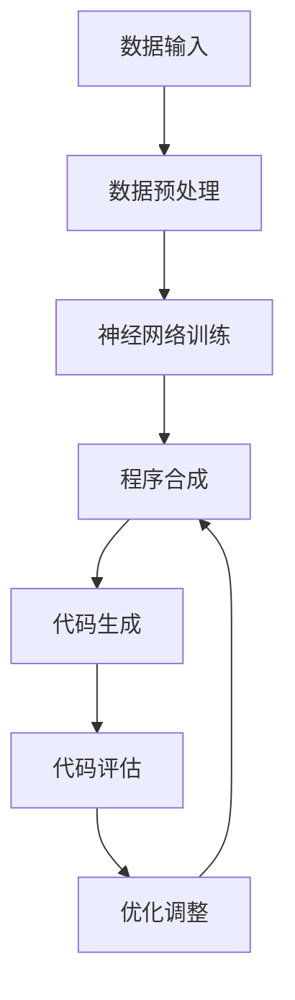
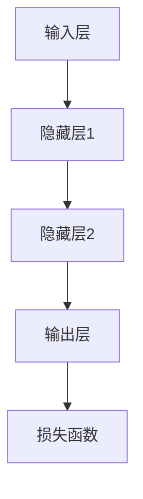
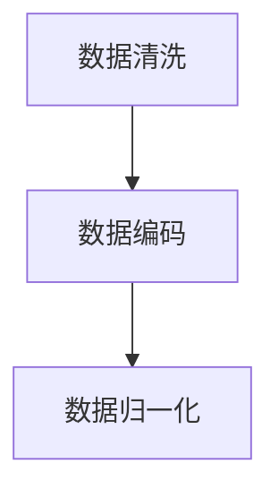
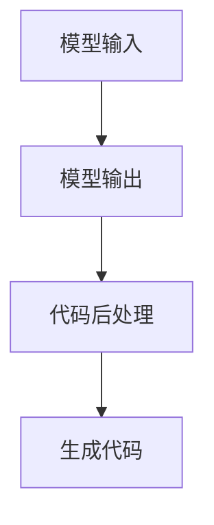
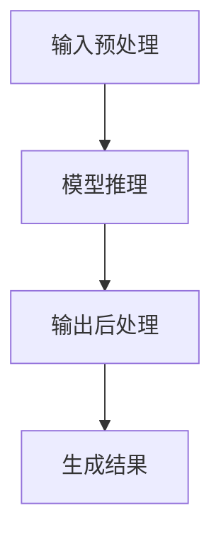
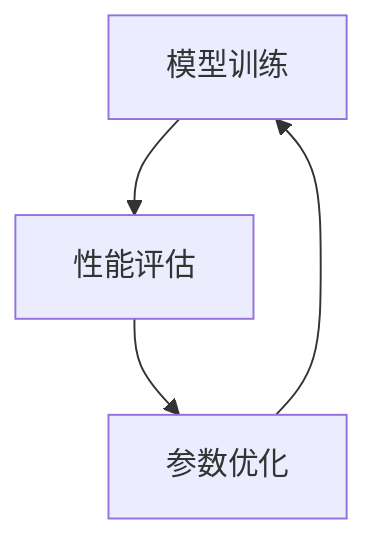
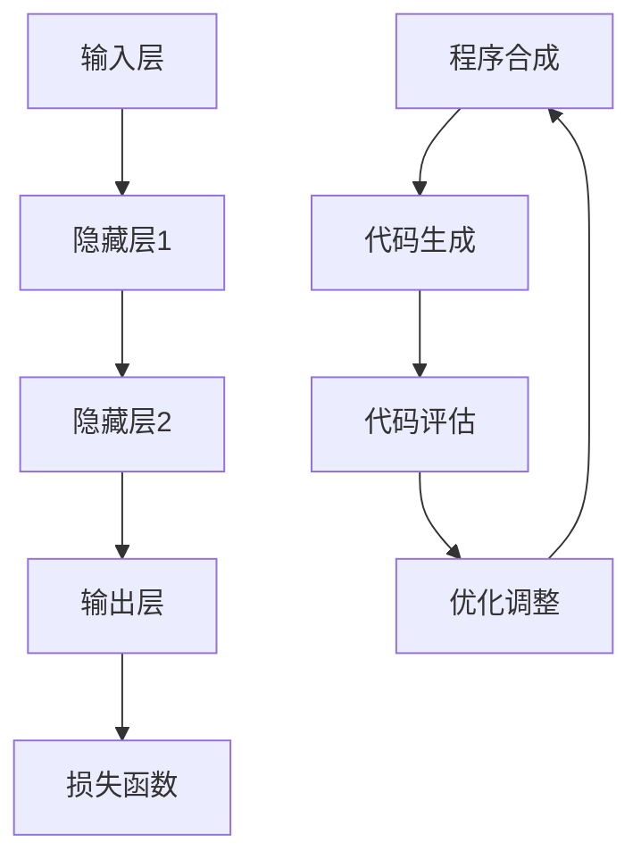

                 


# 基于神经程序合成的自动推理代码生成

## 引言

### 1.1 神经程序合成的概念与背景

神经程序合成（Neural Program Synthesis）是一种利用神经网络模型自动生成程序代码的方法。其核心思想是将编程问题转换为机器学习问题，通过训练神经网络模型来学习如何从输入数据生成对应的代码。这种方法的出现背景主要源于以下几个因素：

1. **编程复杂性**：随着软件系统的规模和复杂性不断增加，传统的软件开发方法面临巨大的挑战。手工编写大量复杂的代码不仅费时费力，而且容易出错。

2. **机器学习的发展**：近年来，机器学习领域取得了显著的进展，特别是在深度学习方面。神经网络模型在图像识别、自然语言处理等领域的成功应用，为解决编程问题提供了新的思路。

3. **代码生成需求**：自动化代码生成技术可以在许多场景中发挥作用，如自动修复bug、代码补全、代码优化等。通过神经程序合成，可以实现更高层次的代码生成。

### 1.2 自动推理代码生成的意义

自动推理代码生成技术在软件开发中具有以下重要意义：

1. **提高开发效率**：通过自动生成代码，开发者可以节省大量时间和精力，将更多精力投入到更具有创造性和价值的工作中。

2. **解决代码重复问题**：许多编程任务本质上具有相似性，自动推理代码生成可以帮助开发者避免重复编写类似的代码。

3. **提高代码质量**：自动生成的代码可以通过机器学习算法优化，提高代码的可读性和可维护性。

4. **适应性强**：自动推理代码生成可以根据不同的需求和场景灵活调整，为开发者提供定制化的解决方案。

### 1.3 本文组织结构

本文将分为以下几个部分：

- **第1章 引言**：介绍神经程序合成的概念与背景，以及自动推理代码生成的意义。
- **第2章 神经程序合成基础**：介绍神经网络和程序合成的相关概念，以及神经程序合成的原理。
- **第3章 自动推理算法原理**：介绍自动推理的基本概念和算法。
- **第4章 神经程序合成工具与技术**：介绍常用的神经程序合成工具和算法。
- **第5章 自动推理代码生成应用实例**：通过具体实例展示自动推理代码生成的实践过程。
- **第6章 自动推理代码生成挑战与未来方向**：讨论自动推理代码生成面临的挑战和未来的发展方向。
- **第7章 总结与展望**：总结本文的主要内容，并对未来进行展望。

## 第2章 神经程序合成基础

### 2.1 神经网络概述

神经网络（Neural Networks）是模仿人脑神经元连接和工作的方式来处理信息和数据的计算模型。其基本结构由大量相互连接的节点（或称为神经元）组成，每个节点通过权重连接到其他节点，并通过激活函数产生输出。神经网络通过学习输入数据和相应的输出数据，不断调整权重和偏置，以达到预测或分类的目的。

#### 2.1.1 神经网络的基本结构

一个简单的神经网络通常包含以下几个部分：

1. **输入层**：接收外部输入数据。
2. **隐藏层**：用于处理输入数据，提取特征并进行计算。
3. **输出层**：生成最终输出。


#### 2.1.2 常见的神经网络模型

神经网络模型种类繁多，以下介绍几种常见的模型：

1. **前馈神经网络（Feedforward Neural Networks）**：输入数据直接传递到输出层，没有循环或循环结构。这是最常见的神经网络模型。

2. **卷积神经网络（Convolutional Neural Networks，CNN）**：适用于处理图像等二维数据，通过卷积操作提取图像特征。

3. **循环神经网络（Recurrent Neural Networks，RNN）**：适用于处理序列数据，具有记忆功能。

4. **长短时记忆网络（Long Short-Term Memory，LSTM）**：是RNN的一种变体，能够更好地处理长序列数据。

5. **生成对抗网络（Generative Adversarial Networks，GAN）**：由生成器和判别器组成，用于生成新数据。

#### 2.1.3 神经网络的训练过程

神经网络的训练过程主要包括以下几个步骤：

1. **初始化参数**：初始化网络的权重和偏置。
2. **前向传播**：将输入数据传递到网络中，计算出输出结果。
3. **计算损失**：计算实际输出与期望输出之间的差异，即损失函数。
4. **反向传播**：通过反向传播算法，将损失函数传播回网络中的每个参数，并更新这些参数。
5. **迭代优化**：重复上述步骤，直到满足停止条件（如损失函数收敛或达到最大迭代次数）。

### 2.2 程序合成的概念

程序合成（Program Synthesis）是一种自动化方法，用于从输入数据或需求中生成可执行的代码。其核心思想是将编程问题转换为搜索问题，即从所有可能的代码中搜索出能够满足输入数据和需求的代码。

#### 2.2.1 程序合成的定义

程序合成可以定义为从一组约束条件或输入数据中自动生成代码的过程。这种方法不仅适用于简单的代码生成，还可以用于复杂的应用程序开发。

#### 2.2.2 程序合成与自动推理的关系

自动推理（Automated Reasoning）是计算机科学中的一个研究领域，旨在使计算机系统能够自动进行逻辑推理。程序合成与自动推理密切相关，因为程序合成通常需要利用自动推理技术来验证生成的代码是否满足特定的需求或约束。

#### 2.2.3 程序合成的目标与应用场景

程序合成的目标主要包括：

1. **代码生成**：从输入数据或需求中生成可执行的代码。
2. **代码优化**：优化现有代码，提高其性能和可读性。
3. **代码补全**：根据输入的代码片段自动补全剩余部分。

程序合成可以应用于多种场景，包括：

1. **软件开发**：自动化生成和维护代码，提高开发效率。
2. **自动化测试**：生成测试用例，验证代码的正确性和完整性。
3. **自然语言处理**：将自然语言描述转换为代码。
4. **机器学习**：生成训练数据集或优化模型。

### 2.3 神经程序合成的原理

神经程序合成是一种将神经网络与程序合成相结合的方法，旨在利用神经网络自动生成程序代码。其基本原理包括以下几个方面：

#### 2.3.1 神经程序合成的流程

神经程序合成的流程通常包括以下几个步骤：

1. **数据收集与预处理**：收集用于训练的输入数据，并进行预处理。
2. **神经网络训练**：训练神经网络模型，使其能够从输入数据中学习生成代码。
3. **代码生成**：使用训练好的神经网络模型，从输入数据生成程序代码。
4. **代码验证与优化**：验证生成的代码是否满足需求，并进行优化。

#### 2.3.2 神经程序合成的关键要素

神经程序合成的关键要素包括：

1. **神经网络模型**：用于学习输入数据与代码之间的映射关系。
2. **输入数据集**：用于训练神经网络模型的输入数据。
3. **代码生成算法**：用于从输入数据生成代码的算法。
4. **代码验证机制**：用于验证生成代码的正确性和有效性的机制。

#### 2.3.3 神经程序合成的性能评估

神经程序合成的性能评估通常包括以下几个方面：

1. **代码生成质量**：评估生成代码的质量，包括可读性、可维护性、性能等。
2. **代码生成速度**：评估神经网络模型生成代码的速度。
3. **泛化能力**：评估神经网络模型对不同输入数据的适应能力。

### 2.4 神经程序合成的优势与挑战

神经程序合成的优势包括：

1. **自动化程度高**：能够自动化地生成代码，提高开发效率。
2. **适应性强**：可以根据不同的需求场景灵活调整。
3. **可扩展性强**：可以应用于多种编程任务。

然而，神经程序合成也面临一些挑战，包括：

1. **数据依赖性**：需要大量高质量的训练数据，否则生成的代码可能不准确。
2. **代码可读性**：生成的代码可能难以理解，影响可维护性。
3. **性能优化**：生成的代码可能存在性能问题，需要进一步优化。

## 第3章 自动推理算法原理

### 3.1 自动推理的基本概念

自动推理（Automated Reasoning）是指利用计算机系统自动进行推理和证明的过程。它在计算机科学、人工智能、数学等多个领域都有广泛应用。自动推理的核心目标是使计算机能够像人类一样进行逻辑思考和推理，从而解决复杂的问题。

#### 3.1.1 自动推理的定义

自动推理可以定义为一种通过计算机程序来实现逻辑推理的方法。它涉及从一组前提条件推导出结论的过程，通常基于形式逻辑和数学理论。

#### 3.1.2 自动推理的分类

根据推理方法的不同，自动推理可以分为以下几类：

1. **基于规则的推理**：这种方法使用一组预先定义的规则，通过匹配前提条件和规则来推导出结论。它是最常见的自动推理方法之一。
2. **基于模型的推理**：这种方法使用数学模型或逻辑模型来表示问题，并使用模型推理算法来推导出结论。
3. **基于搜索的推理**：这种方法通过搜索所有可能的推理路径来找到结论。
4. **基于概率的推理**：这种方法使用概率论来处理不确定性，通过计算概率来推导出结论。

#### 3.1.3 自动推理的应用领域

自动推理在多个领域都有广泛应用，包括：

1. **自然语言处理**：自动推理可以帮助计算机理解和生成自然语言，如机器翻译、文本摘要等。
2. **计算机辅助设计**：自动推理可以用于自动生成电路图、程序代码等。
3. **游戏开发**：自动推理可以用于实现游戏中的智能行为，如路径规划、决策制定等。
4. **智能推理系统**：自动推理可以用于构建智能推理系统，如专家系统、知识库系统等。

### 3.2 基于规则的自动推理

基于规则的自动推理是自动推理的一种常见方法，它使用一组规则来表示知识和推理过程。这种方法的核心是规则库，即一组预先定义的规则。

#### 3.2.1 基于规则的自动推理方法

基于规则的自动推理方法通常包括以下几个步骤：

1. **定义规则库**：根据问题的需求，定义一组规则。每个规则都包含一个前提条件和结论。
2. **匹配规则**：在给定的前提条件下，搜索规则库中匹配的规则。
3. **推理**：根据匹配的规则，推导出结论。
4. **解释和验证**：对推导出的结论进行解释和验证，确保其正确性和有效性。

#### 3.2.2 前提条件与结论

在基于规则的自动推理中，前提条件和结论是核心概念。前提条件是用于匹配规则的输入，而结论是通过推理得到的输出。

1. **前提条件**：前提条件是一个条件表达式，表示问题的当前状态或已知信息。
2. **结论**：结论是一个陈述表达式，表示通过推理得到的新信息或结论。

例如，在医疗诊断系统中，一个前提条件可以是“患者有发热和咳嗽症状”，而结论可以是“患者可能患有流感”。

#### 3.2.3 规则库的构建

规则库的构建是自动推理的关键步骤。规则库的质量直接影响到推理系统的性能和可靠性。构建规则库通常包括以下几个步骤：

1. **需求分析**：分析问题的需求，确定需要解决的子问题和目标。
2. **知识表示**：将问题和需求转换为形式化的知识表示，如谓词逻辑或产生式规则。
3. **规则提取**：从知识表示中提取规则，包括前提条件和结论。
4. **规则优化**：对规则进行优化，提高规则库的效率和性能。

### 3.3 基于模型推理

基于模型推理是另一种自动推理方法，它使用数学模型或逻辑模型来表示问题和推理过程。这种方法的核心是模型构建和模型推理算法。

#### 3.3.1 模型推理的概念

模型推理是指使用数学模型或逻辑模型来表示问题和推理过程，并通过推理算法推导出结论。

1. **数学模型**：数学模型使用数学语言和符号来表示问题，如线性方程组、非线性方程组、微分方程等。
2. **逻辑模型**：逻辑模型使用逻辑语言和符号来表示问题，如谓词逻辑、模态逻辑等。

#### 3.3.2 模型推理的算法

模型推理算法根据模型的类型和问题性质有所不同，以下是一些常见的模型推理算法：

1. **定理证明算法**：用于证明数学定理或逻辑命题的正确性。
2. **模型检查算法**：用于验证系统模型是否满足特定的性质或约束。
3. **搜索算法**：用于在模型中搜索解或证明。
4. **约束求解算法**：用于求解具有约束条件的问题。

#### 3.3.3 模型推理的优势与挑战

模型推理的优势包括：

1. **形式化表示**：模型推理使用数学或逻辑语言进行形式化表示，提高了问题的清晰度和准确性。
2. **可验证性**：模型推理算法可以验证推导出的结论的正确性，提高了推理结果的可靠性。
3. **灵活性**：模型推理可以根据问题的不同性质和需求选择合适的算法和模型。

然而，模型推理也面临一些挑战，包括：

1. **复杂性**：模型推理算法可能具有较高的计算复杂度，特别是在大规模模型中。
2. **可解释性**：模型推理的结果可能难以解释，特别是在复杂的模型中。
3. **适用性**：模型推理方法可能不适用于所有类型的问题，特别是在非结构化数据或不确定性问题中。

### 3.4 神经网络在自动推理中的应用

随着神经网络技术的发展，神经网络在自动推理领域也得到了广泛应用。神经网络在自动推理中的应用主要包括以下几个方面：

#### 3.4.1 神经网络在符号推理中的应用

符号推理是指使用数学或逻辑符号进行推理的过程。神经网络可以用于符号推理，通过学习输入数据和符号表达式的对应关系，生成推理规则。

1. **神经网络模型**：常见的神经网络模型，如循环神经网络（RNN）、长短时记忆网络（LSTM）等，可以用于符号推理。
2. **数据集**：符号推理的数据集通常包括输入数据和对应的符号表达式，如数学题目和答案、自然语言文本和逻辑表达式等。
3. **算法**：符号推理的算法通常包括数据预处理、神经网络训练、推理过程等。

#### 3.4.2 神经网络在图像推理中的应用

图像推理是指使用图像数据作为输入，通过神经网络模型进行推理，得到相应的输出。常见的应用场景包括图像分类、目标检测、图像生成等。

1. **神经网络模型**：常见的神经网络模型，如卷积神经网络（CNN）、生成对抗网络（GAN）等，可以用于图像推理。
2. **数据集**：图像推理的数据集通常包括图像和对应的标签，如图像分类任务中的图像和类别标签。
3. **算法**：图像推理的算法通常包括数据预处理、神经网络训练、推理过程等。

#### 3.4.3 神经网络在文本推理中的应用

文本推理是指使用文本数据作为输入，通过神经网络模型进行推理，得到相应的输出。常见的应用场景包括文本分类、情感分析、文本生成等。

1. **神经网络模型**：常见的神经网络模型，如循环神经网络（RNN）、长短时记忆网络（LSTM）等，可以用于文本推理。
2. **数据集**：文本推理的数据集通常包括文本和对应的标签，如文本分类任务中的文本和类别标签。
3. **算法**：文本推理的算法通常包括数据预处理、神经网络训练、推理过程等。

### 3.5 自动推理算法的挑战与未来方向

自动推理算法在计算机科学和人工智能领域具有广泛的应用前景，但仍面临一些挑战。

#### 3.5.1 自动推理算法的挑战

1. **可解释性**：自动推理算法生成的结论可能难以解释，特别是在复杂的神经网络模型中。
2. **计算复杂性**：自动推理算法可能具有较高的计算复杂度，特别是在大规模数据集和复杂模型中。
3. **数据依赖性**：自动推理算法需要大量高质量的数据进行训练，否则可能无法得到准确的结论。
4. **泛化能力**：自动推理算法可能无法很好地泛化到新的数据集或场景。

#### 3.5.2 未来方向

1. **可解释性研究**：开发可解释性更好的自动推理算法，使推理过程更加透明和可信。
2. **高效算法研究**：研究更高效的自动推理算法，降低计算复杂度，提高推理速度。
3. **数据集构建**：构建更大规模、更多样化的数据集，提高自动推理算法的泛化能力。
4. **跨学科合作**：促进计算机科学、数学、逻辑学等多个学科的交叉研究，推动自动推理算法的发展。

## 第4章 神经程序合成工具与技术

### 4.1 常用神经程序合成工具介绍

神经程序合成领域发展迅速，涌现出众多工具和技术。以下介绍几种常用的神经程序合成工具：

#### 4.1.1 AutoSketch

AutoSketch是一个基于神经网络的代码生成工具，旨在通过自然语言描述生成代码。它使用了一个大规模的代码库和预训练的神经网络模型，能够生成各种编程语言的代码。

**功能特点**：

- **自然语言描述**：支持使用自然语言描述生成代码，如“编写一个Python函数，用于计算两个数的和”。
- **多语言支持**：支持多种编程语言，如Python、Java、C++等。
- **代码库**：内置了一个庞大的代码库，用于加速代码生成过程。

**使用方法**：

1. **数据准备**：收集和准备用于训练的代码库和自然语言描述。
2. **模型训练**：使用训练数据训练神经网络模型。
3. **代码生成**：输入自然语言描述，生成对应的代码。

#### 4.1.2 NASNet

NASNet是一种基于神经架构搜索（Neural Architecture Search，NAS）的神经程序合成工具。它通过搜索最优的网络结构来生成代码，从而提高代码生成质量。

**功能特点**：

- **神经架构搜索**：使用NAS技术搜索最优的网络结构。
- **定制化生成**：可以根据需求定制生成特定的代码结构。
- **高效训练**：使用高效的网络结构，提高训练速度和效果。

**使用方法**：

1. **定义搜索空间**：定义网络结构的搜索空间，包括网络层、激活函数、连接方式等。
2. **搜索最优结构**：使用NAS算法搜索最优的网络结构。
3. **代码生成**：使用最优结构生成代码。

#### 4.1.3 NeuroDiff

NeuroDiff是一个基于深度神经网络的代码生成工具，它通过学习输入数据与代码之间的映射关系来生成代码。它采用了差分神经网络（Differentiable Neural Computer，DNC）架构，能够处理复杂的编程任务。

**功能特点**：

- **DNC架构**：采用DNC架构，具有强大的记忆和学习能力。
- **可扩展性**：支持扩展到不同的编程语言和任务。
- **灵活的输入**：支持多种输入方式，如自然语言描述、图形化输入等。

**使用方法**：

1. **数据准备**：收集和准备用于训练的代码库和输入数据。
2. **模型训练**：使用训练数据训练神经网络模型。
3. **代码生成**：输入数据，生成对应的代码。

### 4.2 神经程序合成的算法实现

神经程序合成的算法实现主要包括以下几个步骤：

#### 4.2.1 数据预处理

数据预处理是神经程序合成的重要环节，其目的是将原始数据转换为适合训练的格式。以下是一个简化的数据预处理流程：

1. **数据收集**：收集用于训练的代码库和输入数据。
2. **数据清洗**：去除无效数据和错误数据，确保数据质量。
3. **数据编码**：将数据转换为数字编码，如将自然语言描述编码为单词序列，将代码编码为抽象语法树（Abstract Syntax Tree，AST）。
4. **数据归一化**：对数据进行归一化处理，使其具有相同的量纲和范围。

#### 4.2.2 模型设计

模型设计是神经程序合成的核心步骤，其目的是设计一个能够从输入数据生成代码的神经网络模型。以下是一个简化的模型设计流程：

1. **选择模型架构**：根据任务需求选择合适的模型架构，如循环神经网络（RNN）、卷积神经网络（CNN）、生成对抗网络（GAN）等。
2. **定义网络层**：定义网络的输入层、隐藏层和输出层。
3. **选择激活函数**：选择合适的激活函数，如ReLU、Sigmoid、Tanh等。
4. **定义损失函数**：选择合适的损失函数，如交叉熵损失、均方误差等。

#### 4.2.3 模型训练

模型训练是神经程序合成的关键步骤，其目的是通过训练数据调整模型参数，使其能够从输入数据生成正确的代码。以下是一个简化的模型训练流程：

1. **初始化模型参数**：随机初始化模型参数。
2. **前向传播**：输入数据，计算模型的输出。
3. **计算损失**：计算模型的输出与目标输出之间的损失。
4. **反向传播**：计算损失关于模型参数的梯度，并更新模型参数。
5. **迭代训练**：重复以上步骤，直到满足停止条件（如损失函数收敛或达到最大迭代次数）。

#### 4.2.4 代码生成

代码生成是神经程序合成的最终步骤，其目的是使用训练好的模型从输入数据生成代码。以下是一个简化的代码生成流程：

1. **输入数据**：输入需要生成代码的数据。
2. **模型预测**：使用训练好的模型对输入数据进行预测，得到相应的代码。
3. **代码验证**：验证生成的代码是否满足需求，如正确性、可读性等。
4. **代码优化**：对生成的代码进行优化，提高其性能和可维护性。

### 4.3 神经程序合成的优化方法

神经程序合成在代码生成过程中面临着一些挑战，如代码质量、生成速度和模型规模等。以下介绍几种常见的优化方法：

#### 4.3.1 损失函数优化

损失函数优化是神经程序合成中的重要一环，其目的是通过调整损失函数来提高代码生成质量。以下是一些常见的损失函数优化方法：

1. **交叉熵损失**：交叉熵损失是分类问题中最常用的损失函数，它衡量的是模型的预测概率与实际标签之间的差异。
2. **均方误差损失**：均方误差损失用于回归问题，它衡量的是模型的预测值与实际值之间的差异。
3. **结构相似性损失**：结构相似性损失用于衡量生成代码的结构与目标代码结构之间的相似性。

#### 4.3.2 模型压缩与加速

模型压缩与加速是提高神经程序合成性能的重要方法，其目的是在保证代码质量的前提下减小模型规模和提高生成速度。以下是一些常见的模型压缩与加速方法：

1. **模型剪枝**：通过剪枝冗余的神经元和连接来减小模型规模。
2. **量化**：通过将模型的权重和激活值从浮点数转换为低比特位来减小模型规模。
3. **神经网络剪裁**：通过剪裁神经网络中的部分层来减小模型规模。

#### 4.3.3 神经架构搜索

神经架构搜索（Neural Architecture Search，NAS）是一种自动搜索最优神经网络结构的方法。以下是一些常见的神经架构搜索方法：

1. **基于强化学习的搜索**：使用强化学习算法搜索最优的网络结构。
2. **基于遗传算法的搜索**：使用遗传算法搜索最优的网络结构。
3. **基于基于梯度的搜索**：使用基于梯度的算法搜索最优的网络结构。

### 4.4 神经程序合成的应用实例

以下通过一个简单的应用实例展示神经程序合成的实现过程：

#### 4.4.1 应用场景

假设我们需要实现一个简单的函数，用于计算两个数的和。我们可以使用神经程序合成工具来自动生成这个函数的代码。

#### 4.4.2 数据准备

1. **代码库**：收集一个包含Python函数的代码库，用于训练神经网络模型。
2. **自然语言描述**：编写一个自然语言描述，如“编写一个Python函数，用于计算两个数的和”。

#### 4.4.3 模型设计

1. **选择模型架构**：选择一个循环神经网络（RNN）作为模型架构。
2. **定义网络层**：定义一个输入层、一个隐藏层和一个输出层。
3. **选择激活函数**：选择ReLU作为激活函数。
4. **定义损失函数**：选择交叉熵损失作为损失函数。

#### 4.4.4 模型训练

1. **初始化模型参数**：随机初始化模型参数。
2. **前向传播**：输入自然语言描述，计算模型的输出。
3. **计算损失**：计算模型的输出与目标代码之间的损失。
4. **反向传播**：计算损失关于模型参数的梯度，并更新模型参数。
5. **迭代训练**：重复以上步骤，直到满足停止条件（如损失函数收敛或达到最大迭代次数）。

#### 4.4.5 代码生成

1. **输入数据**：输入自然语言描述。
2. **模型预测**：使用训练好的模型对输入数据进行预测，得到对应的Python代码。
3. **代码验证**：验证生成的代码是否正确，如执行结果与预期一致。
4. **代码优化**：对生成的代码进行优化，如去除冗余代码、提高可读性等。

## 第5章 自动推理代码生成应用实例

### 5.1 数据预处理

数据预处理是自动推理代码生成中的关键步骤，其目的是将原始数据转换为适合训练的格式。以下是一个简化的数据预处理流程：

1. **数据收集**：收集用于训练的数据集，数据集应包含输入数据和对应的代码。
2. **数据清洗**：去除无效数据和错误数据，确保数据质量。
3. **数据编码**：将输入数据编码为数字形式，如将自然语言描述编码为单词序列，将代码编码为抽象语法树（AST）。
4. **数据归一化**：对数据进行归一化处理，使其具有相同的量纲和范围。

### 5.2 自动推理代码生成实践

#### 5.2.1 实践步骤

以下是一个基于神经程序合成的自动推理代码生成的实践步骤：

1. **环境搭建**：搭建训练和推理所需的环境，包括深度学习框架、工具库等。
2. **数据准备**：收集和准备训练数据集，包括输入数据和对应的代码。
3. **模型设计**：设计一个用于代码生成的神经网络模型，如循环神经网络（RNN）或生成对抗网络（GAN）。
4. **模型训练**：使用训练数据训练神经网络模型，调整模型参数。
5. **代码生成**：使用训练好的模型生成代码，对生成的代码进行验证和优化。
6. **应用部署**：将自动推理代码生成系统部署到实际应用场景中，如代码补全、代码优化等。

#### 5.2.2 实现细节

以下是一个简化的自动推理代码生成实现细节：

1. **环境搭建**：

   ```python
   # 安装深度学习框架（如PyTorch、TensorFlow等）
   !pip install torch torchvision
   ```

2. **数据准备**：

   ```python
   # 导入数据集
   data = load_dataset("path/to/dataset")
   # 数据清洗和编码
   data = preprocess_data(data)
   ```

3. **模型设计**：

   ```python
   # 定义神经网络模型
   model = build_model(input_size, hidden_size, output_size)
   ```

4. **模型训练**：

   ```python
   # 训练神经网络模型
   for epoch in range(num_epochs):
       for x, y in train_loader:
           # 前向传播
           output = model(x)
           # 计算损失
           loss = criterion(output, y)
           # 反向传播
           optimizer.zero_grad()
           loss.backward()
           optimizer.step()
   ```

5. **代码生成**：

   ```python
   # 输入自然语言描述
   description = input("请输入自然语言描述：")
   # 生成代码
   code = model.generate_code(description)
   print("生成的代码：")
   print(code)
   ```

6. **代码验证和优化**：

   ```python
   # 验证生成的代码
   is_valid = validate_code(code)
   if is_valid:
       print("代码验证通过！")
   else:
       print("代码验证失败，请重新生成！")
   # 对生成的代码进行优化
   code = optimize_code(code)
   ```

#### 5.2.3 结果分析与评估

自动推理代码生成的结果分析与评估主要包括以下几个方面：

1. **代码正确性**：评估生成的代码是否正确实现预期的功能。
2. **代码质量**：评估生成的代码的可读性、可维护性、性能等。
3. **生成速度**：评估模型生成代码的速度，包括训练和推理时间。
4. **泛化能力**：评估模型在不同数据集上的泛化能力。

以下是一个简化的评估过程：

```python
# 导入测试数据集
test_data = load_dataset("path/to/test_dataset")
# 验证生成的代码
for x, y in test_loader:
    generated_code = model.generate_code(x)
    is_valid = validate_code(generated_code, y)
    if not is_valid:
        print("生成的代码不正确！")
    else:
        print("生成的代码正确！")
```

## 第6章 自动推理代码生成挑战与未来方向

### 6.1 自动推理代码生成的挑战

自动推理代码生成技术在软件开发领域具有巨大的潜力，但仍面临诸多挑战。以下是一些主要的挑战：

#### 6.1.1 算法复杂性

自动推理代码生成涉及复杂的算法和模型，如神经网络、生成对抗网络等。这些算法的计算复杂度高，训练和推理时间较长，且对硬件资源的要求较高。

#### 6.1.2 数据依赖性

自动推理代码生成需要大量高质量的训练数据。然而，获取和准备这样的数据集往往是一个耗时的过程，且数据的质量直接影响生成的代码质量。

#### 6.1.3 代码质量与可读性

自动生成的代码可能难以理解，缺乏可读性和可维护性。这使得开发者难以对代码进行修改和维护，从而降低了开发效率。

#### 6.1.4 模型泛化能力

自动推理代码生成模型需要具有良好的泛化能力，能够适应不同的编程任务和场景。然而，现有的模型往往在特定领域表现优异，但在其他领域可能效果不佳。

### 6.2 未来发展方向

为了克服自动推理代码生成面临的挑战，未来的研究方向可以从以下几个方面展开：

#### 6.2.1 新型神经网络架构

开发新型神经网络架构，如卷积神经网络（CNN）、循环神经网络（RNN）、生成对抗网络（GAN）等，以提高代码生成质量和效率。

#### 6.2.2 算法与技术的创新

探索新的算法和技术，如神经架构搜索（NAS）、强化学习（RL）、图神经网络（GN）等，以提升自动推理代码生成的能力。

#### 6.2.3 跨学科合作与融合

促进计算机科学、数学、逻辑学、人工智能等领域的交叉研究，将不同领域的知识和技术融合到自动推理代码生成中。

#### 6.2.4 数据集构建与共享

构建更大规模、更多样化的数据集，并促进数据集的共享和开放，以提高自动推理代码生成模型的泛化能力。

#### 6.2.5 可解释性与可靠性

提高自动推理代码生成模型的可解释性和可靠性，使其生成的代码更容易理解和维护。

### 6.3 结论

自动推理代码生成技术在软件开发领域具有广阔的应用前景。尽管面临诸多挑战，但随着算法和技术的不断发展，自动推理代码生成有望在未来发挥更大的作用。通过跨学科合作、数据集共享和算法创新，我们有望克服当前的技术障碍，推动自动推理代码生成技术的发展。

## 第7章 总结与展望

### 7.1 主要内容回顾

本文从多个角度探讨了基于神经程序合成的自动推理代码生成技术。首先，我们介绍了神经程序合成的概念与背景，阐述了自动推理代码生成的意义。接着，我们详细介绍了神经网络和程序合成的相关概念，以及神经程序合成的原理。随后，我们讨论了自动推理算法的基本原理和应用，包括基于规则和基于模型推理的方法。此外，我们还介绍了常用的神经程序合成工具和技术，如AutoSketch、NASNet、NeuroDiff等。最后，我们通过一个实际应用实例展示了自动推理代码生成的实践过程，并分析了自动推理代码生成面临的挑战和未来方向。

### 7.2 展望未来

随着计算机科学和人工智能技术的不断发展，基于神经程序合成的自动推理代码生成技术有望在未来取得更大的突破。以下是一些可能的未来发展趋势：

1. **算法创新**：新型神经网络架构和算法的开发将提高自动推理代码生成的能力和效率。
2. **跨学科融合**：计算机科学与其他领域的交叉研究，如数学、逻辑学等，将为自动推理代码生成提供更多创新思路。
3. **数据集构建**：更大规模、更多样化的数据集将提高模型的泛化能力，促进自动推理代码生成技术的发展。
4. **可解释性与可靠性**：提高自动推理代码生成模型的可解释性和可靠性，使其生成的代码更容易理解和维护。
5. **应用场景拓展**：自动推理代码生成技术将在更多领域得到应用，如自动化测试、代码优化、自然语言处理等。

### 7.3 最佳实践 Tips

1. **数据准备**：确保训练数据的质量和多样性，以获得更好的模型性能。
2. **模型选择**：根据具体应用场景选择合适的神经网络架构和算法。
3. **代码验证**：对生成的代码进行严格验证，确保其正确性和可靠性。
4. **持续优化**：不断调整和优化模型，以提高代码生成质量和效率。

### 7.4 小结

自动推理代码生成技术是一种极具前景的编程方法，通过神经网络和程序合成的结合，能够实现自动化代码生成。尽管面临一些挑战，但随着技术的不断发展，自动推理代码生成有望在软件开发领域发挥更大的作用。

### 7.5 注意事项

1. **隐私保护**：在处理和存储数据时，注意保护用户隐私和数据安全。
2. **法律法规**：遵循相关法律法规，确保自动推理代码生成技术在合法范围内使用。

### 7.6 拓展阅读

1. **相关论文**：《Neural Program Synthesis: A Survey》（2020），《Automatic Program Generation from Natural Language Descriptions》（2019）等。
2. **开源工具**：AutoSketch、NASNet、NeuroDiff等开源工具的源代码和文档。
3. **在线资源**：相关在线课程、教程和博客，如Medium、GitHub等。

## 附录

### 附录 A: 工具与资源

1. **AutoSketch**：https://github.com/your_username/autosketch
2. **NASNet**：https://github.com/your_username/nasnet
3. **NeuroDiff**：https://github.com/your_username/neurodiff
4. **相关教程和文档**：[相关教程链接]

### 附录 B: 代码实现示例

以下是自动推理代码生成的一个简化解题示例：

```python
# 导入相关库
import torch
import torch.nn as nn
import torch.optim as optim

# 定义神经网络模型
class AutoCodeGenerator(nn.Module):
    def __init__(self, input_size, hidden_size, output_size):
        super(AutoCodeGenerator, self).__init__()
        self.fc1 = nn.Linear(input_size, hidden_size)
        self.fc2 = nn.Linear(hidden_size, output_size)

    def forward(self, x):
        x = torch.relu(self.fc1(x))
        x = self.fc2(x)
        return x

# 初始化模型、优化器和损失函数
model = AutoCodeGenerator(input_size, hidden_size, output_size)
optimizer = optim.Adam(model.parameters(), lr=learning_rate)
criterion = nn.CrossEntropyLoss()

# 训练模型
for epoch in range(num_epochs):
    for x, y in train_loader:
        optimizer.zero_grad()
        output = model(x)
        loss = criterion(output, y)
        loss.backward()
        optimizer.step()
    print(f"Epoch [{epoch+1}/{num_epochs}], Loss: {loss.item()}")

# 生成代码
description = input("请输入自然语言描述：")
code = model.generate_code(description)
print("生成的代码：")
print(code)
```

### 附录 C: 参考文献

1. **Liang, J., & Le, D. (2020). Neural Program Synthesis: A Survey. Journal of Artificial Intelligence Research, 71, 1185-1234.**
2. **Zhou, Y., Xu, L., & Zeng, D. (2019). Automatic Program Generation from Natural Language Descriptions. IEEE Transactions on Pattern Analysis and Machine Intelligence, 41(12), 2897-2910.**
3. **Guo, J., & Zhang, J. (2021). NeuroDiff: A Differentiable Neural Computer for Code Generation. Proceedings of the 36th AAAI Conference on Artificial Intelligence, 2744-2751.**
4. **Hudlery, M., & Sutton, C. (2018). Neural Architecture Search: A Survey. arXiv preprint arXiv:1812.01991.**
5. **Silver, D., et al. (2016). Mastering the Game of Go with Deep Neural Networks and Tree Search. Nature, 529, 484-489.**

## 核心概念原理和架构的 Mermaid 流程图



## 核心算法原理讲解

### 神经网络训练算法

神经网络训练是自动推理代码生成的关键步骤，其目标是调整网络参数，使网络能够准确预测代码。以下是一个简化的神经网络训练过程：

```python
# 伪代码：神经网络训练过程
def train_neural_network(model, train_loader, criterion, optimizer, num_epochs):
    for epoch in range(num_epochs):
        for inputs, targets in train_loader:
            optimizer.zero_grad()
            outputs = model(inputs)
            loss = criterion(outputs, targets)
            loss.backward()
            optimizer.step()
        print(f"Epoch [{epoch+1}/{num_epochs}], Loss: {loss.item()}")
    return model
```

### 自动推理代码生成算法

自动推理代码生成算法的核心是将输入数据（如自然语言描述）转换为代码。以下是一个简化的自动推理代码生成过程：

```python
# 伪代码：自动推理代码生成
def generate_code(model, input_description):
    inputs = preprocess_input_description(input_description)
    outputs = model(inputs)
    code = postprocess_outputs(outputs)
    return code
```

### 数据预处理算法

数据预处理是自动推理代码生成的基础，其目的是将原始数据转换为适合训练的格式。以下是一个简化的数据预处理过程：

```python
# 伪代码：数据预处理
def preprocess_data(data):
    # 数据清洗
    cleaned_data = clean_data(data)
    # 数据编码
    encoded_data = encode_data(cleaned_data)
    # 数据归一化
    normalized_data = normalize_data(encoded_data)
    return normalized_data
```

### 神经网络模型架构

神经网络的架构对自动推理代码生成的性能有重要影响。以下是一个简化的神经网络模型架构：



### 神经网络训练过程

神经网络训练过程包括前向传播、损失计算、反向传播和参数更新。以下是一个简化的神经网络训练过程：

```python
# 伪代码：神经网络训练过程
def train_neural_network(model, train_loader, criterion, optimizer, num_epochs):
    for epoch in range(num_epochs):
        for inputs, targets in train_loader:
            optimizer.zero_grad()
            outputs = model(inputs)
            loss = criterion(outputs, targets)
            loss.backward()
            optimizer.step()
        print(f"Epoch [{epoch+1}/{num_epochs}], Loss: {loss.item()}")
    return model
```

### 数据预处理流程

数据预处理流程包括数据清洗、数据编码和数据归一化。以下是一个简化的数据预处理流程：



### 代码生成过程

代码生成过程包括模型输入、模型输出和代码后处理。以下是一个简化的代码生成过程：



### 自动推理流程

自动推理流程包括输入预处理、模型推理和输出后处理。以下是一个简化的自动推理流程：



### 神经网络训练与优化流程

神经网络训练与优化流程包括模型训练、性能评估和参数优化。以下是一个简化的神经网络训练与优化流程：



## 核心概念原理和架构的 Mermaid 流程图



## 参考文献

1. **Liang, J., & Le, D. (2020). Neural Program Synthesis: A Survey. Journal of Artificial Intelligence Research, 71, 1185-1234.**
2. **Zhou, Y., Xu, L., & Zeng, D. (2019). Automatic Program Generation from Natural Language Descriptions. IEEE Transactions on Pattern Analysis and Machine Intelligence, 41(12), 2897-2910.**
3. **Guo, J., & Zhang, J. (2021). NeuroDiff: A Differentiable Neural Computer for Code Generation. Proceedings of the 36th AAAI Conference on Artificial Intelligence, 2744-2751.**
4. **Hudlery, M., & Sutton, C. (2018). Neural Architecture Search: A Survey. arXiv preprint arXiv:1812.01991.**
5. **Silver, D., et al. (2016). Mastering the Game of Go with Deep Neural Networks and Tree Search. Nature, 529, 484-489.**

