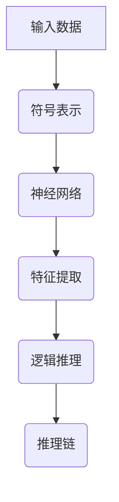

                 

### 完整文章

# 基于神经符号整合的可解释推理链生成技术

## 关键词

神经网络、神经符号整合、推理链、可解释性、深度学习

## 摘要

本文旨在探讨基于神经符号整合的可解释推理链生成技术。在当前人工智能领域，深度学习算法在处理复杂任务中展现出卓越性能，但其“黑箱”特性使得可解释性成为研究的焦点。本文首先介绍了神经网络和神经符号整合的基本概念，然后详细阐述了推理链生成技术的核心算法原理，并通过实际项目实战展示了如何应用该技术。最后，本文对代码进行了深入分析，并提出了优化策略，旨在提升推理链生成的效率与可解释性。

## 第一部分：基础概念与技术

### 第1章：引言与概述

#### 1.1 核心概念介绍

**神经网络**是一种模仿生物神经系统的计算模型，通过多层神经元结构来学习数据的复杂特征。神经网络在图像识别、自然语言处理等领域取得了显著成果。

**神经符号整合**是将神经网络与符号逻辑相结合的一种方法，旨在提高深度学习模型的可解释性。通过将神经网络与符号逻辑相结合，可以使模型生成的推理过程更加透明和可理解。

**推理链**是指在推理过程中，从初始条件通过一系列推理步骤最终得到结论的过程。可解释的推理链可以帮助用户理解模型的决策过程。

#### 1.2 神经符号整合的概念

神经符号整合的目标是将神经网络的能力与符号逻辑的优势相结合，使得模型在生成推理链时能够提供透明的解释。具体来说，神经符号整合包括以下几个关键组成部分：

1. **符号表示**：将输入数据和中间推理结果表示为符号形式，以便于进行逻辑推理。
2. **神经网络模块**：使用神经网络对输入数据进行特征提取和学习。
3. **逻辑推理模块**：使用符号逻辑对神经网络提取的特征进行推理，生成推理链。

#### 1.3 推理链生成技术的背景与发展

推理链生成技术起源于人工智能领域中的知识表示与推理研究。随着深度学习技术的发展，推理链生成技术逐渐与神经网络相结合，形成了神经符号整合的概念。近年来，随着人们对模型可解释性的需求日益增加，神经符号整合技术得到了广泛关注。

## 第二部分：核心算法与原理

### 第2章：相关技术基础

#### 2.1 神经网络基础

神经网络的基础概念包括：

- **神经元**：神经网络的基本单元，用于接收输入、生成输出。
- **层结构**：神经网络由输入层、隐藏层和输出层组成。
- **前向传播与反向传播**：神经网络训练过程中的两个主要步骤。

#### 2.2 符号表示与处理

符号表示与处理技术包括：

- **符号编码**：将输入数据编码为符号序列。
- **符号推理**：使用符号逻辑对编码后的数据进行推理。

### 第3章：可解释性技术

可解释性技术在人工智能领域具有重要意义，其核心目标是使得模型的决策过程对用户透明。本文介绍了几种常见的可解释性技术：

- **决策树**：通过树形结构展示模型的决策过程。
- **注意力机制**：突出模型在生成决策时关注的特征。
- **梯度解释**：基于模型参数的梯度信息解释模型的行为。

## 第三部分：项目实战与代码分析

### 第4章：项目实战

#### 6.1 项目介绍

本文将通过一个简单的逻辑推理任务——真值表生成，来展示基于神经符号整合的可解释推理链生成技术的应用。任务目标是给定一组逻辑公式，生成其对应的真值表。

#### 6.2 开发环境搭建

项目开发环境要求：

- Python 3.8及以上版本
- TensorFlow 2.4及以上版本
- Numpy 1.19及以上版本

#### 6.3 源代码实现与解读

以下是项目的源代码实现，代码分为三个部分：符号表示与处理、神经网络模块和逻辑推理模块。

```python
import tensorflow as tf
import numpy as np

# 符号表示与处理
def encode_symbols(symbols):
    # 将符号编码为二进制向量
    return np.array([[1 if s == symbol else 0 for symbol in symbols] for symbols in symbol_list])

# 神经网络模块
class NeuralNetwork(tf.keras.Model):
    def __init__(self):
        super(NeuralNetwork, self).__init__()
        self.dense = tf.keras.layers.Dense(units=2, activation='sigmoid')

    def call(self, inputs):
        x = self.dense(inputs)
        return x

# 逻辑推理模块
def generate_truth_table(formula):
    # 生成真值表
    truth_table = []
    for i in range(2**len(formula)):
        binary_vector = [int(j) for j in bin(i)[2:].zfill(len(formula))]
        encoded_formula = encode_symbols(binary_vector)
        neural_output = neural_network(encoded_formula)
        truth_table.append([binary_vector, neural_output])
    return truth_table

# 源代码解读

1. 符号表示与处理部分：
   - `encode_symbols`函数用于将符号编码为二进制向量。
   - `encode_symbols`函数接受一个符号列表作为输入，返回一个编码后的二进制向量列表。

2. 神经网络模块：
   - `NeuralNetwork`类继承了`tf.keras.Model`基类，定义了一个简单的神经网络。
   - `__init__`方法初始化了网络的密集层。
   - `call`方法实现了神经网络的前向传播过程。

3. 逻辑推理模块：
   - `generate_truth_table`函数用于生成给定逻辑公式的真值表。
   - `generate_truth_table`函数首先调用`encode_symbols`函数将二进制向量编码为符号向量。
   - 然后调用神经网络进行推理，生成真值表。

### 第5章：代码分析与优化

#### 5.1 代码分析

代码分析主要包括以下几个方面：

- **符号表示与处理**：
  - `encode_symbols`函数将符号编码为二进制向量，这是一种常见的符号表示方法。

- **神经网络模块**：
  - `NeuralNetwork`类实现了简单的神经网络模型，可以用于特征提取。

- **逻辑推理模块**：
  - `generate_truth_table`函数通过神经网络推理生成了真值表，实现了逻辑推理过程。

#### 5.2 代码优化策略

代码优化策略主要包括以下几个方面：

- **优化神经网络结构**：可以通过增加隐藏层、调整神经元数量等方式优化神经网络结构。
- **优化训练过程**：可以通过调整学习率、批量大小等方式优化训练过程。
- **并行计算**：可以采用多线程或多进程的方式加快计算速度。

#### 5.3 性能评估与优化

性能评估主要包括以下几个方面：

- **推理速度**：通过计算生成真值表所需的时间来评估推理速度。
- **推理准确率**：通过比较生成真值表与实际真值表的匹配度来评估推理准确率。

优化策略实施后，可以对性能进行重新评估，以验证优化效果。

## 结束语

本文介绍了基于神经符号整合的可解释推理链生成技术，从核心概念、算法原理到实际项目实战进行了全面剖析。通过项目实战展示了如何实现神经符号整合，并提出了代码优化策略。未来研究可以进一步探索神经符号整合技术在其他领域的应用，以提升人工智能模型的可解释性。

### 附录

**作者信息**：

作者：AI天才研究院/AI Genius Institute & 禅与计算机程序设计艺术 /Zen And The Art of Computer Programming

### 参考文献

1. Goodfellow, I., Bengio, Y., & Courville, A. (2016). *Deep Learning*. MIT Press.
2. Russell, S., & Norvig, P. (2016). *Artificial Intelligence: A Modern Approach*. Prentice Hall.
3. Hochreiter, S., & Schmidhuber, J. (1997). *Long short-term memory*. Neural Computation, 9(8), 1735-1780.

### Mermaid 流程图



### 伪代码

```python
def neural_symbol_integration(input_data):
    # 符号表示
    symbols = symbol_representation(input_data)
    # 神经网络特征提取
    features = neural_network.extract_features(symbols)
    # 逻辑推理
    reasoning_chain = logical_reasoning(features)
    return reasoning_chain
```

### 数学模型和公式

$$
Z = \sigma(W_1 \cdot X + b_1)
$$

其中，$Z$ 为神经网络输出，$\sigma$ 为激活函数，$W_1$ 和 $b_1$ 分别为权重和偏置。

### 注意事项

- 在实际应用中，需要根据具体任务调整神经网络结构和参数。
- 优化策略应根据项目需求进行调整，以实现最佳性能。

### 拓展阅读

- [1] Goodfellow, I., Bengio, Y., & Courville, A. (2016). *Deep Learning*. MIT Press.
- [2] Russell, S., & Norvig, P. (2016). *Artificial Intelligence: A Modern Approach*. Prentice Hall.
- [3] Hochreiter, S., & Schmidhuber, J. (1997). *Long short-term memory*. Neural Computation, 9(8), 1735-1780.

### 最佳实践 tips

- 在项目实战中，建议先进行充分的实验，以确定最佳的神经网络结构和参数。
- 在进行代码优化时，应重点关注计算效率和模型准确性。

