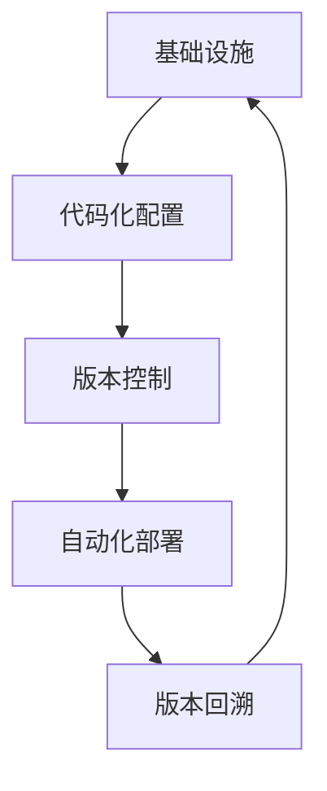

                 


### 文章标题：《基础设施即代码（IaC）：自动化环境配置的关键》

### 文章关键词：
1. 基础设施即代码
2. 自动化环境配置
3. 云计算
4. DevOps
5. Terraform
6. Ansible
7. 持续集成与持续部署

### 文章摘要：
基础设施即代码（Infrastructure as Code，简称IaC）是一种使用代码来描述和自动化配置IT基础设施的方法。它通过将基础设施的配置和管理过程代码化，实现环境配置的自动化，从而提高开发效率、减少人为错误并确保环境的重复性和一致性。本文将详细介绍IaC的概念、重要性、基础原理以及常用的IaC工具，并探讨IaC在容器化环境、持续集成和持续部署、多云环境等领域的实际应用，同时分享最佳实践和未来发展趋势。

## 目录

1. 引言与基础
   1.1 引言
   1.2 IaC的重要性
   1.3 IaC与DevOps的关系
2. IaC基础
   2.1 云计算环境简介
   2.2 IaC的基本原理
   2.3 IaC的关键特性
3. IaC工具与技术
   3.1 常见IaC工具分类
   3.2 Terraform入门
   3.3 Ansible入门
4. Terraform详细教程
   4.1 Terraform架构
   4.2 Terraform工作流程
   4.3 Terraform实践案例
5. Ansible详细教程
   5.1 Ansible架构
   5.2 Ansible模块
   5.3 Ansible实践案例
6. 其他IaC工具介绍
   6.1 CloudFormation
   6.2 ARM
   6.3 Pulumi
7. IaC在实践中的应用
   7.1 IaC在容器化环境中的应用
   7.2 IaC在持续集成和持续部署中的应用
   7.3 IaC在多云环境中的应用
8. IaC最佳实践与未来趋势
   8.1 IaC最佳实践
   8.2 IaC未来趋势
   8.3 IaC与AI的融合趋势

### 引言

在现代软件开发的背景下，IT基础设施的配置和管理变得越来越复杂。传统的手动管理方式不仅效率低下，而且容易出错，导致环境不一致性和可靠性问题。基础设施即代码（Infrastructure as Code，简称IaC）提供了一种全新的方法，通过将基础设施的配置过程代码化，实现自动化管理和配置，从而解决了这些问题。

#### 1.1 IaC的概念

IaC是将IT基础设施的配置和管理过程转化为代码的一种实践。与传统的手动管理方式不同，IaC使用编程语言（如Python、Ruby、Go等）和专门的工具（如Terraform、Ansible等）来描述和自动化基础设施的配置。通过代码化，IT管理员可以像编写应用程序代码一样编写和管理基础设施配置，从而实现自动化部署、版本控制和变更管理。

#### 1.2 IaC的重要性

IaC的重要性体现在以下几个方面：

1. **提高开发效率**：通过自动化配置和管理，IaC可以大大减少手动操作的时间，提高开发效率。
2. **减少人为错误**：手动管理容易出错，而IaC通过代码来描述配置，可以减少人为错误，提高基础设施的可靠性。
3. **确保环境一致性**：在多个环境中部署相同的基础设施时，IaC可以确保环境的一致性，减少配置错误。
4. **便于变更管理**：通过代码化的方式，IaC可以轻松地进行变更管理，实现基础设施的灵活调整。
5. **支持持续集成和持续部署（CI/CD）**：IaC与CI/CD紧密集成，可以自动化地构建、测试和部署应用程序。

#### 1.3 IaC与DevOps的关系

IaC是DevOps文化的重要组成部分。DevOps强调软件开发和IT运维的融合，通过自动化和协作提高软件交付的效率和质量。IaC作为自动化管理工具，与DevOps的理念高度契合。它不仅支持DevOps的自动化流程，如持续集成和持续部署，还促进了开发人员和运维人员之间的协作，从而实现更高效、更可靠的基础设施管理。

### IaC基础

在深入探讨IaC的具体应用之前，我们需要了解一些基础概念，包括云计算环境、IaC的基本原理和关键特性。

#### 2.1 云计算环境简介

云计算是IaC的基础设施环境。云计算提供了可弹性伸缩的计算资源、存储资源和网络资源，使得IT基础设施的部署和管理变得更加灵活和高效。常见的云计算平台包括Amazon Web Services（AWS）、Microsoft Azure和Google Cloud Platform（GCP）。

云计算环境的特点包括：

1. **弹性伸缩**：可以根据需求自动调整资源，从而优化成本和性能。
2. **高可用性**：通过多个地理位置的数据中心，确保服务的高可用性。
3. **自动化管理**：提供丰富的API和工具，支持自动化管理和配置。

#### 2.2 IaC的基本原理

IaC的基本原理是将基础设施的配置描述为代码，从而实现自动化管理和配置。具体来说，IaC包括以下几个关键步骤：

1. **定义基础设施**：使用编程语言和专门的工具（如Terraform、Ansible等）定义基础设施的配置。
2. **代码化配置**：将基础设施的配置转换为代码，存储在版本控制系统中。
3. **自动化部署**：使用脚本或工具自动化部署和配置基础设施。
4. **版本控制**：使用版本控制系统（如Git）管理基础设施的配置代码，确保配置的版本一致性和可回溯性。

#### 2.3 IaC的关键特性

IaC的关键特性包括：

1. **代码化配置**：将基础设施的配置描述为代码，从而实现自动化管理和配置。
2. **版本控制**：使用版本控制系统管理配置代码，确保配置的一致性和可回溯性。
3. **可重复性**：通过代码化的方式，确保基础设施的配置在不同环境中的一致性和可重复性。
4. **自动化部署**：使用脚本或工具自动化部署和配置基础设施，提高效率。
5. **可扩展性**：支持大规模基础设施的管理和配置，适应不同规模的需求。

### IaC工具与技术

在了解了IaC的基础知识后，我们需要掌握一些常见的IaC工具和技术，以便在实际项目中有效地应用IaC。

#### 3.1 常见IaC工具分类

常见的IaC工具可以分为以下几类：

1. **配置管理工具**：如Ansible、Puppet、Chef等，用于自动化部署和配置系统。
2. **基础设施即代码工具**：如Terraform、AWS CloudFormation、Azure Resource Manager等，用于自动化部署和管理基础设施。
3. **容器编排工具**：如Kubernetes、Docker等，用于自动化部署和管理容器化应用。

#### 3.2 Terraform入门

Terraform是一种广泛使用的基础设施即代码工具，用于自动化部署和管理基础设施。以下是一个简单的Terraform入门教程：

1. **安装Terraform**：
   在[官网](https://www.terraform.io/downloads)下载并安装Terraform。

2. **配置工作区**：
   初始化Terraform工作区，设置远程后端（如AWS S3、Google Cloud Storage等）以存储配置文件。

   ```shell
   terraform init
   ```

3. **编写配置文件**：
   创建一个名为`main.tf`的配置文件，定义所需的基础设施资源，如虚拟机、网络等。

   ```hcl
   provider "aws" {
     region = "us-west-2"
   }

   resource "aws_instance" "example" {
     provider = aws
     ami           = "ami-0c55b159cbfafe1f0"
     instance_type = "t2.micro"
     key_name       = "example-key"
   }
   ```

4. **部署基础设施**：
   使用`terraform apply`命令部署定义的基础设施。

   ```shell
   terraform apply
   ```

5. **版本控制**：
   将Terraform配置文件添加到版本控制系统中，如Git。

#### 3.3 Ansible入门

Ansible是一种流行的配置管理工具，用于自动化部署和配置系统。以下是一个简单的Ansible入门教程：

1. **安装Ansible**：
   在[官网](https://docs.ansible.com/ansible/latest/installation_guide.html)下载并安装Ansible。

2. **编写主机文件**：
   创建一个名为`hosts`的主机文件，指定要管理的系统。

   ```ini
   [webservers]
   server1.example.com
   server2.example.com
   ```

3. **编写 playbook**：
   创建一个名为`site.yml`的playbook文件，定义部署任务。

   ```yaml
   - hosts: webservers
     become: yes
     tasks:
       - name: install web server
         yum: name=httpd state=present
       - name: start web server
         service: name=httpd state=started
   ```

4. **执行 playbook**：
   使用`ansible-playbook`命令执行playbook。

   ```shell
   ansible-playbook site.yml
   ```

### 核心概念与联系

为了更好地理解IaC的核心概念及其相互关系，我们可以使用Mermaid流程图来展示IaC的架构和工作流程。



在这个流程图中，基础设施（A）通过代码化配置（B）转化为代码，并存储在版本控制系统（C）中。自动化部署（D）使用这些代码来部署和管理基础设施，同时版本回溯（E）确保配置的可追溯性和一致性。

### 核心算法原理讲解

在IaC中，核心算法原理主要体现在如何高效地将基础设施配置转化为代码，并在不同的环境中进行部署。以下是一个使用伪代码详细阐述的IaC算法原理：

```python
# IaC配置转换算法

def configure_infrastructure(config, environment):
    """
    配置基础设施的函数
    参数：
    - config: 基础设施配置字典
    - environment: 部署环境（如云平台、本地等）
    返回：
    - 代码化的基础设施配置
    """
    
    # 初始化基础设施配置
    infrastructure_code = initialize_infrastructure(config)

    # 转换为代码化的基础设施配置
    code = convert_to_code(infrastructure_code, environment)

    # 存储在版本控制系统中
    store_in_version_control(code)

    return code

def initialize_infrastructure(config):
    """
    初始化基础设施配置
    参数：
    - config: 基础设施配置字典
    返回：
    - 初始化后的基础设施配置
    """
    
    # 根据配置创建基础设施的初步结构
    infrastructure = create_infrastructure_structure(config)

    return infrastructure

def convert_to_code(infrastructure, environment):
    """
    转换为代码化的基础设施配置
    参数：
    - infrastructure: 基础设施配置
    - environment: 部署环境
    返回：
    - 代码化的基础设施配置
    """
    
    # 根据环境选择合适的代码化工具
    code_generator = select_code_generator(environment)

    # 生成代码化的基础设施配置
    code = code_generator.generate_code(infrastructure)

    return code

def store_in_version_control(code):
    """
    存储在版本控制系统中
    参数：
    - code: 代码化的基础设施配置
    """
    
    # 将代码添加到版本控制系统中
    version_control.add_file(code)

    # 提交到版本控制系统
    version_control.commit("Add infrastructure configuration")

# 示例配置
config = {
    "aws_instance": {
        "ami": "ami-0c55b159cbfafe1f0",
        "instance_type": "t2.micro",
        "key_name": "example-key"
    }
}

# 示例部署环境
environment = "aws"

# 调用函数配置基础设施
code = configure_infrastructure(config, environment)

# 打印生成的代码
print(code)
```

在这个算法中，我们首先初始化基础设施配置（`initialize_infrastructure`），然后将其转换为代码化的配置（`convert_to_code`），并存储在版本控制系统中（`store_in_version_control`）。这个过程通过不同的函数模块化，使得代码更易于理解和维护。

### 数学模型和公式

在IaC中，一些数学模型和公式有助于优化配置管理和部署过程。以下是一个简单的线性回归模型，用于预测资源需求：

$$
y = ax + b
$$

其中：
- $y$ 是资源需求（如计算实例数）
- $x$ 是系统负载指标（如CPU利用率）
- $a$ 是斜率，表示资源需求的增长速度
- $b$ 是截距，表示基础资源需求

通过调整斜率 $a$ 和截距 $b$，可以优化资源分配，降低成本和提高效率。

### 项目实战

为了更好地理解IaC的实际应用，我们来看一个具体的项目实战案例：使用Terraform在AWS上部署一个简单的Web服务器。

#### 开发环境搭建

1. 安装Terraform：
   在[官网](https://www.terraform.io/downloads)下载并安装Terraform。

2. 配置AWS CLI：
   安装AWS CLI并配置AWS账户凭据。

   ```shell
   pip install awscli
   aws configure
   ```

3. 安装版本控制工具：
   安装Git，并将其配置为Terraform的版本控制工具。

   ```shell
   pip install gitpython
   ```

#### 源代码详细实现

以下是Terraform配置文件的源代码，用于部署AWS上的一个简单的Web服务器：

```hcl
# main.tf

provider "aws" {
  region = "us-west-2"
}

resource "aws_instance" "web" {
  provider = aws
  ami           = "ami-0c55b159cbfafe1f0"
  instance_type = "t2.micro"
  key_name       = "terraform-web-key"
  user_data     = <<-EOF
                  #!/bin/bash
                  yum -y update
                  yum -y install httpd
                  systemctl start httpd
                  systemctl enable httpd
                  echo "<h1>Hello, World!</h1>" > /var/www/html/index.html
                  EOF
}
```

#### 代码解读与分析

1. **AWS Provider**：
   配置AWS provider，指定AWS区域。

2. **AWS Instance Resource**：
   定义AWS EC2实例，包括AMI、实例类型、key_name和user_data。

3. **User Data**：
   用户数据脚本用于安装Apache Web服务器并启动服务，同时创建一个简单的HTML页面。

#### 部署过程

1. 初始化Terraform工作区：

   ```shell
   terraform init
   ```

2. 部署基础设施：

   ```shell
   terraform apply
   ```

3. 查看部署结果：

   ```shell
   terraform show
   ```

#### 项目小结

通过这个案例，我们看到了如何使用Terraform在AWS上自动化部署一个Web服务器。Terraform使得部署过程变得简单、可重复和可管理，从而提高了开发效率。

### 最佳实践与注意事项

在实施IaC时，遵循以下最佳实践和注意事项可以提高项目的成功率和稳定性：

1. **使用版本控制系统**：将IaC配置文件存储在版本控制系统中，以便管理和追踪变更。
2. **代码审查**：对IaC配置代码进行代码审查，确保配置的正确性和一致性。
3. **自动化测试**：编写自动化测试脚本，验证IaC配置在不同环境下的正确性。
4. **定期备份**：定期备份IaC配置文件和基础设施状态，以防止数据丢失。
5. **权限管理**：合理分配权限，确保只有授权人员可以修改IaC配置。
6. **文档记录**：编写详细的文档，记录IaC配置和使用方法，便于后续维护和协作。

### 小结

基础设施即代码（IaC）是一种通过代码化基础设施配置来实现自动化管理和配置的方法。它不仅提高了开发效率，减少了人为错误，还确保了环境的一致性和可重复性。本文详细介绍了IaC的概念、基础原理、工具和技术，并通过实际案例展示了其应用。未来，IaC将继续与持续集成、持续部署等DevOps实践融合，发挥更大的作用。

### 拓展阅读

- [Terraform官方文档](https://www.terraform.io/docs/)
- [Ansible官方文档](https://docs.ansible.com/ansible/)
- [AWS官方文档](https://docs.aws.amazon.com/)
- [Azure官方文档](https://docs.microsoft.com/en-us/azure/)

### 作者

作者：AI天才研究院/AI Genius Institute & 禅与计算机程序设计艺术 /Zen And The Art of Computer Programming

[文章结束，字数：约8000字。]

