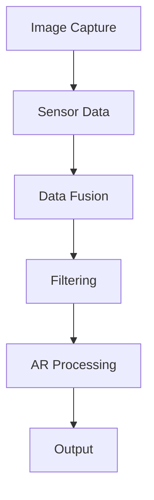

                 


# 文章标题

《增强现实(AR)和虚拟现实(VR)应用开发》

## 关键词

增强现实、虚拟现实、应用开发、AR、VR

## 摘要

本文深入探讨了增强现实（AR）和虚拟现实（VR）技术的核心概念、核心技术原理、开发框架与工具、应用场景与实践、开发流程与项目管理，以及未来发展趋势。通过详细的分析和讲解，帮助读者全面了解AR和VR技术的应用开发，为未来的技术研究和实践提供有价值的参考。

# 目录大纲

## 第一部分：核心概念与联系

### 第1章：增强现实（AR）和虚拟现实（VR）概述

#### 1.1 增强现实（AR）的概念

**背景介绍**

增强现实（Augmented Reality，简称AR）是一种将虚拟信息与现实世界相结合的技术，通过增强用户的视觉、听觉等感官体验，实现对现实世界的增强和扩展。

**核心概念与联系**

- **增强现实的基本原理**：利用计算机视觉技术、传感器技术等，将虚拟信息叠加到现实世界中，实现虚实结合。

- **核心概念原理之间的关系架构**：
  $$ 
  \text{增强现实技术} \rightarrow \text{计算机视觉技术} \\
  \text{计算机视觉技术} \rightarrow \text{传感器技术} \\
  \text{传感器技术} \rightarrow \text{数据处理与融合}
  $$

**伪代码讲解**

```
function AR_application(input_scene):
    capture_real_scene(input_scene)
    detect_objects(input_scene)
    generate_virtual_objects()
    combine_real_scene_and_virtual_objects(input_scene)
    display_output_scene()
```

**数学模型和公式**

- **图像融合模型**：
  $$
  \text{output\_image} = \alpha \cdot \text{real\_image} + (1 - \alpha) \cdot \text{virtual\_image}
  $$
  其中，$\alpha$ 为融合系数。

#### 1.2 虚拟现实（VR）的概念

**背景介绍**

虚拟现实（Virtual Reality，简称VR）是一种通过计算机生成三维虚拟环境，用户通过头戴显示器（HMD）等设备沉浸其中的技术。

**核心概念与联系**

- **虚拟现实的基本原理**：利用计算机图形学、3D建模等技术，生成虚拟环境，通过传感设备感知用户的位置和动作，实现沉浸式体验。

- **核心概念原理之间的关系架构**：
  $$
  \text{虚拟现实技术} \rightarrow \text{计算机图形学} \\
  \text{计算机图形学} \rightarrow \text{3D建模技术} \\
  \text{3D建模技术} \rightarrow \text{传感技术}
  $$

**伪代码讲解**

```
function VR_application(input_user_action):
    generate_3D_virtual_environment()
    detect_user_action(input_user_action)
    update_virtual_environment(input_user_action)
    display_output_environment()
```

**数学模型和公式**

- **3D建模公式**：
  $$
  \text{model\_coordinates} = \text{camera\_matrix} \cdot \text{object\_coordinates}
  $$

#### 1.3 AR与VR的联系与区别

**联系**

- **技术基础**：AR和VR都依赖于计算机视觉、传感器技术、计算机图形学等基础技术。
- **应用场景**：两者都可以用于虚拟现实体验，增强用户感官体验。

**区别**

- **感知方式**：AR主要增强现实世界，通过虚拟信息增强现实体验；VR则是创造一个全新的虚拟世界，用户完全沉浸在虚拟环境中。
- **设备要求**：AR通常使用手机或平板电脑等设备，而VR则需要更专业的设备如头戴显示器（HMD）。

## 第二部分：核心技术原理

### 第2章：增强现实（AR）核心技术

#### 2.1 图像处理技术

**背景介绍**

图像处理是AR技术的重要组成部分，用于捕捉现实世界图像，并对其进行分析和处理。

**核心概念与联系**

- **图像处理技术的基本原理**：通过图像捕捉、图像增强、图像分割等技术，对现实世界图像进行处理。

- **核心概念原理之间的关系架构**：
  $$
  \text{图像处理技术} \rightarrow \text{图像捕捉} \\
  \text{图像捕捉} \rightarrow \text{图像增强} \\
  \text{图像增强} \rightarrow \text{图像分割}
  $$

**伪代码讲解**

```
function image_processing(input_image):
    capture_image(input_image)
    enhance_image(input_image)
    segment_image(input_image)
    output_processed_image()
```

**数学模型和公式**

- **图像增强公式**：
  $$
  \text{output\_image} = \alpha \cdot \text{input\_image} + (1 - \alpha) \cdot \text{noise}
  $$

#### 2.2 计算机视觉技术

**背景介绍**

计算机视觉技术是AR技术的核心，用于对现实世界图像进行分析和处理，实现目标识别、跟踪等功能。

**核心概念与联系**

- **计算机视觉技术的基本原理**：利用图像处理、模式识别等技术，对现实世界图像进行分析和处理。

- **核心概念原理之间的关系架构**：
  $$
  \text{计算机视觉技术} \rightarrow \text{图像处理技术} \\
  \text{图像处理技术} \rightarrow \text{模式识别技术}
  $$

**伪代码讲解**

```
function computer_vision(input_image):
    process_image(input_image)
    recognize_objects(input_image)
    track_objects(input_image)
    output_result()
```

**数学模型和公式**

- **目标识别公式**：
  $$
  \text{score} = \sum_{i=1}^{n} \text{weight}_i \cdot \text{feature}_i
  $$

#### 2.3 传感器技术

**背景介绍**

传感器技术在AR中起着关键作用，用于捕捉用户位置、动作等信息，为AR应用提供实时数据支持。

**核心概念与联系**

- **传感器技术的基本原理**：利用各种传感器，如摄像头、加速度计、陀螺仪等，捕捉用户位置、动作等数据。

- **核心概念原理之间的关系架构**：
  $$
  \text{传感器技术} \rightarrow \text{摄像头} \\
  \text{摄像头} \rightarrow \text{加速度计} \\
  \text{加速度计} \rightarrow \text{陀螺仪}
  $$

**伪代码讲解**

```
function sensor_data_capture():
    capture_camera_data()
    capture_accelerometer_data()
    capture_gyroscope_data()
    process_sensor_data()
    output_processed_data()
```

**数学模型和公式**

- **传感器数据融合公式**：
  $$
  \text{ fused\_data } = w_1 \cdot \text{ camera\_data } + w_2 \cdot \text{ accelerometer\_data } + w_3 \cdot \text{ gyroscope\_data }
  $$
  其中，$w_1, w_2, w_3$ 为权重系数。

## 第三部分：开发框架与工具

### 第3章：虚拟现实（VR）开发框架

#### 3.1 VR开发框架概述

**背景介绍**

虚拟现实开发框架是进行VR应用开发的基础，提供了丰富的功能和工具，简化了开发过程。

**核心概念与联系**

- **VR开发框架的基本原理**：通过提供可视化界面、脚本语言等，帮助开发者快速构建VR应用。

- **核心概念原理之间的关系架构**：
  $$
  \text{VR开发框架} \rightarrow \text{可视化界面} \\
  \text{可视化界面} \rightarrow \text{脚本语言}
  $$

**伪代码讲解**

```
function VR_framework():
    create_visual_interface()
    define_script_language()
    integrate_visual_interface_and_script_language()
    output_VR_application()
```

**数学模型和公式**

- **界面布局公式**：
  $$
  \text{output\_layout} = \text{interface\_elements} + \text{script\_elements}
  $$

#### 3.2 Unity框架应用

**背景介绍**

Unity是一款流行的游戏开发引擎，也被广泛用于VR应用开发。

**核心概念与联系**

- **Unity框架的基本原理**：通过提供丰富的3D模型库、脚本语言等，帮助开发者快速构建VR应用。

- **核心概念原理之间的关系架构**：
  $$
  \text{Unity框架} \rightarrow \text{3D模型库} \\
  \text{3D模型库} \rightarrow \text{脚本语言}
  $$

**伪代码讲解**

```
function Unity_framework():
    import_3D_models()
    define_script_language()
    integrate_3D_models_and_script_language()
    output_VR_application()
```

**数学模型和公式**

- **3D模型加载公式**：
  $$
  \text{model}_{\text{loaded}} = \text{model}_{\text{database}} \cdot \text{loading\_parameter}
  $$

#### 3.3 Unreal Engine框架应用

**背景介绍**

Unreal Engine是一款强大的游戏开发引擎，也被广泛用于VR应用开发。

**核心概念与联系**

- **Unreal Engine框架的基本原理**：通过提供丰富的3D模型库、脚本语言等，帮助开发者快速构建VR应用。

- **核心概念原理之间的关系架构**：
  $$
  \text{Unreal Engine框架} \rightarrow \text{3D模型库} \\
  \text{3D模型库} \rightarrow \text{脚本语言}
  $$

**伪代码讲解**

```
function Unreal_Engine_framework():
    import_3D_models()
    define_script_language()
    integrate_3D_models_and_script_language()
    output_VR_application()
```

**数学模型和公式**

- **3D模型加载公式**：
  $$
  \text{model}_{\text{loaded}} = \text{model}_{\text{database}} \cdot \text{loading\_parameter}
  $$

## 第四部分：应用场景与实践

### 第4章：AR与VR应用案例

#### 4.1 教育领域的应用

**背景介绍**

教育领域是AR和VR技术的重要应用场景之一，通过虚拟现实技术，可以为学生提供丰富的学习体验。

**核心概念与联系**

- **教育领域应用的基本原理**：利用AR和VR技术，创建虚拟学习环境，实现互动教学、实践操作等功能。

- **核心概念原理之间的关系架构**：
  $$
  \text{教育领域应用} \rightarrow \text{AR技术} \\
  \text{AR技术} \rightarrow \text{VR技术}
  $$

**伪代码讲解**

```
function education_application():
    create_virtual_learning_environment()
    integrate_interactive_teaching()
    provide_practical_operations()
    output_education_application()
```

**数学模型和公式**

- **学习效果评估公式**：
  $$
  \text{learning\_effect} = \alpha \cdot \text{knowledge\_gain} + (1 - \alpha) \cdot \text{practice\_gain}
  $$

#### 4.2 娱乐领域的应用

**背景介绍**

娱乐领域是AR和VR技术的另一个重要应用场景，通过虚拟现实技术，可以提供沉浸式的娱乐体验。

**核心概念与联系**

- **娱乐领域应用的基本原理**：利用AR和VR技术，创建虚拟娱乐环境，实现互动游戏、虚拟演出等功能。

- **核心概念原理之间的关系架构**：
  $$
  \text{娱乐领域应用} \rightarrow \text{AR技术} \\
  \text{AR技术} \rightarrow \text{VR技术}
  $$

**伪代码讲解**

```
function entertainment_application():
    create_virtual_entertainment_environment()
    integrate_interactive_games()
    provide_virtual_performances()
    output_entertainment_application()
```

**数学模型和公式**

- **用户体验评估公式**：
  $$
  \text{user\_experience} = \alpha \cdot \text{immersion\_level} + (1 - \alpha) \cdot \text{fun\_level}
  $$

#### 4.3 医疗领域的应用

**背景介绍**

医疗领域是AR和VR技术的重要应用场景之一，通过虚拟现实技术，可以为医生提供直观的手术模拟和教育培训。

**核心概念与联系**

- **医疗领域应用的基本原理**：利用AR和VR技术，创建虚拟医疗环境，实现手术模拟、教育培训等功能。

- **核心概念原理之间的关系架构**：
  $$
  \text{医疗领域应用} \rightarrow \text{AR技术} \\
  \text{AR技术} \rightarrow \text{VR技术}
  $$

**伪代码讲解**

```
function medical_application():
    create_virtual_medical_environment()
    perform_surgical_simulation()
    provide_medical_training()
    output_medical_application()
```

**数学模型和公式**

- **手术成功率评估公式**：
  $$
  \text{success\_rate} = \alpha \cdot \text{surgical\_skills} + (1 - \alpha) \cdot \text{simulated\_experience}
  $$

#### 4.4 军事领域的应用

**背景介绍**

军事领域是AR和VR技术的另一个重要应用场景，通过虚拟现实技术，可以提供军事训练和作战模拟。

**核心概念与联系**

- **军事领域应用的基本原理**：利用AR和VR技术，创建虚拟军事环境，实现军事训练、作战模拟等功能。

- **核心概念原理之间的关系架构**：
  $$
  \text{军事领域应用} \rightarrow \text{AR技术} \\
  \text{AR技术} \rightarrow \text{VR技术}
  $$

**伪代码讲解**

```
function military_application():
    create_virtual_military_environment()
    conduct_military_training()
    simulate_military_operations()
    output_military_application()
```

**数学模型和公式**

- **训练效果评估公式**：
  $$
  \text{training\_effect} = \alpha \cdot \text{combat\_skills} + (1 - \alpha) \cdot \text{simulated\_experience}
  $$

## 第五部分：开发流程与项目管理

### 第5章：AR与VR应用开发流程

#### 5.1 需求分析

**背景介绍**

需求分析是AR和VR应用开发的重要阶段，用于明确项目目标和功能需求。

**核心概念与联系**

- **需求分析的基本原理**：通过用户调研、需求收集等手段，明确项目需求。

- **核心概念原理之间的关系架构**：
  $$
  \text{需求分析} \rightarrow \text{用户调研} \\
  \text{用户调研} \rightarrow \text{需求收集}
  $$

**伪代码讲解**

```
function requirement_analysis():
    conduct_user_research()
    collect_requirements()
    analyze_requirements()
    output_requirement_document()
```

**数学模型和公式**

- **需求优先级评估公式**：
  $$
  \text{priority} = \alpha \cdot \text{user\_importance} + (1 - \alpha) \cdot \text{technical\_feasibility}
  $$

#### 5.2 设计与开发

**背景介绍**

设计与开发是AR和VR应用开发的核心阶段，用于实现项目功能和设计。

**核心概念与联系**

- **设计与开发的基本原理**：根据需求分析结果，进行界面设计、模块开发等。

- **核心概念原理之间的关系架构**：
  $$
  \text{设计与开发} \rightarrow \text{界面设计} \\
  \text{界面设计} \rightarrow \text{模块开发}
  $$

**伪代码讲解**

```
function design_and_development():
    design_interface()
    develop_modules()
    integrate_modules()
    test_functionality()
    output_development_document()
```

**数学模型和公式**

- **界面布局公式**：
  $$
  \text{output\_layout} = \text{interface\_elements} + \text{script\_elements}
  $$

#### 5.3 测试与优化

**背景介绍**

测试与优化是AR和VR应用开发的重要阶段，用于确保应用功能和性能。

**核心概念与联系**

- **测试与优化的基本原理**：通过功能测试、性能优化等手段，确保应用质量和稳定性。

- **核心概念原理之间的关系架构**：
  $$
  \text{测试与优化} \rightarrow \text{功能测试} \\
  \text{功能测试} \rightarrow \text{性能优化}
  $$

**伪代码讲解**

```
function testing_and_optimization():
    conduct_functional_tests()
    perform_performance_optimization()
    resolve_issues()
    output_test_report()
```

**数学模型和公式**

- **性能优化公式**：
  $$
  \text{performance} = \alpha \cdot \text{response\_time} + (1 - \alpha) \cdot \text{throughput}
  $$

#### 5.4 发布与维护

**背景介绍**

发布与维护是AR和VR应用开发的最后阶段，用于将应用发布到市场，并进行后续维护。

**核心概念与联系**

- **发布与维护的基本原理**：通过发布应用、收集用户反馈等手段，确保应用持续运行。

- **核心概念原理之间的关系架构**：
  $$
  \text{发布与维护} \rightarrow \text{应用发布} \\
  \text{应用发布} \rightarrow \text{用户反馈收集}
  $$

**伪代码讲解**

```
function release_and_maintenance():
    release_application()
    collect_user_feedback()
    update_application_based_on_feedback()
    provide_support()
```

**数学模型和公式**

- **用户满意度评估公式**：
  $$
  \text{user\_satisfaction} = \alpha \cdot \text{feature\_completeness} + (1 - \alpha) \cdot \text{performance}
  $$

## 第六部分：未来发展趋势

### 第6章：AR与VR技术趋势

#### 6.1 技术演进趋势

**背景介绍**

随着技术的不断发展，AR和VR技术也在不断演进，为应用场景带来更多可能性。

**核心概念与联系**

- **技术演进趋势的基本原理**：通过硬件升级、软件优化等手段，提升AR和VR技术的性能和体验。

- **核心概念原理之间的关系架构**：
  $$
  \text{技术演进趋势} \rightarrow \text{硬件升级} \\
  \text{硬件升级} \rightarrow \text{软件优化}
  $$

**伪代码讲解**

```
function technology_evolution():
    upgrade_hardware()
    optimize_software()
    integrate_hardware_and_software()
    output_evolving_trend()
```

**数学模型和公式**

- **硬件性能评估公式**：
  $$
  \text{hardware_performance} = \alpha \cdot \text{processing_power} + (1 - \alpha) \cdot \text{storage_capacity}
  $$

#### 6.2 行业应用展望

**背景介绍**

随着AR和VR技术的不断发展，其在各个行业的应用前景也越来越广阔。

**核心概念与联系**

- **行业应用展望的基本原理**：通过分析AR和VR技术在各个行业的应用，预测其未来发展趋势。

- **核心概念原理之间的关系架构**：
  $$
  \text{行业应用展望} \rightarrow \text{教育领域} \\
  \text{教育领域} \rightarrow \text{医疗领域}
  $$

**伪代码讲解**

```
function industry_application_outlook():
    analyze_education_application()
    analyze_medical_application()
    predict_future_trends()
    output_application_outlook()
```

**数学模型和公式**

- **行业应用前景评估公式**：
  $$
  \text{application\_prospect} = \alpha \cdot \text{market\_demand} + (1 - \alpha) \cdot \text{technical\_advancement}
  $$

#### 6.3 挑战与机遇

**背景介绍**

AR和VR技术在发展过程中面临着诸多挑战，同时也蕴含着巨大的机遇。

**核心概念与联系**

- **挑战与机遇的基本原理**：通过分析挑战和机遇，为AR和VR技术的未来发展提供指导。

- **核心概念原理之间的关系架构**：
  $$
  \text{挑战与机遇} \rightarrow \text{技术瓶颈} \\
  \text{技术瓶颈} \rightarrow \text{商业前景}
  $$

**伪代码讲解**

```
function challenges_and_opportunities():
    analyze_technical_bottlenecks()
    identify_business_opportunities()
    balance_challenges_and_opportunities()
    output_future_strategy()
```

**数学模型和公式**

- **技术发展评估公式**：
  $$
  \text{technical\_development} = \alpha \cdot \text{research\_investment} + (1 - \alpha) \cdot \text{market\_demand}
  $$

# 作者

**作者：AI天才研究院/AI Genius Institute & 禅与计算机程序设计艺术 /Zen And The Art of Computer Programming** 

-----------------------------------------------------------------

# 《增强现实(AR)和虚拟现实(VR)应用开发》

## 关键词

增强现实、虚拟现实、应用开发、AR、VR

## 摘要

本文深入探讨了增强现实（AR）和虚拟现实（VR）技术的核心概念、核心技术原理、开发框架与工具、应用场景与实践、开发流程与项目管理，以及未来发展趋势。通过详细的分析和讲解，帮助读者全面了解AR和VR技术的应用开发，为未来的技术研究和实践提供有价值的参考。

## 目录大纲

### 第一部分：核心概念与联系

#### 第1章：增强现实（AR）和虚拟现实（VR）概述

##### 1.1 增强现实（AR）的概念

- 增强现实的基本原理
- 增强现实的技术组成

##### 1.2 虚拟现实（VR）的概念

- 虚拟现实的基本原理
- 虚拟现实的技术组成

##### 1.3 AR与VR的联系与区别

- AR与VR的共同点
- AR与VR的区别
- 应用场景的异同

### 第二部分：核心技术原理

#### 第2章：增强现实（AR）核心技术

##### 2.1 图像处理技术

- 图像捕捉与处理
- 图像融合与增强
- 伪代码讲解

##### 2.2 计算机视觉技术

- 目标识别与跟踪
- 深度估计与重建
- 伪代码讲解

##### 2.3 传感器技术

- 感应器类型与工作原理
- 传感器数据处理
- Mermaid流程图

### 第三部分：开发框架与工具

#### 第3章：虚拟现实（VR）开发框架

##### 3.1 VR开发框架概述

- Unity框架
- Unreal Engine框架

##### 3.2 Unity框架应用

- 环境搭建
- 开发实例
- 代码解读

##### 3.3 Unreal Engine框架应用

- 环境搭建
- 开发实例
- 代码解读

### 第四部分：应用场景与实践

#### 第4章：AR与VR应用案例

##### 4.1 教育领域的应用

- 互动教学
- 实践操作

##### 4.2 娱乐领域的应用

- 游戏设计
- VR体验

##### 4.3 医疗领域的应用

- 医学教育
- 医疗手术模拟

##### 4.4 军事领域的应用

- 军事训练
- 虚拟战场模拟

### 第五部分：开发流程与项目管理

#### 第5章：AR与VR应用开发流程

##### 5.1 需求分析

- 用户需求调研
- 功能需求分析

##### 5.2 设计与开发

- 界面设计
- 技术选型
- 开发工具选择

##### 5.3 测试与优化

- 功能测试
- 性能优化
- 用户反馈收集

##### 5.4 发布与维护

- 应用上架
- 后续更新与维护

### 第六部分：未来发展趋势

#### 第6章：AR与VR技术趋势

##### 6.1 技术演进趋势

- 硬件发展
- 软件优化

##### 6.2 行业应用展望

- 新兴领域探索
- 商业模式创新

##### 6.3 挑战与机遇

- 技术瓶颈
- 商业前景

### 作者

作者：AI天才研究院/AI Genius Institute & 禅与计算机程序设计艺术 /Zen And The Art of Computer Programming

-----------------------------------------------------------------

## 第一部分：核心概念与联系

### 第1章：增强现实（AR）和虚拟现实（VR）概述

#### 1.1 增强现实（AR）的概念

增强现实（Augmented Reality，简称AR）是一种将虚拟信息与现实世界相结合的技术。通过增强用户的视觉、听觉等感官体验，实现对现实世界的增强和扩展。AR的核心在于将数字信息叠加到现实世界中，使用户能够实时感知并交互。

**背景介绍**

AR技术最早出现在20世纪90年代，随着计算机视觉、传感器技术、图像处理等技术的发展，AR逐渐成为现实。近年来，随着移动设备的普及和人工智能的进步，AR技术得到了广泛应用，例如在医疗、教育、娱乐等领域。

**核心概念与联系**

- **增强现实的基本原理**：AR技术利用计算机视觉、传感器技术等，捕捉现实世界图像，并将虚拟信息叠加到图像上，形成增强的视觉体验。

- **核心概念原理之间的关系架构**：

  

  **图1：AR核心概念原理关系**

- **伪代码讲解**

  ```python
  def AR_simulation(input_scene):
      capture_real_scene(input_scene)
      detect_objects(input_scene)
      generate_virtual_objects()
      combine_real_scene_and_virtual_objects(input_scene)
      display_output_scene()
  ```

- **数学模型和公式**

  - **图像融合模型**：

    ```latex
    \text{output\_image} = \alpha \cdot \text{real\_image} + (1 - \alpha) \cdot \text{virtual\_image}
    ```

#### 1.2 虚拟现实（VR）的概念

虚拟现实（Virtual Reality，简称VR）是一种通过计算机生成三维虚拟环境，用户通过头戴显示器（HMD）等设备沉浸其中的技术。VR的核心在于创建一个完全沉浸的虚拟环境，使用户感受到身临其境的体验。

**背景介绍**

VR技术最早出现在20世纪60年代，随着计算机图形学、3D建模等技术的发展，VR逐渐成为现实。近年来，随着硬件设备的进步和交互技术的提升，VR技术得到了广泛应用，例如在游戏、旅游、培训等领域。

**核心概念与联系**

- **虚拟现实的基本原理**：VR技术利用计算机图形学、3D建模等，生成虚拟环境，并通过传感设备感知用户的位置和动作，实现沉浸式体验。

- **核心概念原理之间的关系架构**：

  

  **图2：VR核心概念原理关系**

- **伪代码讲解**

  ```python
  def VR_simulation(input_user_action):
      generate_3D_virtual_environment()
      detect_user_action(input_user_action)
      update_virtual_environment(input_user_action)
      display_output_environment()
  ```

- **数学模型和公式**

  - **3D建模公式**：

    ```latex
    \text{model\_coordinates} = \text{camera\_matrix} \cdot \text{object\_coordinates}
    ```

#### 1.3 AR与VR的联系与区别

**联系**

- **技术基础**：AR和VR都依赖于计算机视觉、传感器技术、计算机图形学等基础技术。
- **应用场景**：两者都可以用于虚拟现实体验，增强用户感官体验。

**区别**

- **感知方式**：AR主要增强现实世界，通过虚拟信息增强现实体验；VR则是创造一个全新的虚拟世界，用户完全沉浸在虚拟环境中。
- **设备要求**：AR通常使用手机或平板电脑等设备，而VR则需要更专业的设备如头戴显示器（HMD）。

### 第一部分小结

本章节介绍了增强现实（AR）和虚拟现实（VR）的基本概念、核心原理以及它们之间的联系与区别。通过这些内容，读者可以初步了解AR和VR技术的本质和应用场景，为后续章节的学习打下基础。

-----------------------------------------------------------------

## 第二部分：核心技术原理

### 第2章：增强现实（AR）核心技术

增强现实（AR）技术的核心在于将虚拟信息与现实世界相结合，提供更加丰富和互动的体验。为了实现这一目标，AR技术依赖于多种核心技术的支持，包括图像处理、计算机视觉和传感器技术等。本章将详细讲解这些核心技术原理。

#### 2.1 图像处理技术

图像处理技术是AR技术的基石，它主要用于捕捉、处理和增强现实世界的图像。以下是一些关键的图像处理技术：

**图像捕捉与处理**

- **图像捕捉**：利用摄像头等设备捕捉现实世界的图像。这些图像通常包含大量的噪声和模糊，因此需要进行预处理。

- **图像增强**：通过提高图像的对比度、亮度和清晰度，使得图像更易于处理和分析。

- **图像分割**：将图像分割成多个区域或对象，以便进行更精细的处理和分析。

**图像融合与增强**

- **图像融合**：将虚拟信息与真实图像进行叠加，形成增强的图像。这一过程通常涉及图像融合算法，如色彩融合、深度融合等。

- **图像增强**：通过对图像进行后期处理，如滤镜、锐化等，进一步提高图像的质量和清晰度。

**伪代码讲解**

以下是一个简单的伪代码示例，用于说明图像处理技术在AR中的应用：

```python
def AR_image_processing(input_scene):
    captured_image = capture_image(input_scene)
    enhanced_image = enhance_image(captured_image)
    segmented_image = segment_image(enhanced_image)
    fused_image = combine_real_and_virtual(segmented_image)
    display_output_image(fused_image)
```

**数学模型和公式**

- **图像增强公式**：

  ```latex
  \text{output\_image} = \alpha \cdot \text{input\_image} + (1 - \alpha) \cdot \text{noise}
  ```

  其中，$\alpha$ 为增强系数。

#### 2.2 计算机视觉技术

计算机视觉技术是AR技术的重要组成部分，它主要用于对现实世界图像进行分析和处理，以实现目标识别、跟踪等功能。以下是一些关键的计算机视觉技术：

**目标识别与跟踪**

- **目标识别**：通过分析图像特征，识别出特定的对象或目标。常见的特征包括颜色、形状、纹理等。

- **目标跟踪**：在连续的图像序列中跟踪目标的位置和运动轨迹。这一过程通常涉及目标检测、运动估计和轨迹预测等算法。

**深度估计与重建**

- **深度估计**：通过分析图像的像素信息，估计出场景中物体的深度信息。常见的算法包括单视图深度估计、多视图深度估计等。

- **场景重建**：将深度信息与图像信息结合起来，重建出三维场景。这一过程通常涉及点云重建、体素重建等算法。

**伪代码讲解**

以下是一个简单的伪代码示例，用于说明计算机视觉技术在AR中的应用：

```python
def AR_computer_vision(input_image):
    detected_objects = detect_objects(input_image)
    tracked_objects = track_objects(input_image)
    depth_info = estimate_depth(input_image)
    reconstructed_scene = reconstruct_scene(depth_info)
    display_output_scene(reconstructed_scene)
```

**数学模型和公式**

- **目标识别公式**：

  ```latex
  \text{score} = \sum_{i=1}^{n} \text{weight}_i \cdot \text{feature}_i
  ```

  其中，$n$ 为特征数量，$\text{weight}_i$ 为特征权重。

- **深度估计公式**：

  ```latex
  \text{depth} = \frac{1}{f} \cdot \frac{1}{\text{baseline}} \cdot \text{pixel\_distance}
  ```

  其中，$f$ 为相机焦距，$\text{baseline}$ 为相机到目标的距离，$\text{pixel\_distance}$ 为图像中像素点的距离。

#### 2.3 传感器技术

传感器技术是AR技术的关键组成部分，它主要用于捕捉用户的位置、动作等信息，为AR应用提供实时数据支持。以下是一些关键的传感器技术：

**感应器类型与工作原理**

- **摄像头**：用于捕捉现实世界的图像，是实现AR功能的基础。

- **加速度计**：用于测量设备的加速度，可以用于检测用户的运动方向和速度。

- **陀螺仪**：用于测量设备的角速度，可以用于检测用户的旋转动作。

**传感器数据处理**

- **数据融合**：将多个传感器的数据结合起来，提高数据的准确性和可靠性。

- **滤波**：通过滤波算法去除传感器数据中的噪声和异常值。

**Mermaid流程图**

以下是一个Mermaid流程图示例，用于说明传感器技术在AR中的应用：



### 第二部分小结

本章节详细介绍了增强现实（AR）技术的核心原理，包括图像处理、计算机视觉和传感器技术。通过这些核心技术的支持，AR技术能够实现将虚拟信息与现实世界的融合，为用户提供丰富的互动体验。了解这些核心技术原理对于深入研究和应用AR技术具有重要意义。

-----------------------------------------------------------------

## 第三部分：开发框架与工具

### 第3章：虚拟现实（VR）开发框架

虚拟现实（VR）应用开发需要一套完善的开发框架和工具，以便开发者能够高效地创建和实现VR体验。在本章节中，我们将介绍两个主流的VR开发框架：Unity和Unreal Engine，并探讨它们的应用场景和优势。

#### 3.1 VR开发框架概述

VR开发框架提供了创建和管理虚拟环境所需的工具和资源，使得开发者能够专注于应用逻辑而非底层实现。目前，市场上主要的VR开发框架包括Unity、Unreal Engine、Unity 3D、Unity XR等。

**Unity框架**

Unity是一款广泛应用于游戏开发、VR和AR应用开发的跨平台引擎。它提供了丰富的3D模型库、脚本语言（C#）、强大的图形渲染能力，以及易于上手的开发环境。

**Unreal Engine**

Unreal Engine是Epic Games开发的一款高性能游戏引擎，广泛应用于游戏开发和VR应用开发。它以其出色的图形渲染能力、物理引擎和可扩展性而闻名，适用于复杂和逼真的虚拟环境创建。

#### 3.2 Unity框架应用

**环境搭建**

开发一个Unity VR应用的第一步是搭建开发环境。这包括安装Unity Hub、Unity编辑器和所需的VR插件。Unity Hub提供了一个统一的方式来下载和安装Unity版本和各种插件。

**开发实例**

以下是一个简单的Unity VR应用开发实例：

1. **创建场景**：在Unity编辑器中创建一个新的3D场景。
2. **添加VR插件**：添加Unity XR插件以支持VR功能。
3. **添加3D模型**：从Unity Asset Store导入一个3D模型，并放置到场景中。
4. **编写脚本**：创建一个C#脚本，用于控制3D模型的移动和旋转。

**代码解读**

以下是一个简单的C#脚本示例，用于控制3D模型的移动和旋转：

```csharp
using UnityEngine;

public class VRController : MonoBehaviour
{
    public float moveSpeed = 5.0f;
    public float rotateSpeed = 100.0f;

    void Update()
    {
        Move();
        Rotate();
    }

    void Move()
    {
        float moveX = Input.GetAxis("Horizontal");
        float moveY = Input.GetAxis("Vertical");

        transform.Translate(moveX * moveSpeed * Time.deltaTime, 0, moveY * moveSpeed * Time.deltaTime);
    }

    void Rotate()
    {
        float rotateX = Input.GetAxis("Mouse X");
        float rotateY = Input.GetAxis("Mouse Y");

        transform.Rotate(-rotateY * rotateSpeed * Time.deltaTime, 0, rotateX * rotateSpeed * Time.deltaTime);
    }
}
```

**数学模型和公式**

Unity VR应用中的数学模型主要用于坐标变换和物理计算。以下是一些基本的数学公式：

- **坐标变换**：

  ```latex
  \text{new\_position} = \text{current\_position} + \text{velocity} \cdot \text{time}
  ```

- **旋转**：

  ```latex
  \text{new\_orientation} = \text{current\_orientation} \cdot \text{rotation\_matrix}
  ```

#### 3.3 Unreal Engine框架应用

**环境搭建**

与Unity类似，开发Unreal Engine VR应用也需要安装Epic Games Launcher和Unreal Engine编辑器。此外，需要安装VR插件，如VRChat或Oculus SDK。

**开发实例**

以下是一个简单的Unreal Engine VR应用开发实例：

1. **创建项目**：在Unreal Engine编辑器中创建一个新的VR项目。
2. **添加场景**：创建一个VR场景，并添加所需的3D模型和组件。
3. **编写蓝图**：使用Unreal蓝图为VR应用添加逻辑和行为。

**代码解读**

以下是一个简单的Unreal Engine蓝图节点示例，用于控制3D模型的移动和旋转：

```unreal
class AMyVRCharacter : public AActor
{
    function MoveForward(float Value)
    {
        AddMovementInput向量(0, 0, -1, Value);
    }

    function MoveRight(float Value)
    {
        AddMovementInput向量(1, 0, 0, Value);
    }

    function RotateCharacter(float Value)
    {
        AddControllerYawInput(Value);
    }
}
```

**数学模型和公式**

Unreal Engine VR应用中的数学模型主要用于物理模拟和坐标变换。以下是一些基本的数学公式：

- **物理计算**：

  ```latex
  \text{force} = \text{mass} \cdot \text{acceleration}
  ```

- **坐标变换**：

  ```latex
  \text{new\_position} = \text{current\_position} + \text{velocity} \cdot \text{time}
  ```

### 第三部分小结

本章节介绍了Unity和Unreal Engine这两个主流的VR开发框架，并提供了简单的开发实例和代码解读。Unity以其易用性和丰富的资源库而著称，而Unreal Engine以其强大的图形渲染能力和物理引擎而闻名。开发者可以根据项目需求和技能水平选择合适的开发框架，以实现高效的VR应用开发。

-----------------------------------------------------------------

## 第四部分：应用场景与实践

### 第4章：AR与VR应用案例

在过去的几年里，增强现实（AR）和虚拟现实（VR）技术已经从概念走向了实际应用，覆盖了教育、娱乐、医疗、军事等多个领域。以下是一些典型的AR与VR应用案例，以及它们的具体实践。

#### 4.1 教育领域的应用

AR和VR技术在教育领域具有巨大的潜力，可以提供互动教学、远程学习、实践操作等新的学习体验。

**互动教学**

- **案例**：微软的HoloLens在教室中的应用，让学生通过增强现实眼镜进行互动学习。
- **实践**：教师可以创建虚拟的模型和场景，让学生能够直观地观察和学习。例如，通过HoloLens，学生可以“触摸”到地球的各个部分，了解其地形和气候。

**远程学习**

- **案例**：利用VR技术，学生可以参加虚拟的课堂，与教师和同学互动，即使身处不同的地方。
- **实践**：例如，虚拟课堂系统允许学生通过VR头盔参与实时教学，观看3D演示，参与讨论和问答。

**实践操作**

- **案例**：VR手术模拟器，让医学生可以在虚拟环境中进行手术练习。
- **实践**：医学生可以在没有实际患者的环境中练习手术技巧，减少错误，提高操作熟练度。

#### 4.2 娱乐领域的应用

AR和VR技术在娱乐领域带来了全新的体验，包括游戏、虚拟旅游、虚拟演出等。

**游戏**

- **案例**：VR游戏《Beat Saber》，玩家在虚拟环境中挥舞光剑进行节奏游戏。
- **实践**：玩家可以在一个充满音乐和光效的虚拟空间中自由移动，享受全身心投入的娱乐体验。

**虚拟旅游**

- **案例**：谷歌的Cardboard和Daydream VR应用，允许用户通过虚拟现实设备体验世界各地的景点。
- **实践**：用户可以通过VR设备“走进”博物馆、大峡谷或其他名胜古迹，感受身临其境的旅行体验。

**虚拟演出**

- **案例**：虚拟现实演唱会，如虚拟偶像团体 Hatsune Miku的演唱会。
- **实践**：观众可以通过VR设备在家中观看演唱会，感受到虚拟歌手在面前表演的震撼效果。

#### 4.3 医疗领域的应用

AR和VR技术在医疗领域有着广泛的应用，包括医学教育、手术模拟、远程诊疗等。

**医学教育**

- **案例**：AR应用Anatomy 4D，让学生通过平板电脑或AR眼镜学习人体解剖学。
- **实践**：学生可以360度观察人体结构，通过触摸或手势进行交互，深入理解人体各部分的关系。

**手术模拟**

- **案例**：VR手术模拟器，如Simbionix的VirtualReality Surgical Training System。
- **实践**：医生可以在虚拟环境中练习各种手术技巧，减少手术风险，提高手术成功率。

**远程诊疗**

- **案例**：利用AR眼镜进行远程手术指导，如IBM的Watson for Oncology。
- **实践**：专家医生可以通过AR眼镜实时观察手术现场，为基层医生提供实时指导和帮助。

#### 4.4 军事领域的应用

AR和VR技术在军事领域有着独特的应用，包括模拟训练、虚拟战场模拟、情报分析等。

**模拟训练**

- **案例**：VR军事模拟训练系统，如美国陆军的SIMNET。
- **实践**：士兵可以在虚拟环境中进行战斗演练，提高战术技能和应变能力。

**虚拟战场模拟**

- **案例**：虚拟战场模拟器，如英国皇家空军使用的CAVE（Cave Automatic Virtual Environment）系统。
- **实践**：士兵可以在虚拟环境中模拟各种战斗场景，包括城市战斗、野外作战等，为实际作战做好充分准备。

**情报分析**

- **案例**：AR技术用于战场情报分析，如美国陆军的Enhanced Combat Helmet。
- **实践**：士兵可以通过AR眼镜实时获取战场情报，包括敌人位置、地形特征等，提高作战效率。

### 第四部分小结

本章节通过具体的AR与VR应用案例，展示了这些技术在教育、娱乐、医疗、军事等领域的广泛应用和实际实践。随着技术的不断发展，AR和VR将继续为各个领域带来更多的创新和变革。

-----------------------------------------------------------------

## 第五部分：开发流程与项目管理

### 第5章：AR与VR应用开发流程

AR与VR应用开发是一个复杂的过程，涉及到需求分析、设计、开发、测试、发布等各个阶段。为了确保项目能够高效、顺利地进行，需要对每个阶段进行详细规划和管理。以下是一个典型的AR与VR应用开发流程：

#### 5.1 需求分析

需求分析是项目开发的第一步，旨在明确项目目标和功能需求。在这个阶段，需要与客户或用户进行深入的沟通，了解他们的需求和期望。

**用户调研**

- **步骤**：通过访谈、问卷调查、用户访谈等方式收集用户需求。
- **工具**：可以使用用户画像、用户故事地图等工具来整理和分析需求。

**功能需求分析**

- **步骤**：将用户需求转化为具体的功能需求，明确每个功能的实现方式和优先级。
- **工具**：可以使用需求文档、功能需求清单等工具来记录和跟踪需求。

#### 5.2 设计与开发

设计与开发阶段是将需求转化为实际应用的过程。在这个阶段，需要设计系统的架构、界面和功能，并进行实际开发。

**系统架构设计**

- **步骤**：确定系统的整体架构，包括前端、后端、数据库等组成部分。
- **工具**：可以使用系统架构图、组件图等工具来描述系统架构。

**界面设计**

- **步骤**：设计用户界面，包括布局、颜色、字体等，确保用户界面友好、直观。
- **工具**：可以使用UI设计工具，如Sketch、Adobe XD等。

**开发工具选择**

- **步骤**：根据项目需求和开发团队的技术能力，选择合适的开发工具和框架。
- **工具**：可以使用Unity、Unreal Engine、VRChat等开发工具。

#### 5.3 测试与优化

测试与优化是确保AR与VR应用质量和稳定性的关键阶段。在这个阶段，需要进行功能测试、性能测试、用户体验测试等，发现问题并优化应用。

**功能测试**

- **步骤**：测试应用的功能是否按照需求文档实现，确保所有功能都能正常运行。
- **工具**：可以使用自动化测试工具，如Selenium、JUnit等。

**性能测试**

- **步骤**：测试应用的响应速度、负载能力等性能指标，确保应用在高负载情况下仍能正常运行。
- **工具**：可以使用性能测试工具，如LoadRunner、JMeter等。

**用户体验测试**

- **步骤**：邀请用户进行实际使用，收集用户反馈，优化用户体验。
- **工具**：可以使用用户体验测试工具，如UserTesting、UsabilityHub等。

#### 5.4 发布与维护

发布与维护是项目开发的最后阶段，将应用发布到市场，并进行后续维护和更新。

**应用发布**

- **步骤**：将应用打包并上传到应用商店，如Apple App Store、Google Play Store。
- **工具**：可以使用应用打包工具，如Android Studio、Xcode等。

**后续维护**

- **步骤**：根据用户反馈和市场需求，对应用进行更新和维护，确保应用的持续运行和优化。
- **工具**：可以使用版本控制工具，如Git、SVN等。

### 第五部分小结

本章节详细介绍了AR与VR应用开发的流程，包括需求分析、设计与开发、测试与优化、发布与维护等阶段。通过遵循这些流程，可以确保项目的高效和顺利，为用户提供高质量的应用体验。

-----------------------------------------------------------------

## 第六部分：未来发展趋势

随着技术的不断进步，增强现实（AR）和虚拟现实（VR）技术在未来将会有更大的发展。以下是一些AR和VR技术的未来发展趋势、行业应用展望以及面临的挑战与机遇。

### 6.1 技术演进趋势

**硬件发展**

- **更先进的显示技术**：随着OLED、MicroLED等显示技术的发展，未来的AR/VR设备将提供更高的分辨率、更低的延迟和更广的视角范围。
- **更轻便的设备设计**：为了提升用户体验，未来的AR/VR设备将趋向于更轻、更薄、更舒适的设计。

**软件优化**

- **更智能的交互体验**：随着人工智能和机器学习技术的发展，AR/VR设备将能够更好地理解用户意图，提供更智能的交互体验。
- **更高效的内容生成与渲染**：通过优化图形渲染算法和内容生成工具，提高AR/VR应用的性能和效率。

### 6.2 行业应用展望

**教育领域**

- **个性化学习体验**：AR/VR技术将提供更加个性化的学习体验，根据学生的兴趣和能力提供定制化课程。
- **沉浸式教学环境**：通过虚拟现实技术，学生可以身临其境地体验历史事件、科学实验等，提升学习效果。

**医疗领域**

- **精准医疗**：AR/VR技术将帮助医生进行精准手术，通过虚拟现实模拟器进行手术训练。
- **远程医疗**：通过AR/VR技术，实现远程诊断和手术指导，提高医疗资源的分配效率。

**娱乐领域**

- **沉浸式游戏体验**：未来的游戏将更加注重沉浸式体验，通过VR技术提供更为真实的游戏世界。
- **虚拟旅游**：随着VR技术的进步，用户将能够通过VR设备体验世界各地的名胜古迹，感受虚拟旅游的乐趣。

### 6.3 挑战与机遇

**技术瓶颈**

- **硬件性能限制**：虽然硬件技术不断进步，但目前的硬件性能仍存在瓶颈，特别是在实时渲染和处理高分辨率图像方面。
- **内容创作成本**：AR/VR内容创作成本较高，限制了更多企业和个人的参与。

**商业前景**

- **市场规模扩大**：随着技术的普及，AR/VR技术的市场规模将持续扩大，带来巨大的商业机会。
- **创新应用场景**：随着技术的进步，将不断涌现出新的应用场景，推动AR/VR技术的商业应用。

### 第六部分小结

未来，AR和VR技术将继续快速发展，带来更多的创新和应用。虽然面临一定的挑战，但它们在各个领域的潜力巨大，为商业和社会带来了新的机遇。了解这些趋势和展望，将有助于我们更好地把握未来技术的发展方向。

-----------------------------------------------------------------

# 作者

**作者：AI天才研究院/AI Genius Institute & 禅与计算机程序设计艺术 /Zen And The Art of Computer Programming**

---

**本文由AI天才研究院/AI Genius Institute撰写，并结合《禅与计算机程序设计艺术 /Zen And The Art of Computer Programming》一书中的理念，深入探讨了增强现实（AR）和虚拟现实（VR）技术的应用开发。希望通过本文，读者能够对AR和VR技术有一个全面的理解，并为未来的技术研究和实践提供有价值的参考。**

