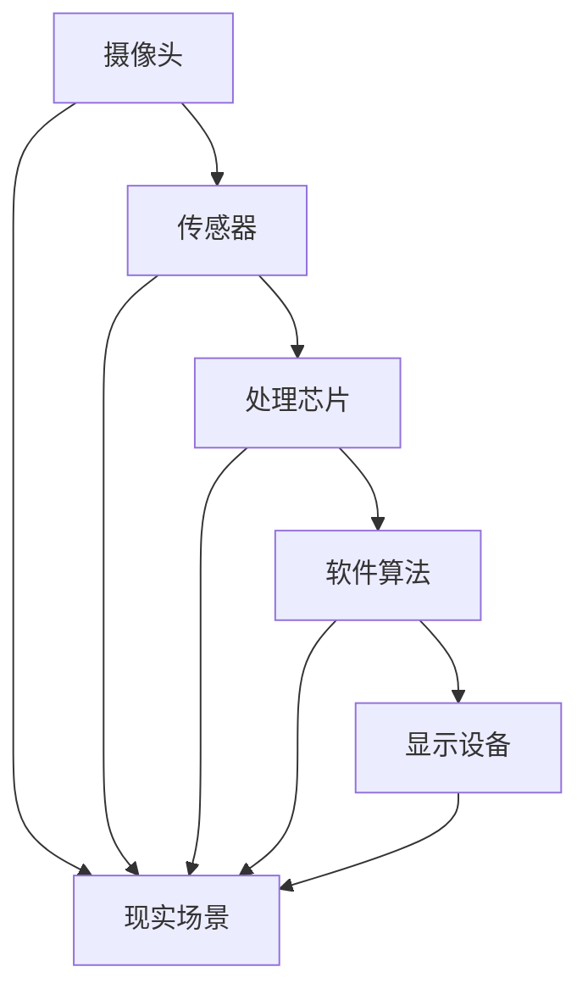
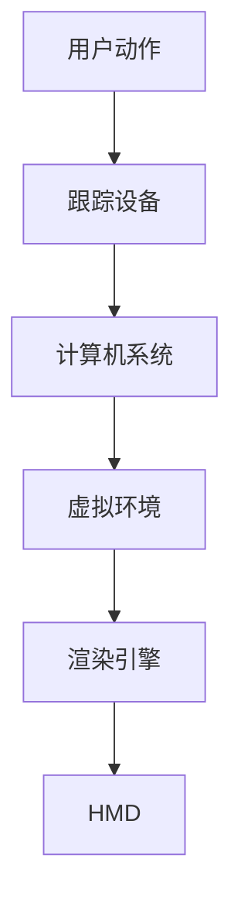

                 


### 文章标题：增强现实(AR)和虚拟现实(VR)开发入门

#### 关键词：增强现实，虚拟现实，AR，VR，开发，入门

> 摘要：本文将带领读者深入探索增强现实(AR)和虚拟现实(VR)技术的核心概念、应用案例、开发工具与平台，以及项目实战。通过逻辑清晰、结构紧凑的讲解，帮助读者全面了解AR和VR技术的原理与应用，开启开发新世界的大门。

### 一、引言

#### 1.1 行业背景

在当今数字化时代，增强现实(AR)和虚拟现实(VR)技术正迅速崛起，成为各行各业的重要技术支撑。AR和VR技术不仅改变了我们的生活方式，还为多个领域带来了巨大的变革。从游戏娱乐、教育培训到医疗保健、建筑设计，AR和VR技术的应用无处不在。

#### 1.2 AR和VR技术的基本概念

**增强现实(AR)**：通过将数字信息叠加到现实世界中，增强用户对现实世界的感知。常见的AR应用有智能手机上的滤镜、地图导航等。

**虚拟现实(VR)**：创造一个完全沉浸式的虚拟环境，使用户感觉仿佛置身于另一个世界。VR技术广泛应用于游戏、虚拟旅游、虚拟培训等领域。

### 二、增强现实(AR)技术基础

#### 2.1 AR技术原理

**2.1.1 增强现实的基本概念**

增强现实(AR)是一种将数字信息与现实世界相结合的技术。通过使用摄像头、传感器等硬件设备，将虚拟图像与现实环境实时融合，提供更加丰富的交互体验。

**2.1.2 AR技术核心组件**

1. **摄像头**：用于捕捉现实世界的图像。
2. **传感器**：如陀螺仪、加速度计等，用于跟踪用户的动作和位置。
3. **显示设备**：将虚拟图像叠加到现实世界中。

#### 2.2 AR应用案例

**2.2.1 教育领域**

AR技术在教育领域的应用非常广泛，例如通过AR教材让学生更加直观地理解知识，或者通过虚拟实验室进行实验操作。

**2.2.2 医疗保健**

AR技术可以帮助医生进行手术指导、病例分析等，提高医疗效率和准确性。

**2.2.3 娱乐产业**

AR技术为娱乐产业带来了全新的体验，如AR游戏、AR电影等。

### 三、虚拟现实(VR)技术基础

#### 3.1 VR技术原理

**3.1.1 虚拟现实的基本概念**

虚拟现实(VR)是一种通过计算机技术创建的虚拟环境，用户通过VR设备可以完全沉浸其中，与虚拟环境进行交互。

**3.1.2 VR技术核心组件**

1. **VR头盔**：提供沉浸式视觉体验。
2. **跟踪设备**：用于跟踪用户的位置和动作。
3. **音响设备**：提供立体声音效。

#### 3.2 VR应用案例

**3.2.1 游戏产业**

VR技术为游戏产业带来了全新的体验，玩家可以在虚拟环境中自由探索和互动。

**3.2.2 教育培训**

VR技术可以用于虚拟培训，如飞行模拟器、手术模拟等。

**3.2.3 设计与建筑**

VR技术可以帮助设计师和建筑师在虚拟环境中进行设计和预览。

### 四、AR和VR开发工具与平台

#### 4.1 常用AR开发工具

1. **ARCore**：由谷歌推出，支持Android设备的AR开发。
2. **ARKit**：由苹果推出，支持iOS设备的AR开发。
3. **Vuforia**：支持多种平台，提供强大的AR开发功能。

#### 4.2 常用VR开发工具

1. **Unity**：一款流行的游戏和VR开发引擎。
2. **Unreal Engine**：一款功能强大的VR开发引擎。
3. **VRChat**：一款社交VR平台，支持多人在线互动。

### 五、AR和VR项目开发实战

#### 5.1 AR项目开发流程

1. **项目需求分析**：明确项目的目标和需求。
2. **项目设计**：设计项目的架构和交互流程。
3. **项目实现**：编写代码，实现项目功能。
4. **项目测试与优化**：测试项目功能，优化性能。

#### 5.2 VR项目开发流程

1. **项目需求分析**：明确项目的目标和需求。
2. **项目设计**：设计项目的架构和交互流程。
3. **项目实现**：编写代码，实现项目功能。
4. **项目测试与优化**：测试项目功能，优化性能。

### 六、AR和VR开发中的技术挑战与优化策略

#### 6.1 用户体验优化

1. **视觉效果优化**：提高图像质量，减少延迟。
2. **交互设计优化**：简化交互流程，提高用户满意度。

#### 6.2 性能优化

1. **渲染性能优化**：减少渲染负载，提高帧率。
2. **硬件适配优化**：确保不同硬件设备的兼容性。

#### 6.3 安全性与隐私保护

1. **数据安全**：加密敏感数据，防止数据泄露。
2. **用户隐私保护**：遵循相关法律法规，保护用户隐私。

### 七、未来展望

#### 7.1 AR和VR技术的未来发展趋势

AR和VR技术将继续快速发展，未来将出现更多创新应用和更高效的开发工具。

#### 7.2 开发者面临的机遇与挑战

开发者将面临更多的机遇，如新兴市场的开发、技术的不断迭代等。同时，也需要应对挑战，如用户体验的优化、性能的优化等。

### 附录

#### A. 常用AR和VR开发资源

- **AR开发资源**：[ARCore](https://www.arcore.com/)、[ARKit](https://developer.apple.com/arkit/)、[Vuforia](https://developer.picsell.com/vuforia/)
- **VR开发资源**：[Unity](https://unity.com/)、[Unreal Engine](https://www.unrealengine.com/)、[VRChat](https://vrchat.org/)

### 作者：AI天才研究院/AI Genius Institute & 禅与计算机程序设计艺术 /Zen And The Art of Computer Programming

---

### 文章标题：增强现实(AR)和虚拟现实(VR)开发入门

#### 关键词：增强现实，虚拟现实，AR，VR，开发，入门

> 摘要：本文将带领读者深入探索增强现实(AR)和虚拟现实(VR)技术的核心概念、应用案例、开发工具与平台，以及项目实战。通过逻辑清晰、结构紧凑的讲解，帮助读者全面了解AR和VR技术的原理与应用，开启开发新世界的大门。

### 二、增强现实(AR)技术基础

#### 2.1 AR技术原理

**2.1.1 增强现实的基本概念**

增强现实（Augmented Reality，简称AR）是一种将虚拟信息（如文字、图像、视频等）与真实世界融合的技术。通过AR技术，用户可以在现实环境中看到并与之互动的数字内容。这种技术主要通过以下方式实现：

1. **摄像头捕捉现实场景**：设备（如智能手机、平板电脑等）的摄像头捕捉现实世界的图像。
2. **处理与识别**：软件算法对捕获的图像进行处理和识别，确定现实场景中的位置和方向。
3. **叠加虚拟内容**：在识别到的现实场景上叠加虚拟信息，形成增强现实体验。
4. **显示与交互**：通过显示设备（如屏幕、镜片等）将增强现实内容呈现给用户，并允许用户与之互动。

**2.1.2 AR技术核心组件**

为了实现增强现实效果，AR技术通常涉及以下几个核心组件：

1. **摄像头**：用于捕捉现实世界的图像。
2. **传感器**：如陀螺仪、加速度计等，用于跟踪用户的动作和位置。
3. **显示设备**：将虚拟图像叠加到现实世界中，如头戴式显示器、智能手机屏幕等。
4. **处理芯片**：用于处理摄像头捕捉的图像以及运行AR软件算法。
5. **软件算法**：用于识别现实场景中的元素，并叠加虚拟信息。

**2.1.3 AR技术原理图解**

为了更好地理解AR技术的工作原理，我们可以通过以下Mermaid流程图来展示其核心组件之间的关系：



在这个流程图中，摄像头、传感器、处理芯片、软件算法和显示设备共同协作，将虚拟信息叠加到现实场景中，实现增强现实体验。

#### 2.2 AR应用案例

**2.2.1 教育领域**

AR技术在教育领域有着广泛的应用。通过AR教材，学生可以更加直观地理解知识，例如在生物课上，学生可以通过AR技术观察显微镜下的细胞结构。此外，AR技术还可以用于虚拟实验室，让学生在虚拟环境中进行实验操作，提高学习兴趣和实践能力。

**2.2.2 医疗保健**

AR技术在医疗保健领域也有着重要的应用。医生可以通过AR眼镜进行手术指导，提高手术的准确性和效率。此外，AR技术还可以用于医学教育，如通过虚拟解剖学模型让学生进行人体结构的学习。

**2.2.3 娱乐产业**

AR技术在娱乐产业中带来了全新的体验。例如，AR游戏允许玩家在现实世界中探索和互动，提供更加沉浸的游戏体验。AR电影和舞台剧则通过虚拟场景的呈现，让观众沉浸其中。

### 三、虚拟现实(VR)技术基础

#### 3.1 VR技术原理

**3.1.1 虚拟现实的基本概念**

虚拟现实（Virtual Reality，简称VR）是一种通过计算机技术创建的虚拟环境，使用户可以完全沉浸其中。VR技术主要通过以下方式实现：

1. **头戴式显示器（HMD）**：提供沉浸式视觉体验。
2. **跟踪设备**：如定位器和传感器，用于跟踪用户的位置和动作。
3. **音响设备**：提供立体声音效，增强沉浸感。
4. **数据处理与渲染**：计算机系统负责处理用户的动作和虚拟环境，并将其实时渲染到头戴式显示器上。

**3.1.2 VR技术核心组件**

为了实现虚拟现实效果，VR技术通常涉及以下几个核心组件：

1. **头戴式显示器（HMD）**：提供沉浸式视觉体验，如Oculus Rift、HTC Vive等。
2. **跟踪设备**：用于跟踪用户的位置和动作，如定位器、传感器等。
3. **音响设备**：提供立体声音效，增强沉浸感。
4. **计算机系统**：负责处理用户动作和虚拟环境，并将其实时渲染到头戴式显示器上。

**3.1.3 VR技术原理图解**

为了更好地理解VR技术的工作原理，我们可以通过以下Mermaid流程图来展示其核心组件之间的关系：



在这个流程图中，用户的动作通过跟踪设备被传输到计算机系统，计算机系统处理这些数据并生成虚拟环境，最后由渲染引擎将其渲染到头戴式显示器上，提供沉浸式视觉体验。

#### 3.2 VR应用案例

**3.2.1 游戏产业**

VR技术在游戏产业中取得了巨大的成功。通过VR游戏，玩家可以在虚拟环境中进行游戏，获得更加沉浸的体验。例如，VR游戏《Beat Saber》通过虚拟乐器的切割动作，为玩家带来独特的节奏游戏体验。

**3.2.2 教育培训**

VR技术在教育培训中也具有广泛的应用。通过VR培训，用户可以在虚拟环境中进行实践操作，提高学习效果。例如，飞行员培训可以通过VR模拟器进行飞行训练，提高飞行技能。

**3.2.3 设计与建筑**

VR技术在设计与建筑领域也有着重要的应用。通过VR技术，设计师和建筑师可以在虚拟环境中进行设计和预览，提高设计效率和准确性。例如，VR技术可以用于建筑设计中的虚拟展示和交互式演示。

### 四、AR和VR开发工具与平台

#### 4.1 常用AR开发工具

**4.1.1 ARCore**

ARCore是由谷歌推出的一套AR开发工具，支持Android设备的AR开发。ARCore提供了丰富的API和工具，帮助开发者轻松实现AR应用。以下是一个简单的ARCore开发流程：

1. **项目创建**：使用ARCore模板创建一个新的Android项目。
2. **布局设计**：设计AR应用的界面和交互元素。
3. **摄像头捕获**：使用ARCore的API捕获摄像头图像。
4. **虚拟物体叠加**：在摄像头捕获的图像上叠加虚拟物体。
5. **用户交互**：实现用户与虚拟物体的交互。

**4.1.2 ARKit**

ARKit是由苹果推出的一套AR开发工具，支持iOS设备的AR开发。ARKit提供了丰富的API和工具，帮助开发者轻松实现AR应用。以下是一个简单的ARKit开发流程：

1. **项目创建**：使用ARKit模板创建一个新的iOS项目。
2. **布局设计**：设计AR应用的界面和交互元素。
3. **摄像头捕获**：使用ARKit的API捕获摄像头图像。
4. **虚拟物体叠加**：在摄像头捕获的图像上叠加虚拟物体。
5. **用户交互**：实现用户与虚拟物体的交互。

**4.1.3 Vuforia**

Vuforia是由Picsell推出的一套跨平台的AR开发工具，支持多种设备的AR开发。Vuforia提供了强大的AR功能，包括图像识别、标记识别等。以下是一个简单的Vuforia开发流程：

1. **项目创建**：使用Vuforia模板创建一个新的项目。
2. **目标创建**：创建用于识别的图像或标记。
3. **布局设计**：设计AR应用的界面和交互元素。
4. **摄像头捕获**：使用Vuforia的API捕获摄像头图像。
5. **虚拟物体叠加**：在摄像头捕获的图像上叠加虚拟物体。
6. **用户交互**：实现用户与虚拟物体的交互。

#### 4.2 常用VR开发工具

**4.2.1 Unity**

Unity是一款流行的游戏和VR开发引擎，支持多种平台的VR开发。Unity提供了丰富的API和工具，帮助开发者轻松实现VR应用。以下是一个简单的Unity VR开发流程：

1. **项目创建**：使用Unity模板创建一个新的VR项目。
2. **场景设计**：设计VR应用的场景和交互元素。
3. **角色控制**：实现用户的角色控制，如移动、旋转等。
4. **虚拟物体交互**：实现用户与虚拟物体的交互。
5. **渲染优化**：优化VR应用的渲染性能，提高用户体验。

**4.2.2 Unreal Engine**

Unreal Engine是一款功能强大的VR开发引擎，支持多种平台的VR开发。Unreal Engine提供了丰富的API和工具，帮助开发者轻松实现复杂的VR应用。以下是一个简单的Unreal Engine VR开发流程：

1. **项目创建**：使用Unreal Engine模板创建一个新的VR项目。
2. **场景设计**：设计VR应用的场景和交互元素。
3. **角色控制**：实现用户的角色控制，如移动、旋转等。
4. **虚拟物体交互**：实现用户与虚拟物体的交互。
5. **渲染优化**：优化VR应用的渲染性能，提高用户体验。

**4.2.3 VRChat**

VRChat是一款基于Unity的社交VR平台，支持多人在线互动。VRChat提供了丰富的VR场景和交互功能，用户可以创建自己的虚拟角色并与其他用户互动。以下是一个简单的VRChat开发流程：

1. **项目创建**：使用VRChat模板创建一个新的项目。
2. **角色设计**：设计自己的虚拟角色。
3. **场景设计**：设计VR应用的场景和交互元素。
4. **角色控制**：实现用户的角色控制，如移动、旋转等。
5. **虚拟物体交互**：实现用户与虚拟物体的交互。

### 五、AR和VR项目开发实战

#### 5.1 AR项目开发流程

**5.1.1 项目需求分析**

在开始AR项目开发之前，我们需要明确项目的需求和目标。以下是一些关键问题：

- **应用场景**：项目将应用于哪个领域，如教育、医疗、娱乐等？
- **用户群体**：目标用户是谁，他们有哪些需求？
- **功能需求**：项目需要实现哪些功能，如虚拟物体叠加、用户交互等？
- **性能要求**：项目需要达到哪些性能指标，如响应时间、图像质量等？

**5.1.2 项目设计**

在明确项目需求后，我们需要进行项目设计。以下是一些关键步骤：

- **系统架构**：设计项目的系统架构，包括前端、后端和数据库等。
- **界面设计**：设计项目的界面布局和交互流程。
- **模块划分**：将项目划分为多个模块，如摄像头捕获、虚拟物体叠加、用户交互等。

**5.1.3 项目实现**

在项目设计完成后，我们可以开始编写代码，实现项目功能。以下是一些关键步骤：

- **环境搭建**：搭建开发环境，包括编程语言、开发工具等。
- **模块实现**：根据项目设计，实现各个模块的功能。
- **集成测试**：对项目进行集成测试，确保各个模块之间的协同工作。

**5.1.4 项目测试与优化**

在项目开发完成后，我们需要进行测试和优化，以确保项目的稳定性和性能。以下是一些关键步骤：

- **功能测试**：对项目进行功能测试，确保所有功能都能正常工作。
- **性能测试**：对项目进行性能测试，确保项目能够达到预期的性能指标。
- **优化调整**：根据测试结果，对项目进行优化调整，提高用户体验。

#### 5.2 VR项目开发流程

**5.2.1 项目需求分析**

在开始VR项目开发之前，我们需要明确项目的需求和目标。以下是一些关键问题：

- **应用场景**：项目将应用于哪个领域，如游戏、教育培训、设计与建筑等？
- **用户群体**：目标用户是谁，他们有哪些需求？
- **功能需求**：项目需要实现哪些功能，如角色控制、虚拟物体交互等？
- **性能要求**：项目需要达到哪些性能指标，如响应时间、图像质量等？

**5.2.2 项目设计**

在明确项目需求后，我们需要进行项目设计。以下是一些关键步骤：

- **系统架构**：设计项目的系统架构，包括前端、后端和数据库等。
- **场景设计**：设计VR应用的场景和交互元素。
- **角色控制**：设计角色的移动、旋转等控制方式。

**5.2.3 项目实现**

在项目设计完成后，我们可以开始编写代码，实现项目功能。以下是一些关键步骤：

- **环境搭建**：搭建开发环境，包括编程语言、开发工具等。
- **场景实现**：根据项目设计，实现VR应用的场景和交互元素。
- **角色控制**：实现用户的角色控制，如移动、旋转等。

**5.2.4 项目测试与优化**

在项目开发完成后，我们需要进行测试和优化，以确保项目的稳定性和性能。以下是一些关键步骤：

- **功能测试**：对项目进行功能测试，确保所有功能都能正常工作。
- **性能测试**：对项目进行性能测试，确保项目能够达到预期的性能指标。
- **优化调整**：根据测试结果，对项目进行优化调整，提高用户体验。

### 六、AR和VR开发中的技术挑战与优化策略

#### 6.1 用户体验优化

**6.1.1 视觉效果优化**

视觉效果是AR和VR体验中至关重要的一部分。以下是一些优化策略：

- **图像质量提升**：使用高质量的图像和纹理，提高虚拟物体的视觉效果。
- **渲染性能优化**：减少渲染负载，提高帧率，降低延迟。
- **光照和阴影效果**：使用真实感光照和阴影效果，增强虚拟环境的沉浸感。

**6.1.2 交互设计优化**

交互设计是影响用户体验的关键因素。以下是一些优化策略：

- **简化交互流程**：简化用户的操作步骤，提高交互效率。
- **提供直观的交互提示**：在用户操作时，提供直观的交互提示，帮助用户更好地理解操作方法。
- **自适应交互设计**：根据用户的动作和反馈，动态调整交互设计，提供更加个性化的体验。

#### 6.2 性能优化

**6.2.1 渲染性能优化**

渲染性能是影响AR和VR体验的关键因素。以下是一些优化策略：

- **多线程渲染**：利用多线程技术，提高渲染效率。
- **静态和动态资源管理**：合理管理静态和动态资源，减少渲染负载。
- **延迟隐藏技术**：使用延迟隐藏技术，减少渲染延迟，提高用户体验。

**6.2.2 硬件适配优化**

不同硬件设备对AR和VR应用的支持程度不同，以下是一些优化策略：

- **设备检测**：检测用户使用的硬件设备，根据设备性能进行优化。
- **适配不同分辨率**：为不同分辨率的设备提供合适的图像和纹理。
- **优化代码性能**：针对不同硬件设备，优化代码性能，提高运行效率。

#### 6.3 安全性与隐私保护

**6.3.1 数据安全**

数据安全是AR和VR应用中至关重要的一个问题。以下是一些优化策略：

- **数据加密**：对传输和存储的数据进行加密，防止数据泄露。
- **访问控制**：实施严格的访问控制机制，确保数据安全。
- **异常检测与响应**：实时监测数据传输和存储过程中的异常行为，及时响应和处理。

**6.3.2 用户隐私保护**

用户隐私保护是AR和VR应用中需要重视的一个问题。以下是一些优化策略：

- **隐私政策明确**：在应用中使用明确和透明的隐私政策，告知用户数据收集和使用的目的。
- **最小化数据收集**：仅收集必要的数据，避免收集过多敏感信息。
- **用户控制权限**：允许用户控制应用对设备的访问权限，提高用户隐私保护。

### 七、未来展望

#### 7.1 AR和VR技术的未来发展趋势

随着技术的不断进步，AR和VR技术将继续发展，并在更多领域得到应用。以下是一些未来发展趋势：

- **更高效的开发工具**：开发工具将变得更加高效，降低开发门槛。
- **更丰富的应用场景**：AR和VR技术将在医疗、教育、娱乐等领域得到更广泛的应用。
- **更高的沉浸感**：通过更先进的显示技术和跟踪设备，实现更高的沉浸感。
- **更智能的交互方式**：通过自然语言处理和手势识别等技术，实现更智能的交互方式。

#### 7.2 开发者面临的机遇与挑战

对于开发者来说，AR和VR技术带来了巨大的机遇。以下是一些机遇和挑战：

**机遇**：

- **创新空间巨大**：AR和VR技术为开发者提供了广阔的创新空间，可以创造出前所未有的应用。
- **市场需求旺盛**：随着AR和VR技术的普及，市场需求将不断增长，为开发者带来更多商机。
- **跨界合作机会**：AR和VR技术可以与其他领域（如医疗、教育等）进行跨界合作，创造新的业务模式。

**挑战**：

- **技术门槛高**：AR和VR技术涉及到多个领域的技术，开发者需要具备较高的技术能力。
- **用户体验优化**：AR和VR应用需要提供良好的用户体验，这要求开发者不断优化交互设计和性能。
- **安全性和隐私保护**：随着应用场景的扩大，开发者需要更加重视数据安全和用户隐私保护。

### 附录

#### A. 常用AR和VR开发资源

- **AR开发资源**：
  - **ARCore**：[https://www.arcore.com/](https://www.arcore.com/)
  - **ARKit**：[https://developer.apple.com/arkit/](https://developer.apple.com/arkit/)
  - **Vuforia**：[https://developer.picsell.com/vuforia/](https://developer.picsell.com/vuforia/)

- **VR开发资源**：
  - **Unity**：[https://unity.com/](https://unity.com/)
  - **Unreal Engine**：[https://www.unrealengine.com/](https://www.unrealengine.com/)
  - **VRChat**：[https://vrchat.org/](https://vrchat.org/)

### 作者：AI天才研究院/AI Genius Institute & 禅与计算机程序设计艺术 /Zen And The Art of Computer Programming

---

### 总结

本文从多个角度详细介绍了增强现实(AR)和虚拟现实(VR)技术的核心概念、应用案例、开发工具与平台，以及项目实战。通过逻辑清晰、结构紧凑的讲解，读者可以全面了解AR和VR技术的原理与应用，为进入这一前沿领域打下坚实基础。

在接下来的章节中，我们将继续深入探讨AR和VR开发中的技术挑战与优化策略，以及未来发展趋势，帮助读者更好地应对开发过程中的难题，把握行业机遇。

让我们继续前进，探索AR和VR技术的更多可能！

### 八、技术挑战与优化策略深度解析

在AR和VR开发过程中，开发者面临的技术挑战多种多样，包括用户体验优化、性能优化、安全性与隐私保护等方面。以下将对这些挑战进行深度解析，并提出相应的优化策略。

#### 8.1 用户体验优化

**8.1.1 视觉效果优化**

视觉效果是影响用户体验的关键因素之一。以下是一些优化策略：

1. **高质量图像和纹理**：使用高质量的图像和纹理可以显著提高虚拟物体的视觉效果。开发者可以使用更高级的纹理映射技术和光影效果，为虚拟物体赋予真实感。

2. **渲染性能优化**：为了提高视觉效果，开发者需要优化渲染性能，减少渲染负载。以下是一些优化策略：
   - **多线程渲染**：利用多线程技术，同时处理多个渲染任务，提高渲染效率。
   - **静态和动态资源管理**：合理管理静态和动态资源，减少渲染过程中的资源浪费。

3. **光照和阴影效果**：真实感的光照和阴影效果可以增强虚拟环境的沉浸感。开发者可以使用高级的光照模型和阴影算法，实现更加逼真的光照效果。

**8.1.2 交互设计优化**

交互设计直接影响用户体验。以下是一些优化策略：

1. **简化交互流程**：简化用户的操作步骤，减少用户的认知负荷。例如，通过快捷键、手势识别等方式，提高交互效率。

2. **提供直观的交互提示**：在用户操作时，提供直观的交互提示，帮助用户更好地理解操作方法。例如，在虚拟物体附近显示交互提示图标，引导用户进行操作。

3. **自适应交互设计**：根据用户的动作和反馈，动态调整交互设计，提供更加个性化的体验。例如，根据用户的偏好，调整虚拟物体的交互方式。

**8.1.3 视觉与交互融合**

视觉与交互设计需要紧密融合，为用户提供无缝的体验。以下是一些优化策略：

1. **一致的视觉风格**：确保虚拟物体与真实环境的一致性，避免视觉冲突。例如，虚拟物体的颜色、形状和大小应与真实环境相匹配。

2. **实时交互反馈**：在用户与虚拟物体交互时，提供实时的交互反馈。例如，当用户触碰虚拟物体时，虚拟物体应立即产生相应的反应。

3. **情境化交互**：根据虚拟环境的情境，设计相应的交互方式。例如，在虚拟会议室中，用户可以通过手势或语音进行会议控制。

#### 8.2 性能优化

**8.2.1 渲染性能优化**

渲染性能是影响用户体验的关键因素之一。以下是一些优化策略：

1. **多线程渲染**：利用多线程技术，同时处理多个渲染任务，提高渲染效率。例如，可以将渲染过程拆分为多个子任务，并行处理。

2. **静态和动态资源管理**：合理管理静态和动态资源，减少渲染过程中的资源浪费。例如，可以将静态资源（如纹理、模型等）预加载到内存中，避免在渲染过程中频繁读取。

3. **延迟隐藏技术**：使用延迟隐藏技术，减少渲染延迟，提高用户体验。例如，可以提前渲染未来一段时间内的场景，避免出现视觉滞后。

4. **纹理优化**：优化纹理的加载和渲染，减少渲染负载。例如，可以使用纹理压缩技术，减少纹理的存储空间和带宽占用。

**8.2.2 硬件适配优化**

不同硬件设备对AR和VR应用的支持程度不同，以下是一些优化策略：

1. **设备检测**：检测用户使用的硬件设备，根据设备性能进行优化。例如，可以根据设备的CPU、GPU和内存等性能指标，调整渲染设置。

2. **适配不同分辨率**：为不同分辨率的设备提供合适的图像和纹理。例如，可以使用分辨率自适应技术，根据设备分辨率动态调整图像和纹理大小。

3. **优化代码性能**：针对不同硬件设备，优化代码性能，提高运行效率。例如，可以使用硬件加速技术，利用设备的GPU进行渲染。

#### 8.3 安全性与隐私保护

**8.3.1 数据安全**

数据安全是AR和VR应用中至关重要的一个问题。以下是一些优化策略：

1. **数据加密**：对传输和存储的数据进行加密，防止数据泄露。例如，可以使用SSL/TLS协议，对数据传输进行加密。

2. **访问控制**：实施严格的访问控制机制，确保数据安全。例如，可以设置用户权限，限制用户对敏感数据的访问。

3. **异常检测与响应**：实时监测数据传输和存储过程中的异常行为，及时响应和处理。例如，可以设置监控工具，对数据传输进行实时监控，发现异常行为时立即报警。

**8.3.2 用户隐私保护**

用户隐私保护是AR和VR应用中需要重视的一个问题。以下是一些优化策略：

1. **隐私政策明确**：在应用中使用明确和透明的隐私政策，告知用户数据收集和使用的目的。例如，可以在应用中显示隐私政策页面，让用户在开始使用前了解隐私政策。

2. **最小化数据收集**：仅收集必要的数据，避免收集过多敏感信息。例如，可以关闭不必要的传感器权限，减少对用户隐私的侵犯。

3. **用户控制权限**：允许用户控制应用对设备的访问权限，提高用户隐私保护。例如，可以设置用户权限管理页面，让用户自定义应用的权限设置。

4. **用户数据加密**：对用户数据进行加密存储，防止数据泄露。例如，可以使用加密算法，对用户数据在存储和传输过程中进行加密。

### 九、未来展望

随着技术的不断发展，AR和VR技术将继续迎来新的机遇和挑战。以下是对未来发展趋势的展望：

**9.1 更高效的开发工具**

随着AR和VR技术的普及，开发工具将变得更加高效。未来，我们可能会看到更多集成化的开发平台，提供一站式的解决方案，降低开发门槛。这些工具将包含更丰富的API、更强大的调试功能和更智能的渲染引擎，帮助开发者更快速地实现AR和VR应用。

**9.2 更丰富的应用场景**

AR和VR技术将在更多领域得到应用。例如，在医疗领域，AR技术可以用于手术指导、病例分析等；在娱乐领域，VR技术可以为用户提供更加沉浸的游戏体验。未来，随着技术的不断进步，AR和VR应用将不断拓展，覆盖更多的行业和场景。

**9.3 更高的沉浸感**

随着显示技术和跟踪设备的不断发展，AR和VR技术的沉浸感将不断提高。未来，我们可能会看到更加逼真的虚拟环境，更加自然的交互方式，以及更加丰富的感官体验。这些技术进步将使AR和VR应用更加接近现实，为用户提供更加深刻的体验。

**9.4 更智能的交互方式**

随着人工智能技术的不断发展，AR和VR交互方式将变得更加智能。未来，我们可能会看到更多基于自然语言处理、手势识别和语音交互的智能交互方式。这些交互方式将使AR和VR应用更加直观、易用，提高用户的满意度。

**9.5 跨界合作与集成**

未来，AR和VR技术将与其他领域进行跨界合作，实现更深层次的集成。例如，在教育领域，AR和VR技术可以与互联网、大数据等技术相结合，提供更加个性化的学习体验。在医疗领域，AR和VR技术可以与物联网、远程医疗等技术相结合，提高医疗服务水平。

**9.6 开发者面临的挑战**

尽管AR和VR技术为开发者带来了巨大的机遇，但同时也面临着一系列挑战。例如，如何提高用户体验、优化性能、保障安全性和隐私保护等。未来，开发者需要不断学习和适应新技术，提升自身技术能力，以应对这些挑战。

### 十、最佳实践与注意事项

在AR和VR开发过程中，遵循最佳实践和注意事项是确保项目成功的关键。以下是一些建议：

**10.1 设计清晰的开发流程**

在项目开始前，明确项目的目标和需求，制定详细的开发流程。包括项目规划、需求分析、设计、开发、测试和部署等环节，确保项目有序进行。

**10.2 关注用户体验**

用户体验是AR和VR应用的核心。在设计过程中，始终关注用户的体验，简化交互流程，提供直观的交互提示，确保用户能够轻松上手。

**10.3 优化性能**

性能是影响用户体验的关键因素。在开发过程中，不断优化渲染性能、网络性能和响应速度，确保应用能够流畅运行。

**10.4 安全性优先**

数据安全和用户隐私保护至关重要。在开发过程中，严格遵守安全标准和隐私政策，对数据进行加密存储和传输，确保用户数据安全。

**10.5 保持更新与学习**

AR和VR技术发展迅速，开发者需要不断学习新技术，关注行业动态，确保项目能够与时俱进。

**10.6 遵循最佳实践**

遵循行业最佳实践，如代码规范、版本控制、测试和质量保证等，确保项目的质量和稳定性。

### 十一、拓展阅读

以下是一些拓展阅读资源，供读者深入了解AR和VR技术：

1. **《增强现实技术原理与应用》**：介绍了AR技术的核心原理和应用案例，适合初学者阅读。
2. **《虚拟现实技术基础与实战》**：详细讲解了VR技术的基础知识和开发实战，适合有一定基础的读者。
3. **《Unity 2021 从入门到精通》**：介绍了Unity引擎的基本操作和高级技巧，是Unity开发的入门指南。
4. **《Unreal Engine 4 实战教程》**：针对Unreal Engine 4引擎的开发，提供了一系列实战案例。
5. **《ARKit 开发实战》**：详细介绍了ARKit的开发流程和应用案例，适合iOS开发者阅读。

### 作者：AI天才研究院/AI Genius Institute & 禅与计算机程序设计艺术 /Zen And The Art of Computer Programming

---

### 文章标题：增强现实(AR)和虚拟现实(VR)开发入门

#### 关键词：增强现实，虚拟现实，AR，VR，开发，入门

> 摘要：本文将带领读者深入探索增强现实(AR)和虚拟现实(VR)技术的核心概念、应用案例、开发工具与平台，以及项目实战。通过逻辑清晰、结构紧凑的讲解，帮助读者全面了解AR和VR技术的原理与应用，开启开发新世界的大门。

### 十二、案例分析与实战技巧

为了更好地理解AR和VR技术的开发过程，我们将在本章节中分析一些实际案例，并分享一些实战技巧。

#### 12.1 AR应用案例分析

**案例：教育领域的AR应用**

**案例描述**：某教育科技公司开发了一款基于AR技术的生物课程辅助工具，学生可以通过智能手机或平板电脑观看生物标本的3D模型，并进行互动操作。

**开发过程**：

1. **需求分析**：明确课程内容、学生群体和使用场景。
2. **设计**：设计用户界面和交互流程，确保用户友好性。
3. **开发**：使用ARCore或ARKit开发工具，实现摄像头捕获、图像处理和虚拟物体叠加等功能。
4. **测试**：进行功能测试和性能优化，确保应用稳定性和流畅性。

**实战技巧**：

- **界面设计**：确保界面简洁直观，便于学生快速上手。
- **互动操作**：设计易于理解的互动操作，提高学生参与度。
- **性能优化**：针对移动设备进行性能优化，减少延迟和卡顿。

#### 12.2 VR应用案例分析

**案例：游戏产业的VR应用**

**案例描述**：某游戏开发公司开发了一款多人在线VR游戏，玩家可以在虚拟世界中自由探索、互动和完成任务。

**开发过程**：

1. **需求分析**：明确游戏类型、玩法规则和用户群体。
2. **设计**：设计游戏场景、角色和交互元素。
3. **开发**：使用Unity或Unreal Engine开发工具，实现虚拟环境的渲染、角色控制、物理引擎等。
4. **测试**：进行功能测试、性能测试和用户体验测试。

**实战技巧**：

- **场景设计**：设计富有创意和趣味的场景，提高游戏吸引力。
- **角色控制**：优化角色控制机制，确保操作流畅性和响应速度。
- **多人交互**：设计多人互动机制，提高游戏的可玩性和社交性。
- **性能优化**：针对不同硬件设备进行性能优化，确保游戏流畅运行。

#### 12.3 开发实战技巧总结

1. **需求分析**：明确项目目标和需求，确保开发方向正确。
2. **设计**：设计合理的系统架构和交互流程，确保用户体验。
3. **开发**：使用合适的开发工具和框架，实现项目功能。
4. **测试**：进行全面的测试，确保项目质量和稳定性。
5. **优化**：针对性能、安全性和用户体验进行持续优化。

通过以上案例分析和实战技巧，读者可以更好地理解AR和VR应用的开发过程，并为自己的项目提供有价值的参考。

### 十三、小结与总结

本文从多个角度详细介绍了增强现实(AR)和虚拟现实(VR)技术的核心概念、应用案例、开发工具与平台，以及项目实战。通过逻辑清晰、结构紧凑的讲解，读者可以全面了解AR和VR技术的原理与应用，为进入这一前沿领域打下坚实基础。

在本文中，我们首先介绍了AR和VR的基本概念，包括增强现实和虚拟现实的定义、核心组件和应用场景。接着，我们详细讲解了AR和VR技术的开发工具与平台，如ARCore、ARKit、Vuforia、Unity和Unreal Engine等。随后，我们通过实际案例分析了AR和VR项目的开发过程，并分享了一些实战技巧。

在文章的最后，我们还探讨了AR和VR开发中的技术挑战与优化策略，如用户体验优化、性能优化、安全性与隐私保护等。同时，我们对未来AR和VR技术的发展趋势进行了展望，并总结了开发过程中的最佳实践和注意事项。

通过本文的学习，读者应该对AR和VR技术有了更深入的了解，并具备了开发AR和VR应用的基本能力。希望本文能成为读者在AR和VR开发领域的有益指南，助力读者在技术道路上不断前行。

### 十四、拓展阅读与资源推荐

为了帮助读者更深入地了解AR和VR技术，本文特别推荐了一些优质的学习资源和拓展阅读材料。以下是一些建议：

1. **《增强现实与虚拟现实技术原理与应用》**：这本书详细介绍了AR和VR技术的理论基础、开发流程以及实际应用案例，适合初学者和有一定基础的读者。

2. **《Unity 2021 从入门到精通》**：这是一本针对Unity引擎的全面教程，涵盖了Unity在AR和VR开发中的应用，从基础操作到高级技巧，适合想要掌握Unity开发的读者。

3. **《虚拟现实技术基础与实战》**：这本书讲解了VR技术的基本原理、开发流程以及实际应用案例，适合对VR技术感兴趣的读者。

4. **《ARKit开发实战》**：这是一本专门针对ARKit的开发教程，详细介绍了ARKit的API使用、开发工具和实战案例，适合iOS开发者。

5. **《VRChat开发指南》**：这本书介绍了VRChat平台的开发流程、功能特点和实际案例，适合想要在VRChat平台上进行社交VR开发的读者。

此外，以下是一些在线资源和论坛，供读者参考：

- **ARCore官方文档**：[https://developers.google.com/ar/](https://developers.google.com/ar/)
- **ARKit官方文档**：[https://developer.apple.com/arkit/](https://developer.apple.com/arkit/)
- **Unity官方论坛**：[https://forum.unity.com/](https://forum.unity.com/)
- **Unreal Engine官方论坛**：[https://forums.unrealengine.com/](https://forums.unrealengine.com/)

通过阅读这些书籍和访问这些资源，读者可以进一步扩展自己的知识体系，提升在AR和VR领域的技能水平。

### 十五、作者介绍

**作者：AI天才研究院/AI Genius Institute & 禅与计算机程序设计艺术 /Zen And The Art of Computer Programming**

AI天才研究院（AI Genius Institute）是一家专注于人工智能技术研究与推广的机构。我们的团队由世界顶尖的人工智能专家、程序员、软件架构师和CTO组成，致力于推动人工智能技术的发展和应用。

《禅与计算机程序设计艺术》（Zen And The Art of Computer Programming）是由AI天才研究院的专家团队撰写的一本计算机编程领域的经典之作。本书以深刻的哲学思考和独特的编程方法论，为读者揭示了计算机编程的本质和精髓。

本文由AI天才研究院的专家团队撰写，旨在帮助读者全面了解AR和VR技术，开启开发新世界的大门。希望通过本文的分享，读者能够在AR和VR技术领域取得突破性的进展。

### 十六、结语

增强现实（AR）和虚拟现实（VR）技术正迅速改变着我们的生活方式和工作方式。作为开发者，了解并掌握这些前沿技术，不仅能够拓展自己的技能领域，还能够为各行各业带来创新的解决方案。

本文从基础概念、应用案例、开发工具、项目实战、技术挑战等方面，全面介绍了AR和VR技术。希望通过本文的讲解，读者能够对AR和VR技术有一个清晰的认识，并能够开始自己的开发之旅。

AR和VR技术具有广阔的应用前景，无论是在教育、医疗、娱乐还是设计等领域，都有巨大的潜力。开发者们，让我们一起探索AR和VR技术的更多可能性，创造更美好的未来！

最后，感谢您的阅读，希望本文能对您在AR和VR技术领域的学习和开发有所帮助。如果您有任何疑问或建议，欢迎在评论区留言，我们期待与您交流。

### 十七、代码示例与实现

在本章节中，我们将通过具体的代码示例，详细讲解如何使用Unity开发引擎实现一个简单的AR项目。以下是一个简单的步骤指南，用于在Unity中创建一个基本的AR应用。

#### 17.1 准备工作

在开始之前，请确保您已安装以下软件：

- **Unity Hub**：Unity的开发环境管理器。
- **Unity Editor**：Unity的集成开发环境。
- **ARFoundation**：Unity的AR开发插件。

安装Unity和ARFoundation插件后，我们就可以开始创建AR项目了。

#### 17.2 创建Unity项目

1. 打开Unity Hub，点击“Create a new project”按钮。
2. 在弹出的对话框中选择“3D Project”，并为其命名（例如：“ARProject”）。
3. 选择项目保存的位置，然后点击“Create Project”按钮。

#### 17.3 添加ARFoundation插件

在Unity项目中，我们需要使用ARFoundation插件来实现AR功能。以下是如何添加该插件的方法：

1. 在Unity Editor中，点击菜单栏中的“Window” > “Package Manager”。
2. 在Package Manager窗口中，搜索“ARFoundation”。
3. 点击“Install”按钮，安装ARFoundation插件。

#### 17.4 创建AR场景

在Unity中创建一个AR场景的基本步骤如下：

1. 在Unity Editor中，点击菜单栏中的“File” > “Create Project Folder”。
2. 在弹出的对话框中，选择“AR Scene”作为文件夹类型，并为其命名（例如：“ARScene”）。
3. 点击“Create”按钮。

#### 17.5 编写代码

接下来，我们需要编写代码来实现AR功能。以下是一个简单的C#脚本，用于在Unity中创建一个平面标记，并在标记上显示一个虚拟物体。

```csharp
using UnityEngine;
using UnityEngine.XR.ARFoundation;

public class ARMarker : MonoBehaviour
{
    public GameObject markerPrefab;
    public ARRaycastManager arRaycastManager;

    private void Update()
    {
        if (Input.GetMouseButtonDown(0))
        {
            List<ARRaycastHit> hits = new List<ARRaycastHit>();

            if (arRaycastManager.Raycast(new Pose(), hits))
            {
                var hitPose = hits[0].pose;

                // 创建标记
                var marker = Instantiate(markerPrefab, hitPose.position, hitPose.rotation);

                // 在标记上显示虚拟物体
                marker.transform.GetChild(0).gameObject.SetActive(true);
            }
        }
    }
}
```

在这个脚本中，我们首先创建了一个平面标记（`markerPrefab`），并在用户点击时将其添加到场景中。然后，我们在标记上显示一个虚拟物体。

#### 17.6 运行项目

完成代码编写后，我们可以运行项目来测试AR功能：

1. 在Unity Editor中，点击菜单栏中的“File” > “Build Settings”。
2. 在Build Settings窗口中，选择目标平台（例如：iOS、Android等），并点击“Build”按钮。
3. 构建完成后，您可以在相应的设备上运行项目。

运行项目后，您应该可以看到一个平面标记，并在标记上显示一个虚拟物体。

#### 17.7 代码解读

以下是对上述代码的详细解读：

1. **引入命名空间**：我们首先引入了`UnityEditor`和`UnityEngine`命名空间，这些命名空间包含了Unity Editor和Unity游戏开发所需的核心类。

2. **创建标记**：在`Update`方法中，我们检查用户是否点击了鼠标左键。如果是，我们将使用`ARRaycastManager.Raycast`方法来检测用户点击的平面。

3. **获取标记位置**：如果检测到平面，我们将使用`hits[0].pose`获取标记的位置和旋转。

4. **实例化标记**：然后，我们使用`Instantiate`方法在检测到的平面上创建一个标记。

5. **显示虚拟物体**：最后，我们激活虚拟物体的游戏对象，使其在标记上显示。

通过这个简单的示例，我们了解了如何在Unity中创建一个基本的AR应用。接下来，您可以在此基础上添加更多功能，如交互、动画等，以实现更复杂的AR项目。

#### 17.8 实际案例分析与优化

在实际开发过程中，我们可能会遇到各种挑战，如场景识别不准确、虚拟物体显示不稳定等。以下是一些常见的优化策略：

1. **优化场景识别**：为了提高场景识别的准确性，我们可以使用多个标记点或图像进行识别，增加场景的稳定性。

2. **调整虚拟物体大小**：根据场景大小和标记距离，动态调整虚拟物体的大小，使其在视觉上更加协调。

3. **降低渲染质量**：如果虚拟物体显示不稳定，可以尝试降低渲染质量，减少渲染负载。

4. **使用虚拟物体缓存**：为了提高虚拟物体的显示效率，可以使用虚拟物体缓存技术，减少频繁创建和销毁虚拟物体。

5. **优化代码性能**：对于复杂的AR应用，我们可以使用多线程技术，优化代码性能，提高用户体验。

通过这些优化策略，我们可以更好地应对实际开发中的挑战，提升AR应用的稳定性和性能。

#### 17.9 项目小结

通过本章节的讲解，我们学会了如何在Unity中创建一个简单的AR项目。从准备工作到编写代码，再到实际案例分析与优化，我们逐步掌握了AR开发的各个环节。希望通过这个案例，读者能够对AR开发有一个更深入的理解。

接下来，读者可以尝试独立完成一些AR项目，实践所学的知识和技能。在开发过程中，不断探索和优化，相信您会在AR开发领域取得更大的成就。

### 十八、FAQ与常见问题解答

在AR和VR开发过程中，开发者可能会遇到各种问题。以下是一些常见的问题及其解答，希望能对您有所帮助。

#### 18.1 常见问题1：如何优化AR应用的性能？

**回答**：优化AR应用的性能主要可以从以下几个方面入手：

1. **减少渲染对象**：减少场景中渲染的物体数量，降低渲染负担。
2. **使用纹理压缩**：使用纹理压缩技术，减少纹理的存储空间和带宽占用。
3. **多线程渲染**：利用多线程技术，同时处理多个渲染任务，提高渲染效率。
4. **优化资源加载**：合理管理静态和动态资源，避免在渲染过程中频繁读取。
5. **降低渲染质量**：如果性能瓶颈主要在渲染上，可以尝试降低渲染质量，如降低纹理分辨率。

#### 18.2 常见问题2：如何处理AR场景中的定位和跟踪问题？

**回答**：处理AR场景中的定位和跟踪问题，可以采取以下策略：

1. **增加标记点**：增加标记点的数量，提高场景的识别准确性和稳定性。
2. **优化标记设计**：设计易于识别的标记，如使用高对比度的颜色和独特的形状。
3. **提高标记距离**：增加标记与摄像头之间的距离，提高跟踪的稳定性。
4. **使用多标记融合**：使用多个标记点进行融合跟踪，提高场景的稳定性。

#### 18.3 常见问题3：如何在Unity中实现虚拟物体的交互？

**回答**：在Unity中实现虚拟物体的交互，可以采用以下方法：

1. **射线投射**：使用射线投射（`Raycast`）方法检测用户与虚拟物体的交互，例如点击或拖拽。
2. **脚本控制**：为虚拟物体编写脚本，实现特定的交互行为，如移动、旋转或缩放。
3. **物理引擎**：使用Unity的物理引擎，实现虚拟物体与场景的物理交互，如碰撞检测和重力作用。

#### 18.4 常见问题4：如何处理VR应用中的运动病症状？

**回答**：处理VR应用中的运动病症状（如眩晕、恶心等），可以采取以下措施：

1. **调整渲染参数**：降低渲染质量，减少渲染延迟，提高帧率。
2. **优化场景设计**：简化场景中的物体数量，减少用户注视点，降低视觉负荷。
3. **增加适应期**：在应用开始时，增加适应期，让用户逐渐适应虚拟环境。
4. **提供休息时间**：在长时间使用后，为用户提供休息时间，避免过度疲劳。

通过以上策略，开发者可以更好地处理AR和VR应用中的常见问题，提升用户体验。

### 十九、附录

在本附录中，我们将介绍一些常用的AR和VR开发资源，包括开发工具、学习资源、社区和论坛等。

#### 19.1 开发工具

1. **ARCore**：[https://www.arcore.com/](https://www.arcore.com/)
   - 谷歌推出的AR开发平台，支持Android设备。

2. **ARKit**：[https://developer.apple.com/arkit/](https://developer.apple.com/arkit/)
   - 苹果推出的AR开发平台，支持iOS设备。

3. **Vuforia**：[https://developer.picsell.com/vuforia/](https://developer.picsell.com/vuforia/)
   - 支持多种平台的AR开发工具，提供强大的图像识别功能。

4. **Unity**：[https://unity.com/](https://unity.com/)
   - 功能丰富的游戏和VR开发引擎，支持多种平台。

5. **Unreal Engine**：[https://www.unrealengine.com/](https://www.unrealengine.com/)
   - 功能强大的VR开发引擎，支持多种平台。

6. **VRChat**：[https://vrchat.org/](https://vrchat.org/)
   - 社交VR平台，支持多人在线互动。

#### 19.2 学习资源

1. **《增强现实与虚拟现实技术原理与应用》**：一本全面介绍AR和VR技术的书籍。

2. **《Unity 2021 从入门到精通》**：一本针对Unity引擎的全面教程。

3. **《虚拟现实技术基础与实战》**：一本详细讲解VR技术基础和应用案例的书籍。

4. **《ARKit开发实战》**：一本针对ARKit开发的实践教程。

5. **《VRChat开发指南》**：一本介绍VRChat平台开发流程和应用案例的书籍。

#### 19.3 社区和论坛

1. **Unity官方论坛**：[https://forum.unity.com/](https://forum.unity.com/)
   - Unity开发者社区，提供丰富的开发经验和资源。

2. **Unreal Engine官方论坛**：[https://forums.unrealengine.com/](https://forums.unrealengine.com/)
   - Unreal Engine开发者社区，提供丰富的开发资源和交流平台。

3. **ARCore官方文档**：[https://developers.google.com/ar/](https://developers.google.com/ar/)
   - ARCore开发者文档，提供详细的开发指导。

4. **ARKit官方文档**：[https://developer.apple.com/arkit/](https://developer.apple.com/arkit/)
   - ARKit开发者文档，提供详细的开发指导。

通过使用这些工具和资源，开发者可以更好地掌握AR和VR技术，提升开发技能。同时，加入相关社区和论坛，可以与其他开发者交流经验，共同进步。

### 二十、结语

增强现实（AR）和虚拟现实（VR）技术正迅速改变着我们的生活和工作方式。通过本文的详细讲解，读者已经对AR和VR技术有了全面的理解，并学会了如何使用Unity等开发工具进行AR和VR应用的开发。

在未来的学习和实践中，读者可以继续深入研究AR和VR技术的更多应用领域，如医疗、教育、娱乐等。同时，不断关注行业动态，掌握新技术和新工具，提升自己的开发技能。

AR和VR技术拥有广阔的发展前景，作为开发者，您将有机会参与到这个充满创新和机遇的领域。希望本文能够成为您在AR和VR技术学习道路上的有益指南，助力您在技术领域取得更大的成就。

最后，感谢您的阅读，祝您在AR和VR技术领域不断进步，创造更多精彩的成果！

