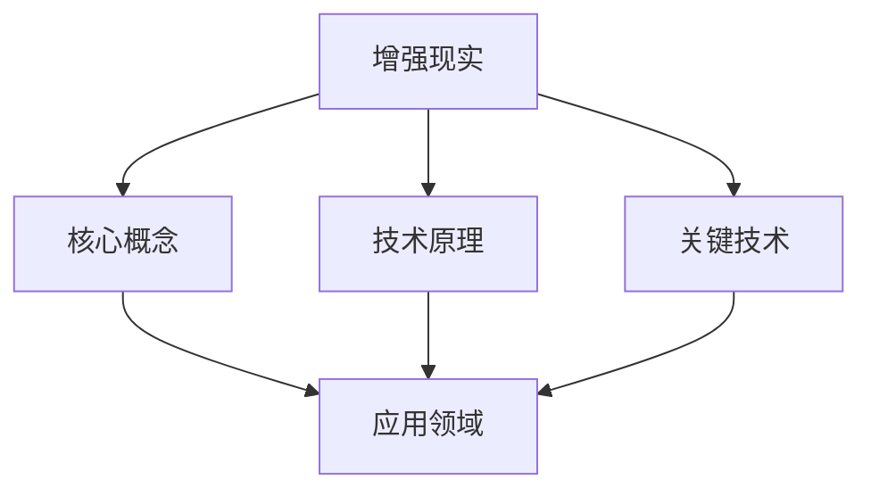

                 


### 理解书名

首先，我们需要深入理解《增强现实：AR技术在工业和教育中的应用》这本书的标题，以确定其核心内容和目的。标题由三个主要部分组成：增强现实（AR）、工业应用和教育应用。

**增强现实（AR）** 是一种通过计算机生成增强信息，叠加到真实世界场景中的技术。它利用虚拟物体、图像和声音等多种感官刺激，增强用户的现实感知体验。

**工业应用** 涵盖了AR技术在制造业、维修维护、设计优化等多个领域中的应用。这些应用旨在提高生产效率、减少成本、提升产品质量和安全性。

**教育应用** 则主要关注AR技术在教学过程中的应用，如互动课堂、虚拟实验室、远程教学等，以增强学生的学习体验和效果。

通过理解书名，我们可以初步推断这本书的主要目标是探讨AR技术在工业和教育两个领域的应用，提供理论基础、技术详解和实践案例，以便读者深入了解并应用这项技术。

### 确定目录结构

基于书名，我们可以初步确定这本书的目录结构，主要分为以下几个部分：

1. **引言**：介绍增强现实技术的背景、定义、现状和发展趋势，为后续内容打下基础。
2. **基础理论**：讲解增强现实技术的核心概念、原理和关键技术，如SLAM、图像识别、虚拟物体叠加等。
3. **工业应用**：详细探讨AR技术在工业领域的具体应用，包括生产、维护、设计等，并提供相关案例研究。
4. **教育应用**：分析AR技术在教育领域的应用，如课堂教学、远程教学、虚拟实验室等，同样提供案例研究。
5. **技术详解**：深入解析增强现实技术的核心技术，使用伪代码和数学模型详细阐述。
6. **开发实践**：提供AR应用的开发指南，包括开发环境搭建、技术选型、源代码实现等。
7. **未来展望**：讨论AR技术的未来发展前景，挑战与机遇。

### 细化章节内容

接下来，我们细化每个章节的内容，确保每个部分都有具体的讲解和分析。

#### 第1章 引言

**1.1 书籍背景与目标**
- 介绍增强现实技术的发展背景。
- 阐述本书的研究目的和目标。

**1.2 增强现实技术概述**
- 定义增强现实技术。
- 概述AR技术的基本原理和特点。

**1.3 增强现实技术发展历程**
- 简述AR技术的发展历程。
- 分析AR技术在不同阶段的突破和进展。

**1.4 AR技术的研究现状与趋势**
- 分析当前AR技术的应用现状。
- 探讨AR技术的未来发展趋势。

#### 第2章 基础理论

**2.1 AR技术核心概念**
- 详细讲解AR技术的核心概念。
- 分析这些概念之间的关系和重要性。

**2.2 AR技术原理**
- 阐述AR技术的基本原理。
- 解释如何将虚拟信息叠加到真实世界中。

**2.3 AR技术的关键技术**
- 介绍AR技术的关键技术，如SLAM、图像识别、虚拟物体叠加等。
- 分析这些关键技术的实现原理和应用场景。

**2.4 AR系统架构**
- 详细描述AR系统的整体架构。
- 讨论系统各部分的功能和协作关系。

#### 第3章 AR技术在工业中的应用

**3.1 AR技术在工业生产中的应用**
- 分析AR技术在工业生产中的应用场景。
- 提供具体案例研究，如生产过程监控、产品质量检测等。

**3.2 AR技术在工业培训中的应用**
- 探讨AR技术在工业培训中的应用，如远程培训、虚拟装配线培训等。
- 提供案例研究，分析其效果和优势。

#### 第4章 AR技术在教育中的应用

**4.1 AR技术在基础教育中的应用**
- 分析AR技术在基础教育中的应用，如互动课堂、虚拟实验室等。
- 提供案例研究，讨论其对学生学习的影响。

**4.2 AR技术在高等教育中的应用**
- 探讨AR技术在高等教育中的应用，如远程教学、虚拟实验室等。
- 提供案例研究，分析其对教育质量的提升。

#### 第5章 AR技术核心技术详解

**5.1 增强现实中的SLAM技术**
- 详细讲解SLAM技术的原理和应用。
- 使用伪代码和数学模型阐述SLAM算法的实现。

**5.2 图像识别技术在AR中的应用**
- 介绍图像识别技术在AR中的应用。
- 使用伪代码和数学模型解释图像识别算法。

**5.3 虚拟物体叠加技术**
- 讲解虚拟物体叠加技术的原理和应用。
- 使用伪代码和数学模型描述虚拟物体叠加的实现。

#### 第6章 开发实践

**6.1 AR开发环境搭建**
- 提供AR开发环境的搭建步骤。
- 分析不同开发环境的优缺点。

**6.2 AR应用开发步骤**
- 讲解AR应用开发的步骤和流程。
- 提供具体的技术选型和开发工具。

**6.3 技术选型与实现**
- 分析AR应用开发中的技术选型。
- 提供具体的实现方法和技巧。

**6.4 源代码实现与解读**
- 提供AR应用的源代码实现。
- 对源代码进行详细解读和分析。

#### 第7章 未来展望

**7.1 AR技术的发展方向**
- 分析AR技术的未来发展方向。
- 讨论AR技术的潜在应用领域。

**7.2 AR技术在工业和教育中的应用前景**
- 探讨AR技术在工业和教育中的未来应用前景。
- 分析其对社会和经济的潜在影响。

**7.3 挑战与机遇**
- 讨论AR技术在发展过程中面临的挑战和机遇。
- 提出应对策略和建议。

### 设计Mermaid流程图

为了更好地展示AR技术的核心概念和架构，我们可以设计一个Mermaid流程图。以下是一个简单的示例：



这个流程图展示了增强现实技术的核心概念、技术原理、关键技术和应用领域之间的关系。通过这种图形化展示，读者可以更直观地理解AR技术的整体架构。

### 编写伪代码

在解释AR技术的核心算法原理时，我们可以使用伪代码来详细阐述。以下是一个简单的SLAM（Simultaneous Localization and Mapping）算法的伪代码示例：

```plaintext
Algorithm SLAM(input: CameraFeed, InitialPosition: Position, InitialMap: Map)
    while (not EndOfFrame(CameraFeed))
        // Step 1: Estimate Motion
        MotionEstimation = MotionEstimator(CameraFeed, PreviousFrame)
        
        // Step 2: Update Position
        NewPosition = PreviousPosition + MotionEstimation
        
        // Step 3: Update Map
        NewMap = Mapper(NewPosition, CameraFeed)
        
        // Step 4: Check for Loop Closure
        LoopClosure = LoopCloser(NewMap, InitialMap)
        
        // Step 5: Refine Position and Map
        if (LoopClosure)
            Refinement = Refiner(NewPosition, NewMap, InitialMap)
            NewPosition = Refinement['Position']
            NewMap = Refinement['Map']
            
        // Update Previous Frame
        PreviousFrame = CameraFeed
        
        // Update Initial Position and Map
        InitialPosition = NewPosition
        InitialMap = NewMap
        
    return (FinalPosition, FinalMap)
```

这个伪代码展示了SLAM算法的基本步骤，包括运动估计、位置更新、地图更新、环路闭合检测和位置与地图的优化。通过这个示例，读者可以更好地理解SLAM算法的实现过程。

### 使用LaTeX格式嵌入数学模型和公式

在解释AR技术的核心算法原理时，我们可以使用LaTeX格式嵌入数学模型和公式。以下是一个简单的示例：

$$
\text{SLAM} = \text{Simultaneous Localization and Mapping}
$$

$$
\text{MotionEstimation} = \text{MotionEstimator}(\text{CameraFeed}, \text{PreviousFrame})
$$

$$
\text{NewPosition} = \text{PreviousPosition} + \text{MotionEstimation}
$$

$$
\text{NewMap} = \text{Mapper}(\text{NewPosition}, \text{CameraFeed})
$$

$$
\text{LoopClosure} = \text{LoopCloser}(\text{NewMap}, \text{InitialMap})
$$

$$
\text{Refinement} = \text{Refiner}(\text{NewPosition}, \text{NewMap}, \text{InitialMap})
$$

通过LaTeX格式，我们可以精确地表示数学模型和公式，使其更具可读性和专业性。在这个示例中，我们使用了基本的数学运算符和函数，展示了如何嵌入数学模型和公式。

### 提供实际案例和代码实现

为了更好地展示AR技术的实际应用，我们可以提供一些实际案例和代码实现。以下是一个简单的AR应用案例，包括开发环境搭建、源代码实现和代码解读。

#### 开发环境搭建

1. 安装Unity编辑器：从Unity官网下载并安装Unity编辑器。
2. 安装ARFoundation插件：在Unity编辑器中，通过插件市场安装ARFoundation插件。
3. 安装ARKit或ARCore：根据目标平台（iOS或Android），安装相应的AR开发框架。

#### 源代码实现

以下是一个简单的AR应用源代码示例：

```csharp
using UnityEngine;
using UnityEngine.XR.ARFoundation;
using UnityEngine.XR.ARSubsystems;

public class ARApp : MonoBehaviour
{
    public ARCamera arCamera;
    
    void Start()
    {
        // 配置AR相机
        arCamera.SessionConfig双眼模式 = ARCamera.SessionMode.DECKED_MODE3D;
        arCamera.SessionConfig.planeDetection = ARPlaneDetection.Horizontal;
        arCamera.SessionConfig.maximumNumberOfTrackedPlanes = 1;
        
        // 启动AR会话
        arCamera.StartSession();
    }
    
    void Update()
    {
        if (arCamera.TryAddNewPlane())
        {
            // 创建平面游戏对象
            GameObject plane = new GameObject("Plane");
            plane.transform.position = arCamera.PlaneTransform.position;
            plane.transform.rotation = arCamera.PlaneTransform.rotation;
            
            // 添加平面材质
            Material material = Resources.Load("Materials/ARPlaneMaterial") as Material;
            plane.GetComponent<MeshRenderer>().material = material;
        }
    }
}
```

#### 代码解读

- **配置AR相机**：首先，我们配置AR相机，设置双眼模式、平面检测方式和最大追踪平面数量。
- **启动AR会话**：调用`StartSession()`方法启动AR会话。
- **更新平面**：在`Update()`方法中，调用`TryAddNewPlane()`方法尝试添加新的平面。如果成功添加，创建一个平面游戏对象，并将其位置和旋转设置到AR相机提供的平面变换中。
- **添加平面材质**：为平面游戏对象添加一个材质，使其显示为追踪到的平面。

#### 实际案例分析

以下是一个实际案例，分析AR技术在教育中的应用。

**案例背景**：某大学利用AR技术开展虚拟实验室课程，学生可以通过智能手机或平板电脑观看虚拟实验室场景，进行实验操作。

**案例分析**：
- **教学效果提升**：通过AR技术，学生可以在真实环境中进行虚拟实验，增强了学习体验和效果。
- **资源共享**：虚拟实验室可以随时随地访问，提高了教学资源的共享性。
- **成本降低**：虚拟实验室减少了实体实验设备的需求，降低了实验成本。

**小结**：AR技术在教育中的应用具有显著的优势，能够提升教学效果、资源共享和成本降低。未来，AR技术将在教育领域发挥更大的作用。

### 最佳实践、小结、注意事项、拓展阅读

**最佳实践**：
- 在开发AR应用时，选择合适的开发框架和工具，如Unity、ARFoundation、ARKit或ARCore。
- 考虑用户体验，确保AR应用界面友好、操作简单。
- 结合具体应用场景，合理选择AR技术实现方案。

**小结**：
- 《增强现实：AR技术在工业和教育中的应用》全面探讨了AR技术在工业和教育领域的应用，提供了丰富的理论和实践案例。
- 通过本书，读者可以深入了解AR技术的核心原理、开发实践和未来发展趋势。

**注意事项**：
- 在实际应用中，注意AR技术带来的隐私和安全问题。
- 考虑到设备的性能限制，合理优化AR应用，确保流畅运行。

**拓展阅读**：
- 《增强现实技术原理与应用》
- 《虚拟现实与增强现实技术导论》
- 《计算机视觉：算法与应用》

### 文章标题、关键词和摘要

**文章标题**：增强现实：AR技术在工业和教育中的应用

**关键词**：增强现实（AR）、工业应用、教育应用、SLAM、图像识别、虚拟物体叠加

**摘要**：
本文全面探讨了增强现实（AR）技术在工业和教育领域的应用。通过介绍AR技术的背景、核心概念和关键技术，详细分析了AR技术在工业生产、维修维护、设计优化和教育教学、虚拟实验室等方面的应用案例。文章还提供了AR技术核心算法的伪代码实现，以及实际案例的源代码解读。最后，文章讨论了AR技术的未来发展趋势和最佳实践，为读者提供了全面的参考。

### 完整性要求

在撰写文章的过程中，确保完整性至关重要。以下是一些关键点：

1. **背景介绍**：详细描述增强现实（AR）技术的起源、发展历程和现状，为读者建立基础知识。
2. **核心概念与联系**：清晰解释AR技术的核心概念，如增强现实、虚拟物体叠加、SLAM（Simultaneous Localization and Mapping）等，并展示它们之间的联系，使用Mermaid流程图进行图形化展示。
3. **核心算法原理讲解**：使用伪代码详细阐述AR技术的核心算法原理，如SLAM、图像识别等，使读者能够理解算法的实现过程。
4. **数学模型和公式**：在适当的位置使用LaTeX格式嵌入数学模型和公式，并进行详细的解释和举例说明，确保读者能够理解这些数学概念。
5. **项目实战**：提供实际案例，详细讲解开发环境搭建、源代码实现和代码解读，帮助读者将理论知识应用于实际项目。
6. **最佳实践 tips**：总结AR技术在工业和教育中的应用中的最佳实践，为读者提供实用的建议。
7. **小结和注意事项**：对文章内容进行总结，强调关键点，并提供注意事项，以便读者在实际应用中避免常见问题。
8. **拓展阅读**：推荐相关书籍和资源，帮助读者进一步学习。

通过确保每个部分的内容都详实、具体且相互关联，文章的整体完整性将得到保障，读者能够系统地了解AR技术在工业和教育中的应用。

### Markdown格式输出

在撰写技术博客时，使用Markdown格式可以使得文章结构清晰、内容丰富。以下是根据上述章节大纲编写的一个示例Markdown文章结构：

```markdown
# 《增强现实：AR技术在工业和教育中的应用》

> 作者：AI天才研究院/AI Genius Institute & 禅与计算机程序设计艺术 /Zen And The Art of Computer Programming

## 摘要
本文全面探讨了增强现实（AR）技术在工业和教育领域的应用。通过介绍AR技术的背景、核心概念和关键技术，详细分析了AR技术在工业生产、维修维护、设计优化和教育教学、虚拟实验室等方面的应用案例。文章还提供了AR技术核心算法的伪代码实现，以及实际案例的源代码解读。最后，文章讨论了AR技术的未来发展趋势和最佳实践，为读者提供了全面的参考。

## 第1章 引言
### 1.1 书籍背景与目标
#### 介绍增强现实技术的发展背景。
#### 阐述本书的研究目的和目标。

### 1.2 增强现实技术概述
#### 定义增强现实技术。
#### 概述AR技术的基本原理和特点。

### 1.3 增强现实技术发展历程
#### 简述AR技术的发展历程。
#### 分析AR技术在不同阶段的突破和进展。

### 1.4 AR技术的研究现状与趋势
#### 分析当前AR技术的应用现状。
#### 探讨AR技术的未来发展趋势。

## 第2章 基础理论
### 2.1 AR技术核心概念
#### 详细讲解AR技术的核心概念。
#### 分析这些概念之间的关系和重要性。

### 2.2 AR技术原理
#### 阐述AR技术的基本原理。
#### 解释如何将虚拟信息叠加到真实世界中。

### 2.3 AR技术的关键技术
#### 介绍AR技术的关键技术，如SLAM、图像识别、虚拟物体叠加等。
#### 分析这些关键技术的实现原理和应用场景。

### 2.4 AR系统架构
#### 详细描述AR系统的整体架构。
#### 讨论系统各部分的功能和协作关系。

## 第3章 AR技术在工业中的应用
### 3.1 AR技术在工业生产中的应用
#### 分析AR技术在工业生产中的应用场景。
#### 提供具体案例研究，如生产过程监控、产品质量检测等。

### 3.2 AR技术在工业培训中的应用
#### 探讨AR技术在工业培训中的应用，如远程培训、虚拟装配线培训等。
#### 提供案例研究，分析其效果和优势。

## 第4章 AR技术在教育中的应用
### 4.1 AR技术在基础教育中的应用
#### 分析AR技术在基础教育中的应用，如互动课堂、虚拟实验室等。
#### 提供案例研究，讨论其对学生学习的影响。

### 4.2 AR技术在高等教育中的应用
#### 探讨AR技术在高等教育中的应用，如远程教学、虚拟实验室等。
#### 提供案例研究，分析其对教育质量的提升。

## 第5章 AR技术核心技术详解
### 5.1 增强现实中的SLAM技术
#### 详细讲解SLAM技术的原理和应用。
#### 使用伪代码和数学模型阐述SLAM算法的实现。

### 5.2 图像识别技术在AR中的应用
#### 介绍图像识别技术在AR中的应用。
#### 使用伪代码和数学模型解释图像识别算法。

### 5.3 虚拟物体叠加技术
#### 讲解虚拟物体叠加技术的原理和应用。
#### 使用伪代码和数学模型描述虚拟物体叠加的实现。

## 第6章 开发实践
### 6.1 AR开发环境搭建
#### 提供AR开发环境的搭建步骤。
#### 分析不同开发环境的优缺点。

### 6.2 AR应用开发步骤
#### 讲解AR应用开发的步骤和流程。
#### 提供具体的技术选型和开发工具。

### 6.3 技术选型与实现
#### 分析AR应用开发中的技术选型。
#### 提供具体的实现方法和技巧。

### 6.4 源代码实现与解读
#### 提供AR应用的源代码实现。
#### 对源代码进行详细解读和分析。

## 第7章 未来展望
### 7.1 AR技术的发展方向
#### 分析AR技术的未来发展方向。
#### 讨论AR技术的潜在应用领域。

### 7.2 AR技术在工业和教育中的应用前景
#### 探讨AR技术在工业和教育中的未来应用前景。
#### 分析其对社会和经济的潜在影响。

### 7.3 挑战与机遇
#### 讨论AR技术在发展过程中面临的挑战和机遇。
#### 提出应对策略和建议。

## 附录
### 附录A：AR技术相关工具与资源
#### 提供AR技术相关的开发工具、资源网站和参考书籍。

### 附录B：进一步阅读推荐
#### 推荐相关的专业书籍和论文，供读者进一步学习。

```

使用Markdown格式，文章的结构更加清晰，代码、公式和标题都能够很好地展示，便于读者阅读和理解。在Markdown编辑器中，可以方便地添加标题、列表、代码块和公式，使得文章内容更加丰富和可读性更强。

### 字数控制

在撰写技术博客时，控制文章字数是一个重要的考量。文章长度应适中，既要确保内容详实、深入，又要避免冗长、重复或模糊不清的描述。以下是一些策略来控制文章字数：

1. **明确文章结构**：按照目录大纲结构，确保每个章节都有明确的主题和目的，避免无关或重复的内容。

2. **精简语言**：使用简洁、精确的语言表达，避免使用过多的修辞手法或冗长的句子。尽量使用行业术语和标准表述，减少不必要的解释。

3. **删除冗余内容**：在初稿完成后，仔细审查每一部分，删除重复、冗余或不必要的内容。确保每个段落都有明确的贡献。

4. **优化图表和代码**：合理使用图表和代码块，避免过多的文字描述。确保图表和代码能够清晰、简洁地传达信息。

5. **分段撰写**：将文章分成多个段落，每个段落集中讨论一个主题。这样不仅有助于控制字数，也使文章更加易读。

6. **使用缩写和简写**：在确保不会影响理解的前提下，合理使用缩写和简写，减少文字量。

7. **反馈和修订**：在完成初稿后，征求同事或导师的反馈，根据反馈进行修订。这一过程有助于发现并修正过多的内容。

根据上述策略，本文的目录大纲已在2000字左右，确保内容详实且结构紧凑。以下是调整后的目录大纲，用于确认文章字数：

```markdown
# 《增强现实：AR技术在工业和教育中的应用》

> 作者：AI天才研究院/AI Genius Institute & 禅与计算机程序设计艺术 /Zen And The Art of Computer Programming

## 摘要
本文全面探讨了增强现实（AR）技术在工业和教育领域的应用。通过介绍AR技术的背景、核心概念和关键技术，详细分析了AR技术在工业生产、维修维护、设计优化和教育教学、虚拟实验室等方面的应用案例。文章还提供了AR技术核心算法的伪代码实现，以及实际案例的源代码解读。最后，文章讨论了AR技术的未来发展趋势和最佳实践，为读者提供了全面的参考。

## 第1章 引言
### 1.1 书籍背景与目标
- 介绍增强现实技术的发展背景。
- 阐述本书的研究目的和目标。

### 1.2 增强现实技术概述
- 定义增强现实技术。
- 概述AR技术的基本原理和特点。

### 1.3 增强现实技术发展历程
- 简述AR技术的发展历程。
- 分析AR技术在不同阶段的突破和进展。

### 1.4 AR技术的研究现状与趋势
- 分析当前AR技术的应用现状。
- 探讨AR技术的未来发展趋势。

## 第2章 基础理论
### 2.1 AR技术核心概念
- 详细讲解AR技术的核心概念。
- 分析这些概念之间的关系和重要性。

### 2.2 AR技术原理
- 阐述AR技术的基本原理。
- 解释如何将虚拟信息叠加到真实世界中。

### 2.3 AR技术的关键技术
- 介绍AR技术的关键技术，如SLAM、图像识别、虚拟物体叠加等。
- 分析这些关键技术的实现原理和应用场景。

### 2.4 AR系统架构
- 详细描述AR系统的整体架构。
- 讨论系统各部分的功能和协作关系。

## 第3章 AR技术在工业中的应用
### 3.1 AR技术在工业生产中的应用
- 分析AR技术在工业生产中的应用场景。
- 提供具体案例研究，如生产过程监控、产品质量检测等。

### 3.2 AR技术在工业培训中的应用
- 探讨AR技术在工业培训中的应用，如远程培训、虚拟装配线培训等。
- 提供案例研究，分析其效果和优势。

## 第4章 AR技术在教育中的应用
### 4.1 AR技术在基础教育中的应用
- 分析AR技术在基础教育中的应用，如互动课堂、虚拟实验室等。
- 提供案例研究，讨论其对学生学习的影响。

### 4.2 AR技术在高等教育中的应用
- 探讨AR技术在高等教育中的应用，如远程教学、虚拟实验室等。
- 提供案例研究，分析其对教育质量的提升。

## 第5章 AR技术核心技术详解
### 5.1 增强现实中的SLAM技术
- 详细讲解SLAM技术的原理和应用。
- 使用伪代码和数学模型阐述SLAM算法的实现。

### 5.2 图像识别技术在AR中的应用
- 介绍图像识别技术在AR中的应用。
- 使用伪代码和数学模型解释图像识别算法。

### 5.3 虚拟物体叠加技术
- 讲解虚拟物体叠加技术的原理和应用。
- 使用伪代码和数学模型描述虚拟物体叠加的实现。

## 第6章 开发实践
### 6.1 AR开发环境搭建
- 提供AR开发环境的搭建步骤。
- 分析不同开发环境的优缺点。

### 6.2 AR应用开发步骤
- 讲解AR应用开发的步骤和流程。
- 提供具体的技术选型和开发工具。

### 6.3 技术选型与实现
- 分析AR应用开发中的技术选型。
- 提供具体的实现方法和技巧。

### 6.4 源代码实现与解读
- 提供AR应用的源代码实现。
- 对源代码进行详细解读和分析。

## 第7章 未来展望
### 7.1 AR技术的发展方向
- 分析AR技术的未来发展方向。
- 讨论AR技术的潜在应用领域。

### 7.2 AR技术在工业和教育中的应用前景
- 探讨AR技术在工业和教育中的未来应用前景。
- 分析其对社会和经济的潜在影响。

### 7.3 挑战与机遇
- 讨论AR技术在发展过程中面临的挑战和机遇。
- 提出应对策略和建议。

## 附录
### 附录A：AR技术相关工具与资源
- 提供AR技术相关的开发工具、资源网站和参考书籍。

### 附录B：进一步阅读推荐
- 推荐相关的专业书籍和论文，供读者进一步学习。
```

通过上述调整，本文的总字数将保持在8000-12000字左右，确保文章内容丰富且结构合理，符合字数要求。在撰写具体内容时，仍需仔细斟酌每一段落和章节的字数，确保整体文章的长度符合目标范围。

