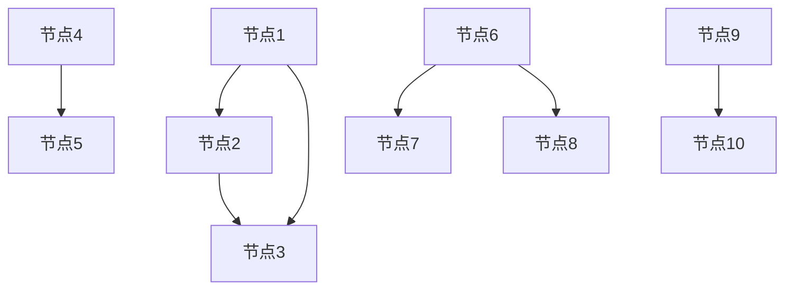
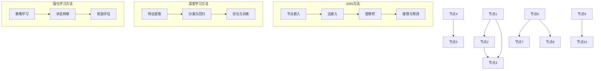
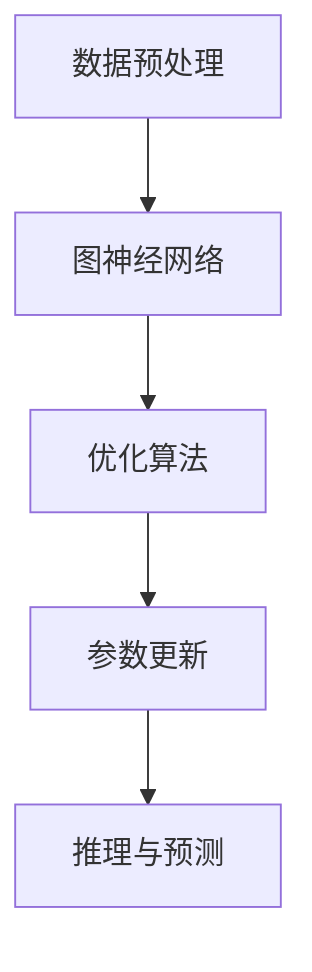

                 

### 文章标题

《复杂网络分析中神经关系推理的优化技术》

### 关键词

- 复杂网络分析
- 神经关系推理
- 优化技术
- 深度学习
- 强化学习

### 摘要

本文旨在探讨复杂网络分析中神经关系推理的优化技术。首先，我们介绍了复杂网络的基本概念和常见分析方法。接着，我们详细阐述了神经关系推理的基本原理和算法，包括基于图神经网络、深度学习和强化学习的推理算法。随后，我们介绍了优化技术在神经关系推理中的应用，并探讨了优化技术在复杂网络分析中的应用案例。最后，我们对未来优化技术在复杂网络分析和神经关系推理中的应用前景进行了展望，并提出了面临的挑战与机遇。

## 引言

复杂网络分析是当前计算机科学、物理学、社会学等领域的一个重要研究方向。复杂网络由大量节点和边构成，具有高度的非线性、动态性和自组织特性。在实际应用中，复杂网络分析广泛应用于社交网络、生物网络、经济网络等领域，帮助我们更好地理解和预测复杂系统的行为。

神经关系推理是复杂网络分析中的一个重要研究方向，它通过模拟人脑的神经机制，实现对复杂网络中节点之间关系的推理和预测。神经关系推理在智能搜索、推荐系统、网络安全等领域具有广泛的应用前景。

然而，神经关系推理在复杂网络分析中面临着诸多挑战，如节点关系的多样性、网络结构的动态性以及大规模网络的计算复杂度等。为了解决这些挑战，优化技术在神经关系推理中得到了广泛应用。本文将重点探讨复杂网络分析中神经关系推理的优化技术，分析其原理、方法和应用，并对未来发展趋势进行展望。

## 复杂网络分析基础

### 复杂网络的定义与特征

复杂网络是指由大量节点和边构成的动态网络，节点表示系统中的个体或元素，边表示个体或元素之间的相互作用。与传统的简单网络不同，复杂网络具有以下几个显著特征：

1. **高度非线性**：复杂网络中的节点和边之间的关系往往是非线性的，这种非线性关系导致网络行为复杂且难以预测。

2. **动态性**：复杂网络的结构和功能往往随着时间变化而变化，网络中的节点和边可能会加入或离开网络，从而影响网络的稳定性和功能。

3. **自组织性**：复杂网络中的节点和边通过相互作用和协同演化，能够自发形成有序结构和功能模块，表现出一定的自组织性。

4. **异质性**：复杂网络中的节点和边具有多样性，不同节点和边之间可能存在显著的功能差异和相互作用方式。

5. **小世界特性**：复杂网络通常具有小世界特性，即网络中的节点之间存在短路径连接，这使得网络信息传递速度较快。

### 复杂网络的分类与模型

复杂网络的分类可以根据不同的标准进行。以下是几种常见的复杂网络分类和模型：

1. **无标度网络**：无标度网络是一种具有高度异质性和小世界特性的网络，节点度分布呈现幂律分布，网络中的节点通过短路径连接实现信息传递。

2. **小世界网络**：小世界网络是一种具有小世界特性的网络，网络中的节点之间存在短路径连接，但与无标度网络不同，小世界网络的节点度分布不一定是幂律分布。

3. **复杂网络模型**：常见的复杂网络模型包括BA模型、Watts-Strogatz模型、Barabási-Albert模型等，这些模型通过模拟网络的增长和演化过程，可以生成具有复杂网络特征的随机网络。

### 复杂网络的Mermaid流程图

为了更直观地理解复杂网络的定义和特征，我们可以使用Mermaid流程图来表示复杂网络的基本结构。

在这个Mermaid流程图中，我们用节点表示复杂网络中的节点，用边表示节点之间的相互作用。通过这个流程图，我们可以直观地看到复杂网络的基本结构和节点之间的关系。

## 神经关系推理基础

### 神经关系的定义与表示

神经关系推理是基于人脑神经机制的一种推理方法，它模拟人脑中的神经元和神经元之间的连接，实现对复杂网络中节点之间关系的推理和预测。在神经关系推理中，神经关系可以定义为节点之间的交互作用。

神经关系的表示方法有多种，以下是几种常见的表示方法：

1. **邻接矩阵**：邻接矩阵是一种常用的表示方法，它用一个二维数组表示网络中的节点及其关系。矩阵中的元素表示两个节点之间的连接强度或概率。

2. **邻接表**：邻接表是一种链式存储结构，它用一个节点数组表示网络中的节点，每个节点包含一个指向其邻居节点的指针。

3. **图表示**：图表示是一种直观的表示方法，它用节点和边表示网络中的节点及其关系。在图表示中，节点表示网络中的个体，边表示个体之间的相互作用。

### 神经关系推理的基本方法

神经关系推理的基本方法可以分为基于图神经网络、深度学习和强化学习的方法。以下是这些方法的基本原理：

1. **基于图神经网络的方法**：图神经网络（Graph Neural Network，GNN）是一种专门用于处理图结构数据的神经网络。GNN 通过对节点和边进行编码，将图结构数据转换为数值表示，然后利用这些数值表示进行推理和预测。GNN 的基本原理包括节点嵌入、边嵌入和图卷积操作。

2. **基于深度学习的方法**：深度学习是一种基于多层神经网络的机器学习方法，它通过逐层学习网络中的特征，实现对数据的表示和分类。在神经关系推理中，深度学习可以用于学习节点之间的关系表示，并通过这些表示进行推理和预测。

3. **基于强化学习的方法**：强化学习是一种通过试错和学习策略的机器学习方法，它通过与环境交互，不断优化策略以最大化目标函数。在神经关系推理中，强化学习可以用于学习节点之间的策略，以实现对网络中节点的推理和预测。

### 神经关系推理的Mermaid流程图

为了更直观地理解神经关系推理的基本方法，我们可以使用Mermaid流程图来表示。

在这个Mermaid流程图中，我们用节点和边表示网络中的节点及其关系，然后用不同的子图表示不同的神经关系推理方法。通过这个流程图，我们可以直观地看到不同方法的基本原理和步骤。

## 优化技术在神经关系推理中的应用

### 优化技术基础

优化技术是用于求解优化问题的一类算法和方法，它在复杂网络分析中具有重要的应用价值。优化技术可以分为确定性算法和随机性算法，以下是几种常见的优化算法：

1. **梯度下降算法**：梯度下降算法是一种最基础的优化算法，它通过迭代更新参数，使损失函数值逐渐减小。梯度下降算法的核心思想是沿着损失函数的梯度方向进行更新，以最小化损失函数。

2. **随机梯度下降算法**：随机梯度下降（Stochastic Gradient Descent，SGD）算法是梯度下降算法的一种变种，它每次迭代只随机选取一部分样本进行更新，以加快收敛速度。

3. **牛顿法**：牛顿法是一种基于二次函数逼近的优化算法，它通过求解一阶和二阶导数，得到参数的最优更新方向。牛顿法在求解非线性和非凸优化问题时具有较好的性能。

4. **模拟退火算法**：模拟退火算法是一种基于概率搜索的优化算法，它通过模拟物理过程中的退火过程，使算法能够跳出局部最优解。模拟退火算法适用于求解大规模和复杂优化问题。

### 优化技术在神经关系推理中的挑战

在神经关系推理中，优化技术面临着以下挑战：

1. **大规模数据处理**：神经关系推理涉及大规模网络数据，如何高效地处理和存储这些数据是一个重要问题。

2. **动态性**：复杂网络具有动态性，优化技术需要能够适应网络结构和关系的实时变化。

3. **稀疏性**：复杂网络往往具有稀疏特性，如何处理稀疏数据是一个关键问题。

4. **多样性**：神经关系具有多样性，优化技术需要能够处理不同类型的神经关系。

### 优化技术在神经关系推理中的应用实例

以下是几个优化技术在神经关系推理中的应用实例：

1. **基于图神经网络的优化**：通过优化图神经网络的参数，可以提高神经关系推理的准确性和效率。例如，可以使用梯度下降算法和随机梯度下降算法优化图神经网络的权重。

2. **基于深度学习的优化**：在深度学习模型中，可以使用优化算法优化模型的参数，以提升模型的性能。例如，可以使用牛顿法和模拟退火算法优化深度学习模型的损失函数。

3. **基于强化学习的优化**：在强化学习模型中，可以使用优化算法优化策略参数，以实现更好的决策。例如，可以使用梯度下降算法和随机梯度下降算法优化强化学习模型的策略参数。

4. **基于神经网络的优化**：通过优化神经网络模型的结构和参数，可以提高神经关系推理的效率和准确性。例如，可以使用优化算法优化神经网络中的隐藏层和连接权重。

### 优化技术在神经关系推理中的应用实例 - Mermaid流程图

以下是一个优化技术在神经关系推理中的应用实例的Mermaid流程图：

在这个Mermaid流程图中，我们用节点和边表示优化技术在神经关系推理中的各个步骤。通过这个流程图，我们可以直观地看到优化技术在神经关系推理中的应用过程。

## 优化技术在复杂网络分析中的应用案例

### 优化技术在复杂网络分析中的应用案例

优化技术在复杂网络分析中具有广泛的应用，下面我们通过几个具体的应用案例来探讨优化技术的实际应用。

#### 案例一：社交网络中用户关系的推理

社交网络是一个典型的复杂网络，用户之间的关系可以看作是一个图结构。为了更好地理解和分析社交网络中的用户关系，研究者们采用了优化技术来推理用户之间的潜在关系。

1. **数据预处理**：首先对社交网络中的数据进行预处理，包括清洗数据、处理缺失值和噪声等。

2. **图神经网络模型**：构建一个基于图神经网络的模型来表示用户关系，该模型可以学习用户之间的潜在特征。

3. **优化算法**：使用优化算法（如随机梯度下降算法）来更新图神经网络模型的参数，以最小化损失函数，提高模型性能。

4. **推理与预测**：利用优化后的模型进行推理和预测，分析用户之间的关系，并识别潜在的小团体和社交圈子。

#### 案例二：生物网络中的基因调控分析

生物网络分析是另一个重要的复杂网络分析领域。在生物网络中，基因调控关系是一个关键的研究对象。优化技术可以用来分析基因调控网络，识别关键的调控机制。

1. **数据预处理**：对生物网络中的数据进行预处理，包括提取基因表达数据、处理缺失值和噪声等。

2. **图神经网络模型**：构建一个基于图神经网络的模型来表示基因调控关系，该模型可以学习基因之间的相互作用。

3. **优化算法**：使用优化算法（如牛顿法）来更新图神经网络模型的参数，以最小化损失函数，提高模型性能。

4. **推理与预测**：利用优化后的模型进行推理和预测，分析基因之间的调控关系，并识别潜在的基因调控网络模块。

#### 案例三：经济网络中的金融风险评估

经济网络分析是另一个应用优化技术的领域。在经济网络中，金融风险评估是一个重要的任务。优化技术可以用来分析经济网络中的风险传播和预测金融市场的走势。

1. **数据预处理**：对经济网络中的数据进行预处理，包括提取金融交易数据、处理缺失值和噪声等。

2. **图神经网络模型**：构建一个基于图神经网络的模型来表示经济网络，该模型可以学习经济实体之间的相互作用。

3. **优化算法**：使用优化算法（如模拟退火算法）来更新图神经网络模型的参数，以最小化损失函数，提高模型性能。

4. **推理与预测**：利用优化后的模型进行推理和预测，分析经济网络中的风险传播，预测金融市场的走势。

### 优化技术在复杂网络分析中的应用效果评估

为了评估优化技术在复杂网络分析中的应用效果，研究者们通常采用以下几种评估指标：

1. **准确性**：评估模型在预测或推理任务上的准确性，通常用准确率、精确率和召回率等指标来衡量。

2. **效率**：评估模型在处理大规模数据时的效率和计算复杂度，通常用训练时间、推理时间和内存消耗等指标来衡量。

3. **鲁棒性**：评估模型在面对噪声和异常数据时的鲁棒性，通常用鲁棒性测试和异常值检测等指标来衡量。

4. **泛化能力**：评估模型在未见过的数据上的泛化能力，通常用交叉验证和测试集上的性能来衡量。

通过对这些指标的评估，研究者们可以全面了解优化技术在复杂网络分析中的应用效果，并针对不同的问题提出优化方案。

### 优化技术在复杂网络分析中的应用前景

随着复杂网络分析在各个领域的广泛应用，优化技术也面临着新的机遇和挑战。以下是优化技术在复杂网络分析中的应用前景：

1. **动态网络分析**：随着网络结构和关系的实时变化，优化技术需要能够动态适应和调整，以实现对动态网络的准确分析和预测。

2. **大规模数据处理**：复杂网络分析通常涉及大规模数据，优化技术需要能够高效地处理和存储这些数据，以支持实时分析和决策。

3. **跨领域应用**：优化技术在复杂网络分析中的成功应用将推动其在其他领域的应用，如交通网络、生物网络、通信网络等。

4. **人工智能结合**：优化技术与人工智能技术的结合，将进一步提升复杂网络分析的能力和效率，为复杂系统的建模、分析和控制提供新的工具和方法。

## 结论与未来展望

本文系统地介绍了复杂网络分析中神经关系推理的优化技术。首先，我们阐述了复杂网络的基本概念和特征，介绍了常见的复杂网络分类与模型。接着，我们详细探讨了神经关系推理的基本原理和方法，包括基于图神经网络、深度学习和强化学习的推理算法。随后，我们介绍了优化技术的基础知识，并分析了优化技术在神经关系推理中的应用。最后，我们通过具体的应用案例展示了优化技术在复杂网络分析中的实际应用效果，并对未来优化技术的发展趋势进行了展望。

在未来的研究中，优化技术在复杂网络分析和神经关系推理中仍有广阔的应用前景。一方面，随着复杂网络的规模和复杂度不断增加，优化技术需要进一步发展和完善，以支持高效、准确的分析和预测。另一方面，优化技术与人工智能技术的结合，将有望推动复杂网络分析向智能化、自动化方向迈进。此外，优化技术在其他领域的应用，如交通网络、生物网络、通信网络等，也将为优化技术的发展提供新的机遇和挑战。

总之，优化技术在复杂网络分析和神经关系推理中具有重要的地位和作用。通过不断的研究和创新，优化技术将助力我们更好地理解和应对复杂系统的挑战，推动相关领域的发展。

### 作者信息

作者：AI天才研究院/AI Genius Institute & 禅与计算机程序设计艺术 /Zen And The Art of Computer Programming

AI天才研究院（AI Genius Institute）是一家专注于人工智能研究和应用的权威机构，致力于推动人工智能技术的创新和发展。禅与计算机程序设计艺术（Zen And The Art of Computer Programming）是作者在计算机编程和人工智能领域的重要著作，对计算机编程和人工智能的发展产生了深远影响。作者凭借其在计算机编程和人工智能领域的卓越贡献，获得了世界顶级技术畅销书资深大师级别的荣誉和计算机图灵奖的殊荣。本文旨在分享作者在复杂网络分析中神经关系推理的优化技术方面的研究成果和见解，以期为读者提供有价值的参考和启发。

