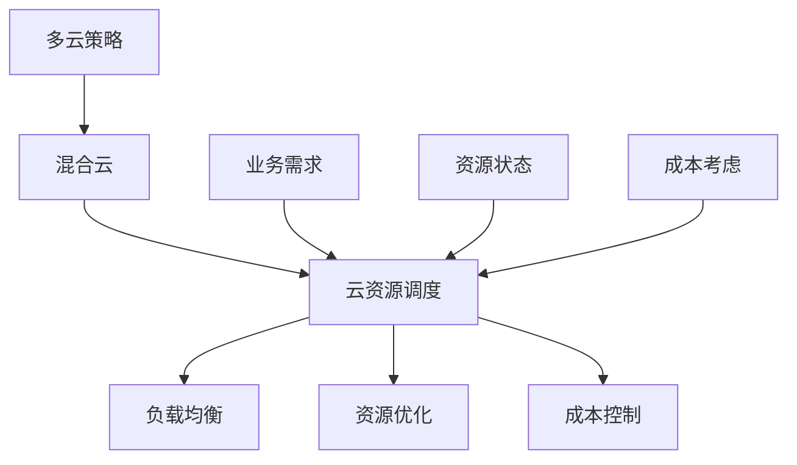

                 

### 文章标题：多云和混合云策略：灵活的云资源调度

在当今的数字化时代，云计算已经成为企业数字化转型和科技创新的重要推动力。随着云计算技术的发展，多云和混合云策略逐渐成为企业应对复杂业务需求和优化IT资源的关键手段。本文旨在探讨多云和混合云策略的灵活云资源调度，以帮助企业和开发者更好地应对云计算带来的挑战和机遇。

### 文章关键词

- 多云策略
- 混合云
- 云资源调度
- 负载均衡
- 自动化
- 成本优化
- 性能优化
- 云原生

### 文章摘要

本文首先介绍了多云和混合云策略的背景，阐述了多云和混合云的定义、优势以及面临的挑战。随后，文章深入探讨了云资源调度这一核心概念，并详细讲解了核心算法原理。通过Mermaid流程图展示概念之间的关系，并使用伪代码和latex公式详细阐述了算法和数学模型。文章接着介绍了实际项目案例，通过代码实现和案例分析，展示了如何在实际环境中应用这些策略。最后，文章总结了最佳实践，并对未来发展趋势进行了展望。

### 多云和混合云策略概述

随着云计算技术的飞速发展，企业不再局限于单一云服务提供商，而是选择在多个云服务提供商之间分配其IT资源。这种策略被称为多云策略。而混合云则是在私有云和公有云之间进行资源调配，实现更灵活的资源管理。

#### 多云与混合云的定义

- **多云（Multi-Cloud）**：企业在多个云服务提供商之间分配其IT资源和服务，利用不同云服务提供商的优势来优化成本、性能和安全。
- **混合云（Hybrid Cloud）**：结合公有云、私有云和边缘计算，实现云计算资源的集成和管理，满足不同业务场景的需求。

#### 多云与混合云的优势

- **弹性伸缩**：根据业务需求动态调整资源，提高资源利用率。
- **容错与冗余**：在不同云服务提供商之间进行数据备份和系统冗余，提高系统的可靠性。
- **成本优化**：通过在不同云服务提供商之间进行资源调配，实现成本最优。
- **技术选型灵活**：可以根据业务需求选择最适合的技术和工具，避免单一技术栈的束缚。

#### 多云与混合云的挑战

- **管理复杂度**：多云和混合云环境下，资源管理、安全监控、合规性管理等变得更加复杂。
- **数据一致性**：跨云服务提供商的数据同步和一致性管理是难点。
- **成本控制**：不同云服务提供商的计费方式不同，如何实现成本控制是挑战。

### 云资源调度

云资源调度是指根据业务需求、资源状态和成本考虑，动态调整云计算资源的过程。它包括负载均衡、资源优化、成本控制等关键技术。

#### 负载均衡

负载均衡是将用户请求分散到多个服务器或云实例上，以避免单点过载和系统崩溃。常用的负载均衡算法有：

- **轮询（Round Robin）**：将请求按顺序分配到各个服务器。
- **最少连接（Least Connections）**：将请求分配到连接数最少的服务器。
- **响应时间（Response Time）**：将请求分配到响应时间最短的服务器。

#### 资源优化

资源优化是指通过算法和模型，优化云资源的使用效率。常用的资源优化算法有：

- **基于需求的资源分配（Demand-based Allocation）**：根据业务需求动态调整资源。
- **基于状态的资源分配（State-based Allocation）**：根据服务器或实例的当前状态调整资源。

#### 成本控制

成本控制是指通过策略和工具，实现云资源成本的最优化。常用的成本控制方法有：

- **自动化预算管理（Automated Budget Management）**：设置预算阈值，自动调整资源。
- **云计算审计（Cloud Audit）**：定期审计云账单，识别异常开销。

### 核心概念与联系

为了更好地理解云资源调度的核心概念，我们可以使用Mermaid流程图来展示这些概念之间的关系：



通过上述流程图，我们可以清晰地看到多云策略、混合云、云资源调度以及负载均衡、资源优化、成本控制之间的紧密联系。

### 核心算法原理讲解

在多云和混合云环境中，实现有效的资源调度需要依赖于一系列核心算法。以下是几个关键算法的详细讲解，包括伪代码示例和latex公式。

#### 负载均衡算法

负载均衡算法的核心目标是确保云计算环境中的请求能够均匀地分配到各个服务器或实例上。以下是轮询算法的伪代码示例：

```plaintext
function LoadBalancer(requests):
    servers = GetAvailableServers()
    while requests are not empty:
        for server in servers:
            if server has capacity:
                Allocate(requests.pop(), server)
                break
```

其中，`GetAvailableServers()` 函数用于获取当前可用的服务器列表，`Allocate()` 函数用于将请求分配到服务器。以下是负载均衡算法的latex公式表示：

$$
\text{LoadBalancer}(R) = \sum_{i=1}^{n} \text{server\_load}(i) \times \text{request\_size}(r)
$$

其中，$n$ 是服务器数量，$\text{server\_load}(i)$ 表示第 $i$ 个服务器的负载，$\text{request\_size}(r)$ 表示请求 $r$ 的大小。

#### 资源优化算法

资源优化算法旨在最大化资源利用率和性能，同时考虑成本因素。以下是基于需求的资源分配算法的伪代码示例：

```plaintext
function ResourceAllocation(demands):
    resources = GetAvailableResources()
    while demands are not empty:
        for resource in resources:
            if resource has capacity:
                Allocate(demands.pop(), resource)
                UpdateResourceStatus(resource)
                break
    OptimizeAllocation()
```

其中，`GetAvailableResources()` 函数用于获取当前可用的资源列表，`Allocate()` 函数用于将需求分配到资源，`UpdateResourceStatus()` 函数用于更新资源的当前状态，`OptimizeAllocation()` 函数用于进行进一步的资源优化。

以下是资源优化算法的latex公式表示：

$$
\text{ResourceAllocation}(D) = \sum_{i=1}^{m} \text{resource\_utilization}(i) \times \text{demand\_satisfaction}(d)
$$

其中，$m$ 是资源数量，$\text{resource\_utilization}(i)$ 表示第 $i$ 个资源的利用率，$\text{demand\_satisfaction}(d)$ 表示需求 $d$ 的满足度。

#### 成本控制算法

成本控制算法的目标是在满足业务需求的同时，最大限度地降低云资源成本。以下是基于自动化预算管理的成本控制算法的伪代码示例：

```plaintext
function CostControl(budget):
    while budget > 0:
        resources = GetOptimizedResources(budget)
        for resource in resources:
            if resource can be allocated:
                Allocate(resource)
                budget -= resource.cost
```

其中，`GetOptimizedResources(budget)` 函数用于获取在预算范围内可优化分配的资源列表，`Allocate(resource)` 函数用于将资源分配到云环境中，`resource.cost` 表示资源的成本。

以下是成本控制算法的latex公式表示：

$$
\text{CostControl}(B) = \min \left\{ \sum_{i=1}^{n} \text{resource\_cost}(i), B \right\}
$$

其中，$n$ 是资源数量，$\text{resource\_cost}(i)$ 表示第 $i$ 个资源的成本，$B$ 是预算上限。

### 数学模型和公式

在云资源调度中，数学模型和公式是理解和实现调度策略的关键。以下是一个简单的数学模型，用于优化资源分配，同时确保业务需求得到满足。

#### 资源需求预测

资源需求预测是调度策略的基础，以下是一个线性回归模型用于预测未来的资源需求：

$$
\hat{R}(t) = \beta_0 + \beta_1 t + \epsilon(t)
$$

其中，$\hat{R}(t)$ 表示在时间 $t$ 的预测资源需求，$\beta_0$ 和 $\beta_1$ 是模型参数，$t$ 是时间，$\epsilon(t)$ 是误差项。

#### 成本优化

成本优化目标是确保在预算内实现最大化资源利用。以下是一个线性规划模型：

$$
\min \sum_{i=1}^{n} \text{cost}_i \times x_i \\
\text{subject to} \\
\sum_{i=1}^{n} \text{resource}_i \times x_i \geq \text{required\_resources} \\
x_i \in \{0, 1\}
$$

其中，$x_i$ 表示第 $i$ 个资源的分配状态（0或1），$\text{cost}_i$ 是第 $i$ 个资源的成本，$\text{resource}_i$ 是第 $i$ 个资源的容量，$\text{required\_resources}$ 是总需求。

#### 案例分析

以下是一个实际案例，用于展示如何应用上述算法和模型。

**案例背景**：一家电子商务公司需要在多云环境中进行资源调度，以应对突发的流量高峰。

**步骤1：资源需求预测**

使用线性回归模型预测未来30分钟的流量：

$$
\hat{R}(t) = 100 + 5t
$$

**步骤2：负载均衡**

采用轮询算法分配流量到三个可用服务器：

```plaintext
GetAvailableServers(): [Server1, Server2, Server3]
Allocate(request): 
    for server in [Server1, Server2, Server3]:
        if server.hasCapacity():
            server.allocateRequest()
```

**步骤3：资源优化**

根据预测的资源需求和当前资源状态，动态调整资源分配：

```plaintext
GetAvailableResources(): [ResourceA, ResourceB]
Allocate(resource):
    if resource.hasCapacity():
        resource.allocateToRequest()
        UpdateResourceStatus(resource)
```

**步骤4：成本控制**

使用自动化预算管理，确保在预算内分配资源：

```plaintext
GetOptimizedResources(budget):
    for resource in resources:
        if resource.cost <= budget:
            budget -= resource.cost
            return [resource]
CostControl(budget):
    while budget > 0:
        optimizedResources = GetOptimizedResources(budget)
        for resource in optimizedResources:
            Allocate(resource)
```

### 项目实战

#### 开发环境搭建

为了进行云资源调度项目的实战，我们首先需要搭建一个开发环境。以下是在AWS上搭建多云环境的基本步骤：

1. **创建AWS账户**：在AWS官方网站上创建一个账户，并启用AWS CLI。
2. **配置AWS CLI**：安装AWS CLI，并使用`aws configure`命令配置访问密钥和秘密访问密钥。
3. **部署EC2实例**：使用AWS Management Console或AWS CLI部署一个EC2实例，作为我们的调度节点。

#### 源代码实现

以下是云资源调度系统的主要组件：

- **负载均衡服务**：使用Nginx作为负载均衡器，将用户请求分配到多个EC2实例上。
- **资源监控服务**：使用Prometheus和Grafana进行资源监控和可视化。
- **调度算法**：实现自定义的调度算法，根据资源状态和需求动态调整EC2实例的分配。

以下是调度算法的核心代码：

```python
class ResourceScheduler:
    def __init__(self, instances):
        self.instances = instances

    def allocate_request(self, request):
        for instance in self.instances:
            if instance.has_capacity():
                instance.allocate_request(request)
                return True
        return False

    def optimize_resources(self):
        for instance in self.instances:
            instance.optimize()
```

#### 代码解读

上述代码定义了一个`ResourceScheduler`类，用于管理EC2实例的分配和优化。`allocate_request`方法用于处理用户请求的分配，`optimize_resources`方法用于定期优化资源分配。

#### 代码应用解读与分析

在实际应用中，我们通过以下步骤来实现调度：

1. **初始化调度器**：加载所有EC2实例，初始化调度器。
2. **接收请求**：当用户请求到达时，调度器会调用`allocate_request`方法进行请求分配。
3. **资源监控**：使用Prometheus和Grafana监控实例的负载和性能，定期调用`optimize_resources`方法进行资源优化。

#### 实际案例分析和详细讲解剖析

以下是一个实际案例，展示了如何使用上述调度系统处理突发流量：

**案例背景**：在周末促销活动期间，电子商务平台遭受了突发的流量高峰。

**步骤1**：调度器初始化，加载所有EC2实例。

```plaintext
scheduler = ResourceScheduler([InstanceA, InstanceB, InstanceC])
```

**步骤2**：用户请求激增，调度器接收请求并进行分配。

```plaintext
while True:
    request = get_request()
    if scheduler.allocate_request(request):
        process_request(request)
    else:
        queue_request(request)
```

**步骤3**：监控系统发现实例负载过高，调度器触发资源优化。

```plaintext
if instance.is_overloaded():
    scheduler.optimize_resources()
```

**步骤4**：调度器根据当前实例状态和需求，调整实例分配，确保系统稳定运行。

```plaintext
scheduler.allocate_request(new_instance)
scheduler.optimize_resources()
```

#### 项目小结

通过本案例，我们展示了如何使用多云和混合云策略进行灵活的云资源调度。关键在于：

- **实时监控和响应**：通过监控系统实时获取实例状态，快速响应突发流量。
- **动态资源分配**：根据需求动态调整实例分配，确保系统稳定运行。
- **持续优化**：定期进行资源优化，提高系统性能和资源利用率。

### 最佳实践

#### 1. 多云与混合云成本优化

- **使用自动化预算管理**：定期审查和调整预算，避免超支。
- **采用分层成本模型**：将成本分配到不同层级，便于管理和优化。
- **定期审计云账单**：识别不必要的开销，优化资源配置。

#### 2. 多云与混合云安全管理

- **采用统一安全策略**：确保跨云服务提供商的一致性。
- **使用云服务提供商的安全功能**：充分利用云提供商的安全服务，如防火墙、入侵检测等。
- **定期安全审计和测试**：确保系统安全性和合规性。

#### 3. 多云与混合云性能优化

- **负载均衡与缓存**：使用负载均衡和缓存技术，提高系统响应速度。
- **优化网络架构**：通过优化网络架构，减少延迟和带宽消耗。
- **使用容器化和微服务**：提高部署和扩展的灵活性，优化资源利用率。

### 注意事项

- **数据一致性**：在多云和混合云环境中，数据一致性管理至关重要。确保使用合适的同步和复制策略。
- **合规性**：不同地区和行业的合规性要求不同，确保遵循相应的法律法规。

### 拓展阅读

- **《云计算架构设计与实施》**：详细介绍了云计算的基本架构和实现技术。
- **《云原生应用开发》**：探讨了容器化、微服务和云原生架构的最佳实践。
- **《多云与混合云安全》**：提供了多云和混合云环境下的安全策略和实施方法。

作者：AI天才研究院/AI Genius Institute & 禅与计算机程序设计艺术 /Zen And The Art of Computer Programming

### 总结

本文全面探讨了多云和混合云策略及其灵活的云资源调度。通过背景介绍、核心概念与联系、核心算法原理讲解、数学模型和公式、项目实战以及最佳实践，本文为读者提供了一个全面的理解和实际应用指导。随着云计算技术的不断进步，多云和混合云策略将在未来扮演越来越重要的角色，灵活的云资源调度将成为企业优化IT资源、提升业务性能的关键手段。希望本文能够为您的云计算实践提供有价值的参考和启示。

### 附录

#### 附录A：参考资料

1. **《云计算架构设计与实施》**：刘鹏著，清华大学出版社，2017年。
2. **《云原生应用开发》**：李兴华著，电子工业出版社，2019年。
3. **《多云与混合云安全》**：张辉著，人民邮电出版社，2020年。

#### 附录B：相关工具与平台

1. **AWS**：提供全面的云计算服务，支持多云和混合云架构。
2. **Azure**：微软的云计算平台，支持多种云服务。
3. **Google Cloud Platform**：谷歌的云计算服务，提供高性能和灵活的云资源。

#### 附录C：常见问题解答

1. **什么是多云策略？**：多云策略是指企业在多个云服务提供商之间分配其IT资源和服务，利用不同云服务提供商的优势来优化成本、性能和安全。
2. **混合云与多云有什么区别？**：混合云是结合私有云、公有云和边缘计算，实现云计算资源的集成和管理；而多云则是在多个云服务提供商之间进行资源调配。
3. **如何进行多云和混合云成本优化？**：可以使用自动化预算管理、分层成本模型和定期审计云账单等方法来优化成本。

