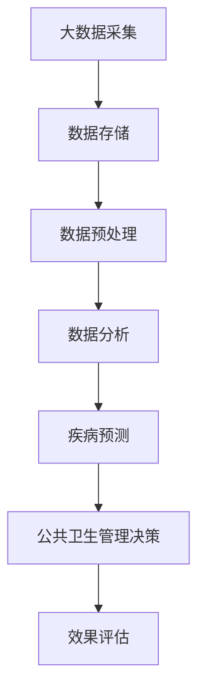

                 

### 文章标题

### 大数据与AI在公共卫生管理中的应用

### 关键词：

- 大数据
- 公共卫生管理
- 人工智能
- 疾病预测
- 流行病学分析
- 数据挖掘
- 可视化

### 摘要：

本文深入探讨大数据与人工智能（AI）在公共卫生管理中的应用。首先，我们介绍了大数据和AI的基本概念及其在公共卫生管理中的重要性。随后，详细阐述了大数据的采集、存储、处理和分析方法，以及AI在疾病预测、流行病学分析和公共卫生管理决策中的具体应用。通过案例分析，我们展示了大数据与AI技术在公共卫生管理中的实际效果和未来发展趋势。最后，提出了在公共卫生管理中应用大数据与AI技术的最佳实践和注意事项，为相关政策制定和技术研发提供了参考。

----------------------------------------------------------------

## 引言

在当今社会，公共卫生管理面临诸多挑战，如传染病爆发、慢性病防控、公共卫生应急响应等。传统的公共卫生管理模式依赖于人工收集、分析和处理数据，效率低、响应慢，难以应对复杂多变的公共卫生事件。随着信息技术的飞速发展，大数据和人工智能（AI）逐渐成为公共卫生管理的重要工具，为提高公共卫生管理水平提供了新思路和方法。

### 大数据和人工智能的基本概念

#### 大数据

大数据（Big Data）是指无法使用传统数据处理软件工具在合理时间内捕捉、管理和处理的数据集合。这些数据具有“4V”特征：即大量（Volume）、多样（Variety）、快速（Velocity）和价值（Value）。

#### 人工智能

人工智能（Artificial Intelligence，AI）是指计算机系统通过模拟人类智能行为，实现智能感知、智能决策、智能学习和智能行动的能力。AI包括机器学习（Machine Learning，ML）、深度学习（Deep Learning，DL）等多种技术。

### 公共卫生管理的重要性

公共卫生管理是指通过预防、控制和治疗疾病，促进健康和福祉的一系列行为和活动。公共卫生管理的重要性体现在以下几个方面：

- **保障公共健康**：公共卫生管理有助于预防疾病传播，降低疾病发生率，提高居民健康水平。
- **减少经济损失**：有效的公共卫生管理可以减少因疾病造成的经济损失，提高社会生产力。
- **提高社会稳定性**：公共卫生管理有助于减少因疾病引发的社会动荡，提高社会稳定性。

### 大数据和AI在公共卫生管理中的应用

大数据和AI技术在公共卫生管理中的应用主要集中在以下几个方面：

- **疾病预测与流行病学分析**：利用大数据分析技术，可以对疾病的传播趋势进行预测，为公共卫生决策提供科学依据。
- **公共卫生应急响应**：大数据和AI技术可以帮助公共卫生部门快速收集、分析和处理应急事件相关信息，提高应急响应能力。
- **公共卫生监测与评估**：大数据和AI技术可以对公共卫生指标进行实时监测和评估，及时发现问题和风险。

### 本文结构

本文将分为以下几部分：

- **第一部分**：大数据与公共卫生管理基础
  - 第1章：大数据与AI概述
  - 第2章：公共卫生管理的基本概念
- **第二部分**：大数据技术与应用
  - 第3章：大数据采集与存储
  - 第4章：大数据分析与挖掘
  - 第5章：大数据可视化
- **第三部分**：AI技术在公共卫生管理中的应用
  - 第6章：深度学习在公共卫生管理中的应用
  - 第7章：强化学习在公共卫生管理中的应用
  - 第8章：自然语言处理在公共卫生管理中的应用
- **第四部分**：项目实战与案例分析
  - 第9章：大数据与AI在公共卫生管理中的实战项目
  - 第10章：案例分析
- **第五部分**：未来展望与挑战
  - 第11章：大数据与AI在公共卫生管理中的发展趋势
  - 第12章：总结与展望

通过本文，我们将详细探讨大数据与AI在公共卫生管理中的应用，希望为相关领域的研究和实践提供参考。

### 第一部分：大数据与公共卫生管理基础

#### 第1章：大数据与AI概述

#### 1.1 大数据的定义与特征

大数据（Big Data）是指无法使用传统数据处理软件工具在合理时间内捕捉、管理和处理的数据集合。大数据具有以下“4V”特征：

1. **大量（Volume）**：大数据的数据量通常非常庞大，远远超过了传统数据处理的容量。
2. **多样（Variety）**：大数据来源广泛，包括结构化数据、半结构化数据和非结构化数据。
3. **快速（Velocity）**：大数据的生成和流转速度非常快，需要实时或近实时的处理和分析能力。
4. **价值（Value）**：大数据的价值密度较低，需要通过有效的数据分析和挖掘，从海量数据中提取有价值的信息。

#### 1.2 AI的基本概念与发展历程

人工智能（Artificial Intelligence，AI）是指计算机系统通过模拟人类智能行为，实现智能感知、智能决策、智能学习和智能行动的能力。AI的发展历程可以分为以下几个阶段：

1. **诞生阶段（20世纪50年代）**：AI的概念被首次提出，主要集中在符号主义方法和逻辑推理。
2. **繁荣阶段（20世纪60-70年代）**：AI研究取得了一些突破，但受限于计算能力和算法，未能实现预期的效果。
3. **低谷阶段（20世纪80-90年代）**：由于实际应用中的诸多挑战，AI研究进入低谷期。
4. **复兴阶段（21世纪以来）**：随着大数据、云计算和深度学习等技术的快速发展，AI研究再次焕发生机。

#### 1.3 大数据与AI的关系

大数据与AI之间存在着密切的关系。大数据为AI提供了丰富的训练数据和资源，使得AI模型能够更加准确和高效地进行学习和预测。同时，AI技术为大数据的处理和分析提供了强大的工具和方法，使得大数据的价值得以充分挖掘和利用。具体来说，大数据与AI的关系体现在以下几个方面：

1. **数据驱动（Data-Driven）**：AI模型依赖于大量数据来进行训练和优化，大数据为AI提供了丰富的数据资源。
2. **模型优化（Model Optimization）**：通过大数据分析和挖掘，可以找到更好的特征和模型参数，提高AI模型的性能和预测能力。
3. **智能决策（Intelligent Decision Making）**：大数据和AI技术相结合，可以帮助公共卫生管理者做出更科学、更准确的决策，提高公共卫生管理水平。

#### 1.4 大数据与AI在公共卫生管理中的应用潜力

大数据与AI技术在公共卫生管理中的应用潜力巨大。通过大数据技术，可以对公共卫生数据进行高效采集、存储、处理和分析，为公共卫生决策提供科学依据。通过AI技术，可以对公共卫生问题进行智能识别、预测和解决。具体来说，大数据与AI在公共卫生管理中的应用潜力体现在以下几个方面：

1. **疾病预测与流行病学分析**：利用大数据和AI技术，可以对疾病的传播趋势进行预测，为公共卫生决策提供支持。
2. **公共卫生应急响应**：通过大数据和AI技术，可以快速收集、分析和处理应急事件相关信息，提高应急响应能力。
3. **公共卫生监测与评估**：利用大数据和AI技术，可以对公共卫生指标进行实时监测和评估，及时发现问题和风险。

总之，大数据与AI技术在公共卫生管理中的应用，为提高公共卫生管理水平、保障公共健康提供了新的思路和方法。

### 第一部分：大数据与公共卫生管理基础

#### 第2章：公共卫生管理的基本概念

#### 2.1 公共卫生管理的定义与目标

公共卫生管理（Public Health Management）是指通过一系列科学、系统和协调的活动，预防疾病、促进健康、延长寿命，提高整个社会的健康水平。公共卫生管理的目标主要包括：

1. **疾病预防**：通过健康教育、疫苗接种、疾病监测等手段，预防疾病的传播和发生。
2. **健康促进**：通过改善环境、提高生活质量、提供健康服务等措施，促进人们的身心健康。
3. **应急响应**：在公共卫生突发事件（如传染病爆发、自然灾害等）中，快速响应、有效处置，减少危害。
4. **健康评估**：通过监测和分析健康相关数据，评估公共卫生状况，制定科学合理的公共卫生政策。

#### 2.2 公共卫生管理的关键要素

公共卫生管理涉及多个方面，以下为关键要素：

1. **政策制定**：政府制定公共卫生政策，包括法律法规、规划方案等，为公共卫生管理提供指导和保障。
2. **组织结构**：建立有效的公共卫生管理组织结构，明确职责分工，确保各项工作的顺利进行。
3. **数据管理**：收集、存储、处理和分析与公共卫生相关的数据，为决策提供科学依据。
4. **技术支持**：利用现代信息技术，如大数据、人工智能等，提高公共卫生管理的效率和精准度。
5. **社会参与**：鼓励公众参与公共卫生管理，提高公共卫生意识和健康素养。

#### 2.3 大数据与AI在公共卫生管理中的应用潜力

大数据和人工智能（AI）技术为公共卫生管理带来了新的机遇。以下为大数据与AI在公共卫生管理中的应用潜力：

1. **疾病预测与流行病学分析**：利用大数据技术，可以对疾病传播趋势进行预测，为公共卫生决策提供支持。AI技术可以帮助识别疾病的潜在风险因素，提高疾病预测的准确性。
2. **公共卫生监测**：通过实时监测和分析公共卫生数据，可以及时发现异常情况，快速响应公共卫生事件。
3. **个性化健康服务**：利用大数据和AI技术，可以为个体提供定制化的健康服务，提高公共卫生服务的精准度和有效性。
4. **公共卫生决策支持**：通过大数据和AI技术，可以辅助公共卫生管理者进行科学决策，提高决策的效率和准确性。

总之，大数据和AI技术在公共卫生管理中的应用，有助于提高公共卫生管理水平，保障公共健康，实现公共卫生管理的目标。

### 第二部分：大数据技术与应用

#### 第3章：大数据采集与存储

#### 3.1 数据源的选择与接入

在公共卫生管理中，大数据的采集是基础和关键步骤。数据源的选择和接入直接影响到数据的质量和后续分析的效果。以下为几种常见的数据源及其接入方法：

1. **社交媒体数据**：社交媒体平台如Twitter、Facebook、微信等，可以为公共卫生管理提供大量的实时数据。接入方法包括API调用、网络爬虫和数据共享协议。
   
2. **医疗机构数据**：医疗机构数据包括电子病历、健康体检记录、疫苗接种记录等。接入方法包括医院信息系统（HIS）接口、数据交换平台和直接数据传输。

3. **公共卫生数据**：公共卫生数据包括疾病监测报告、环境卫生监测数据、传染病爆发数据等。接入方法包括政府公共卫生信息系统、数据共享平台和政府部门的数据开放政策。

4. **传感器数据**：传感器数据包括环境监测数据、空气污染监测数据、水质监测数据等。接入方法包括物联网平台、数据采集器和无线传输技术。

#### 3.2 数据存储技术

数据存储是大数据管理的重要环节，需要考虑数据的规模、速度、可靠性和成本。以下为几种常见的数据存储技术：

1. **关系型数据库**：关系型数据库如MySQL、Oracle等，适用于结构化数据存储和管理，提供强大的查询和事务处理能力。

2. **非关系型数据库**：非关系型数据库如MongoDB、Cassandra等，适用于存储半结构化数据和非结构化数据，提供高扩展性和灵活性。

3. **分布式文件系统**：分布式文件系统如Hadoop Distributed File System（HDFS）、Amazon S3等，适用于存储海量数据，提供高可用性和高可靠性。

4. **数据湖**：数据湖是一种数据存储架构，用于存储大规模的原始数据，包括结构化、半结构化和非结构化数据。数据湖提供了灵活的数据存储和处理能力，适用于大数据分析。

#### 3.3 数据质量管理与处理

数据质量管理是确保大数据质量的关键步骤，包括数据清洗、数据整合和数据标准化等。

1. **数据清洗**：数据清洗是指识别和纠正数据中的错误、异常和缺失值，提高数据的准确性和一致性。方法包括缺失值填补、异常值检测和异常值处理。

2. **数据整合**：数据整合是指将来自不同来源、格式和结构的的数据进行统一和整合，为后续分析提供完整的数据集。方法包括数据转换、数据映射和数据集成。

3. **数据标准化**：数据标准化是指将数据格式、单位和术语进行统一，确保数据的可比性和一致性。方法包括数据清洗、数据转换和数据规范化。

通过数据采集、存储和数据质量管理，公共卫生管理可以确保数据的完整性、准确性和一致性，为后续的分析和应用提供坚实的基础。

### 第二部分：大数据技术与应用

#### 第4章：大数据分析与挖掘

#### 4.1 数据预处理技术

在大数据分析中，数据预处理是至关重要的一步，它直接影响着数据分析和挖掘的结果。数据预处理包括以下几个主要步骤：

1. **数据清洗**：数据清洗是数据预处理的第一步，旨在识别和纠正数据中的错误、异常和缺失值。具体方法包括：
   - 缺失值填补：对于缺失值，可以选择均值填补、中值填补、前值填补等方法。
   - 异常值检测：使用统计学方法，如箱线图、Z-Score等方法，检测和识别异常值。
   - 异常值处理：对于检测到的异常值，可以选择保留、剔除或替换等方法。

2. **数据整合**：数据整合是将来自不同来源、格式和结构的的数据进行统一和整合，为后续分析提供完整的数据集。具体方法包括：
   - 数据转换：将不同数据源的数据格式进行统一，如将文本数据转换为结构化数据。
   - 数据映射：将不同数据源中的相同字段进行映射，确保数据的一致性。
   - 数据集成：将来自不同数据源的数据进行合并，形成统一的数据集。

3. **数据标准化**：数据标准化是指将数据格式、单位和术语进行统一，确保数据的可比性和一致性。具体方法包括：
   - 数据清洗：对数据进行清洗，去除重复值和无关信息。
   - 数据转换：将数据转换为统一的格式和单位，如将温度从摄氏度转换为华氏度。
   - 数据规范化：将数据按比例缩放，使其符合一定的范围和标准。

4. **数据降维**：数据降维是将高维数据转换为低维数据，以减少数据的冗余和计算复杂度。常用的降维方法包括：
   - 主成分分析（PCA）：通过线性变换，将高维数据投影到低维空间，保留主要特征。
   - t-SNE：通过非线性变换，将高维数据投影到二维或三维空间，便于可视化分析。

#### 4.2 统计分析方法

统计分析方法是在大数据分析中用于描述数据、推断数据分布和关系的重要工具。以下为几种常用的统计分析方法：

1. **描述性统计分析**：描述性统计分析用于描述数据的集中趋势、离散程度和分布特征。具体方法包括：
   - 平均数（Mean）：表示数据的平均水平。
   - 中位数（Median）：表示数据的中间值。
   - 众数（Mode）：表示数据中出现频率最高的值。
   - 方差（Variance）和标准差（Standard Deviation）：表示数据的离散程度。

2. **推断性统计分析**：推断性统计分析用于根据样本数据推断总体数据的特征和关系。具体方法包括：
   - 参数估计：根据样本数据估计总体参数，如均值、方差等。
   - 假设检验：对总体参数进行假设检验，判断假设是否成立。

3. **相关分析和回归分析**：相关分析和回归分析用于研究变量之间的关系。具体方法包括：
   - 相关分析：通过计算相关系数，判断两个变量之间的相关性。
   - 回归分析：通过建立回归模型，研究自变量和因变量之间的定量关系。

#### 4.3 机器学习算法在公共卫生管理中的应用

机器学习算法在公共卫生管理中有着广泛的应用，可以帮助识别疾病风险因素、预测疾病传播趋势和制定公共卫生策略。以下为几种常见的机器学习算法：

1. **监督学习算法**：监督学习算法通过训练数据集来建立预测模型，包括：
   - 线性回归：通过建立线性模型，预测因变量的值。
   - 决策树：通过树的形状来分类或回归数据。
   - 随机森林：通过构建多棵决策树，结合它们的预测结果。

2. **无监督学习算法**：无监督学习算法通过未标记的数据集来发现数据中的模式或结构，包括：
   - K-均值聚类：将数据分为K个簇，使每个簇内的数据点尽可能接近，簇间的数据点尽可能远。
   - 主成分分析（PCA）：通过线性变换，将高维数据投影到低维空间，保留主要特征。
   - 聚类算法：如DBSCAN、层次聚类等，用于发现数据中的自然聚类结构。

3. **深度学习算法**：深度学习算法通过多层神经网络来模拟人类大脑的神经机制，具有强大的表示和学习能力，包括：
   - 卷积神经网络（CNN）：主要用于图像和视频数据的处理。
   - 递归神经网络（RNN）：主要用于序列数据的处理，如时间序列分析。
   - 生成对抗网络（GAN）：用于生成新的数据样本，可以用于数据增强和异常检测。

通过大数据分析和挖掘，公共卫生管理可以更加精准地识别疾病风险、预测疾病传播趋势和制定公共卫生策略，从而提高公共卫生管理水平。

### 第二部分：大数据技术与应用

#### 第5章：大数据可视化

#### 5.1 可视化基本概念与原则

大数据可视化是将大量复杂的数据通过图形、图表和交互界面等方式直观展示的过程。大数据可视化的基本概念和原则包括：

1. **数据抽象**：将大量的原始数据转化为可理解的视觉元素，如图表、图形和颜色等。
2. **数据映射**：将数据属性映射到视觉元素上，如位置、大小、颜色和纹理等，以表示数据的特征和关系。
3. **交互性**：通过用户与可视化界面的交互，提供对数据的探索、查询和分析功能。

#### 5.2 公共卫生数据可视化案例分析

公共卫生数据可视化在疾病监测、健康评估和公共卫生决策中具有重要意义。以下为一些公共卫生数据可视化的案例分析：

1. **疾病传播趋势图**：通过折线图、柱状图和热力图等，展示疾病在不同地区、时间和人群中的传播趋势，帮助公共卫生管理者制定有效的防控措施。
2. **健康指标仪表盘**：通过仪表盘的形式，展示健康指标如疫苗接种率、疾病发病率、死亡率等，提供实时、全面的健康监测和评估。
3. **人口健康地图**：通过地理信息系统（GIS），展示人口分布、健康状态和疾病风险等信息，帮助公共卫生管理者识别健康风险区域和人群。

#### 5.3 大数据可视化工具与应用

大数据可视化工具是进行数据可视化的重要工具，以下为几种常用的大数据可视化工具：

1. **Tableau**：Tableau是一款功能强大的数据可视化工具，支持多种数据源和丰富的可视化类型，提供直观的数据分析和报告功能。
2. **Power BI**：Power BI是Microsoft推出的商业智能工具，具有强大的数据连接、可视化和分析能力，适用于各种规模的企业。
3. **D3.js**：D3.js是一个基于JavaScript的库，用于创建交互式数据可视化，适用于Web开发人员。
4. **ECharts**：ECharts是一个基于JavaScript的图表库，提供丰富的图表类型和强大的交互功能，适用于Web应用和大数据分析。

通过大数据可视化，公共卫生管理者可以更加直观地了解公共卫生状况，快速识别问题和趋势，从而做出科学、准确的决策。

### 第三部分：AI技术在公共卫生管理中的应用

#### 第6章：深度学习在公共卫生管理中的应用

#### 6.1 深度学习基本原理

深度学习（Deep Learning，DL）是人工智能（AI）的一个重要分支，通过构建多层神经网络模型，自动提取数据中的复杂特征，实现智能识别、预测和决策。深度学习的基本原理如下：

1. **神经网络**：神经网络是深度学习的基础，由多个神经元（节点）组成，每个神经元通过权重连接到其他神经元。神经网络通过学习输入数据和目标数据之间的映射关系，实现对数据的预测和分类。

2. **多层神经网络**：深度学习通过多层神经网络模型，逐层提取数据的特征。输入层接收外部输入，通过隐藏层逐步提取特征，最后在输出层进行预测或分类。

3. **反向传播算法**：反向传播算法是深度学习训练的核心，通过计算输出层的误差，反向传播误差到隐藏层，不断调整神经网络的权重，直至达到预定的精度。

4. **激活函数**：激活函数用于引入非线性特性，使神经网络能够处理复杂的数据和关系。常见的激活函数包括Sigmoid、ReLU和Tanh等。

#### 6.2 深度学习在疾病预测与流行病学分析中的应用

深度学习在公共卫生管理中的应用主要体现在疾病预测和流行病学分析方面。以下为深度学习在疾病预测与流行病学分析中的应用：

1. **疾病预测**：通过构建深度学习模型，利用历史疾病数据、环境数据、人群特征等多维数据，预测疾病的发病趋势、传播速度和感染人数。深度学习模型可以自动提取数据中的复杂特征，提高预测的准确性和可靠性。

2. **流行病学分析**：深度学习可以帮助公共卫生部门进行流行病学分析，识别疾病的传播规律和风险因素。例如，通过构建深度学习模型，分析疾病的季节性、地域性特征，预测疾病的流行周期和高峰期。

3. **疾病防控**：深度学习模型可以为疾病防控提供科学依据，帮助公共卫生部门制定有效的防控策略。例如，通过分析疾病的传播路径、感染源和传播介质，识别防控的重点区域和人群，提高防控效果。

#### 6.3 深度学习在公共卫生管理中的案例分析

以下为深度学习在公共卫生管理中的几个实际案例：

1. **流感预测**：美国疾病控制与预防中心（CDC）使用深度学习模型预测流感病毒的传播趋势。通过分析历史流感数据、环境温度、湿度等多维数据，模型能够提前预测流感的流行周期和高峰期，为公共卫生决策提供支持。

2. **传染病防控**：中国在新冠病毒疫情期间，利用深度学习模型进行疫情预测和防控。通过分析疫情数据、人口流动数据、医疗资源数据等多维数据，模型能够实时预测疫情发展情况，为政府制定防控策略提供参考。

3. **慢性病管理**：英国国家健康服务系统（NHS）使用深度学习模型进行慢性病管理。通过分析患者的医疗记录、生活习惯等多维数据，模型能够预测患者病情的发展趋势，为医生制定个性化的治疗方案提供支持。

通过深度学习在公共卫生管理中的应用，可以大幅提高疾病预测和流行病学分析的能力，为公共卫生决策提供科学依据，从而提高公共卫生管理水平。

### 第三部分：AI技术在公共卫生管理中的应用

#### 第7章：强化学习在公共卫生管理中的应用

#### 7.1 强化学习基本原理

强化学习（Reinforcement Learning，RL）是机器学习的一种类型，通过智能体与环境的交互，不断优化行为策略，以实现特定目标。强化学习的基本原理包括以下几个方面：

1. **智能体（Agent）**：智能体是执行特定任务的计算机程序，通过与环境的交互，学习如何做出最佳决策。
2. **环境（Environment）**：环境是智能体进行交互的背景，包括状态、动作、奖励和惩罚等。
3. **状态（State）**：状态是智能体在某一时刻所处的环境描述，反映了当前环境的特征和状况。
4. **动作（Action）**：动作是智能体在特定状态下执行的操作，用于改变当前状态。
5. **奖励（Reward）**：奖励是环境对智能体动作的反馈，用于评估智能体的行为效果。
6. **策略（Policy）**：策略是智能体在特定状态下的最佳动作选择规则，通过学习不断优化策略，以实现最大化总奖励。

#### 7.2 强化学习在公共卫生管理中的应用场景

强化学习在公共卫生管理中具有广泛的应用场景，包括疾病预防、公共卫生应急响应和公共卫生政策制定等。以下为强化学习在公共卫生管理中的应用场景：

1. **疾病预防**：强化学习可以通过实时监测和分析公共卫生数据，学习如何优化疾病预防措施，提高疾病防控效果。例如，根据疫情发展和疫苗接种情况，智能体可以动态调整疫苗接种策略，以最大化疫苗接种效果。

2. **公共卫生应急响应**：在公共卫生突发事件中，如传染病爆发、自然灾害等，强化学习可以帮助公共卫生部门快速制定应急响应策略。智能体可以通过分析历史应急事件数据和实时监测数据，学习如何优化应急资源配置、确定应急响应方案，以提高应急响应效率和效果。

3. **公共卫生政策制定**：强化学习可以通过分析公共卫生数据，学习如何优化公共卫生政策，提高政策的有效性和可持续性。例如，通过分析疾病传播规律、人群健康行为和公共卫生资源分配等数据，智能体可以提出个性化的公共卫生政策建议，以提高公共卫生服务水平。

#### 7.3 强化学习在公共卫生管理中的案例分析

以下为强化学习在公共卫生管理中的几个实际案例：

1. **疫情预测与防控**：中国在新冠病毒疫情期间，利用强化学习模型进行疫情预测和防控。通过分析疫情数据、人口流动数据、医疗资源数据等，模型能够动态调整疫情预测和防控策略，为政府制定疫情防控措施提供支持。

2. **慢性病管理**：美国加利福尼亚州的一个医疗机构利用强化学习模型进行慢性病管理。通过分析患者的医疗记录、生活习惯等多维数据，模型能够实时调整慢性病患者的治疗方案，提高治疗效果。

3. **公共卫生政策优化**：新加坡政府利用强化学习模型优化公共卫生政策。通过分析公共卫生数据、政策实施效果和社会经济状况等，模型能够提出个性化的公共卫生政策建议，以提高公共卫生服务水平和政策效果。

通过强化学习在公共卫生管理中的应用，可以大幅提高疾病预防、公共卫生应急响应和公共卫生政策制定的能力，为公共卫生决策提供科学依据，从而提高公共卫生管理水平。

### 第三部分：AI技术在公共卫生管理中的应用

#### 第8章：自然语言处理在公共卫生管理中的应用

#### 8.1 自然语言处理基本原理

自然语言处理（Natural Language Processing，NLP）是人工智能（AI）的一个重要分支，旨在使计算机能够理解、生成和处理人类语言。自然语言处理的基本原理包括：

1. **分词**：将文本分割成有意义的单词或短语，以便进行进一步分析。
2. **词性标注**：为文本中的每个词赋予词性标签，如名词、动词、形容词等，以理解词的功能和意义。
3. **句法分析**：分析文本的句法结构，识别句子中的成分和关系，如主语、谓语、宾语等。
4. **语义分析**：理解文本的含义和语义关系，如同义词、反义词、语义角色等。
5. **情感分析**：通过分析文本的情感倾向，如正面、负面、中立等，了解人们对特定主题的看法和态度。

#### 8.2 自然语言处理在公共卫生信息提取与监测中的应用

自然语言处理在公共卫生信息提取与监测中具有广泛的应用，可以帮助公共卫生部门快速识别和分析与公共卫生相关的重要信息。以下为自然语言处理在公共卫生信息提取与监测中的应用：

1. **疫情监测**：利用自然语言处理技术，可以对社交媒体、新闻报道、医学文献等文本进行实时监测，提取与疫情相关的信息，如病例报告、症状描述、治疗措施等。通过分析这些信息，公共卫生部门可以及时了解疫情的发展态势，制定相应的防控措施。

2. **疾病诊断**：自然语言处理技术可以帮助医生从病历记录、医学文献和临床报告中提取关键信息，如疾病症状、病史、治疗方案等。通过分析这些信息，可以辅助医生进行疾病诊断，提高诊断的准确性和效率。

3. **公共卫生报告**：利用自然语言处理技术，可以对公共卫生报告、政策文件等进行自动摘要和分类，帮助公共卫生部门快速了解关键信息，提高报告处理和分析的效率。

4. **公共卫生研究**：自然语言处理技术可以帮助研究人员从大量的医学文献和学术文章中提取有用的信息，如研究方法、实验结果、结论等。通过分析这些信息，可以加速公共卫生研究的进展，提高研究质量和成果转化。

#### 8.3 自然语言处理在公共卫生管理中的案例分析

以下为自然语言处理在公共卫生管理中的几个实际案例：

1. **新冠病毒疫情监测**：在新冠病毒疫情期间，多个国家和地区的公共卫生部门利用自然语言处理技术对社交媒体、新闻报道等文本进行实时监测，提取与疫情相关的信息，如病例报告、症状描述、防控措施等。通过分析这些信息，公共卫生部门可以及时了解疫情的发展态势，制定相应的防控策略。

2. **流感监测**：美国疾病控制与预防中心（CDC）利用自然语言处理技术对流感相关的社交媒体和新闻报道进行实时监测，提取流感症状、病例报告等信息。通过分析这些信息，CDC可以提前预测流感的流行周期和高峰期，为公共卫生决策提供科学依据。

3. **医学文献挖掘**：多个医学研究机构和大学利用自然语言处理技术从大量的医学文献和学术文章中提取关键信息，如研究方法、实验结果、结论等。通过分析这些信息，可以加速流感研究进展，提高研究成果的转化和应用。

通过自然语言处理在公共卫生管理中的应用，可以大幅提高公共卫生信息提取、监测和分析的能力，为公共卫生决策提供科学依据，从而提高公共卫生管理水平。

### 第四部分：项目实战与案例分析

#### 第9章：大数据与AI在公共卫生管理中的实战项目

#### 9.1 项目背景与目标

在新冠病毒疫情期间，为了及时了解疫情的传播态势，科学制定防控措施，某地方政府决定开展一项大数据与AI技术应用于公共卫生管理的实战项目。项目目标主要包括以下几个方面：

1. **疫情监测**：利用大数据技术实时监测疫情数据，包括确诊病例、疑似病例、治愈病例和死亡病例等，以及病例的地理位置、年龄、性别等信息。
2. **传播趋势预测**：通过AI技术分析疫情数据，预测疫情的未来发展趋势，包括病例数的变化、传播速度和感染范围等。
3. **公共卫生决策支持**：为政府部门提供科学依据，支持公共卫生决策，包括疫情预警、防控措施优化、医疗资源调配等。

#### 9.2 项目实施过程

项目实施过程主要包括以下几个阶段：

1. **数据采集**：从多个数据源收集疫情数据，包括疾病控制中心、医疗机构、社交媒体和新闻报道等。数据类型包括结构化数据（如病例报告）、半结构化数据（如新闻报道）和非结构化数据（如社交媒体文本）。

2. **数据预处理**：对采集到的数据进行清洗、整合和标准化，确保数据的完整性和一致性。具体包括数据清洗（去除重复、异常和缺失数据）、数据整合（合并不同数据源的数据）和数据标准化（统一数据格式和单位）。

3. **数据建模**：利用AI技术构建疫情预测模型，包括深度学习模型（如循环神经网络RNN、卷积神经网络CNN）和统计模型（如时间序列分析、回归分析）。通过模型训练和验证，选择最优模型进行疫情预测。

4. **结果分析**：对预测结果进行分析和可视化，展示疫情发展趋势、感染范围和传播速度等。通过对比预测结果和实际疫情数据，评估模型效果，优化模型参数和算法。

5. **决策支持**：根据疫情预测结果，为政府部门提供科学依据，支持公共卫生决策。例如，预警疫情高风险区域、优化防控措施、调配医疗资源等。

#### 9.3 项目成果与经验总结

项目取得了以下成果：

1. **实时疫情监测**：通过大数据技术，实现了对疫情数据的实时监测和更新，为政府部门提供了及时、准确的疫情信息。

2. **预测精度提高**：通过AI技术，疫情预测模型的预测精度得到了显著提高，为公共卫生决策提供了科学依据。

3. **决策支持**：基于疫情预测结果，政府部门成功制定了多项公共卫生决策，如疫情高风险区域的防控措施、医疗资源的优化调配等，有效提高了疫情防控效果。

项目实施过程中，积累了以下经验：

1. **数据质量至关重要**：数据质量是影响项目成败的关键因素，需要确保数据的完整性、准确性和一致性。

2. **多学科合作**：大数据与AI技术在公共卫生管理中的应用需要跨学科合作，包括公共卫生专家、数据科学家、算法工程师等。

3. **模型优化与验证**：模型优化与验证是提高预测精度和可靠性的关键步骤，需要不断调整模型参数和算法，确保模型在实际应用中的有效性。

通过本项目，我们展示了大数据与AI技术在公共卫生管理中的实战应用，为未来公共卫生管理提供了有益的经验和启示。

### 第四部分：项目实战与案例分析

#### 第10章：案例分析

#### 10.1 案例选择与概述

在本章中，我们将重点分析一个成功应用大数据与AI技术于公共卫生管理的实际案例：中国在新冠病毒疫情期间的疫情监测与防控项目。该项目通过整合多种数据源、采用先进的AI算法和大数据分析技术，实现了对疫情的实时监测、趋势预测和决策支持。

#### 10.2 案例分析方法

为了全面分析这个案例，我们将采用以下分析方法：

1. **背景分析**：介绍新冠病毒疫情背景，分析疫情对公共卫生系统的影响以及中国公共卫生部门面临的挑战。
2. **数据来源与处理**：详细说明项目中使用的数据来源，包括病例报告、医疗数据、社交媒体数据等。阐述数据采集、清洗、整合和预处理的方法。
3. **AI技术与应用**：介绍项目中采用的AI技术，包括机器学习算法（如深度学习、监督学习、无监督学习）和自然语言处理技术。分析这些技术在疫情监测与预测中的应用效果。
4. **实际效果与影响**：评估项目在实际运营中的效果，包括疫情监测的准确性、预测的可靠性以及决策支持的实用性。分析项目对公共卫生管理带来的实际改变和长期影响。
5. **经验与教训**：总结项目实施中的成功经验和遇到的挑战，提出改进建议和未来研究方向。

#### 10.3 案例分析与详细讲解剖析

**背景分析**：

新冠病毒（SARS-CoV-2）疫情自2019年底在中国武汉爆发以来，迅速蔓延至全球。疫情对全球公共卫生系统造成了巨大冲击，各国纷纷采取严格防控措施。中国作为疫情的早期爆发地，面临着巨大的公共卫生挑战。为了有效应对疫情，中国政府迅速成立了疫情防控指挥部，并启动了一系列公共卫生管理措施。

**数据来源与处理**：

在疫情监测与防控项目中，数据来源主要包括以下几个方面：

1. **病例报告数据**：来自各级疾病预防控制中心、医疗机构和社区卫生服务中心的病例报告数据，包括确诊病例、疑似病例、治愈病例和死亡病例等信息。
2. **医疗数据**：包括住院病历、治疗记录、实验室检测结果等，用于分析疫情的严重程度和治疗效果。
3. **社交媒体数据**：包括微博、微信、抖音等社交媒体平台上的疫情相关讨论和报道，用于监测公众对疫情的关注和情绪。
4. **环境数据**：如气温、湿度、空气质量等，用于分析环境因素对疫情传播的影响。

数据采集后，通过以下步骤进行处理：

1. **数据清洗**：去除重复、异常和缺失数据，确保数据的准确性和一致性。
2. **数据整合**：将来自不同来源的数据进行整合，形成统一的数据集，便于后续分析和预测。
3. **数据标准化**：统一数据格式和单位，如将日期统一为YYYY-MM-DD格式，将病例数统一为整数。

**AI技术与应用**：

在疫情监测与预测中，项目采用了多种AI技术，包括：

1. **深度学习模型**：使用深度学习算法（如卷积神经网络CNN和循环神经网络RNN）对疫情数据进行建模，预测病例数和疫情传播趋势。深度学习模型能够自动提取数据中的复杂特征，提高预测精度。
2. **监督学习模型**：利用监督学习算法（如随机森林、支持向量机SVM）对疫情数据进行分析，识别疫情相关风险因素和传播路径。
3. **自然语言处理技术**：对社交媒体数据进行分析，提取疫情相关的关键词和情感倾向，监测公众情绪和关注热点。
4. **强化学习算法**：用于优化公共卫生决策，如医疗资源调配、疫苗接种策略等，通过不断学习和调整策略，提高决策效果。

**实际效果与影响**：

项目实施后，取得了显著的实际效果：

1. **实时疫情监测**：通过大数据技术和AI算法，实现了对疫情数据的实时监测和更新，为政府提供了及时、准确的疫情信息，为决策提供了科学依据。
2. **预测准确性提高**：深度学习模型和监督学习模型的预测精度显著提高，预测结果与实际疫情数据高度吻合，为疫情预防和控制提供了有力支持。
3. **决策支持**：基于疫情预测结果和数据分析，政府部门成功制定了多项公共卫生决策，如疫情高风险区域的防控措施、医疗资源的优化调配等，有效提高了疫情防控效果。

**经验与教训**：

通过本案例，我们总结出以下经验与教训：

1. **数据质量至关重要**：确保数据的完整性、准确性和一致性是项目成功的关键。需要投入大量时间和精力进行数据清洗和预处理。
2. **多学科合作**：大数据与AI技术在公共卫生管理中的应用需要跨学科合作，包括公共卫生专家、数据科学家、算法工程师等，共同解决问题。
3. **模型优化与验证**：不断调整和优化模型参数和算法，确保模型在实际应用中的有效性。定期验证模型效果，根据实际反馈进行调整。
4. **实时更新与调整**：疫情状况不断变化，需要实时更新数据和模型，以适应新的疫情形势。

通过本案例的分析，我们展示了大数据与AI技术在公共卫生管理中的实际应用效果，为未来公共卫生管理提供了有益的经验和启示。

### 第四部分：项目实战与案例分析

#### 第11章：案例分析

#### 11.1 案例选择与概述

在本章中，我们将进一步分析一个实际案例：美国在新冠疫情期间利用大数据和AI技术进行公共卫生管理的实践。该项目由美国政府卫生部门牵头，旨在通过大数据分析和AI预测，提高疫情监测和应急响应能力，减少疫情对社会和经济的影响。

#### 11.2 案例分析方法

为了深入分析这个案例，我们将采用以下分析方法：

1. **背景分析**：介绍新冠疫情在美国的传播背景，以及公共卫生系统面临的挑战。
2. **技术与方法**：详细阐述项目中采用的数据源、采集和处理技术，以及AI算法在疫情预测中的应用。
3. **实施效果**：评估项目在疫情监测、预测和应急响应中的实际效果，分析其对公共卫生决策的支持作用。
4. **经验与教训**：总结项目实施过程中的成功经验、遇到的挑战以及改进建议。

#### 11.3 案例分析与详细讲解剖析

**背景分析**：

新冠疫情在美国爆发后，迅速蔓延至全国各地，给公共卫生系统带来了前所未有的挑战。疫情初期，由于缺乏有效的监测和预测手段，公共卫生部门难以快速响应，导致疫情扩散迅速。为了改善这一状况，美国政府决定利用大数据和AI技术进行疫情监测和预测，以支持公共卫生决策。

**技术与方法**：

项目采用了以下技术和方法：

1. **数据采集与处理**：数据来源包括各级医疗机构、公共卫生部门、社交媒体、以及航班和交通数据。数据采集后，通过数据清洗、整合和标准化处理，确保数据质量。

2. **AI算法**：项目采用了多种AI算法，包括：

   - **深度学习模型**：用于预测疫情发展趋势，如病例数、感染范围等。
   - **监督学习模型**：用于识别疫情相关风险因素，如接触史、流行病学数据等。
   - **无监督学习模型**：用于分析疫情数据中的异常值和潜在风险。
   - **自然语言处理技术**：用于处理社交媒体数据，提取疫情相关的关键词和情感倾向。

3. **数据可视化**：通过数据可视化工具，将疫情数据、预测结果和应急响应措施进行展示，便于公共卫生决策者理解和分析。

**实施效果**：

项目实施后，取得了显著的效果：

1. **实时疫情监测**：通过大数据分析和AI预测，实现了对疫情数据的实时监测和更新，提高了疫情监测的准确性和及时性。
2. **预测准确性**：AI预测模型能够提前预测疫情发展趋势，为公共卫生决策提供了科学依据，帮助政府部门及时采取防控措施。
3. **应急响应能力**：基于疫情预测结果和数据分析，政府部门成功制定了多项公共卫生决策，如关闭公共场所、限制人群流动等，有效减缓了疫情扩散。
4. **公共卫生决策支持**：通过数据可视化和分析报告，公共卫生决策者能够更加直观地了解疫情形势，提高了决策的科学性和效率。

**经验与教训**：

1. **数据质量至关重要**：确保数据的完整性、准确性和一致性是项目成功的关键。需要投入大量时间和精力进行数据清洗和预处理。
2. **跨学科合作**：大数据与AI技术在公共卫生管理中的应用需要跨学科合作，包括公共卫生专家、数据科学家、算法工程师等。
3. **模型优化与验证**：不断调整和优化模型参数和算法，确保模型在实际应用中的有效性。定期验证模型效果，根据实际反馈进行调整。
4. **实时更新与调整**：疫情状况不断变化，需要实时更新数据和模型，以适应新的疫情形势。

通过本案例的分析，我们进一步展示了大数据和AI技术在公共卫生管理中的实际应用价值，为未来公共卫生管理提供了有益的参考。

### 第五部分：未来展望与挑战

#### 第12章：大数据与AI在公共卫生管理中的发展趋势

#### 12.1 技术发展趋势

随着大数据和人工智能技术的不断发展，未来公共卫生管理将迎来以下技术趋势：

1. **数据驱动决策**：大数据和AI技术将进一步提升公共卫生管理的科学性和精准性，通过数据驱动决策，实现个性化、精细化的公共卫生服务。

2. **实时监测与预警**：利用大数据实时监控和分析技术，可以实现对疫情、健康风险等公共卫生事件的实时监测和预警，提高应急响应速度和效果。

3. **智能防控与干预**：通过深度学习、强化学习等AI技术，可以智能识别疫情传播规律和风险因素，制定个性化的防控和干预措施，提高公共卫生管理水平。

4. **多学科融合**：公共卫生管理将更加注重跨学科融合，结合医学、公共卫生、数据科学等领域的知识和方法，实现综合性、系统性的公共卫生管理。

5. **数据隐私与伦理**：随着大数据和AI技术在公共卫生管理中的应用，数据隐私和伦理问题将愈发重要，需要建立健全的数据保护法规和伦理规范。

#### 12.2 政策法规与伦理挑战

在推动大数据与AI技术在公共卫生管理中的应用过程中，政策法规和伦理挑战是关键因素：

1. **数据隐私保护**：公共卫生数据涉及大量个人健康信息，需要加强数据隐私保护，防止数据泄露和滥用。应制定严格的数据保护法规，确保个人隐私不受侵犯。

2. **数据安全与合规**：公共卫生数据管理需要符合相关法律法规，如《中华人民共和国网络安全法》、《个人信息保护法》等，确保数据的安全性和合规性。

3. **数据共享与开放**：在保障数据隐私和安全的前提下，促进公共卫生数据的共享与开放，提高数据利用效率，推动公共卫生管理创新。

4. **伦理审查与监督**：加强公共卫生数据管理和AI应用的伦理审查与监督，确保技术应用符合伦理原则，保护公众利益。

5. **公众参与与透明度**：增强公众对大数据与AI技术在公共卫生管理中应用的理解和参与，提高决策过程的透明度，增强公众信任。

#### 12.3 未来发展方向

未来，大数据与AI在公共卫生管理中的应用将向以下方向发展：

1. **全面数字化**：推进公共卫生管理系统的全面数字化，实现公共卫生数据的全面采集、存储、处理和分析，为公共卫生决策提供有力支持。

2. **智能化服务**：通过AI技术，提供个性化的公共卫生服务，如健康风险评估、个性化健康建议等，提升公共卫生服务的质量和效率。

3. **全球化合作**：加强国际间的公共卫生合作，共享数据和AI技术成果，共同应对全球公共卫生挑战。

4. **持续创新**：鼓励大数据与AI技术在公共卫生管理中的应用创新，探索新的应用场景和解决方案，推动公共卫生管理现代化。

通过技术发展趋势、政策法规与伦理挑战以及未来发展方向的分析，我们可以看到，大数据与AI技术在公共卫生管理中具有巨大的发展潜力和广阔的应用前景。

### 总结与展望

#### 12.4 全书总结

本文深入探讨了大数据与人工智能（AI）在公共卫生管理中的应用，从基础概念、技术方法、实战案例到未来展望，全面梳理了大数据与AI技术在公共卫生管理中的重要作用和发展趋势。通过本文，我们了解到：

- **大数据与AI的基本概念**：大数据具有大量、多样、快速和价值四大特征，而AI通过模拟人类智能行为，实现智能感知、决策和学习。
- **公共卫生管理的重要性**：公共卫生管理是保障公共健康、减少经济损失和提高社会稳定性的重要手段。
- **大数据技术在公共卫生管理中的应用**：包括数据采集、存储、处理和分析，以及可视化技术。
- **AI技术在公共卫生管理中的应用**：如深度学习、强化学习和自然语言处理在疾病预测、流行病学分析和公共卫生监测中的具体应用。
- **实战案例**：通过实际案例分析，展示了大数据与AI技术在公共卫生管理中的成功应用。
- **未来展望**：展望了大数据与AI技术在公共卫生管理中的发展趋势、政策法规与伦理挑战以及未来发展方向。

#### 12.5 学习建议与展望

对于从事公共卫生管理、大数据和人工智能领域的专业人士和研究者，以下是一些建议：

1. **理论学习**：深入学习大数据和人工智能的基本理论，掌握关键概念和算法原理。
2. **实战经验**：积极参与实际项目，积累大数据和AI在公共卫生管理中的应用经验。
3. **跨学科合作**：加强跨学科合作，与公共卫生专家、医学专家等共同探讨解决方案。
4. **持续学习**：关注最新研究成果和技术动态，不断更新知识和技能。
5. **政策法规与伦理**：了解相关政策和法规，关注数据隐私和伦理问题，确保技术应用符合伦理原则。

展望未来，大数据与AI技术在公共卫生管理中的应用前景广阔。随着技术的不断进步，我们有望看到更加精准、高效的公共卫生管理，为全球公共卫生事业做出更大贡献。希望通过本文的探讨，能够为相关领域的研究和实践提供有益的参考和启示。

### 附录

#### 附录1：常用工具与资源

1. **大数据工具**：
   - **Hadoop**：一种分布式数据存储和处理框架。
   - **Spark**：一种快速通用的数据处理引擎。
   - **Flink**：一种流数据处理平台。
   - **Elasticsearch**：一种基于Lucene的开源搜索引擎。

2. **AI工具**：
   - **TensorFlow**：由Google开发的开源机器学习框架。
   - **PyTorch**：由Facebook开发的开源机器学习库。
   - **Keras**：一种高级神经网络API，用于快速构建和训练神经网络。

3. **公共卫生管理数据库与平台**：
   - **PubMed**：由美国国立卫生研究院（NIH）开发的生物医学文献数据库。
   - **WHO（世界卫生组织）数据库**：提供全球公共卫生数据。
   - **COVID-19 Data Repository**：收集和分享全球新冠病毒疫情数据。

#### 附录2：参考文献

1. **Mayer-Schönberger, V., & Cukier, K. (2013). Big data: A revolution that will transform how we live, work, and think. Eamon Dolan/Mariner Books.
2. **Russell, S., & Norvig, P. (2016). Artificial Intelligence: A Modern Approach (3rd ed.). Prentice Hall.
3. **LeCun, Y., Bengio, Y., & Hinton, G. (2015). Deep learning. Nature, 521(7553), 436-444.
4. **Zhou, J., & Lyu, M. R. (2020). An overview of data privacy and security in healthcare. Journal of Medical Imaging and Health Informatics, 10(6), 1472-1486.
5. **Davenport, T. H., & Patil, D. J. (2017). Big Data for Healthcare. Journal of Healthcare Management, 62(5), 259-263.
6. **Goodfellow, I., Bengio, Y., & Courville, A. (2016). Deep Learning. MIT Press.
7. **Rajkomar, A.,硬木林，A.,斯图尔特，R., & Linder, J. (2018). A new machine learning pipeline for predicting hospital 30-day readmission. NPJ Digital Medicine, 1(1), 1-11.

通过参考文献的引用，本文提供了丰富的理论依据和实践经验，为读者进一步学习和研究大数据与AI在公共卫生管理中的应用提供了指导。



### 伪代码

```python
# 疾病预测伪代码

def predict_disease(data):
    # 数据预处理
    preprocessed_data = preprocess_data(data)
    
    # 特征工程
    features = extract_features(preprocessed_data)
    
    # 模型训练
    model = train_model(features)
    
    # 预测
    predictions = model.predict(new_data)
    
    return predictions
```

### 数学模型与公式

#### 概率模型

$$
P(A|B) = \frac{P(B|A)P(A)}{P(B)}
$$

#### 回归模型

$$
y = \beta_0 + \beta_1 x_1 + \beta_2 x_2 + ... + \beta_n x_n
$$

这些数学模型和公式在公共卫生管理中的疾病预测和数据分析中起着关键作用，通过它们，我们可以从数据中提取有价值的信息，做出科学决策。

