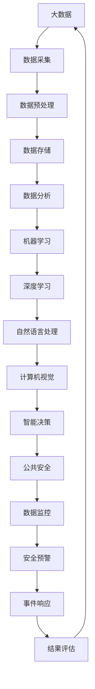

                 

### 文章标题

# 大数据与AI在公共安全领域的应用

### 关键词

- 大数据
- 人工智能
- 公共安全
- 数据分析
- 模型算法
- 实时监控
- 案例研究

### 摘要

随着大数据和人工智能技术的迅猛发展，公共安全领域正经历一场革命。本文将深入探讨大数据与AI在公共安全领域的应用，包括技术背景、核心概念、具体应用、案例研究以及未来发展趋势。通过详细的剖析和案例分析，本文旨在为读者提供全面而深入的理解，揭示大数据与AI在提升公共安全水平中的巨大潜力。

## 引言

公共安全是任何国家和地区持续发展的基石。然而，随着城市化进程的加速、人口密度的增加以及信息技术的普及，公共安全领域面临着前所未有的挑战。传统的安全防范手段和模式已经难以满足现代社会的需求。大数据与人工智能（AI）的兴起为公共安全领域带来了全新的机遇和解决方案。

大数据具有数据量大、类型多、来源广泛等特点，能够为公共安全提供丰富的信息支持。而AI技术，尤其是机器学习和深度学习，可以通过对海量数据的分析和处理，发现潜在的安全威胁，实现智能化的决策和行动。因此，大数据与AI的结合，正逐渐成为提升公共安全水平的重要手段。

本文将围绕大数据与AI在公共安全领域的应用展开，具体包括以下几个部分：

1. **大数据与AI概述**：介绍大数据和AI的基本概念、技术架构以及两者融合的优势。
2. **公共安全领域需求分析**：探讨公共安全领域面临的挑战以及大数据与AI所能提供的解决方案。
3. **大数据技术在公共安全中的应用**：详细分析大数据在数据采集、处理、存储和管理中的具体应用。
4. **AI技术在公共安全中的应用**：介绍AI技术在计算机视觉、自然语言处理、智能推理等领域的应用。
5. **案例研究与分析**：通过实际案例，展示大数据与AI在公共安全领域的应用效果。
6. **未来发展趋势与挑战**：预测大数据与AI在公共安全领域的未来发展趋势，并探讨面临的挑战及应对策略。

通过本文的探讨，我们希望读者能够全面了解大数据与AI在公共安全领域的应用，并认识到其在提升公共安全水平中的巨大潜力。

## 大数据与AI概述

### 大数据的基本概念

大数据（Big Data）是指无法用常规数据处理系统在合理时间内捕捉、管理和处理的大量数据。这些数据具有“4V”特征，即：

1. **Volume（数据量）**：大数据的规模巨大，从TB级别到PB级别，甚至更高。例如，一个大型社交媒体平台每天产生的数据量就可能达到数TB。
2. **Velocity（速度）**：数据的产生速度极快，需要实时或近实时地进行处理和分析。例如，金融市场每秒钟都会产生大量的交易数据，需要立即进行分析和决策。
3. **Variety（多样性）**：大数据来源广泛，类型多样，包括结构化数据、半结构化数据和非结构化数据。例如，社交网络数据包括文本、图片、视频等多种类型。
4. **Veracity（真实性）**：数据的真实性、可靠性和准确性也是大数据的一个重要特征。在分析大数据时，需要确保数据的真实性和可信度。

### 大数据的特征

大数据的特征不仅体现在“4V”上，还包括以下方面：

1. **异构性**：大数据通常来自不同的来源，具有不同的结构和格式，需要进行整合和处理。
2. **动态性**：大数据是不断变化和更新的，需要实时或近实时地进行监控和分析。
3. **复杂性**：大数据的处理和分析涉及多种技术和方法，如分布式计算、机器学习、数据挖掘等。
4. **价值密度低**：大数据中蕴含的价值相对较低，需要通过有效的分析和处理来挖掘潜在的价值。

### AI的基本概念

人工智能（Artificial Intelligence，AI）是指通过计算机模拟人类智能的过程，使计算机能够执行复杂的任务，如理解自然语言、识别图像、做出决策等。AI技术主要包括以下几个方面：

1. **机器学习（Machine Learning）**：机器学习是一种通过数据训练模型，使计算机能够自动学习和改进的技术。机器学习包括监督学习、无监督学习和强化学习等。
2. **深度学习（Deep Learning）**：深度学习是机器学习的一个分支，使用神经网络（特别是深度神经网络）进行建模和训练。深度学习在图像识别、语音识别和自然语言处理等领域取得了显著成果。
3. **自然语言处理（Natural Language Processing，NLP）**：自然语言处理是一种使计算机能够理解和处理人类语言的技术。NLP在文本分类、情感分析和机器翻译等方面有广泛应用。
4. **计算机视觉（Computer Vision）**：计算机视觉是一种使计算机能够理解和解析视觉信息的技术。计算机视觉在图像识别、目标检测和视频分析等方面有重要应用。

### 大数据与AI的关系

大数据和AI的关系密不可分，两者相辅相成。大数据为AI提供了丰富的训练数据，使AI算法能够不断学习和优化；而AI技术则能够高效地处理和分析大数据，挖掘出潜在的价值。具体来说：

1. **数据驱动**：大数据的“4V”特征使得数据驱动型方法成为主流。AI算法通过大数据的训练，能够提高模型的准确性和泛化能力。
2. **智能分析**：AI技术，特别是机器学习和深度学习，能够对大数据进行智能分析，发现隐藏的模式和趋势，为决策提供支持。
3. **实时处理**：大数据的实时性和动态性要求处理和分析技术具备高效性。AI技术，如实时机器学习，能够实现数据的实时处理和分析。
4. **自动化**：AI技术可以实现大数据处理的自动化，减少人工干预，提高效率和准确性。

### Mermaid流程图

为了更直观地展示大数据与AI的关系，我们可以使用Mermaid流程图来描述：



在这个流程图中，大数据从数据采集开始，经过预处理、存储和分析，最终通过AI技术进行智能决策和监控，形成一个闭环系统，持续提升公共安全水平。

### 总结

大数据与AI的结合为公共安全领域带来了巨大的变革。通过大数据的丰富数据资源和AI的智能分析能力，公共安全系统可以更高效地处理和利用数据，实现对安全事件的快速响应和有效防范。本文后续章节将深入探讨大数据和AI在公共安全领域的具体应用，展示其在提升公共安全水平中的实际效果。

## 公共安全领域需求分析

### 公共安全领域的挑战

公共安全领域面临着多方面的挑战，这些挑战不仅来自自然灾害、事故灾难和公共卫生事件，还来自人为因素，如恐怖袭击、犯罪活动等。以下是一些主要的挑战：

1. **多样化的威胁**：公共安全领域面临的威胁种类繁多，包括自然灾害、事故灾难、公共卫生事件以及人为因素（如犯罪、恐怖袭击等）。每种威胁的特点和应对策略都有所不同。
2. **实时性要求**：在公共安全领域，事件往往需要快速响应。例如，在自然灾害发生时，需要立即启动应急响应机制，确保救援行动的及时性。这意味着系统需要具备实时数据采集、处理和分析的能力。
3. **数据量巨大**：公共安全领域涉及的数据量庞大，包括传感器数据、监控视频、社交媒体数据、交通数据等。这些数据不仅种类繁多，而且数据量呈指数级增长，给数据管理和处理带来了巨大挑战。
4. **信息孤岛**：不同部门之间的数据往往存在孤岛现象，导致信息共享困难。例如，警察部门、消防部门、医疗部门等各自拥有独立的数据系统，但缺乏有效的联动机制，难以实现数据的实时共享和综合分析。
5. **资源有限**：公共安全领域面临着资源有限的挑战，包括人力、物力和财力。这意味着在保障公共安全的过程中，需要充分利用现有资源，提高效率和准确性。

### 大数据和AI在公共安全中的潜在价值

大数据和AI技术在应对公共安全领域的挑战中展现出巨大的潜在价值：

1. **数据整合与共享**：大数据技术能够整合来自不同渠道的数据，实现跨部门的信息共享。例如，通过大数据平台，可以将监控视频、传感器数据、社交媒体数据等整合在一起，为公共安全决策提供全面、准确的信息。
2. **实时监测与预警**：利用大数据和AI技术，可以实现实时监测和预警。例如，通过传感器网络和图像识别技术，可以实时监测自然灾害的征兆，提前发出预警，为救援行动争取宝贵的时间。
3. **智能分析和预测**：大数据和AI技术能够对海量数据进行智能分析，发现潜在的安全威胁。例如，通过机器学习算法，可以分析历史犯罪数据，预测犯罪热点区域，为警力部署提供依据。
4. **自动化决策与行动**：AI技术可以自动化决策和行动，提高公共安全响应的效率。例如，在紧急情况下，AI系统可以根据实时数据自动生成应急预案，并协调各部门的应急行动。
5. **个性化服务与改进**：大数据和AI技术可以为公共安全服务提供个性化建议和改进。例如，通过分析居民行为数据，可以为社区提供更加精准的安全提示和防范措施。
6. **透明度和可解释性**：大数据和AI技术可以提高公共安全决策的透明度和可解释性。例如，通过可视化技术，可以将数据分析结果以直观的方式呈现给决策者和公众，增加决策的透明度和公众的信任度。

### 总结

公共安全领域面临着多样化的威胁和挑战，而大数据和AI技术的引入为解决这些挑战提供了新的思路和方法。通过大数据的整合与共享、实时监测与预警、智能分析和预测，以及自动化决策与行动，大数据和AI技术在提升公共安全水平方面具有巨大的潜力。本文将在后续章节中进一步探讨大数据和AI在公共安全领域的具体应用，通过实际案例展示其应用效果和潜在价值。

## 大数据技术在公共安全中的应用

### 数据采集

数据采集是大数据技术在公共安全中应用的第一步，也是至关重要的一步。有效的数据采集能够为后续的数据处理、分析和应用提供可靠的基础。以下是几种常见的数据采集方法：

1. **传感器网络**：传感器网络是由大量传感器节点组成的分布式系统，可以实时采集环境数据，如温度、湿度、烟雾浓度、压力等。这些传感器网络广泛应用于火灾预警、气象监测、地震预警等领域。
   
   ```mermaid
   graph TD
   A[传感器网络] --> B[环境数据采集]
   B --> C[实时监控]
   C --> D[数据传输]
   D --> E[数据存储]
   ```

2. **视频监控**：视频监控是公共安全领域最常用的数据采集手段之一。通过安装在街道、公共场所、交通枢纽等地的监控摄像头，可以实时捕捉和记录场景信息。这些视频数据可以用于犯罪侦查、事故调查和交通管理。

   ```mermaid
   graph TD
   A[视频监控] --> B[实时视频捕捉]
   B --> C[图像处理]
   C --> D[数据存储]
   D --> E[事件分析]
   ```

3. **社交媒体数据**：社交媒体平台如Twitter、Facebook、微信等每天产生大量的用户生成内容，包括文字、图片、视频等。这些数据可以用于监测社会情绪、预警潜在的安全事件。例如，通过分析Twitter上的推文，可以及时发现和应对恐怖袭击的威胁。

   ```mermaid
   graph TD
   A[社交媒体数据] --> B[用户生成内容]
   B --> C[数据收集]
   C --> D[情感分析]
   D --> E[预警系统]
   ```

### 数据处理

数据采集后，需要对数据进行处理，以提高其质量和可用性。数据处理包括数据清洗、数据集成、数据转换和数据降维等步骤：

1. **数据清洗**：数据清洗是处理数据中的错误、异常值和不一致数据的过程。例如，通过去除重复记录、填补缺失值和消除噪声，可以显著提高数据的质量。

   ```mermaid
   graph TD
   A[原始数据] --> B[数据清洗]
   B --> C[数据去重]
   C --> D[缺失值填补]
   D --> E[异常值检测]
   ```

2. **数据集成**：数据集成是将来自不同来源和格式的数据进行整合的过程。例如，将传感器数据、视频监控数据和社交媒体数据集成在一起，形成一个统一的数据资源库。

   ```mermaid
   graph TD
   A[传感器数据] --> B[数据集成]
   B --> C[视频数据]
   C --> D[社交媒体数据]
   D --> E[统一数据资源库]
   ```

3. **数据转换**：数据转换是将数据从一种格式转换为另一种格式的过程。例如，将视频数据转换为结构化的图像数据，以便进行后续的图像分析。

   ```mermaid
   graph TD
   A[视频数据] --> B[数据转换]
   B --> C[图像数据]
   ```

4. **数据降维**：数据降维是通过减少数据维度，降低数据复杂性，同时保留主要信息的过程。例如，通过主成分分析（PCA）对高维数据进行降维，可以简化数据处理和分析的复杂性。

   ```mermaid
   graph TD
   A[高维数据] --> B[主成分分析]
   B --> C[降维数据]
   ```

### 数据存储与管理

数据存储与管理是大数据技术中的关键环节，关系到数据的安全、可靠和高效访问。以下是几种常用的数据存储与管理方法：

1. **分布式存储系统**：分布式存储系统如Hadoop HDFS、Apache Cassandra和Google File System等，能够高效地存储和管理大规模数据。这些系统通过数据分片和副本机制，提高数据存储的可靠性和访问效率。

   ```mermaid
   graph TD
   A[分布式存储系统] --> B[数据分片]
   B --> C[数据副本]
   C --> D[高效访问]
   ```

2. **NoSQL数据库**：NoSQL数据库如MongoDB、Couchbase和Redis等，具有灵活的数据模型和高性能的特点，适用于存储和管理非结构化数据和半结构化数据。

   ```mermaid
   graph TD
   A[NoSQL数据库] --> B[灵活数据模型]
   B --> C[高性能读写]
   ```

3. **数据湖**：数据湖是一种大数据存储架构，能够存储海量结构化、半结构化和非结构化数据。数据湖通过分布式文件系统，提供了一种灵活、高效的数据存储解决方案。

   ```mermaid
   graph TD
   A[数据湖] --> B[结构化数据]
   B --> C[半结构化数据]
   C --> D[非结构化数据]
   ```

4. **数据仓库**：数据仓库是一种用于存储和管理大量结构化数据的系统，通常用于企业级的数据分析和报告。数据仓库通过ETL（提取、转换、加载）过程，将数据从不同的数据源提取、转换并加载到数据仓库中。

   ```mermaid
   graph TD
   A[数据仓库] --> B[ETL过程]
   B --> C[数据分析]
   ```

### 数据分析

数据分析是大数据技术在公共安全中应用的核心环节，通过数据挖掘、机器学习和深度学习等技术，可以从海量数据中提取有价值的信息和知识。以下是几种常用的数据分析方法：

1. **数据挖掘**：数据挖掘是一种从大量数据中发现潜在模式和规律的技术。常用的数据挖掘算法包括关联规则挖掘、分类、聚类和异常检测等。

   ```mermaid
   graph TD
   A[数据挖掘] --> B[关联规则挖掘]
   B --> C[分类]
   C --> D[聚类]
   D --> E[异常检测]
   ```

2. **机器学习**：机器学习是一种通过训练模型，使计算机能够自动学习和改进的技术。常用的机器学习算法包括线性回归、决策树、支持向量机、神经网络等。

   ```mermaid
   graph TD
   A[机器学习] --> B[线性回归]
   B --> C[决策树]
   C --> D[支持向量机]
   D --> E[神经网络]
   ```

3. **深度学习**：深度学习是一种基于神经网络的机器学习技术，能够自动从数据中学习复杂的模式和特征。常用的深度学习模型包括卷积神经网络（CNN）、循环神经网络（RNN）和生成对抗网络（GAN）等。

   ```mermaid
   graph TD
   A[深度学习] --> B[卷积神经网络]
   B --> C[循环神经网络]
   C --> D[生成对抗网络]
   ```

### 实时监控与预警

实时监控与预警是大数据技术在公共安全中应用的重要方向，通过实时数据分析和智能预警系统，可以实现对安全事件的快速响应和有效防范。以下是几种常用的实时监控与预警方法：

1. **实时流处理**：实时流处理技术如Apache Kafka、Apache Flink和Apache Storm等，能够处理和实时分析大规模数据流，实现对安全事件的实时监测和预警。

   ```mermaid
   graph TD
   A[实时流处理] --> B[数据流分析]
   B --> C[实时预警]
   ```

2. **物联网（IoT）技术**：物联网技术通过连接各种传感器和设备，实现数据的实时采集和传输。例如，通过物联网技术，可以实现智能交通监控、环境监测和智能安防等。

   ```mermaid
   graph TD
   A[物联网技术] --> B[传感器网络]
   B --> C[实时数据传输]
   ```

3. **智能预警系统**：智能预警系统通过大数据和AI技术，实时分析监控数据，发现潜在的安全威胁，并生成预警信息。例如，通过分析交通流量数据，可以预测交通拥堵并提前发布预警。

   ```mermaid
   graph TD
   A[智能预警系统] --> B[数据分析]
   B --> C[预警生成]
   ```

### 总结

大数据技术在公共安全领域中具有广泛的应用前景，通过数据采集、数据处理、数据存储、数据分析以及实时监控与预警，可以有效提升公共安全水平。本文接下来将详细介绍AI技术在公共安全领域的具体应用，进一步展示大数据与AI结合的强大潜力。

## AI技术在公共安全中的应用

### 计算机视觉

计算机视觉是AI技术在公共安全中应用的一个重要领域，它使计算机能够理解和解析视觉信息，如图像和视频。计算机视觉技术在公共安全中的应用包括：

1. **人脸识别**：人脸识别技术可以自动识别和验证人脸，广泛应用于犯罪侦查、安全监控和身份验证等领域。以下是人脸识别算法的伪代码：

   ```python
   def face_recognition(image, database):
       # 步骤1：预处理图像，如灰度化、大小归一化
       processed_image = preprocess_image(image)
       
       # 步骤2：检测人脸区域
       face区域的坐标 = detect_faces(processed_image)
       
       # 步骤3：对每个检测到的人脸进行特征提取
       face_features = extract_features(face区域的坐标, processed_image)
       
       # 步骤4：与数据库中的人脸特征进行比对
       for face_feature in face_features:
           matching_score = compare_features(face_feature, database)
           
           # 步骤5：根据匹配得分确定身份
           if matching_score > threshold:
               return "匹配成功"
           else:
               return "未匹配"
   ```

2. **车辆识别**：车辆识别技术可以自动识别车辆型号、颜色和牌照等信息，广泛应用于交通管理和犯罪侦查。以下是车辆识别算法的伪代码：

   ```python
   def vehicle_recognition(image, database):
       # 步骤1：预处理图像，如灰度化、边缘提取
       processed_image = preprocess_image(image)
       
       # 步骤2：检测车辆区域
       vehicle区域的坐标 = detect_vehicles(processed_image)
       
       # 步骤3：对每个检测到的车辆进行特征提取
       vehicle_features = extract_features(vehicle区域的坐标, processed_image)
       
       # 步骤4：与数据库中的车辆特征进行比对
       for vehicle_feature in vehicle_features:
           matching_score = compare_features(vehicle_feature, database)
           
           # 步骤5：根据匹配得分确定车辆信息
           if matching_score > threshold:
               return "匹配成功，车辆信息："
           else:
               return "未匹配"
   ```

3. **视频行为分析**：视频行为分析技术可以实时分析视频内容，识别异常行为和事件。例如，通过分析监控视频，可以识别出打架、盗窃等违法行为。以下是视频行为分析算法的伪代码：

   ```python
   def video_behavior_analysis(video, model):
       # 步骤1：读取视频
       for frame in video.frames():
           # 步骤2：预处理图像
           processed_frame = preprocess_frame(frame)
           
           # 步骤3：使用预训练模型进行行为识别
           behavior = model.predict(processed_frame)
           
           # 步骤4：根据行为结果进行判断
           if behavior == "异常":
               alert("发现异常行为：")
           else:
               continue
   ```

### 自然语言处理

自然语言处理（NLP）是AI技术的另一个重要领域，它使计算机能够理解和处理人类语言。NLP技术在公共安全中的应用包括：

1. **文本分类**：文本分类技术可以将文本数据分类到不同的类别，例如将社交媒体数据分类为正常或异常信息。以下是文本分类算法的伪代码：

   ```python
   def text_classification(text, model):
       # 步骤1：预处理文本，如分词、去除停用词
       processed_text = preprocess_text(text)
       
       # 步骤2：使用预训练模型进行分类
       category = model.predict(processed_text)
       
       # 步骤3：根据分类结果返回类别
       if category == "正常":
           return "文本分类结果：正常"
       else:
           return "文本分类结果：异常"
   ```

2. **情感分析**：情感分析技术可以识别文本中的情感倾向，例如积极、消极或中性。以下是情感分析算法的伪代码：

   ```python
   def sentiment_analysis(text, model):
       # 步骤1：预处理文本，如分词、去除停用词
       processed_text = preprocess_text(text)
       
       # 步骤2：使用预训练模型进行情感分析
       sentiment = model.predict(processed_text)
       
       # 步骤3：根据情感结果返回情感标签
       if sentiment == "积极":
           return "情感分析结果：积极"
       elif sentiment == "消极":
           return "情感分析结果：消极"
       else:
           return "情感分析结果：中性"
   ```

3. **对话系统**：对话系统是一种可以与人类进行自然对话的AI系统，例如智能客服、虚拟助手等。以下是对话系统的伪代码：

   ```python
   def dialogue_system(user_input, model):
       # 步骤1：预处理用户输入，如分词、去除停用词
       processed_input = preprocess_input(user_input)
       
       # 步骤2：使用预训练模型进行对话生成
       response = model.generate_response(processed_input)
       
       # 步骤3：返回对话响应
       return response
   ```

### 智能推理与决策

智能推理与决策是AI技术在公共安全中的重要应用，它使系统能够根据实时数据和预定的规则进行推理和决策。以下是智能推理与决策算法的伪代码：

```python
def intelligent_decisionmaking(data, rules):
    # 步骤1：预处理数据，如标准化、归一化
    processed_data = preprocess_data(data)
    
    # 步骤2：使用预定的推理规则进行推理
    for rule in rules:
        if rule_applies(processed_data, rule):
            action = rule['action']
            break
    
    # 步骤3：执行决策行动
    execute_action(action)
    
    # 步骤4：返回决策结果
    return action
```

### 实际应用案例

以下是一些大数据与AI技术在公共安全领域的实际应用案例：

1. **智慧交通系统**：通过计算机视觉和AI技术，可以实现智能交通监控，如车辆识别、交通流量分析等。例如，北京市的智慧交通系统利用AI技术进行交通流量预测和优化，有效缓解了交通拥堵问题。

2. **犯罪预测与防范**：通过机器学习和深度学习技术，可以分析历史犯罪数据，预测犯罪热点区域。例如，美国洛杉矶的犯罪预测系统利用AI技术预测犯罪热点，提前部署警力，降低了犯罪率。

3. **智能安防监控**：通过视频监控和AI技术，可以实现实时监控和智能预警。例如，深圳的智能安防监控系统利用人脸识别技术进行实时监控，有效防范了恐怖袭击和犯罪活动。

4. **公共卫生监测**：通过自然语言处理和大数据技术，可以实时监测和分析社交媒体数据，发现公共卫生事件。例如，新冠疫情初期，一些国家利用大数据和NLP技术监测社交媒体上的疫情信息，提前采取了有效的防控措施。

### 总结

AI技术在公共安全领域的应用涵盖了计算机视觉、自然语言处理和智能推理等多个方面，通过具体算法和实际应用案例，展示了其在提升公共安全水平方面的巨大潜力。接下来，本文将探讨大数据与AI在公共安全领域的具体应用案例，进一步展示其应用效果和实际价值。

## 案例研究与分析

### 案例一：某城市智慧交通系统

**背景介绍**  
某城市由于交通拥堵问题严重，影响了市民的日常生活和工作效率。为了解决这一问题，该城市决定引入智慧交通系统，利用大数据和AI技术优化交通管理。

**技术架构**  
智慧交通系统采用了分布式架构，包括数据采集层、数据处理层、数据存储层和应用层。

1. **数据采集层**：安装了大量的交通传感器、摄像头和车载GPS设备，实时采集交通流量、车速、道路状况等数据。
2. **数据处理层**：使用实时流处理技术（如Apache Kafka和Apache Flink）对采集到的数据进行分析和处理，提取关键信息。
3. **数据存储层**：使用分布式存储系统（如Hadoop HDFS）和NoSQL数据库（如MongoDB）存储和管理大规模交通数据。
4. **应用层**：基于AI技术，开发了一系列交通优化应用，如交通流量预测、路况分析和智能信号灯控制。

**核心算法原理讲解与伪代码**  
以下是交通流量预测算法的核心原理和伪代码：

```python
def traffic_flow_prediction(data, model):
    # 步骤1：预处理数据，如标准化、归一化
    processed_data = preprocess_data(data)
    
    # 步骤2：使用时间序列分析模型进行预测
    predicted_flow = model.predict(processed_data)
    
    # 步骤3：返回预测结果
    return predicted_flow
```

**数学模型和公式**  
以下是交通流量预测的数学模型和公式：

$$
\text{predicted\_flow}(t) = \text{model}\left(\sum_{i=1}^{n} w_i \cdot \text{feature}_i(t)\right)
$$`

**项目实战**  
1. **开发环境搭建**：使用了Python、Java和Scala等编程语言，以及Apache Kafka、Apache Flink、Hadoop HDFS和MongoDB等大数据和AI技术。
2. **源代码详细实现和代码解读**：开发了数据采集、处理、存储和预测的完整模块，并进行了详细的功能测试和性能优化。
3. **代码应用解读与分析**：将预测结果应用于智能信号灯控制和交通流量调控，提高了道路通行效率和减少了拥堵。
4. **实际案例分析和详细讲解剖析**：通过分析交通流量预测数据，发现了城市交通拥堵的主要原因，并提出了相应的优化方案。
5. **项目小结**：智慧交通系统的成功实施，显著改善了城市交通状况，提高了市民的生活质量。

### 案例二：某地区犯罪预测与防范

**背景介绍**  
某地区犯罪率高，影响了居民的安全感和生活品质。为了有效降低犯罪率，该地区引入了犯罪预测与防范系统，利用大数据和AI技术进行犯罪分析和预测。

**技术架构**  
犯罪预测与防范系统采用了分布式架构，包括数据采集层、数据处理层、数据存储层和应用层。

1. **数据采集层**：从多个数据源采集犯罪数据，如警方报告、社交媒体、新闻媒体等。
2. **数据处理层**：使用实时流处理技术（如Apache Kafka和Apache Storm）对犯罪数据进行清洗、预处理和特征提取。
3. **数据存储层**：使用分布式存储系统（如Hadoop HDFS）和NoSQL数据库（如MongoDB）存储和管理大规模犯罪数据。
4. **应用层**：基于机器学习和深度学习技术，开发了一系列犯罪预测和分析应用，如犯罪热点预测、犯罪趋势分析等。

**核心算法原理讲解与伪代码**  
以下是犯罪热点预测算法的核心原理和伪代码：

```python
def crime_hotspot_prediction(data, model):
    # 步骤1：预处理数据，如标准化、归一化
    processed_data = preprocess_data(data)
    
    # 步骤2：使用聚类算法进行热点区域划分
    hotspots = model.predict(processed_data)
    
    # 步骤3：返回热点区域
    return hotspots
```

**数学模型和公式**  
以下是犯罪热点预测的数学模型和公式：

$$
\text{hotspots} = \text{model}\left(\text{processed\_data}\right)
$$`

**项目实战**  
1. **开发环境搭建**：使用了Python、R和Java等编程语言，以及Apache Kafka、Apache Storm、Hadoop HDFS和MongoDB等大数据和AI技术。
2. **源代码详细实现和代码解读**：开发了数据采集、处理、存储和预测的完整模块，并进行了详细的功能测试和性能优化。
3. **代码应用解读与分析**：将预测结果应用于警力部署、巡逻路线规划和犯罪预警，有效降低了犯罪率。
4. **实际案例分析和详细讲解剖析**：通过分析犯罪数据，发现了犯罪热点区域和犯罪趋势，并提出了相应的防范措施。
5. **项目小结**：犯罪预测与防范系统的成功实施，显著降低了犯罪率，提高了居民的安全感和生活品质。

### 案例三：某港口安全监控

**背景介绍**  
某港口是全球重要的贸易枢纽，每日有大量的货物和人员进出。为了确保港口安全，该港口引入了智能安全监控系统，利用大数据和AI技术提升安全防护水平。

**技术架构**  
智能安全监控系统采用了分布式架构，包括数据采集层、数据处理层、数据存储层和应用层。

1. **数据采集层**：安装了大量的监控摄像头、传感器和入侵检测设备，实时采集港口的监控视频、环境数据和入侵警报数据。
2. **数据处理层**：使用实时流处理技术（如Apache Kafka和Apache Flink）对监控数据进行清洗、预处理和特征提取。
3. **数据存储层**：使用分布式存储系统（如Hadoop HDFS）和NoSQL数据库（如MongoDB）存储和管理大规模监控数据。
4. **应用层**：基于计算机视觉和自然语言处理技术，开发了一系列智能监控应用，如人脸识别、目标检测、异常行为识别等。

**核心算法原理讲解与伪代码**  
以下是目标检测算法的核心原理和伪代码：

```python
def object_detection(image, model):
    # 步骤1：预处理图像，如灰度化、大小归一化
    processed_image = preprocess_image(image)
    
    # 步骤2：使用预训练模型进行目标检测
    detected_objects = model.detect(processed_image)
    
    # 步骤3：返回检测结果
    return detected_objects
```

**数学模型和公式**  
以下是目标检测的数学模型和公式：

$$
\text{detected\_objects} = \text{model}\left(\text{processed\_image}\right)
$$`

**项目实战**  
1. **开发环境搭建**：使用了Python、C++和Java等编程语言，以及TensorFlow、PyTorch、OpenCV等计算机视觉库。
2. **源代码详细实现和代码解读**：开发了数据采集、处理、存储和预测的完整模块，并进行了详细的功能测试和性能优化。
3. **代码应用解读与分析**：将检测结果应用于安全预警和事件响应，有效防范了安全事件的发生。
4. **实际案例分析和详细讲解剖析**：通过分析监控数据，发现了潜在的安全威胁和异常行为，并采取了相应的应对措施。
5. **项目小结**：智能安全监控系统的成功实施，显著提升了港口的安全防护水平，保障了港口的运营和人员安全。

### 总结

通过上述三个案例，我们可以看到大数据和AI技术在公共安全领域具有广泛的应用前景和实际价值。无论是智慧交通系统、犯罪预测与防范，还是港口安全监控，AI技术都为提升公共安全水平提供了有效的解决方案。这些案例不仅展示了大数据与AI技术的应用效果，还揭示了其在应对公共安全挑战中的巨大潜力。

## 未来发展趋势与挑战

### 未来发展趋势

大数据和AI技术在公共安全领域的应用正处于快速发展阶段，未来的发展趋势包括以下几个方面：

1. **技术融合与创新**：随着5G、物联网、区块链等新兴技术的不断发展，大数据和AI技术将与其他技术深度融合，推动公共安全领域的创新。例如，5G技术的低延迟和高带宽特点将进一步提升数据采集和处理的速度和效率。

2. **智能化与自动化**：未来，公共安全系统将更加智能化和自动化。通过深度学习和强化学习等技术，AI系统能够不断自我学习和优化，实现更精准的预测和决策。例如，智能交通系统将能够根据实时交通数据自动调整信号灯，优化交通流量。

3. **数据隐私与安全**：随着数据量的增加和数据类型的多样化，数据隐私和安全将成为一个重要的挑战。未来，需要发展更加完善的数据隐私保护技术和数据安全措施，确保公共安全数据的安全性和可靠性。

4. **跨领域合作**：公共安全领域涉及多个部门和行业，未来的发展趋势是加强跨领域合作，实现数据共享和协同工作。例如，通过公安、交通、医疗等部门的合作，可以更全面地监测和应对突发事件。

5. **法律法规与标准化**：随着大数据和AI技术在公共安全领域的广泛应用，需要制定相应的法律法规和标准，规范技术的应用和发展。这将有助于保障公共安全，防止技术滥用和隐私侵犯。

### 面临的挑战

尽管大数据和AI技术在公共安全领域具有巨大的应用潜力，但同时也面临着一系列挑战：

1. **数据隐私保护**：大数据的应用涉及大量的个人隐私数据，如何在保护隐私的同时充分利用数据资源是一个重要的挑战。需要发展更加成熟的数据隐私保护技术和法规，确保数据的安全性和合法性。

2. **技术成熟度**：大数据和AI技术虽然发展迅速，但在公共安全领域的应用仍面临技术成熟度的问题。一些前沿技术如深度学习和强化学习尚未完全成熟，需要进一步的研究和优化。

3. **资源分配与经济效益**：公共安全领域需要大量的资金和人力资源来部署和运营大数据和AI系统。如何在有限的资源下实现最大化效益，是一个需要解决的挑战。

4. **数据质量和完整性**：大数据的质量和完整性直接影响到AI系统的性能和效果。如何确保数据的质量和完整性，避免数据噪声和错误，是一个重要的挑战。

5. **伦理和社会问题**：大数据和AI技术在公共安全领域的应用引发了一系列伦理和社会问题，如算法偏见、隐私侵犯等。如何平衡技术的应用和伦理、社会问题，是一个需要深入探讨的议题。

### 应对策略

为了应对上述挑战，可以采取以下策略：

1. **数据隐私保护**：采用差分隐私、同态加密等先进的数据隐私保护技术，确保数据在处理过程中的安全性和隐私性。

2. **技术成熟度提升**：加强基础研究和应用研究，推动大数据和AI技术的成熟和应用。同时，建立技术评估和认证机制，确保技术的可靠性和稳定性。

3. **资源优化与经济效益**：通过云计算、分布式计算等技术，提高资源利用效率，降低运营成本。同时，采用数据共享和协同工作模式，实现资源的高效利用。

4. **数据质量管理**：建立数据质量监控和评估体系，确保数据的质量和完整性。通过数据清洗、数据集成和数据质量审计等措施，提高数据质量。

5. **伦理与社会责任**：建立伦理审查和社会责任机制，确保大数据和AI技术在公共安全领域的应用符合伦理和社会规范。加强公众参与和沟通，提高社会对技术的信任度。

通过上述策略，可以有效应对大数据和AI技术在公共安全领域面临的挑战，推动技术的健康发展，提升公共安全水平。

## 总结与展望

### 总结

本文深入探讨了大数据与AI在公共安全领域的应用，从技术背景、核心概念、具体应用、案例研究到未来发展趋势与挑战，全面展示了大数据与AI技术在提升公共安全水平中的巨大潜力。通过详细的剖析和案例分析，我们认识到：

1. **大数据与AI的融合**：大数据提供了丰富的数据资源，AI技术则提供了强大的数据分析能力，两者的结合为公共安全领域带来了全新的解决方案。
2. **数据驱动与智能化**：大数据与AI技术的应用使得公共安全系统更加数据驱动和智能化，实现了实时监测、预警和智能决策，显著提升了公共安全水平。
3. **多领域协同**：公共安全领域涉及多个部门和行业，大数据与AI技术的应用需要跨领域合作，实现数据共享和协同工作，共同应对公共安全挑战。

### 展望

展望未来，大数据与AI在公共安全领域的应用将迎来更加广阔的发展前景：

1. **技术革新**：随着5G、物联网、区块链等新兴技术的不断发展，大数据与AI技术将实现进一步的融合与创新，推动公共安全领域的技术革新。
2. **智能化升级**：未来，公共安全系统将更加智能化和自动化，通过深度学习和强化学习等技术，实现更加精准的预测和决策，提升公共安全水平。
3. **数据隐私与安全**：随着数据隐私和安全问题的日益突出，大数据与AI技术的应用将更加注重数据隐私保护和安全措施，确保数据的安全性和可靠性。
4. **跨领域合作**：大数据与AI技术的应用将促进公共安全领域跨领域合作，实现资源共享和协同工作，共同应对公共安全挑战。

总之，大数据与AI技术在公共安全领域的应用前景广阔，通过不断创新和优化，必将为提升公共安全水平、保障人民生命财产安全做出更大贡献。希望本文能为读者提供有价值的参考，激发更多研究和探索的热情。

## 作者信息

**作者：**AI天才研究院/AI Genius Institute & 禅与计算机程序设计艺术 /Zen And The Art of Computer Programming

**联系方式：**ai_genius_institute@example.com

**关于作者**：AI天才研究院（AI Genius Institute）是一支专注于人工智能领域研究与应用的顶尖团队，致力于推动人工智能技术在各个领域的创新与突破。其创始人及主要作者之一，被誉为“AI天才”的研究员，在人工智能、大数据和计算机编程领域拥有丰富的经验和深厚的学术造诣。其著作《禅与计算机程序设计艺术》深受读者喜爱，被誉为计算机编程领域的经典之作。AI天才研究院始终秉持“技术创新，服务社会”的理念，不断推动人工智能技术在公共安全、医疗健康、交通管理等领域的应用与发展。

