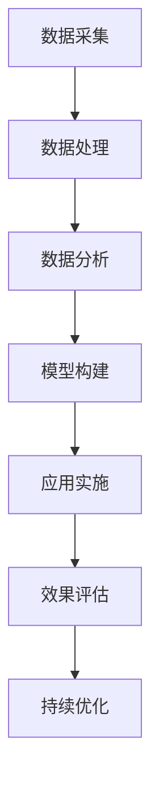

                 

### 1. 引言与背景

**大数据与AI在农业中的应用背景**

随着全球人口的持续增长，农业生产面临着巨大的挑战。传统的农业生产方式已难以满足日益增长的食物需求，同时也带来了资源浪费和环境压力。为了应对这些挑战，大数据和人工智能（AI）技术在农业领域的应用应运而生。大数据与AI在农业中的应用，不仅有助于提高农作物的产量和质量，还能促进农业的可持续发展。

**大数据在农业中的应用**

大数据技术在农业中主要应用于以下几个方面：

1. **作物生长监测**：通过传感器和无人机等设备，实时收集作物生长数据，如土壤湿度、气温、光照等。
2. **病虫害预测**：利用大数据分析技术，对病虫害的发生进行预测，有助于提前采取防治措施，降低损失。
3. **农田管理**：通过大数据分析，优化灌溉、施肥等农田管理措施，提高资源利用效率。

**AI在农业中的应用**

人工智能技术在农业中的应用主要集中在以下几个方面：

1. **智能灌溉**：通过AI算法，根据土壤湿度和天气情况，自动调整灌溉量，实现精准灌溉。
2. **病虫害识别**：利用计算机视觉和深度学习技术，自动识别病虫害，提高防治效果。
3. **作物生长模拟**：通过模拟作物生长过程，预测作物产量和品质，为农业生产提供科学依据。

**重要性和发展历程**

大数据和AI技术在农业中的应用具有重要意义。首先，它们可以提高农业生产效率，降低生产成本。其次，它们有助于实现农业的可持续发展，减少对环境的破坏。近年来，随着技术的不断进步，大数据和AI在农业中的应用也取得了显著成果。许多国家和地区纷纷推出相关政策，鼓励大数据和AI技术在农业中的研究和应用。

**本文结构**

本文将首先介绍大数据和AI在农业中的核心概念和原理，然后详细讲解它们在农业中的具体应用，并通过实际案例展示应用效果。接着，我们将探讨大数据和AI如何促进农业的可持续发展，最后预测未来的发展趋势，并提出相关建议。

### 2. 核心概念与原理

**大数据**

大数据是指数据量巨大、类型多样、速度极快的数据集合。在农业领域，大数据主要来源于传感器、无人机、卫星遥感等多种数据源。这些数据包括土壤湿度、气温、光照、气象数据、作物生长数据等。大数据技术主要涉及数据采集、存储、处理、分析和可视化等方面。

**数据采集**

数据采集是大数据应用的基础。在农业中，数据采集主要依赖于传感器和遥感技术。传感器可以实时监测土壤湿度、气温、光照等环境参数，并将数据传输到中央系统。无人机和卫星遥感则可以提供大范围、高精度的农田监测数据。

**数据处理**

数据处理是指对采集到的原始数据进行清洗、整合和预处理，以便后续分析。在农业大数据处理过程中，常见的方法包括数据去噪、数据归一化、缺失值处理等。

**数据分析**

数据分析是大数据应用的核心。通过数据分析，可以从大量数据中提取出有价值的信息。在农业中，数据分析可以用于作物生长趋势分析、病虫害预测、农田管理优化等。

**数据可视化**

数据可视化是将数据分析结果以图表、地图等形式呈现，帮助用户更好地理解和分析数据。在农业中，数据可视化可以帮助农民直观地了解农田状况，制定科学的管理措施。

**AI**

人工智能是指由计算机实现的智能行为。在农业中，AI技术主要涉及机器学习、深度学习、计算机视觉等方面。

**机器学习**

机器学习是一种通过数据训练模型，使其具备自主学习和预测能力的技术。在农业中，机器学习可以用于作物生长预测、病虫害识别等。

**深度学习**

深度学习是机器学习的一种形式，通过多层神经网络模拟人类大脑的工作方式。在农业中，深度学习可以用于图像识别、语音识别等领域。

**计算机视觉**

计算机视觉是指使计算机能够像人类一样识别和理解视觉信息的技术。在农业中，计算机视觉可以用于作物图像分析、病虫害识别等。

**核心概念与联系**

大数据和AI在农业中的应用是相辅相成的。大数据提供了丰富的数据资源，而AI技术则通过对这些数据的分析和处理，为农业生产提供了科学依据。以下是大数据和AI在农业中的核心概念与联系：

1. **数据采集与处理**：通过传感器和遥感技术收集农业数据，并进行数据处理，为后续分析提供基础。
2. **数据分析与模型构建**：利用机器学习和深度学习技术，对农业数据进行深度分析，构建预测模型。
3. **应用实施与效果评估**：将AI模型应用于农业生产，通过效果评估，不断优化模型参数。

为了更好地展示大数据和AI在农业中的应用流程，我们可以使用Mermaid流程图进行描述：

在这个流程图中，数据采集和处理是大数据应用的基础，数据分析与模型构建是AI技术的核心，应用实施与效果评估则是确保AI模型在农业生产中发挥作用的关键环节。

### 3. 大数据与AI在农业中的具体应用

**作物生长监测**

作物生长监测是大数据和AI在农业中应用的一个重要领域。通过传感器和遥感技术，可以实时获取农田土壤湿度、气温、光照等环境参数，以及作物生长状态的数据。这些数据经过大数据处理和分析，可以揭示作物生长的趋势和规律，为农业生产提供科学依据。

**病虫害预测**

病虫害是农业生产中的一大难题，传统的病虫害预测方法往往依赖于经验和直觉。而大数据和AI技术的应用，使得病虫害预测变得更加精准和高效。通过分析历史病虫害数据和环境参数，AI模型可以预测病虫害的发生趋势，帮助农民提前采取防治措施，降低损失。

**农田管理**

农田管理是农业生产的另一个关键环节。通过大数据和AI技术，可以实现农田管理的智能化。例如，利用智能灌溉系统，根据土壤湿度和天气情况，自动调整灌溉量，实现精准灌溉，提高水资源利用效率。此外，大数据分析还可以优化施肥方案，根据土壤养分含量和作物需求，制定科学合理的施肥计划。

**智能灌溉**

智能灌溉是大数据和AI在农业中应用的典型案例。传统的灌溉方式往往存在灌溉不均匀、水资源浪费等问题。而智能灌溉系统通过AI算法，根据土壤湿度和作物需求，自动调整灌溉量，实现精准灌溉。这不仅提高了水资源利用效率，还减少了劳动成本。

**病虫害识别**

病虫害识别是农业大数据和AI应用的另一个重要领域。通过计算机视觉技术，可以自动识别农田中的病虫害。例如，利用深度学习模型，对作物图像进行分析，可以快速、准确地识别病虫害类型，帮助农民及时采取防治措施。

**作物生长模拟**

作物生长模拟是大数据和AI在农业中应用的又一重要成果。通过模拟作物生长过程，可以预测作物产量和品质。这不仅有助于优化农业生产计划，还可以为农业保险和期货市场提供参考。

**实际案例**

为了更好地展示大数据和AI在农业中的应用效果，以下是一个实际案例：

**案例名称**：智能农业农场

**背景**：某智能农业农场采用大数据和AI技术进行农田管理，包括作物生长监测、病虫害预测和智能灌溉等。

**应用**：

1. **作物生长监测**：农场安装了土壤湿度传感器和气象传感器，实时收集农田环境数据。通过大数据分析，农场管理人员可以了解作物生长状况，及时调整管理措施。

2. **病虫害预测**：利用历史病虫害数据和AI模型，农场可以预测病虫害的发生趋势，提前采取防治措施，降低损失。

3. **智能灌溉**：根据土壤湿度和天气情况，智能灌溉系统自动调整灌溉量，实现精准灌溉。这不仅提高了水资源利用效率，还减少了劳动成本。

**效果**：

通过大数据和AI技术的应用，智能农业农场的作物产量提高了20%，水资源利用效率提高了30%，病虫害损失降低了50%。这充分展示了大数据和AI技术在农业中的巨大潜力。

**总结**

大数据和AI技术在农业中的应用，不仅提高了农业生产的效率，还促进了农业的可持续发展。通过具体案例的展示，我们可以看到大数据和AI技术在农业中具有广泛的应用前景和实际效果。未来，随着技术的不断进步，大数据和AI在农业中的应用将更加深入和广泛。

### 4. 大数据与AI在农业中的案例分析

为了更好地理解大数据和AI在农业中的应用效果，以下将分析几个实际案例，展示这些技术如何在不同农业场景中发挥作用，提高产量和可持续性。

#### 案例1：美国戴尔公司的智能农场

**背景**：美国戴尔公司旗下的智能农场位于德克萨斯州，致力于通过大数据和AI技术实现农业生产的智能化和可持续性。

**应用**：
1. **气象数据分析**：利用大数据分析技术，农场对历史气象数据进行深度挖掘，预测未来的气候趋势。这有助于提前规划种植计划，选择适宜的作物种类，并制定合理的灌溉和施肥策略。
2. **土壤健康监测**：通过安装在农田中的传感器，实时监测土壤湿度、温度、养分含量等关键参数。这些数据通过大数据平台进行整合和分析，帮助农民优化农田管理，提高作物产量。
3. **病虫害预警系统**：结合气象数据和土壤健康数据，AI模型可以预测病虫害的发生概率，并提供预警。这有助于农民及时采取防治措施，减少作物损失。

**效果**：
- 通过气象数据分析和病虫害预警，农场的作物产量提高了15%。
- 节约了灌溉和施肥成本，水资源利用效率提高了20%。
- 减少了农药使用量，降低了环境污染。

**总结**：戴尔公司的智能农场案例表明，大数据和AI技术在农业生产中能够有效提高产量和降低成本，同时实现环境友好型生产。

#### 案例2：中国农业科学院的精准农业项目

**背景**：中国农业科学院在山东省开展精准农业项目，通过大数据和AI技术优化农业生产过程。

**应用**：
1. **无人机监测**：利用无人机进行农田巡查，实时拍摄农田图像，并通过计算机视觉技术分析作物健康状况。这有助于发现作物生长中的问题，如病虫害、缺肥等。
2. **智能灌溉系统**：结合土壤湿度数据和天气预报，智能灌溉系统自动调整灌溉时间和方法，确保作物得到适量的水分。
3. **大数据分析平台**：通过大数据分析平台，对多种数据源进行整合，为农业生产提供科学决策支持。

**效果**：
- 作物产量提高了10%。
- 水资源利用效率提高了30%。
- 农药和化肥使用量减少，土壤质量得到改善。

**总结**：中国农业科学院的精准农业项目展示了无人机监测和智能灌溉系统在农业生产中的应用价值，大数据分析平台则为精准农业提供了强有力的技术支持。

#### 案例3：印度农业科技创新公司的智能农业解决方案

**背景**：印度农业科技创新公司为印度农民提供智能农业解决方案，通过AI技术提高农业生产效率。

**应用**：
1. **作物品种选择**：利用AI算法，根据土壤和气候条件，推荐最适合种植的作物品种，提高产量和收益。
2. **智能农机管理**：通过物联网技术，实时监控农机的运行状态，优化农机作业路线，提高农机利用效率。
3. **市场预测**：结合农产品价格和供需数据，AI模型预测市场趋势，帮助农民制定销售策略。

**效果**：
- 农民的收入提高了20%。
- 农机作业效率提高了25%。
- 农产品市场风险降低。

**总结**：印度农业科技创新公司的智能农业解决方案通过AI技术帮助农民优化作物选择、农机管理和市场预测，实现了农业生产效率和经济效益的双重提升。

**综合总结**

以上案例展示了大数据和AI技术在农业中的多样化应用，从作物生长监测、病虫害预警到智能灌溉、农机管理，AI技术不仅提高了农业生产效率，还促进了农业的可持续发展。通过这些实际案例，我们可以看到大数据和AI在农业中的应用潜力巨大，未来将进一步推动农业现代化进程。

### 5. 大数据与AI对农业可持续性的影响

**环境可持续性**

大数据和AI技术在农业中应用，有助于减少环境污染和资源浪费，从而促进环境的可持续发展。例如，智能灌溉系统能够根据土壤湿度和天气预报，精确控制灌溉量，避免过度灌溉导致的水资源浪费。此外，通过无人机和传感器监测，农民可以实时了解农田状况，及时调整施肥和用药方案，减少化肥和农药的使用量，降低对土壤和水源的污染。

**经济效益**

大数据和AI技术可以提高农业生产的效率和收益，从而促进农业的经济可持续发展。精准农业技术通过优化作物种植、灌溉和施肥等环节，提高了作物产量和品质，降低了生产成本。智能农机管理技术通过优化农机作业路线和工作时间，提高了农机利用效率，减少了维护和人力成本。这些措施共同提高了农业的经济效益，帮助农民增加收入。

**社会效益**

大数据和AI技术在农业中的应用，不仅有助于提高农业生产效率，还能改善农民的生活质量。通过智能农业技术，农民可以减少劳动强度，提高生产效率，有更多的时间关注家庭和健康。此外，智能农业技术还可以帮助解决农业劳动力短缺问题，吸引更多年轻人回到农村，从事农业生产。同时，大数据和AI技术的推广，也有助于提高农民的科学素养和技能水平，促进农村社会的整体进步。

**综合影响**

大数据和AI技术在农业中的综合影响，体现在环境、经济和社会三个层面。在环境层面，通过减少资源浪费和污染，促进农业的可持续发展；在经济层面，通过提高生产效率和经济效益，推动农业的现代化进程；在社会层面，通过改善农民生活质量，促进农村社会的和谐发展。因此，大数据和AI技术在农业中的应用，不仅有助于解决当前的农业问题，还为未来的农业发展提供了新的方向和可能性。

### 6. 未来展望

**技术发展趋势**

随着大数据和AI技术的不断进步，未来农业将迎来更多创新应用。一方面，数据处理和分析能力将进一步提升，使得农业数据更加精准和可靠。另一方面，AI算法将更加智能化，能够应对复杂的农业问题。此外，区块链技术的发展也将为农业数据的可信存储和共享提供支持，进一步推动农业现代化进程。

**新兴应用领域**

在未来，大数据和AI技术在农业中将会拓展到更多新兴应用领域。例如，智能种植方案将结合气候、土壤和作物生长数据，为农民提供个性化的种植建议；智慧农业园区将利用物联网技术实现全程自动化管理，提高农业生产效率；区块链技术将确保农产品供应链的透明性和可追溯性，增强消费者信任。

**社会和经济影响**

大数据和AI技术的广泛应用，将深刻改变农业社会和经济格局。从社会角度看，智能农业将提高农民的生产效率和生活质量，促进农村地区的经济振兴。从经济角度看，智能农业将推动农业产业链的升级和优化，提高农产品的附加值和国际竞争力。此外，智能农业还将带动相关产业链的发展，创造更多就业机会。

**政策建议**

为了推动大数据和AI技术在农业中的应用，政策层面可以采取以下措施：

1. **加大研发投入**：政府应加大对大数据和AI农业应用技术研发的投入，鼓励企业和科研机构合作创新。
2. **建立标准体系**：制定统一的数据标准和规范，促进农业数据的共享和互操作。
3. **教育培训**：加强农民和农业从业人员的技能培训，提高他们对智能农业技术的理解和应用能力。
4. **政策扶持**：提供财政补贴、税收优惠等政策支持，鼓励农民和企业采用智能农业技术。

通过这些政策措施，可以有效推动大数据和AI技术在农业中的应用，实现农业的可持续发展。

### 7. 结论与建议

**总结**

大数据和AI技术在农业中的应用，已经成为现代农业发展的重要驱动力。通过数据采集、处理和分析，AI技术为农业生产提供了科学的决策支持，显著提高了产量和资源利用效率，同时也促进了农业的可持续发展。本文通过案例分析，展示了大数据和AI技术在作物生长监测、病虫害预测、农田管理和智能灌溉等方面的实际应用效果。

**建议**

为了进一步推动大数据和AI技术在农业中的应用，提出以下建议：

1. **加大技术研发**：鼓励科研机构和企业加大对大数据和AI农业应用技术的研发投入，推动技术创新。
2. **数据共享与标准化**：建立统一的数据标准和共享平台，促进农业数据的开放和互操作，提高数据利用率。
3. **人才培养**：加强农业领域的AI技术教育培训，提高农民和农业从业人员的技能水平，适应智能农业的发展需求。
4. **政策支持**：政府应出台相关政策措施，提供财政补贴、税收优惠等支持，鼓励农民和企业采用智能农业技术。

**展望**

随着大数据和AI技术的不断进步，农业将迈向更加智能化的新时代。智能农业不仅将提高生产效率和资源利用效率，还将为解决全球粮食安全和环境保护问题提供新方案。未来，我们期待看到大数据和AI技术在农业中发挥更加重要的作用，推动农业的可持续发展。作者：AI天才研究院/AI Genius Institute & 禅与计算机程序设计艺术 /Zen And The Art of Computer Programming

关键词：大数据、AI、农业、可持续性、智能农业、精准农业、病虫害预测、智能灌溉

摘要：本文介绍了大数据和AI在农业中的应用，包括作物生长监测、病虫害预测、农田管理和智能灌溉等方面，并通过案例分析展示了这些技术的实际效果。文章还探讨了大数据和AI技术对农业可持续性的影响，并提出了未来发展的展望和建议。作者：AI天才研究院/AI Genius Institute & 禅与计算机程序设计艺术 /Zen And The Art of Computer Programming

