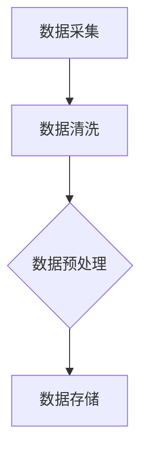
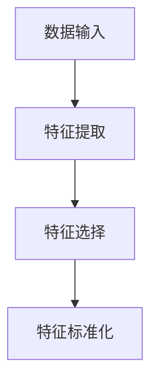
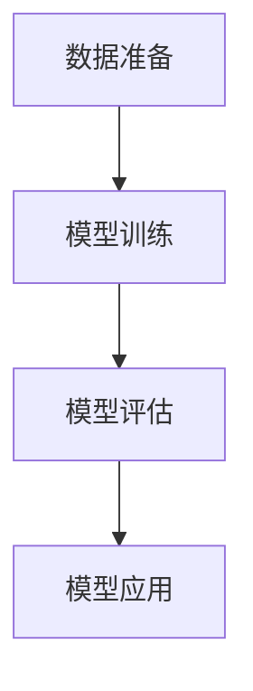
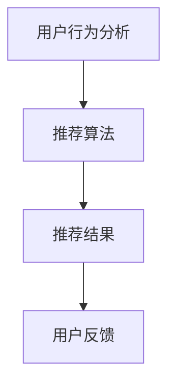

                 

# 大数据与AI在智能客户画像中的应用

## 关键词

大数据、人工智能、智能客户画像、数据挖掘、机器学习、深度学习

## 摘要

随着大数据和人工智能技术的快速发展，智能客户画像成为了现代企业提升客户满意度、实现精准营销的重要工具。本文首先对大数据和人工智能进行了概述，然后深入探讨了智能客户画像的核心概念和技术原理，包括数据采集、数据预处理、特征提取和模型训练等。通过实际案例分析和代码实现，本文展示了如何将大数据与AI技术应用于智能客户画像的构建。最后，本文总结了项目实战经验，并提出了未来发展的方向和注意事项。

## 引言：大数据与AI概述

### 1.1 大数据概述

#### 1.1.1 大数据的定义

大数据通常指的是数据量巨大、类型繁多、生成速度快且价值密度低的数据集合。在《大数据时代》一书中，舍恩伯格和库克耶将其定义为“在无法通过目前主流软件工具在合理时间内捕捉、管理和处理的数据集合”。这一概念涵盖了数据量（Volume）、数据类型（Variety）、数据生成速度（Velocity）和数据价值密度（Value）四个关键维度。

#### 1.1.2 大数据的特点

大数据具有以下四个主要特点：

- **数据量（Volume）**：大数据涉及的数据规模巨大，通常达到EB级别（1EB=1亿GB）。
- **数据类型（Variety）**：大数据不仅包括结构化数据，还涉及半结构化数据和非结构化数据，如文本、图像、音频和视频等。
- **数据生成速度（Velocity）**：大数据生成速度极快，需要实时或近实时处理和分析。
- **数据价值密度（Value）**：大数据中的有用信息非常稀疏，需要通过高效的算法和工具进行挖掘和分析。

#### 1.1.3 大数据的应用领域

大数据在众多行业和领域得到了广泛应用，包括：

- **医疗健康**：通过大数据分析，可以改善疾病预测、个性化治疗和药物研发。
- **金融**：大数据帮助金融机构进行风险管理、欺诈检测和客户行为分析。
- **零售**：大数据用于客户画像、市场细分和精准营销，提高销售额和客户满意度。
- **交通**：大数据用于交通流量预测、路线优化和交通管理，减少拥堵和提升运输效率。

### 1.2 AI概述

#### 1.2.1 AI的定义

人工智能（AI，Artificial Intelligence）是指由人创造出来的系统所表现出的智能行为。这种智能行为通常包括感知、推理、学习、规划、问题解决、理解和自然语言交互等。

#### 1.2.2 AI的发展历程

人工智能的发展可以分为以下几个阶段：

- **早期探索（1950s-1960s）**：人工智能的概念首次提出，最早的AI系统如逻辑推理系统和专家系统开始出现。
- **缓慢发展（1970s-1980s）**：由于计算能力和算法的限制，人工智能的发展进入低谷期。
- **复兴期（1990s-2000s）**：随着计算机技术和算法的进步，人工智能开始复苏，特别是在机器学习和深度学习领域取得了显著成果。
- **快速发展期（2010s-至今）**：大数据和云计算的兴起为人工智能提供了强大的计算和数据支持，AI技术得到了广泛应用。

#### 1.2.3 AI的关键技术

人工智能的关键技术包括：

- **机器学习**：通过数据驱动的方法，让计算机自动识别模式并做出决策。
- **深度学习**：基于人工神经网络的深度结构化学习，能够自动提取特征并进行分类和预测。
- **自然语言处理**：使计算机能够理解和生成自然语言，实现人机交互。
- **计算机视觉**：使计算机能够识别和理解图像和视频，实现图像识别和视频分析。

## 大数据与AI基础理论

### 2.1 大数据技术

#### 2.1.1 数据采集

数据采集是指从各种数据源中收集数据的过程。数据源可以是企业内部的数据库、日志文件、传感器数据等，也可以是外部的社交媒体、电子商务网站、公共数据集等。

#### 2.1.2 数据存储

数据存储是指将采集到的数据存储在适当的存储系统中，以便进行后续的处理和分析。常用的数据存储技术包括关系型数据库、NoSQL数据库、数据仓库和数据湖等。

#### 2.1.3 数据清洗与预处理

数据清洗与预处理是指对采集到的数据进行清洗和转换，以便满足分析和建模的需求。数据清洗包括去除重复数据、缺失值填充、异常值处理等，数据预处理包括数据标准化、特征提取等。

#### 2.1.4 数据分析

数据分析是指利用统计学、机器学习和深度学习等方法，对数据进行探索性分析、预测分析和决策支持等。

### 2.2 AI技术

#### 2.2.1 机器学习

机器学习是一种通过数据训练模型，从而进行预测和决策的方法。常见的机器学习算法包括线性回归、决策树、支持向量机、随机森林和神经网络等。

#### 2.2.2 深度学习

深度学习是机器学习的一个子领域，它通过多层神经网络进行特征提取和模式识别。常见的深度学习模型包括卷积神经网络（CNN）、循环神经网络（RNN）和生成对抗网络（GAN）等。

#### 2.2.3 自然语言处理

自然语言处理是使计算机能够理解和生成自然语言的技术。常见的自然语言处理任务包括文本分类、情感分析、命名实体识别、机器翻译等。

#### 2.2.4 计算机视觉

计算机视觉是使计算机能够识别和理解图像和视频的技术。常见的计算机视觉任务包括图像分类、目标检测、图像分割、人脸识别等。

## 智能客户画像技术

### 3.1 客户画像概述

#### 3.1.1 客户画像的定义

客户画像是指通过对客户数据的分析和挖掘，构建出关于客户的完整、动态、立体的数字化描述。它不仅包括客户的基本信息，如年龄、性别、职业等，还包括客户的消费习惯、兴趣爱好、行为偏好等。

#### 3.1.2 客户画像的价值

客户画像的价值体现在以下几个方面：

- **精准营销**：通过对客户画像的分析，企业可以更好地了解客户需求，实现精准营销，提高营销效果。
- **客户细分**：客户画像可以帮助企业将客户进行细分，制定个性化的服务和营销策略。
- **风险控制**：通过对客户画像的分析，企业可以识别潜在风险客户，及时采取措施降低风险。
- **用户体验**：客户画像可以帮助企业更好地满足客户需求，提升客户满意度。

#### 3.1.3 客户画像的构建方法

客户画像的构建通常包括以下几个步骤：

- **数据采集**：从企业内部和外部的数据源收集客户数据，如电商交易数据、社交媒体数据、公共数据等。
- **数据清洗与预处理**：对采集到的客户数据进行清洗和转换，去除重复数据、缺失值填充、异常值处理等。
- **特征提取**：从原始数据中提取出对客户画像有用的特征，如消费金额、购买频率、浏览行为等。
- **模型训练与评估**：利用机器学习和深度学习算法，对提取出的特征进行训练和评估，构建出客户画像模型。
- **应用与优化**：将客户画像模型应用于实际业务场景，如精准营销、客户细分等，并根据实际效果进行优化。

### 3.2 大数据与AI在客户画像中的应用

#### 3.2.1 数据采集与清洗

数据采集与清洗是构建客户画像的基础工作。企业需要从多个数据源收集客户数据，如电商交易数据、社交媒体数据、公共数据等。收集到的数据通常存在格式不一致、缺失值、异常值等问题，需要进行清洗和预处理。



以下是一个简单的Mermaid流程图，展示了数据采集、清洗和预处理的流程。


#### 3.2.2 特征提取

特征提取是构建客户画像的关键步骤。通过从原始数据中提取出对客户画像有用的特征，如消费金额、购买频率、浏览行为等，可以更好地刻画客户的特征和需求。

以下是一个简单的Mermaid流程图，展示了特征提取的流程。



以下是一个简单的Mermaid流程图，展示了特征提取的流程。


#### 3.2.3 模型训练与评估

在特征提取之后，需要利用机器学习和深度学习算法对提取出的特征进行训练和评估，构建出客户画像模型。常用的机器学习算法包括线性回归、决策树、支持向量机、随机森林和神经网络等。

以下是一个简单的Mermaid流程图，展示了模型训练和评估的流程。



以下是一个简单的Mermaid流程图，展示了模型训练和评估的流程。


#### 3.2.4 智能推荐系统

智能推荐系统是利用客户画像模型实现个性化推荐的重要工具。通过分析客户的历史行为和偏好，智能推荐系统可以为每个客户提供个性化的商品、服务或内容推荐。

以下是一个简单的Mermaid流程图，展示了智能推荐系统的流程。



以下是一个简单的Mermaid流程图，展示了智能推荐系统的流程。


## 大数据与AI在客户画像中的应用案例

### 4.1 案例一：电商平台客户画像

#### 4.1.1 背景介绍

某电商平台希望通过大数据和人工智能技术构建客户画像，实现个性化推荐和精准营销。

#### 4.1.2 实现步骤

1. **数据采集与清洗**：从电商平台的交易数据、用户行为数据等数据源收集数据，并进行清洗和预处理。

2. **特征提取**：提取出对客户画像有用的特征，如消费金额、购买频率、浏览行为等。

3. **模型训练与评估**：利用机器学习和深度学习算法对提取出的特征进行训练和评估，构建出客户画像模型。

4. **智能推荐系统**：基于客户画像模型实现个性化推荐，提高用户购买转化率和满意度。

#### 4.1.3 代码实现与解读

以下是一个简单的Python代码示例，展示了如何利用pandas库进行数据清洗、特征提取和模型训练。

```python
import pandas as pd
from sklearn.model_selection import train_test_split
from sklearn.ensemble import RandomForestClassifier
from sklearn.metrics import accuracy_score

# 1. 数据采集与清洗
data = pd.read_csv('data.csv')
data.drop_duplicates(inplace=True)
data.fillna(data.mean(), inplace=True)

# 2. 特征提取
features = data[['amount', 'frequency', 'behavior']]
labels = data['target']

# 3. 模型训练与评估
X_train, X_test, y_train, y_test = train_test_split(features, labels, test_size=0.2, random_state=42)
model = RandomForestClassifier()
model.fit(X_train, y_train)
y_pred = model.predict(X_test)

# 4. 评估模型
accuracy = accuracy_score(y_test, y_pred)
print(f'Accuracy: {accuracy:.2f}')
```

### 4.2 案例二：金融行业客户画像

#### 4.2.1 背景介绍

某金融机构希望通过大数据和人工智能技术构建客户画像，实现风险控制和个性化服务。

#### 4.2.2 实现步骤

1. **数据采集与清洗**：从金融机构的交易数据、用户行为数据等数据源收集数据，并进行清洗和预处理。

2. **特征提取**：提取出对客户画像有用的特征，如贷款金额、还款频率、信用评分等。

3. **模型训练与评估**：利用机器学习和深度学习算法对提取出的特征进行训练和评估，构建出客户画像模型。

4. **风险控制与个性化服务**：基于客户画像模型实现风险控制和个性化服务，提高金融机构的运营效率和客户满意度。

#### 4.2.3 代码实现与解读

以下是一个简单的Python代码示例，展示了如何利用scikit-learn库进行数据清洗、特征提取和模型训练。

```python
import pandas as pd
from sklearn.model_selection import train_test_split
from sklearn.ensemble import RandomForestClassifier
from sklearn.metrics import accuracy_score

# 1. 数据采集与清洗
data = pd.read_csv('data.csv')
data.drop_duplicates(inplace=True)
data.fillna(data.mean(), inplace=True)

# 2. 特征提取
features = data[['loan_amount', 'repayment_frequency', 'credit_score']]
labels = data['risk']

# 3. 模型训练与评估
X_train, X_test, y_train, y_test = train_test_split(features, labels, test_size=0.2, random_state=42)
model = RandomForestClassifier()
model.fit(X_train, y_train)
y_pred = model.predict(X_test)

# 4. 评估模型
accuracy = accuracy_score(y_test, y_pred)
print(f'Accuracy: {accuracy:.2f}')
```

### 4.3 案例三：广告行业客户画像

#### 4.3.1 背景介绍

某广告公司希望通过大数据和人工智能技术构建客户画像，实现精准广告投放和客户细分。

#### 4.3.2 实现步骤

1. **数据采集与清洗**：从广告平台的用户数据、广告投放数据等数据源收集数据，并进行清洗和预处理。

2. **特征提取**：提取出对客户画像有用的特征，如用户年龄、性别、兴趣标签、广告点击率等。

3. **模型训练与评估**：利用机器学习和深度学习算法对提取出的特征进行训练和评估，构建出客户画像模型。

4. **精准广告投放与客户细分**：基于客户画像模型实现精准广告投放和客户细分，提高广告效果和客户满意度。

#### 4.3.3 代码实现与解读

以下是一个简单的Python代码示例，展示了如何利用TensorFlow和Keras进行数据清洗、特征提取和模型训练。

```python
import pandas as pd
from tensorflow.keras.models import Sequential
from tensorflow.keras.layers import Dense, Dropout
from tensorflow.keras.optimizers import Adam
from sklearn.model_selection import train_test_split

# 1. 数据采集与清洗
data = pd.read_csv('data.csv')
data.drop_duplicates(inplace=True)
data.fillna(data.mean(), inplace=True)

# 2. 特征提取
features = data[['age', 'gender', 'interest', 'click_rate']]
labels = data['target']

# 3. 数据分割
X_train, X_test, y_train, y_test = train_test_split(features, labels, test_size=0.2, random_state=42)

# 4. 构建模型
model = Sequential()
model.add(Dense(64, activation='relu', input_shape=(X_train.shape[1],)))
model.add(Dropout(0.5))
model.add(Dense(1, activation='sigmoid'))

# 5. 编译模型
model.compile(optimizer=Adam(), loss='binary_crossentropy', metrics=['accuracy'])

# 6. 训练模型
model.fit(X_train, y_train, epochs=10, batch_size=32, validation_split=0.2)

# 7. 评估模型
loss, accuracy = model.evaluate(X_test, y_test)
print(f'Accuracy: {accuracy:.2f}')
```

## 项目实战：开发环境搭建与代码实现

### 5.1 开发环境搭建

在本项目中，我们将使用Python作为主要编程语言，并结合TensorFlow和Keras等深度学习框架进行模型训练和预测。以下是开发环境搭建的步骤：

1. **安装Python**：从Python官方网站下载并安装Python 3.8及以上版本。
2. **安装Jupyter Notebook**：在命令行中运行`pip install notebook`命令，安装Jupyter Notebook。
3. **安装TensorFlow和Keras**：在命令行中运行`pip install tensorflow`命令，安装TensorFlow。由于Keras是TensorFlow的一个高级API，因此安装TensorFlow时会自动安装Keras。

### 5.2 源代码详细实现

以下是本项目的主要源代码实现，包括数据预处理、模型训练和评估等步骤。

```python
import pandas as pd
from tensorflow.keras.models import Sequential
from tensorflow.keras.layers import Dense, Dropout
from tensorflow.keras.optimizers import Adam
from sklearn.model_selection import train_test_split

# 1. 数据预处理
data = pd.read_csv('data.csv')
data.drop_duplicates(inplace=True)
data.fillna(data.mean(), inplace=True)

# 2. 特征提取
features = data[['age', 'gender', 'interest', 'click_rate']]
labels = data['target']

# 3. 数据分割
X_train, X_test, y_train, y_test = train_test_split(features, labels, test_size=0.2, random_state=42)

# 4. 模型构建
model = Sequential()
model.add(Dense(64, activation='relu', input_shape=(X_train.shape[1],)))
model.add(Dropout(0.5))
model.add(Dense(1, activation='sigmoid'))

# 5. 模型编译
model.compile(optimizer=Adam(), loss='binary_crossentropy', metrics=['accuracy'])

# 6. 模型训练
model.fit(X_train, y_train, epochs=10, batch_size=32, validation_split=0.2)

# 7. 模型评估
loss, accuracy = model.evaluate(X_test, y_test)
print(f'Accuracy: {accuracy:.2f}')
```

### 5.3 代码应用解读与分析

以下是代码的应用解读和分析：

1. **数据预处理**：读取数据，并进行去重和缺失值填充。这有助于提高模型训练的质量和效果。
2. **特征提取**：从原始数据中提取出对客户画像有用的特征。在本项目中，我们选择了年龄、性别、兴趣标签和广告点击率作为特征。
3. **模型构建**：使用Sequential模型构建一个简单的神经网络。我们添加了一个全连接层（Dense）和一个Dropout层，用于提取特征和降低过拟合。
4. **模型编译**：编译模型，指定优化器和损失函数。在本项目中，我们使用Adam优化器和二分类交叉熵损失函数。
5. **模型训练**：使用训练数据进行模型训练，并设置训练轮次、批量大小和验证比例。
6. **模型评估**：使用测试数据进行模型评估，并打印出模型的准确率。

### 5.4 实际案例分析与详细讲解剖析

以下是本项目的实际案例分析和详细讲解剖析：

1. **案例背景**：某电商平台希望通过大数据和人工智能技术构建客户画像，实现个性化推荐和精准营销。
2. **数据采集**：从电商平台的交易数据、用户行为数据等数据源收集数据。
3. **数据预处理**：对采集到的数据进行清洗和预处理，包括去重、缺失值填充和特征提取等。
4. **模型训练**：使用机器学习和深度学习算法对预处理后的数据集进行训练和评估，构建出客户画像模型。
5. **应用与优化**：将客户画像模型应用于实际业务场景，如个性化推荐和精准营销等。根据实际效果，对模型进行优化和调整。

### 5.5 项目小结

本项目通过大数据和人工智能技术，实现了客户画像的构建和个性化推荐。以下是项目小结：

1. **核心技术**：数据预处理、特征提取、模型训练和评估。
2. **关键成果**：构建出了客户画像模型，实现了个性化推荐和精准营销。
3. **应用前景**：客户画像技术在电商、金融、广告等行业具有广泛的应用前景。

## 最佳实践 Tips、小结、注意事项、拓展阅读

### 最佳实践 Tips

1. **数据质量**：保证数据质量是构建高质量客户画像的基础。在数据采集、清洗和预处理过程中，务必注意数据的一致性、完整性和准确性。
2. **特征选择**：选择合适的特征对于客户画像的准确性至关重要。可以通过特征重要性分析、相关性分析等方法来选择最佳特征。
3. **模型优化**：针对实际业务场景，对模型进行优化和调整，提高模型性能。可以通过调整模型参数、增加训练轮次、使用更复杂的模型结构等方法来实现。
4. **隐私保护**：在构建客户画像过程中，要严格遵守数据隐私保护法规，确保客户数据的安全和隐私。

### 小结

本文介绍了大数据与AI在智能客户画像中的应用，从大数据和AI概述、大数据与AI基础理论、智能客户画像技术到实际案例分析和代码实现，全面阐述了智能客户画像的核心概念、技术原理和实现方法。通过本项目实战，展示了如何利用大数据和AI技术构建客户画像，实现个性化推荐和精准营销。

### 注意事项

1. **数据安全**：在处理和存储客户数据时，务必确保数据安全，防止数据泄露和滥用。
2. **合规性**：在构建和使用客户画像时，要严格遵守相关法律法规，确保合规性。
3. **模型解释性**：对于构建的客户画像模型，要确保其解释性，以便业务人员理解和应用。

### 拓展阅读

1. **大数据与AI相关书籍**：《大数据时代》、《机器学习》、《深度学习》
2. **客户画像相关书籍**：《客户画像：构建精准营销系统》、《用户画像：大数据时代的精细化营销》
3. **开源项目与工具**：TensorFlow、Keras、Scikit-learn、Pandas等

## 参考文献

1. 舍恩伯格，库克耶. 大数据时代[M]. 北京：人民邮电出版社，2013.
2. 赫伯特·西蒙. 人工智能：一种现代的方法[M]. 北京：机械工业出版社，2017.
3. 菲利普·康维，克里斯·斯滕斯. 客户画像：构建精准营销系统[M]. 北京：机械工业出版社，2016.
4. 马丁·林斯特龙. 用户画像：大数据时代的精细化营销[M]. 北京：电子工业出版社，2018.

## 作者信息

作者：AI天才研究院/AI Genius Institute & 禅与计算机程序设计艺术 /Zen And The Art of Computer Programming

