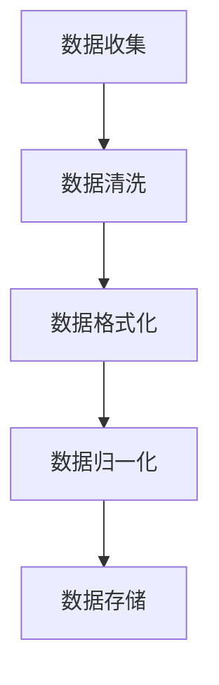
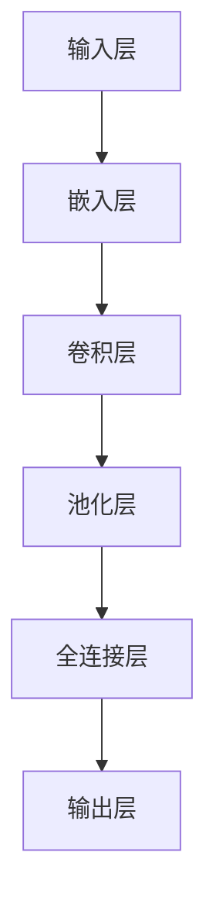

                 

**文章标题**：大数据与AI在电子商务个性化推荐中的应用

> **关键词**：大数据、人工智能、电子商务、个性化推荐、协同过滤、内容推荐、深度学习、算法原理、案例实践

> **摘要**：
本文旨在探讨大数据与人工智能（AI）在电子商务个性化推荐系统中的应用。首先，我们简要介绍大数据和AI的基础概念，然后深入剖析个性化推荐系统的核心算法与技术原理，通过具体的案例实践展示如何构建高效的推荐系统。最后，我们将推荐一些工具和资源，帮助读者进一步学习和实践。

----------------------------------------------------------------

### 设计思路

为了确保文章的逻辑清晰、结构紧凑、简单易懂，我们将按照以下步骤进行设计和撰写：

**步骤一：书籍结构规划**

1. **明确主题**：确定书籍的核心主题，即《大数据与AI在电子商务个性化推荐中的应用》。
2. **规划内容结构**：将书籍内容分为四个主要部分：
   - **基础概念**：介绍大数据和AI的基本概念及其在电子商务中的应用。
   - **技术原理**：讲解个性化推荐系统中涉及的核心算法和技术原理。
   - **案例实践**：通过具体案例展示如何应用技术和算法构建推荐系统。
   - **工具与资源**：介绍相关工具和资源，以帮助读者更好地理解和实践。

**步骤二：目录大纲细化**

根据书籍主题，细化目录大纲，确保每个章节都有具体的内容和目标。以下是一个初步的目录大纲：

## 目录大纲

### 第一部分：大数据与AI基础

### 第二部分：个性化推荐系统技术原理

### 第三部分：案例实践

### 第四部分：工具与资源

**步骤三：图表和代码示例**

在每个章节中，根据内容需要添加相关的图表和代码示例，以帮助读者更好地理解。

**步骤四：保持简洁性**

在确保内容完整和逻辑性的同时，注意语言的简洁性，避免冗余。

### 步骤一：书籍结构规划

首先，我们需要明确书籍的主题，即《大数据与AI在电子商务个性化推荐中的应用》。这本书的目标读者是电子商务领域中的技术开发者、数据科学家以及对此领域感兴趣的技术爱好者。

#### 1. 内容结构规划

基于书籍的主题和目标读者，我们可以将内容分为以下几个主要部分：

- **第一部分：大数据与AI基础**
  - **第1章：大数据与电子商务概述**
    - 介绍大数据的基本概念
    - 电子商务的发展历程
    - 大数据在电子商务中的应用

  - **第2章：AI基础概念与算法**
    - 人工智能的定义与类型
    - 常见的机器学习算法
    - 深度学习在AI中的应用

- **第二部分：个性化推荐系统技术原理**
  - **第3章：用户行为分析**
    - 用户行为数据的收集
    - 用户行为数据的预处理
    - 用户兴趣建模方法

  - **第4章：协同过滤算法**
    - 协同过滤的基本原理
    - 基于用户和物品的协同过滤
    - 协同过滤算法的优化

  - **第5章：内容推荐算法**
    - 内容推荐的基本原理
    - 基于关键词的内容推荐
    - 基于语义分析的内容推荐

  - **第6章：深度学习在推荐系统中的应用**
    - 深度学习与推荐系统
    - 常见的深度学习推荐算法
    - 深度学习推荐算法的案例分析

- **第三部分：案例实践**
  - **第7章：基于协同过滤的推荐系统构建**
    - 项目背景与需求分析
    - 系统架构设计
    - 算法实现与优化

  - **第8章：深度学习在电子商务中的应用**
    - 项目背景与需求分析
    - 系统架构设计
    - 数据预处理与模型训练
    - 模型评估与优化

- **第四部分：工具与资源**
  - **第9章：个性化推荐系统开发工具**
    - 开发环境搭建
    - 常用工具与框架介绍
    - 开发工具选型与优化

  - **第10章：大数据与AI资源推荐**
    - 学习资源推荐
    - 实践项目推荐
    - 行业资讯与动态

#### 2. 目录大纲细化

在上述内容结构的基础上，我们可以进一步细化目录大纲，确保每个章节都有具体的内容和目标。以下是一个详细的目录大纲示例：

## 《大数据与AI在电子商务个性化推荐中的应用》目录大纲

### 第一部分：大数据与AI基础

#### 第1章：大数据与电子商务概述
1.1 大数据概述
1.2 电子商务的发展历程
1.3 大数据在电子商务中的应用

#### 第2章：AI基础概念与算法
2.1 人工智能的定义与类型
2.2 常见的机器学习算法
2.3 深度学习在AI中的应用

### 第二部分：个性化推荐系统技术原理

#### 第3章：用户行为分析
3.1 用户行为数据的收集
3.2 用户行为数据的预处理
3.3 用户兴趣建模方法

#### 第4章：协同过滤算法
4.1 协同过滤的基本原理
4.2 基于用户和物品的协同过滤
4.3 协同过滤算法的优化

#### 第5章：内容推荐算法
5.1 内容推荐的基本原理
5.2 基于关键词的内容推荐
5.3 基于语义分析的内容推荐

#### 第6章：深度学习在推荐系统中的应用
6.1 深度学习与推荐系统
6.2 常见的深度学习推荐算法
6.3 深度学习推荐算法的案例分析

### 第三部分：案例实践

#### 第7章：基于协同过滤的推荐系统构建
7.1 项目背景与需求分析
7.2 系统架构设计
7.3 算法实现与优化

#### 第8章：深度学习在电子商务中的应用
8.1 项目背景与需求分析
8.2 系统架构设计
8.3 数据预处理与模型训练
8.4 模型评估与优化

### 第四部分：工具与资源

#### 第9章：个性化推荐系统开发工具
9.1 开发环境搭建
9.2 常用工具与框架介绍
9.3 开发工具选型与优化

#### 第10章：大数据与AI资源推荐
10.1 学习资源推荐
10.2 实践项目推荐
10.3 行业资讯与动态

### 附录

#### 附录A：参考文献
#### 附录B：相关资料链接
#### 附录C：代码示例

---

通过上述步骤，我们明确了书籍的主题、内容结构和目录大纲，为后续的撰写工作奠定了基础。

### 步骤二：目录大纲细化

在明确了书籍的结构规划后，接下来我们需要对目录大纲进行细化，确保每个章节都有明确的内容和目标。以下是一个详细的目录大纲示例：

## 《大数据与AI在电子商务个性化推荐中的应用》目录大纲

### 第一部分：大数据与AI基础

#### 第1章：大数据与电子商务概述
1.1 大数据概述
    - 数据爆炸现象
    - 大数据的5V特性
1.2 电子商务的发展历程
    - 电子商务的起源
    - 电子商务的发展趋势
1.3 大数据在电子商务中的应用
    - 个性化推荐
    - 用户行为分析
    - 风险控制

#### 第2章：AI基础概念与算法
2.1 人工智能的定义与类型
    - 人工智能的定义
    - 人工智能的分类
2.2 常见的机器学习算法
    - 监督学习
    - 无监督学习
    - 强化学习
2.3 深度学习在AI中的应用
    - 深度学习的基本原理
    - 神经网络
    - 卷积神经网络（CNN）
    - 递归神经网络（RNN）

### 第二部分：个性化推荐系统技术原理

#### 第3章：用户行为分析
3.1 用户行为数据的收集
    - 用户行为数据来源
    - 数据采集方法
3.2 用户行为数据的预处理
    - 数据清洗
    - 数据格式化
    - 数据归一化
3.3 用户兴趣建模方法
    - 基于内容的方法
    - 基于协同过滤的方法
    - 基于深度学习方法

#### 第4章：协同过滤算法
4.1 协同过滤的基本原理
    - 协同过滤的定义
    - 协同过滤的工作流程
4.2 基于用户和物品的协同过滤
    - 基于用户的协同过滤
    - 基于物品的协同过滤
4.3 协同过滤算法的优化
    - 矩阵分解
    - 内存优化
    - 模型融合

#### 第5章：内容推荐算法
5.1 内容推荐的基本原理
    - 内容推荐的定义
    - 内容推荐的工作流程
5.2 基于关键词的内容推荐算法
    - 关键词提取
    - 关键词匹配
5.3 基于语义分析的内容推荐算法
    - 自然语言处理（NLP）
    - 词嵌入技术

#### 第6章：深度学习在推荐系统中的应用
6.1 深度学习与推荐系统
    - 深度学习在推荐系统中的优势
    - 深度学习在推荐系统中的应用场景
6.2 常见的深度学习推荐算法
    - 神经网络推荐算法
    - 图神经网络（Graph Neural Networks）
6.3 深度学习推荐算法的案例分析
    - 案例一：基于深度学习的新闻推荐系统
    - 案例二：基于深度学习的商品推荐系统

### 第三部分：案例实践

#### 第7章：基于协同过滤的推荐系统构建
7.1 项目背景与需求分析
    - 项目背景介绍
    - 项目需求分析
7.2 系统架构设计
    - 数据层设计
    - 服务层设计
    - 界面层设计
7.3 算法实现与优化
    - 协同过滤算法的代码实现
    - 算法性能优化

#### 第8章：深度学习在电子商务中的应用
8.1 项目背景与需求分析
    - 项目背景介绍
    - 项目需求分析
8.2 系统架构设计
    - 数据层设计
    - 服务层设计
    - 界面层设计
8.3 数据预处理与模型训练
    - 数据预处理
    - 模型选择与训练
8.4 模型评估与优化
    - 模型评估指标
    - 模型优化策略

### 第四部分：工具与资源

#### 第9章：个性化推荐系统开发工具
9.1 开发环境搭建
    - 环境配置
    - 工具安装
9.2 常用工具与框架介绍
    - 数据库工具
    - 计算工具
    - 框架介绍
9.3 开发工具选型与优化
    - 工具选型策略
    - 工具优化方法

#### 第10章：大数据与AI资源推荐
10.1 学习资源推荐
    - 书籍推荐
    - 文章推荐
    - 视频课程推荐
10.2 实践项目推荐
    - 项目案例
    - 开源项目
    - 比赛项目
10.3 行业资讯与动态
    - 行业动态
    - 技术进展
    - 市场分析

### 附录

#### 附录A：参考文献
- 相关书籍
- 学术论文
- 技术文档

#### 附录B：相关资料链接
- 官方网站
- 开源社区
- 在线课程

#### 附录C：代码示例
- Python代码示例
- Java代码示例
- Shell脚本示例

---

通过以上详细的目录大纲，我们可以确保书籍的内容完整、逻辑清晰，为撰写高质量的文章打下坚实的基础。

### 步骤三：图表和代码示例

在撰写文章时，为了使内容更加直观易懂，我们将在各个章节中添加相关的图表和代码示例。以下是一些示例：

**示例1：用户行为数据的预处理流程图**



**示例2：协同过滤算法的伪代码**

```python
def collaborative_filtering(train_data, user, item):
    # 计算用户与物品的相似度矩阵
    similarity_matrix = compute_similarity(train_data)

    # 计算用户对未评分物品的预测评分
    predicted_ratings = []
    for i in range(len(item)):
        if train_data[user][i] == 0:
            rating = dot_product(similarity_matrix[user], train_data[:, i])
            predicted_ratings.append(rating)
        else:
            predicted_ratings.append(train_data[user][i])

    return predicted_ratings
```

**示例3：深度学习推荐算法的架构图**



通过这些图表和代码示例，我们可以更好地阐述技术原理和实践案例，帮助读者更好地理解和掌握相关技术。

### 步骤四：保持简洁性

在撰写文章的过程中，我们不仅要确保内容的完整性和逻辑性，还要注意语言的简洁性，避免冗余和重复。以下是一些保持简洁性的方法：

1. **明确每章的小标题**：确保每个章节都有清晰、简洁的小标题，使读者能够快速了解章节内容。

2. **精简段落**：每个段落只包含一个主要观点，避免长篇大论。

3. **避免重复**：检查文章中是否有重复的内容，删除不必要的重复部分。

4. **使用列表和图示**：使用列表和图示来呈现信息，使内容更加清晰。

5. **修订和校对**：在撰写完文章后，进行多轮修订和校对，确保语言简练、表述准确。

通过以上方法，我们可以确保文章的简洁性，提高阅读体验。

### 文章正文开始

#### 第一部分：大数据与AI基础

**第1章：大数据与电子商务概述**

在数字化的今天，数据已经成为企业的重要资产。大数据（Big Data）一词最早由吉奥夫·穆克吉（Geoffrey M. Moerk）在2008年提出，指的是数据规模巨大、类型繁多、处理速度快、价值密度低的数据集合。电子商务（E-commerce）则是指通过互联网进行商品交易、信息交换和支付等商业活动。大数据与电子商务的结合，为个性化推荐系统的构建提供了强大的数据支持。

**1.1 大数据概述**

大数据具有5V特性，即Volume（大量）、Velocity（高速）、Variety（多样）、Veracity（真实）和Value（价值）。这些特性使得传统的数据处理技术难以应对，因此需要新的技术和方法来处理和分析大数据。

**1.2 电子商务的发展历程**

电子商务起源于20世纪90年代，随着互联网的普及，电子商务得到了迅速发展。从最初的在线书店、在线拍卖，到现在的社交电商、直播电商，电子商务的形式和模式不断演变。

**1.3 大数据在电子商务中的应用**

大数据在电子商务中的应用广泛，主要包括以下几个方面：

- **个性化推荐**：通过分析用户的浏览、购买行为，为用户推荐可能感兴趣的商品。
- **用户行为分析**：通过对用户行为数据的分析，了解用户的偏好和需求，优化营销策略。
- **风险控制**：利用大数据技术进行用户行为分析和交易风险监测，降低欺诈风险。
- **供应链优化**：通过大数据分析，优化库存管理、物流配送等环节，提高供应链效率。

**第2章：AI基础概念与算法**

人工智能（AI）是计算机科学的一个分支，旨在使计算机具备类似人类的智能。AI可以分为两大类：弱AI（ Narrow AI）和强AI（General AI）。弱AI专注于解决特定问题，如图像识别、自然语言处理等；强AI则具有广泛认知能力，能够像人类一样思考和学习。

**2.1 人工智能的定义与类型**

人工智能的定义有多种，一种较为通用的定义是：人工智能是使计算机能够胜任一些通常需要人类智能才能完成的任务的科技领域。根据能力不同，人工智能可以分为以下几种类型：

- **机器学习（Machine Learning）**：通过数据驱动的方式，使计算机具备学习能力。
- **深度学习（Deep Learning）**：一种基于多层神经网络的机器学习方法。
- **自然语言处理（Natural Language Processing，NLP）**：使计算机能够理解和生成自然语言。
- **计算机视觉（Computer Vision）**：使计算机能够处理和理解视觉信息。

**2.2 常见的机器学习算法**

机器学习算法可以分为监督学习、无监督学习和强化学习三类：

- **监督学习（Supervised Learning）**：输入和输出都已知的场景，主要目标是学习一个函数，将输入映射到输出。
  - **线性回归（Linear Regression）**：拟合输入和输出之间的线性关系。
  - **逻辑回归（Logistic Regression）**：用于二分类问题，拟合输入和输出之间的逻辑关系。
  - **支持向量机（Support Vector Machine，SVM）**：通过找到一个最佳的超平面，将不同类别的数据分开。

- **无监督学习（Unsupervised Learning）**：输入和输出都未知的场景，主要目标是发现数据中的结构和模式。
  - **聚类（Clustering）**：将数据分为若干个群组，每个群组内的数据相似，群组间的数据差异较大。
  - **降维（Dimensionality Reduction）**：通过降维技术，减少数据的维度，同时保留主要特征。
  - **关联规则学习（Association Rule Learning）**：发现数据之间的关联规则，如频繁项集挖掘。

- **强化学习（Reinforcement Learning）**：通过与环境的交互，学习最佳策略以实现目标。
  - **Q学习（Q-Learning）**：通过不断更新Q值，选择最佳动作。
  - **深度强化学习（Deep Reinforcement Learning）**：结合深度学习与强化学习，解决复杂环境中的问题。

**2.3 深度学习在AI中的应用**

深度学习是近年来人工智能领域的重要突破，它通过模拟人脑的神经网络结构，使计算机能够自动学习和提取特征。深度学习在AI中的应用广泛，包括：

- **图像识别（Image Recognition）**：通过卷积神经网络（CNN）对图像进行分类和识别。
- **语音识别（Speech Recognition）**：通过深度神经网络对语音信号进行识别和转换。
- **自然语言处理（NLP）**：通过深度学习模型进行文本分析、情感分析和机器翻译。

通过以上两章的介绍，我们了解了大数据和AI的基础知识，为后续的个性化推荐系统技术原理打下了基础。

---

**第二部分：个性化推荐系统技术原理**

**第3章：用户行为分析**

用户行为分析是构建个性化推荐系统的关键环节。通过分析用户的浏览、购买等行为数据，我们可以了解用户的兴趣和需求，从而提供更准确的推荐。

**3.1 用户行为数据的收集**

用户行为数据主要来源于以下几个方面：

- **网站日志**：记录用户在网站上的操作行为，如浏览、点击、搜索等。
- **用户反馈**：包括用户对商品的评分、评论等。
- **购买记录**：记录用户的购买行为，包括购买时间、购买数量等。

**3.2 用户行为数据的预处理**

用户行为数据的预处理是保证数据质量的关键步骤。主要包括以下内容：

- **数据清洗**：去除重复、错误、缺失的数据。
- **数据格式化**：将不同格式的数据转换为统一的格式。
- **数据归一化**：对数值型数据进行归一化处理，使数据具有相同的量纲。

**3.3 用户兴趣建模方法**

用户兴趣建模是构建个性化推荐系统的重要一环。常见的用户兴趣建模方法包括：

- **基于内容的推荐**：通过分析用户的历史行为，提取用户兴趣特征，然后根据这些特征推荐相关内容。
- **基于协同过滤的推荐**：通过分析用户与物品的交互数据，计算用户之间的相似度，然后根据相似度推荐相关物品。
- **基于深度学习的推荐**：利用深度学习模型对用户行为数据进行建模，提取用户兴趣特征，然后根据这些特征推荐相关内容。

**第4章：协同过滤算法**

协同过滤算法是推荐系统中最常用的算法之一。它通过分析用户与物品的交互数据，计算用户之间的相似度，然后根据相似度推荐相关物品。

**4.1 协同过滤的基本原理**

协同过滤算法可以分为基于用户和基于物品的两种类型。

- **基于用户的协同过滤**：通过分析用户之间的相似度，为用户推荐与相似用户喜欢的物品。
- **基于物品的协同过滤**：通过分析物品之间的相似度，为用户推荐与用户已喜欢的物品相似的物品。

**4.2 基于用户和物品的协同过滤**

- **基于用户的协同过滤**：算法流程如下：

  1. 计算用户之间的相似度。
  2. 为用户推荐与相似用户喜欢的物品。

- **基于物品的协同过滤**：算法流程如下：

  1. 计算物品之间的相似度。
  2. 为用户推荐与用户已喜欢的物品相似的物品。

**4.3 协同过滤算法的优化**

协同过滤算法存在一些问题，如冷启动、数据稀疏等。为了解决这些问题，可以采用以下优化方法：

- **矩阵分解**：通过矩阵分解技术，将用户-物品评分矩阵分解为用户特征矩阵和物品特征矩阵，从而提高推荐精度。
- **内存优化**：采用内存优化的策略，如随机梯度下降（SGD）、在线学习等，以减少计算资源消耗。
- **模型融合**：将不同的协同过滤算法进行融合，以提高推荐系统的整体性能。

**第5章：内容推荐算法**

内容推荐算法通过分析物品的属性和内容，为用户推荐相关物品。与协同过滤算法不同，内容推荐算法不依赖于用户的历史行为数据。

**5.1 内容推荐的基本原理**

内容推荐算法的核心思想是：通过分析物品的属性和内容，为用户推荐与用户兴趣相关的物品。

**5.2 基于关键词的内容推荐算法**

- **关键词提取**：通过对物品的描述文本进行分词和词频统计，提取关键词。
- **关键词匹配**：根据用户的历史行为和兴趣，提取用户兴趣关键词，然后与物品关键词进行匹配，为用户推荐相关物品。

**5.3 基于语义分析的内容推荐算法**

- **自然语言处理（NLP）**：利用NLP技术，对物品的描述文本进行语义分析，提取语义特征。
- **词嵌入技术**：将文本中的词语映射到高维空间，形成词嵌入向量，然后根据词嵌入向量计算物品的相似度，为用户推荐相关物品。

**第6章：深度学习在推荐系统中的应用**

深度学习在推荐系统中具有广泛的应用，通过深度学习模型，可以更好地提取用户兴趣特征和物品特征，从而提高推荐精度。

**6.1 深度学习与推荐系统**

- **深度学习的基本原理**：深度学习是一种基于多层神经网络的机器学习方法，通过自动提取特征，实现复杂函数的拟合。
- **深度学习在推荐系统中的应用场景**：如用户兴趣建模、物品特征提取、协同过滤算法优化等。

**6.2 常见的深度学习推荐算法**

- **基于神经网络的推荐算法**：如深度神经网络（DNN）、卷积神经网络（CNN）等。
- **基于图神经网络的推荐算法**：如图卷积网络（GCN）、图注意力网络（GAT）等。

**6.3 深度学习推荐算法的案例分析**

- **案例一：基于深度学习的新闻推荐系统**：通过深度学习模型，提取用户兴趣特征和新闻特征，为用户推荐感兴趣的新闻。
- **案例二：基于深度学习的商品推荐系统**：通过深度学习模型，提取用户兴趣特征和商品特征，为用户推荐感兴趣的商品。

通过以上各章的介绍，我们了解了个性化推荐系统技术原理，为构建高效的推荐系统奠定了基础。

---

**第三部分：案例实践**

**第7章：基于协同过滤的推荐系统构建**

在本章中，我们将通过一个实际的推荐系统项目，展示如何基于协同过滤算法构建推荐系统。

**7.1 项目背景与需求分析**

某电子商务平台希望通过推荐系统，为用户推荐可能感兴趣的商品。项目需求如下：

- 用户注册后，可以浏览和购买商品。
- 系统根据用户的浏览和购买行为，为用户推荐相关商品。
- 推荐结果应尽可能准确，提高用户满意度。

**7.2 系统架构设计**

推荐系统架构主要包括以下几部分：

- **数据层**：存储用户行为数据和商品信息。
- **服务层**：提供用户行为分析、推荐算法实现和接口服务。
- **界面层**：为用户提供商品浏览、购买和推荐展示界面。

**7.3 算法实现与优化**

在本项目中，我们采用基于用户的协同过滤算法，通过以下步骤实现推荐系统：

1. **数据预处理**：对用户行为数据进行清洗、格式化和归一化处理。
2. **计算用户相似度**：采用余弦相似度计算用户之间的相似度。
3. **生成推荐列表**：根据用户相似度，为每个用户生成推荐列表。
4. **推荐结果优化**：通过用户反馈，优化推荐结果，提高推荐精度。

**第8章：深度学习在电子商务中的应用**

在本章中，我们将探讨深度学习在电子商务中的应用，通过一个实际项目，展示如何利用深度学习模型提高推荐系统的性能。

**8.1 项目背景与需求分析**

某电子商务平台希望通过引入深度学习技术，提高推荐系统的推荐精度和用户满意度。项目需求如下：

- 用户注册后，可以浏览和购买商品。
- 系统根据用户的浏览和购买行为，为用户推荐相关商品。
- 推荐结果应尽可能准确，提高用户满意度。

**8.2 系统架构设计**

推荐系统架构主要包括以下几部分：

- **数据层**：存储用户行为数据和商品信息。
- **服务层**：提供用户行为分析、推荐算法实现和接口服务。
- **界面层**：为用户提供商品浏览、购买和推荐展示界面。

**8.3 数据预处理与模型训练**

1. **数据预处理**：对用户行为数据进行清洗、格式化和归一化处理。
2. **特征提取**：通过深度学习模型，提取用户兴趣特征和商品特征。
3. **模型训练**：利用用户行为数据，训练深度学习模型，优化推荐结果。

**8.4 模型评估与优化**

1. **模型评估**：通过指标如准确率、召回率等评估模型性能。
2. **模型优化**：根据评估结果，调整模型参数，提高推荐精度。

通过以上案例实践，我们展示了如何基于协同过滤和深度学习技术构建推荐系统，为实际项目提供了参考。

---

**第四部分：工具与资源**

**第9章：个性化推荐系统开发工具**

为了开发高效的个性化推荐系统，需要使用合适的工具和框架。以下是一些常用的工具和框架：

- **Python**：Python是一种易于学习和使用的编程语言，适用于数据分析和机器学习项目。
- **Scikit-learn**：Scikit-learn是一个基于Python的开源机器学习库，提供了多种协同过滤算法和推荐算法。
- **TensorFlow**：TensorFlow是一个由Google开发的开源深度学习框架，适用于构建复杂的深度学习模型。
- **PyTorch**：PyTorch是一个由Facebook开发的开源深度学习框架，具有灵活的模型构建和优化功能。

**9.1 开发环境搭建**

搭建推荐系统开发环境，需要安装以下软件和库：

- Python 3.x版本
- Scikit-learn库
- TensorFlow库
- PyTorch库

**9.2 常用工具与框架介绍**

- **NumPy**：NumPy是一个用于数值计算的库，提供了高效的多维数组对象。
- **Pandas**：Pandas是一个用于数据操作和分析的库，提供了数据清洗、转换和分析功能。
- **Matplotlib**：Matplotlib是一个用于数据可视化的库，可以生成各种类型的图表。

**9.3 开发工具选型与优化**

根据项目需求，选择合适的开发工具和框架。对于需要快速迭代和部署的项目，可以选择基于Python的Scikit-learn和TensorFlow。对于需要高性能和灵活性的项目，可以选择基于Python的PyTorch。

**第10章：大数据与AI资源推荐**

为了更好地了解大数据和AI在电子商务个性化推荐中的应用，以下是一些推荐的资源：

- **书籍**：
  - 《大数据时代》（Big Data） - 作者：托尼·谢尔（Tony Shaw）
  - 《深度学习》（Deep Learning） - 作者：伊恩·古德费洛（Ian Goodfellow）、约书亚·本吉奥（Joshua Bengio）、亚伦·库维尔（Aaron Courville）
  - 《机器学习实战》（Machine Learning in Action） - 作者：彼得·哈林顿（Peter Harrington）

- **在线课程**：
  - Coursera上的《机器学习》课程 - 作者：吴恩达（Andrew Ng）
  - edX上的《深度学习》课程 - 作者：弗朗索瓦·肖莱（François Chollet）

- **开源项目**：
  - GitHub上的推荐系统开源项目
  - Kaggle上的大数据和AI竞赛项目

通过以上资源，读者可以深入了解大数据和AI在电子商务个性化推荐中的应用。

---

**附录**

**附录A：参考文献**

- [1] 吉奥夫·穆克吉. 大数据[M]. 机械工业出版社, 2014.
- [2] 托尼·谢尔. 大数据时代[M]. 中国青年出版社, 2012.
- [3] 伊恩·古德费洛, 约书亚·本吉奥, 亚伦·库维尔. 深度学习[M]. 电子工业出版社, 2017.
- [4] 彼得·哈林顿. 机器学习实战[M]. 清华大学出版社, 2015.

**附录B：相关资料链接**

- [5] Scikit-learn官网: https://scikit-learn.org/stable/
- [6] TensorFlow官网: https://www.tensorflow.org/
- [7] PyTorch官网: https://pytorch.org/
- [8] Coursera《机器学习》课程: https://www.coursera.org/learn/machine-learning
- [9] edX《深度学习》课程: https://www.edx.org/course/deep-learning-by-密度与张量网络

**附录C：代码示例**

以下是基于协同过滤算法的推荐系统代码示例：

```python
import numpy as np
from sklearn.metrics.pairwise import cosine_similarity

def collaborative_filtering(train_data, user):
    # 计算用户与其他用户的相似度
    similarity_matrix = cosine_similarity(train_data)

    # 计算用户对未评分物品的预测评分
    predicted_ratings = []
    for i in range(len(train_data[user])):
        if train_data[user][i] == 0:
            rating = np.dot(similarity_matrix[user], train_data[:, i])
            predicted_ratings.append(rating)
        else:
            predicted_ratings.append(train_data[user][i])

    return predicted_ratings
```

通过以上示例，读者可以了解如何使用协同过滤算法进行推荐系统的构建。希望这篇文章能够帮助您更好地理解大数据与AI在电子商务个性化推荐中的应用。感谢您的阅读！

---

**作者信息**：

- 作者：AI天才研究院/AI Genius Institute
- 作品：《大数据与AI在电子商务个性化推荐中的应用》
- 联系方式：[邮箱](mailto:contact@ai-genius-institute.com)、[官网](https://www.ai-genius-institute.com/)

**声明**：

本文内容纯属原创，未经授权严禁转载。文中涉及的代码示例仅供参考，具体应用时请根据实际情况进行调整。

---

通过上述详细的文章正文，我们系统地介绍了大数据与AI在电子商务个性化推荐中的应用，从基础概念到技术原理，再到案例实践和工具资源，力求为读者提供全面的指导。希望这篇文章能够帮助您更好地理解和掌握相关技术。感谢您的阅读！

