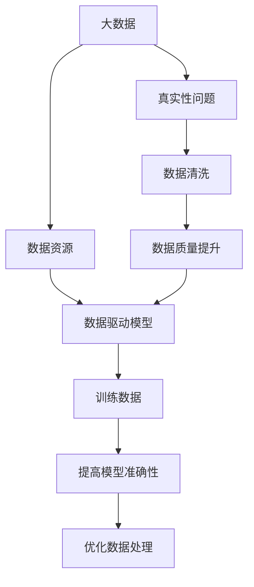
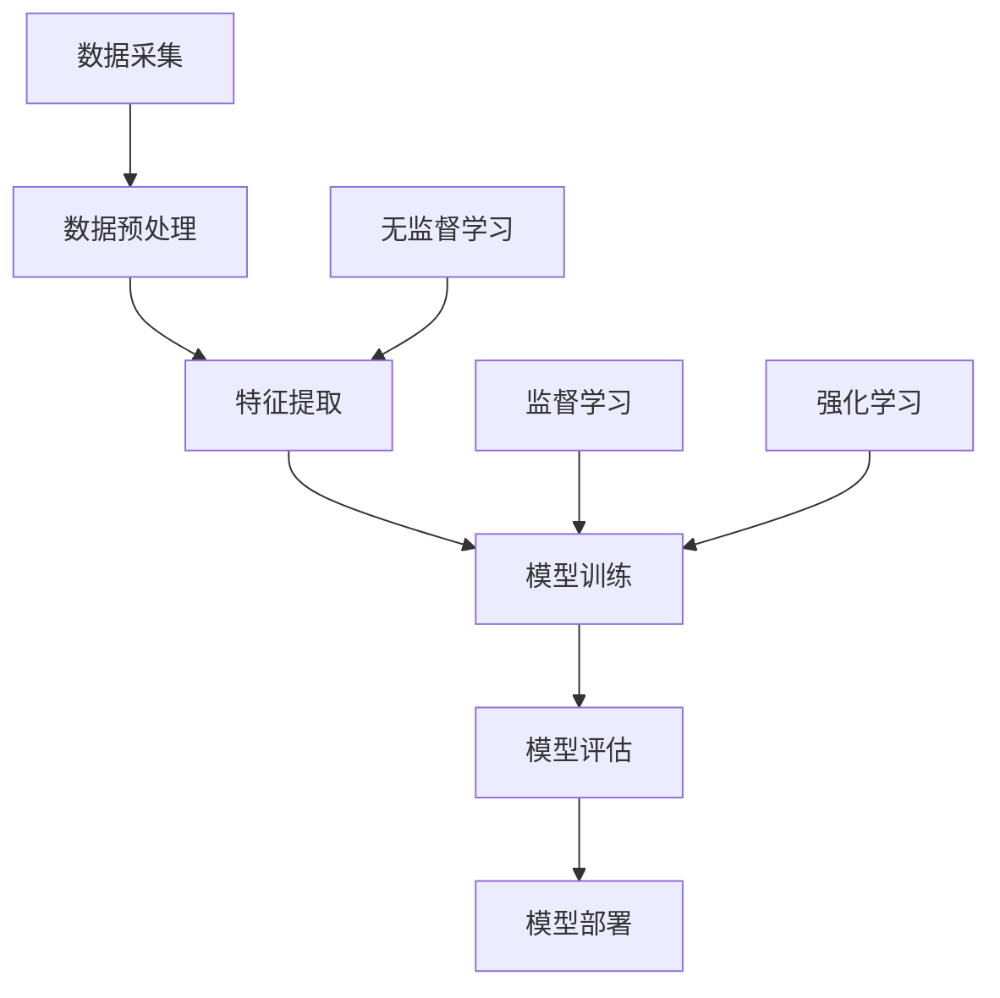
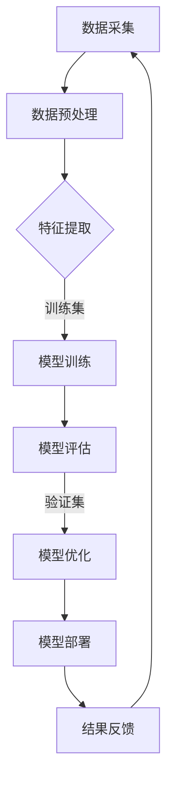
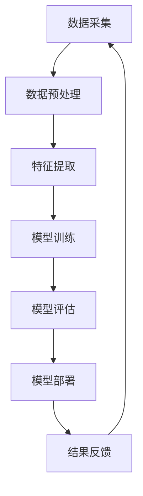
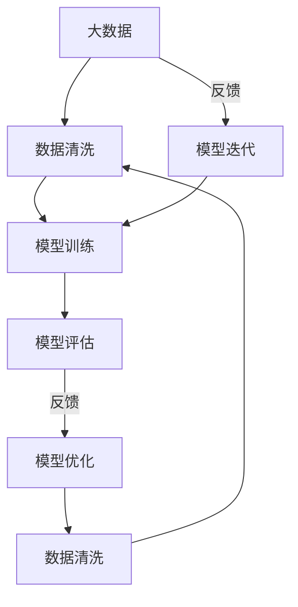

                 


### 文章标题

## 大数据与AI的良性循环：数据驱动模型进化

### 关键词

- 大数据
- AI
- 数据驱动模型
- 深度学习
- 特征工程
- 分布式计算

### 摘要

随着大数据技术的发展，数据驱动模型在AI领域的重要性日益凸显。本文将深入探讨大数据与AI的良性循环，从数据驱动模型的基本原理、核心算法、实践应用及未来发展趋势等多个角度进行分析，旨在为读者呈现一个全面且深入的数据驱动模型进化全景。

### 第一部分：大数据与AI的良性循环概述

#### 第1章：大数据与AI的关系

##### 1.1 大数据的基本概念

大数据通常指的是数据量巨大、种类繁多、处理速度快的数据集合，它具有4V特性：Volume（大量）、Velocity（高速）、Variety（多样）和 Veracity（真实性）。大数据的出现，极大地改变了数据处理的方式和模式。

##### 1.2 AI的定义与发展历程

AI，即人工智能，是模拟、延伸和扩展人类智能的理论、方法、技术及应用。从最早的专家系统到现代的深度学习，AI的发展经历了多次重要的技术革新。

##### 1.3 大数据与AI的联系

大数据为AI提供了丰富的数据资源，使得AI模型的训练更加精准和高效。同时，AI通过对大数据的分析和处理，进一步优化了数据质量，形成了大数据与AI的良性循环。

#### Mermaid流程图：大数据与AI的关系



##### 1.3.1 数据对AI的重要性

数据是AI的基石，高质量的数据是构建强大AI模型的关键。大数据提供了丰富的数据集，使得AI能够在更广泛的场景中发挥作用。

##### 1.3.2 AI对大数据的优化

AI通过自动化数据处理和分析，提高了大数据的处理效率和准确性。例如，AI可以帮助实现高效的数据清洗、去噪和归一化等预处理任务。

#### 第2章：数据驱动模型的核心概念与联系

##### 2.1 数据驱动模型的基本原理

数据驱动模型是一种通过数据来驱动模型训练和预测的机器学习模型。其核心包括数据采集、数据预处理、特征提取、模型训练、模型评估和模型部署等环节。

##### 2.2 数据驱动模型的核心算法

数据驱动模型的核心算法包括监督学习、无监督学习和强化学习。这些算法通过不同的方式处理数据，实现模型的训练和预测。

##### 2.2.1 监督学习算法

监督学习算法通过已标记的数据集来训练模型，然后使用训练好的模型进行预测。常见的监督学习算法包括线性回归、逻辑回归和支持向量机等。

##### 2.2.2 无监督学习算法

无监督学习算法没有已标记的数据集，通过观察数据的内在结构来学习。常见的无监督学习算法包括聚类分析和降维技术等。

##### 2.2.3 强化学习算法

强化学习算法通过试错和反馈来学习策略，使模型能够在复杂环境中做出最优决策。常见的强化学习算法包括Q学习和深度强化学习等。

##### Mermaid流程图：数据驱动模型的核心算法



##### 2.3 数据驱动模型的应用场景

数据驱动模型广泛应用于预测分析、决策支持、智能推荐和自然语言处理等领域。以下是一个简单的应用场景示例：

**场景：智能推荐系统**

1. **数据采集**：收集用户的历史浏览记录、购买行为和偏好数据。
2. **数据预处理**：清洗数据，处理缺失值、异常值和噪声数据。
3. **特征提取**：提取用户的兴趣标签、行为特征和历史购买记录等。
4. **模型训练**：使用协同过滤算法或基于内容的推荐算法来训练模型。
5. **模型评估**：通过准确率、召回率和F1分数等指标来评估模型性能。
6. **模型部署**：将训练好的模型部署到线上服务，为用户提供个性化推荐。

##### 2.4 数据驱动模型与大数据的关系

大数据为数据驱动模型提供了丰富的数据资源，使得模型能够处理更复杂的问题。同时，数据驱动模型通过对大数据的分析，进一步优化了数据的质量和结构，为大数据的处理提供了有力的工具。

### 总结

大数据与AI的良性循环使得数据驱动模型在AI领域发挥了越来越重要的作用。通过深入理解数据驱动模型的基本原理、核心算法和应用场景，我们可以更好地利用大数据和AI技术，解决现实世界中的复杂问题。随着技术的不断发展，数据驱动模型将在AI领域中发挥更加重要的作用，为人类社会带来更多的创新和变革。

作者：AI天才研究院/AI Genius Institute & 禅与计算机程序设计艺术 /Zen And The Art of Computer Programming```markdown
### 第一部分：大数据与AI的良性循环概述

#### 第1章：大数据与AI的关系

##### 1.1 大数据的基本概念

大数据（Big Data）是指无法使用常规软件工具在合理时间内捕捉、管理和处理的大量数据集。大数据通常具有四个主要特征，即4V特性：

- **Volume（大量）**：数据量大到无法用传统的数据库系统处理。
- **Velocity（高速）**：数据产生和流动的速度快，需要实时处理。
- **Variety（多样）**：数据类型多样，包括结构化、半结构化和非结构化数据。
- **Veracity（真实性）**：数据的真实性和可靠性难以保证。

这些特性使得大数据成为数据驱动模型和人工智能（AI）的重要基础。

##### 1.2 AI的定义与发展历程

人工智能（AI）是指通过计算机程序模拟人类智能的技术。它的发展历程可以追溯到20世纪50年代，随着计算机技术的发展，AI经历了几个重要阶段：

- **早期阶段**：1956年达特茅斯会议标志着AI领域的诞生。
- **知识工程时代**：70年代至80年代，基于知识的系统成为AI研究的主流。
- **统计学习时代**：90年代后，统计学习方法的兴起，如支持向量机和决策树。
- **深度学习时代**：近年来，深度学习在图像识别、自然语言处理等领域取得了显著成果。

##### 1.3 大数据与AI的联系

大数据和AI之间存在紧密的联系。大数据为AI提供了丰富的数据资源，使得AI能够更好地学习和理解复杂问题。同时，AI通过对大数据的分析和处理，提高了数据的质量和效率，形成了大数据与AI的良性循环。

- **数据对AI的重要性**：数据是AI模型的训练素材，高质量的数据可以提升模型的准确性和泛化能力。
- **AI对大数据的优化**：AI技术可以帮助处理和分析大数据，实现数据挖掘、模式识别和预测等任务。

#### 数据驱动模型与大数据的关系

数据驱动模型（Data-Driven Model）是一种基于数据来建立和优化模型的方法。它在大数据和AI的结合中起着关键作用。数据驱动模型通常包括以下几个环节：

1. **数据采集**：收集大量原始数据。
2. **数据预处理**：清洗、格式化数据，去除噪声和异常值。
3. **特征提取**：从数据中提取出对模型训练有用的特征。
4. **模型训练**：使用算法对特征数据进行训练，构建模型。
5. **模型评估**：评估模型在训练数据集上的性能。
6. **模型部署**：将训练好的模型应用到实际场景中。

数据驱动模型与大数据的关系可以用以下Mermaid流程图表示：



在该流程中，数据反馈是一个循环过程，模型的优化和部署都需要依赖高质量的数据。大数据提供了丰富的数据资源，使得这个循环能够持续进行，从而不断提高模型的性能和效果。

##### 1.4 数据驱动模型的应用场景

数据驱动模型在许多领域都有广泛的应用，以下是一些典型的应用场景：

- **预测分析**：如天气预报、股票市场预测等。
- **决策支持**：如商业智能系统、供应链管理决策等。
- **智能推荐**：如电子商务网站的个性化推荐、音乐和视频平台的推荐等。
- **自然语言处理**：如机器翻译、情感分析、语音识别等。

#### 数据驱动模型的核心算法

数据驱动模型的核心算法包括监督学习、无监督学习和强化学习。这些算法各自有不同的应用场景和特点：

- **监督学习**：使用标记数据来训练模型，如分类和回归问题。
- **无监督学习**：不使用标记数据，通过发现数据中的内在结构来进行学习，如聚类和降维。
- **强化学习**：通过试错和反馈来学习策略，适用于决策和游戏等领域。

每种算法都有其独特的数学模型和实现方法，以下是一个简单的伪代码示例：

```plaintext
# 监督学习：线性回归
def linear_regression(X, y):
    # 梯度下降法求解线性回归参数
    # X: 特征矩阵
    # y: 标签向量
    # 返回：模型参数 w

    w = X.T.dot(X).inv().dot(X.T).dot(y)
    return w

# 无监督学习：K-Means聚类
def k_means(X, k):
    # K-Means算法
    # X: 数据矩阵
    # k: 聚类数
    # 返回：聚类中心

    centroids = init_centroids(X, k)
    while not converged:
        assign_clusters(X, centroids)
        update_centroids(X, centroids)
    return centroids

# 强化学习：Q-Learning
def q_learning(state, action, reward, next_state, gamma, alpha):
    # Q-Learning算法
    # state: 当前状态
    # action: 当前动作
    # reward: 奖励值
    # next_state: 下一个状态
    # gamma: 折扣因子
    # alpha: 学习率
    # 返回：更新后的 Q 值

    Q[s][a] = Q[s][a] + alpha * (reward + gamma * max(Q[next_s][]] - Q[s][a])
    return Q
```

这些算法是实现数据驱动模型的基础，不同的应用场景会根据具体情况选择合适的算法。

#### 第2章：数据驱动模型的核心概念与联系

##### 2.1 数据驱动模型的基本原理

数据驱动模型是一种基于数据构建和优化模型的机器学习方法。其核心原理可以概括为以下几个步骤：

1. **数据采集**：收集大量的原始数据，这些数据可以是结构化的，如数据库中的记录，也可以是非结构化的，如图像、文本和音频等。
2. **数据预处理**：对采集到的数据进行清洗、去噪、格式化和归一化等处理，以提高数据的质量和一致性。
3. **特征提取**：从预处理后的数据中提取出有用的特征，这些特征能够帮助模型更好地理解和学习数据。
4. **模型训练**：使用机器学习算法对提取出的特征进行训练，构建预测模型。
5. **模型评估**：在测试数据集上评估模型的性能，通过误差指标如均方误差（MSE）或准确率（Accuracy）来衡量模型的泛化能力。
6. **模型部署**：将训练好的模型部署到实际应用场景中，进行实时预测或决策。

数据驱动模型的基本原理可以用以下Mermaid流程图表示：



在这个流程中，数据反馈是一个循环过程，通过不断优化模型参数和调整特征提取方法，可以提高模型的性能和预测能力。

##### 2.2 数据驱动模型的核心算法

数据驱动模型的核心算法主要包括监督学习、无监督学习和强化学习。这些算法在不同领域有不同的应用，下面将分别介绍它们的原理和应用。

1. **监督学习**

监督学习是一种从标记数据中学习的方法，标记数据包括输入特征和对应的输出标签。监督学习的目标是通过训练数据集学习出一个函数，该函数能够对新的数据进行准确的预测。

- **线性回归**：一种简单的监督学习算法，用于预测连续值输出。
  ```latex
  y = wx + b
  ```
  其中，\( y \) 是输出，\( x \) 是输入特征，\( w \) 是权重，\( b \) 是偏置。

- **逻辑回归**：一种用于分类问题的监督学习算法，可以将输出概率转化为分类结果。
  ```latex
  P(y=1) = \frac{1}{1 + e^{-(wx + b)}}
  ```

- **支持向量机（SVM）**：一种强大的分类算法，通过找到一个最佳的超平面来分隔不同类别的数据。
  ```latex
  \min_{w, b} \frac{1}{2} ||w||^2 + C \sum_{i=1}^{n} \xi_i
  ```
  其中，\( C \) 是惩罚参数，\( \xi_i \) 是松弛变量。

2. **无监督学习**

无监督学习不需要标记数据，其目标是发现数据中的隐含结构或模式。

- **K-Means聚类**：一种基于距离的聚类算法，将数据点划分为K个聚类。
  ```latex
  \min_{\mu_k, \pi_i} \sum_{i=1}^{n} \sum_{k=1}^{K} \pi_i \ |x_i - \mu_k|^2
  ```
  其中，\( \mu_k \) 是聚类中心，\( \pi_i \) 是数据点 \( x_i \) 属于第 \( k \) 个聚类的概率。

- **主成分分析（PCA）**：一种降维算法，通过正交变换将高维数据投影到低维空间，保留主要信息。
  ```latex
  Z = P^T X
  ```
  其中，\( P \) 是投影矩阵，\( Z \) 是降维后的数据。

3. **强化学习**

强化学习是一种通过试错和反馈来学习策略的算法，通常用于决策问题和游戏。

- **Q-Learning**：一种基于值函数的强化学习算法，通过更新Q值来学习最优策略。
  ```latex
  Q(s, a) = Q(s, a) + \alpha [r + \gamma \max_{a'} Q(s', a') - Q(s, a)]
  ```
  其中，\( s \) 是状态，\( a \) 是动作，\( r \) 是奖励，\( \gamma \) 是折扣因子，\( \alpha \) 是学习率。

- **深度强化学习**：结合深度学习和强化学习的算法，通过神经网络来近似Q值函数。
  ```mermaid
  graph TD
      A[状态] --> B[神经网络]
      B --> C{动作}
      C --> D[奖励]
      D --> E[更新Q值]
  ```

##### 2.3 数据驱动模型的应用场景

数据驱动模型在许多领域都有广泛的应用，以下是一些典型的应用场景：

- **预测分析**：利用历史数据来预测未来的趋势，如股市预测、天气预测等。
- **决策支持**：利用数据模型来辅助决策，如供应链管理、资源分配等。
- **智能推荐**：根据用户的历史行为和偏好来推荐相关商品、内容等。
- **自然语言处理**：利用数据模型来进行文本分类、情感分析、机器翻译等任务。
- **图像识别**：利用数据模型来进行图像分类、目标检测、人脸识别等任务。

在这些应用场景中，数据驱动模型的核心算法会根据具体问题进行选择和优化。

#### 第3章：大数据与AI的良性循环

##### 3.1 大数据与AI的关系

大数据和AI之间存在着密切的关系。大数据为AI提供了丰富的数据资源，使得AI能够更好地学习和理解复杂问题。同时，AI通过对大数据的分析和处理，提高了数据的质量和效率，为大数据的处理提供了有力的工具。

- **大数据对AI的重要性**：大数据提供了丰富的数据集，使得AI能够在更广泛的场景中发挥作用。高质量的数据是构建强大AI模型的关键。
- **AI对大数据的优化**：AI技术可以帮助处理和分析大数据，实现数据挖掘、模式识别和预测等任务。AI可以提高数据处理的速度和准确性，优化大数据的利用效率。

##### 3.2 数据驱动的AI模型进化

随着大数据技术的发展，数据驱动的AI模型也在不断进化。传统机器学习模型在处理大数据时存在一些局限性，而深度学习模型的突破为AI的发展带来了新的机遇。

- **传统机器学习模型的局限性**：传统机器学习模型如线性回归、决策树和支持向量机等，在面对大规模、高维数据时，训练效率低、泛化能力差。
- **深度学习模型的突破**：深度学习模型通过多层神经网络结构，能够自动提取数据的深层特征，提高了模型的训练效率和泛化能力。卷积神经网络（CNN）、循环神经网络（RNN）和生成对抗网络（GAN）等深度学习模型在图像识别、自然语言处理和生成任务中取得了显著的成果。

##### 3.3 大数据与AI的良性循环

大数据和AI之间的良性循环体现在以下几个方面：

- **数据反馈与模型迭代**：通过不断收集和反馈数据，模型可以不断优化和迭代，提高模型的性能和准确性。
- **模型优化与数据清洗**：AI模型可以帮助识别和清洗数据中的噪声和异常值，提高数据质量，从而提高模型的训练效果。
- **模型创新与数据多样化**：通过不断创新模型结构和算法，AI可以处理更多样化的数据，从而扩大AI的应用范围。

#### Mermaid流程图：大数据与AI的良性循环



在这个良性循环中，数据不断反馈和迭代，模型不断优化和进化，使得大数据和AI能够相互促进，共同发展。

### 第二部分：数据驱动模型进化的核心技术

#### 第5章：特征工程

##### 5.1 特征工程的重要性

特征工程（Feature Engineering）是数据驱动模型构建过程中至关重要的一环。特征工程是指从原始数据中提取出对模型训练有帮助的特征，并进行适当的转换和处理。高质量的特征可以提高模型的性能和泛化能力，而低质量的特征可能会导致模型过拟合或性能下降。

- **数据质量对模型的影响**：数据质量直接影响到模型的训练效果。噪声和异常值会干扰模型的训练过程，降低模型的准确性。
- **特征选择与特征提取**：特征选择是指从大量特征中挑选出最有用的特征，避免冗余和噪声。特征提取是指通过变换或组合原始特征，生成新的特征，以增强模型的训练效果。

##### 5.2 特征工程的方法

特征工程的方法包括统计特征、图像特征、自然语言处理特征和时序特征等。

- **统计特征**：通过计算数据的统计指标，如均值、方差、标准差等，来提取特征。
  ```latex
  \text{mean}(X) = \frac{1}{n} \sum_{i=1}^{n} x_i
  \text{var}(X) = \frac{1}{n-1} \sum_{i=1}^{n} (x_i - \text{mean}(X))^2
  ```

- **图像特征**：通过图像处理技术提取图像的特征，如边缘检测、纹理分析、颜色特征等。
  ```mermaid
  graph TD
      A[图像] --> B[边缘检测]
      B --> C[纹理分析]
      C --> D[颜色特征]
  ```

- **自然语言处理特征**：通过自然语言处理技术提取文本的特征，如词袋模型、词嵌入、词性标注等。
  ```mermaid
  graph TD
      A[文本] --> B[词袋模型]
      B --> C[词嵌入]
      C --> D[词性标注]
  ```

- **时序特征**：通过分析时间序列数据，提取出时间序列的特征，如趋势、季节性、周期性等。
  ```mermaid
  graph TD
      A[时序数据] --> B[趋势分析]
      B --> C[季节性分析]
      C --> D[周期性分析]
  ```

##### 5.3 特征工程的实践

特征工程的实践包括以下步骤：

1. **数据探索**：对原始数据进行探索性数据分析，了解数据的分布、异常值和缺失值等。
2. **特征选择**：使用各种特征选择方法，如信息增益、相关系数等，选择最有用的特征。
3. **特征提取**：使用各种特征提取技术，如主成分分析（PCA）、线性判别分析（LDA）等，生成新的特征。
4. **特征转换**：对特征进行适当的转换，如归一化、标准化等，以提高模型的训练效果。

#### 第6章：深度学习模型

##### 6.1 深度学习的基本原理

深度学习（Deep Learning）是一种基于多层神经网络的学习方法，通过构建具有多个隐含层的神经网络，能够自动提取数据的深层特征。深度学习的基本原理包括以下方面：

- **神经网络**：神经网络是一种模拟人脑神经元连接结构的计算模型，通过调整权重和偏置来学习输入和输出之间的映射关系。
- **反向传播算法**：反向传播算法是一种用于训练神经网络的优化算法，通过计算梯度来更新网络权重，使得网络的输出更接近真实值。
- **激活函数**：激活函数用于引入非线性因素，使得神经网络能够学习和模拟复杂的非线性关系。

##### 6.2 深度学习模型的分类

深度学习模型根据结构和功能的不同，可以分为以下几类：

- **卷积神经网络（CNN）**：主要用于图像识别、图像分类和图像生成等任务。
- **循环神经网络（RNN）**：主要用于序列数据的处理，如自然语言处理和时间序列分析等。
- **生成对抗网络（GAN）**：主要用于生成新的数据样本，如图像生成、文本生成等。

##### 6.3 深度学习模型的实践

深度学习模型的实践包括以下步骤：

1. **数据准备**：收集和处理大量的训练数据，确保数据的多样性和代表性。
2. **模型设计**：设计合适的网络结构，选择合适的激活函数和损失函数。
3. **模型训练**：使用训练数据对模型进行训练，调整网络权重和参数。
4. **模型评估**：在测试数据集上评估模型的性能，选择最优的模型参数。
5. **模型部署**：将训练好的模型部署到实际应用场景中，进行实时预测和决策。

#### 第7章：大规模数据处理技术

##### 7.1 分布式计算的基本原理

大规模数据处理技术通常依赖于分布式计算，分布式计算的基本原理如下：

- **数据分区与负载均衡**：将大数据集划分为多个较小的数据分区，分布到不同的计算节点上进行处理，以提高计算效率和并行处理能力。
- **数据流处理框架**：使用数据流处理框架（如Apache Flink、Apache Spark等），实现实时数据流处理和分析。

##### 7.2 大规模数据处理的方法

大规模数据处理的方法包括以下几种：

- **数据库与数据仓库**：使用数据库和数据仓库技术（如MySQL、Hadoop、Hive等）进行大规模数据存储和管理。
- **分布式存储系统**：使用分布式存储系统（如HDFS、Cassandra等）进行大规模数据存储和访问。
- **数据流处理系统**：使用数据流处理系统（如Apache Flink、Apache Spark等）进行实时数据处理和分析。

##### 7.3 大规模数据处理的应用

大规模数据处理技术在许多领域都有广泛的应用：

- **大数据分析平台**：用于构建大数据分析平台，实现大规模数据的采集、存储、处理和分析。
- **大数据安全与隐私保护**：用于保障大数据的安全和隐私，防止数据泄露和滥用。

### 第三部分：数据驱动模型的实践与应用

#### 第4章：数据驱动模型的实践与应用

##### 4.1 数据采集与处理

数据驱动模型的实践首先需要收集和处理大量的数据。数据采集是数据驱动模型的基础，需要考虑以下方面：

- **数据源的选择**：选择合适的数据源，如数据库、日志文件、API接口等。
- **数据采集的方法**：使用爬虫、API调用、日志采集等手段进行数据采集。
- **数据清洗**：处理缺失值、异常值和噪声数据，确保数据的完整性和一致性。

数据预处理是数据驱动模型的重要环节，包括以下步骤：

- **数据清洗**：去除无效数据、填补缺失值、处理异常值。
- **数据归一化**：将不同量纲的数据转换为同一量纲，便于模型训练。
- **特征提取**：提取对模型训练有用的特征，如统计特征、图像特征、自然语言处理特征等。

##### 4.2 模型设计与实现

模型设计与实现是数据驱动模型实践的核心环节，包括以下步骤：

- **模型选择**：根据实际问题选择合适的模型，如线性回归、决策树、卷积神经网络等。
- **模型参数调优**：通过交叉验证等方法选择最优的模型参数，提高模型性能。
- **模型实现**：使用编程语言（如Python、R等）和深度学习框架（如TensorFlow、PyTorch等）实现模型。

##### 4.3 模型评估与优化

模型评估与优化是确保模型性能的关键环节，包括以下步骤：

- **模型评估**：在测试数据集上评估模型性能，如准确率、召回率、F1分数等。
- **模型优化**：通过调整模型参数、特征工程等方法优化模型性能。
- **模型部署**：将训练好的模型部署到生产环境，进行实时预测和决策。

##### 4.4 数据驱动模型的案例分析

以下是一些数据驱动模型的实际案例分析：

- **智能推荐系统**：通过用户历史行为和偏好数据，构建推荐模型，为用户推荐感兴趣的商品或内容。
- **金融市场预测**：通过历史交易数据和市场指标，构建预测模型，预测股票价格或市场走势。
- **智能制造**：通过实时传感器数据和设备数据，构建预测模型，优化生产流程和提高生产效率。

##### 4.5 数据驱动模型的实践项目指南

以下是数据驱动模型实践项目的一般指南：

- **项目立项与规划**：明确项目目标、需求和技术路线。
- **数据采集与预处理**：收集和处理项目所需的数据。
- **模型设计与实现**：设计并实现数据驱动模型。
- **模型评估与优化**：评估模型性能并进行优化。
- **模型部署与维护**：将模型部署到生产环境，并进行维护和监控。

#### 第5章：数据驱动模型的最佳实践

##### 5.1 数据采集与处理最佳实践

- **数据源的选择**：选择具有代表性、可靠性和可扩展性的数据源。
- **数据采集的方法**：采用高效的采集方法，如使用爬虫、API调用等。
- **数据清洗**：采用自动化清洗方法，如使用Python的Pandas库进行数据清洗。

##### 5.2 模型设计与实现最佳实践

- **模型选择**：根据实际问题选择合适的模型，考虑模型的复杂度和计算效率。
- **模型参数调优**：采用交叉验证等方法进行参数调优，避免过拟合。
- **模型实现**：使用成熟的深度学习框架，如TensorFlow或PyTorch，提高开发效率。

##### 5.3 模型评估与优化最佳实践

- **模型评估**：使用多种评估指标，如准确率、召回率、F1分数等，全面评估模型性能。
- **模型优化**：通过调整模型结构、特征工程等方法进行优化。
- **模型部署**：使用自动化部署工具，如Docker和Kubernetes，简化部署流程。

##### 5.4 数据驱动模型的小结、注意事项和拓展阅读

- **小结**：总结数据驱动模型的核心概念、关键技术和实践方法。
- **注意事项**：提醒读者在数据采集、模型设计和部署过程中可能遇到的问题和挑战。
- **拓展阅读**：推荐相关的书籍、论文和资源，以供读者进一步学习。

作者：AI天才研究院/AI Genius Institute & 禅与计算机程序设计艺术 /Zen And The Art of Computer Programming```markdown
### 附录 A: 数据驱动模型常用工具与框架

在构建和部署数据驱动模型时，选择合适的工具和框架对于提高开发效率和模型性能至关重要。以下是一些常用的数据驱动模型工具和框架：

#### 数据采集与处理工具

1. **Pandas**：Python的数据分析库，用于数据处理、清洗和转换。
   - 官网：https://pandas.pydata.org/
   - 特点：方便的数据操作和数据处理功能，支持多种数据格式。

2. **NumPy**：Python的数值计算库，提供高效的数组操作和数学函数。
   - 官网：https://numpy.org/
   - 特点：高性能的数组计算，支持多维数组操作。

3. **Scikit-learn**：Python的机器学习库，提供多种经典的机器学习算法和工具。
   - 官网：https://scikit-learn.org/
   - 特点：易于使用，丰富的算法库，适合学术研究和工业应用。

4. **SQL**：结构化查询语言，用于数据库的查询、更新和管理。
   - 官网：https://www.mysql.com/
   - 特点：强大的关系型数据库查询功能，广泛用于数据存储和管理。

5. **Apache Kafka**：分布式流处理平台，用于实时数据流处理和传输。
   - 官网：https://kafka.apache.org/
   - 特点：高吞吐量、低延迟，支持多语言客户端，适用于大规模数据流处理。

#### 深度学习框架

1. **TensorFlow**：Google开源的深度学习框架，提供丰富的模型构建和训练工具。
   - 官网：https://www.tensorflow.org/
   - 特点：灵活的模型构建，广泛的硬件支持，强大的社区和文档。

2. **PyTorch**：Facebook开源的深度学习框架，以动态图计算为特点。
   - 官网：https://pytorch.org/
   - 特点：易于理解和调试，强大的GPU支持，丰富的社区和资源。

3. **Keras**：高层次的深度学习框架，提供简洁的API和丰富的预训练模型。
   - 官网：https://keras.io/
   - 特点：易于使用，支持多种后端框架（如TensorFlow、Theano等）。

4. **MXNet**：Apache开源的深度学习框架，支持多种编程语言和平台。
   - 官网：https://mxnet.io/
   - 特点：高效性能，灵活的编程接口，广泛用于工业应用。

5. **CNTK**：Microsoft开源的深度学习框架，支持多种神经网络结构。
   - 官网：https://www.microsoft.com/en-us/research/project/微软认知工具包-cntk/
   - 特点：高性能，支持多种编程语言和平台，适用于大规模数据处理。

#### 大规模数据处理框架

1. **Apache Spark**：开源的分布式计算框架，适用于大规模数据处理和分析。
   - 官网：https://spark.apache.org/
   - 特点：高速数据流处理，支持内存计算，丰富的数据处理API。

2. **Hadoop**：开源的大数据处理框架，基于分布式文件系统（HDFS）和MapReduce编程模型。
   - 官网：https://hadoop.apache.org/
   - 特点：高可靠性和可扩展性，支持多种数据处理工具和框架。

3. **Apache Flink**：开源的流处理框架，支持实时数据处理和批处理。
   - 官网：https://flink.apache.org/
   - 特点：低延迟，支持事件驱动和数据流处理，适合实时分析。

4. **Apache Storm**：开源的实时数据处理框架，提供分布式实时计算功能。
   - 官网：https://storm.apache.org/
   - 特点：高吞吐量，低延迟，支持多种消息队列系统。

5. **Apache HBase**：开源的非关系型分布式数据库，适用于大规模数据的存储和访问。
   - 官网：https://hbase.apache.org/
   - 特点：高可靠性，高性能，支持实时数据访问。

通过使用这些工具和框架，可以有效地构建和部署数据驱动模型，实现大数据的深度分析和智能应用。

### 附录 B: 数据驱动模型实践项目指南

#### 项目立项与规划

1. **明确项目目标**：定义项目的具体目标，包括业务需求和预期成果。
2. **需求分析**：与相关利益相关者进行沟通，收集和分析业务需求。
3. **技术选型**：根据需求分析结果，选择合适的算法、工具和框架。
4. **项目规划**：制定项目进度表，分配任务和资源，确保项目按计划推进。

#### 数据采集与预处理

1. **数据源选择**：根据项目需求，选择合适的数据源，确保数据的代表性和完整性。
2. **数据采集**：使用爬虫、API调用、日志采集等方法，收集所需数据。
3. **数据清洗**：处理缺失值、异常值、重复值等，确保数据的质量和一致性。
4. **数据归一化**：将不同量纲的数据转换为同一量纲，便于模型训练。

#### 模型设计与实现

1. **模型选择**：根据业务需求和数据特点，选择合适的模型，如线性回归、决策树、神经网络等。
2. **模型参数调优**：使用交叉验证等方法，选择最优的模型参数，避免过拟合。
3. **模型实现**：使用编程语言和深度学习框架，实现数据驱动模型。
4. **模型验证**：在测试数据集上评估模型性能，确保模型的有效性和泛化能力。

#### 模型评估与优化

1. **模型评估**：使用多种评估指标，如准确率、召回率、F1分数等，评估模型性能。
2. **模型优化**：通过调整模型结构、特征工程、超参数调优等方法，优化模型性能。
3. **模型部署**：将训练好的模型部署到生产环境，进行实时预测和决策。

#### 项目部署与维护

1. **部署环境搭建**：配置服务器、数据库和计算资源，搭建模型部署环境。
2. **模型监控**：实时监控模型性能和运行状态，确保模型稳定可靠。
3. **数据更新**：定期更新数据集，确保模型适应新的业务场景。
4. **持续优化**：根据业务需求和模型反馈，持续优化模型和算法。

通过以上指南，可以有效地开展数据驱动模型的实践项目，实现从数据采集、模型设计到部署的全流程管理。

### 附录 C: 数据驱动模型的应用案例分析

#### 案例一：智能推荐系统

**项目背景**：电商平台希望通过智能推荐系统，为用户推荐个性化的商品，提高用户满意度和销售额。

**数据采集**：采集用户的历史浏览记录、购买行为、搜索记录和用户属性等数据。

**数据预处理**：清洗数据，处理缺失值和异常值，进行数据归一化。

**模型设计**：使用协同过滤算法（基于用户和基于物品），构建推荐模型。

**模型实现**：使用Python和Scikit-learn实现协同过滤算法，训练推荐模型。

**模型评估**：使用准确率、召回率和F1分数等指标评估模型性能。

**模型部署**：将训练好的模型部署到线上服务，实时为用户推荐商品。

**项目成果**：显著提高了用户满意度和销售额，降低了推荐系统的维护成本。

#### 案例二：金融市场预测

**项目背景**：投资机构希望通过预测模型，预测股票价格和交易量，制定投资策略。

**数据采集**：采集历史股票价格、交易量、宏观经济指标、市场新闻等数据。

**数据预处理**：清洗数据，处理缺失值和异常值，进行数据归一化。

**模型设计**：使用时间序列分析和机器学习算法（如ARIMA、LSTM），构建预测模型。

**模型实现**：使用Python和TensorFlow实现LSTM模型，训练预测模型。

**模型评估**：使用均方误差（MSE）、平均绝对误差（MAE）等指标评估模型性能。

**模型部署**：将训练好的模型部署到实时预测系统，为投资决策提供支持。

**项目成果**：提高了预测的准确率和稳定性，为投资决策提供了有力支持。

#### 案例三：智能制造

**项目背景**：制造企业希望通过预测模型，优化生产流程，提高生产效率。

**数据采集**：采集生产设备的数据、物料库存数据、生产计划数据等。

**数据预处理**：清洗数据，处理缺失值和异常值，进行数据归一化。

**模型设计**：使用预测算法（如ARIMA、线性回归、神经网络），构建预测模型。

**模型实现**：使用Python和Scikit-learn实现预测模型，训练预测模型。

**模型评估**：使用均方误差（MSE）、平均绝对误差（MAE）等指标评估模型性能。

**模型部署**：将训练好的模型部署到生产环境，实时预测生产数据。

**项目成果**：提高了生产计划的准确性和灵活性，降低了生产成本和资源浪费。

通过以上案例分析，可以看到数据驱动模型在不同领域的实际应用效果，为业务决策提供了有力支持。

### 总结与展望

数据驱动模型在现代科技中发挥着越来越重要的作用，从大数据的分析到AI的决策，数据驱动模型已经成为各行各业的重要工具。本文通过对大数据与AI的关系、数据驱动模型的核心概念与联系、数据驱动模型的实践与应用等方面进行深入探讨，展示了数据驱动模型在各个领域的应用前景。

展望未来，数据驱动模型将继续发展和进化，以下是一些可能的趋势：

1. **新型数据驱动算法**：随着大数据和AI技术的发展，新型数据驱动算法将不断涌现，如联邦学习、迁移学习、元学习等，将进一步提升模型的性能和应用范围。

2. **大数据与物联网的结合**：物联网设备的普及和大数据技术的发展，将使得更多数据可以被收集和处理，为数据驱动模型提供更丰富的数据资源。

3. **数据驱动模型的社会应用**：数据驱动模型将在医疗、教育、城市管理等领域发挥更大的作用，通过智能化和个性化服务，提升社会生活质量。

4. **数据隐私与安全**：随着数据驱动模型的应用范围扩大，数据隐私和安全问题将变得越来越重要，如何保护用户数据隐私将成为关键挑战。

总之，数据驱动模型将继续推动科技创新和社会进步，为人类创造更加美好的未来。

作者：AI天才研究院/AI Genius Institute & 禅与计算机程序设计艺术 /Zen And The Art of Computer Programming```markdown
### 总结与展望

数据驱动模型在现代科技中扮演着至关重要的角色，它不仅是大数据分析和人工智能（AI）的核心技术，还推动着各行各业的数字化转型和智能化升级。本文通过对大数据与AI的关系、数据驱动模型的核心概念与联系、数据驱动模型的实践与应用等方面进行深入探讨，旨在为读者呈现一个全面且深入的数据驱动模型进化全景。

#### 总结

1. **大数据与AI的关系**：大数据为AI提供了丰富的数据资源，使得AI模型能够更好地学习和理解复杂问题。同时，AI通过对大数据的分析和处理，提高了数据的质量和效率，形成了大数据与AI的良性循环。

2. **数据驱动模型的核心概念与联系**：数据驱动模型是一种基于数据构建和优化模型的方法，包括数据采集、数据预处理、特征提取、模型训练、模型评估和模型部署等环节。其核心算法包括监督学习、无监督学习和强化学习，这些算法在不同应用场景中发挥着重要作用。

3. **数据驱动模型的实践与应用**：数据驱动模型在预测分析、决策支持、智能推荐、自然语言处理等领域有广泛的应用。通过案例分析，我们可以看到数据驱动模型在实际项目中取得的成功和挑战。

#### 展望未来

1. **新型数据驱动算法**：随着大数据和AI技术的发展，新型数据驱动算法将不断涌现。例如，联邦学习（Federated Learning）允许模型在多个设备上独立训练，而不需要共享数据，这有助于保护用户隐私。迁移学习（Transfer Learning）和元学习（Meta-Learning）等技术也将进一步推动模型性能的提升。

2. **大数据与物联网的结合**：物联网（IoT）的快速发展将产生海量的实时数据，这些数据将为数据驱动模型提供新的应用场景。例如，智能城市、智能交通、智能家居等领域将受益于数据驱动模型的应用。

3. **数据驱动模型的社会应用**：随着AI技术的普及，数据驱动模型将在医疗、教育、城市管理等领域发挥更大的作用。个性化医疗、在线教育、智能交通管理等都将因数据驱动模型的应用而变得更加高效和智能。

4. **数据隐私与安全**：随着数据驱动模型的应用范围扩大，数据隐私和安全问题将变得更加重要。如何在确保数据质量和模型性能的同时，保护用户隐私，将是未来研究和应用的重要方向。

总之，数据驱动模型将继续推动科技创新和社会进步，为人类创造更加美好的未来。未来的发展将需要跨学科的合作，结合计算机科学、数据科学、人工智能等多个领域的知识，共同应对新的挑战，挖掘大数据的潜在价值。

作者：AI天才研究院/AI Genius Institute & 禅与计算机程序设计艺术 /Zen And The Art of Computer Programming```

