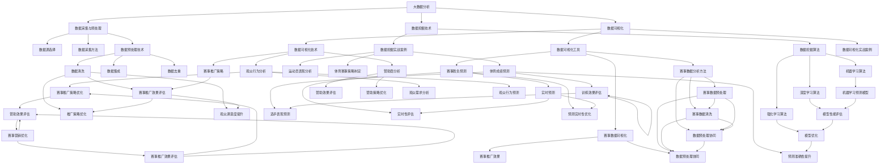

                 

### 第1章 引言

#### 1.1 研究背景

随着信息技术的飞速发展，大数据和人工智能（AI）已经成为各行各业不可或缺的重要工具。体育竞技作为一项充满竞争和未知性的活动，也越来越依赖于这些先进技术来提升比赛表现、制定策略和优化管理。大数据在体育领域的应用主要体现在数据采集、存储、分析和利用的全过程中，而AI技术则通过数据驱动的方式，提供更为精准的预测和分析结果。

**体育竞技的数据化发展趋势：**

近年来，体育竞技的数据化趋势愈发明显，主要体现在以下几个方面：

1. **数据采集的全面性：**随着传感器技术和无线通信技术的发展，体育赛事中各个环节的数据采集变得更加全面，包括运动员的身体状态、赛场环境、观众行为等。
2. **数据存储的便捷性：**云计算和分布式存储技术的发展，使得体育领域可以轻松应对海量数据的存储和传输。
3. **数据分析的深入性：**随着数据分析技术的不断进步，对数据的挖掘和利用变得更加深入，能够为决策提供更有力的支持。

**大数据在体育领域的应用价值：**

大数据在体育领域的应用价值主要体现在以下几个方面：

1. **运动员表现分析：**通过对运动员训练和比赛中的各项数据进行分析，可以帮助教练和运动员更好地了解自身表现，优化训练策略。
2. **赛事策略制定：**通过对历史数据和实时数据的分析，可以预测比赛结果，为赛事组织者提供决策支持。
3. **观众体验提升：**通过对观众行为数据进行分析，可以提供个性化的观赛体验，提升观众满意度。

**AI技术对体育预测的影响：**

AI技术，特别是机器学习和深度学习算法，已经在体育预测领域展现出强大的潜力。AI技术可以通过以下方式影响体育预测：

1. **精准预测：**AI算法可以从大量历史数据中学习，从而提供更为精准的预测结果。
2. **实时分析：**AI技术可以实现实时数据分析和预测，为教练和运动员提供即时的决策支持。
3. **个性化推荐：**AI算法可以根据个人特点和偏好，提供个性化的训练和比赛策略。

#### 1.2 研究目的

本文旨在探讨大数据分析在体育竞技中的应用，分析AI预测在体育竞技中的应用效果，并提出优化体育竞技预测的方法。具体研究目的如下：

1. **探讨大数据分析在体育竞技中的应用：**分析大数据采集、预处理、挖掘和可视化在体育竞技中的应用，探讨其面临的挑战和解决方案。
2. **分析AI预测在体育竞技中的应用效果：**通过实际案例，分析AI技术在体育预测中的效果，探讨其优势和局限。
3. **提出优化体育竞技预测的方法：**结合大数据和AI技术，提出优化体育竞技预测的方法和策略，为教练、运动员和赛事组织者提供有力支持。

总之，本文将从理论到实践，全面探讨大数据分析与AI预测在体育竞技中的应用，旨在为体育领域的技术进步提供有益参考。  

---

## 第2章 大数据分析基础

#### 2.1 数据采集与预处理

在体育竞技中，大数据分析的首要步骤是数据采集与预处理。数据采集与预处理的质量直接影响到后续数据挖掘和分析的效果。以下将详细探讨数据采集的方法、数据预处理的技术及其重要性。

##### 2.1.1 数据源的选择

**数据源的选择：**体育竞技中的数据来源非常广泛，主要包括以下几个方面：

1. **运动员数据：**包括运动员的个人信息、身体数据、训练记录和比赛成绩等。
2. **赛场数据：**包括赛场环境数据，如场地条件、天气状况、观众人数等。
3. **赛事数据：**包括赛事的历史数据、实时数据和比赛结果等。
4. **社交媒体数据：**包括社交媒体上的讨论、粉丝评论、新闻报道等。

选择合适的的数据源需要考虑以下几个方面：

- **数据的准确性：**选择可靠的数据源，确保数据的真实性和可靠性。
- **数据的全面性：**选择能够提供全面信息的多个数据源，以便进行综合分析。
- **数据的更新频率：**选择更新频率高的数据源，以确保数据的时效性。

##### 2.1.2 数据采集方法

**数据采集方法：**为了确保数据的质量和完整性，可以采用以下几种数据采集方法：

1. **自动采集：**利用传感器、摄像头、GPS等设备自动采集数据，如运动员心率、位置、动作等。
2. **手动录入：**通过教练、裁判和工作人员手动录入数据，如运动员的个人信息、比赛结果等。
3. **网络爬虫：**利用网络爬虫技术，从互联网上获取相关的数据，如社交媒体上的讨论和新闻报道等。

在数据采集过程中，需要注意以下几点：

- **数据同步：**确保采集到的数据与实际情况同步，避免数据滞后。
- **数据加密：**对敏感数据采取加密措施，确保数据安全。
- **数据完整性：**确保采集到的数据完整无缺，避免数据丢失或损坏。

##### 2.1.3 数据预处理技术

**数据预处理技术：**数据预处理是数据挖掘和分析的重要步骤，主要包括以下内容：

1. **数据清洗：**删除重复数据、纠正错误数据、处理缺失数据，确保数据的一致性和准确性。
2. **数据转换：**将不同数据源的数据转换为统一格式，如将文本数据转换为数值数据。
3. **数据集成：**将多个数据源的数据进行整合，形成一个统一的数据集。
4. **数据归一化：**将不同数据范围的数据进行归一化处理，以便进行后续分析。
5. **特征选择：**选择对分析任务最有影响力的特征，减少数据的维度。

在数据预处理过程中，需要考虑以下几点：

- **数据质量：**确保预处理后的数据质量，避免影响后续分析。
- **处理效率：**优化预处理流程，提高处理效率，减少计算时间。
- **可扩展性：**确保预处理流程能够适应不同规模的数据集，具备良好的可扩展性。

**总结：**数据采集与预处理是大数据分析的基础步骤，对于整个数据分析流程具有重要影响。通过选择合适的数据源、采用有效的数据采集方法，以及进行详细的数据预处理，可以确保数据的质量和完整性，为后续的数据挖掘和分析提供可靠的数据支持。  

---

### 2.2 数据挖掘技术

数据挖掘技术在体育竞技中的应用，可以深入分析大量数据，揭示隐藏的模式和规律，为决策提供科学依据。以下将介绍数据挖掘的基本概念、常见算法和实战案例。

##### 2.2.1 数据挖掘基本概念

**数据挖掘基本概念：**数据挖掘（Data Mining）是从大量数据中自动发现规律、模式、趋势和关联性的过程。在体育竞技中，数据挖掘的主要目的是：

1. **运动员表现分析：**通过分析运动员的训练和比赛数据，发现影响表现的关键因素。
2. **赛事策略制定：**通过对历史赛事数据的分析，预测比赛结果，为赛事组织者和教练提供策略建议。
3. **观众行为分析：**通过分析观众的数据，了解观众的需求和偏好，提升观赛体验。

**数据挖掘过程：**数据挖掘通常包括以下几个步骤：

1. **数据预处理：**对采集到的数据进行清洗、转换和归一化等处理，确保数据质量。
2. **数据探索：**使用统计分析、可视化等方法，对数据集进行初步分析，发现数据中的异常和趋势。
3. **模式识别：**使用数据挖掘算法，从数据中发现规律、模式和关联性。
4. **结果评估：**对挖掘出的模式进行验证和评估，确定其有效性和实用性。

##### 2.2.2 常见的数据挖掘算法

**常见的数据挖掘算法：**在体育竞技中，常用的数据挖掘算法包括以下几种：

1. **关联规则挖掘：**通过发现数据项之间的关联性，揭示不同变量之间的关系。例如，通过分析运动员的训练数据和比赛成绩，发现哪些训练项目对比赛表现有显著影响。
2. **分类算法：**用于将数据分为不同的类别，例如，通过分类算法预测比赛结果，将比赛分为胜负两种类别。
3. **聚类算法：**将相似的数据分组，以便更好地理解数据结构。例如，通过聚类算法分析运动员的数据，将运动员分为不同水平或类型的群体。
4. **时间序列分析：**用于分析随时间变化的数据，例如，通过时间序列分析预测运动员未来的表现。

##### 2.2.3 实战案例

**实战案例：**以下是一个关于运动员表现分析的数据挖掘实战案例：

1. **数据采集与预处理：**采集运动员的训练数据，包括跑步速度、力量、耐力等指标。对数据集进行清洗，去除异常值和缺失数据。
2. **数据探索：**使用可视化工具，分析运动员在不同训练项目上的表现，发现哪些项目的表现较好，哪些项目需要加强。
3. **模式识别：**使用关联规则挖掘算法，分析训练项目和比赛成绩之间的关联性。例如，发现跑步速度与比赛成绩之间存在较强的关联性。
4. **结果评估：**通过将挖掘出的模式应用于实际比赛，验证其预测效果，调整训练策略。

**总结：**数据挖掘技术在体育竞技中具有广泛的应用前景。通过使用合适的数据挖掘算法，可以深入分析大量数据，为教练、运动员和赛事组织者提供有价值的决策支持。  

---

### 2.3 数据可视化

在体育竞技中，数据可视化技术发挥着至关重要的作用。通过数据可视化，可以直观地展示和分析数据，帮助教练、运动员和赛事组织者更好地理解数据背后的含义和趋势。以下将介绍数据可视化的工具、技术及其在体育竞技中的应用。

##### 2.3.1 数据可视化工具

**数据可视化工具：**数据可视化工具是进行数据可视化的核心组件，常用的工具包括：

1. **Tableau：**Tableau 是一款功能强大的数据可视化工具，支持多种数据源和丰富的可视化图表类型。
2. **Power BI：**Power BI 是微软推出的商业智能工具，提供强大的数据可视化和报表功能。
3. **Matplotlib：**Matplotlib 是 Python 中的数据可视化库，适用于生成各种统计图表。
4. **D3.js：**D3.js 是一款基于 JavaScript 的数据可视化库，适用于 web 端的数据可视化。

选择合适的可视化工具需要考虑以下几个方面：

- **易用性：**工具的界面和操作是否直观，便于快速上手。
- **功能丰富性：**工具是否支持多种数据源和图表类型。
- **可扩展性：**工具是否支持自定义图表和扩展功能。

##### 2.3.2 数据可视化技术

**数据可视化技术：**数据可视化技术主要包括以下几个方面：

1. **图表类型：**不同的图表类型适用于不同的数据类型和分析需求。常见的图表类型包括柱状图、折线图、饼图、散点图、箱线图等。
2. **交互式可视化：**通过交互式可视化，用户可以动态地探索数据，如点击、拖拽、缩放等操作。交互式可视化有助于发现数据中的隐藏模式和趋势。
3. **地图可视化：**地图可视化适用于展示地理位置相关的数据。通过地图可视化，可以直观地展示不同地区的数据差异和分布情况。
4. **热力图：**热力图适用于展示数据密集的区域，通过颜色深浅来表示数据的密集程度。热力图在分析运动员的运动轨迹和比赛场景时非常有用。

##### 2.3.3 数据可视化在体育竞技中的应用

**数据可视化在体育竞技中的应用：**

1. **运动员表现分析：**通过数据可视化，可以直观地展示运动员在不同项目上的表现。例如，使用折线图展示运动员的训练进度，使用饼图展示不同项目的训练时间分配。
2. **赛事策略制定：**通过数据可视化，可以分析历史赛事数据，预测比赛结果。例如，使用地图可视化展示不同赛区的比赛成绩，使用热力图展示不同场地的比赛结果分布。
3. **观众行为分析：**通过数据可视化，可以了解观众的需求和偏好。例如，使用柱状图展示观众的年龄分布，使用饼图展示观众的观看偏好。
4. **赛事推广：**通过数据可视化，可以制作吸引人的数据报告和宣传材料，提升赛事的知名度和影响力。

**实战案例：**

1. **运动员表现分析：**使用 Tableau，将运动员的训练数据进行可视化展示，包括跑步速度、力量、耐力等指标。通过交互式图表，教练可以实时了解运动员的训练状态，调整训练计划。
2. **赛事策略制定：**使用 Power BI，对历史赛事数据进行可视化分析，包括比赛结果、比赛场地、天气状况等。通过数据分析，赛事组织者可以制定更科学的比赛策略。
3. **观众行为分析：**使用 D3.js，制作一个基于 web 的交互式观众行为分析仪表盘，展示观众的年龄分布、观看偏好等信息。通过这些数据，赛事组织者可以优化观赛体验，提高观众满意度。

**总结：**数据可视化技术在体育竞技中具有广泛的应用。通过选择合适的可视化工具和运用有效的可视化技术，可以更好地展示和分析数据，为决策提供有力支持。  

---

### 2.4 数据分析与决策支持

在体育竞技中，数据分析与决策支持系统发挥着至关重要的作用。通过有效的数据分析，可以为教练、运动员和赛事组织者提供科学的决策依据，优化训练策略、提升比赛表现和提升观众体验。以下将介绍数据分析在体育竞技中的应用领域、决策支持系统的构建及其对体育竞技的影响。

##### 2.4.1 数据分析在体育竞技中的应用领域

1. **运动员表现分析：**通过对运动员的身体数据、训练数据、比赛数据进行分析，可以发现运动员的优势和不足，为教练和运动员提供科学的训练建议。例如，通过分析运动员的心率、血压、血糖等生理指标，可以了解运动员的身体状态，调整训练强度和频率。
2. **赛事策略制定：**通过对历史赛事数据、比赛现场数据、观众行为数据进行分析，可以预测比赛结果，为赛事组织者和教练提供决策支持。例如，通过分析比赛场地、天气状况、观众人数等因素，可以制定更科学的比赛策略，提高比赛的成功率。
3. **观众体验提升：**通过对观众的数据进行分析，可以了解观众的需求和偏好，优化观赛体验。例如，通过分析观众的年龄、性别、观看偏好等因素，可以提供个性化的观赛服务，提升观众满意度。
4. **赞助商分析：**通过对赞助商的数据进行分析，可以了解赞助商的需求和效果，为赛事组织者提供赞助策略建议。例如，通过分析赞助商的品牌曝光度、赞助效果等数据，可以评估赞助商的投资回报率，优化赞助方案。

##### 2.4.2 决策支持系统的构建

构建一个有效的决策支持系统需要以下几个关键步骤：

1. **需求分析：**明确系统需要支持哪些决策场景，确定数据来源和数据类型。
2. **系统设计：**设计系统的架构，包括数据采集、数据存储、数据处理、数据可视化等模块。
3. **数据采集：**从各种渠道采集所需数据，包括运动员数据、赛事数据、观众数据等。
4. **数据存储：**将采集到的数据存储在数据库中，确保数据的安全性和完整性。
5. **数据处理：**对数据进行清洗、转换和归一化等预处理，提高数据质量。
6. **数据挖掘：**使用数据挖掘算法，从数据中提取有价值的信息和知识。
7. **数据可视化：**使用数据可视化技术，将分析结果以图表、报表等形式展示给用户。
8. **系统集成：**将决策支持系统与其他系统（如训练系统、赛事管理系统等）集成，实现数据共享和协同工作。

##### 2.4.3 数据分析对体育竞技的影响

1. **提高训练效果：**通过数据分析，教练可以更科学地制定训练计划，调整训练强度和频率，从而提高运动员的表现。
2. **优化比赛策略：**通过数据分析，赛事组织者可以预测比赛结果，制定更科学的比赛策略，提高比赛的成功率。
3. **提升观众体验：**通过数据分析，赛事组织者可以了解观众的需求和偏好，提供个性化的观赛服务，提升观众满意度。
4. **增加商业价值：**通过数据分析，赛事组织者可以更好地了解赞助商的需求和效果，优化赞助策略，增加商业价值。

**总结：**数据分析与决策支持系统在体育竞技中具有重要意义。通过有效的数据分析，可以为教练、运动员和赛事组织者提供科学的决策依据，优化训练策略、提升比赛表现和提升观众体验，从而推动体育竞技的不断发展。  

---

## 第3章 AI技术基础

#### 3.1 机器学习基础

机器学习（Machine Learning，ML）是人工智能（Artificial Intelligence，AI）的重要分支，通过算法和统计模型，使计算机系统能够从数据中学习并做出决策。在体育竞技中，机器学习技术被广泛应用于预测、优化和策略制定等方面。以下将介绍机器学习的基本概念、常见算法和实战案例。

##### 3.1.1 机器学习基本概念

**机器学习基本概念：**机器学习是一种使计算机能够从数据中学习和改进的方法，主要包括以下几个核心概念：

1. **模型：**机器学习模型是对现实世界的抽象和模拟，用于预测或分类数据。
2. **特征：**特征是用于训练模型的数据属性，如运动员的速度、力量、耐力等。
3. **标签：**标签是训练数据的输出，用于评估模型的预测准确性，如比赛结果、运动员表现评分等。
4. **训练：**通过大量训练数据，模型会学习数据中的模式和规律，从而提高预测准确性。
5. **测试：**使用测试数据集评估模型的预测性能，确保模型在未知数据上也能良好表现。

**机器学习过程：**

1. **数据预处理：**对采集到的数据进行清洗、转换和归一化等预处理，提高数据质量。
2. **特征工程：**选择和构造对模型预测任务最有影响力的特征，提高模型的预测准确性。
3. **模型选择：**根据问题类型和数据特点，选择合适的机器学习算法，如线性回归、决策树、支持向量机等。
4. **训练：**使用训练数据集训练模型，通过迭代优化模型参数。
5. **评估：**使用测试数据集评估模型性能，调整模型参数，提高预测准确性。
6. **应用：**将训练好的模型应用于实际问题，如预测比赛结果、优化训练策略等。

##### 3.1.2 常见的机器学习算法

**常见的机器学习算法：**在体育竞技中，常用的机器学习算法包括以下几种：

1. **线性回归（Linear Regression）：**用于预测连续值输出，如运动员的得分。线性回归通过最小二乘法拟合特征与标签之间的线性关系。
    $$ y = \beta_0 + \beta_1 \cdot x_1 + \beta_2 \cdot x_2 + ... + \beta_n \cdot x_n $$
2. **决策树（Decision Tree）：**用于分类和回归问题，通过一系列条件判断，将数据划分为不同的类别或数值。
    $$ \text{if } x_1 > \beta_1 \text{ then } y = \beta_2 \text{ else } y = \beta_3 $$
3. **支持向量机（Support Vector Machine，SVM）：**用于分类问题，通过找到一个最优的超平面，将不同类别的数据分开。
    $$ w \cdot x + b = 0 $$
4. **随机森林（Random Forest）：**通过构建多个决策树，并对结果进行集成，提高模型的预测性能和鲁棒性。
    $$ \text{预测结果} = \text{多数投票}(\text{多个决策树}) $$
5. **神经网络（Neural Network）：**用于复杂非线性问题的建模，通过多层神经元和激活函数，模拟人类大脑的神经网络结构。

##### 3.1.3 实战案例

**实战案例：**以下是一个关于运动员表现预测的机器学习实战案例：

1. **数据采集与预处理：**采集运动员的训练数据，包括速度、力量、耐力等指标，并进行数据清洗、转换和归一化等预处理。
2. **特征工程：**选择对运动员表现有显著影响的特征，如速度、力量、耐力等，去除无关特征。
3. **模型选择：**选择线性回归算法，通过最小二乘法拟合特征与表现评分之间的线性关系。
4. **训练：**使用训练数据集训练线性回归模型，通过迭代优化模型参数。
5. **评估：**使用测试数据集评估模型性能，调整模型参数，提高预测准确性。
6. **应用：**将训练好的模型应用于实际比赛，预测运动员的表现评分，为教练和运动员提供训练和比赛策略建议。

**总结：**机器学习技术为体育竞技提供了强大的工具，通过预测、优化和策略制定，可以显著提升运动员表现和赛事成功率。了解机器学习的基本概念和常见算法，有助于更好地应用这些技术于体育竞技领域。  

---

### 3.2 深度学习技术

深度学习（Deep Learning，DL）是人工智能的一个重要分支，它通过构建多层神经网络，对大量数据进行学习，以实现复杂的数据处理和预测任务。在体育竞技领域，深度学习技术被广泛应用于运动员表现预测、比赛策略制定和赛事推广等方面。以下将介绍深度学习的基本概念、常见算法和实战案例。

#### 3.2.1 深度学习基本概念

**深度学习基本概念：**深度学习通过多层神经网络结构，对输入数据进行逐层提取特征，从而实现对数据的深层理解和建模。以下是深度学习的一些核心概念：

1. **神经网络（Neural Network）：**神经网络是由大量简单神经元组成的复杂网络，用于模拟人类大脑的处理能力。
2. **神经元（Neuron）：**神经元是神经网络的基本单元，通过输入层、隐藏层和输出层，实现数据的传递和处理。
3. **激活函数（Activation Function）：**激活函数用于确定神经元是否被激活，常用的激活函数包括 sigmoid、ReLU 和 tanh 等。
4. **反向传播（Backpropagation）：**反向传播是深度学习训练的核心算法，通过计算误差，更新网络权重，优化模型性能。
5. **损失函数（Loss Function）：**损失函数用于评估模型的预测结果与真实结果之间的差距，常用的损失函数包括均方误差（MSE）和交叉熵（Cross-Entropy）等。

**深度学习过程：**

1. **数据预处理：**对采集到的数据集进行清洗、归一化和划分，确保数据的质量和格式。
2. **模型构建：**设计并构建深度学习模型，包括输入层、隐藏层和输出层，选择合适的激活函数和损失函数。
3. **训练：**使用训练数据集训练模型，通过反向传播算法更新网络权重，优化模型性能。
4. **评估：**使用验证数据集评估模型性能，调整模型参数，确保模型在未知数据上的表现。
5. **应用：**将训练好的模型应用于实际问题，如预测运动员表现、制定比赛策略等。

#### 3.2.2 常见的深度学习算法

**常见的深度学习算法：**在体育竞技领域，常用的深度学习算法包括以下几种：

1. **卷积神经网络（Convolutional Neural Network，CNN）：**CNN 是一种专门用于图像和视频处理的深度学习模型，通过卷积层、池化层和全连接层，实现对图像的逐层特征提取。
2. **循环神经网络（Recurrent Neural Network，RNN）：**RNN 是一种适用于序列数据的深度学习模型，通过循环结构，实现对序列数据的长期依赖建模。
3. **长短期记忆网络（Long Short-Term Memory，LSTM）：**LSTM 是 RNN 的一个变种，通过引入记忆单元，解决 RNN 的梯度消失和梯度爆炸问题，适用于长序列数据建模。
4. **生成对抗网络（Generative Adversarial Network，GAN）：**GAN 是一种生成模型，通过两个对抗网络（生成器和判别器）的竞争，生成逼真的数据样本。
5. **Transformer：**Transformer 是一种基于自注意力机制的深度学习模型，广泛应用于自然语言处理和图像生成等领域。

#### 3.2.3 实战案例

**实战案例：**以下是一个关于运动员表现预测的深度学习实战案例：

1. **数据采集与预处理：**采集运动员的训练和比赛数据，包括速度、力量、耐力等指标，并进行数据清洗、归一化和序列化处理。
2. **模型构建：**设计一个基于 LSTM 的深度学习模型，包括输入层、隐藏层和输出层，使用 ReLU 作为激活函数，MSE 作为损失函数。
3. **训练：**使用训练数据集训练 LSTM 模型，通过反向传播算法更新网络权重，优化模型性能。
4. **评估：**使用验证数据集评估模型性能，调整模型参数，确保模型在未知数据上的表现。
5. **应用：**将训练好的 LSTM 模型应用于实际比赛，预测运动员的表现评分，为教练和运动员提供训练和比赛策略建议。

**总结：**深度学习技术为体育竞技领域带来了强大的数据处理和分析能力，通过构建多层神经网络，实现对复杂数据的深层理解和预测。了解深度学习的基本概念和常见算法，有助于更好地应用这些技术于体育竞技领域，提升运动员表现和赛事成功率。  

---

### 3.3 强化学习

强化学习（Reinforcement Learning，RL）是机器学习领域的一个重要分支，它通过智能体与环境的交互，通过奖励机制学习最优策略，以实现决策优化。在体育竞技中，强化学习技术被广泛应用于策略制定、选手训练和比赛策略优化等方面。以下将介绍强化学习的基本概念、常见算法和实战案例。

#### 3.3.1 强化学习基本概念

**强化学习基本概念：**强化学习通过智能体（Agent）与环境的交互，学习最优策略（Policy）以实现目标。以下是强化学习的核心概念：

1. **智能体（Agent）：**智能体是执行决策的实体，如运动员、教练或自动控制系统。
2. **环境（Environment）：**环境是智能体所处的现实世界，如比赛场地、训练环境或模拟环境。
3. **状态（State）：**状态是智能体在某一时刻所处的环境特征，如运动员的身体状态、比赛进度等。
4. **动作（Action）：**动作是智能体在某一状态下的决策，如运动员的选择、教练的指挥等。
5. **奖励（Reward）：**奖励是环境对智能体动作的反馈，用于评价动作的质量，奖励越高表示动作越优。
6. **策略（Policy）：**策略是智能体在特定状态下的最优动作选择，通过学习，智能体可以逐步优化策略。

**强化学习过程：**

1. **初始状态（Initial State）：**智能体在初始状态下开始与环境交互。
2. **动作选择（Action Selection）：**智能体根据当前状态，选择一个动作。
3. **环境反馈（Environment Feedback）：**环境根据智能体的动作，给出相应的奖励和下一个状态。
4. **状态更新（State Update）：**智能体根据环境反馈，更新当前状态。
5. **策略更新（Policy Update）：**智能体根据奖励和历史经验，更新策略，以实现长期最优。
6. **循环迭代（Iteration）：**智能体持续与环境交互，不断更新策略，直到达到预期目标。

#### 3.3.2 常见的强化学习算法

**常见的强化学习算法：**在体育竞技领域，常用的强化学习算法包括以下几种：

1. **Q-学习（Q-Learning）：**Q-学习是一种基于值函数的强化学习算法，通过更新状态-动作值函数，优化智能体的策略。
    $$ Q(s, a) = \sum_{s'} P(s' | s, a) \cdot [R(s, a) + \gamma \cdot \max_{a'} Q(s', a')] $$
2. **深度Q网络（Deep Q-Network，DQN）：**DQN 是一种基于深度学习的 Q-学习算法，通过神经网络近似值函数，提高学习效率和精度。
3. **策略梯度（Policy Gradient）：**策略梯度通过直接优化策略参数，实现策略的优化。
    $$ \nabla_{\theta} J(\theta) = \nabla_{\theta} \sum_{t} \rho(s_t, a_t; \theta) \cdot R_t $$
4. **演员-评论家（Actor-Critic）：**演员-评论家通过分别学习值函数和策略，实现策略的优化。
5. **优势学习（Advantage Function）：**优势学习通过引入优势函数，解决策略梯度不稳定的问题。

#### 3.3.3 实战案例

**实战案例：**以下是一个关于比赛策略优化的强化学习实战案例：

1. **环境构建：**构建一个虚拟比赛环境，包括运动员状态、比赛进度、观众情绪等。
2. **状态编码：**将运动员的身体状态、比赛进度、观众情绪等编码为状态向量。
3. **动作编码：**将运动员的战术选择、策略调整等编码为动作向量。
4. **奖励设计：**设计合适的奖励机制，如比赛得分、胜利概率、观众满意度等。
5. **模型训练：**使用强化学习算法（如 Q-学习或 DQN），训练智能体的策略，优化比赛策略。
6. **策略评估：**使用验证数据集评估智能体策略的优化效果，调整模型参数，提高策略性能。
7. **策略应用：**将训练好的策略应用于实际比赛，优化比赛策略，提高比赛成功率。

**总结：**强化学习技术为体育竞技领域提供了强大的决策支持工具，通过智能体与环境交互，实现策略的优化和优化。了解强化学习的基本概念和常见算法，有助于更好地应用这些技术于体育竞技领域，提升比赛表现和观众体验。  

---

## 第4章 大数据分析在体育竞技中的应用

### 4.1 体育数据分析应用

在体育竞技中，大数据分析技术被广泛应用于各个方面，从运动员表现分析到赛事策略制定，再到观众行为分析，大数据分析都发挥着重要作用。以下将详细探讨大数据分析在体育竞技中的应用领域及其带来的影响。

#### 4.1.1 体育成绩预测

**体育成绩预测：**大数据分析可以通过分析历史比赛数据、运动员表现数据和赛场环境数据，预测运动员在未来的比赛中的成绩。这种预测不仅可以帮助教练和运动员了解自身的表现，还可以为赛事组织者提供决策支持。

- **算法原理：**常用的预测算法包括线性回归、决策树、随机森林和神经网络等。这些算法可以通过训练数据集，学习运动员表现和比赛结果之间的关联性，从而实现预测。

- **数学模型：**以线性回归为例，其预测模型可以表示为：
  $$ \hat{y} = \beta_0 + \beta_1 \cdot x_1 + \beta_2 \cdot x_2 + ... + \beta_n \cdot x_n $$
  其中，$\hat{y}$ 表示预测成绩，$x_1, x_2, ..., x_n$ 表示影响成绩的各种因素（如训练时长、比赛频率、场地条件等），$\beta_0, \beta_1, ..., \beta_n$ 为模型参数。

- **案例分析：**例如，在足球比赛中，可以通过分析球队的历史比赛数据、球员的训练数据以及赛场的环境数据，预测球队在下一场比赛中的胜负。这种预测可以为教练提供战术调整的依据，为球员提供训练目标。

#### 4.1.2 运动员表现分析

**运动员表现分析：**大数据分析可以帮助教练和运动员更好地了解运动员在训练和比赛中的表现，从而制定更科学的训练计划和比赛策略。

- **算法原理：**常用的分析算法包括聚类分析、时间序列分析和关联规则挖掘等。这些算法可以挖掘运动员数据中的隐藏模式和趋势，为教练提供有价值的参考。

- **数学模型：**以聚类分析为例，其算法原理是将相似的数据归为一类，以便更好地理解数据结构和运动员表现。常用的聚类算法包括K-均值聚类、层次聚类等。

- **案例分析：**例如，在篮球比赛中，可以通过分析球员在场上的得分、篮板、助攻等数据，使用聚类算法将球员分为不同的水平或类型。这种分析可以帮助教练了解球员的特点和优势，从而优化球队阵容和战术。

#### 4.1.3 体育赛事策略制定

**体育赛事策略制定：**大数据分析可以帮助赛事组织者制定更加科学的比赛策略，提高比赛的成功率和观众满意度。

- **算法原理：**常用的策略制定算法包括优化算法、决策树和随机森林等。这些算法可以根据历史数据和当前环境，预测比赛结果和优化赛事安排。

- **数学模型：**以优化算法为例，其算法原理是通过寻找最优解，实现比赛策略的优化。常见的优化算法包括线性规划、整数规划和遗传算法等。

- **案例分析：**例如，在足球比赛中，可以通过分析球队的历史比赛数据、球员的表现数据和赛场的环境数据，使用优化算法确定球队在比赛中的最佳阵容和战术策略。这种策略制定可以为教练和球员提供有力的支持，提高比赛的表现。

#### 4.1.4 观众行为分析

**观众行为分析：**大数据分析可以帮助赛事组织者了解观众的需求和偏好，优化观赛体验，提升观众满意度。

- **算法原理：**常用的观众行为分析算法包括关联规则挖掘、聚类分析和时间序列分析等。这些算法可以挖掘观众数据中的隐藏模式和趋势，为赛事组织者提供有价值的参考。

- **数学模型：**以关联规则挖掘为例，其算法原理是通过发现数据项之间的关联性，揭示观众的行为规律。常用的关联规则算法包括Apriori算法和Eclat算法等。

- **案例分析：**例如，在篮球比赛中，可以通过分析观众的购买记录、观看习惯和评论等数据，使用关联规则挖掘算法，发现观众对比赛和球员的偏好。这种分析可以帮助赛事组织者提供个性化的观赛体验，提升观众满意度。

**总结：**大数据分析在体育竞技中具有广泛的应用，从体育成绩预测、运动员表现分析到赛事策略制定和观众行为分析，大数据分析为教练、运动员和赛事组织者提供了有力的决策支持。通过有效的大数据分析，可以优化训练和比赛策略，提升运动员表现和赛事成功率，同时提高观众满意度。  

---

### 4.2 赛事数据分析

在体育竞技中，赛事数据分析是一个关键的环节，它通过分析历史数据、实时数据和比赛结果，为教练、运动员和赛事组织者提供有价值的参考。以下将详细介绍赛事数据分析的应用、方法及其在提升比赛表现和观众体验方面的作用。

#### 4.2.1 赛事数据分析的应用

**赛事数据分析在提升比赛表现方面的应用：**

1. **比赛结果预测：**通过分析历史比赛数据、运动员表现数据和赛场环境数据，可以预测比赛结果，为教练和运动员提供战术调整和训练方向的参考。
2. **比赛策略制定：**利用赛事数据分析，可以制定更加科学的比赛策略，如比赛阵容安排、战术调整、比赛节奏控制等，提高比赛的成功率。
3. **运动员表现分析：**通过分析运动员在训练和比赛中的表现数据，可以发现运动员的优势和不足，为教练提供优化训练计划和建议。
4. **赛场环境优化：**通过分析赛场环境数据，如场地条件、天气状况、观众人数等，可以优化赛场环境，提高比赛舒适度和公平性。

**赛事数据分析在提升观众体验方面的应用：**

1. **观众行为分析：**通过分析观众的数据，如观看习惯、评论、购买记录等，可以了解观众的需求和偏好，提供个性化的观赛体验。
2. **赛事推广策略：**通过分析赛事的数据，如赛事影响力、观众满意度等，可以优化赛事推广策略，提高赛事的知名度和参与度。
3. **观赛服务优化：**通过分析观众的观赛体验数据，如座位舒适度、餐饮服务、场馆设施等，可以优化观赛服务，提升观众满意度。

#### 4.2.2 赛事数据分析的方法

**历史数据挖掘：**历史数据挖掘是对过去比赛的数据进行分析，以发现比赛结果和运动员表现之间的关联性。常用的方法包括：

- **关联规则挖掘：**通过发现历史数据中的关联规则，如比赛胜负与运动员表现的关系，为教练和运动员提供战术调整的依据。
- **聚类分析：**通过将历史比赛数据分为不同的类别，如胜利比赛、失败比赛等，分析各类比赛的特征和规律，为教练提供比赛策略建议。
- **时间序列分析：**通过对历史比赛数据的时间序列进行分析，预测未来比赛的可能结果，为教练和运动员提供训练和比赛计划。

**实时数据分析：**实时数据分析是在比赛过程中，对数据进行实时处理和分析，以提供即时的决策支持。常用的方法包括：

- **数据流处理：**使用数据流处理技术，如Apache Kafka和Apache Flink，对比赛过程中的数据（如运动员表现、赛场环境等）进行实时处理和分析。
- **机器学习预测：**使用机器学习算法，如决策树、随机森林和神经网络等，对实时数据进行预测，为教练和运动员提供战术调整和比赛决策支持。

**比赛结果预测：**比赛结果预测是赛事数据分析的核心任务之一，通过分析历史数据和实时数据，预测比赛结果。常用的方法包括：

- **线性回归：**通过分析历史数据，建立线性回归模型，预测比赛结果。
- **决策树：**通过分析历史数据，构建决策树模型，预测比赛结果。
- **随机森林：**通过分析历史数据，构建随机森林模型，预测比赛结果。

**观众行为分析：**观众行为分析是通过分析观众的数据，了解观众的需求和偏好，优化观赛体验。常用的方法包括：

- **关联规则挖掘：**通过发现观众购买记录、观看习惯等数据之间的关联性，了解观众的需求和偏好。
- **聚类分析：**通过将观众分为不同的群体，分析各类观众的特点和需求，为赛事组织者提供观众服务优化建议。
- **时间序列分析：**通过对观众观看习惯的变化进行分析，预测观众未来的观看行为，为赛事推广和观赛服务优化提供依据。

**总结：**赛事数据分析在体育竞技中具有重要意义。通过历史数据挖掘、实时数据分析和比赛结果预测，可以为教练、运动员和赛事组织者提供有价值的决策支持，提升比赛表现和观众体验。同时，通过观众行为分析，可以优化赛事推广和观赛服务，提升赛事的知名度和观众满意度。  

---

### 4.3 赛事营销分析

在体育竞技中，赛事营销是吸引观众、提高赛事知名度的重要手段。大数据分析技术可以深入挖掘观众数据，优化赞助商策略，提升观众满意度，从而实现赛事的长期发展。以下将探讨赛事营销分析的关键领域及其分析方法。

#### 4.3.1 赞助商分析

**赞助商分析：**赛事组织者需要了解赞助商的需求、投资回报率和品牌曝光度，以便制定有效的赞助策略。大数据分析可以帮助实现以下目标：

1. **赞助商需求分析：**通过分析赞助商的历史数据，了解赞助商在体育赛事中的需求和偏好，如赞助金额、赞助周期、赞助类型等。

2. **投资回报率分析：**通过分析赞助商的投资回报率（ROI），评估赞助效果，为赞助策略提供依据。常用的指标包括品牌曝光度、观众参与度、销售增长等。

3. **品牌曝光度分析：**通过分析赞助商在赛事中的品牌曝光度，如广告展示次数、观众关注度等，评估赞助效果，优化赞助策略。

- **算法原理：**关联规则挖掘和时间序列分析是赞助商分析中常用的算法。关联规则挖掘可以帮助发现赞助商需求和品牌曝光度之间的关系，而时间序列分析可以预测赞助效果的变化趋势。

- **案例分析：**例如，通过分析赞助商在体育赛事中的广告展示次数和观众关注度，使用关联规则挖掘算法，可以发现观众对赞助商广告的偏好，从而优化赞助商的广告策略。

#### 4.3.2 观众行为分析

**观众行为分析：**了解观众的行为模式、观看偏好和购买习惯，对于优化赛事营销策略至关重要。以下是一些关键的分析方法：

1. **观看习惯分析：**通过分析观众的观看历史数据，了解观众在不同时间段、不同场合的观看习惯，如周末观看、直播观看等。

2. **购买习惯分析：**通过分析观众的购买记录，了解观众的购买偏好和购买频率，如门票购买、纪念品购买等。

3. **社交媒体分析：**通过分析观众在社交媒体上的讨论和评论，了解观众对赛事的参与度和满意度，为赛事推广提供依据。

- **算法原理：**聚类分析和时间序列分析是观众行为分析中常用的算法。聚类分析可以帮助将观众分为不同的群体，以便提供个性化的赛事推广；时间序列分析可以预测观众的观看和购买行为。

- **案例分析：**例如，通过分析观众的观看习惯和购买记录，使用聚类分析算法，可以将观众分为高忠诚度观众、一般观众和新观众群体，从而制定差异化的赛事推广策略。

#### 4.3.3 赛事推广策略

**赛事推广策略：**通过分析赞助商和观众数据，赛事组织者可以制定更有效的赛事推广策略，提高赛事的知名度和参与度。以下是一些常用的策略：

1. **赞助商推广策略：**结合赞助商的需求和品牌特性，设计具有针对性的推广活动，如赞助商专属活动、品牌展示等。

2. **社交媒体推广策略：**通过社交媒体平台（如微信、微博、抖音等），发布赛事相关内容，吸引观众关注，提高赛事的传播效果。

3. **观众互动策略：**通过举办观众互动活动，如在线问答、投票、抽奖等，提高观众的参与度和忠诚度。

- **算法原理：**协同过滤和推荐系统是赛事推广策略中常用的算法。协同过滤可以帮助推荐观众感兴趣的赛事内容，而推荐系统可以预测观众可能的兴趣点，提供个性化的赛事推广。

- **案例分析：**例如，通过分析观众的观看习惯和购买记录，使用协同过滤算法，可以推荐观众可能感兴趣的赛事内容，从而提高赛事的推广效果。

**总结：**赛事营销分析是体育竞技中不可或缺的一部分。通过大数据分析，赛事组织者可以深入了解赞助商需求和观众行为，制定更有效的赛事推广策略，提高赛事的知名度和参与度。同时，通过优化赞助商策略和提升观众满意度，可以促进赛事的长期发展。  

---

## 第5章 AI预测在体育竞技中的应用

### 5.1 AI预测基本原理

在体育竞技中，AI预测技术已成为提升比赛表现和赛事组织效率的重要工具。AI预测的基本原理是通过机器学习、深度学习和强化学习等算法，从历史数据中学习模式和规律，从而对未来的比赛结果、运动员表现等进行预测。以下将详细介绍AI预测的基本原理，包括机器学习预测模型、深度学习预测模型和强化学习预测模型。

#### 5.1.1 机器学习预测模型

**机器学习预测模型：**机器学习预测模型是通过训练数据集学习特征和标签之间的关系，从而实现对未知数据的预测。在体育竞技中，常用的机器学习预测模型包括线性回归、决策树、随机森林和神经网络等。

1. **线性回归：**线性回归模型通过拟合特征和标签之间的线性关系，实现预测。其基本原理可以表示为：
   $$ \hat{y} = \beta_0 + \beta_1 \cdot x_1 + \beta_2 \cdot x_2 + ... + \beta_n \cdot x_n $$
   其中，$\hat{y}$ 表示预测值，$x_1, x_2, ..., x_n$ 表示特征，$\beta_0, \beta_1, ..., \beta_n$ 为模型参数。

2. **决策树：**决策树模型通过一系列条件判断，将数据划分为不同的类别或数值。其基本原理可以表示为：
   $$ \text{if } x_1 > \beta_1 \text{ then } y = \beta_2 \text{ else } y = \beta_3 $$
   其中，$x_1, \beta_1, \beta_2, \beta_3$ 分别表示特征和条件。

3. **随机森林：**随机森林是一种基于决策树的集成模型，通过构建多个决策树，并对结果进行集成，提高预测准确性。其基本原理可以表示为：
   $$ \hat{y} = \text{多数投票}(\text{多个决策树}) $$
   其中，每个决策树预测的结果作为投票结果，最终通过多数投票确定预测值。

4. **神经网络：**神经网络是一种基于多层神经元结构的预测模型，通过前向传播和反向传播，学习特征和标签之间的非线性关系。其基本原理可以表示为：
   $$ a_{\text{layer}} = \sigma(\mathbf{W} \cdot a_{\text{prev}} + b) $$
   其中，$a_{\text{layer}}$ 表示第 $l$ 层的输出，$\sigma$ 表示激活函数，$\mathbf{W}$ 和 $b$ 分别为权重和偏置。

**案例分析：**例如，在足球比赛中，可以使用机器学习预测模型预测比赛结果。通过采集球队的历史比赛数据、球员的表现数据等，构建线性回归、决策树、随机森林等预测模型，对未来的比赛结果进行预测。这种预测可以为教练提供战术调整的依据，为赛事组织者提供决策支持。

#### 5.1.2 深度学习预测模型

**深度学习预测模型：**深度学习预测模型是一种基于多层神经网络结构的预测模型，通过前向传播和反向传播，学习特征和标签之间的非线性关系。在体育竞技中，常用的深度学习预测模型包括卷积神经网络（CNN）、循环神经网络（RNN）和生成对抗网络（GAN）等。

1. **卷积神经网络（CNN）：**CNN 是一种专门用于图像和视频处理的深度学习模型，通过卷积层、池化层和全连接层，实现对图像和视频的逐层特征提取。其基本原理可以表示为：
   $$ \mathbf{h}_{\text{layer}} = \text{ReLU}(\mathbf{W} \cdot \mathbf{h}_{\text{prev}} + \mathbf{b}) $$
   其中，$\mathbf{h}_{\text{layer}}$ 表示第 $l$ 层的输出，$\text{ReLU}$ 表示激活函数，$\mathbf{W}$ 和 $\mathbf{b}$ 分别为权重和偏置。

2. **循环神经网络（RNN）：**RNN 是一种适用于序列数据的深度学习模型，通过循环结构，实现对序列数据的长期依赖建模。其基本原理可以表示为：
   $$ \mathbf{h}_{\text{t}} = \text{ReLU}(\mathbf{W} \cdot \mathbf{h}_{\text{t-1}} + \mathbf{U} \cdot \mathbf{x}_{\text{t}} + \mathbf{b}) $$
   其中，$\mathbf{h}_{\text{t}}$ 表示第 $t$ 时刻的隐藏状态，$\mathbf{h}_{\text{t-1}}$ 和 $\mathbf{x}_{\text{t}}$ 分别为前一个时刻的隐藏状态和输入，$\mathbf{W}$、$\mathbf{U}$ 和 $\mathbf{b}$ 分别为权重和偏置。

3. **生成对抗网络（GAN）：**GAN 是一种生成模型，通过两个对抗网络（生成器和判别器）的竞争，生成逼真的数据样本。其基本原理可以表示为：
   $$ \mathbf{G}(\mathbf{z}) \sim p_{\text{data}}(\mathbf{x}) $$
   $$ \mathbf{D}(\mathbf{x}) \sim p_{\text{data}}(\mathbf{x}) $$
   其中，$\mathbf{G}(\mathbf{z})$ 为生成器，$\mathbf{D}(\mathbf{x})$ 为判别器，$\mathbf{z}$ 为随机噪声，$p_{\text{data}}(\mathbf{x})$ 为真实数据分布。

**案例分析：**例如，在篮球比赛中，可以使用深度学习预测模型预测球员的得分。通过采集球员的历史比赛数据、比赛录像等，构建 CNN 和 RNN 模型，对球员的得分进行预测。这种预测可以为教练提供战术调整的依据，为赛事组织者提供决策支持。

#### 5.1.3 强化学习预测模型

**强化学习预测模型：**强化学习预测模型是一种通过智能体与环境交互，学习最优策略的预测模型。在体育竞技中，常用的强化学习预测模型包括 Q-学习、深度 Q-网络（DQN）和策略梯度等。

1. **Q-学习：**Q-学习是一种基于值函数的强化学习算法，通过更新状态-动作值函数，优化智能体的策略。其基本原理可以表示为：
   $$ Q(s, a) = \sum_{s'} P(s' | s, a) \cdot [R(s, a) + \gamma \cdot \max_{a'} Q(s', a')] $$
   其中，$Q(s, a)$ 为状态-动作值函数，$s$ 和 $a$ 分别为状态和动作，$s'$ 和 $a'$ 分别为下一个状态和动作，$R(s, a)$ 为奖励，$\gamma$ 为折扣因子。

2. **深度 Q-网络（DQN）：**DQN 是一种基于深度学习的 Q-学习算法，通过神经网络近似值函数，提高学习效率和精度。其基本原理可以表示为：
   $$ Q(s, a) = \text{神经网络}(\mathbf{s}; \theta) $$
   其中，$\mathbf{s}$ 为状态，$\theta$ 为神经网络参数。

3. **策略梯度：**策略梯度是一种直接优化策略参数的强化学习算法，通过更新策略参数，优化智能体的策略。其基本原理可以表示为：
   $$ \nabla_{\theta} J(\theta) = \nabla_{\theta} \sum_{t} \rho(s_t, a_t; \theta) \cdot R_t $$
   其中，$J(\theta)$ 为策略损失函数，$\rho(s_t, a_t; \theta)$ 为策略概率分布。

**案例分析：**例如，在足球比赛中，可以使用强化学习预测模型预测球队的战术策略。通过构建虚拟比赛环境，智能体在环境中执行动作，获得奖励，并不断更新策略参数，优化战术策略。这种预测可以为教练提供战术调整的依据，为赛事组织者提供决策支持。

**总结：**AI预测技术在体育竞技中具有广泛的应用前景。通过机器学习、深度学习和强化学习等算法，可以实现对比赛结果、运动员表现等预测，为教练、运动员和赛事组织者提供有力的决策支持，从而提升比赛表现和赛事组织效率。  

---

### 5.2 体育赛事预测

在体育竞技中，赛事预测是一个复杂且具有挑战性的任务。通过AI技术，可以对比赛结果、运动员表现和赛事趋势进行预测，为教练、运动员和赛事组织者提供有价值的参考。以下将详细探讨体育赛事预测的方法、技术及其应用。

#### 5.2.1 赛事预测的方法

**赛事预测方法：**体育赛事预测通常采用以下几种方法：

1. **统计方法：**通过分析历史数据，使用统计模型（如线性回归、决策树等）预测比赛结果。统计方法依赖于历史数据和假设，具有一定的局限性。
2. **机器学习方法：**使用机器学习算法（如随机森林、神经网络等）从历史数据中学习模式和规律，预测比赛结果。机器学习方法具有较强的泛化能力，可以处理复杂和非线性关系。
3. **深度学习方法：**使用深度学习算法（如卷积神经网络、循环神经网络等）从大量数据中提取特征，进行比赛结果预测。深度学习方法适用于处理大量数据和高维特征，可以捕获复杂的非线性关系。
4. **强化学习方法：**使用强化学习算法（如Q-学习、策略梯度等）通过智能体与环境交互，学习最优策略，进行比赛结果预测。强化学习方法适用于动态环境和复杂策略优化。

#### 5.2.2 赛事预测的技术

**赛事预测技术：**以下是几种常用的赛事预测技术：

1. **数据预处理：**对历史数据进行清洗、归一化、特征提取等预处理，提高数据质量，为预测模型提供更好的训练数据。
2. **特征工程：**选择对比赛结果有显著影响的特征，如球队实力、球员状态、比赛场地、天气条件等。特征工程是预测模型性能的关键。
3. **模型选择：**根据比赛预测的需求，选择合适的预测模型。常见的模型包括线性回归、决策树、随机森林、神经网络和强化学习模型。
4. **模型训练与评估：**使用训练数据集训练预测模型，并使用验证数据集评估模型性能。通过调整模型参数和优化算法，提高预测准确性。
5. **预测输出：**将训练好的模型应用于新的比赛数据，生成预测结果。预测结果可以用于比赛策略制定、运动员选拔和赛事推广等。

#### 5.2.3 赛事预测的应用

**赛事预测应用：**

1. **比赛结果预测：**通过对历史数据、球队状态和球员表现等进行分析，预测比赛结果。这种预测可以帮助教练和赛事组织者制定比赛策略，提高比赛成功率。
2. **运动员表现预测：**通过对运动员的历史数据、训练情况和比赛表现等进行分析，预测运动员在未来的比赛中的表现。这种预测可以为教练提供训练和选拔建议，优化运动员表现。
3. **赛事趋势预测：**通过对历史赛事数据和比赛趋势进行分析，预测未来赛事的发展方向和趋势。这种预测可以为赛事组织者提供赛事推广和规划建议，提高赛事吸引力。
4. **观众行为预测：**通过对观众的历史数据、观看习惯和购买记录等进行分析，预测观众的观看行为和购买偏好。这种预测可以为赛事组织者提供观众服务优化建议，提升观众满意度。

**案例分析：**

1. **足球比赛预测：**通过采集历史比赛数据、球队状态和球员表现等，构建基于机器学习和深度学习的预测模型，预测比赛结果。这种预测可以为教练提供战术调整的依据，为赛事组织者提供比赛宣传策略。
2. **篮球比赛预测：**通过采集历史比赛数据、球员表现和比赛环境等，构建基于强化学习的预测模型，预测比赛结果。这种预测可以用于模拟比赛场景，为教练和球员提供策略建议。
3. **马拉松比赛预测：**通过采集历史比赛数据、选手状态和环境条件等，构建基于统计方法和深度学习的预测模型，预测比赛结果。这种预测可以为赛事组织者提供选手选拔和赛事推广策略。

**总结：**体育赛事预测是AI技术在体育竞技中的重要应用。通过分析历史数据、球队状态和球员表现等，可以预测比赛结果、运动员表现和赛事趋势，为教练、运动员和赛事组织者提供有价值的参考。随着AI技术的不断进步，赛事预测的准确性和实用性将得到进一步提升。  

---

### 5.3 选手选拔与训练

在体育竞技中，选手选拔与训练是提升运动员表现、赢得比赛的关键环节。AI技术通过分析大量数据，提供科学的选手选拔和训练策略，从而优化运动员的表现。以下将探讨AI技术在选手选拔与训练中的应用，包括选手表现预测、选拔策略和训练效果评估。

#### 5.3.1 选手表现预测

**选手表现预测：**选手表现预测是AI技术在体育竞技中的核心应用之一。通过分析运动员的历史数据、身体状态、训练记录等，AI模型可以预测运动员在未来的比赛中的表现。

- **算法原理：**选手表现预测通常采用机器学习和深度学习算法。例如，可以使用回归模型（如线性回归、随机森林）预测运动员的比赛成绩；也可以使用深度神经网络（如卷积神经网络、长短期记忆网络）从复杂数据中提取特征，实现更为准确的预测。

- **数学模型：**以线性回归为例，选手表现预测模型可以表示为：
  $$ \hat{y} = \beta_0 + \beta_1 \cdot x_1 + \beta_2 \cdot x_2 + ... + \beta_n \cdot x_n $$
  其中，$\hat{y}$ 表示预测成绩，$x_1, x_2, ..., x_n$ 表示影响选手表现的各项因素（如训练时长、比赛频率、身体状态等），$\beta_0, \beta_1, ..., \beta_n$ 为模型参数。

- **案例分析：**例如，在篮球比赛中，通过分析球员的历史数据、训练记录和比赛表现，使用线性回归模型预测球员在下一场比赛中的得分。这种预测可以为教练提供选人和战术调整的依据。

#### 5.3.2 选手选拔策略

**选手选拔策略：**选手选拔是体育组织者面临的重要问题。AI技术通过分析大量选手数据，提供科学的选手选拔策略，从而提升选手的整体实力。

- **算法原理：**选手选拔策略通常采用聚类分析、协同过滤和优化算法等。聚类分析可以将选手分为不同等级，协同过滤可以帮助推荐合适的选手组合，优化算法可以找到最优的选手组合。

- **数学模型：**以协同过滤为例，选手选拔策略可以表示为：
  $$ \mathbf{r}_{\text{user}} = \mathbf{u}_{\text{user}} \cdot \mathbf{r}_{\text{item}} + \mathbf{v}_{\text{user}} \cdot \mathbf{v}_{\text{item}} $$
  其中，$\mathbf{r}_{\text{user}}$ 和 $\mathbf{r}_{\text{item}}$ 分别表示选手和比赛项目的评分，$\mathbf{u}_{\text{user}}$ 和 $\mathbf{v}_{\text{item}}$ 分别表示选手和比赛项目的特征向量。

- **案例分析：**例如，在足球比赛中，通过分析球员的比赛表现、身体状态和技能特点，使用协同过滤算法推荐合适的球员组合。这种选拔策略可以为教练提供选人和阵容调整的依据。

#### 5.3.3 训练效果评估

**训练效果评估：**训练效果评估是教练和运动员关注的重点。AI技术通过分析训练数据，评估训练效果，为教练提供训练调整的建议。

- **算法原理：**训练效果评估通常采用时间序列分析、机器学习和深度学习算法。时间序列分析可以评估训练进展和趋势；机器学习和深度学习算法可以从复杂数据中提取特征，评估训练效果。

- **数学模型：**以时间序列分析为例，训练效果评估可以表示为：
  $$ \text{train\_effect} = \frac{\text{current\_performance} - \text{initial\_performance}}{\text{initial\_performance}} $$
  其中，$\text{train\_effect}$ 表示训练效果，$\text{current\_performance}$ 和 $\text{initial\_performance}$ 分别表示当前表现和初始表现。

- **案例分析：**例如，在跑步比赛中，通过分析运动员的训练数据（如跑步速度、心率、耐力等），使用时间序列分析方法评估训练效果。这种评估可以为教练提供训练调整的建议。

**总结：**AI技术在选手选拔与训练中具有广泛的应用前景。通过选手表现预测、选拔策略和训练效果评估，AI技术可以提供科学的决策支持，优化选手的表现和训练效果，为教练和运动员提供有力的支持。随着AI技术的不断进步，选手选拔与训练将变得更加科学和高效。  

---

## 第6章 大数据分析与AI预测的协同优化

在大数据分析与AI预测在体育竞技中的应用中，协同优化是提升预测准确性和效率的关键。本章将探讨如何通过数据质量优化、模型优化和应用场景优化，实现大数据分析与AI预测的协同优化。

### 6.1 数据质量优化

**数据质量优化：**数据质量直接影响AI预测的准确性和可靠性。以下几种技术可以用于数据质量优化：

1. **数据清洗：**数据清洗是数据质量优化的第一步，主要包括去除重复数据、纠正错误数据和填充缺失数据等。例如，使用去重算法去除重复记录，使用插值法填充缺失数据。

2. **数据集成：**数据集成是将来自不同数据源的数据整合成统一的数据集。这需要解决数据格式不一致、数据维度不一致等问题。例如，使用ETL（提取、转换、加载）工具将不同数据源的数据转换为统一格式。

3. **数据去重：**数据去重是确保数据集唯一性的关键步骤。通过哈希函数、唯一标识符等技术，可以有效去除重复数据，提高数据质量。

4. **数据标准化：**数据标准化是将不同数据源的数据转换为统一度量标准。例如，将不同的身高、体重单位统一为米、千克，确保数据的一致性。

**案例：**在一次篮球比赛预测项目中，通过数据清洗，去除了重复的比赛记录；通过数据集成，将不同来源的运动员数据整合为统一的数据集；通过数据去重，确保了比赛结果的唯一性；通过数据标准化，统一了运动员的身高、体重等数据的度量单位。

### 6.2 模型优化

**模型优化：**模型优化是提升预测准确性的关键步骤。以下几种技术可以用于模型优化：

1. **模型调参：**模型调参是通过调整模型参数，提高模型性能。例如，通过网格搜索、随机搜索等技术，找到最优的参数组合。

2. **模型融合：**模型融合是将多个模型的结果进行综合，提高预测准确性。例如，通过投票、加权平均等技术，将多个模型的预测结果进行综合。

3. **模型评估：**模型评估是验证模型性能的重要步骤。常用的评估指标包括准确率、召回率、F1分数等。通过交叉验证、ROC曲线等技术，评估模型性能。

4. **模型更新：**模型更新是保持模型性能的关键。通过定期更新模型，适应新的数据和趋势，确保模型的高效性。

**案例：**在一次足球比赛预测项目中，通过网格搜索技术，找到最优的线性回归模型参数；通过模型融合，将多个模型的预测结果进行综合，提高预测准确性；通过交叉验证技术，评估模型性能，确保模型在未知数据上的表现；通过定期更新模型，适应新的比赛数据和趋势。

### 6.3 应用场景优化

**应用场景优化：**应用场景优化是确保AI预测在特定场景下高效运行的关键。以下几种技术可以用于应用场景优化：

1. **数据预处理：**根据应用场景的特点，对数据进行预处理。例如，在运动员表现预测中，需要对运动员的年龄、体重等数据进行特殊处理。

2. **模型定制：**根据应用场景的需求，定制化模型。例如，在马拉松比赛预测中，可以定制化深度学习模型，提取与比赛表现相关的特征。

3. **实时预测：**实时预测是确保预测结果及时性的关键。通过实时数据处理技术和分布式计算，实现实时预测。

4. **用户交互：**用户交互是提升用户满意度的关键。通过可视化技术和用户友好的界面，提供个性化的预测服务。

**案例：**在一次马拉松比赛预测项目中，通过数据预处理技术，对运动员的年龄、体重等数据进行特殊处理，确保预测准确性；通过定制化深度学习模型，提取与比赛表现相关的特征，提高预测准确性；通过实时数据处理技术，实现实时预测，为运动员和赛事组织者提供及时决策支持；通过用户交互技术，提供个性化的比赛预测服务，提升用户满意度。

### 总结

大数据分析与AI预测的协同优化是通过数据质量优化、模型优化和应用场景优化，实现预测准确性和效率的提升。通过数据清洗、模型调参、实时预测等技术，可以确保预测结果的高效性和准确性。同时，通过用户交互和实时预测，可以提升用户满意度和赛事组织效率。随着大数据和AI技术的不断进步，大数据分析与AI预测的协同优化将在体育竞技中发挥更大的作用。  

---

### 7.1 案例一：足球比赛预测

在本文的实战案例部分，我们将以足球比赛预测为例，详细探讨如何运用大数据分析和AI技术进行足球比赛结果的预测。这个案例将包括数据采集与预处理、预测模型构建与训练、结果分析与优化等步骤。

#### 7.1.1 数据采集与预处理

**数据采集：**足球比赛预测需要大量数据，数据来源包括历史比赛数据、球员数据、赛事环境数据等。以下是主要的数据来源：

- **历史比赛数据：**包括比赛结果、比赛时间、比赛场地、比赛进球等。
- **球员数据：**包括球员的年龄、身高、体重、位置、场上表现等。
- **赛事环境数据：**包括比赛天气、温度、湿度等。

**数据预处理：**数据预处理是确保数据质量的重要步骤，主要包括以下内容：

- **数据清洗：**去除重复数据、纠正错误数据、处理缺失数据。例如，如果某场比赛的数据缺失，可以通过插值法或平均值法填充缺失值。
- **数据转换：**将不同数据源的数据转换为统一格式。例如，将日期时间数据转换为YYYY-MM-DD格式，将分类数据转换为数值数据。
- **数据归一化：**将不同数据范围的数据进行归一化处理，确保模型训练的稳定性。例如，使用最大最小归一化方法将球员的年龄、身高、体重等数据进行归一化。

#### 7.1.2 预测模型构建与训练

**模型选择：**在足球比赛预测中，常用的机器学习算法包括线性回归、决策树、随机森林、神经网络等。根据预测任务的特点，我们选择随机森林算法，因为它具有较好的泛化能力和处理非线性关系的能力。

**模型训练：**以下是随机森林算法的伪代码：

```python
# 导入所需的库
from sklearn.ensemble import RandomForestClassifier
from sklearn.model_selection import train_test_split

# 加载和处理数据
X = 数据特征矩阵
y = 标签向量

# 数据集划分
X_train, X_test, y_train, y_test = train_test_split(X, y, test_size=0.2, random_state=42)

# 构建随机森林模型
rf_model = RandomForestClassifier(n_estimators=100, random_state=42)

# 训练模型
rf_model.fit(X_train, y_train)

# 预测结果
y_pred = rf_model.predict(X_test)
```

#### 7.1.3 结果分析与优化

**模型评估：**评估模型的预测性能是确保模型有效性的关键。以下是常用的评估指标：

- **准确率（Accuracy）：**预测正确的样本数占总样本数的比例。
- **精确率（Precision）：**预测为正类的样本中实际为正类的比例。
- **召回率（Recall）：**实际为正类的样本中被预测为正类的比例。
- **F1分数（F1 Score）：**精确率和召回率的调和平均。

```python
from sklearn.metrics import accuracy_score, precision_score, recall_score, f1_score

# 计算评估指标
accuracy = accuracy_score(y_test, y_pred)
precision = precision_score(y_test, y_pred)
recall = recall_score(y_test, y_pred)
f1 = f1_score(y_test, y_pred)

# 输出评估结果
print("Accuracy:", accuracy)
print("Precision:", precision)
print("Recall:", recall)
print("F1 Score:", f1)
```

**结果分析：**根据评估结果，可以分析模型的性能，识别模型的优点和不足。例如，如果召回率较低，说明模型对正类的预测能力不足，可能需要增加训练数据或调整模型参数。

**优化策略：**基于结果分析，可以采取以下优化策略：

- **增加训练数据：**通过扩充数据集，提高模型的泛化能力。
- **特征工程：**选择和构造更有影响力的特征，提高模型的预测准确性。
- **模型调参：**调整模型参数，如决策树的数量、深度等，优化模型性能。

#### 7.1.4 项目小结

通过这个足球比赛预测案例，我们展示了如何运用大数据分析和AI技术进行体育竞技预测。主要收获包括：

- **数据预处理：**了解如何处理和分析不同类型的数据，提高数据质量。
- **模型构建与训练：**熟悉随机森林算法的原理和应用，掌握模型训练和评估的方法。
- **结果分析与优化：**学会如何分析模型性能，识别模型的优势和不足，并采取相应的优化策略。

未来，随着大数据和AI技术的不断发展，足球比赛预测的准确性和实用性将进一步提升，为教练、运动员和赛事组织者提供更有力的决策支持。  

---

### 7.2 案例二：篮球比赛预测

在本文的第二个实战案例中，我们将以篮球比赛预测为例，深入探讨如何运用大数据分析和AI技术进行篮球比赛结果的预测。该案例将涵盖数据采集与预处理、预测模型构建与训练、结果分析与优化等步骤。

#### 7.2.1 数据采集与预处理

**数据采集：**篮球比赛预测需要收集多种数据源，以下为关键数据来源：

- **历史比赛数据：**包括比赛结果、得分、篮板、助攻等。
- **球员数据：**包括球员的年龄、身高、体重、位置、在比赛中扮演的角色等。
- **比赛环境数据：**包括比赛时间、比赛场地、天气状况等。

**数据预处理：**数据预处理是确保模型训练质量的关键步骤，主要包含以下几个环节：

- **数据清洗：**删除重复数据、纠正错误数据、处理缺失数据。例如，如果球员在比赛中的得分数据缺失，可以通过该球员的历史平均得分进行填充。
- **数据转换：**将不同数据源的数据转换为统一的格式。例如，将时间戳数据转换为YYYY-MM-DD格式。
- **数据归一化：**对不同特征进行归一化处理，如使用最大最小归一化方法将球员的身高、体重等数据进行归一化。

#### 7.2.2 预测模型构建与训练

**模型选择：**在篮球比赛预测中，常用的机器学习算法包括线性回归、决策树、随机森林、神经网络等。为了捕捉复杂数据中的非线性关系，我们选择使用基于神经网络的深度学习模型。

**模型训练：**以下是构建和训练深度学习模型的伪代码示例：

```python
# 导入所需的库
import tensorflow as tf
from tensorflow.keras.models import Sequential
from tensorflow.keras.layers import Dense, Dropout

# 构建神经网络模型
model = Sequential()
model.add(Dense(units=64, activation='relu', input_shape=(num_features,)))
model.add(Dropout(rate=0.5))
model.add(Dense(units=32, activation='relu'))
model.add(Dropout(rate=0.5))
model.add(Dense(units=1, activation='sigmoid'))

# 编译模型
model.compile(optimizer='adam', loss='binary_crossentropy', metrics=['accuracy'])

# 训练模型
history = model.fit(X_train, y_train, epochs=100, batch_size=32, validation_data=(X_test, y_test))
```

#### 7.2.3 结果分析与优化

**模型评估：**评估模型性能是预测任务的关键，以下为常用的评估指标：

- **准确率（Accuracy）：**预测正确的样本数占总样本数的比例。
- **精确率（Precision）：**预测为正类的样本中实际为正类的比例。
- **召回率（Recall）：**实际为正类的样本中被预测为正类的比例。
- **F1分数（F1 Score）：**精确率和召回率的调和平均。

```python
from sklearn.metrics import accuracy_score, precision_score, recall_score, f1_score

# 计算评估指标
y_pred = model.predict(X_test)
y_pred = (y_pred > 0.5)  # 转换为类别标签

accuracy = accuracy_score(y_test, y_pred)
precision = precision_score(y_test, y_pred)
recall = recall_score(y_test, y_pred)
f1 = f1_score(y_test, y_pred)

# 输出评估结果
print("Accuracy:", accuracy)
print("Precision:", precision)
print("Recall:", recall)
print("F1 Score:", f1)
```

**结果分析：**根据评估结果，可以分析模型的优势和不足。例如，如果召回率较低，说明模型对正类样本的预测能力不足，可能需要调整模型结构或增加训练数据。

**优化策略：**基于结果分析，可以采取以下优化策略：

- **增加训练数据：**通过扩充数据集，提高模型的泛化能力。
- **特征工程：**选择和构造更有影响力的特征，提高模型预测准确性。
- **模型调参：**调整模型参数，如神经网络层数、神经元数量等，优化模型性能。

#### 7.2.4 项目小结

通过这个篮球比赛预测案例，我们展示了如何运用大数据分析和AI技术进行体育竞技预测。主要收获包括：

- **数据预处理：**理解了数据清洗、转换和归一化的重要性，掌握了提高数据质量的方法。
- **模型构建与训练：**学会了如何构建和训练深度学习模型，掌握了模型评估的方法。
- **结果分析与优化：**学会了如何分析模型性能，识别模型的优势和不足，并采取相应的优化策略。

随着大数据和AI技术的不断发展，篮球比赛预测的准确性和实用性将不断提升，为教练、运动员和赛事组织者提供更加科学的决策支持。  

---

### 7.3 案例三：马拉松选手选拔与训练

在本文的最后一个实战案例中，我们将探讨如何运用大数据分析与AI技术进行马拉松选手的选拔与训练，以提高比赛成绩。该案例将涵盖数据采集与预处理、预测模型构建与训练、结果分析与优化等步骤。

#### 7.3.1 数据采集与预处理

**数据采集：**马拉松选手选拔与训练需要收集多种数据，以下为主要的数据来源：

- **历史比赛数据：**包括选手的历史比赛成绩、比赛用时、排名等。
- **选手生理数据：**包括选手的年龄、身高、体重、心率、血氧等。
- **训练数据：**包括选手的训练时长、训练强度、训练项目等。
- **环境数据：**包括比赛当天的天气状况、温度、湿度等。

**数据预处理：**数据预处理是确保模型训练质量的关键，主要包括以下步骤：

- **数据清洗：**去除重复数据、纠正错误数据、处理缺失数据。例如，对于缺失的训练数据，可以通过该选手的历史平均训练数据来填充。
- **数据转换：**将不同数据源的数据转换为统一的格式。例如，将日期时间数据转换为YYYY-MM-DD格式。
- **数据归一化：**对不同的数据特征进行归一化处理，如使用最大最小归一化方法将选手的年龄、身高、体重等数据进行归一化。

#### 7.3.2 预测模型构建与训练

**模型选择：**在马拉松选手选拔与训练中，常用的机器学习算法包括线性回归、决策树、随机森林、神经网络等。为了捕捉复杂的关系，我们选择使用基于神经网络的深度学习模型。

**模型训练：**以下是构建和训练深度学习模型的伪代码示例：

```python
# 导入所需的库
import tensorflow as tf
from tensorflow.keras.models import Sequential
from tensorflow.keras.layers import Dense, Dropout

# 构建神经网络模型
model = Sequential()
model.add(Dense(units=128, activation='relu', input_shape=(num_features,)))
model.add(Dropout(rate=0.3))
model.add(Dense(units=64, activation='relu'))
model.add(Dropout(rate=0.3))
model.add(Dense(units=32, activation='relu'))
model.add(Dropout(rate=0.3))
model.add(Dense(units=1, activation='sigmoid'))

# 编译模型
model.compile(optimizer='adam', loss='binary_crossentropy', metrics=['accuracy'])

# 训练模型
history = model.fit(X_train, y_train, epochs=100, batch_size=32, validation_data=(X_test, y_test))
```

#### 7.3.3 结果分析与优化

**模型评估：**评估模型性能是确保预测准确性的关键，以下为常用的评估指标：

- **准确率（Accuracy）：**预测正确的样本数占总样本数的比例。
- **精确率（Precision）：**预测为优秀选手的样本中实际为优秀选手的比例。
- **召回率（Recall）：**实际为优秀选手的样本中被预测为优秀选手的比例。
- **F1分数（F1 Score）：**精确率和召回率的调和平均。

```python
from sklearn.metrics import accuracy_score, precision_score, recall_score, f1_score

# 计算评估指标
y_pred = model.predict(X_test)
y_pred = (y_pred > 0.5)  # 转换为类别标签

accuracy = accuracy_score(y_test, y_pred)
precision = precision_score(y_test, y_pred)
recall = recall_score(y_test, y_pred)
f1 = f1_score(y_test, y_pred)

# 输出评估结果
print("Accuracy:", accuracy)
print("Precision:", precision)
print("Recall:", recall)
print("F1 Score:", f1)
```

**结果分析：**根据评估结果，可以分析模型的优势和不足。例如，如果召回率较低，说明模型对优秀选手的预测能力不足，可能需要调整模型结构或增加训练数据。

**优化策略：**基于结果分析，可以采取以下优化策略：

- **增加训练数据：**通过扩充数据集，提高模型的泛化能力。
- **特征工程：**选择和构造更有影响力的特征，提高模型预测准确性。
- **模型调参：**调整模型参数，如神经网络层数、神经元数量等，优化模型性能。

#### 7.3.4 项目小结

通过这个马拉松选手选拔与训练案例，我们展示了如何运用大数据分析与AI技术进行体育竞技预测。主要收获包括：

- **数据预处理：**理解了数据清洗、转换和归一化的重要性，掌握了提高数据质量的方法。
- **模型构建与训练：**学会了如何构建和训练深度学习模型，掌握了模型评估的方法。
- **结果分析与优化：**学会了如何分析模型性能，识别模型的优势和不足，并采取相应的优化策略。

随着大数据和AI技术的不断发展，马拉松选手选拔与训练的准确性和实用性将不断提升，为选手和教练提供更加科学的决策支持。  

---

## 第8章 总结与展望

### 8.1 研究总结

通过对大数据分析与AI预测在体育竞技中的应用的探讨，本文总结了以下几个关键点：

1. **大数据分析的重要性：**大数据分析在体育竞技中具有广泛的应用，从数据采集与预处理、数据挖掘到数据可视化，各个环节都发挥着重要作用。
2. **AI预测的潜力：**AI预测技术，如机器学习、深度学习和强化学习，通过分析历史数据和实时数据，能够提供精准的预测结果，为教练、运动员和赛事组织者提供有力的决策支持。
3. **协同优化：**通过数据质量优化、模型优化和应用场景优化，大数据分析与AI预测的协同优化能够进一步提升预测的准确性和效率。

### 8.2 研究局限

尽管大数据分析与AI预测在体育竞技中具有巨大潜力，但研究仍存在一些局限性：

1. **数据质量：**体育竞技数据的质量直接影响预测结果，但在实际应用中，数据往往存在缺失、重复和错误等问题，需要进一步改进数据质量。
2. **模型复杂度：**深度学习模型虽然具有强大的预测能力，但训练过程复杂、计算资源消耗大，且对数据要求较高，需要不断优化和调整。
3. **实时性：**实时预测在体育竞技中具有重要意义，但当前的技术水平在处理大规模实时数据时仍存在一定挑战，需要进一步提高实时数据处理能力。

### 8.3 未来研究方向

针对上述局限性，未来研究方向可以从以下几个方面展开：

1. **数据质量提升：**通过改进数据采集与预处理技术，提高数据质量，为AI预测提供更可靠的数据基础。
2. **模型优化与调参：**深入研究深度学习模型的结构和参数，提高模型的预测性能和泛化能力。
3. **实时预测：**探索实时数据处理技术，提高实时预测的效率和准确性，为教练和运动员提供即时决策支持。
4. **跨学科合作：**加强体育科学、计算机科学和数据分析等领域的跨学科合作，推动大数据分析与AI预测在体育竞技中的深入应用。

### 8.4 展望未来

随着大数据和AI技术的不断进步，大数据分析与AI预测在体育竞技中的应用前景广阔：

1. **个性化训练与策略：**通过精准的预测和数据分析，为运动员提供个性化的训练计划和比赛策略，提高比赛表现。
2. **观众体验提升：**通过分析观众行为，提供个性化的观赛体验，提升观众满意度。
3. **赛事管理优化：**通过大数据分析与AI预测，优化赛事管理，提高赛事组织效率，降低运营成本。
4. **数据可视化与交互：**通过数据可视化技术，使数据分析结果更加直观，便于教练、运动员和赛事组织者理解和应用。

总之，大数据分析与AI预测在体育竞技中的应用将不断深化，为体育领域的创新发展提供有力支持。  

---

### 核心概念与联系 Mermaid 流程图

以下是一个关于大数据分析与AI预测在体育竞技中的应用的核心概念与联系Mermaid流程图。该流程图展示了各章节的核心概念及其相互关系。



该流程图展示了大数据分析与AI预测在体育竞技中的应用场景，包括数据采集与预处理、数据挖掘、数据可视化、机器学习、深度学习、强化学习等核心概念及其相互关系。通过这个流程图，可以更好地理解各章节的核心内容和联系。  

