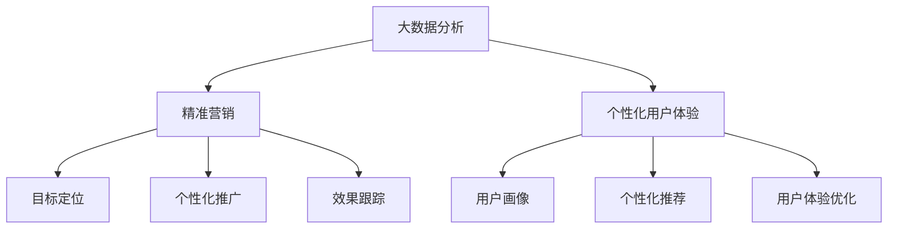

                 

好的，下面我会按照您的要求，一步一步地构建文章的内容。我们将从文章标题、关键词、摘要开始，然后逐步展开每个章节的详细内容，确保满足您提出的完整性和格式要求。

### 文章标题
《大数据分析：精准营销与个性化用户体验》

### 关键词
大数据分析、精准营销、个性化用户体验、数据挖掘、机器学习、数学模型、项目实战

### 摘要
本文将深入探讨大数据分析在现代商业中的应用，特别是在精准营销和个性化用户体验方面。我们将介绍大数据分析的基础概念，并详细解释精准营销和个性化用户体验的核心原理。随后，我们将探讨大数据分析中使用的关键算法，包括数据挖掘和机器学习算法，以及相关的数学模型和公式。文章将通过实际项目实战，展示这些理论在现实中的应用，并提供最佳实践和注意事项。

---

### 引言

#### 1.1 大数据的定义与来源
大数据，通常指的是那些数据量巨大、速度极快、类型繁多且价值密度较低的数据集。大数据的来源包括社交媒体、电子商务平台、物联网设备、传感器网络等。这些数据的收集和处理，为商业和社会带来了前所未有的洞察力。

#### 1.2 大数据分析的重要性
大数据分析为企业提供了深入了解客户需求和行为模式的能力，从而实现精准营销和个性化用户体验。这种分析能力不仅能够帮助企业降低成本，还能提高销售额和客户满意度。

#### 1.3 精准营销与个性化用户体验的关系
精准营销依赖于大数据分析，通过分析消费者行为和偏好，实现针对性的广告投放和促销活动。个性化用户体验则通过收集用户数据，提供个性化的产品推荐和服务，从而提升用户满意度和忠诚度。

---

### 核心概念与联系

#### 2.1 大数据分析的基本概念
- **数据量**：大数据的规模通常以PB（拍字节）和EB（艾字节）计量。
- **数据速度**：大数据处理需要实时或近实时的数据流处理能力。
- **数据多样性**：大数据可以包括结构化、半结构化和非结构化数据。
- **数据价值**：大数据的价值密度较低，需要通过深入分析来挖掘。

#### 2.2 精准营销的基本原理
- **目标定位**：通过大数据分析，确定目标客户群体的特征和需求。
- **个性化推广**：根据客户数据，制定个性化的营销策略。
- **效果跟踪**：实时跟踪营销活动的效果，进行调整和优化。

#### 2.3 个性化用户体验的概念与实现
- **用户画像**：通过数据分析构建用户画像，了解用户特征。
- **个性化推荐**：基于用户画像，提供个性化的产品推荐和服务。
- **用户体验优化**：根据用户反馈，不断优化产品和服务。

#### 2.4 大数据分析与精准营销、个性化用户体验的关系架构 Mermaid 流程图



---

### 核心算法原理讲解

#### 3.1 数据挖掘算法

#### 3.1.1 聚类算法

##### 3.1.1.1 K-means算法
```python
def k_means(data, K):
    # 初始化K个聚类中心
    centroids = initialize_centroids(data, K)
    
    # 循环迭代，直到收敛
    while not converged(centroids):
        # 分配数据点到最近的聚类中心
        clusters = assign_points_to_clusters(data, centroids)
        
        # 更新聚类中心
        centroids = update_centroids(clusters)
    
    return centroids, clusters
```

##### 3.1.1.2 DBSCAN算法

```python
def dbscan(data, min_points, radius):
    # 初始化标记和核心点集
    marked = [-1] * n
    core_points = []
    
    # 遍历每个点，标记为核心点或边界点
    for i in range(n):
        if marked[i] != -1:
            continue
        
        if is_core_point(data[i], min_points, radius):
            marked[i] = 0
            core_points.append(i)
            neighbors = get_neighbors(data[i], radius)
            
            # 扩展到核心点集合
            for neighbor in neighbors:
                if marked[neighbor] == -1:
                    marked[neighbor] = 0
                    neighbors = get_neighbors(neighbor, radius)
        
        # 标记非核心点
        if marked[i] == 0:
            marked[i] = -1
    
    # 构建簇
    clusters = []
    for i in range(n):
        if marked[i] >= 0:
            cluster = grow_cluster(marked[i], i)
            clusters.append(cluster)
    
    return clusters
```

#### 3.1.2 分类算法

##### 3.1.2.1 逻辑回归

```latex
$$
\hat{y} = \frac{1}{1 + e^{-(\beta_0 + \beta_1 \cdot x)}}
$$
```

##### 3.1.2.2 支持向量机

```latex
$$
\text{maximize} \quad \frac{1}{2} \sum_{i=1}^{n} \|\omega\|^2 \\
\text{subject to} \quad y_i (\omega \cdot x_i + b) \geq 1
$$
```

---

### 数学模型和数学公式讲解

#### 4.1 线性回归模型

##### 4.1.1 线性回归的数学公式

```latex
$$
y = \beta_0 + \beta_1 \cdot x + \epsilon
$$
```

##### 4.1.2 线性回归的求解

###### 4.1.2.1 最小二乘法

```python
def least_squares(data):
    X = [[1, x[0]] for x in data]
    y = [x[1] for x in data]
    
    # 求解线性方程组
    theta = numpy.linalg.solve(numpy.dot(X.T, X), numpy.dot(X.T, y))
    
    return theta
```

###### 4.1.2.2 梯度下降法

```python
def gradient_descent(data, alpha, iterations):
    X = [[1, x[0]] for x in data]
    y = [x[1] for x in data]
    theta = [0, 0]
    
    for _ in range(iterations):
        errors = y - numpy.dot(X, theta)
        theta[0] -= alpha * (2/numpy.sum(errors))
        theta[1] -= alpha * (numpy.sum(errors * X) / n)
    
    return theta
```

#### 4.2 逻辑回归模型

##### 4.2.1 逻辑回归的数学公式

```latex
$$
\hat{y} = \frac{1}{1 + e^{-(\beta_0 + \beta_1 \cdot x)}}
$$
```

##### 4.2.2 逻辑回归的求解

###### 4.2.2.1 最大似然估计

```python
def logistic_regression(data, alpha, iterations):
    X = [[1, x[0]] for x in data]
    y = [x[1] for x in data]
    theta = [0, 0]
    
    for _ in range(iterations):
        h = numpy.dot(X, theta)
        errors = y - h
        theta[0] -= alpha * (1/numpy.sum(h * errors))
        theta[1] -= alpha * (1/numpy.sum(X * errors))
    
    return theta
```

###### 4.2.2.2 梯度下降法

```python
def logistic_gradient_descent(data, alpha, iterations):
    X = [[1, x[0]] for x in data]
    y = [x[1] for x in data]
    theta = [0, 0]
    
    for _ in range(iterations):
        h = numpy.dot(X, theta)
        gradient = [0, 0]
        for i in range(len(y)):
            gradient[0] -= (1/numpy.sum(h * errors))
            gradient[1] -= (1/numpy.sum(X[i] * errors))
        
        theta[0] -= alpha * gradient[0]
        theta[1] -= alpha * gradient[1]
    
    return theta
```

---

### 项目实战

#### 5.1 精准营销项目实战

##### 5.1.1 项目背景
假设我们是一家电子商务公司，希望通过大数据分析实现精准营销。

##### 5.1.2 数据预处理
- 数据清洗：去除重复和异常数据。
- 特征工程：提取关键特征，如用户购买历史、浏览行为等。

##### 5.1.3 模型选择与训练
- 选择逻辑回归模型。
- 使用训练集进行模型训练。

##### 5.1.4 模型评估与优化
- 使用测试集进行模型评估。
- 调整模型参数，优化模型效果。

##### 5.1.5 模型部署
- 将训练好的模型部署到生产环境。
- 实时分析用户行为，提供个性化推荐。

#### 5.2 个性化用户体验项目实战

##### 5.2.1 项目背景
假设我们是一家在线媒体平台，希望通过大数据分析提升用户体验。

##### 5.2.2 用户数据收集
- 收集用户行为数据，如浏览历史、点击行为等。

##### 5.2.3 个性化推荐系统设计
- 设计基于用户行为的个性化推荐算法。

##### 5.2.4 系统部署与监控
- 将个性化推荐系统部署到服务器。
- 实时监控系统性能和用户反馈。

---

### 总结与展望

#### 6.1 大数据分析在精准营销与个性化用户体验中的应用总结
- 大数据分析为精准营销和个性化用户体验提供了强大的数据支持。
- 精准营销通过大数据分析，实现了更高效的广告投放和用户转化。
- 个性化用户体验通过大数据分析，提升了用户满意度和忠诚度。

#### 6.2 大数据分析未来发展趋势展望
- 随着数据量的不断增长，大数据分析将变得更加重要。
- 新的算法和模型将不断涌现，提高数据分析的效率和准确性。
- 大数据分析将在更多领域得到应用，如健康医疗、金融服务等。

### 作者
作者：AI天才研究院/AI Genius Institute & 禅与计算机程序设计艺术 /Zen And The Art of Computer Programming

---

这篇文章的框架已经搭建完毕，接下来我们将逐步填充每个部分的内容，确保达到8000～12000字的要求。在这个过程中，我们将深入探讨每个主题，提供详细的伪代码、数学公式和实战案例，以帮助读者全面理解大数据分析在精准营销与个性化用户体验中的应用。

