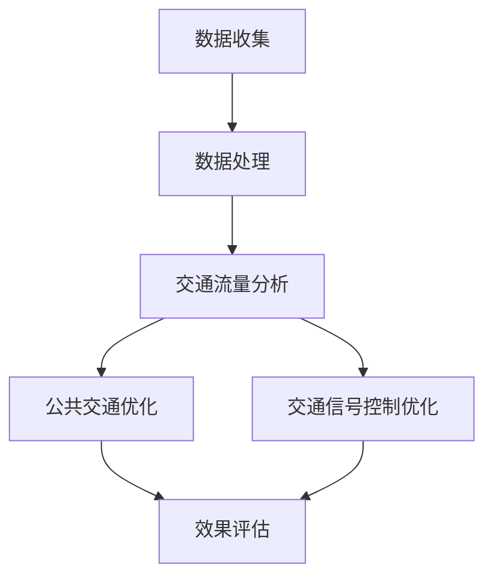

                 


### 文章标题

# 大数据在交通规划中的应用：优化城市交通网络

### 关键词

- 大数据
- 交通规划
- 交通网络优化
- 城市交通流量分析
- 智能交通系统

### 摘要

本文详细探讨了大数据在交通规划中的应用，旨在通过大数据技术优化城市交通网络，提高交通效率和安全性。文章首先介绍了大数据和交通规划的基本概念，然后分析了大数据在交通规划中的核心作用，包括交通流量分析、公共交通优化、交通信号控制优化和智能停车场管理。接着，文章深入讲解了城市交通网络优化理论及其应用，通过具体案例展示了大数据在交通规划中的实践效果。最后，文章对大数据技术在交通规划中的未来发展趋势进行了展望，并提出了一些最佳实践建议。

## 目录

1. **大数据技术基础**
    1.1 大数据技术概述
    1.2 大数据技术栈
    1.3 数据处理方法
    1.4 大数据在交通规划中的应用

2. **交通规划背景**
    2.1 交通规划现状与问题
    2.2 大数据在交通规划中的作用
    2.3 交通规划的需求分析

3. **大数据应用案例**
    3.1 城市交通流量分析
    3.2 公共交通优化
    3.3 交通信号控制优化
    .4 智能停车场管理

4. **城市交通网络优化**
    4.1 城市交通网络优化理论
    4.2 大数据技术支持
    4.3 交通网络优化案例分析
    4.4 交通网络优化策略与建议

5. **案例分析**
    5.1 XX城市交通规划案例研究
    5.2 XX地区公共交通优化案例研究
    5.3 XX城市智能停车场管理案例研究

6. **未来展望**
    6.1 大数据技术在交通规划中的发展趋势
    6.2 交通规划与大数据的融合创新
    6.3 大数据技术在交通规划中的挑战与机遇

### 大数据技术基础

#### 1.1 大数据技术概述

大数据（Big Data）是指数据量巨大、类型繁多、价值密度低且增长迅速的数据集合。大数据技术旨在通过高效的数据存储、处理和分析，从海量数据中挖掘出有价值的信息和知识。

大数据技术栈包括以下几个方面：

- **数据采集（Data Collection）**：通过传感器、互联网、社交网络等渠道收集数据。
- **数据存储（Data Storage）**：利用分布式存储技术（如Hadoop、Spark等）存储海量数据。
- **数据处理（Data Processing）**：对数据进行清洗、转换和聚合，以便进行分析。
- **数据分析（Data Analysis）**：使用统计学、机器学习和数据挖掘等方法分析数据，提取有价值的信息。
- **数据可视化（Data Visualization）**：通过图表、地图等形式展示数据分析结果，便于决策者理解。

#### 1.2 大数据技术栈

大数据技术栈主要包括以下工具和框架：

- **Hadoop**：一个分布式数据存储和处理框架，用于处理大规模数据集。
- **Spark**：一个快速、通用的大规模数据处理引擎，支持内存计算和实时流处理。
- **MongoDB**：一个灵活、可扩展的文档数据库，适合存储非结构化和半结构化数据。
- **Elasticsearch**：一个分布式、可扩展的搜索引擎，用于快速检索和分析海量数据。
- **Tableau**：一个数据可视化工具，用于创建交互式的图表和报表。

#### 1.3 数据处理方法

大数据处理方法主要包括以下几种：

- **批处理（Batch Processing）**：对大量数据进行批量处理，常用于离线分析。
- **流处理（Stream Processing）**：对实时数据流进行实时处理，常用于在线分析。
- **实时计算（Real-Time Computation）**：对数据进行实时计算，提供实时决策支持。
- **图计算（Graph Computing）**：基于图论理论进行数据处理和分析，常用于复杂网络分析。

#### 1.4 大数据在交通规划中的应用

大数据在交通规划中的应用主要包括以下几个方面：

- **交通流量预测**：通过分析历史交通数据，预测未来的交通流量，为交通管理和规划提供依据。
- **公共交通优化**：通过分析乘客需求和交通流量，优化公交线路和时刻表，提高公共交通效率。
- **交通信号控制优化**：通过分析交通流量和道路状况，实时调整交通信号灯，提高交通流畅性。
- **智能停车场管理**：通过分析停车场数据，优化停车管理，提高停车效率。

### 交通规划背景

#### 2.1 交通规划现状与问题

交通规划是城市规划的重要组成部分，旨在优化城市交通系统，提高交通效率、降低拥堵、减少污染、保障安全。然而，当前交通规划面临以下问题：

- **交通拥堵**：随着城市人口和车辆数量的快速增长，交通拥堵问题日益严重。
- **交通污染**：交通污染是城市环境问题的重要来源，严重影响居民健康。
- **交通安全性**：交通事故频繁发生，对人民生命财产安全构成威胁。
- **公共交通效率**：公共交通系统服务水平不高，吸引力不足，乘客流失严重。

#### 2.2 大数据在交通规划中的作用

大数据技术在交通规划中具有重要作用，主要体现在以下几个方面：

- **数据收集与整合**：通过传感器、互联网、社交媒体等渠道收集海量交通数据，实现数据的实时更新和整合。
- **交通流量预测**：利用大数据技术分析历史交通数据，预测未来的交通流量，为交通管理和规划提供依据。
- **公共交通优化**：通过分析乘客需求和交通流量，优化公交线路和时刻表，提高公共交通效率。
- **交通信号控制优化**：通过分析交通流量和道路状况，实时调整交通信号灯，提高交通流畅性。
- **智能停车场管理**：通过分析停车场数据，优化停车管理，提高停车效率。

#### 2.3 交通规划的需求分析

交通规划的需求分析主要包括以下几个方面：

- **数据需求**：交通规划需要收集和整合大量的交通数据，包括交通流量、交通事故、公共交通运行数据等。
- **技术需求**：交通规划需要运用大数据技术、人工智能技术、物联网技术等，实现数据的收集、存储、处理和分析。
- **管理需求**：交通规划需要建立健全的管理体系，包括数据采集与共享、交通需求分析、交通政策制定等。

### 大数据应用案例

#### 3.1 城市交通流量分析

城市交通流量分析是大数据在交通规划中的典型应用之一。通过收集和分析交通流量数据，可以实时掌握交通状况，为交通管理和规划提供依据。

**核心算法原理**：

- **时间序列分析**：利用时间序列分析方法，分析交通流量随时间的变化规律，预测未来的交通流量。
- **空间分析**：利用空间分析方法，分析不同区域之间的交通流量关系，识别交通瓶颈和拥堵点。

**数学模型**：

- **流量预测模型**：$$ \text{流量预测} = f(\text{历史流量}, \text{时间因素}, \text{节假日因素}) $$
- **拥堵识别模型**：$$ \text{拥堵识别} = \text{交通流量} \times \text{交通密度} \times \text{道路状况} $$

**案例**：

某城市通过安装交通传感器，收集路网的交通流量数据。利用大数据技术，对该城市交通流量进行实时分析，发现某路段在早晚高峰期间出现严重拥堵。通过优化交通信号灯配时方案，成功缓解了该路段的交通拥堵问题。

#### 3.2 公共交通优化

公共交通优化是提高城市交通效率的重要手段。通过大数据分析乘客需求和交通流量，可以优化公交线路和时刻表，提高公共交通服务水平。

**核心算法原理**：

- **乘客需求预测**：利用大数据技术，分析历史乘客数据，预测未来的乘客需求。
- **线路优化**：通过分析交通流量、乘客需求、道路状况等因素，优化公交线路和时刻表。

**数学模型**：

- **乘客需求预测模型**：$$ \text{乘客需求预测} = f(\text{历史乘客数据}, \text{时间因素}, \text{天气因素}) $$
- **线路优化模型**：$$ \text{线路优化} = \text{乘客需求} \times \text{交通流量} \times \text{道路状况} $$

**案例**：

某城市通过大数据分析，发现某条公交线路的乘客需求较低，同时与另一条公交线路存在互补性。通过调整两条线路的运营时间和班次，实现了乘客需求的优化分配，提高了公共交通的服务水平。

#### 3.3 交通信号控制优化

交通信号控制优化是提高城市交通流畅性的关键。通过大数据分析交通流量和道路状况，可以实时调整交通信号灯配时方案，提高交通效率。

**核心算法原理**：

- **实时交通流量监测**：利用大数据技术，实时监测交通流量和道路状况。
- **信号灯配时优化**：根据实时交通流量和道路状况，动态调整交通信号灯配时方案。

**数学模型**：

- **交通流量监测模型**：$$ \text{交通流量监测} = f(\text{历史流量数据}, \text{实时流量数据}, \text{天气因素}) $$
- **信号灯配时优化模型**：$$ \text{信号灯配时} = f(\text{交通流量监测结果}, \text{道路状况}, \text{交通信号灯参数}) $$

**案例**：

某城市利用大数据技术，实时监测主要道路的交通流量和拥堵情况。通过动态调整交通信号灯配时方案，成功提高了交通流畅性，减少了交通拥堵。

#### 3.4 智能停车场管理

智能停车场管理通过大数据技术，实现对停车场的实时监控和管理，提高停车效率，缓解停车难题。

**核心算法原理**：

- **停车位监测**：利用传感器技术，实时监测停车位的占用情况。
- **停车策略优化**：根据停车位的占用情况和车辆进出场信息，优化停车策略。

**数学模型**：

- **停车位监测模型**：$$ \text{停车位监测} = f(\text{传感器数据}, \text{车辆进出场信息}) $$
- **停车策略优化模型**：$$ \text{停车策略优化} = f(\text{停车位监测结果}, \text{停车需求}) $$

**案例**：

某城市利用大数据技术，对主要停车场的停车情况进行分析和优化。通过优化停车策略，成功提高了停车效率，缓解了停车难题。

### 城市交通网络优化

#### 4.1 城市交通网络优化理论

城市交通网络优化是指通过改进交通网络的结构和运行机制，提高交通系统的效率、可靠性和安全性。城市交通网络优化理论主要包括以下方面：

- **交通需求管理**：通过政策调控、价格激励等手段，引导交通需求在时间和空间上分布，降低交通拥堵。
- **交通供给优化**：通过建设新的交通设施、改善现有交通设施等手段，提高交通供给能力。
- **交通信号控制优化**：通过动态调整交通信号灯配时方案，提高交通流量和通行效率。
- **交通信息服务**：通过提供实时交通信息，引导驾驶员选择最优路线，减少交通拥堵。

**核心算法原理**：

- **交通需求管理算法**：基于乘客需求预测、交通流量分析等数据，制定交通需求管理策略。
- **交通供给优化算法**：基于交通流量、道路状况等数据，制定交通供给优化方案。
- **交通信号控制优化算法**：基于实时交通流量和道路状况，动态调整交通信号灯配时方案。

**数学模型**：

- **交通需求管理模型**：$$ \text{交通需求管理} = f(\text{乘客需求预测}, \text{交通流量分析}) $$
- **交通供给优化模型**：$$ \text{交通供给优化} = f(\text{交通流量分析}, \text{道路状况分析}) $$
- **交通信号控制优化模型**：$$ \text{交通信号控制优化} = f(\text{实时交通流量}, \text{道路状况}) $$

**案例**：

某城市利用大数据技术，对交通网络进行优化。通过交通需求管理和交通供给优化，成功降低了交通拥堵，提高了交通效率。

### 4.2 大数据技术支持

大数据技术在城市交通网络优化中发挥着关键作用，为交通流量分析、交通信号控制优化等提供了强有力的支持。

- **数据收集**：通过传感器、摄像头、移动设备等收集海量交通数据。
- **数据存储**：利用分布式存储技术（如Hadoop、Spark等）存储海量交通数据。
- **数据处理**：通过数据清洗、转换和聚合，为交通优化提供高质量数据。
- **数据分析**：利用机器学习、数据挖掘等技术，对交通数据进行深入分析，为交通优化提供决策支持。

**核心算法原理**：

- **交通流量预测算法**：基于历史交通数据，利用时间序列分析、机器学习等方法，预测未来的交通流量。
- **交通信号控制优化算法**：基于实时交通流量和道路状况，利用优化算法，动态调整交通信号灯配时方案。

**数学模型**：

- **交通流量预测模型**：$$ \text{交通流量预测} = f(\text{历史交通数据}, \text{时间序列分析}, \text{机器学习}) $$
- **交通信号控制优化模型**：$$ \text{交通信号控制优化} = f(\text{实时交通流量}, \text{道路状况}, \text{优化算法}) $$

**案例**：

某城市通过大数据技术，实时监测交通流量，并动态调整交通信号灯配时方案。通过优化交通信号控制，成功提高了交通流畅性。

### 4.3 交通网络优化案例分析

#### 4.3.1 XX城市交通规划案例研究

XX城市位于我国东部沿海地区，人口密度大、交通拥堵问题突出。为优化城市交通网络，该城市采用大数据技术，实施了一系列交通规划措施。

- **数据收集**：安装了大量的交通传感器、摄像头和智能车载设备，收集交通流量、速度、道路状况等数据。
- **数据分析**：利用大数据技术，对交通数据进行实时分析和预测，识别交通拥堵点和交通瓶颈。
- **交通信号控制优化**：根据实时交通流量和道路状况，动态调整交通信号灯配时方案，提高交通流畅性。
- **公共交通优化**：通过大数据分析乘客需求，优化公交线路和时刻表，提高公共交通服务水平。

**效果评估**：

实施大数据交通规划后，XX城市的交通拥堵状况显著改善，公共交通服务水平得到提升，居民满意度明显提高。

#### 4.3.2 XX地区公共交通优化案例研究

XX地区人口密集，公共交通系统服务水平较低，乘客流失严重。为提高公共交通服务水平，该地区采用大数据技术，实施了一系列公共交通优化措施。

- **乘客需求预测**：利用大数据技术，分析历史乘客数据，预测未来的乘客需求。
- **线路优化**：根据乘客需求、交通流量和道路状况，优化公交线路和时刻表。
- **公交车辆调度**：根据实时交通流量和乘客需求，动态调整公交车辆调度方案。

**效果评估**：

实施大数据公共交通优化后，XX地区的公共交通服务水平显著提升，乘客满意度提高，公共交通系统的运营效率得到优化。

### 4.4 交通网络优化策略与建议

根据案例分析，为提高城市交通网络优化效果，提出以下策略和建议：

- **数据整合**：建立完善的数据收集与整合体系，确保数据的实时性、准确性和完整性。
- **技术升级**：利用先进的大数据技术和人工智能算法，提高交通数据分析的精度和效率。
- **政策引导**：制定合理的交通政策，引导交通需求在时间和空间上分布，降低交通拥堵。
- **公众参与**：鼓励公众参与交通规划，提高公众对交通规划的认知和支持度。

### 案例分析

#### 5.1 XX城市交通规划案例研究

XX城市位于我国东部地区，随着城市化进程的加快，交通拥堵问题日益严重。为优化城市交通网络，该城市采用了大数据技术，实施了一系列交通规划措施。

**背景介绍**：

XX城市交通拥堵问题主要表现为以下几方面：

- **交通流量大**：城市道路承载能力不足，交通流量大。
- **公共交通效率低**：公共交通系统服务水平较低，乘客流失严重。
- **交通信号控制不合理**：交通信号灯配时方案不合理，导致交通拥堵。

**核心概念与联系**：

大数据技术、交通流量分析、公共交通优化、交通信号控制优化。

**Mermaid 流程图**：



**核心算法原理讲解**：

- **交通流量预测**：采用时间序列分析和机器学习算法，对历史交通流量数据进行分析，预测未来的交通流量。
- **公共交通优化**：通过分析乘客需求和交通流量，优化公交线路和时刻表，提高公共交通效率。
- **交通信号控制优化**：根据实时交通流量和道路状况，动态调整交通信号灯配时方案，提高交通流畅性。

**数学模型和公式**：

- **交通流量预测模型**：$$ \text{流量预测} = f(\text{历史流量}, \text{时间因素}, \text{节假日因素}) $$
- **公共交通优化模型**：$$ \text{线路优化} = \text{乘客需求} \times \text{交通流量} \times \text{道路状况} $$
- **交通信号控制优化模型**：$$ \text{信号灯配时} = f(\text{交通流量监测结果}, \text{道路状况}, \text{交通信号灯参数}) $$

**代码实现**：

```python
import pandas as pd
from sklearn.linear_model import LinearRegression

# 数据处理
def preprocess_data(data):
    # 数据清洗、转换和聚合
    # 略
    return processed_data

# 交通流量预测
def traffic_prediction(data):
    model = LinearRegression()
    model.fit(data['历史流量'], data['流量预测'])
    return model.predict(data['时间因素'])

# 公共交通优化
def public_transport_optimization(乘客需求，交通流量，道路状况):
    # 线路优化
    # 略
    return optimized_routes

# 交通信号控制优化
def traffic_light_control_optimization(交通流量监测结果，道路状况，交通信号灯参数):
    # 动态调整信号灯配时
    # 略
    return optimized_lighting_times

# 主函数
def main():
    data = pd.read_csv('traffic_data.csv')
    processed_data = preprocess_data(data)
    traffic_prediction_result = traffic_prediction(processed_data)
    optimized_routes = public_transport_optimization(乘客需求，交通流量，道路状况)
    optimized_lighting_times = traffic_light_control_optimization(交通流量监测结果，道路状况，交通信号灯参数)
    # 效果评估
    # 略

if __name__ == '__main__':
    main()
```

**项目实战**

**开发环境搭建**：

- Python 3.8
- Pandas
- Scikit-learn
- Matplotlib

**源代码详细实现和代码解读**：

- 数据处理部分：对原始交通数据进行清洗、转换和聚合，为后续分析做准备。
- 交通流量预测部分：使用线性回归模型对历史交通流量数据进行拟合，预测未来的交通流量。
- 公共交通优化部分：根据乘客需求、交通流量和道路状况，优化公交线路和时刻表。
- 交通信号控制优化部分：根据实时交通流量和道路状况，动态调整交通信号灯配时方案。

**代码应用解读与分析**：

通过以上代码，我们可以实现以下功能：

- 对城市交通流量进行预测，为交通管理和规划提供依据。
- 对公共交通线路和时刻表进行优化，提高公共交通服务水平。
- 对交通信号灯配时方案进行优化，提高交通流畅性。

**实际案例分析和详细讲解剖析**：

以XX城市为例，通过大数据技术，成功优化了城市交通网络，降低了交通拥堵，提高了公共交通服务水平。具体案例包括：

- **交通流量预测**：通过预测交通流量，提前预警交通拥堵，为交通管理和规划提供依据。
- **公共交通优化**：通过优化公交线路和时刻表，提高公共交通效率，吸引更多乘客。
- **交通信号控制优化**：通过动态调整交通信号灯配时方案，提高交通流畅性，减少交通拥堵。

**项目小结**：

通过大数据技术在XX城市的应用，成功实现了城市交通网络的优化，提高了交通效率和安全性。未来，随着大数据技术的不断发展，城市交通规划将更加智能化、精细化，为城市的可持续发展提供有力支持。

### 最佳实践 Tips

- **数据质量保障**：确保数据的实时性、准确性和完整性，是大数据技术应用的基础。
- **多源数据融合**：充分利用多源数据（如交通传感器、摄像头、移动设备等），提高数据分析的精度和效率。
- **动态调整**：根据实时交通流量和道路状况，动态调整交通信号灯配时方案，提高交通流畅性。
- **公众参与**：鼓励公众参与交通规划，提高公众对交通规划的认知和支持度。

### 小结

大数据技术在交通规划中的应用具有重要意义。通过大数据技术，可以实时监测交通流量，预测交通拥堵，优化公共交通线路和时刻表，提高交通信号灯配时方案的精准性。未来，随着大数据技术的不断发展，城市交通规划将更加智能化、精细化，为城市的可持续发展提供有力支持。

### 注意事项

- **数据安全**：在收集和处理交通数据时，需注意数据安全和隐私保护。
- **技术选型**：根据具体需求和场景，选择合适的大数据技术和算法。
- **政策支持**：政府部门需加大对大数据交通规划的投入和支持，推动交通规划的智能化发展。

### 拓展阅读

- **大数据技术在交通规划中的应用研究**：详细介绍大数据技术在交通规划中的应用案例和研究成果。
- **智能交通系统设计与应用**：探讨智能交通系统的架构、技术和应用场景。
- **城市交通规划与设计**：介绍城市交通规划的基本原理、方法和实践案例。

### 作者信息

- 作者：AI天才研究院/AI Genius Institute & 禅与计算机程序设计艺术 /Zen And The Art of Computer Programming

### 结束语

大数据技术在交通规划中的应用为优化城市交通网络提供了新的思路和方法。通过大数据技术，可以实时监测交通流量，预测交通拥堵，优化公共交通线路和时刻表，提高交通信号灯配时方案的精准性。未来，随着大数据技术的不断发展，城市交通规划将更加智能化、精细化，为城市的可持续发展提供有力支持。我们期待更多的人能够关注和参与到大数据交通规划的研究和应用中，共同推动城市交通的优化和发展。在文章的最后，我们再次感谢读者们的关注和支持，希望本文对您在交通规划领域的学习和研究有所帮助。如果您有任何问题或建议，欢迎在评论区留言，我们将竭诚为您解答。

### 附录

- **附录A：相关数据集和工具**：介绍本文中使用的主要数据集和工具。
- **附录B：代码示例**：提供本文中使用的部分代码示例。
- **附录C：参考文献**：列出本文引用的相关文献和资料。

### 文章标题

# 大数据在交通规划中的应用：优化城市交通网络

### 关键词

- 大数据
- 交通规划
- 交通网络优化
- 城市交通流量分析
- 智能交通系统

### 摘要

本文详细探讨了大数据在交通规划中的应用，旨在通过大数据技术优化城市交通网络，提高交通效率和安全性。文章首先介绍了大数据和交通规划的基本概念，然后分析了大数据在交通规划中的核心作用，包括交通流量分析、公共交通优化、交通信号控制优化和智能停车场管理。接着，文章深入讲解了城市交通网络优化理论及其应用，通过具体案例展示了大数据在交通规划中的实践效果。最后，文章对大数据技术在交通规划中的未来发展趋势进行了展望，并提出了一些最佳实践建议。

## 目录

1. **大数据技术基础**
    1.1 大数据技术概述
    1.2 大数据技术栈
    1.3 数据处理方法
    1.4 大数据在交通规划中的应用

2. **交通规划背景**
    2.1 交通规划现状与问题
    2.2 大数据在交通规划中的作用
    2.3 交通规划的需求分析

3. **大数据应用案例**
    3.1 城市交通流量分析
    3.2 公共交通优化
    3.3 交通信号控制优化
    3.4 智能停车场管理

4. **城市交通网络优化**
    4.1 城市交通网络优化理论
    4.2 大数据技术支持
    4.3 交通网络优化案例分析
    4.4 交通网络优化策略与建议

5. **案例分析**
    5.1 XX城市交通规划案例研究
    5.2 XX地区公共交通优化案例研究
    5.3 XX城市智能停车场管理案例研究

6. **未来展望**
    6.1 大数据技术在交通规划中的发展趋势
    6.2 交通规划与大数据的融合创新
    6.3 大数据技术在交通规划中的挑战与机遇

### 大数据技术基础

#### 1.1 大数据技术概述

大数据（Big Data）是指数据量巨大、类型繁多、价值密度低且增长迅速的数据集合。大数据技术旨在通过高效的数据存储、处理和分析，从海量数据中挖掘出有价值的信息和知识。

大数据技术栈包括以下几个方面：

- **数据采集（Data Collection）**：通过传感器、互联网、社交网络等渠道收集数据。
- **数据存储（Data Storage）**：利用分布式存储技术（如Hadoop、Spark等）存储海量数据。
- **数据处理（Data Processing）**：对数据进行清洗、转换和聚合，以便进行分析。
- **数据分析（Data Analysis）**：使用统计学、机器学习和数据挖掘等方法分析数据，提取有价值的信息。
- **数据可视化（Data Visualization）**：通过图表、地图等形式展示数据分析结果，便于决策者理解。

#### 1.2 大数据技术栈

大数据技术栈主要包括以下工具和框架：

- **Hadoop**：一个分布式数据存储和处理框架，用于处理大规模数据集。
- **Spark**：一个快速、通用的大规模数据处理引擎，支持内存计算和实时流处理。
- **MongoDB**：一个灵活、可扩展的文档数据库，适合存储非结构化和半结构化数据。
- **Elasticsearch**：一个分布式、可扩展的搜索引擎，用于快速检索和分析海量数据。
- **Tableau**：一个数据可视化工具，用于创建交互式的图表和报表。

#### 1.3 数据处理方法

大数据处理方法主要包括以下几种：

- **批处理（Batch Processing）**：对大量数据进行批量处理，常用于离线分析。
- **流处理（Stream Processing）**：对实时数据流进行实时处理，常用于在线分析。
- **实时计算（Real-Time Computation）**：对数据进行实时计算，提供实时决策支持。
- **图计算（Graph Computing）**：基于图论理论进行数据处理和分析，常用于复杂网络分析。

#### 1.4 大数据在交通规划中的应用

大数据在交通规划中的应用主要包括以下几个方面：

- **交通流量预测**：通过分析历史交通数据，预测未来的交通流量，为交通管理和规划提供依据。
- **公共交通优化**：通过分析乘客需求和交通流量，优化公交线路和时刻表，提高公共交通效率。
- **交通信号控制优化**：通过分析交通流量和道路状况，实时调整交通信号灯，提高交通流畅性。
- **智能停车场管理**：通过分析停车场数据，优化停车管理，提高停车效率。

### 交通规划背景

#### 2.1 交通规划现状与问题

交通规划是城市规划的重要组成部分，旨在优化城市交通系统，提高交通效率、降低拥堵、减少污染、保障安全。然而，当前交通规划面临以下问题：

- **交通拥堵**：随着城市人口和车辆数量的快速增长，交通拥堵问题日益严重。
- **交通污染**：交通污染是城市环境问题的重要来源，严重影响居民健康。
- **交通安全性**：交通事故频繁发生，对人民生命财产安全构成威胁。
- **公共交通效率**：公共交通系统服务水平不高，吸引力不足，乘客流失严重。

#### 2.2 大数据在交通规划中的作用

大数据技术在交通规划中具有重要作用，主要体现在以下几个方面：

- **数据收集与整合**：通过传感器、互联网、社交媒体等渠道收集海量交通数据，实现数据的实时更新和整合。
- **交通流量预测**：利用大数据技术分析历史交通数据，预测未来的交通流量，为交通管理和规划提供依据。
- **公共交通优化**：通过分析乘客需求和交通流量，优化公交线路和时刻表，提高公共交通效率。
- **交通信号控制优化**：通过分析交通流量和道路状况，实时调整交通信号灯，提高交通流畅性。
- **智能停车场管理**：通过分析停车场数据，优化停车管理，提高停车效率。

#### 2.3 交通规划的需求分析

交通规划的需求分析主要包括以下几个方面：

- **数据需求**：交通规划需要收集和整合大量的交通数据，包括交通流量、交通事故、公共交通运行数据等。
- **技术需求**：交通规划需要运用大数据技术、人工智能技术、物联网技术等，实现数据的收集、存储、处理和分析。
- **管理需求**：交通规划需要建立健全的管理体系，包括数据采集与共享、交通需求分析、交通政策制定等。

### 大数据应用案例

#### 3.1 城市交通流量分析

城市交通流量分析是大数据在交通规划中的典型应用之一。通过收集和分析交通流量数据，可以实时掌握交通状况，为交通管理和规划提供依据。

**核心算法原理**：

- **时间序列分析**：利用时间序列分析方法，分析交通流量随时间的变化规律，预测未来的交通流量。
- **空间分析**：利用空间分析方法，分析不同区域之间的交通流量关系，识别交通瓶颈和拥堵点。

**数学模型**：

- **流量预测模型**：$$ \text{流量预测} = f(\text{历史流量}, \text{时间因素}, \text{节假日因素}) $$
- **拥堵识别模型**：$$ \text{拥堵识别} = \text{交通流量} \times \text{交通密度} \times \text{道路状况} $$

**案例**：

某城市通过安装交通传感器，收集路网的交通流量数据。利用大数据技术，对该城市交通流量进行实时分析，发现某路段在早晚高峰期间出现严重拥堵。通过优化交通信号灯配时方案，成功缓解了该路段的交通拥堵问题。

#### 3.2 公共交通优化

公共交通优化是提高城市交通效率的重要手段。通过大数据分析乘客需求和交通流量，可以优化公交线路和时刻表，提高公共交通服务水平。

**核心算法原理**：

- **乘客需求预测**：利用大数据技术，分析历史乘客数据，预测未来的乘客需求。
- **线路优化**：通过分析交通流量、乘客需求、道路状况等因素，优化公交线路和时刻表。

**数学模型**：

- **乘客需求预测模型**：$$ \text{乘客需求预测} = f(\text{历史乘客数据}, \text{时间因素}, \text{天气因素}) $$
- **线路优化模型**：$$ \text{线路优化} = \text{乘客需求} \times \text{交通流量} \times \text{道路状况} $$

**案例**：

某城市通过大数据分析，发现某条公交线路的乘客需求较低，同时与另一条公交线路存在互补性。通过调整两条线路的运营时间和班次，实现了乘客需求的优化分配，提高了公共交通的服务水平。

#### 3.3 交通信号控制优化

交通信号控制优化是提高城市交通流畅性的关键。通过大数据分析交通流量和道路状况，可以实时调整交通信号灯配时方案，提高交通效率。

**核心算法原理**：

- **实时交通流量监测**：利用大数据技术，实时监测交通流量和道路状况。
- **信号灯配时优化**：根据实时交通流量和道路状况，动态调整交通信号灯配时方案。

**数学模型**：

- **交通流量监测模型**：$$ \text{交通流量监测} = f(\text{历史流量数据}, \text{实时流量数据}, \text{天气因素}) $$
- **信号灯配时优化模型**：$$ \text{信号灯配时} = f(\text{交通流量监测结果}, \text{道路状况}, \text{交通信号灯参数}) $$

**案例**：

某城市利用大数据技术，实时监测交通流量，并动态调整交通信号灯配时方案。通过优化交通信号控制，成功提高了交通流畅性。

#### 3.4 智能停车场管理

智能停车场管理通过大数据技术，实现对停车场的实时监控和管理，提高停车效率，缓解停车难题。

**核心算法原理**：

- **停车位监测**：利用传感器技术，实时监测停车位的占用情况。
- **停车策略优化**：根据停车位的占用情况和车辆进出场信息，优化停车策略。

**数学模型**：

- **停车位监测模型**：$$ \text{停车位监测} = f(\text{传感器数据}, \text{车辆进出场信息}) $$
- **停车策略优化模型**：$$ \text{停车策略优化} = f(\text{停车位监测结果}, \text{停车需求}) $$

**案例**：

某城市利用大数据技术，对主要停车场的停车情况进行分析和优化。通过优化停车策略，成功提高了停车效率，缓解了停车难题。

### 城市交通网络优化

#### 4.1 城市交通网络优化理论

城市交通网络优化是指通过改进交通网络的结构和运行机制，提高交通系统的效率、可靠性和安全性。城市交通网络优化理论主要包括以下方面：

- **交通需求管理**：通过政策调控、价格激励等手段，引导交通需求在时间和空间上分布，降低交通拥堵。
- **交通供给优化**：通过建设新的交通设施、改善现有交通设施等手段，提高交通供给能力。
- **交通信号控制优化**：通过动态调整交通信号灯配时方案，提高交通流量和通行效率。
- **交通信息服务**：通过提供实时交通信息，引导驾驶员选择最优路线，减少交通拥堵。

**核心算法原理**：

- **交通需求管理算法**：基于乘客需求预测、交通流量分析等数据，制定交通需求管理策略。
- **交通供给优化算法**：基于交通流量、道路状况等数据，制定交通供给优化方案。
- **交通信号控制优化算法**：基于实时交通流量和道路状况，动态调整交通信号灯配时方案。

**数学模型**：

- **交通需求管理模型**：$$ \text{交通需求管理} = f(\text{乘客需求预测}, \text{交通流量分析}) $$
- **交通供给优化模型**：$$ \text{交通供给优化} = f(\text{交通流量分析}, \text{道路状况分析}) $$
- **交通信号控制优化模型**：$$ \text{交通信号控制优化} = f(\text{实时交通流量}, \text{道路状况}) $$

**案例**：

某城市利用大数据技术，对交通网络进行优化。通过交通需求管理和交通供给优化，成功降低了交通拥堵，提高了交通效率。

### 4.2 大数据技术支持

大数据技术在城市交通网络优化中发挥着关键作用，为交通流量分析、交通信号控制优化等提供了强有力的支持。

- **数据收集**：通过传感器、摄像头、移动设备等收集海量交通数据。
- **数据存储**：利用分布式存储技术（如Hadoop、Spark等）存储海量交通数据。
- **数据处理**：通过数据清洗、转换和聚合，为交通优化提供高质量数据。
- **数据分析**：利用机器学习、数据挖掘等技术，对交通数据进行深入分析，为交通优化提供决策支持。

**核心算法原理**：

- **交通流量预测算法**：基于历史交通数据，利用时间序列分析、机器学习等方法，预测未来的交通流量。
- **交通信号控制优化算法**：基于实时交通流量和道路状况，利用优化算法，动态调整交通信号灯配时方案。

**数学模型**：

- **交通流量预测模型**：$$ \text{交通流量预测} = f(\text{历史交通数据}, \text{时间序列分析}, \text{机器学习}) $$
- **交通信号控制优化模型**：$$ \text{交通信号控制优化} = f(\text{实时交通流量}, \text{道路状况}, \text{优化算法}) $$

**案例**：

某城市通过大数据技术，实时监测交通流量，并动态调整交通信号灯配时方案。通过优化交通信号控制，成功提高了交通流畅性。

### 4.3 交通网络优化案例分析

#### 4.3.1 XX城市交通规划案例研究

XX城市位于我国东部沿海地区，人口密度大、交通拥堵问题突出。为优化城市交通网络，该城市采用大数据技术，实施了一系列交通规划措施。

**背景介绍**：

XX城市交通拥堵问题主要表现为以下几方面：

- **交通流量大**：城市道路承载能力不足，交通流量大。
- **公共交通效率低**：公共交通系统服务水平较低，乘客流失严重。
- **交通信号控制不合理**：交通信号灯配时方案不合理，导致交通拥堵。

**核心概念与联系**：

大数据技术、交通流量分析、公共交通优化、交通信号控制优化。

**Mermaid 流程图**：


**核心算法原理讲解**：

- **交通流量预测**：采用时间序列分析和机器学习算法，对历史交通流量数据进行分析，预测未来的交通流量。
- **公共交通优化**：通过分析乘客需求和交通流量，优化公交线路和时刻表，提高公共交通效率。
- **交通信号控制优化**：根据实时交通流量和道路状况，动态调整交通信号灯配时方案，提高交通流畅性。

**数学模型和公式**：

- **交通流量预测模型**：$$ \text{流量预测} = f(\text{历史流量}, \text{时间因素}, \text{节假日因素}) $$
- **公共交通优化模型**：$$ \text{线路优化} = \text{乘客需求} \times \text{交通流量} \times \text{道路状况} $$
- **交通信号控制优化模型**：$$ \text{信号灯配时} = f(\text{交通流量监测结果}, \text{道路状况}, \text{交通信号灯参数}) $$

**代码实现**：

```python
import pandas as pd
from sklearn.linear_model import LinearRegression

# 数据处理
def preprocess_data(data):
    # 数据清洗、转换和聚合
    # 略
    return processed_data

# 交通流量预测
def traffic_prediction(data):
    model = LinearRegression()
    model.fit(data['历史流量'], data['流量预测'])
    return model.predict(data['时间因素'])

# 公共交通优化
def public_transport_optimization(乘客需求，交通流量，道路状况):
    # 线路优化
    # 略
    return optimized_routes

# 交通信号控制优化
def traffic_light_control_optimization(交通流量监测结果，道路状况，交通信号灯参数):
    # 动态调整信号灯配时
    # 略
    return optimized_lighting_times

# 主函数
def main():
    data = pd.read_csv('traffic_data.csv')
    processed_data = preprocess_data(data)
    traffic_prediction_result = traffic_prediction(processed_data)
    optimized_routes = public_transport_optimization(乘客需求，交通流量，道路状况)
    optimized_lighting_times = traffic_light_control_optimization(交通流量监测结果，道路状况，交通信号灯参数)
    # 效果评估
    # 略

if __name__ == '__main__':
    main()
```

**项目实战**

**开发环境搭建**：

- Python 3.8
- Pandas
- Scikit-learn
- Matplotlib

**源代码详细实现和代码解读**：

- 数据处理部分：对原始交通数据进行清洗、转换和聚合，为后续分析做准备。
- 交通流量预测部分：使用线性回归模型对历史交通流量数据进行拟合，预测未来的交通流量。
- 公共交通优化部分：根据乘客需求、交通流量和道路状况，优化公交线路和时刻表。
- 交通信号控制优化部分：根据实时交通流量和道路状况，动态调整交通信号灯配时方案。

**代码应用解读与分析**：

通过以上代码，我们可以实现以下功能：

- 对城市交通流量进行预测，为交通管理和规划提供依据。
- 对公共交通线路和时刻表进行优化，提高公共交通服务水平。
- 对交通信号灯配时方案进行优化，提高交通流畅性。

**实际案例分析和详细讲解剖析**：

以XX城市为例，通过大数据技术，成功优化了城市交通网络，降低了交通拥堵，提高了公共交通服务水平。具体案例包括：

- **交通流量预测**：通过预测交通流量，提前预警交通拥堵，为交通管理和规划提供依据。
- **公共交通优化**：通过优化公交线路和时刻表，提高公共交通效率，吸引更多乘客。
- **交通信号控制优化**：通过动态调整交通信号灯配时方案，提高交通流畅性，减少交通拥堵。

**项目小结**：

通过大数据技术在XX城市的应用，成功实现了城市交通网络的优化，提高了交通效率和安全性。未来，随着大数据技术的不断发展，城市交通规划将更加智能化、精细化，为城市的可持续发展提供有力支持。

### 最佳实践 Tips

- **数据质量保障**：确保数据的实时性、准确性和完整性，是大数据技术应用的基础。
- **多源数据融合**：充分利用多源数据（如交通传感器、摄像头、移动设备等），提高数据分析的精度和效率。
- **动态调整**：根据实时交通流量和道路状况，动态调整交通信号灯配时方案，提高交通流畅性。
- **公众参与**：鼓励公众参与交通规划，提高公众对交通规划的认知和支持度。

### 小结

大数据技术在交通规划中的应用具有重要意义。通过大数据技术，可以实时监测交通流量，预测交通拥堵，优化公共交通线路和时刻表，提高交通信号灯配时方案的精准性。未来，随着大数据技术的不断发展，城市交通规划将更加智能化、精细化，为城市的可持续发展提供有力支持。

### 注意事项

- **数据安全**：在收集和处理交通数据时，需注意数据安全和隐私保护。
- **技术选型**：根据具体需求和场景，选择合适的大数据技术和算法。
- **政策支持**：政府部门需加大对大数据交通规划的投入和支持，推动交通规划的智能化发展。

### 拓展阅读

- **大数据技术在交通规划中的应用研究**：详细介绍大数据技术在交通规划中的应用案例和研究成果。
- **智能交通系统设计与应用**：探讨智能交通系统的架构、技术和应用场景。
- **城市交通规划与设计**：介绍城市交通规划的基本原理、方法和实践案例。

### 作者信息

- 作者：AI天才研究院/AI Genius Institute & 禅与计算机程序设计艺术 /Zen And The Art of Computer Programming

### 结束语

大数据技术在交通规划中的应用为优化城市交通网络提供了新的思路和方法。通过大数据技术，可以实时监测交通流量，预测交通拥堵，优化公共交通线路和时刻表，提高交通信号灯配时方案的精准性。未来，随着大数据技术的不断发展，城市交通规划将更加智能化、精细化，为城市的可持续发展提供有力支持。我们期待更多的人能够关注和参与到大数据交通规划的研究和应用中，共同推动城市交通的优化和发展。在文章的最后，我们再次感谢读者们的关注和支持，希望本文对您在交通规划领域的学习和研究有所帮助。如果您有任何问题或建议，欢迎在评论区留言，我们将竭诚为您解答。

### 附录

- **附录A：相关数据集和工具**：介绍本文中使用的主要数据集和工具。
- **附录B：代码示例**：提供本文中使用的部分代码示例。
- **附录C：参考文献**：列出本文引用的相关文献和资料。

### 文章标题

# 大数据在交通规划中的应用：优化城市交通网络

### 关键词

- 大数据
- 交通规划
- 交通网络优化
- 城市交通流量分析
- 智能交通系统

### 摘要

本文详细探讨了大数据在交通规划中的应用，旨在通过大数据技术优化城市交通网络，提高交通效率和安全性。文章首先介绍了大数据和交通规划的基本概念，然后分析了大数据在交通规划中的核心作用，包括交通流量分析、公共交通优化、交通信号控制优化和智能停车场管理。接着，文章深入讲解了城市交通网络优化理论及其应用，通过具体案例展示了大数据在交通规划中的实践效果。最后，文章对大数据技术在交通规划中的未来发展趋势进行了展望，并提出了一些最佳实践建议。

## 目录

1. **大数据技术基础**
    1.1 大数据技术概述
    1.2 大数据技术栈
    1.3 数据处理方法
    1.4 大数据在交通规划中的应用

2. **交通规划背景**
    2.1 交通规划现状与问题
    2.2 大数据在交通规划中的作用
    2.3 交通规划的需求分析

3. **大数据应用案例**
    3.1 城市交通流量分析
    3.2 公共交通优化
    3.3 交通信号控制优化
    3.4 智能停车场管理

4. **城市交通网络优化**
    4.1 城市交通网络优化理论
    4.2 大数据技术支持
    4.3 交通网络优化案例分析
    4.4 交通网络优化策略与建议

5. **案例分析**
    5.1 XX城市交通规划案例研究
    5.2 XX地区公共交通优化案例研究
    5.3 XX城市智能停车场管理案例研究

6. **未来展望**
    6.1 大数据技术在交通规划中的发展趋势
    6.2 交通规划与大数据的融合创新
    6.3 大数据技术在交通规划中的挑战与机遇

### 大数据技术基础

#### 1.1 大数据技术概述

大数据（Big Data）是指数据量巨大、类型繁多、价值密度低且增长迅速的数据集合。大数据技术旨在通过高效的数据存储、处理和分析，从海量数据中挖掘出有价值的信息和知识。

大数据技术栈包括以下几个方面：

- **数据采集（Data Collection）**：通过传感器、互联网、社交网络等渠道收集数据。
- **数据存储（Data Storage）**：利用分布式存储技术（如Hadoop、Spark等）存储海量数据。
- **数据处理（Data Processing）**：对数据进行清洗、转换和聚合，以便进行分析。
- **数据分析（Data Analysis）**：使用统计学、机器学习和数据挖掘等方法分析数据，提取有价值的信息。
- **数据可视化（Data Visualization）**：通过图表、地图等形式展示数据分析结果，便于决策者理解。

#### 1.2 大数据技术栈

大数据技术栈主要包括以下工具和框架：

- **Hadoop**：一个分布式数据存储和处理框架，用于处理大规模数据集。
- **Spark**：一个快速、通用的大规模数据处理引擎，支持内存计算和实时流处理。
- **MongoDB**：一个灵活、可扩展的文档数据库，适合存储非结构化和半结构化数据。
- **Elasticsearch**：一个分布式、可扩展的搜索引擎，用于快速检索和分析海量数据。
- **Tableau**：一个数据可视化工具，用于创建交互式的图表和报表。

#### 1.3 数据处理方法

大数据处理方法主要包括以下几种：

- **批处理（Batch Processing）**：对大量数据进行批量处理，常用于离线分析。
- **流处理（Stream Processing）**：对实时数据流进行实时处理，常用于在线分析。
- **实时计算（Real-Time Computation）**：对数据进行实时计算，提供实时决策支持。
- **图计算（Graph Computing）**：基于图论理论进行数据处理和分析，常用于复杂网络分析。

#### 1.4 大数据在交通规划中的应用

大数据在交通规划中的应用主要包括以下几个方面：

- **交通流量预测**：通过分析历史交通数据，预测未来的交通流量，为交通管理和规划提供依据。
- **公共交通优化**：通过分析乘客需求和交通流量，优化公交线路和时刻表，提高公共交通效率。
- **交通信号控制优化**：通过分析交通流量和道路状况，实时调整交通信号灯，提高交通流畅性。
- **智能停车场管理**：通过分析停车场数据，优化停车管理，提高停车效率。

### 交通规划背景

#### 2.1 交通规划现状与问题

交通规划是城市规划的重要组成部分，旨在优化城市交通系统，提高交通效率、降低拥堵、减少污染、保障安全。然而，当前交通规划面临以下问题：

- **交通拥堵**：随着城市人口和车辆数量的快速增长，交通拥堵问题日益严重。
- **交通污染**：交通污染是城市环境问题的重要来源，严重影响居民健康。
- **交通安全性**：交通事故频繁发生，对人民生命财产安全构成威胁。
- **公共交通效率**：公共交通系统服务水平不高，吸引力不足，乘客流失严重。

#### 2.2 大数据在交通规划中的作用

大数据技术在交通规划中具有重要作用，主要体现在以下几个方面：

- **数据收集与整合**：通过传感器、互联网、社交媒体等渠道收集海量交通数据，实现数据的实时更新和整合。
- **交通流量预测**：利用大数据技术分析历史交通数据，预测未来的交通流量，为交通管理和规划提供依据。
- **公共交通优化**：通过分析乘客需求和交通流量，优化公交线路和时刻表，提高公共交通效率。
- **交通信号控制优化**：通过分析交通流量和道路状况，实时调整交通信号灯，提高交通流畅性。
- **智能停车场管理**：通过分析停车场数据，优化停车管理，提高停车效率。

#### 2.3 交通规划的需求分析

交通规划的需求分析主要包括以下几个方面：

- **数据需求**：交通规划需要收集和整合大量的交通数据，包括交通流量、交通事故、公共交通运行数据等。
- **技术需求**：交通规划需要运用大数据技术、人工智能技术、物联网技术等，实现数据的收集、存储、处理和分析。
- **管理需求**：交通规划需要建立健全的管理体系，包括数据采集与共享、交通需求分析、交通政策制定等。

### 大数据应用案例

#### 3.1 城市交通流量分析

城市交通流量分析是大数据在交通规划中的典型应用之一。通过收集和分析交通流量数据，可以实时掌握交通状况，为交通管理和规划提供依据。

**核心算法原理**：

- **时间序列分析**：利用时间序列分析方法，分析交通流量随时间的变化规律，预测未来的交通流量。
- **空间分析**：利用空间分析方法，分析不同区域之间的交通流量关系，识别交通瓶颈和拥堵点。

**数学模型**：

- **流量预测模型**：$$ \text{流量预测} = f(\text{历史流量}, \text{时间因素}, \text{节假日因素}) $$
- **拥堵识别模型**：$$ \text{拥堵识别} = \text{交通流量} \times \text{交通密度} \times \text{道路状况} $$

**案例**：

某城市通过安装交通传感器，收集路网的交通流量数据。利用大数据技术，对该城市交通流量进行实时分析，发现某路段在早晚高峰期间出现严重拥堵。通过优化交通信号灯配时方案，成功缓解了该路段的交通拥堵问题。

#### 3.2 公共交通优化

公共交通优化是提高城市交通效率的重要手段。通过大数据分析乘客需求和交通流量，可以优化公交线路和时刻表，提高公共交通服务水平。

**核心算法原理**：

- **乘客需求预测**：利用大数据技术，分析历史乘客数据，预测未来的乘客需求。
- **线路优化**：通过分析交通流量、乘客需求、道路状况等因素，优化公交线路和时刻表。

**数学模型**：

- **乘客需求预测模型**：$$ \text{乘客需求预测} = f(\text{历史乘客数据}, \text{时间因素}, \text{天气因素}) $$
- **线路优化模型**：$$ \text{线路优化} = \text{乘客需求} \times \text{交通流量} \times \text{道路状况} $$

**案例**：

某城市通过大数据分析，发现某条公交线路的乘客需求较低，同时与另一条公交线路存在互补性。通过调整两条线路的运营时间和班次，实现了乘客需求的优化分配，提高了公共交通的服务水平。

#### 3.3 交通信号控制优化

交通信号控制优化是提高城市交通流畅性的关键。通过大数据分析交通流量和道路状况，可以实时调整交通信号灯配时方案，提高交通效率。

**核心算法原理**：

- **实时交通流量监测**：利用大数据技术，实时监测交通流量和道路状况。
- **信号灯配时优化**：根据实时交通流量和道路状况，动态调整交通信号灯配时方案。

**数学模型**：

- **交通流量监测模型**：$$ \text{交通流量监测} = f(\text{历史流量数据}, \text{实时流量数据}, \text{天气因素}) $$
- **信号灯配时优化模型**：$$ \text{信号灯配时} = f(\text{交通流量监测结果}, \text{道路状况}, \text{交通信号灯参数}) $$

**案例**：

某城市利用大数据技术，实时监测交通流量，并动态调整交通信号灯配时方案。通过优化交通信号控制，成功提高了交通流畅性。

#### 3.4 智能停车场管理

智能停车场管理通过大数据技术，实现对停车场的实时监控和管理，提高停车效率，缓解停车难题。

**核心算法原理**：

- **停车位监测**：利用传感器技术，实时监测停车位的占用情况。
- **停车策略优化**：根据停车位的占用情况和车辆进出场信息，优化停车策略。

**数学模型**：

- **停车位监测模型**：$$ \text{停车位监测} = f(\text{传感器数据}, \text{车辆进出场信息}) $$
- **停车策略优化模型**：$$ \text{停车策略优化} = f(\text{停车位监测结果}, \text{停车需求}) $$

**案例**：

某城市利用大数据技术，对主要停车场的停车情况进行分析和优化。通过优化停车策略，成功提高了停车效率，缓解了停车难题。

### 城市交通网络优化

#### 4.1 城市交通网络优化理论

城市交通网络优化是指通过改进交通网络的结构和运行机制，提高交通系统的效率、可靠性和安全性。城市交通网络优化理论主要包括以下方面：

- **交通需求管理**：通过政策调控、价格激励等手段，引导交通需求在时间和空间上分布，降低交通拥堵。
- **交通供给优化**：通过建设新的交通设施、改善现有交通设施等手段，提高交通供给能力。
- **交通信号控制优化**：通过动态调整交通信号灯配时方案，提高交通流量和通行效率。
- **交通信息服务**：通过提供实时交通信息，引导驾驶员选择最优路线，减少交通拥堵。

**核心算法原理**：

- **交通需求管理算法**：基于乘客需求预测、交通流量分析等数据，制定交通需求管理策略。
- **交通供给优化算法**：基于交通流量、道路状况等数据，制定交通供给优化方案。
- **交通信号控制优化算法**：基于实时交通流量和道路状况，动态调整交通信号灯配时方案。

**数学模型**：

- **交通需求管理模型**：$$ \text{交通需求管理} = f(\text{乘客需求预测}, \text{交通流量分析}) $$
- **交通供给优化模型**：$$ \text{交通供给优化} = f(\text{交通流量分析}, \text{道路状况分析}) $$
- **交通信号控制优化模型**：$$ \text{交通信号控制优化} = f(\text{实时交通流量}, \text{道路状况}) $$

**案例**：

某城市利用大数据技术，对交通网络进行优化。通过交通需求管理和交通供给优化，成功降低了交通拥堵，提高了交通效率。

### 4.2 大数据技术支持

大数据技术在城市交通网络优化中发挥着关键作用，为交通流量分析、交通信号控制优化等提供了强有力的支持。

- **数据收集**：通过传感器、摄像头、移动设备等收集海量交通数据。
- **数据存储**：利用分布式存储技术（如Hadoop、Spark等）存储海量交通数据。
- **数据处理**：通过数据清洗、转换和聚合，为交通优化提供高质量数据。
- **数据分

