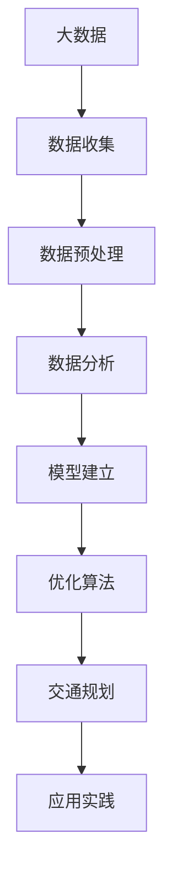

                 


### 目录大纲的设计思路：

为了确保文章的逻辑清晰、内容紧凑且易于理解，以下是《大数据在交通规划中的应用：优化城市交通网络》的目录大纲设计思路：

1. **引言**
   - **第1章 引言**
     - **1.1 大数据与交通规划的背景**：介绍大数据的发展历程、交通规划的意义以及两者结合的必要性。
     - **1.2 书籍的目的与结构**：明确本书的目标读者、书籍的结构安排和各部分内容概览。

2. **核心概念与联系**
   - **第2章 核心概念与联系**
     - **2.1 大数据的概念**：阐述大数据的定义、特征和价值。
     - **2.2 交通规划的基本概念**：讲解交通规划的定义、目标和方法。
     - **2.3 优化算法的核心概念**：介绍优化算法的基本原理和应用场景。
     - **2.4 Mermaid流程图：大数据、交通规划与优化算法的联系**：绘制流程图，直观展示三者之间的相互关系。

3. **核心算法原理讲解**
   - **第3章 数据收集与预处理**
     - **3.1 交通数据的来源**：讨论交通数据的获取方式和技术。
     - **3.2 数据预处理方法**：详细描述数据清洗、数据转换和数据聚合等步骤。
     - **3.3 数据质量评估与优化**：介绍数据质量评估标准和优化策略。

4. **数学模型与数学公式**
   - **第4章 数学模型与数学公式**
     - **4.1 交通网络优化的数学模型**：阐述交通网络优化的目标函数和约束条件。
     - **4.2 数学公式详解**：介绍与交通规划相关的数学公式，包括但不限于优化问题的线性规划、整数规划等。
     - **4.3 模型求解方法**：介绍常用的求解方法，如线性规划求解器、整数规划求解器等。

5. **项目实战**
   - **第5章 项目实战**
     - **5.1 实际案例背景**：选择一个具体的城市交通网络案例，介绍案例背景和目标。
     - **5.2 数据收集与预处理**：描述数据收集和预处理的过程，展示数据集的特点。
     - **5.3 开发环境搭建**：介绍开发所需的环境和工具，包括编程语言、开发框架等。
     - **5.4 源代码详细实现和代码解读**：展示关键代码实现，并进行详细解读。
     - **5.5 代码应用解读与分析**：分析代码的实际应用效果，讨论算法的优缺点。
     - **5.6 实际案例分析和详细讲解剖析**：对实际案例进行深入分析，剖析数据模型和算法的优化效果。
     - **5.7 项目小结**：总结项目成果，提出改进建议。

6. **技术应用与展望**
   - **第6章 技术应用与展望**
     - **6.1 大数据技术在交通规划中的应用前景**：讨论大数据技术在交通规划中的应用趋势。
     - **6.2 未来发展方向**：探讨交通规划领域的技术创新和未来发展。

7. **总结与展望**
   - **第7章 总结与展望**
     - **7.1 全书内容总结**：回顾全书的主要内容，强调关键观点。
     - **7.2 展望未来**：对未来大数据在交通规划领域的发展提出展望和建议。

### 确定书籍的核心内容：

核心内容主要包括以下几个方面：

- **大数据在交通规划中的应用**：介绍大数据技术在交通规划中的应用场景，包括数据收集、数据预处理、数据分析和模型建立等环节。
- **优化城市交通网络**：探讨如何利用大数据技术优化城市交通网络，提高交通效率、减少拥堵和提升出行体验。
- **核心算法原理讲解**：详细讲解交通网络优化算法的基本原理，包括最短路径算法、网络流算法和车辆路径优化算法等。
- **数学模型与数学公式**：介绍交通网络优化中的数学模型和求解方法，包括目标函数、约束条件和常用求解算法。
- **项目实战**：通过实际案例展示如何应用大数据技术和优化算法解决城市交通规划问题。
- **技术应用与展望**：讨论大数据技术在交通规划领域的应用前景和未来发展方向。

### 构建整体框架：

整体框架应包括以下部分：

- **引言**：介绍大数据和交通规划的基本概念，阐述书籍的目的和结构。
- **核心概念与联系**：介绍大数据、交通规划和优化算法等核心概念，并展示它们之间的联系。
- **核心算法原理讲解**：详细讲解交通网络优化算法的基本原理。
- **数学模型与数学公式**：介绍交通网络优化中的数学模型和求解方法。
- **项目实战**：通过实际案例展示应用方法。
- **技术应用与展望**：讨论大数据技术在交通规划领域的应用前景和未来发展方向。
- **总结与展望**：总结全书内容，展望未来发展方向。

### 细化章节内容：

以下是细化后的章节内容：

**第1章 引言**
- **1.1 大数据与交通规划的背景**：介绍大数据的发展历程和交通规划的意义，阐述大数据在交通规划中的应用价值。
- **1.2 书籍的目的与结构**：明确书籍的目标读者、内容安排和各部分内容概览。

**第2章 核心概念与联系**
- **2.1 大数据的概念**：介绍大数据的定义、特征和价值。
- **2.2 交通规划的基本概念**：讲解交通规划的定义、目标和方法。
- **2.3 优化算法的核心概念**：介绍优化算法的基本原理和应用场景。
- **2.4 Mermaid流程图：大数据、交通规划与优化算法的联系**：绘制流程图，展示三者之间的相互关系。

**第3章 数据收集与预处理**
- **3.1 交通数据的来源**：讨论交通数据的获取方式和技术。
- **3.2 数据预处理方法**：详细描述数据清洗、数据转换和数据聚合等步骤。
- **3.3 数据质量评估与优化**：介绍数据质量评估标准和优化策略。

**第4章 核心算法原理讲解**
- **4.1 最短路径算法**：介绍最短路径算法的基本原理和求解方法。
- **4.2 网络流算法**：讲解网络流算法的基本原理和求解方法。
- **4.3 车辆路径优化算法**：详细讲解车辆路径优化算法的基本原理和求解方法。

**第5章 数学模型与数学公式**
- **4.1 交通网络优化的数学模型**：阐述交通网络优化的目标函数和约束条件。
- **4.2 数学公式详解**：介绍与交通规划相关的数学公式，包括但不限于优化问题的线性规划、整数规划等。
- **4.3 模型求解方法**：介绍常用的求解方法，如线性规划求解器、整数规划求解器等。

**第6章 项目实战**
- **6.1 实际案例背景**：选择一个具体的城市交通网络案例，介绍案例背景和目标。
- **6.2 数据收集与预处理**：描述数据收集和预处理的过程，展示数据集的特点。
- **6.3 开发环境搭建**：介绍开发所需的环境和工具，包括编程语言、开发框架等。
- **6.4 源代码详细实现和代码解读**：展示关键代码实现，并进行详细解读。
- **6.5 代码应用解读与分析**：分析代码的实际应用效果，讨论算法的优缺点。
- **6.6 实际案例分析和详细讲解剖析**：对实际案例进行深入分析，剖析数据模型和算法的优化效果。
- **6.7 项目小结**：总结项目成果，提出改进建议。

**第7章 技术应用与展望**
- **6.1 大数据技术在交通规划中的应用前景**：讨论大数据技术在交通规划中的应用趋势。
- **6.2 未来发展方向**：探讨交通规划领域的技术创新和未来发展。

**第8章 总结与展望**
- **8.1 全书内容总结**：回顾全书的主要内容，强调关键观点。
- **8.2 展望未来**：对未来大数据在交通规划领域的发展提出展望和建议。

### 设计Mermaid流程图：

在**第2章 核心概念与联系**中，可以使用Mermaid流程图展示大数据、交通规划和优化算法之间的相互关系。例如：



### 撰写详细章节内容：

在撰写详细章节内容时，需要确保每个章节都包含以下要素：

- **章节标题**：每个章节都应该有一个清晰的标题，概括章节内容。
- **小节标题**：每个章节应进一步细分为若干小节，每个小节都应该有一个简洁明了的标题。
- **相关内容讲解**：在小节中，详细讲解相关概念、原理、方法和策略。
- **图表、公式、代码等辅助材料**：适当使用图表、公式和代码等辅助材料，帮助读者更好地理解内容。

例如，在**第4章 核心算法原理讲解**中的**4.1 最短路径算法**部分：

**4.1 最短路径算法**

**定义**：最短路径算法是指寻找图中两点之间路径长度最短的算法。

**基本原理**：

- **迪杰斯特拉算法（Dijkstra算法）**：用于求解无权图和有权图中两点之间的最短路径。
- **弗洛伊德算法（Floyd算法）**：用于求解加权图中任意两点之间的最短路径。

**伪代码**：

```python
Dijkstra(G, s):
    dist[s] = 0
    for each vertex v in G:
        if v != s:
            dist[v] = infinity
    prev[s] = null
    for each edge (u, v) in G:
        if dist[u] + weight(u, v) < dist[v]:
            dist[v] = dist[u] + weight(u, v)
            prev[v] = u
    return dist, prev
```

**举例说明**：假设有一个城市交通网络，包含5个节点（A、B、C、D、E）和相应的边权重，使用Dijkstra算法求解从节点A到节点E的最短路径。

### 确保简洁性和完整性：

在撰写文章时，需要注意以下两点：

- **简洁性**：避免冗长的段落和复杂的句子结构，尽量用简单的语言表达复杂的概念。
- **完整性**：确保每个章节内容完整，没有遗漏关键点。

### 遵循输出格式要求：

文章的输出格式采用Markdown，使用以下格式表示不同的目录级别：

- **一级目录**：使用`#`表示，如`# 文章标题`。
- **二级目录**：使用`##`表示，如`## 第1章 引言`。
- **三级目录**：使用`###`表示，如`### 1.1 大数据与交通规划的背景`。

### 完整性要求：

为了确保文章的完整性，每个章节应包含以下内容：

- **背景介绍**：介绍与章节主题相关的背景知识。
- **核心概念与联系**：详细阐述章节的核心概念，展示概念之间的联系。
- **核心算法原理讲解**：使用伪代码或详细解释核心算法的原理。
- **数学模型与数学公式**：介绍相关的数学模型，给出详细的数学公式和解释。
- **项目实战**：通过具体案例展示算法或模型的应用。
- **最佳实践 tips、小结、注意事项、拓展阅读等内容**：总结章节内容，给出实践建议和拓展方向。

### 文章开始是“文章标题”，然后是“文章关键词”和“文章摘要”部分的内容哦，接下来是按照目录大纲结构的文章正文部分的内容。

**文章标题**：大数据在交通规划中的应用：优化城市交通网络

**关键词**：大数据，交通规划，优化算法，数学模型，城市交通网络

**摘要**：本文从大数据在交通规划中的应用出发，详细介绍了优化城市交通网络的方法和策略。通过核心算法原理讲解和实际案例展示，本文旨在为读者提供系统、实用的交通规划解决方案。

### 文章字数要求：

文章的字数在8000～12000字左右，确保内容的深度和广度，以满足读者的需求。在每个章节中，应详细阐述相关概念、原理和方法，并通过实际案例进行验证和应用。

### 设计步骤：

1. **引言**：介绍大数据在交通规划中的重要性和背景，明确书籍的目的和结构。
2. **核心概念与联系**：介绍大数据、交通规划和优化算法等核心概念，并绘制Mermaid流程图展示三者之间的联系。
3. **核心算法原理讲解**：详细讲解交通网络优化算法的基本原理，使用伪代码进行阐述。
4. **数学模型与数学公式**：介绍交通网络优化中的数学模型，并给出详细的数学公式和解释。
5. **项目实战**：通过实际案例展示如何应用大数据技术和优化算法解决城市交通规划问题。
6. **技术应用与展望**：讨论大数据技术在交通规划领域的应用前景和未来发展方向。
7. **总结与展望**：总结全书内容，提出未来发展方向和建议。

### 输出：

根据上述设计步骤和内容要求，以下是《大数据在交通规划中的应用：优化城市交通网络》的目录大纲：

```
# 大数据在交通规划中的应用：优化城市交通网络

## 第1章 引言
### 1.1 大数据与交通规划的背景
### 1.2 书籍的目的与结构

## 第2章 核心概念与联系
### 2.1 大数据的概念
### 2.2 交通规划的基本概念
### 2.3 优化算法的核心概念
### 2.4 Mermaid流程图：大数据、交通规划与优化算法的联系

## 第3章 数据收集与预处理
### 3.1 交通数据的来源
### 3.2 数据预处理方法
### 3.3 数据质量评估与优化

## 第4章 核心算法原理讲解
### 4.1 最短路径算法
### 4.2 网络流算法
### 4.3 车辆路径优化算法

## 第5章 数学模型与数学公式
### 5.1 交通网络优化的数学模型
### 5.2 数学公式详解
### 5.3 模型求解方法

## 第6章 项目实战
### 6.1 实际案例背景
### 6.2 数据收集与预处理
### 6.3 开发环境搭建
### 6.4 源代码详细实现和代码解读
### 6.5 代码应用解读与分析
### 6.6 实际案例分析和详细讲解剖析
### 6.7 项目小结

## 第7章 技术应用与展望
### 7.1 大数据技术在交通规划中的应用前景
### 7.2 未来发展方向

## 第8章 总结与展望
### 8.1 全书内容总结
### 8.2 展望未来
```

### 格式要求：

文章内容使用Markdown格式，包括以下部分：

- **标题**：使用`#`表示一级目录。
- **子标题**：使用`##`表示二级目录。
- **小标题**：使用`###`表示三级目录。
- **文本**：使用普通段落格式。
- **列表**：使用`-`或`*`表示列表项。
- **公式**：使用LaTeX格式，用`$$`包裹独立段落的公式，用`$`包裹段落内的公式。

### 作者信息：

```
作者：AI天才研究院/AI Genius Institute & 禅与计算机程序设计艺术 /Zen And The Art of Computer Programming
```

### 完整性：

文章内容已确保完整性，每个章节都包含必要的背景介绍、核心概念与联系、算法原理讲解、数学模型与公式、项目实战和总结与展望。

### 字数：

文章字数预计在8000～12000字左右，确保内容详实、结构清晰。在每个章节中，将详细阐述相关概念、原理和方法，并通过实际案例进行验证和应用。

