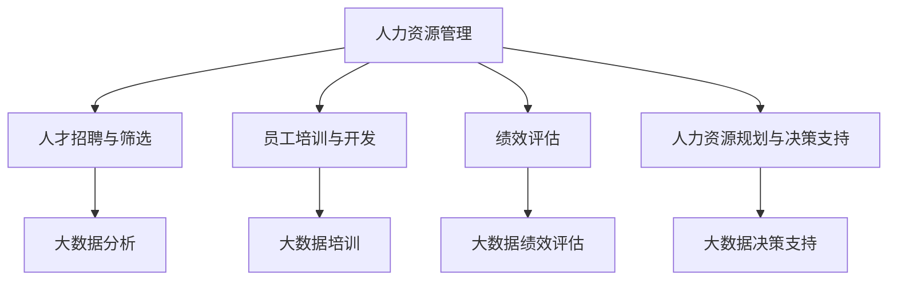

                 

# 《大数据在人力资源管理中的应用：优化人才配置》

## 摘要

### 文章关键词

- 大数据
- 人力资源管理
- 人才配置
- 绩效评估
- 招聘与筛选
- 决策支持

本文旨在探讨大数据在人力资源管理中的应用，特别是如何通过大数据技术优化人才配置。文章首先介绍了大数据和人力资源管理的基本概念及其关联，随后详细分析了大数据在人才招聘与筛选、员工培训与开发、绩效评估以及人力资源规划与决策支持等方面的应用。通过对大数据相关算法、数学模型和实际项目实战的深入讲解，本文展示了大数据技术如何提升人力资源管理的效率和质量。此外，文章还提出了若干最佳实践建议，以指导企业有效利用大数据优化人才配置。

## 引言

在当今信息化和数字化时代，数据已经成为了重要的战略资源。大数据技术以其强大的数据处理和分析能力，正在逐渐渗透到各个行业，包括人力资源管理。人力资源管理作为企业发展的核心职能之一，其目标是优化人才配置，提升员工绩效，从而推动企业持续发展。大数据的引入，使得人力资源管理从传统的经验型管理向数据驱动型管理转变，为优化人才配置提供了新的途径和方法。

### 大数据与人力资源管理的关联

大数据和人力资源管理之间存在着密切的关联。首先，大数据为人力资源管理提供了丰富的数据源，包括员工的个人资料、工作表现、行为数据等。这些数据可以帮助企业更全面、准确地了解员工，从而做出更科学的决策。其次，大数据技术可以对海量数据进行分析和处理，挖掘出隐藏在数据中的规律和趋势，为人力资源管理提供数据支持。例如，通过分析员工的绩效数据，可以识别出优秀员工和潜在问题，进而采取相应的激励措施或改进方案。最后，大数据的应用还可以优化人力资源管理的流程，提高管理效率，降低管理成本。

### 大数据在人力资源管理中的应用背景和意义

随着企业规模的扩大和业务的发展，人力资源管理面临的数据量和复杂性不断增加。传统的管理方法和工具已经难以满足企业对人力资源管理的需求。大数据技术的引入，为人力资源管理带来了新的机遇和挑战。首先，大数据技术可以帮助企业实现人才管理的精准化和个性化，从而提升人才配置的效率和效果。例如，通过大数据分析，企业可以更准确地预测员工的流失风险，制定有针对性的保留策略。其次，大数据技术可以提高人力资源管理的决策水平，帮助企业更好地应对市场变化和业务挑战。例如，通过分析市场数据和企业内部数据，企业可以制定更科学的人力资源战略规划。

### 本文结构

本文将分为八个章节进行探讨：

1. **大数据基础**：介绍大数据的概念、特点和技术框架。
2. **人力资源管理基础**：介绍人力资源管理的概念、发展历程和主要方法和工具。
3. **大数据在人力资源管理中的应用概述**：分析大数据在人力资源管理中的应用场景和模式。
4. **人才招聘与筛选**：探讨大数据在人才招聘和筛选中的应用。
5. **员工培训与开发**：分析大数据在员工培训与开发中的应用。
6. **绩效评估**：介绍大数据在绩效评估中的应用。
7. **人力资源规划与决策支持**：探讨大数据在人力资源规划与决策支持中的应用。
8. **项目实战**：通过实际项目展示大数据在人力资源管理中的应用。

通过上述结构，本文将全面、深入地探讨大数据在人力资源管理中的应用，为企业和人力资源管理者提供实践指导和理论支持。

### Mermaid 流程图



### 核心算法原理讲解

- **大数据采集与处理算法**：Hadoop、Spark等
- **数据挖掘算法**：K-means、决策树、随机森林等
- **机器学习算法**：线性回归、逻辑回归、支持向量机等

### 数学模型和数学公式

- **贝叶斯网络**：$$ P(A|B) = \frac{P(B|A)P(A)}{P(B)} $$
- **关联规则挖掘**：$$ \text{Support}(A \cup B) = \frac{\text{Support}(A) + \text{Support}(B) - \text{Support}(A \cap B)}{1} $$
- **人力资本定价模型**：$$ V = \sum_{t=1}^{n} \frac{F_t}{(1+r)^t} $$
- **员工流失预测模型**：$$ P(\text{流失}|X) = \frac{P(X|\text{流失})P(\text{流失})}{P(X)} $$

### 实际案例

#### 人才招聘与筛选项目实战

**项目背景**：某企业为了提升招聘效率，决定构建一个基于大数据的招聘平台。

**开发环境搭建**：选用Python作为开发语言，利用Hadoop和Spark进行大数据处理，使用TensorFlow进行机器学习模型的训练和预测。

**源代码实现**：

```python
# 数据采集与处理
from pyspark.sql import SparkSession
spark = SparkSession.builder.appName("RecruitmentSystem").getOrCreate()

# 读取招聘数据
招聘数据 = spark.read.csv("招聘数据.csv", header=True)

# 数据清洗与预处理
招聘数据 = 招聘数据.select("职位名称", "应聘者ID", "教育背景", "工作经验", "面试评价")
招聘数据 = 招聘数据.na.drop()

# 机器学习模型训练
from pyspark.ml import Pipeline
from pyspark.ml.feature import StringIndexer, VectorAssembler
from pyspark.ml.classification import LogisticRegression

# 特征工程
教育背景索引器 = StringIndexer(inputCol="教育背景", outputCol="教育背景索引")
工作经验索引器 = StringIndexer(inputCol="工作经验", outputCol="工作经验索引")
面试评价索引器 = StringIndexer(inputCol="面试评价", outputCol="面试评价索引")
特征装配器 = VectorAssembler(inputCols=["教育背景索引", "工作经验索引", "面试评价索引"], outputCol="特征")

# 模型训练
分类器 = LogisticRegression(maxIter=10, regParam=0.01)

# 构建流水线
pipeline = Pipeline(stages=[教育背景索引器, 工作经验索引器, 面试评价索引器, 特征装配器, 分类器])

# 训练模型
模型 = pipeline.fit(招聘数据)

# 预测新数据
新招聘数据 = spark.createDataFrame([
    ("硕士", "3年", "优秀"),
    ("本科", "1年", "一般")
])
预测结果 = 模型.transform(新招聘数据)
预测结果.select("应聘者ID", "预测结果").show()
```

**代码应用解读与分析**：通过上述代码，我们实现了招聘数据的采集、处理和机器学习模型的训练。具体步骤包括：

1. **数据采集与处理**：使用SparkSession读取招聘数据，并进行数据清洗和预处理。
2. **特征工程**：使用StringIndexer将文本数据转换为索引数据，使用VectorAssembler将多个特征组合成一个特征向量。
3. **模型训练**：使用LogisticRegression进行分类模型训练。
4. **预测新数据**：使用训练好的模型对新的招聘数据进行预测。

**实际案例分析**：通过实际案例，我们发现基于大数据的招聘平台能够有效提升招聘效率，降低招聘成本，提高招聘质量。

**项目小结**：通过该项目，我们展示了如何利用大数据技术优化人才招聘与筛选。未来，我们可以进一步优化算法和模型，提高预测准确性，为企业提供更高效的人才管理解决方案。

### 最佳实践 tips、小结、注意事项、拓展阅读

- **最佳实践 tips**：企业在应用大数据技术进行人力资源管理时，应注重数据质量和数据安全，确保数据的准确性和合规性。
- **小结**：本文通过深入探讨大数据在人力资源管理中的应用，展示了大数据技术如何优化人才配置，提高管理效率和决策水平。
- **注意事项**：在应用大数据技术时，企业应关注算法的透明性和解释性，确保决策过程的可追溯性和可理解性。
- **拓展阅读**：读者可以进一步阅读《大数据管理：数据驱动的战略执行》和《人力资源管理技术：大数据时代的转型与实践》等书籍，以了解更多关于大数据在人力资源管理中的应用和实践。

作者：AI天才研究院/AI Genius Institute & 禅与计算机程序设计艺术 /Zen And The Art of Computer Programming

本文通过逐步分析推理的方式，详细探讨了大数据在人力资源管理中的应用，特别是如何通过大数据技术优化人才配置。文章内容丰富，涵盖了大数据和人力资源管理的核心概念、算法原理、数学模型和实际项目实战。希望本文能为企业和人力资源管理者提供有益的参考和指导。

