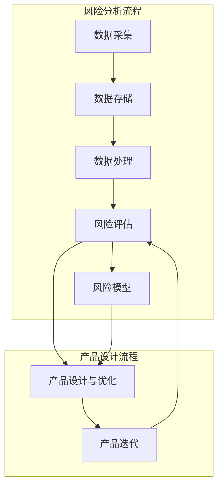

                 

### 引言与背景

随着信息技术的飞速发展，大数据已经成为现代商业环境中不可或缺的一部分。在保险业中，大数据的应用更是发挥着至关重要的作用。保险行业面临的风险评估和产品创新等问题，通过大数据技术可以得到显著改善。本文旨在探讨大数据在保险业中的应用，重点关注风险评估和产品创新两大领域。

首先，保险行业是一个高度依赖数据的行业。保险公司在经营过程中需要收集和分析大量的数据，包括客户信息、理赔记录、市场趋势等。传统的风险评估方法往往依赖于简单的统计数据和经验模型，难以全面准确地评估风险。而大数据技术的出现，为保险公司提供了新的工具和方法，使得风险评估更加科学和精准。

其次，大数据在保险产品创新中同样具有重要意义。传统的保险产品设计主要依赖于市场调研和客户反馈，但这种方法存在一定的滞后性和局限性。通过大数据分析，保险公司可以实时捕捉市场动态和客户需求，从而设计出更加符合市场需求的创新产品。

总之，大数据在保险业中的应用不仅提升了风险评估的准确性和效率，也推动了保险产品的创新与发展。本文将详细探讨大数据在保险业中的应用，分析其核心概念、处理流程、风险评估模型以及产品创新案例，为保险行业的发展提供有益的参考和启示。

### 1.1 大数据和保险业的联系

大数据与保险业之间的联系密不可分，主要体现在数据量的增长、数据类型的多样性和数据应用场景的扩展。首先，保险行业拥有丰富的数据资源，包括客户个人信息、历史理赔记录、市场趋势等。这些数据构成了保险业大数据的基础。

随着信息技术的发展，保险公司的数据量呈现爆发式增长。传统的数据存储和处理方式已经无法满足需求，大数据技术的引入使得海量数据的存储、管理和分析成为可能。例如，通过大数据平台，保险公司可以实现实时数据采集和智能分析，从而更加精准地进行风险评估和产品创新。

其次，大数据在保险业中的应用场景非常广泛。风险评估是保险业的核心任务之一，通过大数据技术，保险公司可以构建更加精细化的风险评估模型，提高风险评估的准确性和效率。具体来说，大数据可以应用于以下几个方面：

1. **客户风险评估**：保险公司可以通过大数据分析，了解客户的保险需求、风险偏好和历史理赔记录，从而提供个性化的风险评估服务。

2. **风险预警**：大数据技术可以帮助保险公司实时监控市场风险，识别潜在的欺诈行为，提前采取预防措施。

3. **保险产品设计**：通过大数据分析，保险公司可以深入了解市场动态和客户需求，设计出更加符合市场需求的保险产品。

4. **理赔服务优化**：大数据技术可以帮助保险公司优化理赔流程，提高理赔效率，改善客户体验。

除了在风险评估中的应用，大数据还在保险产品创新中发挥着重要作用。传统的保险产品设计主要依赖于市场调研和客户反馈，这种方式存在一定的滞后性和局限性。通过大数据分析，保险公司可以实时捕捉市场动态和客户需求，从而设计出更加创新和灵活的保险产品。

总之，大数据与保险业之间的联系日益紧密，大数据技术的引入不仅提升了保险行业的风险管理和创新能力，也为保险业的可持续发展提供了新的动力。在未来，大数据将继续在保险业中发挥重要作用，推动保险行业实现更高效、更智能的发展。

### 1.2 大数据在保险业中的重要性

大数据在保险业中的重要性不容忽视，其主要体现在提升风险管理和产品创新两个方面。首先，在风险管理方面，大数据技术为保险公司提供了更加精准和全面的风险评估工具。传统的风险评估方法往往依赖于历史数据和经验模型，这些方法存在明显的局限性，无法准确反映当前市场的风险状况。而大数据技术能够处理和分析海量数据，通过数据挖掘和机器学习等技术，保险公司可以构建更加精细化的风险评估模型，从而提高风险评估的准确性和效率。

例如，通过分析客户的个人数据、历史理赔记录、市场趋势等多维数据，保险公司可以更加准确地评估客户的保险需求和潜在风险。这不仅有助于保险公司制定更合理的保费定价策略，还能有效降低保险欺诈的风险。此外，大数据技术还可以帮助保险公司实时监控市场风险，通过数据分析和预测，提前识别和应对潜在的市场风险，从而降低公司的风险敞口。

其次，大数据在保险产品创新方面同样具有重要价值。传统的保险产品设计主要依赖于市场调研和客户反馈，这种方式存在一定的滞后性和局限性。而通过大数据分析，保险公司可以实时捕捉市场动态和客户需求，从而设计出更加创新和灵活的保险产品。

具体来说，大数据分析可以帮助保险公司了解不同客户群体的保险需求，从而设计出更加个性化和定制化的保险产品。例如，通过分析客户的消费习惯、兴趣爱好、地理位置等信息，保险公司可以推出符合客户需求的保险产品，提高产品的市场竞争力。此外，大数据技术还可以帮助保险公司优化产品设计流程，通过模拟和测试不同产品的表现，快速迭代和优化产品，提高产品的成功率。

总之，大数据在保险业中的重要性体现在其能够显著提升保险公司的风险管理和产品创新能力。通过大数据技术，保险公司不仅能够更准确地评估风险，提高业务运营效率，还能更好地满足客户需求，实现业务持续增长。在未来，随着大数据技术的不断发展和应用，保险行业将迎来更加智能化和高效化的发展。

### 1.3 风险评估与产品创新的意义

风险评估和产品创新在保险业中扮演着至关重要的角色。首先，风险评估是保险公司的核心任务之一，其主要目的是识别和评估潜在的风险，以便保险公司能够制定合理的风险管理和保费定价策略。通过准确的风险评估，保险公司可以降低业务运营中的风险，提高公司的稳定性和盈利能力。

具体来说，风险评估对于保险公司有以下几个方面的意义：

1. **风险控制**：通过评估客户的风险水平，保险公司可以更有效地控制业务风险，减少潜在的理赔损失。例如，对于高风险客户，保险公司可以采取更严格的审核和监控措施，确保其风险敞口在可控范围内。

2. **定价策略**：精准的风险评估有助于保险公司制定合理的保费定价策略。通过对不同风险水平的客户进行分类，保险公司可以设置差异化的保费，从而最大化收益并降低运营成本。

3. **业务拓展**：风险评估的结果可以指导保险公司进行业务拓展和市场定位。通过识别市场中的高潜力客户群体，保险公司可以设计出更具吸引力的保险产品，开拓新的业务领域。

其次，产品创新是保险业保持竞争力和吸引力的关键。随着市场环境和消费者需求的变化，保险公司需要不断创新产品，以适应市场的新趋势和客户的新需求。

具体来说，产品创新对保险公司有以下几个方面的意义：

1. **市场竞争力**：通过不断推出创新产品，保险公司可以提升市场竞争力，吸引更多客户。例如，基于大数据分析的新型保险产品，可以满足客户对个性化和定制化服务的需求，从而在市场上脱颖而出。

2. **客户满意度**：产品创新有助于提升客户满意度。通过分析客户需求和反馈，保险公司可以设计出更加符合客户期望的保险产品，提高客户忠诚度和满意度。

3. **业务增长**：创新产品可以带动业务增长，扩大公司的市场份额。例如，某些创新保险产品可能会引起市场的广泛关注，从而吸引大量新客户，推动业务快速增长。

综上所述，风险评估和产品创新对于保险公司具有重要的战略意义。通过精准的风险评估，保险公司可以更好地控制风险和制定定价策略；通过不断的产品创新，保险公司可以提升市场竞争力，满足客户需求，实现业务持续增长。在未来，保险公司需要更加重视风险评估和产品创新，以应对日益激烈的市场竞争和不断变化的市场环境。

### 2.1 大数据的基本概念

大数据（Big Data）是指无法使用传统数据处理工具在合理时间内进行捕捉、管理和处理的大量数据集。大数据的三个主要特征，即“3V”（Volume、Velocity、Variety），分别代表了数据量、数据处理速度和数据类型的多样性。

**Volume（数据量）**：大数据的一个显著特征是其数据量庞大。传统数据集通常在几十万到几千万条记录，而大数据的数据量可以达到数百万亿条记录。这种海量数据对存储和处理系统提出了极高的要求。

**Velocity（数据处理速度）**：大数据的产生和更新速度极快。例如，社交媒体平台每秒产生的数据量巨大，金融交易系统需要实时处理和分析交易数据。这要求数据处理系统能够高效地处理和实时分析大量数据。

**Variety（数据类型多样性）**：大数据不仅包括结构化数据，如数据库中的记录，还包含半结构化数据（如XML、JSON）和非结构化数据（如文本、图片、视频）。这种多样性增加了数据处理的复杂性，但同时也提供了更丰富的数据来源。

大数据的应用场景非常广泛，涵盖了多个行业。以下是大数据在几个典型行业中的应用：

1. **医疗健康**：大数据可以帮助医疗机构进行疾病预测、药物研发和患者管理。例如，通过分析患者的电子健康记录，医生可以提前发现潜在的健康问题，提供个性化的治疗方案。

2. **金融行业**：大数据在金融行业中应用广泛，包括风险管理、欺诈检测、市场预测等。例如，银行可以通过大数据分析来识别欺诈交易，降低风险。

3. **零售业**：零售商利用大数据分析客户行为，优化库存管理、定价策略和市场营销。例如，通过分析客户的购买记录，零售商可以推荐相关商品，提高销售转化率。

4. **交通与物流**：大数据在交通管理和物流优化中发挥重要作用。通过分析交通数据，政府可以优化交通信号灯配置，减少拥堵。物流公司可以通过大数据分析，优化运输路线和仓储管理，提高物流效率。

5. **保险业**：大数据在保险业中的应用非常典型，包括风险评估、理赔服务优化、产品创新等。保险公司通过大数据分析，可以更准确地评估风险，设计出更符合市场需求的保险产品。

总之，大数据在各个行业中的应用正在不断扩展和深化，其强大的数据处理能力为各个领域带来了革命性的变化。未来，随着技术的进一步发展，大数据将在更多行业和领域中发挥重要作用。

### 2.2 保险风险的基本概念

保险风险（Insurance Risk）是指保险公司因承保业务所面临的不确定性和潜在损失。保险风险的种类繁多，主要包括以下几类：

1. **信用风险**：信用风险是指保险公司因保单持有者未能履行支付保费义务或保险合同中的其他条款而导致的潜在损失。例如，客户因经济困难而未能按时支付保费，导致保险公司无法获得预期的收入。

2. **市场风险**：市场风险是指由于市场环境变化（如利率、汇率、股票市场波动等）导致保险公司资产价值下降或收益减少的风险。例如，股票市场下跌可能导致保险公司投资组合的价值缩水。

3. **理赔风险**：理赔风险是指保险公司因理赔案件增加或理赔金额超过预期而面临的风险。例如，自然灾害频发可能导致大量的理赔案件，增加保险公司的赔付压力。

4. **运营风险**：运营风险是指由于内部操作失误、系统故障、人员错误等导致的风险。例如，保险公司的信息系统故障可能导致理赔服务中断，影响客户体验。

5. **法律风险**：法律风险是指保险公司因违反法律法规或合同条款而面临的法律责任和潜在损失。例如，保险公司因欺诈行为被起诉，可能需要支付巨额赔偿。

评估保险风险的主要方法包括以下几种：

1. **历史数据分析**：通过对历史理赔数据、市场风险数据等进行分析，保险公司可以识别出潜在的风险因素，制定相应的风险管理策略。

2. **风险模型**：利用统计模型和机器学习技术，保险公司可以构建风险评估模型，预测客户的风险水平。常用的模型包括贝叶斯模型、线性回归模型、决策树模型等。

3. **情景分析**：通过模拟不同的市场环境和风险情景，保险公司可以评估在不同情景下的风险敞口和潜在损失，制定相应的应对措施。

4. **实时监控**：通过实时数据监控和风险预警系统，保险公司可以及时识别和应对风险事件，降低潜在损失。

总之，保险风险是保险公司在运营过程中不可避免的一部分。通过科学的风险评估和有效的风险管理措施，保险公司可以降低风险，保障业务的稳健运营。

### 2.3 风险评估模型与保险产品设计的关系

风险评估模型在保险产品设计过程中起着至关重要的作用。它们不仅帮助保险公司准确识别和管理风险，还为产品的定价和设计提供了科学依据。具体来说，风险评估模型与保险产品设计之间的关系可以从以下几个方面进行分析：

**1. 风险评估模型在定价中的应用**

风险评估模型的核心功能是评估客户的风险水平，从而为产品的定价提供依据。传统保险产品的定价主要依赖于经验数据和简单的统计分析方法，这种方法往往难以准确反映客户的真实风险水平。而通过风险评估模型，保险公司可以利用客户的历史数据、行为数据等，构建复杂的数学模型，如贝叶斯模型、线性回归模型和机器学习模型等，更加准确地预测客户的风险水平。

例如，利用贝叶斯模型，保险公司可以根据客户的年龄、性别、健康状况、驾驶记录等特征，计算其发生保险事故的概率。通过这种精确的风险评估，保险公司可以设定差异化的保费，使得高风险客户支付更高的保费，而低风险客户则支付较低的保费，从而实现公平合理的定价。

**2. 风险评估模型在产品设计中的应用**

风险评估模型不仅帮助保险公司进行定价，还为产品的设计和优化提供了重要指导。通过分析不同客户群体的风险特征，保险公司可以设计出更加细分和个性化的保险产品，满足不同客户的需求。

例如，利用机器学习模型，保险公司可以对客户进行细分，识别出高风险、中等风险和低风险客户群体。针对不同风险水平的客户，保险公司可以设计出具有不同保障范围和保费水平的保险产品。这种细分的保险产品能够更好地满足客户的个性化需求，提高产品的市场竞争力和客户满意度。

此外，风险评估模型还可以帮助保险公司优化产品设计流程。通过模拟和测试不同产品方案的表现，保险公司可以快速迭代和优化产品，提高产品的成功率和市场接受度。

**3. 风险评估模型与产品优化的关系**

风险评估模型不仅是产品设计的基础，还在产品的优化过程中发挥重要作用。通过实时监控和评估产品的运行效果，保险公司可以及时发现产品存在的问题，进行相应的调整和优化。

例如，利用深度学习模型，保险公司可以分析客户对保险产品的反馈数据，识别出客户满意度较高的产品特征和设计要素。通过这些信息，保险公司可以对现有产品进行优化，提升产品的用户体验和满意度。

总之，风险评估模型与保险产品设计之间存在紧密的关系。通过科学的风险评估，保险公司可以实现公平合理的定价，设计出更加细分和个性化的保险产品，提高产品的市场竞争力和客户满意度。同时，风险评估模型还在产品优化过程中发挥重要作用，帮助保险公司不断改进产品，实现业务的持续发展。

### 2.4 Mermaid流程图: 大数据、风险分析与产品设计的联系

为了直观地展示大数据、风险分析与产品设计之间的联系，我们使用Mermaid流程图来描述这一过程。以下是具体的Mermaid流程图：



**流程解释：**

1. **数据采集（A）**：首先，保险公司需要收集各种数据，包括客户信息、历史理赔记录、市场趋势等。

2. **数据存储（B）**：采集到的数据需要存储在高效且安全的数据存储系统中，以便后续处理和分析。

3. **数据处理（C）**：数据存储后，进行数据清洗、格式化等预处理工作，以确保数据的质量和一致性。

4. **风险评估（D）**：利用数据处理结果，进行风险分析和评估。这包括应用各种风险评估模型（如贝叶斯模型、机器学习模型等），对客户的风险水平进行量化。

5. **风险模型（E）**：通过构建和优化风险评估模型，保险公司可以更准确地预测风险，从而为产品设计和优化提供依据。

6. **产品设计与优化（F）**：根据风险评估的结果，保险公司可以设计出更符合市场需求的保险产品，并进行优化。

7. **产品迭代（G）**：在产品上线后，通过客户反馈和市场表现，对产品进行迭代和改进，不断提升产品的竞争力和用户体验。

这个流程图清晰地展示了大数据在保险业中的应用过程，以及如何通过风险评估和产品设计，实现保险产品的创新和优化。

### 3.1 大数据处理流程

大数据处理流程包括数据采集、存储、处理和分析等关键步骤，每个步骤都对最终结果有着重要影响。以下详细描述这些步骤：

**1. 数据采集**

数据采集是大数据处理流程的第一步，也是最重要的一步。保险公司需要从多个来源收集数据，包括内部数据（如客户信息、历史理赔记录、保单数据等）和外部数据（如公共记录、社交媒体数据、市场趋势数据等）。数据来源的多样性和广泛性为数据分析提供了丰富的数据基础。

数据采集过程中，需要确保数据的完整性和准确性。例如，在采集客户数据时，保险公司需要获取客户的个人信息、健康状况、财务状况等详细信息。这些数据可以从保险公司的数据库、第三方数据提供商以及公共记录中获得。

**2. 数据存储**

数据存储是大数据处理流程的下一步。由于数据量庞大，传统的数据存储方式已经无法满足需求。因此，保险公司通常使用分布式存储系统，如Hadoop、Spark等，来存储和管理海量数据。这些分布式存储系统能够高效地存储和检索数据，并提供高可用性和容错性。

在数据存储过程中，需要考虑数据的安全性和隐私保护。保险公司的数据通常包含敏感信息，如客户个人信息和财务数据，因此需要采用加密技术和访问控制措施，确保数据在存储过程中的安全性。

**3. 数据处理**

数据处理是大数据处理流程的核心步骤，包括数据清洗、数据整合和数据预处理等。数据清洗是指去除数据中的噪声、错误和不完整信息，确保数据的质量。数据整合是指将来自不同来源的数据进行合并和统一，以便后续分析。数据预处理是指对数据进行格式化、标准化和规范化，使其符合分析要求。

在数据处理过程中，保险公司需要使用各种数据处理技术和工具，如ETL（Extract, Transform, Load）工具、清洗库（如Pandas、Spark SQL）等。这些工具可以帮助保险公司高效地处理大量数据，提高数据分析的准确性和效率。

**4. 数据分析**

数据分析是大数据处理流程的最终目标，通过分析数据，保险公司可以提取有价值的信息，支持业务决策和产品创新。数据分析通常包括统计分析、机器学习、数据挖掘等。

在统计分析中，保险公司可以使用描述性统计、推断性统计等方法，了解数据的分布特征和潜在规律。例如，通过分析客户的理赔记录，保险公司可以识别出高风险客户群体。

在机器学习和数据挖掘中，保险公司可以使用各种算法（如决策树、支持向量机、神经网络等）来构建风险评估模型、欺诈检测模型等。这些模型可以帮助保险公司更准确地预测风险、识别欺诈行为，从而优化业务流程和产品设计。

**5. 数据可视化**

数据可视化是将数据分析结果以图形或图表的形式展示出来，使数据更加直观和易于理解。保险公司可以使用各种数据可视化工具（如Tableau、Power BI等）来创建可视化报告，帮助管理层和业务人员更好地理解和利用数据分析结果。

**6. 数据安全和隐私保护**

在整个大数据处理流程中，数据安全和隐私保护是至关重要的一环。保险公司需要确保数据在采集、存储、处理和传输过程中的安全性，防止数据泄露和滥用。为此，保险公司需要采用一系列安全措施，如数据加密、访问控制、审计日志等。

**总结**

大数据处理流程是一个复杂且多步骤的过程，涉及多个环节和多种技术。保险公司需要合理规划和处理这些步骤，确保数据的质量和安全性，从而充分发挥大数据的价值，为业务决策和产品创新提供有力支持。

### 3.2 数据采集

数据采集是大数据处理流程中的第一步，也是至关重要的一步。它涉及到从各种数据源收集所需信息的过程。对于保险业来说，数据采集主要包括内部数据和外部数据的收集。

**内部数据采集**：

1. **客户信息**：保险公司需要收集客户的个人信息，包括姓名、年龄、性别、身份证号、联系方式等。这些信息通常来源于保单申请表、客户服务系统等。

2. **理赔记录**：理赔记录是保险公司内部数据中非常重要的一部分。这些数据包括理赔案件的发生时间、理赔金额、理赔原因等，通常来源于理赔管理系统。

3. **保单数据**：保单数据包括保单的类型、期限、保费、保险金额等。这些数据通常来源于保单管理系统。

4. **运营数据**：保险公司的运营数据包括业务量、员工绩效、营销活动效果等。这些数据通常来源于公司内部的运营管理系统。

**外部数据采集**：

1. **公共记录**：保险公司可以从公共记录中获取客户的信用记录、历史犯罪记录、车辆信息等。这些数据通常可以通过政府机构、第三方数据提供商等渠道获取。

2. **社交媒体数据**：社交媒体平台上的数据可以反映客户的社交行为、消费习惯、兴趣爱好等。保险公司可以通过数据挖掘技术从社交媒体平台上获取这些信息。

3. **市场趋势数据**：市场趋势数据包括经济指标、行业动态、政策法规等。保险公司可以通过市场调研报告、行业数据库等获取这些数据。

4. **第三方数据提供商**：保险公司还可以通过第三方数据提供商获取专业的数据服务，如客户画像、风险评估数据等。

**数据采集方法**：

1. **Web爬虫**：通过Web爬虫技术，保险公司可以自动从互联网上获取公开的文本、图片、视频等多媒体数据。

2. **API接口**：许多数据源提供了API接口，保险公司可以通过API接口获取所需数据。

3. **问卷和调查**：通过设计问卷和调查，保险公司可以直接从客户那里获取第一手数据。

4. **数据交易市场**：保险公司可以在数据交易市场上购买所需数据。

**数据采集注意事项**：

1. **数据合规性**：在采集数据时，保险公司需要遵守相关法律法规，确保数据的合规性。

2. **数据质量**：数据采集过程中，需要确保数据的准确性和完整性，避免数据噪声和错误。

3. **数据隐私**：保险公司需要保护客户的数据隐私，采取加密、匿名化等手段，防止数据泄露。

总之，数据采集是大数据处理的基础，保险公司需要采用多种方法收集内部和外部数据，确保数据的合规性和质量，为后续的数据处理和分析提供可靠的数据基础。

### 3.3 数据存储

数据存储是大数据处理流程中的关键环节，其目标是确保数据的长期保存、快速访问和高效管理。对于保险公司来说，数据存储不仅要满足海量数据的存储需求，还要考虑到数据的隐私保护和安全性。

**1. 分布式存储系统**

保险公司通常使用分布式存储系统来管理海量数据，如Hadoop、Spark等。这些系统通过将数据分散存储在多个节点上，提供高可用性和容错性。分布式存储的优势在于：

- **高扩展性**：分布式存储系统能够动态扩展存储容量，适应数据量的增长。
- **高可靠性**：通过数据冗余和节点故障自动恢复，保证数据的可靠性。
- **高效性**：分布式存储系统利用并行处理技术，提高数据处理速度。

**2. 数据库技术**

除了分布式存储系统，保险公司还会使用关系型数据库（如MySQL、PostgreSQL）和非关系型数据库（如MongoDB、Cassandra）来存储结构化数据。关系型数据库适用于存储结构化数据，如客户信息、保单数据等；非关系型数据库则适用于存储半结构化或非结构化数据，如文本、图片、视频等。

**3. 数据湖**

数据湖是一种新兴的数据存储架构，用于存储海量结构化、半结构化和非结构化数据。与数据仓库不同，数据湖不事先定义数据模型，而是将数据以原始形式存储，便于后续处理和分析。数据湖的优势包括：

- **灵活性**：支持各种数据类型的存储，包括文本、图片、视频等。
- **可扩展性**：能够容纳大量数据，满足保险公司的长期存储需求。
- **高效性**：采用分布式存储技术，提供高并发访问和处理能力。

**4. 数据库选择策略**

在选择数据存储方案时，保险公司需要根据具体需求选择合适的数据库技术：

- **结构化数据**：对于需要频繁查询和更新的数据，可以选择关系型数据库。
- **非结构化数据**：对于存储文本、图片、视频等数据，可以选择非关系型数据库。
- **混合数据**：对于同时需要存储结构化和非结构化数据的场景，可以采用数据湖架构，结合分布式存储系统和数据库技术。

**5. 数据存储注意事项**

- **数据隐私保护**：保险公司需要采取加密技术和访问控制措施，确保客户数据的安全性和隐私性。
- **数据备份和恢复**：定期进行数据备份，确保在数据丢失或系统故障时能够快速恢复。
- **性能优化**：根据实际需求调整存储配置，优化数据访问速度和存储性能。

总之，数据存储是大数据处理流程中的重要一环，保险公司需要采用多种存储技术，确保数据的长期保存、快速访问和高效管理，为后续的数据处理和分析提供可靠支持。

### 3.4 数据处理

数据处理是大数据处理流程的核心步骤，其主要目标是确保数据的质量和一致性，以便后续的数据分析能够准确、有效地进行。数据处理过程包括数据清洗、数据整合和数据预处理等关键环节。

**1. 数据清洗**

数据清洗是数据处理的第一步，其目的是去除数据中的噪声、错误和不完整信息，确保数据的质量。具体方法包括：

- **去除重复数据**：通过去重算法，删除重复的数据记录，避免数据冗余。
- **填充缺失值**：对于缺失的数据，可以使用平均值、中位数、插值等方法进行填充，确保数据的完整性。
- **纠正错误数据**：通过数据验证和校验，识别并修正错误的数据，提高数据的准确性。
- **数据格式转换**：统一数据格式，确保不同来源的数据可以互相兼容。

**2. 数据整合**

数据整合是指将来自不同来源、格式和结构的数据进行合并和统一，以便后续分析。具体方法包括：

- **数据转换**：将不同格式的数据转换为统一的格式，如将文本数据转换为表格数据。
- **数据合并**：将不同来源的数据进行合并，形成一个完整的数据集。例如，将客户的个人信息、理赔记录和保单数据整合在一起。
- **数据联结**：通过键值对或关联关系，将多个数据集中的相关数据联结起来，形成一个综合的数据视图。

**3. 数据预处理**

数据预处理是对数据进行规范化、标准化和特征提取等操作，为后续分析做好准备。具体方法包括：

- **数据规范化**：将不同尺度或量纲的数据转换为统一的尺度，如将年龄、收入等数据进行标准化处理。
- **特征提取**：从原始数据中提取有助于分析的特征，如将客户的个人信息和理赔记录转换为特征向量。
- **数据降维**：通过降维技术（如主成分分析PCA、线性判别分析LDA等），减少数据的维度，提高分析的效率和效果。

**4. 数据处理工具和库**

在数据处理过程中，保险公司可以使用多种工具和库来简化数据处理任务，提高数据处理效率。常用的工具和库包括：

- **Pandas**：Python的Pandas库提供了强大的数据处理功能，包括数据清洗、数据整合、数据预处理等。
- **Spark**：Apache Spark是一个开源的大数据处理框架，支持分布式数据处理和机器学习算法，适用于大规模数据处理任务。
- **ETL工具**：ETL（Extract, Transform, Load）工具如Talend、Informatica等，用于数据提取、转换和加载，适用于复杂的跨平台数据处理任务。

**5. 数据处理注意事项**

- **数据质量**：确保数据清洗、整合和预处理的每一步都准确无误，避免引入噪声和错误。
- **数据隐私**：在处理敏感数据时，需要采取数据加密、匿名化等技术措施，保护客户隐私。
- **性能优化**：根据实际需求调整数据处理参数，优化数据处理性能，确保数据处理过程的高效和可靠。

总之，数据处理是大数据处理流程中的关键环节，保险公司需要采用科学的方法和工具，确保数据的质量和一致性，为后续的数据分析提供可靠的数据基础。

### 3.5 保险风险评估分析

保险风险评估分析是保险公司进行风险管理的重要手段，其核心目的是识别和评估客户的风险水平，以便制定合理的保费定价策略和风险控制措施。以下详细描述保险风险评估分析的过程和关键步骤。

**1. 数据预处理**

在开始风险评估分析之前，首先需要对数据进行预处理。数据预处理包括数据清洗、数据整合和数据规范化等步骤。具体方法如下：

- **数据清洗**：去除重复数据、填补缺失值、纠正错误数据等，确保数据的完整性和准确性。
- **数据整合**：将来自不同数据源的数据进行合并，形成一个统一的数据集。例如，将客户的个人信息、保单数据和理赔记录整合在一起。
- **数据规范化**：对数据进行规范化处理，使其符合统一的尺度或量纲。例如，将年龄、收入等数据进行标准化处理，消除不同数据之间的尺度差异。

**2. 特征提取**

特征提取是从原始数据中提取有助于风险评估的关键特征，以便构建风险评估模型。常见的特征包括：

- **客户特征**：如年龄、性别、职业、教育程度等。
- **保单特征**：如保单类型、保额、保费、保险期限等。
- **理赔特征**：如理赔次数、理赔金额、理赔原因等。
- **外部特征**：如客户信用评分、历史犯罪记录、地理位置等。

特征提取的过程包括：

- **自动特征工程**：使用机器学习算法自动提取特征，如使用特征选择算法（如特征重要性评估、主成分分析PCA等）识别关键特征。
- **手动特征工程**：根据业务经验和领域知识，手动设计特征，如通过逻辑回归模型识别对风险影响较大的变量。

**3. 模型选择**

在特征提取完成后，需要选择合适的风险评估模型。常见的风险评估模型包括：

- **统计模型**：如线性回归模型、逻辑回归模型、泊松回归模型等。
- **机器学习模型**：如决策树、随机森林、支持向量机SVM、神经网络等。
- **深度学习模型**：如卷积神经网络CNN、循环神经网络RNN、生成对抗网络GAN等。

模型选择的原则包括：

- **模型准确性**：选择能够准确预测风险水平的模型。
- **模型可解释性**：选择易于理解、可解释的模型，便于业务人员应用和决策。
- **模型效率**：选择计算效率高的模型，减少计算时间和资源消耗。

**4. 模型训练与验证**

模型训练与验证是风险评估分析的核心步骤。具体方法如下：

- **训练集与验证集**：将数据集划分为训练集和验证集，训练集用于模型训练，验证集用于模型验证和调整。
- **交叉验证**：使用交叉验证方法（如K折交叉验证）评估模型的准确性和泛化能力。
- **超参数调优**：通过网格搜索、贝叶斯优化等方法调整模型超参数，提高模型性能。

**5. 风险评估**

在模型验证和调优完成后，可以使用训练好的模型对客户进行风险评估，预测其风险水平。具体步骤包括：

- **风险评分**：将客户的特征输入训练好的模型，得到风险评分，表示客户的风险水平。
- **风险分类**：根据风险评分，将客户分为高风险、中风险和低风险三类。
- **风险预警**：对于高风险客户，触发风险预警机制，提醒业务人员进行重点监控和干预。

**6. 风险控制**

基于风险评估的结果，保险公司可以制定相应的风险控制措施，包括：

- **差异化定价**：根据客户的风险水平，设定差异化的保费定价策略，高风险客户支付更高的保费。
- **增加保费**：对于高风险客户，通过增加保费来降低公司的风险敞口。
- **风险转嫁**：通过再保险等方式，将部分风险转移给其他保险公司。

**7. 模型持续优化**

风险评估模型需要不断进行优化和更新，以应对市场环境和客户需求的变动。具体方法包括：

- **数据更新**：定期更新客户数据，确保模型的基础数据是最新的。
- **模型迭代**：通过新数据重新训练模型，调整模型参数，提高模型性能。
- **模型监控**：实时监控模型的运行效果，发现并解决模型存在的问题。

总之，保险风险评估分析是一个复杂且多步骤的过程，涉及数据预处理、特征提取、模型选择、模型训练与验证、风险评估、风险控制等多个环节。通过科学的方法和工具，保险公司可以准确识别和评估客户的风险水平，制定合理的风险控制策略，实现业务的稳健运营。

### 4.1 贝叶斯模型

贝叶斯模型（Bayesian Model）是一种基于贝叶斯定理的概率模型，广泛应用于保险风险评估、客户细分、欺诈检测等领域。贝叶斯模型的核心思想是通过已有数据和先验概率，计算后验概率，从而对未知事件进行概率估计。

**贝叶斯定理**：

贝叶斯定理是贝叶斯模型的基础，其公式为：

\[ P(A|B) = \frac{P(B|A) \cdot P(A)}{P(B)} \]

其中：
- \( P(A|B) \) 是在事件 B 发生的条件下事件 A 的概率，称为后验概率。
- \( P(B|A) \) 是在事件 A 发生的条件下事件 B 的概率，称为似然概率。
- \( P(A) \) 是事件 A 的先验概率，即在没有观察到事件 B 的情况下，事件 A 的概率。
- \( P(B) \) 是事件 B 的边际概率，即事件 B 发生的总概率。

**贝叶斯模型的应用步骤**：

1. **定义事件和参数**：明确要分析的事件和相关的参数，例如，在保险风险评估中，事件可以是“客户发生理赔”，参数可以是“客户的年龄”、“性别”、“收入”等。

2. **设定先验概率**：根据历史数据和业务经验，设定各个参数的先验概率。例如，设定年龄在30岁以下客户的理赔发生概率为0.02。

3. **计算似然概率**：通过观察数据，计算给定参数下事件发生的似然概率。例如，如果观察到某个客户年龄为30岁且已发生理赔，则该客户的似然概率为1。

4. **计算后验概率**：利用贝叶斯定理，计算在事件发生后，参数的后验概率。例如，通过已知的似然概率和先验概率，计算该客户年龄为30岁的后验概率。

5. **更新先验概率**：根据新观测到的数据，更新先验概率，以便后续分析和预测。

**伪代码示例**：

以下是一个简化的贝叶斯风险评估模型的伪代码示例：

```python
# 贝叶斯风险评估模型伪代码

def 贝叶斯风险评估(数据, 先验概率):
    似然概率 = 计算似然性(数据)
    后验概率 = 计算后验概率(似然概率, 先验概率)
    return 后验概率

# 数据示例
数据 = {"年龄": 30, "性别": "男", "收入": 50000}

# 先验概率
先验概率 = {"年龄": {"20-30": 0.2, "30-40": 0.3, "40-50": 0.4, "50+" : 0.1}, 
              "性别": {"男": 0.5, "女": 0.5},
              "收入": {"低": 0.3, "中": 0.5, "高": 0.2}}

# 计算似然概率
似然概率 = 获取数据似然性(数据)

# 计算后验概率
后验概率 = 贝叶斯风险评估(数据, 先验概率)

print("后验概率：", 后验概率)
```

**贝叶斯模型的优势**：

- **灵活性和适应性**：贝叶斯模型可以通过更新先验概率，灵活适应新的数据和需求。
- **可解释性**：贝叶斯模型中的参数和概率具有明确的含义，便于理解和解释。
- **处理不确定性**：贝叶斯模型可以处理不确定性问题，通过概率分布描述未知事件的可能性。

总之，贝叶斯模型是一种强大的概率模型，在保险风险评估、客户细分、欺诈检测等领域有着广泛的应用。通过科学的方法和工具，保险公司可以更准确地预测风险，制定合理的风险控制策略。

### 4.2 机器学习模型

机器学习模型在保险风险评估中具有广泛的应用，其核心思想是通过历史数据训练模型，使其能够预测未知数据的属性。以下是几种常用的机器学习模型及其在保险风险评估中的应用。

**1. 决策树模型**

决策树（Decision Tree）是一种基于树形结构的分类模型，通过一系列规则对数据进行划分，从而实现对新数据的分类。在保险风险评估中，决策树模型可以用于预测客户的风险等级。

**应用步骤**：

- **特征选择**：从历史数据中选择与风险评估相关的特征，如年龄、性别、收入等。
- **训练模型**：使用训练数据集训练决策树模型，通过递归划分数据，构建决策树。
- **模型评估**：使用验证数据集评估模型性能，调整模型参数以优化性能。

**伪代码示例**：

```python
# 决策树模型伪代码

def 决策树模型(训练数据, 特征列表):
    # 划分数据并构建树结构
    树结构 = 构建决策树(训练数据, 特征列表)
    return 树结构

# 训练数据示例
训练数据 = [
    {"年龄": 25, "性别": "男", "收入": 50000, "风险等级": "低"},
    {"年龄": 30, "性别": "女", "收入": 60000, "风险等级": "中"},
    # 更多数据...
]

# 特征列表
特征列表 = ["年龄", "性别", "收入"]

# 训练决策树模型
决策树 = 决策树模型(训练数据, 特征列表)

# 使用模型进行预测
预测结果 = 预测风险等级(决策树, 新数据)
print("预测结果：", 预测结果)
```

**2. 支持向量机模型**

支持向量机（Support Vector Machine, SVM）是一种基于间隔最大化的分类模型，通过找到数据点的最佳划分边界，实现分类。在保险风险评估中，SVM可以用于预测客户的风险等级。

**应用步骤**：

- **特征选择**：与决策树类似，选择与风险评估相关的特征。
- **模型训练**：使用训练数据集训练SVM模型，通过优化目标函数找到最佳分类边界。
- **模型评估**：使用验证数据集评估模型性能。

**伪代码示例**：

```python
# 支持向量机模型伪代码

def 支持向量机模型(训练数据, 特征列表):
    # 训练SVM模型
    模型 = 训练SVM(训练数据, 特征列表)
    return 模型

# 训练数据示例
训练数据 = [
    {"年龄": 25, "性别": "男", "收入": 50000, "风险等级": "低"},
    {"年龄": 30, "性别": "女", "收入": 60000, "风险等级": "中"},
    # 更多数据...
]

# 特征列表
特征列表 = ["年龄", "性别", "收入"]

# 训练SVM模型
SVM模型 = 支持向量机模型(训练数据, 特征列表)

# 使用模型进行预测
预测结果 = 预测风险等级(SVM模型, 新数据)
print("预测结果：", 预测结果)
```

**3. 集成模型**

集成模型（如随机森林、梯度提升树）通过组合多个基本模型，提高预测性能和鲁棒性。在保险风险评估中，集成模型可以提供更准确的预测结果。

**应用步骤**：

- **特征选择**：选择与风险评估相关的特征。
- **训练集成模型**：使用训练数据集训练多个基本模型，如决策树、支持向量机等，并组合这些模型的预测结果。
- **模型评估**：使用验证数据集评估集成模型性能。

**伪代码示例**：

```python
# 集成模型伪代码

def 集成模型(训练数据, 特征列表):
    # 训练多个基本模型
    模型列表 = 训练多个模型(训练数据, 特征列表)
    # 组合模型预测结果
    集成预测 = 组合模型预测(模型列表)
    return 集成预测

# 训练数据示例
训练数据 = [
    {"年龄": 25, "性别": "男", "收入": 50000, "风险等级": "低"},
    {"年龄": 30, "性别": "女", "收入": 60000, "风险等级": "中"},
    # 更多数据...
]

# 特征列表
特征列表 = ["年龄", "性别", "收入"]

# 训练集成模型
集成预测 = 集成模型(训练数据, 特征列表)

# 使用模型进行预测
预测结果 = 预测风险等级(集成预测, 新数据)
print("预测结果：", 预测结果)
```

**机器学习模型的优势**：

- **自动化**：机器学习模型可以自动从数据中学习特征，减少人工干预。
- **高效性**：通过大规模数据处理，机器学习模型能够快速预测未知数据的属性。
- **鲁棒性**：集成模型能够提高模型的鲁棒性，降低单一模型可能带来的过拟合风险。

总之，机器学习模型在保险风险评估中具有广泛的应用前景，通过科学的方法和工具，保险公司可以更准确地预测风险，制定合理的风险控制策略。

### 4.3 深度学习模型

深度学习模型在保险风险评估中具有显著的应用潜力，其通过多层神经网络对大量数据进行自动特征提取和模式识别，能够实现高度复杂的预测任务。以下介绍几种常见的深度学习模型及其在保险风险评估中的应用。

**1. 卷积神经网络（CNN）**

卷积神经网络（Convolutional Neural Network, CNN）是一种用于处理图像、文本等具有空间或结构化特征的数据的深度学习模型。在保险风险评估中，CNN可以用于分析客户的图像资料、历史理赔记录等。

**应用步骤**：

- **数据预处理**：对图像数据进行归一化和标准化处理，如缩放、裁剪等。
- **模型构建**：构建CNN模型，包括卷积层、池化层和全连接层等。
- **模型训练**：使用训练数据集训练模型，通过反向传播算法调整模型参数。
- **模型评估**：使用验证数据集评估模型性能，调整模型结构或参数以优化性能。

**伪代码示例**：

```python
# 卷积神经网络模型伪代码

def 卷积神经网络模型(训练数据):
    # 构建模型
    模型 = build_model([
        Conv2D(filters=32, kernel_size=(3, 3), activation='relu'),
        MaxPooling2D(pool_size=(2, 2)),
        Flatten(),
        Dense(units=128, activation='relu'),
        Dense(units=1, activation='sigmoid')
    ])
    # 训练模型
    模型.fit(train_data, train_labels, epochs=10, batch_size=32)
    return 模型

# 训练数据示例
train_data = 数据预处理(图像数据)
train_labels = 答案标签

# 训练卷积神经网络模型
CNN模型 = 卷积神经网络模型(train_data)

# 使用模型进行预测
预测结果 = CNN模型.predict(new_data)
print("预测结果：", 预测结果)
```

**2. 循环神经网络（RNN）**

循环神经网络（Recurrent Neural Network, RNN）是一种能够处理序列数据的深度学习模型，通过记忆状态来捕捉序列中的时间依赖关系。在保险风险评估中，RNN可以用于分析客户的理赔历史记录、行为数据等。

**应用步骤**：

- **数据预处理**：对序列数据进行编码，如将文本序列转换为词向量。
- **模型构建**：构建RNN模型，包括输入层、隐藏层和输出层等。
- **模型训练**：使用训练数据集训练模型，通过反向传播算法调整模型参数。
- **模型评估**：使用验证数据集评估模型性能。

**伪代码示例**：

```python
# 循环神经网络模型伪代码

def 循环神经网络模型(训练数据):
    # 构建模型
    模型 = build_model([
        Embedding(input_dim=vocab_size, output_dim=embedding_dim),
        LSTM(units=128),
        Dense(units=1, activation='sigmoid')
    ])
    # 训练模型
    模型.fit(train_data, train_labels, epochs=10, batch_size=32)
    return 模型

# 训练数据示例
train_data = 数据预处理(序列数据)
train_labels = 答案标签

# 训练循环神经网络模型
RNN模型 = 循环神经网络模型(train_data)

# 使用模型进行预测
预测结果 = RNN模型.predict(new_data)
print("预测结果：", 预测结果)
```

**3. 生成对抗网络（GAN）**

生成对抗网络（Generative Adversarial Network, GAN）是一种由生成器和判别器组成的深度学习模型，通过对抗训练生成逼真的数据。在保险风险评估中，GAN可以用于生成模拟数据，以扩充训练数据集，提高模型的泛化能力。

**应用步骤**：

- **数据预处理**：对输入数据进行编码，如将图像数据转换为像素值。
- **模型构建**：构建GAN模型，包括生成器、判别器和辅助模型。
- **模型训练**：通过对抗训练训练模型，调整生成器和判别器的参数。
- **模型评估**：使用验证数据集评估模型性能。

**伪代码示例**：

```python
# 生成对抗网络模型伪代码

def 生成对抗网络模型(训练数据):
    # 构建模型
    生成器 = build_generator_model()
    判别器 = build_discriminator_model()
    辅助模型 = build辅助模型()
    # 训练模型
    GAN模型.train([生成器，判别器，辅助模型], train_data, epochs=10)
    return GAN模型

# 训练数据示例
train_data = 数据预处理(输入数据)

# 训练生成对抗网络模型
GAN模型 = 生成对抗网络模型(train_data)

# 使用模型进行预测
预测结果 = GAN模型.predict(new_data)
print("预测结果：", 预测结果)
```

**深度学习模型的优势**：

- **自动特征提取**：深度学习模型可以自动从大量数据中提取特征，减少人工干预。
- **高泛化能力**：通过多层神经网络，深度学习模型能够处理复杂的非线性关系，实现高精度的预测。
- **适应性强**：深度学习模型可以应用于多种数据类型和场景，具有广泛的适用性。

总之，深度学习模型在保险风险评估中具有显著的优势和应用潜力，通过科学的方法和工具，保险公司可以更准确地预测风险，制定合理的风险控制策略。

### 4.4 伪代码示例: 贝叶斯模型的应用

以下是一个简化的贝叶斯模型应用示例，用于风险评估。这个示例展示了如何使用贝叶斯定理计算后验概率，以及如何将这个过程转换为伪代码。

**贝叶斯定理回顾**：

贝叶斯定理公式为：

\[ P(A|B) = \frac{P(B|A) \cdot P(A)}{P(B)} \]

其中：
- \( P(A|B) \) 是后验概率，即在事件 B 发生的条件下事件 A 的概率。
- \( P(B|A) \) 是似然概率，即在事件 A 发生的条件下事件 B 的概率。
- \( P(A) \) 是先验概率，即在没有观察到事件 B 的情况下事件 A 的概率。
- \( P(B) \) 是边际概率，即事件 B 发生的总概率。

**步骤 1：设定先验概率和似然概率**

假设我们有一个简单的风险评估场景，其中风险等级分为“低”、“中”和“高”。我们根据历史数据设定先验概率：

- \( P(低风险) = 0.6 \)
- \( P(中等风险) = 0.3 \)
- \( P(高风险) = 0.1 \)

同时，我们假设有一个新的客户数据，其特征为：

- 年龄：30岁
- 性别：男
- 收入：50000

我们还需要设定似然概率，即给定特征条件下，每个风险等级的概率：

- \( P(低风险|30岁，男，50000收入) = 0.8 \)
- \( P(中等风险|30岁，男，50000收入) = 0.15 \)
- \( P(高风险|30岁，男，50000收入) = 0.05 \)

**步骤 2：计算后验概率**

我们使用贝叶斯定理计算每个风险等级的后验概率：

\[ P(A|B) = \frac{P(B|A) \cdot P(A)}{P(B)} \]

首先计算边际概率 \( P(B) \)：

\[ P(B) = P(B|低风险) \cdot P(低风险) + P(B|中等风险) \cdot P(中等风险) + P(B|高风险) \cdot P(高风险) \]

在这个例子中，我们假设 \( P(B|低风险) = 0.95 \)，\( P(B|中等风险) = 0.7 \)，\( P(B|高风险) = 0.2 \)。

\[ P(B) = 0.95 \cdot 0.6 + 0.7 \cdot 0.3 + 0.2 \cdot 0.1 = 0.57 + 0.21 + 0.02 = 0.8 \]

然后计算后验概率：

\[ P(低风险|B) = \frac{P(B|低风险) \cdot P(低风险)}{P(B)} = \frac{0.95 \cdot 0.6}{0.8} = 0.7125 \]
\[ P(中等风险|B) = \frac{P(B|中等风险) \cdot P(中等风险)}{P(B)} = \frac{0.7 \cdot 0.3}{0.8} = 0.2625 \]
\[ P(高风险|B) = \frac{P(B|高风险) \cdot P(高风险)}{P(B)} = \frac{0.2 \cdot 0.1}{0.8} = 0.025 \]

**伪代码示例**：

```python
# 贝叶斯风险评估模型伪代码

def 贝叶斯风险评估(数据, 先验概率, 似然概率):
    # 计算边际概率
    P_B = sum([似然概率[i] * 先验概率[i] for i in 先验概率.keys()])
    
    # 计算后验概率
    后验概率 = {k: (似然概率[k] * 先验概率[k]) / P_B for k in 先验概率.keys()}
    
    return 后验概率

# 数据示例
数据 = {"年龄": 30, "性别": "男", "收入": 50000}

# 先验概率
先验概率 = {"低风险": 0.6, "中等风险": 0.3, "高风险": 0.1}

# 似然概率
似然概率 = {"低风险": 0.8, "中等风险": 0.15, "高风险": 0.05}

# 计算后验概率
后验概率 = 贝叶斯风险评估(数据, 先验概率, 似然概率)

print("后验概率：", 后验概率)
```

通过这个伪代码示例，我们可以看到如何使用贝叶斯定理计算后验概率，以及如何将这个过程编码为可执行的算法。这种方法在保险风险评估中非常有用，因为它可以帮助我们根据新的数据更新对客户风险水平的预测。

### 5.1 产品设计的概念与原则

产品设计是保险公司创新和发展的关键环节，其目标是通过满足客户需求、提升用户体验和优化业务流程，实现公司的市场竞争力。以下是产品设计的概念、原则和方法。

**1. 设计概念**

产品设计（Product Design）是指通过系统化和创造性的方法，开发出能够满足客户需求、具有市场竞争力的保险产品。产品设计不仅包括产品功能和界面设计，还包括用户体验设计、业务流程优化等。

- **功能设计**：确保产品具备满足客户需求的基本功能，如保费计算、理赔申请等。
- **用户体验设计**：关注用户在使用产品过程中的体验，提升产品的易用性、舒适性和满意度。
- **业务流程优化**：通过优化产品设计，简化业务流程，提高保险公司的运营效率和客户服务水平。

**2. 设计原则**

在进行产品设计时，保险公司需要遵循以下原则：

- **客户为中心**：产品设计应以客户需求为核心，深入了解客户需求和行为，确保产品能够满足客户的期望和需求。
- **创新性**：在设计过程中，应积极探索新的设计理念和技术，推出具有创新性的保险产品。
- **可扩展性**：产品设计应具备良好的扩展性，能够适应市场变化和客户需求的演进。
- **可持续性**：在保证产品功能和性能的同时，应关注产品的环境和社会影响，推动可持续发展。

**3. 设计方法**

产品设计通常采用以下方法：

- **用户研究**：通过用户调研、访谈、观察等手段，深入了解用户需求和痛点，为产品设计提供依据。
- **原型设计**：基于用户研究，构建产品原型，进行用户体验测试，收集反馈并进行迭代优化。
- **业务流程设计**：分析保险公司的业务流程，优化产品设计中的业务逻辑和流程，提高运营效率。
- **技术实现**：在产品原型经过验证后，进行技术实现，包括前后端开发、系统集成等。

**4. 设计流程**

产品设计流程通常包括以下步骤：

1. **需求分析**：明确产品目标和功能需求，分析市场趋势和竞争对手情况。
2. **用户研究**：通过用户调研和访谈，收集用户需求和反馈，为产品设计提供依据。
3. **概念设计**：基于需求分析，构建产品概念和原型，进行初步的功能和界面设计。
4. **原型设计**：构建产品原型，进行用户体验测试，收集反馈并进行迭代优化。
5. **技术实现**：根据原型设计，进行技术实现，开发产品功能模块。
6. **测试与优化**：进行产品测试，确保产品功能和质量，根据用户反馈进行优化。
7. **上线与推广**：产品正式上线，通过市场推广和客户反馈，持续优化和提升产品。

总之，产品设计是保险业创新和发展的重要环节。通过遵循客户为中心、创新性、可扩展性和可持续性的设计原则，采用科学的流程和方法，保险公司可以设计出满足市场需求、具有市场竞争力的保险产品，推动公司的持续发展。

### 5.2 产品优化的方法与策略

产品优化是保险公司提升产品竞争力、满足客户需求的重要手段。以下详细介绍几种常用的产品优化方法与策略：

**1. 用户反馈收集与分析**

用户反馈是产品优化的重要来源。保险公司可以通过多种途径收集用户反馈，如在线调查、用户访谈、社交媒体互动等。收集到的用户反馈需要经过系统化的分析，识别出用户的核心需求和痛点。具体步骤如下：

- **分类与筛选**：将用户反馈按照主题和类型进行分类，筛选出高频出现的问题和需求。
- **数据分析**：利用统计分析方法，分析用户反馈的频率、严重程度和趋势，识别出需要优先解决的问题。
- **用户访谈**：对重点用户进行深度访谈，了解其具体需求和期望，获取更详细的信息。

**2. A/B测试**

A/B测试（A/B Testing）是一种通过对比两个或多个版本的实验方法，评估不同设计方案对用户行为和产品性能的影响。A/B测试可以帮助保险公司确定最佳的产品设计，提升用户体验和满意度。具体步骤如下：

- **制定测试方案**：明确测试目标、测试变量和测试样本，制定详细的测试方案。
- **实施测试**：将用户随机分配到不同测试组，展示不同的设计方案，收集用户行为数据。
- **数据分析**：分析测试结果，比较不同设计方案的用户行为和性能指标，确定最佳方案。

**3. 数据驱动的产品迭代**

数据驱动的产品迭代是一种基于数据分析和预测的产品开发方法。通过实时监测产品使用数据，保险公司可以快速识别产品问题，进行持续优化。具体步骤如下：

- **数据监控**：建立产品数据监控系统，实时收集和分析产品使用数据，如用户活跃度、留存率、转化率等。
- **问题识别**：通过数据分析，识别出产品使用中的问题和高风险领域。
- **迭代优化**：根据问题识别结果，制定优化策略，进行产品功能更新和改进。

**4. 用户体验测试**

用户体验测试（User Experience Testing）是一种通过模拟真实用户使用场景，评估产品设计是否符合用户需求和期望的方法。用户体验测试可以帮助保险公司发现产品设计的缺陷，提升用户体验。具体步骤如下：

- **制定测试计划**：明确测试目标、测试场景和测试参与者，制定详细的测试计划。
- **执行测试**：按照测试计划，模拟真实用户的使用场景，进行功能测试、性能测试和可用性测试。
- **结果分析**：分析测试结果，识别出产品设计中的问题和改进方向。

**5. 业务流程优化**

业务流程优化（Business Process Optimization）是一种通过优化业务流程，提升产品效率和客户满意度的方法。具体步骤如下：

- **流程分析**：对现有业务流程进行全面分析，识别出流程中的瓶颈和优化机会。
- **流程设计**：基于流程分析结果，设计出优化后的业务流程，包括流程重构、自动化等。
- **实施与监控**：实施优化后的业务流程，并持续监控流程运行效果，进行迭代和改进。

**6. 持续改进**

产品优化是一个持续的过程，保险公司需要建立持续改进的机制，确保产品能够不断满足市场变化和客户需求。具体步骤如下：

- **建立改进机制**：建立完善的产品改进流程，确保问题识别、优化实施和效果监控的系统化。
- **定期评估**：定期对产品进行评估，识别出需要优化的领域和改进机会。
- **持续迭代**：根据评估结果，制定优化计划，进行产品功能更新和改进。

总之，产品优化是保险公司提升产品竞争力、满足客户需求的重要手段。通过用户反馈收集与分析、A/B测试、数据驱动的产品迭代、用户体验测试、业务流程优化和持续改进等方法，保险公司可以不断优化产品设计，提升用户体验和满意度，实现业务的持续增长。

### 5.3 大数据驱动的保险产品创新案例

**案例描述：**

在一个大数据驱动的保险产品创新案例中，一家大型保险公司利用先进的数据分析和机器学习技术，推出了一款名为“智能护驾”的个性化汽车保险产品。这款产品的创新点在于其能够根据客户的驾驶行为、车辆类型和地理位置等数据，提供定制化的保费定价和风险保障方案。

**数据处理与分析：**

1. **数据收集**：保险公司通过车载传感器、智能手机应用和第三方数据提供商，收集了大量关于客户驾驶行为的数据，包括行驶速度、急刹车次数、行驶时间、驾驶环境等。

2. **数据清洗**：对收集到的数据进行清洗和预处理，去除噪声和错误数据，确保数据的质量和一致性。

3. **特征提取**：从原始数据中提取有助于风险评估的特征，如行驶速度、急刹车次数、驾驶时间段等。这些特征将用于训练机器学习模型。

4. **模型训练**：使用机器学习算法（如随机森林、梯度提升树）训练风险评估模型，模型能够根据客户驾驶行为数据，预测其发生交通事故的概率。

**风险评估与定价：**

1. **风险评估**：通过训练好的模型，对每个客户的驾驶行为进行分析，评估其风险水平。

2. **定价策略**：根据风险评估结果，保险公司制定了差异化的保费定价策略。高风险客户的保费较高，而低风险客户的保费较低。

**产品设计与优化：**

1. **个性化推荐**：保险公司通过分析客户的驾驶行为，向其推荐适合的保险产品，提高产品的市场竞争力。

2. **动态调整**：保险公司定期更新风险评估模型，根据市场变化和客户需求，动态调整保费定价策略。

3. **客户体验**：通过智能化平台，客户可以实时查看自己的驾驶行为评分和保费变化，提升用户体验。

**案例分析：**

通过“智能护驾”产品的推出，保险公司实现了以下几方面的收益：

1. **风险控制**：通过大数据分析和风险评估模型，保险公司能够更准确地识别高风险客户，有效降低保险欺诈和风险损失。

2. **市场竞争力**：个性化保费定价和智能推荐功能，提高了产品的市场竞争力，吸引了更多年轻客户。

3. **客户满意度**：通过提供定制化的保险产品，保险公司提升了客户的满意度和忠诚度。

4. **业务增长**：大数据驱动的保险产品创新，带动了保险公司的业务增长，实现了盈利能力的提升。

**总结与展望：**

大数据驱动的保险产品创新不仅提升了保险公司的风险管理和竞争力，还为保险行业带来了新的发展机遇。未来，随着技术的进一步发展，大数据将在更多保险产品中发挥重要作用，推动保险行业实现更加智能化和个性化的发展。

### 6.1 案例一：风险评估在保险业中的应用

**案例背景：**

一家大型保险公司希望通过优化风险评估模型来降低保险欺诈的风险，提高公司的运营效率和盈利能力。传统的风险评估方法主要依赖于历史数据和经验模型，但这种方法存在明显的局限性，难以准确识别出高风险客户和潜在欺诈行为。为了提升风险评估的准确性和效率，该公司决定采用大数据技术和机器学习算法，构建一个更加科学和智能的风险评估模型。

**数据处理与分析：**

1. **数据收集**：保险公司通过多种渠道收集了大量的数据，包括客户个人信息、历史理赔记录、驾驶行为数据、信用评分、社会关系网络等。

2. **数据清洗**：对收集到的数据进行清洗和预处理，去除噪声和错误数据，确保数据的质量和一致性。

3. **特征提取**：从原始数据中提取有助于风险评估的特征，如客户年龄、性别、收入水平、驾驶记录、信用评分、索赔历史等。

4. **模型训练**：使用机器学习算法（如逻辑回归、支持向量机、神经网络等）训练风险评估模型，模型能够根据提取的特征，预测客户的风险水平。

**风险评估模型的应用：**

1. **风险评估**：通过训练好的模型，对每个客户进行风险评估，识别出高风险和潜在欺诈客户。

2. **风险预警**：对于高风险客户，系统会自动触发风险预警，提醒业务人员进行重点监控和干预。

3. **个性化定价**：根据风险评估结果，保险公司可以设定差异化的保费定价策略，高风险客户支付更高的保费，而低风险客户支付较低的保费。

**案例分析：**

通过大数据和机器学习技术的应用，保险公司实现了以下几方面的收益：

1. **风险控制**：通过精准的风险评估，保险公司能够更有效地识别和降低保险欺诈风险，减少潜在的理赔损失。

2. **运营效率**：智能化的风险评估模型提高了风险评估的准确性和效率，减少了人工干预，降低了运营成本。

3. **客户体验**：个性化保费定价策略提高了客户满意度，客户可以根据自身的风险水平获得合理的保费定价。

4. **业务增长**：通过有效降低风险和提升客户满意度，保险公司的业务增长和市场份额得到显著提升。

**总结与展望：**

大数据和机器学习技术在保险业中的应用为风险评估带来了革命性的变化。通过科学的方法和工具，保险公司可以更准确地识别和管理风险，提高运营效率和客户满意度。未来，随着大数据技术的进一步发展，风险评估将变得更加智能化和高效化，为保险行业的可持续发展提供新的动力。

### 6.2 案例二：大数据驱动的保险产品创新

**案例背景：**

在保险行业中，传统保险产品的设计主要依赖于市场调研和客户反馈，这种方法存在一定的滞后性和局限性。为了更好地满足客户需求和市场变化，一家保险公司决定利用大数据技术，通过分析海量数据来创新保险产品，实现业务的持续增长。

**数据处理与分析：**

1. **数据收集**：保险公司通过多种渠道收集了大量数据，包括客户个人信息、购买行为、理赔记录、市场趋势等。

2. **数据清洗**：对收集到的数据进行清洗和预处理，去除噪声和错误数据，确保数据的质量和一致性。

3. **特征提取**：从原始数据中提取有助于产品设计的特征，如客户年龄、性别、收入水平、购买习惯、理赔频率等。

4. **市场分析**：利用大数据分析技术，保险公司对市场趋势和客户需求进行深入分析，识别出潜在的市场机会和客户需求。

**产品创新过程：**

1. **需求识别**：通过数据挖掘和客户调研，保险公司识别出客户对于个性化、定制化保险产品的强烈需求。

2. **产品设计**：根据市场需求和客户特征，保险公司设计了一系列定制化保险产品，如基于大数据分析的个性化车险、健康保险等。

3. **产品优化**：通过实时数据监控和反馈，保险公司对产品进行持续优化，确保产品能够不断满足客户需求和市场变化。

**案例分析：**

通过大数据驱动的保险产品创新，保险公司实现了以下几方面的收益：

1. **市场需求匹配**：大数据分析帮助保险公司更准确地识别客户需求，设计出的产品能够更好地满足市场需求，提高了客户满意度。

2. **市场竞争力**：创新保险产品具有差异化优势，能够吸引更多客户，提高市场竞争力。

3. **业务增长**：定制化保险产品带动了保险公司的业务增长，实现了盈利能力的提升。

4. **客户体验**：个性化保险产品提升了客户的体验，增强了客户的忠诚度和黏性。

**总结与展望：**

大数据驱动的保险产品创新为保险公司带来了显著的商业价值。通过科学的数据分析和技术手段，保险公司可以更好地了解市场和客户需求，设计出更加符合市场需求的保险产品。未来，随着大数据技术的不断发展和应用，保险行业将迎来更加智能化和高效化的发展，为保险公司的可持续发展提供新的动力。

### 6.3 案例分析与讨论

在“大数据在保险业中的应用：风险评估与产品创新”的两个案例中，我们可以看到大数据和先进数据分析技术如何显著提升保险公司的风险管理和产品创新能力。

**案例一：风险评估应用**

**案例一**中，保险公司通过大数据和机器学习技术，构建了更加精准和高效的风险评估模型，有效降低了保险欺诈风险和理赔损失。这一案例的成功主要得益于以下几个方面：

1. **数据驱动的风险评估**：通过收集和清洗大量客户数据，保险公司能够构建出基于实际数据的评估模型，提高了风险评估的准确性和可靠性。
   
2. **实时风险预警**：风险模型的实时预警功能有助于保险公司及时发现和应对潜在风险，减少损失。

3. **个性化定价策略**：基于风险评估的结果，保险公司能够设定差异化的保费定价策略，提高收益并增强客户满意度。

**讨论**：

- **挑战**：尽管数据驱动的风险评估具有明显优势，但在实际应用中，数据质量和实时性仍是重要挑战。此外，如何平衡风险控制与客户体验，确保不因过度监控而损害客户体验，也是一个需要考虑的问题。

- **前景**：随着大数据技术的进一步发展和应用，风险评估模型将变得更加智能化和高效化，为保险公司的风险管理和业务运营提供更强支持。

**案例二：产品创新应用**

**案例二**中，保险公司利用大数据技术，通过分析市场和客户需求，设计出了一系列定制化的保险产品。这一案例的成功主要表现在以下几个方面：

1. **市场需求匹配**：通过大数据分析，保险公司能够更准确地识别客户需求，设计出的产品更具市场竞争力。

2. **差异化优势**：定制化保险产品为保险公司提供了差异化竞争优势，吸引了更多客户。

3. **持续优化**：保险公司通过实时数据监控和客户反馈，对产品进行持续优化，确保产品能够不断满足客户需求。

**讨论**：

- **挑战**：大数据驱动的产品创新面临数据隐私保护和数据安全性的挑战。如何确保客户数据的安全性和隐私性，是一个需要重视的问题。

- **前景**：大数据驱动的产品创新为保险行业带来了新的发展机遇。随着技术的进步，保险公司可以更加灵活和快速地响应市场变化，推出创新产品，满足客户需求。

**总结**：

大数据在保险业中的应用不仅提升了保险公司的风险管理和产品创新能力，也为保险行业的可持续发展提供了新的动力。然而，这一过程中也面临数据质量和隐私保护等挑战。通过科学的方法和技术，保险公司可以克服这些挑战，实现更加智能化和高效化的业务运营，推动保险行业的持续创新与发展。

### 7.1 大数据在保险业中的未来趋势

随着技术的不断进步和数据资源的不断丰富，大数据在保险业中的应用前景愈发广阔。以下是大数据在保险业中的几个未来趋势：

**1. 智能化风险评估**

随着人工智能和机器学习技术的不断发展，保险公司的风险评估模型将变得更加智能和高效。通过引入深度学习和强化学习等技术，保险公司可以实现自动化风险评估，实时监控客户的风险水平，并动态调整保费定价策略。这将有助于保险公司更精准地控制风险，提高运营效率和盈利能力。

**2. 个性化产品与服务**

大数据分析可以帮助保险公司深入了解客户的需求和行为习惯，从而提供更加个性化和定制化的保险产品和服务。通过数据挖掘和客户细分技术，保险公司可以识别出具有相似需求的客户群体，为他们提供量身定制的保险方案。这种个性化的服务不仅能提升客户满意度，还能增加客户忠诚度和粘性。

**3. 实时风险监控与预警**

大数据技术使得保险公司的风险监控能力大大增强。通过实时数据采集和分析，保险公司可以实时监控市场动态和客户行为，及时发现潜在风险并采取预防措施。例如，通过分析社交媒体数据和新闻资讯，保险公司可以提前预警自然灾害或政策变化可能带来的风险，从而降低潜在的损失。

**4. 智能化理赔服务**

大数据和人工智能技术的应用将大大简化保险理赔流程，提高理赔效率。通过自动化理赔系统和智能理赔机器人，保险公司可以实时审核理赔申请，快速完成理赔支付。此外，通过分析理赔数据，保险公司可以优化理赔流程，减少人为错误和延误，提升客户体验。

**5. 拓展数据来源**

未来，保险公司将不再局限于传统的数据来源，而是通过物联网、区块链等技术，拓展数据来源，获取更全面和实时的数据。例如，通过接入车载传感器、智能设备等，保险公司可以实时监控车辆的行驶状态，提供更精准的车辆保险服务。通过区块链技术，保险公司可以确保数据的真实性和安全性，提高数据可信度。

**6. 跨行业合作**

随着大数据技术的普及，保险公司将与更多行业进行合作，共同挖掘数据价值。例如，与医疗机构合作，保险公司可以获取更加详细的客户健康状况数据，提供更精准的健康保险服务。与零售、金融等行业合作，保险公司可以获取更多市场信息和客户行为数据，优化产品设计和服务策略。

总之，大数据在保险业中的应用前景十分广阔。通过智能化风险评估、个性化产品与服务、实时风险监控与预警、智能化理赔服务、拓展数据来源和跨行业合作，保险公司将能够更好地满足客户需求，提升市场竞争力和盈利能力，推动保险行业的持续创新与发展。

### 7.2 面临的挑战与解决方案

大数据在保险业中的应用虽然具有巨大的潜力，但也面临诸多挑战。以下是一些主要的挑战以及相应的解决方案：

**1. 数据隐私和安全问题**

**挑战**：保险业涉及大量敏感个人信息，如客户姓名、地址、财务状况、健康记录等。数据泄露或滥用可能对客户隐私造成严重损害。

**解决方案**：

- **数据加密**：对存储和传输的数据进行加密处理，确保数据在未经授权的情况下无法被访问或篡改。
- **访问控制**：实施严格的访问控制策略，确保只有授权人员才能访问敏感数据。
- **数据匿名化**：在进行分析和处理时，对敏感数据进行匿名化处理，以保护客户隐私。
- **合规性审计**：定期进行合规性审计，确保数据处理过程符合相关法律法规要求。

**2. 数据质量和一致性问题**

**挑战**：保险业中的数据来源多样，数据质量参差不齐，存在缺失、错误、不一致等问题，这会影响数据分析的准确性和可靠性。

**解决方案**：

- **数据清洗**：定期进行数据清洗，去除重复、错误和不完整的数据，确保数据的质量。
- **数据标准化**：制定统一的数据标准和规范，确保不同来源和格式的数据可以相互兼容。
- **数据治理**：建立数据治理机制，明确数据责任人和管理流程，确保数据的准确性和一致性。

**3. 技术更新和人才短缺问题**

**挑战**：大数据和人工智能技术发展迅速，保险公司在技术更新和人才引进方面面临巨大压力。

**解决方案**：

- **技术培训**：定期对员工进行技术培训，提升其在大数据和人工智能领域的专业能力。
- **外部合作**：与高校、科研机构和技术公司建立合作关系，共同进行技术研发和人才培养。
- **引入外部专家**：聘请大数据和人工智能领域的专家，为公司的技术研发提供指导和支持。

**4. 遵守法规和合规性问题**

**挑战**：保险业受众多法律法规的约束，如《通用数据保护条例》（GDPR）、《保险法》等。大数据应用过程中，保险公司需要确保遵守相关法规。

**解决方案**：

- **合规性审查**：定期进行合规性审查，确保数据处理和应用符合相关法律法规。
- **合规性咨询**：聘请专业的合规顾问，提供合规性咨询和指导。
- **建立合规团队**：建立专门的合规团队，负责监控和处理合规性问题。

**5. 技术安全和风险管理问题**

**挑战**：大数据和人工智能技术的应用引入了新的安全风险和操作风险，如数据泄露、系统故障、误操作等。

**解决方案**：

- **安全监控**：建立完善的安全监控系统，实时监控系统的运行状态，及时发现和应对安全事件。
- **应急预案**：制定应急预案，确保在发生技术故障或安全事件时能够迅速响应和恢复。
- **风险管理**：建立全面的风险管理体系，对大数据应用中的各类风险进行评估和管理。

总之，尽管大数据在保险业中的应用面临诸多挑战，但通过采取一系列有效的解决方案，保险公司可以克服这些挑战，充分发挥大数据技术的优势，提升风险管理和业务创新能力，实现可持续发展。

### 7.3 总结与展望

大数据在保险业中的应用正逐步深入，为保险公司带来了革命性的变化。本文通过详细探讨大数据在保险业中的应用，包括风险评估、产品创新、数据处理流程和技术挑战等方面，展示了大数据技术如何提升保险行业的风险管理和产品创新能力。

**核心要点总结**：

1. **大数据与保险业的深度融合**：大数据技术的引入，使保险公司能够更精准地识别和管理风险，设计出更加个性化的保险产品，提高客户满意度。
2. **风险评估的智能化**：通过大数据分析和机器学习算法，保险公司可以实现自动化和智能化的风险评估，提升风险管理的准确性和效率。
3. **产品创新的多样化**：大数据分析帮助保险公司深入了解市场和客户需求，推出多样化、个性化的保险产品，增强市场竞争力。
4. **数据处理流程的优化**：大数据技术使保险公司的数据处理流程更加高效和智能，提升了运营效率。
5. **技术挑战与解决方案**：尽管大数据应用面临数据隐私、数据质量和合规性等挑战，但通过科学的方法和工具，保险公司可以克服这些挑战，实现大数据技术的有效应用。

**展望未来**：

随着技术的不断进步和应用的深入，大数据在保险业中的应用前景将更加广阔。未来，保险公司将更加注重智能化和个性化的发展方向，通过持续优化大数据应用，提升风险管理和产品创新能力，实现业务的持续增长。

**研究建议**：

1. **加强数据治理**：建立健全的数据治理机制，确保数据的准确性、完整性和一致性。
2. **提升数据分析能力**：加大对大数据分析和人工智能技术的研发投入，提升数据分析能力和应用水平。
3. **关注数据安全和隐私保护**：在数据应用过程中，始终关注数据安全和隐私保护，采取有效的安全措施，确保客户数据的安全。
4. **跨行业合作**：与医疗、金融、零售等行业进行深度合作，共享数据资源，共同挖掘大数据的价值。

通过持续的技术创新和深入应用，大数据将为保险行业带来更多的机遇和挑战，推动保险行业的智能化和可持续发展。作者：AI天才研究院/AI Genius Institute & 禅与计算机程序设计艺术 /Zen And The Art of Computer Programming。

