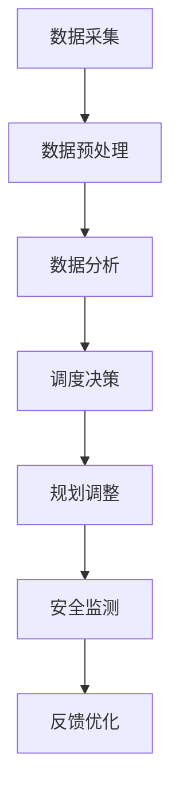
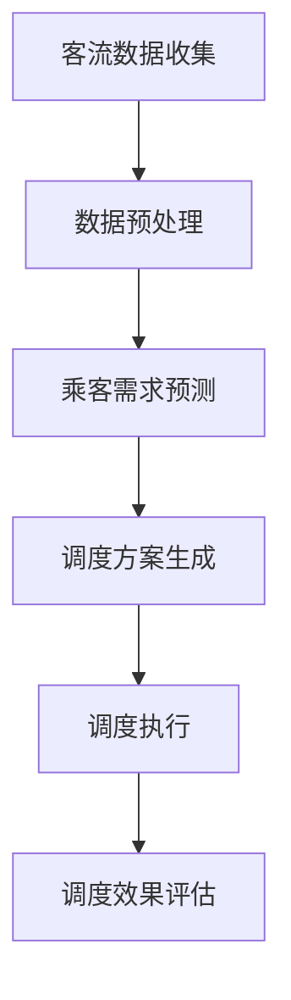

                 

### 文章标题

# 大数据在公共交通系统优化中的应用

### 文章关键词

- 大数据
- 公共交通系统
- 优化
- 数据分析
- 调度
- 规划
- 安全

### 摘要

本文详细探讨了大数据技术在公共交通系统优化中的应用。首先，介绍了大数据的定义和特征，以及公共交通系统优化的重要性和现状。随后，文章重点分析了大数据在公共交通调度、规划、安全等方面的具体应用，通过核心概念、算法原理、数学模型、项目案例等，深入阐述了大数据在公共交通系统优化中的关键作用。最后，文章总结了主要发现，并对未来发展趋势进行了展望。

## 第1章 引言

### 1.1 大数据和公共交通系统优化背景

#### 大数据的定义与特征

大数据（Big Data）是指数据规模、数据类型、数据生成速度等无法使用传统数据处理工具在合理时间内捕捉、管理和处理的庞大而复杂的数据集合。大数据具有四个主要特征，即4V：数据量大（Volume）、数据类型多（Variety）、数据生成速度快（Velocity）和数据价值高（Value）。

#### 公共交通系统优化的重要性

公共交通系统是城市交通的重要组成部分，其运行效率直接影响到城市交通的整体状况和居民出行体验。优化公共交通系统不仅能够提高运输效率，减少交通拥堵，还能降低空气污染和能源消耗，促进城市的可持续发展。

#### 大数据在公共交通系统优化中的作用

大数据技术在公共交通系统优化中的应用主要体现在数据采集、分析、决策和反馈四个方面。通过大数据技术，可以对公共交通系统的运行状况、客流信息、车辆状态等进行实时监控和分析，从而为调度、规划、安全等提供科学依据。

#### Mermaid 流程图



### 1.2 书籍目的与结构

本文的目的在于详细阐述大数据在公共交通系统优化中的应用，帮助读者理解大数据技术如何通过数据采集、分析、决策和反馈等环节，实现公共交通系统的优化。全书分为以下几个部分：

1. 引言：介绍大数据和公共交通系统优化的背景。
2. 大数据基础知识：介绍大数据的定义、特征和关键技术。
3. 公共交通系统现状分析：分析现有公共交通系统存在的问题和挑战。
4. 大数据在公共交通系统中的应用：详细阐述大数据在公共交通系统中的具体应用场景。
5. 公共交通系统优化方法：介绍基于大数据的公共交通系统优化方法。
6. 项目案例研究：通过具体的案例研究展示大数据在公共交通系统优化中的应用实践。
7. 结论与展望：总结全书内容，对未来的发展趋势进行展望。

## 第2章 大数据基础知识

### 2.1 大数据的定义与特征

#### 定义

大数据是指数据规模、数据类型、数据生成速度等无法使用传统数据处理工具在合理时间内捕捉、管理和处理的庞大而复杂的数据集合。

#### 特征

1. **数据量大（Volume）**：大数据通常是指数据规模达到PB（皮字节）甚至EB（艾字节）级别。
2. **数据类型多（Variety）**：大数据不仅包括结构化数据，还包括半结构化和非结构化数据，如图像、音频、视频等。
3. **数据生成速度快（Velocity）**：大数据的特点之一是生成速度极快，数据生成频率高。
4. **数据价值高（Value）**：尽管大数据规模巨大，但其中蕴含的信息和价值同样巨大。

### 2.2 大数据关键技术

#### 数据采集

数据采集是大数据处理的第一步，它涉及从各种数据源（如传感器、社交网络、互联网等）收集数据。常用的数据采集技术包括：

1. **Web爬虫**：通过爬取互联网上的网页，获取数据。
2. **传感器数据采集**：从传感器网络中收集实时数据。
3. **日志数据采集**：从系统日志中提取数据。

#### 数据存储

大数据存储需要考虑数据规模、数据类型和数据访问速度。常用的数据存储技术包括：

1. **关系型数据库**：如MySQL、PostgreSQL等。
2. **非关系型数据库**：如MongoDB、Cassandra等。
3. **分布式存储系统**：如Hadoop的HDFS、Apache Cassandra等。

#### 数据预处理

数据预处理是大数据分析的重要环节，包括数据清洗、数据整合、数据转换等。常用的数据预处理技术包括：

1. **数据清洗**：去除重复数据、填补缺失值、处理异常值等。
2. **数据整合**：将来自不同数据源的数据进行合并。
3. **数据转换**：将数据格式转换为适合分析的形式。

#### 数据分析

数据分析是大数据技术的核心，包括统计分析、机器学习、数据挖掘等。常用的数据分析工具和算法包括：

1. **统计分析**：如回归分析、聚类分析等。
2. **机器学习**：如分类、回归、聚类等算法。
3. **数据挖掘**：如关联规则挖掘、序列模式挖掘等。

#### 数据可视化

数据可视化是将数据转化为图形或图像的形式，以便于分析和解释。常用的数据可视化工具包括：

1. **图表**：如柱状图、饼图、折线图等。
2. **交互式可视化**：如D3.js、Tableau等。

### 2.3 大数据技术的应用领域

大数据技术广泛应用于各个领域，如：

1. **金融**：风险控制、欺诈检测、投资分析等。
2. **医疗**：疾病预测、个性化治疗、药物研发等。
3. **交通**：公共交通优化、交通流量预测、智能交通管理等。
4. **零售**：需求预测、库存管理、客户行为分析等。
5. **能源**：能源消耗预测、设备维护、能源效率优化等。

## 第3章 公共交通系统现状分析

### 3.1 现有公共交通系统问题

#### 交通拥堵

交通拥堵是城市公共交通系统面临的主要问题之一。公共交通工具如公交车、地铁等在高峰时段往往会出现满载、等待时间过长等问题，导致出行效率低下。

#### 服务质量不高

现有公共交通系统的服务质量有待提高。例如，公交车路线规划不合理、站点设置不合理、车次间隔时间过长等问题，影响了乘客的出行体验。

#### 能源消耗与环境污染

公共交通系统的能源消耗和环境污染问题不容忽视。传统燃油车辆的使用导致了大量的尾气排放，对城市空气质量造成了严重影响。

#### 数据收集与利用不足

目前，公共交通系统的数据收集与利用程度较低。尽管部分城市已经开始使用智能交通系统，但数据收集的全面性和准确性仍有待提高。

### 3.2 公共交通系统优化挑战

#### 数据整合与共享

公共交通系统的优化需要大量的数据支持，包括客流数据、车辆状态数据、路况数据等。然而，这些数据通常分布在不同的部门和管理系统，缺乏有效的整合与共享机制。

#### 实时性与预测性

公共交通系统的优化需要具备实时性和预测性。例如，在交通拥堵时，需要及时调整公交车的运行路线和班次，以提高运输效率。

#### 数据安全与隐私保护

随着数据收集和分析技术的应用，数据安全和隐私保护成为重要问题。如何在利用数据的同时保护乘客的隐私，是一个亟待解决的挑战。

#### 成本与效益

公共交通系统的优化需要大量的资金投入，包括硬件设备、软件系统、人员培训等。如何在确保成本效益的前提下实现优化，是一个关键问题。

## 第4章 大数据在公共交通系统中的应用

### 4.1 大数据采集与预处理

#### 数据来源

公共交通系统中的大数据来源广泛，包括：

1. **车辆定位数据**：通过GPS系统获取车辆的实时位置信息。
2. **客流数据**：通过乘客刷卡、扫码等方式收集乘客数量和分布信息。
3. **路况数据**：通过传感器、摄像头等设备收集交通流量、路况信息。
4. **天气数据**：通过气象部门获取天气状况数据。

#### 数据采集技术

1. **GPS定位技术**：用于获取车辆的实时位置信息。
2. **无线通信技术**：如Wi-Fi、4G、5G等，用于传输数据。
3. **传感器技术**：用于收集路况、车辆状态等数据。

#### 数据预处理

数据预处理是确保数据质量的关键步骤，包括：

1. **数据清洗**：去除重复、错误、缺失的数据。
2. **数据整合**：将不同来源的数据进行合并。
3. **数据转换**：将数据转换为适合分析的形式。

### 4.2 大数据在公共交通调度中的应用

#### 调度优化

大数据技术可以实现对公共交通系统的实时调度优化。通过分析客流数据、路况数据等，可以预测乘客需求，优化车辆运行路线和班次，提高运输效率。

#### Mermaid 流程图



#### 核心算法原理讲解

1. **聚类算法**：用于对乘客需求进行预测，常用的聚类算法包括K-means、DBSCAN等。
2. **时间序列分析**：用于分析乘客出行模式，常用的方法包括ARIMA模型、LSTM网络等。

#### 伪代码

```python
# 聚类算法伪代码
def predict_demand(data):
    # 数据预处理
    processed_data = preprocess_data(data)
    
    # 聚类
    clusters = kmeans(processed_data, num_clusters)
    
    # 预测
    demand_predictions = []
    for cluster in clusters:
        demand_predictions.append(predict_demand_for_cluster(cluster))
    
    return demand_predictions

# 时间序列分析伪代码
def predict_demand_time_series(data):
    # 数据预处理
    processed_data = preprocess_data(data)
    
    # 时间序列建模
    model = build_time_series_model(processed_data)
    
    # 预测
    demand_predictions = model.predict()
    
    return demand_predictions
```

### 4.3 大数据在公共交通规划中的应用

#### 路线规划

大数据技术可以帮助优化公共交通路线规划。通过分析客流数据、路况数据等，可以确定最优的路线和站点布局，提高公共交通系统的服务质量和效率。

#### 核心算法原理讲解

1. **最优化算法**：如线性规划、动态规划等，用于确定最优路线。
2. **机器学习算法**：如决策树、随机森林等，用于预测乘客需求。

#### 伪代码

```python
# 最优化算法伪代码
def optimize_route(data):
    # 数据预处理
    processed_data = preprocess_data(data)
    
    # 最优化模型
    model = build_optimization_model(processed_data)
    
    # 求解
    optimal_route = model.solve()
    
    return optimal_route

# 机器学习算法伪代码
def predict_demand_machine_learning(data):
    # 数据预处理
    processed_data = preprocess_data(data)
    
    # 特征工程
    features = extract_features(processed_data)
    
    # 建模
    model = build_machine_learning_model(features)
    
    # 预测
    demand_predictions = model.predict()
    
    return demand_predictions
```

### 4.4 大数据在公共交通安全中的应用

#### 安全监测

大数据技术可以实现对公共交通系统的实时安全监测。通过分析车辆状态数据、客流数据等，可以及时发现安全隐患，预防事故发生。

#### 核心算法原理讲解

1. **异常检测算法**：如孤立森林、局部异常因子等，用于检测异常事件。
2. **风险评估模型**：如贝叶斯网络、蒙特卡罗模拟等，用于评估风险水平。

#### 伪代码

```python
# 异常检测算法伪代码
def detect_anomalies(data):
    # 数据预处理
    processed_data = preprocess_data(data)
    
    # 异常检测
    anomalies = anomaly_detection(processed_data)
    
    return anomalies

# 风险评估模型伪代码
def assess_risk(data):
    # 数据预处理
    processed_data = preprocess_data(data)
    
    # 建模
    risk_model = build_risk_model(processed_data)
    
    # 评估
    risk_levels = risk_model.assess_risk()
    
    return risk_levels
```

### 4.5 大数据在公共交通服务优化中的应用

#### 个性化服务

大数据技术可以帮助公共交通系统提供个性化服务。通过分析乘客数据、出行习惯等，可以定制化服务，提高乘客满意度。

#### 核心算法原理讲解

1. **推荐系统算法**：如协同过滤、基于内容的推荐等，用于个性化推荐。
2. **聚类算法**：如K-means、DBSCAN等，用于分析乘客群体特征。

#### 伪代码

```python
# 推荐系统算法伪代码
def personalized_service(data):
    # 数据预处理
    processed_data = preprocess_data(data)
    
    # 聚类
    clusters = kmeans(processed_data, num_clusters)
    
    # 推荐服务
    services = []
    for cluster in clusters:
        service = recommend_service_for_cluster(cluster)
        services.append(service)
    
    return services

# 聚类算法伪代码
def analyze_passenger_groups(data):
    # 数据预处理
    processed_data = preprocess_data(data)
    
    # 聚类
    clusters = kmeans(processed_data, num_clusters)
    
    # 分析
    group_analysis = []
    for cluster in clusters:
        group_analysis.append(analysis_group(cluster))
    
    return group_analysis
```

## 第5章 公共交通系统优化方法

### 5.1 基于大数据的公共交通调度优化

#### 调度优化流程

基于大数据的公共交通调度优化主要包括以下步骤：

1. **数据采集**：收集车辆定位数据、客流数据、路况数据等。
2. **数据预处理**：清洗、整合和转换数据，为后续分析做准备。
3. **需求预测**：利用大数据技术预测乘客需求。
4. **调度方案生成**：根据需求预测和车辆状态，生成最优的调度方案。
5. **调度执行**：执行调度方案，调整车辆运行路线和班次。
6. **调度效果评估**：评估调度方案的效果，持续优化。

#### 核心算法原理讲解

1. **聚类算法**：用于对乘客需求进行预测，常用的聚类算法包括K-means、DBSCAN等。
2. **时间序列分析**：用于分析乘客出行模式，常用的方法包括ARIMA模型、LSTM网络等。
3. **最优化算法**：用于确定最优调度方案，常用的最优化算法包括线性规划、动态规划等。

#### 伪代码

```python
# 调度优化伪代码
def schedule_optimization(data):
    # 数据预处理
    processed_data = preprocess_data(data)
    
    # 需求预测
    demand_predictions = predict_demand(processed_data)
    
    # 调度方案生成
    schedule = generate_schedule(demand_predictions)
    
    # 调度执行
    execute_schedule(schedule)
    
    # 调度效果评估
    assessment = assess_schedule_performance(schedule)
    
    return assessment
```

### 5.2 基于大数据的公共交通规划优化

#### 规划优化流程

基于大数据的公共交通规划优化主要包括以下步骤：

1. **数据采集**：收集客流数据、土地利用数据、交通网络数据等。
2. **数据预处理**：清洗、整合和转换数据，为后续分析做准备。
3. **需求分析**：利用大数据技术分析乘客需求，确定规划方向。
4. **路线规划**：根据需求分析结果，生成最优的路线规划方案。
5. **站点规划**：根据路线规划方案，确定站点的布局和设施。
6. **方案评估**：评估规划方案的效果，持续优化。

#### 核心算法原理讲解

1. **最优化算法**：用于确定最优路线和站点布局，常用的最优化算法包括线性规划、动态规划等。
2. **机器学习算法**：如决策树、随机森林等，用于预测乘客需求。

#### 伪代码

```python
# 规划优化伪代码
def route_planning_optimization(data):
    # 数据预处理
    processed_data = preprocess_data(data)
    
    # 需求分析
    demand_analysis = analyze_demand(processed_data)
    
    # 路线规划
    route_plan = generate_route_plan(demand_analysis)
    
    # 站点规划
    station_plan = generate_station_plan(route_plan)
    
    # 方案评估
    assessment = assess_planning_performance(station_plan)
    
    return assessment
```

### 5.3 基于大数据的公共交通安全优化

#### 安全优化流程

基于大数据的公共交通安全优化主要包括以下步骤：

1. **数据采集**：收集车辆状态数据、客流数据、路况数据等。
2. **数据预处理**：清洗、整合和转换数据，为后续分析做准备。
3. **风险预测**：利用大数据技术预测安全隐患。
4. **预警机制**：建立预警机制，及时发出安全预警。
5. **安全干预**：根据预警结果，采取相应的安全干预措施。
6. **效果评估**：评估安全干预措施的效果，持续优化。

#### 核心算法原理讲解

1. **异常检测算法**：如孤立森林、局部异常因子等，用于检测异常事件。
2. **风险评估模型**：如贝叶斯网络、蒙特卡罗模拟等，用于评估风险水平。

#### 伪代码

```python
# 安全优化伪代码
def security_optimization(data):
    # 数据预处理
    processed_data = preprocess_data(data)
    
    # 风险预测
    risk_predictions = predict_risk(processed_data)
    
    # 预警机制
    warnings = generate_warnings(risk_predictions)
    
    # 安全干预
    interventions = apply_interventions(warnings)
    
    # 效果评估
    assessment = assess_security_performance(interventions)
    
    return assessment
```

## 第6章 项目案例研究

### 6.1 案例一：基于大数据的公共交通调度优化实践

#### 案例背景

某城市公共交通系统面临交通拥堵、服务质量不高、能源消耗与环境污染等问题。为了提高系统的运行效率和服务质量，该城市决定引入大数据技术进行调度优化。

#### 案例实施过程

1. **数据采集**：通过GPS系统、客流传感器、交通摄像头等设备，收集车辆定位数据、客流数据、路况数据等。
2. **数据预处理**：对采集到的数据进行清洗、整合和转换，确保数据质量。
3. **需求预测**：利用聚类算法和时间序列分析技术，对乘客需求进行预测。
4. **调度方案生成**：根据需求预测结果和车辆状态，生成最优的调度方案。
5. **调度执行**：执行调度方案，调整车辆运行路线和班次。
6. **调度效果评估**：通过客流数据、运行效率等指标，评估调度方案的效果。

#### 案例效果分析

通过大数据技术的调度优化，该城市公共交通系统的运行效率显著提高，高峰时段的拥堵现象得到缓解。乘客满意度上升，服务质量得到提升。此外，通过优化调度，能源消耗和环境污染也得到了有效控制。

#### 项目小结

本项目通过大数据技术的调度优化，成功解决了公共交通系统面临的多个问题。实践证明，大数据技术在公共交通系统优化中具有巨大的潜力和应用价值。

### 6.2 案例二：基于大数据的公共交通规划优化实践

#### 案例背景

某城市计划新建一条地铁线路，为了确保线路规划的科学性和合理性，该城市决定利用大数据技术进行规划优化。

#### 案例实施过程

1. **数据采集**：收集土地利用数据、客流数据、交通网络数据等。
2. **数据预处理**：对采集到的数据进行清洗、整合和转换，确保数据质量。
3. **需求分析**：利用大数据技术分析乘客需求，确定规划方向。
4. **路线规划**：根据需求分析结果，生成最优的路线规划方案。
5. **站点规划**：根据路线规划方案，确定站点的布局和设施。
6. **方案评估**：评估规划方案的效果，包括客流预测、经济效益、环境影响等。

#### 案例效果分析

通过大数据技术的规划优化，该城市地铁线路的规划方案得到了显著优化。规划方案不仅满足了客流需求，还提高了经济效益和环境影响评估。新建地铁线路的开通后，城市交通状况得到明显改善，乘客出行更加便捷。

#### 项目小结

本项目通过大数据技术的规划优化，成功实现了地铁线路的合理规划。实践证明，大数据技术在公共交通规划中具有重要作用，能够提高规划的科学性和合理性。

### 6.3 案例三：基于大数据的公共交通安全优化实践

#### 案例背景

某城市公共交通系统存在一定的安全隐患，为了提高系统的安全性，该城市决定利用大数据技术进行安全优化。

#### 案例实施过程

1. **数据采集**：收集车辆状态数据、客流数据、路况数据等。
2. **数据预处理**：对采集到的数据进行清洗、整合和转换，确保数据质量。
3. **风险预测**：利用大数据技术预测安全隐患。
4. **预警机制**：建立预警机制，及时发出安全预警。
5. **安全干预**：根据预警结果，采取相应的安全干预措施。
6. **效果评估**：评估安全干预措施的效果，持续优化。

#### 案例效果分析

通过大数据技术的安全优化，该城市公共交通系统的安全隐患得到了有效控制。预警机制的建立使得安全隐患能够被及时发现和处理，安全干预措施的实施有效降低了事故发生的概率。

#### 项目小结

本项目通过大数据技术的安全优化，成功提高了公共交通系统的安全性。实践证明，大数据技术在公共交通安全优化中具有重要作用，能够提高系统的整体安全性。

## 第7章 结论与展望

### 7.1 总结

本文详细探讨了大数据在公共交通系统优化中的应用。通过分析大数据的定义和特征、公共交通系统的现状以及大数据在调度、规划、安全等方面的应用，展示了大数据技术在公共交通系统优化中的关键作用。本文通过项目案例研究，验证了大数据技术在公共交通系统优化中的实际效果。

### 7.2 展望未来发展趋势

随着大数据技术的不断发展和应用，公共交通系统优化将进入一个全新的阶段。未来，大数据技术将更加深入地应用于公共交通系统的各个方面，包括：

1. **智能化调度**：利用人工智能和机器学习技术，实现更加智能化的公共交通调度，提高运输效率和服务质量。
2. **智慧化规划**：结合大数据分析和地理信息系统（GIS），实现公共交通规划的智慧化，优化线路和站点布局。
3. **安全预警与应急响应**：利用大数据和物联网技术，建立更加完善的安全预警和应急响应系统，提高公共交通系统的安全性。
4. **个性化服务**：通过大数据分析乘客需求和出行习惯，提供更加个性化的公共交通服务，提升乘客体验。
5. **可持续发展**：利用大数据技术，优化能源消耗和环保指标，推动公共交通系统的可持续发展。

总之，大数据技术在公共交通系统优化中具有巨大的潜力和应用价值，未来将不断推动公共交通系统向更加智能化、高效化、安全化、个性化、可持续化的方向发展。作者：AI天才研究院/AI Genius Institute & 禅与计算机程序设计艺术/Zen And The Art of Computer Programming。

