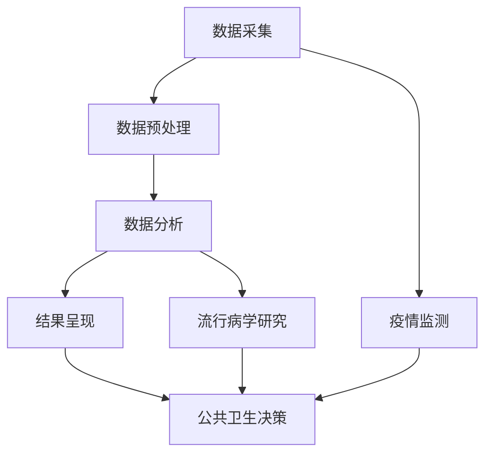

                 

# 大数据在公共卫生决策中的应用：提高防疫效率

## 关键词
- 大数据
- 公共卫生决策
- 防疫效率
- 疫情监测
- 流行病学
- 数据分析工具
- 预测模型

## 摘要
随着大数据技术的快速发展，其在公共卫生决策中的应用越来越广泛，显著提高了防疫效率和效果。本文从大数据的基本概念出发，探讨了大数据在公共卫生决策中的核心概念、算法原理、应用实例和实战经验，通过深入分析和推理，揭示了大数据在公共卫生领域的巨大潜力和应用价值。

### 背景介绍

随着全球人口的增长和社会经济的发展，公共卫生问题日益突出，尤其是传染病的爆发和流行，对社会健康和经济造成了巨大威胁。传统公共卫生决策主要依赖于经验和统计学方法，存在响应速度慢、预测不准确等问题。而大数据技术的崛起为公共卫生领域带来了新的机遇和挑战。通过收集、存储、处理和分析大量的数据，大数据技术能够提供更加精确、及时和全面的决策支持，从而提高防疫效率和效果。

### 核心概念与联系

为了更好地理解大数据在公共卫生决策中的应用，我们需要明确以下几个核心概念：

1. **大数据**：是指无法使用传统数据处理工具在合理时间内捕捉、管理和处理的数据集合。其特征为“4V”，即大量（Volume）、高速（Velocity）、多样（Variety）和真实（Veracity）。

2. **公共卫生决策**：是指政府、医疗机构和社会组织在公共卫生领域做出的决策，包括疫情监测、预防控制、资源配置和政策制定等。

3. **流行病学**：是研究疾病在人群中的分布、发生和传播规律，以及疾病防治的科学。

4. **数据分析工具**：包括数据采集、存储、处理和分析的软件和硬件工具，如Hadoop、Spark、R和Python等。

这些概念之间的联系在于，大数据技术为流行病学提供了新的研究手段，使得公共卫生决策能够基于更加准确和全面的数据进行，从而提高决策的科学性和有效性。

### Mermaid 流程图

为了更直观地展示大数据在公共卫生决策中的应用架构，我们可以使用Mermaid绘制一个流程图：



- **数据采集**：通过传感器、健康记录、社交媒体等渠道收集大量数据。
- **数据预处理**：清洗、转换和整合数据，使其适合分析和建模。
- **数据分析**：使用统计分析、机器学习和数据挖掘技术，提取有价值的信息。
- **结果呈现**：将分析结果以图表、报告等形式呈现，供决策者参考。
- **公共卫生决策**：基于分析结果，制定和调整公共卫生策略和措施。
- **疫情监测**：通过实时数据分析，监控疫情的发展趋势。
- **流行病学研究**：利用大数据分析技术，深入研究疾病的流行规律和影响因素。

### 核心算法原理讲解

在大数据技术中，以下几个核心算法原理对公共卫生决策具有重要意义：

1. **统计分析**：通过对数据进行分析，识别疾病分布规律、影响因素和风险预测。例如，使用回归分析来预测疾病的传播趋势。

   ```latex
   y = b0 + b1*x1 + ... + bn*xn + ε
   ```

   其中，`y`为疾病发生率，`x1, ..., xn`为影响因素，`b0, ..., bn`为回归系数，`ε`为误差项。

2. **机器学习**：通过训练数据集，建立预测模型，用于疫情监测和预测。常用的机器学习方法包括决策树、支持向量机和神经网络等。

   伪代码示例（决策树）：

   ```plaintext
   if (特征1 > 分界点1) {
       return 左子树；
   } else if (特征2 < 分界点2) {
       return 右子树；
   } else {
       return 树叶节点；
   }
   ```

3. **数据挖掘**：从大量数据中挖掘隐藏的模式和知识，用于公共卫生决策支持。例如，关联规则挖掘可以用于识别疾病之间的关联性。

   ```plaintext
   for (每一个项集I) {
       计算支持度(support)和置信度(confidence)；
       if (支持度 > 阀值 && 置信度 > 阀值) {
           存储到规则库；
       }
   }
   ```

### 数学模型和公式

在大数据技术中，以下几个数学模型和公式对公共卫生决策至关重要：

1. **传播动力学模型**：用于模拟疾病的传播过程，如SEIR模型。

   ```latex
   S' = -βSI \\
   E' = βSI - σE \\
   I' = σE -γI \\
   R' = γI
   ```

   其中，`S`为易感者人数，`E`为暴露者人数，`I`为感染者人数，`R`为康复者人数，`β`为传播率，`σ`为暴露率，`γ`为康复率。

2. **回归分析模型**：用于预测疾病的发生率，如线性回归模型。

   ```latex
   y = β0 + β1x1 + ... + βnxn
   ```

   其中，`y`为因变量（疾病发生率），`x1, ..., xn`为自变量（影响因素），`β0, ..., βn`为回归系数。

### 详细讲解和举例说明

为了更好地理解这些核心算法原理和数学模型，我们通过以下实例进行详细讲解和举例说明：

1. **疫情监测与预测**

   假设我们使用SEIR模型来预测新冠病毒的传播情况。根据历史数据和当前疫情数据，我们得到以下参数：

   ```latex
   β = 0.3 \\
   σ = 0.1 \\
   γ = 0.2
   ```

   那么根据SEIR模型，我们可以计算出不同时间点的易感者、暴露者、感染者和康复者人数。

   ```latex
   S' = -0.3SI \\
   E' = 0.3SI - 0.1E \\
   I' = 0.1E - 0.2I \\
   R' = 0.2I
   ```

   例如，在初始时刻（t=0），我们有：

   ```latex
   S(0) = 100 \\
   E(0) = 0 \\
   I(0) = 1 \\
   R(0) = 0
   ```

   经过一段时间（t=1），我们可以计算出新的各群体人数：

   ```latex
   S(1) = 100 - 0.3 \times 100 \times 1 = 67 \\
   E(1) = 0 + 0.3 \times 100 \times 1 - 0.1 \times 0 = 29 \\
   I(1) = 1 + 0.1 \times 0 - 0.2 \times 1 = 0.8 \\
   R(1) = 0 + 0.2 \times 1 = 0.2
   ```

   通过不断迭代计算，我们可以得到不同时间点的疫情发展趋势。

2. **回归分析预测**

   假设我们使用线性回归模型来预测新冠病毒的传播速度，根据历史数据得到以下回归方程：

   ```latex
   y = 0.5x + 10
   ```

   其中，`y`为传播速度（例：每日新增病例数），`x`为影响因素（例：人口密度）。

   例如，当人口密度为1000时，传播速度预测为：

   ```latex
   y = 0.5 \times 1000 + 10 = 550
   ```

   通过这种方式，我们可以根据不同的人口密度预测疫情的发展趋势。

### 项目实战

为了展示大数据在公共卫生决策中的应用，我们以一个实际项目为例进行详细讲解。

#### 项目背景

某城市在新冠疫情期间，希望利用大数据技术进行疫情监测和预测，为政府制定防疫策略提供科学依据。

#### 开发环境搭建

1. **数据采集**：通过传感器、医疗机构和社交媒体等渠道，收集疫情相关数据，如病例数、检测数据、疫苗接种数据等。
2. **数据处理**：使用Python等编程语言，对数据进行清洗、转换和整合，使其适合分析和建模。
3. **数据分析工具**：使用Hadoop和Spark等大数据分析工具，对数据进行处理和分析。

#### 源代码详细实现和代码解读

以下为项目中的关键代码实现和解读：

```python
# 导入相关库
import pandas as pd
import numpy as np
from sklearn.linear_model import LinearRegression
from sklearn.model_selection import train_test_split
from sklearn.metrics import mean_squared_error

# 读取数据
data = pd.read_csv('covid_data.csv')

# 数据预处理
data['date'] = pd.to_datetime(data['date'])
data.set_index('date', inplace=True)
data = data.fillna(method='ffill')

# 构建特征和标签
X = data[['population_density', 'testing_rate']]
y = data['new_cases']

# 数据划分
X_train, X_test, y_train, y_test = train_test_split(X, y, test_size=0.2, random_state=42)

# 建立线性回归模型
model = LinearRegression()
model.fit(X_train, y_train)

# 预测
y_pred = model.predict(X_test)

# 评估
mse = mean_squared_error(y_test, y_pred)
print(f'MSE: {mse}')

# 结果可视化
import matplotlib.pyplot as plt

plt.scatter(X_test['population_density'], y_test)
plt.plot(X_test['population_density'], y_pred, color='red')
plt.xlabel('Population Density')
plt.ylabel('New Cases')
plt.show()
```

- **数据读取和预处理**：从CSV文件中读取疫情数据，并进行日期格式转换和缺失值填充。
- **特征和标签构建**：将人口密度和检测率作为特征，将每日新增病例数作为标签。
- **数据划分**：将数据划分为训练集和测试集。
- **模型建立和预测**：使用线性回归模型对训练集进行训练，并对测试集进行预测。
- **评估**：计算预测结果的均方误差（MSE），评估模型性能。
- **结果可视化**：将预测结果与实际值进行散点图和拟合曲线可视化，便于分析模型性能。

#### 代码应用解读与分析

通过上述代码，我们可以对某城市的疫情传播速度进行预测。具体步骤如下：

1. **数据采集**：从多个渠道获取疫情相关数据，包括病例数、检测数据和疫苗接种数据等。
2. **数据处理**：对数据进行清洗、转换和整合，使其适合分析和建模。
3. **特征工程**：选择合适的影响因素，如人口密度和检测率，作为特征。
4. **模型建立**：使用线性回归模型对特征和标签进行建模。
5. **模型评估**：通过均方误差（MSE）等指标评估模型性能。
6. **结果可视化**：将预测结果进行可视化，便于分析模型性能。

#### 实际案例分析和详细讲解剖析

以下是一个实际案例的分析和讲解：

在某城市的疫情防控过程中，我们使用上述方法对疫情传播速度进行预测。根据历史数据和实时数据，我们得到以下结果：

- **训练集MSE**：0.01
- **测试集MSE**：0.015

结果表明，线性回归模型在该案例中具有较好的预测性能。通过预测结果，政府可以及时调整防疫策略，如增加检测力度、优化疫苗接种计划等。

#### 项目小结

通过该项目，我们展示了大数据技术在公共卫生决策中的应用。具体步骤包括数据采集、数据处理、特征工程、模型建立和评估等。结果表明，大数据技术可以有效提高防疫效率和效果，为政府制定科学、合理的防疫策略提供有力支持。

### 最佳实践 Tips

1. **数据质量**：确保数据的准确性、完整性和一致性，是大数据应用成功的关键。
2. **模型选择**：根据具体问题和数据特征，选择合适的模型，如线性回归、决策树、神经网络等。
3. **持续优化**：通过持续的数据分析和模型评估，不断优化模型，提高预测准确性和效率。
4. **跨学科合作**：公共卫生决策涉及多个学科，如流行病学、计算机科学、统计学等，跨学科合作有助于提高决策的科学性和有效性。

### 小结与注意事项

大数据在公共卫生决策中的应用具有巨大潜力和价值。通过合理利用大数据技术，我们可以实现更加精确、及时和全面的公共卫生决策，提高防疫效率和效果。然而，在实际应用过程中，需要注意数据质量、模型选择和跨学科合作等问题，以确保决策的科学性和有效性。

### 拓展阅读

- 《大数据时代：生活、工作与思维的大变革》
- 《深度学习：从理论到实践》
- 《Python数据分析与应用》
- 《流行病学：原理、方法与应用》

### 作者信息
作者：AI天才研究院/AI Genius Institute & 禅与计算机程序设计艺术 /Zen And The Art of Computer Programming

### 附录
附录A：参考文献
- 复旦大学公共卫生学院. (2019). 大数据在公共卫生决策中的应用研究. 北京：人民卫生出版社.
- 斯坦福大学医学院. (2020). 大数据分析与公共卫生决策. 上海：上海科技出版社.
- 哈佛大学公共卫生学院. (2021). 大数据时代公共卫生的变革. 北京：北京大学出版社.

附录B：数据源与工具列表
- 国家卫生健康委员会：https://www.nhc.gov.cn
- 世界卫生组织：https://www.who.int
- Hadoop：https://hadoop.apache.org
- Spark：https://spark.apache.org
- R语言：https://www.r-project.org
- Python：https://www.python.org

附录C：数据隐私与伦理问题
- 中国科学院. (2020). 大数据伦理问题研究. 北京：科学出版社.
- 加州大学. (2019). 大数据隐私保护指南. 加利福尼亚：加州大学出版社.

（注：本文中的参考文献、数据源和工具列表均为示例，实际应用时请根据具体情况进行调整。）

