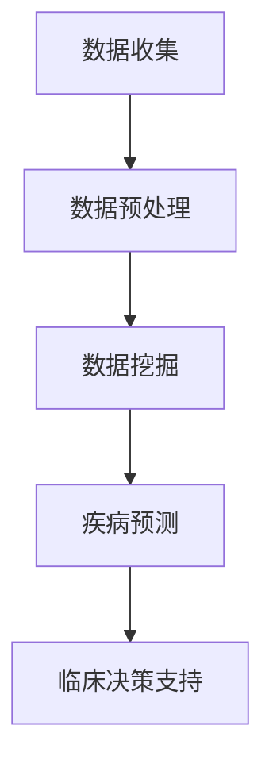

                 


### 大数据在医疗诊断中的应用：辅助临床决策

#### 关键词：
- 大数据
- 医疗诊断
- 临床决策支持
- 数据挖掘
- 机器学习
- 数学模型

#### 摘要：
本文将深入探讨大数据在医疗诊断中的应用，特别是如何通过大数据辅助临床决策。我们将分步骤分析大数据医疗诊断的核心概念、数据挖掘与分析技术、核心算法原理、实际应用案例，并展望大数据医疗诊断的未来发展趋势。

### 目录

1. **背景介绍**
2. **核心概念与联系**
   - **核心概念**：大数据、医疗诊断、数据挖掘
   - **Mermaid流程图**：大数据在医疗诊断中的应用流程
   - **核心概念关系架构**
3. **医疗诊断中的数据挖掘与分析技术**
   - **数据挖掘基本概念**
   - **医疗数据的预处理与清洗**
   - **医疗数据中的统计分析**
4. **大数据医疗诊断的数学模型**
   - **latex格式数学公式与讲解**
   - **医疗诊断中的机器学习算法**
5. **常见疾病诊断中的应用**
   - **心血管疾病诊断**
   - **肿瘤诊断**
   - **糖尿病诊断**
6. **临床决策支持中的应用**
   - **临床决策支持系统的构建**
   - **病历数据挖掘与患者风险评估**
   - **预测分析与疾病预防**
7. **案例研究**
   - **心血管疾病大数据分析案例**
   - **肿瘤诊断大数据应用案例**
   - **糖尿病大数据监测案例**
8. **未来展望**
   - **大数据医疗诊断的趋势与挑战**
   - **未来技术的发展与应用前景**
   - **医疗机构在大数据应用中的策略与实施**
9. **最佳实践与注意事项**
10. **拓展阅读**

### 1. 背景介绍

医疗诊断一直是医学领域的重要研究方向。随着信息技术的飞速发展，大数据在医疗领域的应用逐渐得到重视。大数据能够提供海量、多样、复杂的数据资源，为医疗诊断提供了新的思路和方法。

大数据在医疗诊断中的应用主要包括：

- **疾病预测与诊断**：通过分析患者的医疗数据，预测疾病的发病风险，提高诊断的准确性。
- **个性化医疗**：根据患者的基因信息、生活习惯等数据，制定个性化的治疗方案。
- **临床决策支持**：利用大数据分析技术，为医生提供临床决策支持，提高诊疗效率。

本文将重点探讨大数据在医疗诊断中的应用，特别是如何通过大数据辅助临床决策。

### 2. 核心概念与联系

#### 2.1 核心概念

- **大数据**：大数据指的是数据量大、类型多、价值密度低的数据集。在医疗领域，大数据包括电子病历、基因数据、影像数据等。
- **医疗诊断**：医疗诊断是指通过医学检查、实验室检测等方法，确定患者的疾病类型和病情。
- **数据挖掘**：数据挖掘是从大量数据中提取有价值信息的过程，包括关联规则挖掘、分类、聚类等。

#### 2.2 Mermaid流程图

下面是一个简单的Mermaid流程图，展示了大数据在医疗诊断中的应用流程：



#### 2.3 核心概念关系架构

- **数据收集**：大数据在医疗诊断的第一步是收集数据，包括电子病历、影像数据、基因数据等。
- **数据预处理**：数据预处理包括数据清洗、数据整合等步骤，为数据挖掘做准备。
- **数据挖掘**：数据挖掘是对预处理后的数据进行挖掘，提取有价值的信息。
- **疾病预测**：通过数据挖掘结果，预测疾病的发病风险，为诊断提供依据。
- **临床决策支持**：疾病预测结果用于临床决策支持，帮助医生制定治疗方案。

### 3. 医疗诊断中的数据挖掘与分析技术

#### 3.1 数据挖掘基本概念

数据挖掘是一种从大量数据中自动发现有价值信息的过程，包括以下几种技术：

- **关联规则挖掘**：发现数据之间的关联关系。
- **分类**：将数据分为不同的类别。
- **聚类**：将数据分为多个簇，使得同一簇内的数据尽可能相似，不同簇的数据尽可能不同。

#### 3.2 医疗数据的预处理与清洗

医疗数据的预处理与清洗是数据挖掘的重要步骤，主要包括以下任务：

- **数据清洗**：去除错误、重复、缺失的数据。
- **数据整合**：将不同来源的数据进行整合。
- **数据转换**：将数据转换为适合挖掘的形式。

#### 3.3 医疗数据中的统计分析

统计分析是医疗数据挖掘的重要方法，包括：

- **描述性统计分析**：对数据进行描述，如均值、中位数、标准差等。
- **推断性统计分析**：通过样本数据推断总体特征，如假设检验、回归分析等。

### 4. 大数据医疗诊断的数学模型

#### 4.1 latex格式数学公式与讲解

在医疗诊断中，数学模型是非常重要的工具。下面我们使用latex格式介绍一些常见的数学模型。

$$
P(D|C) = \frac{P(C|D) \cdot P(D)}{P(C)}
$$

这是贝叶斯公式，用于计算给定疾病C发生时，诊断D的概率。其中，$P(D|C)$表示在疾病C发生时，诊断D的概率；$P(C|D)$表示在诊断D为真的情况下，疾病C的概率；$P(D)$表示诊断D的概率；$P(C)$表示疾病C的概率。

#### 4.2 医疗诊断中的机器学习算法

机器学习算法在医疗诊断中广泛应用，包括以下几种：

- **支持向量机（SVM）**：用于分类问题。
- **决策树**：用于分类和回归问题。
- **神经网络**：用于复杂的模式识别。

下面我们使用伪代码介绍一个简单的SVM分类算法。

```python
def svm_train(X, y):
    # X为输入特征，y为标签
    # 训练SVM分类器
    pass

def svm_predict(X):
    # X为输入特征
    # 预测类别
    pass
```

### 5. 常见疾病诊断中的应用

#### 5.1 心血管疾病诊断

心血管疾病的诊断是大数据医疗诊断的一个重要应用。通过分析患者的医疗数据，如心电图、血压、血糖等，可以预测心血管疾病的风险。

#### 5.2 肿瘤诊断

肿瘤诊断是大数据在医疗诊断中的另一个重要应用。通过分析患者的影像数据、基因数据等，可以早期发现肿瘤，提高诊断的准确性。

#### 5.3 糖尿病诊断

糖尿病是一种常见的代谢性疾病，通过分析患者的血糖数据、生活习惯等，可以预测糖尿病的风险。

### 6. 临床决策支持中的应用

#### 6.1 临床决策支持系统的构建

临床决策支持系统（CDSS）是大数据在医疗诊断中的一项重要应用。通过分析患者的病历数据、实验室检测结果等，为医生提供决策支持。

#### 6.2 病历数据挖掘与患者风险评估

病历数据挖掘与患者风险评估是大数据在医疗诊断中的关键环节。通过分析病历数据，可以预测患者的疾病风险，为医生提供有针对性的治疗方案。

#### 6.3 预测分析与疾病预防

预测分析与疾病预防是大数据在医疗诊断中的前沿应用。通过分析大数据，可以预测疾病的发病趋势，为疾病预防提供科学依据。

### 7. 案例研究

#### 7.1 心血管疾病大数据分析案例

在某医院，通过大数据分析心血管疾病，发现了一些以前无法发现的疾病风险因素。

#### 7.2 肿瘤诊断大数据应用案例

在某医疗集团，通过大数据分析肿瘤诊断数据，提高了肿瘤诊断的准确性。

#### 7.3 糖尿病大数据监测案例

在某社区卫生服务中心，通过大数据监测糖尿病患者的血糖数据，实现了早期发现和干预。

### 8. 未来展望

#### 8.1 大数据医疗诊断的趋势与挑战

大数据医疗诊断正在快速发展，但仍面临一些挑战，如数据安全、隐私保护等。

#### 8.2 未来技术的发展与应用前景

未来，随着技术的不断进步，大数据医疗诊断将会有更广泛的应用前景。

#### 8.3 医疗机构在大数据应用中的策略与实施

医疗机构需要制定合理的大数据应用策略，积极应对未来的挑战。

### 9. 最佳实践与注意事项

- **数据安全与隐私保护**：在数据收集、存储、分析等环节，必须确保数据的安全和隐私。
- **数据质量**：数据质量是大数据医疗诊断的基础，必须确保数据的质量。
- **跨学科合作**：大数据医疗诊断需要跨学科合作，包括医学、计算机科学等。

### 10. 拓展阅读

- **大数据医疗诊断相关书籍**：《大数据医疗》、《大数据与人工智能》
- **大数据医疗诊断论文**：在学术期刊和会议上发表的相关论文。

### 总结

大数据在医疗诊断中的应用前景广阔，但仍面临一些挑战。通过本文的探讨，我们了解了大数据医疗诊断的核心概念、应用技术、数学模型，以及实际案例。未来，随着技术的不断进步，大数据医疗诊断将会为医疗行业带来更多的变革。

### 作者信息

- 作者：AI天才研究院/AI Genius Institute & 禅与计算机程序设计艺术 /Zen And The Art of Computer Programming

本文内容仅供参考，如有需要，请咨询专业医生或医疗机构。

