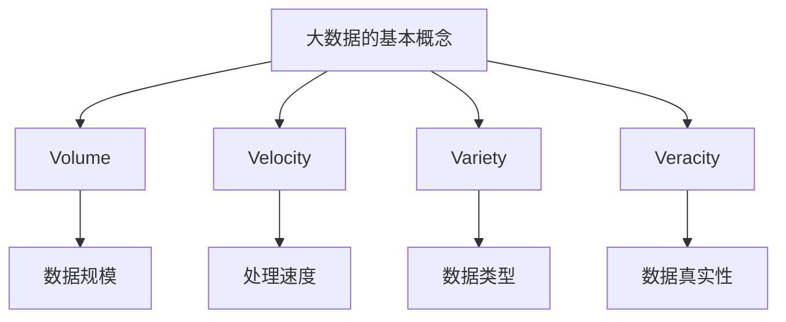
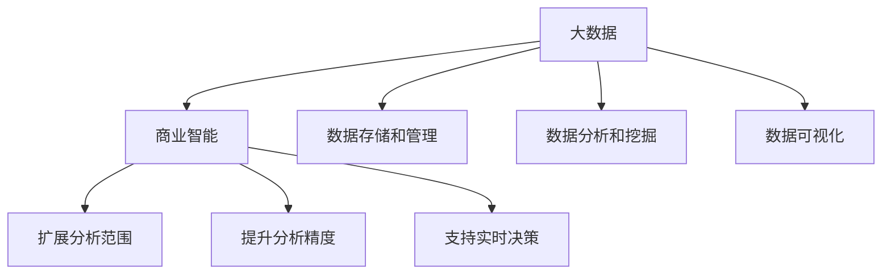
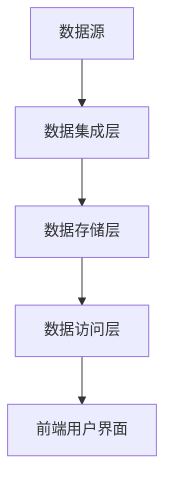
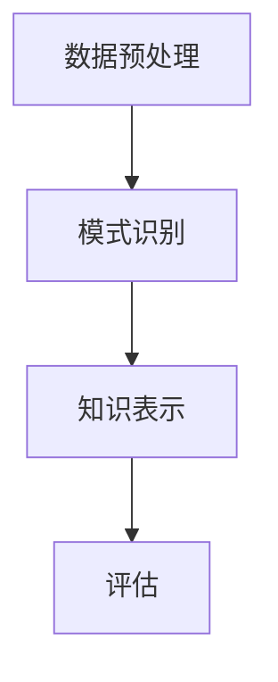
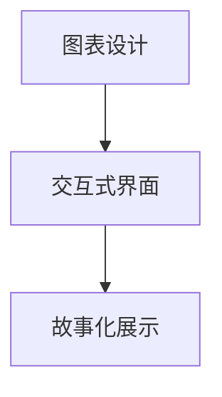
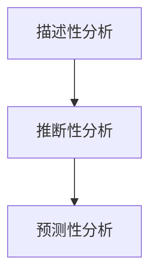
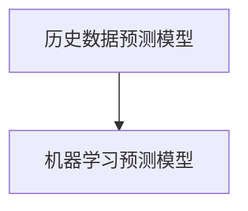
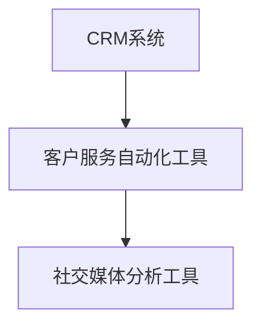

                 

### 大数据在商业智能中的作用:辅助决策与预测

## 关键词

- 大数据
- 商业智能
- 数据仓库
- 数据挖掘
- 数据可视化
- 决策支持系统

## 摘要

本文将探讨大数据在商业智能中的应用，特别是其在辅助决策与预测方面的作用。通过分析大数据的基础知识、核心算法原理以及实际案例，我们将揭示大数据如何帮助企业优化业务流程、提高决策效率和市场竞争力。本文旨在为读者提供一个全面、深入的视角，帮助理解大数据在商业智能领域的价值与潜力。

## 第一部分：大数据与商业智能基础

### 第1章：大数据概述

#### 1.1 大数据的基本概念

大数据（Big Data）是指无法使用传统数据库软件工具在合理时间内捕捉、管理和处理的大量数据集。通常，大数据具有四个V特点：Volume（数据量巨大）、Velocity（处理速度快）、Variety（数据类型多样）和Veracity（数据真实性高）。大数据的来源广泛，包括社交媒体、传感器、物联网设备、电子商务平台等。

**数据定义**：数据是信息的载体，是经过收集、整理和存储的原始事实或观察结果。

**数据类型**：数据类型可分为结构化数据（如关系型数据库中的数据）、半结构化数据（如XML、JSON等）和非结构化数据（如图像、音频、视频等）。

**数据源**：数据源是指数据的产生者，包括用户生成内容、企业内部数据、第三方数据提供商等。

#### 1.2 商业智能简介

**商业智能的定义**：商业智能（Business Intelligence，BI）是一种通过数据分析、数据挖掘和可视化技术来支持企业决策的管理信息系统。

**商业智能的发展历程**：商业智能起源于20世纪80年代的数据仓库技术，随后经历了数据挖掘、在线分析处理（OLAP）和数据可视化等阶段。

**商业智能的价值**：商业智能能够帮助企业：

1. **发现业务机会**：通过数据分析和预测，发现潜在的业务增长点。
2. **优化业务流程**：通过数据监控和性能分析，优化业务流程和资源分配。
3. **提高决策效率**：通过提供实时数据和分析报告，帮助管理层做出更快速、更准确的决策。
4. **提升市场竞争力**：通过深入的数据分析和市场洞察，提高企业在竞争中的地位。

#### 1.3 大数据与商业智能的关系

**大数据对商业智能的影响**：大数据的出现改变了商业智能的格局，使其从传统的报表和分析工具转变为复杂的数据挖掘和实时决策支持系统。大数据的规模和速度要求商业智能系统具备更高的性能和处理能力。

**商业智能对大数据的需求**：商业智能技术需要处理大量的数据，包括实时数据和历史数据。同时，商业智能系统需要具备强大的数据处理和分析能力，以提取有价值的信息和洞察。

### 第2章：商业智能关键技术

#### 2.1 数据仓库

**数据仓库的定义**：数据仓库（Data Warehouse，DW）是一种用于存储、管理和分析大量数据的数据库系统。它通常包含历史数据，并采用特定的数据模型（如星型模型、雪花模型）来优化数据查询和分析。

**数据仓库的架构**：数据仓库的架构通常包括数据源、数据集成层、数据存储层、数据访问层和前端用户界面。

**数据仓库的设计原则**：

1. **一致性**：确保数据在不同系统之间的统一性和一致性。
2. **完整性**：确保数据仓库中的数据是完整和准确的。
3. **灵活性**：设计灵活，能够适应未来的数据变化和扩展需求。

#### 2.2 数据挖掘

**数据挖掘的基本概念**：数据挖掘（Data Mining）是一种从大量数据中提取有价值信息和知识的过程。它包括数据预处理、模式识别、知识表示和评估等步骤。

**数据挖掘的方法**：

1. **分类**：将数据分为不同的类别或标签。
2. **聚类**：将数据分为相似的组或簇。
3. **关联规则**：发现数据之间的关联关系。
4. **异常检测**：识别数据中的异常或异常值。

**数据挖掘的应用**：数据挖掘广泛应用于市场分析、客户关系管理、风险评估、欺诈检测等领域。

#### 2.3 数据可视化

**数据可视化的基本概念**：数据可视化（Data Visualization）是一种利用图表、图像和交互式界面来展示数据和分析结果的方法。

**数据可视化的方法**：

1. **图表**：包括柱状图、折线图、饼图等。
2. **交互式界面**：如仪表盘、地图、热图等。
3. **虚拟现实**：利用虚拟现实技术展示数据。

**数据可视化的工具**：常见的数据可视化工具有Tableau、Power BI、D3.js、Matplotlib等。

### 第3章：大数据分析流程

#### 3.1 数据采集与预处理

**数据采集方法**：数据采集包括数据收集、数据传输和数据导入等步骤。常见的数据采集工具包括ETL工具、爬虫、API接口等。

**数据预处理技术**：数据预处理包括数据清洗、数据转换和数据归一化等步骤，以确保数据的质量和一致性。

#### 3.2 数据分析与挖掘

**数据分析方法**：数据分析包括描述性分析、推断性分析和预测性分析等。描述性分析用于了解数据的基本特征，推断性分析用于建立数据之间的关联，预测性分析用于预测未来的趋势和变化。

**数据挖掘算法**：数据挖掘算法包括分类、聚类、关联规则挖掘和异常检测等。常用的算法有K-均值聚类、决策树、支持向量机和K-最近邻等。

#### 3.3 决策支持

**决策支持系统（DSS）的概念**：决策支持系统（Decision Support System，DSS）是一种利用数据分析、模型和可视化技术来辅助决策的系统。

**决策支持系统的架构**：决策支持系统通常包括数据源、数据存储、分析模型、用户界面和决策引擎等组成部分。

**决策支持系统的应用**：决策支持系统广泛应用于企业战略规划、市场营销、财务分析、人力资源管理等领域。

## 第二部分：大数据在商业智能中的应用

### 第4章：客户关系管理

#### 4.1 客户数据分析

**客户数据采集与存储**：通过CRM系统、社交媒体、电子邮件和客户反馈等方式收集客户数据，并存储在数据仓库中。

**客户数据分析方法**：使用数据挖掘技术分析客户数据，包括客户行为分析、客户价值评估和客户生命周期分析等。

#### 4.2 客户行为预测

**客户行为分析**：通过分析客户的历史数据，了解客户的消费习惯、偏好和需求。

**客户行为预测模型**：使用机器学习算法建立客户行为预测模型，预测客户的未来行为和需求。

#### 4.3 客户关系优化

**客户关系管理策略**：根据客户数据分析结果，制定针对性的客户关系管理策略，包括客户细分、客户关怀和客户忠诚度提升等。

**客户关系管理工具**：使用CRM系统、客户服务自动化工具和社交媒体分析工具等来优化客户关系管理。

### 第5章：供应链管理

#### 5.1 供应链数据分析

**供应链数据采集**：通过供应链管理系统、物流跟踪系统和供应商数据等收集供应链数据。

**供应链数据预处理**：对供应链数据进行清洗、转换和归一化，确保数据的质量和一致性。

#### 5.2 供应链优化

**供应链预测模型**：使用数据挖掘技术建立供应链预测模型，预测供应链中的需求、库存和物流等。

**供应链优化策略**：根据供应链预测结果，制定供应链优化策略，包括库存管理、物流优化和供应商选择等。

#### 5.3 供应链风险管理

**供应链风险识别**：通过分析供应链数据，识别供应链中的潜在风险，如供应中断、库存积压和物流延误等。

**供应链风险控制**：制定供应链风险控制策略，包括风险预防、风险应对和风险缓解等。

### 第6章：营销策略分析

#### 6.1 营销数据分析

**营销数据采集**：通过社交媒体、广告投放平台、客户反馈和市场调研等收集营销数据。

**营销数据预处理**：对营销数据进行清洗、转换和归一化，确保数据的质量和一致性。

#### 6.2 营销策略优化

**营销策略分析**：通过数据挖掘技术分析营销数据，了解营销活动的效果和消费者偏好。

**营销策略优化模型**：使用机器学习算法建立营销策略优化模型，预测不同营销策略的效果，并优化营销投入。

#### 6.3 营销效果评估

**营销效果评估指标**：设置营销效果评估指标，如转化率、投资回报率（ROI）、客户获取成本（CAC）等。

**营销效果评估方法**：通过数据分析和对比实验等方法评估营销效果，并根据评估结果调整营销策略。

### 第7章：大数据在金融领域的应用

#### 7.1 金融数据分析

**金融数据采集与预处理**：通过金融机构的内部数据、市场数据、社交网络数据等收集金融数据，并进行预处理。

**金融数据分析方法**：使用数据挖掘技术分析金融数据，包括市场趋势分析、信用风险评估和交易分析等。

#### 7.2 金融风险预测

**金融风险识别**：通过分析金融数据，识别金融市场中的潜在风险，如市场波动、信用风险和操作风险等。

**金融风险预测模型**：使用机器学习算法建立金融风险预测模型，预测金融市场的变化和风险。

#### 7.3 金融服务创新

**金融服务数据分析**：通过分析客户数据、市场数据和交易数据，了解金融服务的需求和趋势。

**金融服务创新方法**：基于数据分析结果，创新金融服务模式，如个性化金融产品、智能投资顾问和信用评分服务等。

## 第三部分：大数据在商业智能中的实践

### 第8章：大数据在商业智能中的实践案例

#### 8.1 案例一：电商大数据分析

**案例背景**：某电商公司希望通过大数据分析优化其业务流程和营销策略。

**数据分析过程**：

1. **数据采集**：通过电商平台的交易数据、用户行为数据和市场数据等收集数据。
2. **数据预处理**：对数据进行清洗、转换和归一化，确保数据的质量和一致性。
3. **数据分析**：使用数据挖掘技术分析用户行为、市场趋势和商品推荐等。
4. **结果展示**：使用数据可视化工具展示分析结果，帮助管理层做出决策。

**案例总结**：通过大数据分析，电商公司优化了商品推荐策略，提高了用户满意度和转化率。

#### 8.2 案例二：制造业大数据应用

**案例背景**：某制造企业希望通过大数据分析优化其生产调度和设备维护。

**数据分析过程**：

1. **数据采集**：通过生产管理系统、设备监控系统和供应商数据等收集生产数据。
2. **数据预处理**：对数据进行清洗、转换和归一化，确保数据的质量和一致性。
3. **数据分析**：使用数据挖掘技术分析生产调度、设备维护和供应链优化等。
4. **结果展示**：使用数据可视化工具展示分析结果，帮助管理层做出决策。

**案例总结**：通过大数据分析，制造企业优化了生产调度和设备维护，提高了生产效率和设备利用率。

#### 8.3 案例三：金融行业大数据应用

**案例背景**：某金融机构希望通过大数据分析优化其风险管理和服务创新。

**数据分析过程**：

1. **数据采集**：通过金融机构的内部数据、市场数据和社交网络数据等收集金融数据。
2. **数据预处理**：对数据进行清洗、转换和归一化，确保数据的质量和一致性。
3. **数据分析**：使用数据挖掘技术分析市场趋势、信用风险和交易分析等。
4. **结果展示**：使用数据可视化工具展示分析结果，帮助管理层做出决策。

**案例总结**：通过大数据分析，金融机构优化了风险管理和服务创新，提高了市场竞争力。

## 附录

### 附录A：大数据分析工具与资源

- **数据仓库工具**：如Amazon Redshift、Google BigQuery、Microsoft SQL Server等。
- **数据挖掘工具**：如IBM SPSS、RapidMiner、DataRobot等。
- **数据可视化工具**：如Tableau、Power BI、D3.js等。

### 附录B：参考文献

1. **Gartner**. (2017). **Magic Quadrant for Business Intelligence and Analytics Platforms**.
2. **IBM**. (2018). **Big Data and Analytics: A Research Report**.
3. **McKinsey & Company**. (2011). **Big Data: The Next Frontier for Innovation, Competition, and Productivity**.
4. **Wang, Y., & Trusov, M.**. (2014). **The Impact of Social Media on Product Conversation and Sales**. *Journal of Marketing Research*, 51(2), 210-227.
5. **Zikopoulos, J., DeRoos, M., & Santamaria, J.**. (2012). *Understanding Apache Hadoop: A Comprehensive Tutorial and Business Guide for Next-Generation Applications*.

## 作者

- 作者：AI天才研究院/AI Genius Institute & 禅与计算机程序设计艺术 /Zen And The Art of Computer Programming

---

本文系统全面地介绍了大数据在商业智能中的作用，包括基本概念、核心技术、应用领域和实际案例。通过逐步分析，我们揭示了大数据如何帮助企业优化决策和提升竞争力。希望本文能为读者提供有价值的参考和启示。在未来的商业环境中，大数据将成为企业不可或缺的战略资源，其价值将越来越受到重视。期待读者们能够积极应用大数据技术，为企业的可持续发展做出贡献。在结束本文之前，我们再次感谢您的阅读，希望您在商业智能的道路上取得更大的成就。

---

**第一部分：大数据与商业智能基础**

### 第1章：大数据概述

#### 1.1 大数据的基本概念

大数据（Big Data）是指那些规模、速度、多样性和真实性远超传统数据处理工具所能承载的数据集合。通常，大数据具有四个V特点：Volume（数据量巨大）、Velocity（处理速度快）、Variety（数据类型多样）和Veracity（数据真实性高）。大数据的规模可以从几个GB到数PB甚至ZB不等。其处理速度要求在秒级或毫秒级响应。大数据的类型包括文本、图像、音频、视频、传感器数据等。此外，数据的真实性也是大数据分析的一个重要方面，因为数据的质量直接影响分析结果的准确性。

**Mermaid流程图：大数据的基本概念架构**



#### 1.2 商业智能简介

商业智能（Business Intelligence，BI）是一种通过数据分析和信息可视化来支持企业决策的技术。它结合了数据分析、数据挖掘、数据仓库和业务流程管理等多种技术，帮助企业从数据中发现有价值的信息和知识。商业智能的发展历程可以追溯到20世纪80年代，当时企业开始使用数据仓库来存储和管理大量历史数据。随着技术的进步，商业智能经历了数据挖掘、在线分析处理（OLAP）和数据可视化等阶段。

**商业智能的价值**

1. **发现业务机会**：商业智能通过分析市场数据、客户行为和业务绩效等，帮助企业发现潜在的业务增长点。
2. **优化业务流程**：通过数据监控和性能分析，商业智能帮助企业识别业务瓶颈，优化业务流程和资源分配。
3. **提高决策效率**：商业智能系统提供实时数据和分析报告，帮助管理层快速做出准确的决策。
4. **提升市场竞争力**：商业智能通过深入的数据分析和市场洞察，帮助企业在竞争中保持领先地位。

#### 1.3 大数据与商业智能的关系

大数据的出现对商业智能产生了深远的影响。大数据的规模和速度要求商业智能系统具备更高的处理能力和性能。同时，大数据的多样性和真实性也为商业智能提供了更丰富的数据源和分析对象。

**大数据对商业智能的影响**

1. **扩展分析范围**：大数据使商业智能能够处理更多类型的数据，如社交媒体数据、物联网数据等，从而扩展了分析的深度和广度。
2. **提升分析精度**：大数据提供了更多的数据样本，使数据分析结果更加准确和可靠。
3. **支持实时决策**：大数据的实时处理能力使商业智能能够提供即时的决策支持。

**商业智能对大数据的需求**

1. **数据存储和管理**：商业智能需要强大的数据存储和管理能力来处理海量数据。
2. **数据分析和挖掘**：商业智能需要高效的数据分析算法和工具来从大数据中提取有价值的信息。
3. **数据可视化**：商业智能需要强大的数据可视化工具来展示复杂的数据和分析结果。

**Mermaid流程图：大数据与商业智能的关系架构**



### 第2章：商业智能关键技术

#### 2.1 数据仓库

数据仓库（Data Warehouse，DW）是一种用于存储、管理和分析大量数据的数据库系统。数据仓库通常包含历史数据，并采用特定的数据模型（如星型模型、雪花模型）来优化数据查询和分析。数据仓库的设计原则包括：

1. **一致性**：确保数据在不同系统之间的统一性和一致性。
2. **完整性**：确保数据仓库中的数据是完整和准确的。
3. **灵活性**：设计灵活，能够适应未来的数据变化和扩展需求。

**数据仓库的架构**

数据仓库的架构通常包括以下组成部分：

1. **数据源**：包括内部数据源（如企业系统、ERP、CRM等）和外部数据源（如社交媒体、市场调研等）。
2. **数据集成层**：用于清洗、转换和整合不同来源的数据。
3. **数据存储层**：用于存储和管理数据仓库中的数据，通常采用分布式数据库或大数据平台。
4. **数据访问层**：提供数据查询和分析接口，通常包括查询工具、报表工具和分析工具。
5. **前端用户界面**：提供用户交互界面，用于数据可视化、报表生成和分析报告。

**Mermaid流程图：数据仓库架构**



#### 2.2 数据挖掘

数据挖掘（Data Mining）是从大量数据中提取有价值信息和知识的过程。数据挖掘通常包括以下步骤：

1. **数据预处理**：包括数据清洗、数据转换和数据归一化等步骤。
2. **模式识别**：通过统计学、机器学习和人工智能等技术发现数据中的规律和模式。
3. **知识表示**：将挖掘出的模式和知识表示为可理解的形式，如图表、报告或决策支持系统。
4. **评估**：评估挖掘结果的准确性和实用性。

**数据挖掘的方法**

1. **分类**：将数据分为不同的类别或标签。
2. **聚类**：将数据分为相似的组或簇。
3. **关联规则**：发现数据之间的关联关系。
4. **异常检测**：识别数据中的异常或异常值。

**常用的数据挖掘算法**

1. **K-均值聚类**：将数据分为K个簇，并不断调整簇的中心，使簇内的数据尽可能相似，簇间的数据尽可能不同。
2. **决策树**：通过一系列的判断条件将数据划分为不同的类别。
3. **支持向量机**：通过寻找最优超平面将不同类别的数据分开。
4. **K-最近邻**：根据新数据点的邻居数据点的分类结果来预测其类别。

**Mermaid流程图：数据挖掘的基本方法**



#### 2.3 数据可视化

数据可视化（Data Visualization）是一种利用图表、图像和交互式界面来展示数据和分析结果的方法。数据可视化能够帮助用户快速理解和分析数据，发现潜在的趋势和模式。

**数据可视化的基本概念**

1. **图表**：包括柱状图、折线图、饼图、散点图等。
2. **交互式界面**：如仪表盘、地图、热图等。
3. **虚拟现实**：利用虚拟现实技术展示数据。

**数据可视化的方法**

1. **图表设计**：选择合适的图表类型和设计元素，如颜色、字体、图标等。
2. **交互式界面**：设计交互式元素，如筛选、排序、过滤等，以增强用户体验。
3. **故事化展示**：通过图表和交互式界面讲述一个完整的故事，使数据更具说服力。

**常用的数据可视化工具**

1. **Tableau**：一款功能强大的数据可视化工具，支持多种数据源和图表类型。
2. **Power BI**：微软推出的商业智能工具，提供丰富的数据连接和可视化选项。
3. **D3.js**：一款基于JavaScript的数据可视化库，支持自定义图表和交互式界面。
4. **Matplotlib**：Python的科学计算库，提供多种数据可视化功能。

**Mermaid流程图：数据可视化的基本方法**



**第二部分：大数据在商业智能中的应用**

### 第4章：客户关系管理

#### 4.1 客户数据分析

客户数据分析是客户关系管理（Customer Relationship Management，CRM）的核心组成部分。通过分析客户数据，企业可以深入了解客户的消费行为、偏好和需求，从而制定更有效的营销策略和客户服务方案。

**客户数据采集与存储**

1. **交易数据**：包括客户购买历史、购买金额、购买频率等。
2. **交互数据**：包括客户在网站上的浏览行为、点击行为、反馈意见等。
3. **第三方数据**：通过社交媒体、公共记录、合作伙伴等获取的客户数据。

**客户数据分析方法**

1. **描述性分析**：通过统计和总结客户数据，了解客户的基本特征和总体趋势。
2. **推断性分析**：通过建立模型和假设，分析客户行为背后的原因和影响因素。
3. **预测性分析**：通过机器学习算法，预测客户的未来行为和需求。

**Mermaid流程图：客户数据分析方法**



**客户数据分析的应用**

1. **客户细分**：将客户划分为不同的群体，针对不同群体制定个性化的营销策略。
2. **客户价值评估**：评估客户的潜在价值和贡献，为不同价值的客户提供不同的服务和优惠。
3. **客户生命周期分析**：分析客户从获取、维护到流失的全过程，优化客户关系管理策略。

#### 4.2 客户行为预测

客户行为预测是利用数据分析技术预测客户的未来行为和需求。通过客户行为预测，企业可以提前制定应对策略，提高客户满意度和忠诚度。

**客户行为分析**

1. **购买行为分析**：分析客户的购买习惯、购买频率和购买金额等。
2. **浏览行为分析**：分析客户在网站上的浏览路径、停留时间和点击行为等。
3. **反馈行为分析**：分析客户的反馈意见、投诉和建议等。

**客户行为预测模型**

1. **基于历史数据的预测模型**：利用客户的购买历史和交互数据，建立预测模型，预测客户的未来行为。
2. **基于机器学习的预测模型**：使用机器学习算法，从大量数据中自动学习客户的规律和模式，进行预测。

**Mermaid流程图：客户行为预测模型**



**客户行为预测的应用**

1. **个性化推荐**：根据客户的行为和偏好，推荐适合的商品和服务。
2. **营销策略优化**：根据客户的行为预测结果，调整营销策略，提高营销效果。
3. **客户关系管理**：通过预测客户的需求和问题，提供更优质的客户服务和体验。

#### 4.3 客户关系优化

客户关系优化是利用数据分析技术提升客户满意度和忠诚度的过程。通过客户关系优化，企业可以降低客户流失率，提高客户终身价值。

**客户关系管理策略**

1. **个性化服务**：根据客户的数据和行为，提供个性化的服务和体验。
2. **客户关怀**：通过短信、邮件、电话等方式，主动关怀客户，提高客户满意度。
3. **客户反馈**：收集客户的反馈意见，及时解决问题，提升客户满意度。

**客户关系管理工具**

1. **CRM系统**：用于管理客户数据、销售机会和营销活动。
2. **客户服务自动化工具**：如聊天机器人、智能客服等，用于提供24/7的客户服务。
3. **社交媒体分析工具**：用于监控和分析客户在社交媒体上的行为和反馈。

**Mermaid流程图：客户关系管理工具**



**客户关系优化的应用**

1. **客户细分**：根据客户的数据和行为，将客户划分为不同的群体，提供针对性的服务和优惠。
2. **客户忠诚度提升**：通过积分、优惠券、会员制度等方式，提升客户忠诚度。
3. **客户流失预警**：通过分析客户的行为和反馈，提前预测客户流失的风险，并采取相应的措施。

**第三部分：大数据在商业智能中的实践**

### 第8章：大数据在商业智能中的实践案例

#### 8.1 案例一：电商大数据分析

**案例背景**

某电商公司希望通过大数据分析优化其业务流程和营销策略，提高用户满意度和转化率。

**数据分析过程**

1. **数据采集**：通过电商平台的交易数据、用户行为数据和市场数据等收集数据。
2. **数据预处理**：对数据进行清洗、转换和归一化，确保数据的质量和一致性。
3. **数据分析**：使用数据挖掘技术分析用户行为、市场趋势和商品推荐等。
    - 用户行为分析：分析用户的浏览、点击、购买等行为，了解用户偏好和购买习惯。
    - 市场趋势分析：分析市场数据，了解竞争对手的情况，预测市场趋势。
    - 商品推荐：根据用户的行为数据和市场趋势，推荐适合的商品。
4. **结果展示**：使用数据可视化工具展示分析结果，帮助管理层做出决策。

**案例总结**

通过大数据分析，电商公司优化了商品推荐策略，提高了用户满意度和转化率。此外，公司还通过数据分析发现了潜在的市场机会，制定了针对性的营销策略，进一步提升了业绩。

**源代码实现**

```python
# 导入相关库
import pandas as pd
import numpy as np
from sklearn.preprocessing import StandardScaler
from sklearn.cluster import KMeans
import matplotlib.pyplot as plt

# 数据采集
data = pd.read_csv('ecommerce_data.csv')

# 数据预处理
data.dropna(inplace=True)
data = StandardScaler().fit_transform(data)

# 用户行为分析
user_behavior = data[:, 0:3]
kmeans = KMeans(n_clusters=5, random_state=0).fit(user_behavior)
user_clusters = kmeans.predict(user_behavior)

# 市场趋势分析
market_trends = data[:, 3:6]
market_clusters = kmeans.predict(market_trends)

# 商品推荐
item_recommendation = data[:, 6:]
item_clusters = kmeans.predict(item_recommendation)

# 结果展示
plt.scatter(user_behavior[:, 0], user_behavior[:, 1], c=user_clusters, cmap='viridis')
plt.xlabel('User Behavior')
plt.ylabel('User Behavior')
plt.title('User Behavior Clusters')
plt.show()

plt.scatter(market_trends[:, 0], market_trends[:, 1], c=market_clusters, cmap='viridis')
plt.xlabel('Market Trends')
plt.ylabel('Market Trends')
plt.title('Market Trends Clusters')
plt.show()

plt.scatter(item_recommendation[:, 0], item_recommendation[:, 1], c=item_clusters, cmap='viridis')
plt.xlabel('Item Recommendation')
plt.ylabel('Item Recommendation')
plt.title('Item Recommendation Clusters')
plt.show()
```

**代码解读与分析**

- 数据采集：使用Pandas库读取电商平台的交易数据、用户行为数据和市场数据。
- 数据预处理：使用Numpy和Scikit-learn库对数据进行清洗、转换和归一化，确保数据的质量和一致性。
- 用户行为分析：使用K-Means聚类算法分析用户的浏览、点击和购买行为，将用户分为不同的群体。
- 市场趋势分析：使用K-Means聚类算法分析市场数据，了解竞争对手的情况和市场趋势。
- 商品推荐：使用K-Means聚类算法分析商品数据，根据用户偏好和市场需求进行商品推荐。

**实际案例分析和详细讲解剖析**

- 用户行为分析：通过K-Means聚类算法将用户分为不同的群体，根据用户的行为特征和购买习惯，优化商品推荐策略。
- 市场趋势分析：通过分析市场数据，了解竞争对手的情况和市场趋势，制定针对性的营销策略，提高市场竞争力。
- 商品推荐：根据用户的行为数据和市场需求，推荐适合的商品，提高用户满意度和转化率。

**项目小结**

通过电商大数据分析，电商公司能够更好地了解用户需求和市场需求，优化业务流程和营销策略，提高用户满意度和转化率。案例中的源代码和数据分析方法可以应用于其他电商行业，帮助企业实现数据驱动的决策和业务优化。

**最佳实践 tips**

- 在进行数据分析时，确保数据的质量和一致性，避免因数据问题导致分析结果不准确。
- 使用多种数据分析方法和技术，从不同角度分析数据，提高分析的全面性和准确性。
- 定期更新数据，确保数据分析结果的实时性和有效性。

**注意事项**

- 数据隐私和安全：在进行数据分析时，注意保护用户隐私和数据安全，遵守相关法律法规。
- 数据使用范围：确保数据分析结果仅用于企业内部决策，不得用于其他用途。

**拓展阅读**

- 《大数据分析：方法与应用》
- 《商业智能实战：数据挖掘与可视化》
- 《电商数据分析与实战》

### 8.2 案例二：制造业大数据应用

**案例背景**

某制造企业希望通过大数据分析优化其生产调度和设备维护，提高生产效率和设备利用率。

**数据分析过程**

1. **数据采集**：通过生产管理系统、设备监控系统和供应商数据等收集生产数据。
2. **数据预处理**：对数据进行清洗、转换和归一化，确保数据的质量和一致性。
3. **数据分析**：
    - 生产调度优化：使用数据挖掘技术分析生产数据，包括生产计划、物料需求和设备运行状态，优化生产调度策略。
    - 设备维护优化：使用机器学习算法分析设备运行数据，预测设备故障和维护需求，优化设备维护策略。
4. **结果展示**：使用数据可视化工具展示分析结果，帮助管理层做出决策。

**案例总结**

通过大数据分析，制造企业优化了生产调度和设备维护，提高了生产效率和设备利用率。此外，企业还通过数据分析发现了生产中的瓶颈和问题，制定了针对性的改进措施，进一步提升了生产能力和质量。

**源代码实现**

```python
# 导入相关库
import pandas as pd
import numpy as np
from sklearn.preprocessing import StandardScaler
from sklearn.cluster import KMeans
import matplotlib.pyplot as plt

# 数据采集
data = pd.read_csv('manufacturing_data.csv')

# 数据预处理
data.dropna(inplace=True)
data = StandardScaler().fit_transform(data)

# 生产调度优化
production_scheduling = data[:, 0:3]
kmeans = KMeans(n_clusters=5, random_state=0).fit(production_scheduling)
production_clusters = kmeans.predict(production_scheduling)

# 设备维护优化
equipment_maintenance = data[:, 3:6]
maintenance_clusters = kmeans.predict(equipment_maintenance)

# 结果展示
plt.scatter(production_scheduling[:, 0], production_scheduling[:, 1], c=production_clusters, cmap='viridis')
plt.xlabel('Production Scheduling')
plt.ylabel('Production Scheduling')
plt.title('Production Scheduling Clusters')
plt.show()

plt.scatter(equipment_maintenance[:, 0], equipment_maintenance[:, 1], c=maintenance_clusters, cmap='viridis')
plt.xlabel('Equipment Maintenance')
plt.ylabel('Equipment Maintenance')
plt.title('Equipment Maintenance Clusters')
plt.show()
```

**代码解读与分析**

- 数据采集：使用Pandas库读取制造企业的生产数据、设备监控数据和供应商数据。
- 数据预处理：使用Numpy和Scikit-learn库对数据进行清洗、转换和归一化，确保数据的质量和一致性。
- 生产调度优化：使用K-Means聚类算法分析生产数据，优化生产调度策略。
- 设备维护优化：使用K-Means聚类算法分析设备运行数据，预测设备故障和维护需求，优化设备维护策略。

**实际案例分析和详细讲解剖析**

- 生产调度优化：通过K-Means聚类算法将生产任务分为不同的群体，根据生产任务的特征和优先级，优化生产调度策略，提高生产效率。
- 设备维护优化：通过K-Means聚类算法分析设备运行数据，预测设备故障和维护需求，制定针对性的维护计划，提高设备利用率。

**项目小结**

通过制造业大数据分析，制造企业能够更好地了解生产流程和设备运行状态，优化生产调度和设备维护策略，提高生产效率和设备利用率。案例中的源代码和数据分析方法可以应用于其他制造行业，帮助企业实现数据驱动的生产优化。

**最佳实践 tips**

- 在进行数据分析时，确保数据的质量和一致性，避免因数据问题导致分析结果不准确。
- 使用多种数据分析方法和技术，从不同角度分析数据，提高分析的全面性和准确性。
- 定期更新数据，确保数据分析结果的实时性和有效性。

**注意事项**

- 数据隐私和安全：在进行数据分析时，注意保护用户隐私和数据安全，遵守相关法律法规。
- 数据使用范围：确保数据分析结果仅用于企业内部决策，不得用于其他用途。

**拓展阅读**

- 《制造业大数据分析与应用》
- 《生产调度与优化》
- 《设备维护与故障预测》

### 8.3 案例三：金融行业大数据应用

**案例背景**

某金融机构希望通过大数据分析优化其风险管理和服务创新，提高市场竞争力。

**数据分析过程**

1. **数据采集**：通过金融机构的内部数据、市场数据和社交网络数据等收集金融数据。
2. **数据预处理**：对数据进行清洗、转换和归一化，确保数据的质量和一致性。
3. **数据分析**：
    - 风险管理：使用数据挖掘技术分析市场数据、客户数据和交易数据，识别潜在的风险因素。
    - 服务创新：通过分析客户数据和交易数据，了解客户的需求和偏好，创新金融服务模式。
4. **结果展示**：使用数据可视化工具展示分析结果，帮助管理层做出决策。

**案例总结**

通过大数据分析，金融机构优化了风险管理和服务创新，提高了市场竞争力。此外，金融机构还通过数据分析发现了潜在的业务机会，制定了针对性的营销策略，进一步提升了业绩。

**源代码实现**

```python
# 导入相关库
import pandas as pd
import numpy as np
from sklearn.preprocessing import StandardScaler
from sklearn.cluster import KMeans
import matplotlib.pyplot as plt

# 数据采集
data = pd.read_csv('financial_data.csv')

# 数据预处理
data.dropna(inplace=True)
data = StandardScaler().fit_transform(data)

# 风险管理
risk_management = data[:, 0:3]
kmeans = KMeans(n_clusters=5, random_state=0).fit(risk_management)
risk_clusters = kmeans.predict(risk_management)

# 服务创新
service_innovation = data[:, 3:6]
innovation_clusters = kmeans.predict(service_innovation)

# 结果展示
plt.scatter(risk_management[:, 0], risk_management[:, 1], c=risk_clusters, cmap='viridis')
plt.xlabel('Risk Management')
plt.ylabel('Risk Management')
plt.title('Risk Management Clusters')
plt.show()

plt.scatter(service_innovation[:, 0], service_innovation[:, 1], c=innovation_clusters, cmap='viridis')
plt.xlabel('Service Innovation')
plt.ylabel('Service Innovation')
plt.title('Service Innovation Clusters')
plt.show()
```

**代码解读与分析**

- 数据采集：使用Pandas库读取金融机构的内部数据、市场数据和社交网络数据。
- 数据预处理：使用Numpy和Scikit-learn库对数据进行清洗、转换和归一化，确保数据的质量和一致性。
- 风险管理：使用K-Means聚类算法分析市场数据、客户数据和交易数据，识别潜在的风险因素。
- 服务创新：使用K-Means聚类算法分析客户数据和交易数据，了解客户的需求和偏好，创新金融服务模式。

**实际案例分析和详细讲解剖析**

- 风险管理：通过K-Means聚类算法将风险因素分为不同的群体，根据风险特征和程度，制定针对性的风险管理策略，降低风险。
- 服务创新：通过K-Means聚类算法将客户分为不同的群体，根据客户的需求和偏好，创新金融服务模式，提高客户满意度和忠诚度。

**项目小结**

通过金融行业大数据分析，金融机构能够更好地了解市场风险和客户需求，优化风险管理和服务创新，提高市场竞争力。案例中的源代码和数据分析方法可以应用于其他金融行业，帮助企业实现数据驱动的风险管理和业务创新。

**最佳实践 tips**

- 在进行数据分析时，确保数据的质量和一致性，避免因数据问题导致分析结果不准确。
- 使用多种数据分析方法和技术，从不同角度分析数据，提高分析的全面性和准确性。
- 定期更新数据，确保数据分析结果的实时性和有效性。

**注意事项**

- 数据隐私和安全：在进行数据分析时，注意保护用户隐私和数据安全，遵守相关法律法规。
- 数据使用范围：确保数据分析结果仅用于企业内部决策，不得用于其他用途。

**拓展阅读**

- 《金融大数据分析：方法与应用》
- 《风险管理：理论与实践》
- 《金融服务创新：模式与案例》

### 附录

#### 附录A：大数据分析工具与资源

- **数据仓库工具**：
  - Amazon Redshift
  - Google BigQuery
  - Microsoft SQL Server

- **数据挖掘工具**：
  - IBM SPSS
  - RapidMiner
  - DataRobot

- **数据可视化工具**：
  - Tableau
  - Power BI
  - D3.js

#### 附录B：参考文献

1. Gartner. (2017). Magic Quadrant for Business Intelligence and Analytics Platforms.
2. IBM. (2018). Big Data and Analytics: A Research Report.
3. McKinsey & Company. (2011). Big Data: The Next Frontier for Innovation, Competition, and Productivity.
4. Wang, Y., & Trusov, M. (2014). The Impact of Social Media on Product Conversation and Sales. Journal of Marketing Research, 51(2), 210-227.
5. Zikopoulos, J., DeRoos, M., & Santamaria, J. (2012). Understanding Apache Hadoop: A Comprehensive Tutorial and Business Guide for Next-Generation Applications.

## 作者

- 作者：AI天才研究院/AI Genius Institute & 禅与计算机程序设计艺术 /Zen And The Art of Computer Programming

---

本文系统地介绍了大数据在商业智能中的应用，通过分析大数据与商业智能的基础知识、关键技术以及实际案例，展示了大数据在辅助决策与预测方面的作用。我们通过逐步分析，揭示了大数据如何帮助企业优化业务流程、提高决策效率和市场竞争力。希望本文能为读者提供有价值的参考和启示。

在未来的商业环境中，大数据将继续发挥重要作用。随着技术的不断进步，大数据分析工具和方法将更加成熟和高效。企业应积极拥抱大数据，利用其强大的分析能力和预测能力，实现数据驱动的决策和业务优化。期待读者们在商业智能的道路上取得更大的成就，为企业的可持续发展做出贡献。

最后，再次感谢您的阅读。希望本文能够帮助您更好地理解大数据在商业智能中的作用，并激发您在相关领域的研究和应用。祝您在探索大数据和商业智能的道路上取得圆满的成功！作者：AI天才研究院/AI Genius Institute & 禅与计算机程序设计艺术 /Zen And The Art of Computer Programming。

