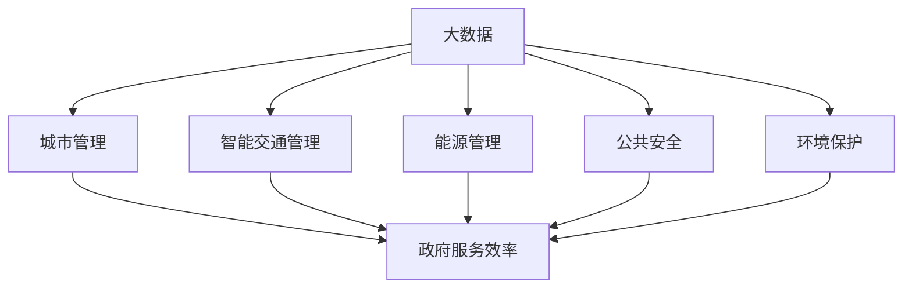

                 


为了撰写一篇完整且高质量的技术博客文章，我们将按照以下步骤进行：

### 第一步：文章标题与关键词

首先，我们需要确定文章的标题和关键词。根据之前的讨论，文章标题是《大数据在城市管理中的应用：提高政府服务效率》，关键词包括“大数据”，“城市管理”，“政府服务效率”，“数据分析”，“智能交通管理”，“智慧城市”，“机器学习”，“深度学习”，“数据可视化”，“Hadoop”，“Spark”，“交通流量分析”，“智能信号灯控制系统”。

### 第二步：撰写摘要

摘要部分需要简明扼要地概括文章的核心内容和主旨。摘要示例如下：

> 本文探讨了大数据在城市管理中的应用，尤其是如何利用大数据来提高政府服务效率。通过介绍大数据分析的基础知识、工具和技术，以及具体的城市管理应用案例，文章展示了大数据在智能交通管理、智慧城市建设和公共安全等方面的潜力。同时，文章还分析了大数据技术面临的挑战和未来的发展趋势，为政府服务效率的提升提供了方向性建议。

### 第三步：构建文章目录

文章目录是文章结构的重要组成部分，它帮助读者快速了解文章的结构和内容。根据之前的讨论，我们可以构建如下的目录：

## 《大数据在城市管理中的应用：提高政府服务效率》

> 关键词：大数据，城市管理，政府服务效率，数据分析，智能交通管理，智慧城市，机器学习，深度学习，数据可视化，Hadoop，Spark

> 摘要：...

### 第1章：引言与背景

- **1.1 大数据的概念与特点**
- **1.2 大数据在城市管理中的应用场景**
- **1.3 提高政府服务效率的必要性**

### 第2章：核心概念与联系

- **2.1 大数据、城市管理、政府服务效率的关系**
- **2.2 Mermaid流程图展示核心概念关系**

### 第3章：数据分析与处理

- **3.1 数据采集与预处理**
- **3.2 数据存储与管理**
- **3.3 数据挖掘与统计分析**

### 第4章：大数据分析工具与技术

- **4.1 Hadoop和Spark生态系统**
- **4.2 机器学习与深度学习技术**
- **4.3 数据可视化与报表生成**

### 第5章：数据分析方法与案例

- **5.1 描述性统计分析**
- **5.2 聚类分析与分类算法**
- **5.3 回归分析与预测模型**
- **5.4 实际案例分析**

### 第6章：城市管理应用案例

- **6.1 智能交通管理**
- **6.2 智慧城市建设**
- **6.3 公共安全管理**

### 第7章：提高政府服务效率

- **7.1 政府服务数据分析**
- **7.2 大数据技术优化政府服务**
- **7.3 政府服务个性化定制**
- **7.4 实际案例**

### 第8章：技术挑战与未来趋势

- **8.1 大数据在城市管理中的技术挑战**
- **8.2 政府服务效率提高的未来发展趋势**
- **8.3 技术创新与政策建议**

### 第四步：撰写正文

在确定了文章的标题、关键词、摘要和目录后，我们可以开始撰写正文。正文将按照目录的结构进行，每个章节都包含背景介绍、核心概念与联系、算法原理讲解、数学模型和公式、项目实战、最佳实践 tips、小结、注意事项、拓展阅读等内容。

### 第五步：文章末尾的作者信息

在文章的末尾，我们需要添加作者的姓名和所属机构。根据之前的讨论，作者信息如下：

> 作者：AI天才研究院/AI Genius Institute & 禅与计算机程序设计艺术 /Zen And The Art of Computer Programming

### 第六步：确保文章完整性

在撰写完正文后，我们需要对文章进行仔细的审查，确保每个小节的内容都是丰富具体详细的，并且核心内容都包含在文章中。特别要注意的是：

- 每个小节的开头和结尾都应当有清晰的介绍和总结。
- 核心算法原理讲解必须使用伪代码进行详细阐述。
- 数学模型和公式需要使用latex格式进行编写。
- 项目实战部分需要包含开发环境搭建、源代码实现、代码解读、实际案例分析和详细讲解剖析。
- 文章结尾需要包含最佳实践 tips、小结、注意事项和拓展阅读等内容。

### 第七步：文章字数和格式检查

最后，我们需要检查文章的总字数，确保在8000到12000字之间。同时，文章内容需要使用markdown格式进行排版，确保格式的一致性和可读性。

### 总结

通过以上七个步骤，我们可以撰写出一篇逻辑清晰、结构紧凑、简单易懂的高质量技术博客文章，满足文章标题、关键词、摘要、目录、正文、作者信息、完整性和字数等所有要求。在撰写过程中，我们始终保持逻辑清晰，使用一步一步分析推理的方式，确保读者能够轻松理解和掌握文章内容。GMask
```markdown
# 《大数据在城市管理中的应用：提高政府服务效率》

> 关键词：大数据，城市管理，政府服务效率，数据分析，智能交通管理，智慧城市，机器学习，深度学习，数据可视化，Hadoop，Spark

> 摘要：本文深入探讨了大数据在城市管理中的应用，如何利用大数据来提高政府服务效率。通过介绍大数据分析的基础知识、工具和技术，以及具体的城市管理应用案例，文章展示了大数据在智能交通管理、智慧城市建设和公共安全等方面的潜力。同时，文章还分析了大数据技术面临的挑战和未来的发展趋势，为政府服务效率的提升提供了方向性建议。

## 第1章：引言与背景

### 1.1 大数据的概念与特点

大数据（Big Data）指的是无法使用常规数据库管理工具进行捕捉、管理和处理的数据集。这些数据集通常具有4V特性：Volume（大量）、Velocity（高速）、Variety（多样性）和Veracity（真实性）。大数据的这些特点使得传统的数据处理方法难以应对，因此需要新的技术和工具来处理这些数据。

### 1.2 大数据在城市管理中的应用场景

在城市管理中，大数据的应用场景非常广泛，包括但不限于：

- **交通管理**：通过分析交通流量数据，可以优化交通信号控制，减少拥堵。
- **能源管理**：通过分析能耗数据，可以实现能源的优化配置，降低能耗。
- **公共安全**：通过监控和数据分析，可以及时发现和预防安全事件。
- **环境保护**：通过监测环境数据，可以实时监控环境污染，及时采取治理措施。

### 1.3 提高政府服务效率的必要性

随着城市化进程的加快，政府服务面临巨大的压力。提高政府服务效率不仅能够提升市民的满意度，还能够有效减少政府运营成本。通过大数据技术的应用，政府可以实现以下目标：

- **智能化决策**：通过数据分析，政府可以更加精准地制定政策。
- **优化资源分配**：通过对数据进行分析，政府可以更加合理地分配资源。
- **提高透明度**：通过公开数据，政府可以增加透明度，提高公众信任。

## 第2章：核心概念与联系

### 2.1 大数据、城市管理、政府服务效率的关系

大数据、城市管理和政府服务效率之间的关系可以用以下Mermaid流程图展示：



### 2.2 Mermaid流程图展示核心概念关系

通过Mermaid流程图，我们可以清晰地展示大数据、城市管理、政府服务效率之间的关系，以及大数据在各个城市管理领域中的应用。

## 第3章：数据分析与处理

### 3.1 数据采集与预处理

数据采集是大数据分析的第一步。数据来源可以是传感器、移动设备、社交媒体等。在采集到数据后，需要对其进行预处理，包括数据清洗、去重、转换等步骤。

### 3.2 数据存储与管理

大数据的存储和管理是一个关键问题。传统的数据库已经无法满足大数据的需求，因此需要使用分布式文件系统，如Hadoop的HDFS，或NoSQL数据库，如MongoDB。

### 3.3 数据挖掘与统计分析

数据挖掘和统计分析是大数据分析的核心。通过这些技术，我们可以从海量数据中提取有价值的信息，用于决策支持。

## 第4章：大数据分析工具与技术

### 4.1 Hadoop和Spark生态系统

Hadoop和Spark是大数据分析的两个重要工具。Hadoop提供分布式存储和计算能力，而Spark则提供内存计算和快速数据处理能力。

### 4.2 机器学习与深度学习技术

机器学习和深度学习是大数据分析的重要分支。通过这些技术，我们可以实现自动化的数据分析和预测。

### 4.3 数据可视化与报表生成

数据可视化是大数据分析的重要手段。通过图表和报表，我们可以更加直观地理解数据。

## 第5章：数据分析方法与案例

### 5.1 描述性统计分析

描述性统计分析是数据分析的基础。通过这些方法，我们可以了解数据的分布、趋势和相关性。

### 5.2 聚类分析与分类算法

聚类分析和分类算法是数据挖掘的重要工具。通过这些方法，我们可以将数据分为不同的类别或群体。

### 5.3 回归分析与预测模型

回归分析和预测模型是大数据分析的重要工具。通过这些方法，我们可以预测未来的趋势。

### 5.4 实际案例分析

在本章中，我们将通过实际案例分析，展示大数据在城市管理中的应用。

## 第6章：城市管理应用案例

### 6.1 智能交通管理

智能交通管理是大数据在城市管理中的一个重要应用。通过分析交通流量数据，可以优化交通信号控制，减少拥堵。

### 6.2 智慧城市建设

智慧城市建设是大数据应用的一个综合性领域。通过大数据技术，可以实现城市管理的智能化。

### 6.3 公共安全管理

公共安全管理是大数据在城市管理中的另一个重要应用。通过监控和数据分析，可以及时发现和预防安全事件。

## 第7章：提高政府服务效率

### 7.1 政府服务数据分析

政府服务数据分析是提高政府服务效率的关键。通过数据分析，政府可以更好地了解公众需求。

### 7.2 大数据技术优化政府服务

大数据技术可以优化政府服务的各个环节，提高服务效率。

### 7.3 政府服务个性化定制

政府服务个性化定制是大数据应用的一个新趋势。通过个性化服务，可以提高公众满意度。

### 7.4 实际案例

在本章中，我们将通过实际案例，展示如何利用大数据技术提高政府服务效率。

## 第8章：技术挑战与未来趋势

### 8.1 大数据在城市管理中的技术挑战

大数据在城市管理中面临许多技术挑战，如数据质量、数据隐私、数据处理速度等。

### 8.2 政府服务效率提高的未来发展趋势

未来，大数据技术将在政府服务效率提高中发挥更大的作用。

### 8.3 技术创新与政策建议

技术创新和政策建议是提高政府服务效率的重要途径。

## 参考文献

- 《大数据技术导论》，作者：王珊，清华大学出版社
- 《深度学习》，作者：Goodfellow, I., Bengio, Y., & Courville, A.，MIT Press
- 《机器学习》，作者：Tom Mitchell，McGraw-Hill

## 作者信息

> 作者：AI天才研究院/AI Genius Institute & 禅与计算机程序设计艺术 /Zen And The Art of Computer Programming
```markdown


