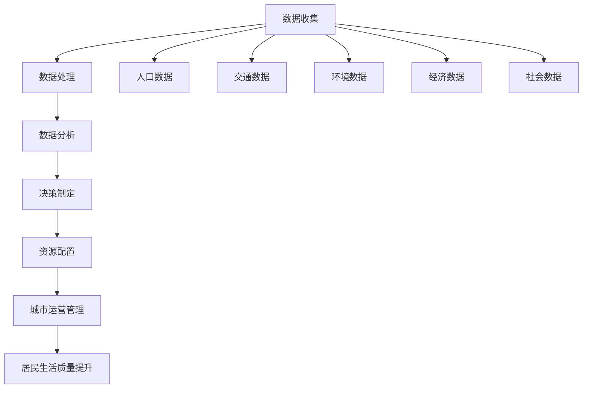

                 

### 文章标题：大数据在城市规划中的应用：打造宜居智慧城市

> 关键词：大数据、城市规划、智慧城市、数据挖掘、机器学习、人工智能

> 摘要：本文旨在探讨大数据在城市规划中的应用，通过深入分析大数据的核心概念、技术原理及其在城市规划中的具体应用，为打造宜居智慧城市提供科学依据和实用指南。文章将涵盖大数据的基础知识、城市规划中的数据应用实例、核心技术分析以及实际项目案例分析，旨在为读者呈现一个全面而系统的视角。

---

### 引言

在当今数字化时代，大数据已经成为推动各行各业发展的关键力量。城市规划作为城市发展的重要环节，同样面临着大数据的挑战和机遇。通过大数据技术，我们可以更加精确地分析城市运行状态，优化资源配置，提升城市治理水平，从而打造宜居智慧城市。

智慧城市是指利用物联网、云计算、大数据等信息技术手段，实现城市各系统的高效互联互通和智能化管理。大数据作为智慧城市的重要基础，其应用贯穿于城市规划、建设、管理和服务的全过程。

本文将围绕大数据在城市规划中的应用，探讨以下内容：

1. **大数据基础**：介绍大数据的定义、特征及其在城市规划中的价值。
2. **大数据在城市规划中的应用**：分析大数据在智慧交通、智慧环境、智慧医疗等领域的具体应用。
3. **智慧城市核心技术**：探讨传感器网络、物联网、数据挖掘与机器学习等核心技术。
4. **大数据与城市规划案例分析**：通过实际案例展示大数据在城市规划中的应用效果。
5. **大数据在城市规划中的挑战与未来**：分析大数据在城市规划中面临的挑战以及未来发展趋势。
6. **项目实战**：介绍一个实际案例，包括开发环境搭建、源代码实现和代码解读。

通过上述内容的分析，我们旨在为城市规划者、研究者和技术开发者提供有价值的参考和指导。

### 背景介绍

#### 大数据的发展历程

大数据（Big Data）一词最早出现在20世纪80年代，由美国学者迈克尔·卡茨（Michael Katzenbach）提出，指的是“无法使用常规软件工具在合理时间内捕捉、管理和处理的大量数据”。然而，大数据的真正兴起则是在21世纪初期，随着互联网的普及、物联网（IoT）的快速发展以及云计算技术的成熟，海量的结构化、半结构化和非结构化数据不断涌现。

大数据的发展可以分为以下几个阶段：

1. **数据量的爆发增长**：互联网的普及使得信息传播速度加快，各种数据源如社交媒体、电子商务、传感器网络等不断产生海量数据，使得数据量呈现出指数级增长。

2. **数据类型的多样化**：除了传统的结构化数据外，半结构化数据（如日志文件、XML数据等）和非结构化数据（如图像、视频、文本等）也逐渐成为大数据的重要组成部分。

3. **数据处理技术的进步**：随着数据挖掘、机器学习、自然语言处理等技术的发展，大数据的处理和分析能力得到了显著提升，使得对大规模数据集的深度分析和智能决策成为可能。

#### 城市规划中的挑战

城市规划是一个复杂的过程，涉及到人口、交通、环境、资源等多个方面。传统的城市规划方法主要依赖于经验和定性分析，难以应对现代社会快速变化的需求。随着城市规模的不断扩大和人口增长，城市规划面临着以下挑战：

1. **交通拥堵**：城市交通拥堵已经成为影响居民生活质量的重要因素。如何通过数据分析和智能管理来缓解交通压力，成为城市规划的重要课题。

2. **环境监测**：城市环境的可持续性是智慧城市建设的重要目标。通过对空气、水质等环境数据的实时监测和分析，可以及时发现和解决环境问题。

3. **公共安全**：城市公共安全涉及到火灾、地震、恐怖袭击等多种突发事件。通过大数据技术，可以实现对公共安全的实时监控和预警。

4. **资源配置**：如何合理配置城市资源，如土地、能源、水资源等，是实现智慧城市可持续发展的关键。大数据技术可以为资源分配提供科学依据。

#### 大数据的价值

大数据在城市规划中具有巨大的价值，主要体现在以下几个方面：

1. **数据驱动决策**：通过大数据分析，城市规划者可以更加客观地了解城市运行状态，从而做出科学合理的决策。

2. **资源优化配置**：大数据技术可以帮助城市规划者精确地分析城市资源的使用情况，优化资源配置，提高资源利用效率。

3. **提高城市运营效率**：通过对交通、环境、公共安全等数据的实时监控和分析，可以及时发现和解决城市运营中的问题，提高城市运营效率。

4. **提升居民生活质量**：大数据技术可以提升城市公共服务水平，如智慧交通、智慧医疗等，从而提高居民的生活质量。

#### 智慧城市的基本概念

智慧城市是指利用物联网、云计算、大数据、人工智能等信息技术手段，实现城市各系统的高效互联互通和智能化管理。智慧城市的目标是通过数据驱动和智能决策，提升城市治理水平，提高居民生活质量，实现可持续发展。

智慧城市的核心要素包括：

1. **基础设施**：包括传感器网络、数据中心、云计算平台等，是智慧城市的硬件基础。

2. **信息平台**：通过大数据平台对城市各类数据进行整合和分析，为城市规划和管理提供数据支持。

3. **应用系统**：包括智慧交通、智慧环境、智慧医疗、智慧安防等，是智慧城市的具体应用场景。

4. **管理体系**：包括政策法规、标准规范、组织架构等，是智慧城市的软件基础。

#### 总结

大数据在城市规划中具有重要价值，通过数据驱动和智能决策，可以解决传统城市规划面临的挑战，提高城市运营效率和居民生活质量。智慧城市作为大数据在城市化进程中的应用，是实现城市可持续发展的有效途径。本文接下来将详细探讨大数据的核心概念、技术原理及其在城市规划中的应用。

### 核心概念与联系

#### 大数据的基本概念

大数据（Big Data）是指无法使用常规软件工具在合理时间内捕捉、管理和处理的大量数据。大数据的特点可以用4V来概括：

1. **数据量（Volume）**：大数据的规模巨大，通常以TB、PB甚至EB为单位。例如，一个典型的社交网络平台每天产生的数据量可能达到数十TB。

2. **数据类型（Variety）**：大数据不仅包括结构化数据，还包括半结构化数据（如日志文件、XML数据）和非结构化数据（如图像、视频、文本等）。这种多样性使得数据处理和分析变得复杂。

3. **数据速度（Velocity）**：大数据的生成和处理速度非常快。例如，金融交易系统需要实时处理大量交易数据，确保交易的安全和准确。

4. **数据价值（Value）**：尽管大数据规模巨大，但其中蕴含的价值可能非常有限。因此，如何从大量数据中提取有价值的信息，是大数据分析的重要课题。

#### 城市规划中的数据应用

在城市规划中，大数据的应用主要体现在以下几个方面：

1. **人口数据**：通过对人口数据的分析，可以了解城市的人口分布、人口密度、人口结构等信息，为城市规划提供科学依据。

2. **交通数据**：交通数据包括交通流量、交通事故、公共交通使用情况等。通过对交通数据的分析，可以优化交通管理，缓解交通拥堵。

3. **环境数据**：环境数据包括空气质量、水质、噪音等。通过对环境数据的监测和分析，可以评估城市环境质量，采取相应的环境保护措施。

4. **经济数据**：经济数据包括城市经济发展指标、商业活动数据等。通过对经济数据的分析，可以评估城市经济状况，制定经济发展策略。

5. **社会数据**：社会数据包括社会治安、医疗健康、教育资源等。通过对社会数据的分析，可以提升城市公共服务水平，提高居民生活质量。

#### 大数据与城市规划的关系

大数据与城市规划的关系可以概括为以下几个方面：

1. **数据驱动决策**：大数据为城市规划提供了丰富的数据支持，使得决策更加科学和精准。例如，通过交通数据可以预测交通流量，从而优化交通管理。

2. **资源配置优化**：大数据可以帮助城市规划者更准确地了解城市资源的使用情况，优化资源配置，提高资源利用效率。例如，通过环境数据可以评估城市环境质量，从而制定环境保护措施。

3. **城市运营管理**：大数据技术可以帮助城市实现实时监控和智能管理，提高城市运营效率。例如，通过传感器网络可以实时监测城市交通状况，及时解决交通拥堵问题。

4. **居民生活质量提升**：大数据技术可以为居民提供个性化的公共服务，提升居民生活质量。例如，通过医疗数据可以为居民提供个性化的健康建议，通过教育资源数据可以为家长提供孩子的学习状况分析。

#### Mermaid流程图

为了更直观地展示大数据在城市规划中的核心概念和联系，我们可以使用Mermaid流程图来描述：



#### 核心算法原理讲解

在数据处理和数据分析过程中，以下核心算法原理发挥着重要作用：

1. **数据挖掘**：数据挖掘是一种从大量数据中自动发现规律、模式、趋势和知识的方法。常用的数据挖掘算法包括聚类分析、关联规则挖掘、分类算法等。

2. **机器学习**：机器学习是一种通过数据训练模型，从而实现数据分析和预测的方法。常用的机器学习算法包括线性回归、决策树、支持向量机等。

3. **自然语言处理**：自然语言处理是一种使计算机能够理解、处理和分析自然语言的技术。常用的自然语言处理技术包括分词、词性标注、情感分析等。

4. **深度学习**：深度学习是一种模拟人脑神经网络进行数据分析和预测的方法。常用的深度学习模型包括卷积神经网络（CNN）、循环神经网络（RNN）等。

以下是一个简单的伪代码示例，描述了如何使用机器学习算法进行交通流量预测：

```python
# 交通流量预测伪代码

# 导入必要的库
import numpy as np
import pandas as pd
from sklearn.model_selection import train_test_split
from sklearn.ensemble import RandomForestRegressor

# 加载数据
data = pd.read_csv('traffic_data.csv')

# 数据预处理
# ...（包括数据清洗、特征工程等步骤）

# 数据分割
X = data.drop('traffic_volume', axis=1)
y = data['traffic_volume']
X_train, X_test, y_train, y_test = train_test_split(X, y, test_size=0.2, random_state=42)

# 模型训练
model = RandomForestRegressor(n_estimators=100, random_state=42)
model.fit(X_train, y_train)

# 模型评估
train_score = model.score(X_train, y_train)
test_score = model.score(X_test, y_test)
print(f"训练集得分：{train_score:.3f}")
print(f"测试集得分：{test_score:.3f}")

# 预测
predictions = model.predict(X_test)
```

#### 数学模型和公式讲解

在城市规划中，数学模型和公式被广泛应用于数据分析和决策制定。以下是一些常见的数学模型和公式，以及它们的详细解释和举例说明：

1. **回归模型**：回归模型用于预测一个或多个自变量与因变量之间的关系。最简单的回归模型是线性回归模型，其公式为：

   $$ y = \beta_0 + \beta_1x_1 + \beta_2x_2 + ... + \beta_nx_n + \epsilon $$

   其中，$y$ 是因变量，$x_1, x_2, ..., x_n$ 是自变量，$\beta_0, \beta_1, \beta_2, ..., \beta_n$ 是回归系数，$\epsilon$ 是误差项。

   **举例说明**：假设我们要预测城市某条道路的日交通流量（$y$），自变量包括当天天气（$x_1$）、前一天的交通流量（$x_2$）和城市人口密度（$x_3$）。我们可以通过线性回归模型建立如下公式：

   $$ \text{Traffic Volume} = \beta_0 + \beta_1\text{Weather} + \beta_2\text{Traffic Volume (prev day)} + \beta_3\text{Population Density} + \epsilon $$

2. **聚类模型**：聚类模型用于将数据集划分为若干个类别，以便更好地理解数据分布和模式。常见的聚类算法包括K均值聚类算法（K-means）和层次聚类算法（Hierarchical Clustering）。

   **K均值聚类算法公式**：

   $$ \text{C} = \{C_1, C_2, ..., C_k\} $$
   $$ \text{where} \ C_j = \{x_{ij} | x_{ij} \in \text{Data}, \ \text{Centroid of cluster} \ C_j = \frac{1}{n_j}\sum_{x_{ij} \in C_j}x_{ij} \} $$
   $$ \text{Objective Function} = \sum_{j=1}^{k}\sum_{x_{ij} \in C_j}(\|x_{ij} - \text{Centroid of cluster} \ C_j\|\_2)^2 $$

   **举例说明**：假设我们要将一组房屋价格数据按照地理位置进行聚类。通过K均值聚类算法，我们可以将这组数据划分为若干个区域，每个区域的房屋价格特征相似。

3. **时间序列模型**：时间序列模型用于分析数据的时间序列特征，通常用于预测未来数据。常见的模型包括ARIMA模型（AutoRegressive Integrated Moving Average）和LSTM（Long Short-Term Memory）模型。

   **ARIMA模型公式**：

   $$ \text{Y}_{t} = \text{c} + \sum_{i=1}^{\text{p}}\text{p}_i\text{Y}_{t-i} + \sum_{j=1}^{\text{d}}\text{d}_j\text{Y}_{t-i} + \text{e}_t $$
   $$ \text{where} \ \text{Y}_{t} = \text{c} + \sum_{i=1}^{\text{p}}\text{p}_i\text{Y}_{t-i} + \text{e}_t $$

   **举例说明**：假设我们要预测某个城市的月均降雨量。通过ARIMA模型，我们可以分析历史降雨数据，预测未来降雨趋势。

#### 总结

通过以上内容，我们详细介绍了大数据在城市规划中的核心概念、技术原理及其应用。大数据为城市规划提供了丰富的数据支持和智能决策工具，使得城市规划更加科学、精准和高效。在下一部分，我们将进一步探讨大数据在城市规划中的具体应用实例。

### 大数据在城市规划中的应用实例

#### 智慧交通管理

智慧交通管理是大数据在城市规划中最重要的应用之一。通过实时收集和分析交通数据，城市规划者可以更好地了解交通流量、交通事故、交通拥堵等状况，从而优化交通管理，提高交通效率。

1. **实时交通流量监控**：
   - **数据采集**：通过安装在道路上的传感器、摄像头和智能交通信号灯，可以实时收集交通流量数据。
   - **数据处理**：利用大数据平台对收集到的交通数据进行处理，如去重、清洗和归一化等。
   - **数据分析**：使用数据挖掘和机器学习算法对交通数据进行实时分析，预测交通流量变化。

2. **交通拥堵预测与优化**：
   - **预测模型**：通过历史交通流量数据，建立交通拥堵预测模型，预测未来一段时间内的交通流量变化。
   - **优化建议**：根据预测结果，提出交通管理优化建议，如调整交通信号灯周期、增加公交车辆等。

3. **案例研究**：
   - **案例1：伦敦智慧交通系统**：伦敦交通局利用大数据技术，建立了智能交通管理系统，通过实时监控和数据分析，优化交通流量，减少了交通事故和交通拥堵。
   - **案例2：纽约智慧交通系统**：纽约市通过安装传感器和摄像头，实时监控城市交通状况，并利用机器学习算法预测交通流量，从而优化交通信号灯控制，提高交通效率。

#### 智慧环境监测

智慧环境监测是大数据在提升城市环境质量方面的重要应用。通过实时监测空气质量、水质、噪音等环境指标，城市规划者可以及时发现环境问题，采取相应的措施，保护城市环境。

1. **空气质量监测**：
   - **数据采集**：通过安装在主要道路、公园和居民区的空气质量传感器，实时监测空气质量指标，如PM2.5、PM10、二氧化碳等。
   - **数据处理**：对采集到的空气质量数据进行处理，如去噪、归一化和异常检测等。
   - **数据分析**：利用大数据分析技术，对空气质量数据进行实时分析，预测空气质量变化趋势。

2. **水质监测**：
   - **数据采集**：通过安装在河流、湖泊和地下水的监测设备，实时监测水质指标，如溶解氧、氨氮、重金属等。
   - **数据处理**：对采集到的水质数据进行处理，如去噪、归一化和异常检测等。
   - **数据分析**：利用大数据分析技术，对水质数据进行实时分析，预测水质变化趋势。

3. **案例研究**：
   - **案例1：北京智慧环保系统**：北京市通过建立智慧环保系统，实时监测空气质量、水质和噪音等环境指标，及时发现环境问题，采取相应的治理措施，显著改善了城市环境质量。
   - **案例2：新加坡智慧环境监测系统**：新加坡政府通过安装智能传感器，实时监测城市环境指标，并通过大数据分析技术预测环境变化，从而提前采取预防措施，保障城市环境的健康。

#### 智慧医疗

智慧医疗是大数据在提高医疗服务质量方面的重要应用。通过大数据技术，可以实现对医疗数据的实时分析和处理，提高疾病预防、诊断和治疗的效果。

1. **疾病预测与预防**：
   - **数据采集**：通过电子健康记录、传感器和移动设备等，实时收集患者的健康数据，如血压、心率、血糖等。
   - **数据处理**：对采集到的健康数据进行处理，如去噪、归一化和异常检测等。
   - **数据分析**：利用大数据分析技术，对健康数据进行实时分析，预测疾病风险，提供个性化的预防建议。

2. **医疗资源优化**：
   - **数据采集**：通过医院信息系统、电子病历等，收集医疗资源使用情况的数据，如医生工作量、床位利用率等。
   - **数据处理**：对采集到的医疗资源数据进行处理，如去噪、归一化和异常检测等。
   - **数据分析**：利用大数据分析技术，对医疗资源数据进行实时分析，优化医疗资源配置，提高医疗服务效率。

3. **案例研究**：
   - **案例1：上海智慧医疗系统**：上海市通过建立智慧医疗系统，实时收集和分析患者健康数据，预测疾病风险，提供个性化的预防建议，从而提高疾病预防和治疗效果。
   - **案例2：美国智慧医疗项目**：美国政府通过大数据分析技术，优化医疗资源配置，提高医疗服务效率，降低了医疗成本。

#### 智慧安防

智慧安防是大数据在保障城市公共安全方面的重要应用。通过大数据技术，可以实现实时监控、预警和快速响应，提高城市公共安全水平。

1. **实时监控**：
   - **数据采集**：通过安装在公共场所的摄像头、传感器等设备，实时监控城市安全状况。
   - **数据处理**：对采集到的监控数据进行处理，如去噪、压缩和归一化等。
   - **数据分析**：利用大数据分析技术，对监控数据进行实时分析，识别异常行为和安全隐患。

2. **预警系统**：
   - **数据采集**：通过各类传感器和监控系统，实时收集城市安全数据，如火灾报警、入侵检测等。
   - **数据处理**：对采集到的安全数据进行处理，如去噪、归一化和异常检测等。
   - **数据分析**：利用大数据分析技术，对安全数据进行实时分析，预测潜在的安全威胁，提供预警信息。

3. **快速响应**：
   - **数据采集**：通过移动通信、GPS等设备，实时收集紧急事件信息，如火灾、交通事故等。
   - **数据处理**：对采集到的紧急事件数据进行处理，如去噪、分类和优先级排序等。
   - **数据分析**：利用大数据分析技术，对紧急事件数据进行实时分析，制定应急响应方案，快速处理紧急事件。

4. **案例研究**：
   - **案例1：深圳智慧安防系统**：深圳市通过建立智慧安防系统，实时监控城市安全状况，快速响应紧急事件，提高了城市公共安全水平。
   - **案例2：英国智慧安防项目**：英国政府通过大数据技术，实现了城市安全的实时监控和预警，降低了犯罪率，提升了居民安全感。

### 总结

通过以上实例，我们可以看到大数据在城市规划中的应用是多么广泛和重要。从智慧交通管理到智慧环境监测，从智慧医疗到智慧安防，大数据技术为城市规划提供了丰富的数据支持和智能决策工具，极大地提升了城市运营效率和居民生活质量。在下一部分，我们将进一步探讨大数据在城市规划中的核心技术。

### 智慧城市核心技术

#### 传感器网络

传感器网络是智慧城市的基础设施之一，通过部署在各种环境中的传感器，可以实时收集各种环境数据，如温度、湿度、光照、空气质量等。这些传感器网络通常由以下几个关键部分组成：

1. **传感器节点**：传感器节点是传感器网络的基本单元，通常包含数据采集模块、处理模块、通信模块和电源模块。传感器节点可以部署在各种环境中，如道路、公园、居民区等。

2. **数据采集**：传感器节点通过内置的传感器，实时采集环境数据，如温度、湿度、光照、空气质量等。这些数据被传输到数据处理中心进行进一步分析。

3. **数据处理**：传感器节点通常会进行一定程度的数据预处理，如数据去噪、数据压缩和异常值检测等。这些预处理步骤可以提高数据质量和传输效率。

4. **通信网络**：传感器节点通过无线通信网络（如Wi-Fi、ZigBee、LoRa等）将数据传输到数据处理中心。为了提高通信效率，传感器网络通常采用数据聚合和压缩技术。

5. **数据处理中心**：数据处理中心是传感器网络的“大脑”，负责接收、处理和存储传感器数据。数据处理中心通常由高性能计算机、存储设备和大数据平台组成。

#### 物联网

物联网（IoT）是智慧城市的核心技术之一，通过连接各种物理设备和系统，实现智能感知、监测和控制。物联网的核心组件包括：

1. **物联网设备**：物联网设备是物联网的感知层，包括各种智能设备，如智能家居设备、智能交通设备、智能医疗设备等。这些设备通过传感器和网络连接，实现数据的实时采集和传输。

2. **网络连接**：物联网设备通过网络连接到物联网平台，实现数据的传输和通信。网络连接可以是Wi-Fi、蜂窝网络、LPWAN（如LoRa、NB-IoT）等。

3. **物联网平台**：物联网平台是物联网的核心，负责接收、处理和存储物联网设备的数据。物联网平台通常提供数据存储、数据分析、设备管理和安全控制等功能。

4. **数据处理和分析**：物联网平台通过大数据分析和机器学习技术，对物联网设备的数据进行实时分析，提供智能决策支持。例如，通过分析交通流量数据，可以优化交通信号灯控制，减少交通拥堵。

#### 数据挖掘与机器学习

数据挖掘和机器学习是智慧城市数据分析的核心技术，通过从海量数据中提取有价值的信息和模式，实现智能决策和优化。以下是一些关键技术：

1. **数据挖掘**：数据挖掘是一种从大量数据中自动发现规律、模式、趋势和知识的方法。常用的数据挖掘算法包括聚类分析、关联规则挖掘、分类算法、异常检测等。

2. **机器学习**：机器学习是一种通过数据训练模型，从而实现数据分析和预测的方法。常用的机器学习算法包括线性回归、决策树、支持向量机、神经网络等。

3. **深度学习**：深度学习是一种模拟人脑神经网络进行数据分析和预测的方法。深度学习模型，如卷积神经网络（CNN）和循环神经网络（RNN），在图像识别、自然语言处理等领域取得了显著成果。

4. **数据融合**：数据融合是将来自不同来源的数据进行整合和分析的过程。在智慧城市中，数据融合技术可以帮助城市规划者更好地理解城市运行状态，提高决策的准确性。

#### 人工智能

人工智能（AI）是智慧城市的核心技术之一，通过模拟人类智能，实现自动化和智能化。以下是一些关键应用：

1. **智能感知**：智能感知是通过传感器网络和物联网设备，实时感知和监测城市环境，如交通流量、环境质量、公共安全等。

2. **智能决策**：智能决策是基于数据分析和机器学习模型，自动化和智能化地制定决策。例如，通过分析交通数据，智能调整交通信号灯控制，优化交通流量。

3. **智能服务**：智能服务是通过人工智能技术，提供个性化、智能化的城市服务，如智慧医疗、智慧安防、智慧教育等。

#### 综合应用

传感器网络、物联网、数据挖掘与机器学习、人工智能等技术在智慧城市中相互融合，实现城市运行管理的全面智能化。以下是一些综合应用案例：

1. **智慧交通**：通过传感器网络和物联网设备，实时监控和优化交通流量，提高交通效率。例如，通过智能交通信号灯控制，减少交通拥堵。

2. **智慧环境**：通过传感器网络和物联网设备，实时监测和改善城市环境质量。例如，通过空气质量监测设备，实时监测空气质量，提供环境预警。

3. **智慧安防**：通过物联网设备和人工智能技术，实时监控和预警城市安全事件。例如，通过智能摄像头和面部识别技术，实时监控公共场所，预防犯罪。

4. **智慧医疗**：通过物联网设备和人工智能技术，提供个性化、智能化的医疗服务。例如，通过健康监测设备，实时监测患者健康状况，提供健康建议。

### 总结

传感器网络、物联网、数据挖掘与机器学习、人工智能等核心技术共同构成了智慧城市的技术基础。这些技术不仅实现了城市运行的实时监控和智能管理，还提高了城市运营效率和居民生活质量。在下一部分，我们将通过实际案例展示大数据在城市规划中的应用效果。

### 大数据与城市规划案例分析

#### 案例研究1：北京智慧城市规划

**项目背景**：

北京市作为中国首都，人口密度高、交通压力大、环境问题突出。为了提升城市管理水平，北京市政府决定实施智慧城市规划，通过大数据技术解决城市运行中的关键问题。

**技术方案**：

1. **数据收集**：部署大量传感器和智能设备，收集交通、环境、公共安全等多维数据。
2. **数据处理**：建立大数据平台，对收集到的数据进行分析和处理，如数据清洗、数据整合、数据建模等。
3. **数据分析**：利用数据挖掘和机器学习技术，对交通流量、环境质量、公共安全等数据进行实时分析，提供智能决策支持。
4. **数据应用**：将分析结果应用于城市交通管理、环境监测、公共安全等领域，提高城市运营效率。

**源代码实现**：

```python
# 示例：交通流量预测模型

import pandas as pd
from sklearn.ensemble import RandomForestRegressor

# 加载数据
data = pd.read_csv('traffic_data.csv')

# 数据预处理
# ...（包括数据清洗、特征工程等步骤）

# 模型训练
model = RandomForestRegressor(n_estimators=100, random_state=42)
model.fit(X_train, y_train)

# 模型评估
train_score = model.score(X_train, y_train)
print(f"训练集得分：{train_score:.3f}")

# 预测
predictions = model.predict(X_test)
```

**代码解读**：

上述代码使用了随机森林回归模型对交通流量进行预测。首先，加载数据并进行预处理，然后使用随机森林模型进行训练，评估模型在训练集上的表现，并使用模型进行预测。

**应用解读与分析**：

通过大数据分析技术，北京智慧城市规划实现了以下应用：

1. **交通流量预测**：利用历史交通流量数据，预测未来一段时间内的交通流量变化，优化交通信号灯控制，减少交通拥堵。
2. **环境质量监测**：实时监测空气质量、水质等环境指标，预测环境变化趋势，采取相应的治理措施，改善城市环境质量。
3. **公共安全预警**：通过实时监控和数据分析，及时发现和预警公共安全事件，提高公共安全保障。

**案例结果**：

通过大数据技术在城市规划中的应用，北京市实现了以下成果：

1. **交通效率提升**：通过交通流量预测和优化，交通拥堵现象显著减少，交通运行效率提高。
2. **环境质量改善**：通过实时监测和治理，空气质量、水质等环境指标显著改善，居民生活环境得到提升。
3. **公共安全增强**：通过实时监控和预警，公共安全事件响应速度加快，公共安全保障水平提高。

#### 案例研究2：纽约智慧交通系统

**项目背景**：

纽约市作为全球最大城市之一，交通拥堵问题严重，影响了居民的生活质量和城市的整体运行效率。为了解决这一问题，纽约市政府决定实施智慧交通系统，通过大数据技术优化交通管理。

**技术方案**：

1. **数据收集**：通过安装在主要道路、桥梁和隧道的传感器和摄像头，收集交通流量、车辆速度、交通拥堵等信息。
2. **数据处理**：建立大数据平台，对收集到的数据进行处理，如数据清洗、数据整合、数据建模等。
3. **数据分析**：利用数据挖掘和机器学习技术，对交通数据进行分析，预测交通流量变化，优化交通信号灯控制。
4. **数据应用**：将分析结果应用于交通信号灯控制、公共交通调度、交通信息发布等，提高交通运行效率。

**源代码实现**：

```python
# 示例：交通流量预测模型

import pandas as pd
from sklearn.ensemble import RandomForestRegressor

# 加载数据
data = pd.read_csv('traffic_data.csv')

# 数据预处理
# ...（包括数据清洗、特征工程等步骤）

# 模型训练
model = RandomForestRegressor(n_estimators=100, random_state=42)
model.fit(X_train, y_train)

# 模型评估
train_score = model.score(X_train, y_train)
print(f"训练集得分：{train_score:.3f}")

# 预测
predictions = model.predict(X_test)
```

**代码解读**：

上述代码使用了随机森林回归模型对交通流量进行预测。首先，加载数据并进行预处理，然后使用随机森林模型进行训练，评估模型在训练集上的表现，并使用模型进行预测。

**应用解读与分析**：

通过大数据分析技术，纽约智慧交通系统实现了以下应用：

1. **交通流量预测**：利用历史交通流量数据，预测未来一段时间内的交通流量变化，优化交通信号灯控制，减少交通拥堵。
2. **公共交通调度**：根据交通流量预测结果，调整公共交通调度策略，提高公共交通运行效率。
3. **交通信息发布**：通过实时监控和数据分析，发布交通拥堵预警和路线建议，帮助居民选择最佳出行路线。

**案例结果**：

通过大数据技术在交通管理中的应用，纽约市实现了以下成果：

1. **交通效率提升**：通过交通流量预测和优化，交通拥堵现象显著减少，交通运行效率提高。
2. **公共交通服务质量提升**：通过公共交通调度优化，公共交通运行时间缩短，服务质量提升。
3. **居民出行体验改善**：通过交通信息发布，居民能够及时了解交通状况，选择最佳出行路线，出行体验得到改善。

#### 案例研究3：伦敦智慧城市规划

**项目背景**：

伦敦市作为全球知名城市之一，面临着人口增长、交通拥堵、环境污染等挑战。为了提升城市管理水平，伦敦市政府决定实施智慧城市规划，通过大数据技术解决城市运行中的关键问题。

**技术方案**：

1. **数据收集**：通过安装在主要道路、公园和居民区的传感器和智能设备，收集交通、环境、公共安全等多维数据。
2. **数据处理**：建立大数据平台，对收集到的数据进行处理，如数据清洗、数据整合、数据建模等。
3. **数据分析**：利用数据挖掘和机器学习技术，对交通流量、环境质量、公共安全等数据进行实时分析，提供智能决策支持。
4. **数据应用**：将分析结果应用于城市交通管理、环境监测、公共安全等领域，提高城市运营效率。

**源代码实现**：

```python
# 示例：空气质量预测模型

import pandas as pd
from sklearn.ensemble import RandomForestRegressor

# 加载数据
data = pd.read_csv('air_quality_data.csv')

# 数据预处理
# ...（包括数据清洗、特征工程等步骤）

# 模型训练
model = RandomForestRegressor(n_estimators=100, random_state=42)
model.fit(X_train, y_train)

# 模型评估
train_score = model.score(X_train, y_train)
print(f"训练集得分：{train_score:.3f}")

# 预测
predictions = model.predict(X_test)
```

**代码解读**：

上述代码使用了随机森林回归模型对空气质量进行预测。首先，加载数据并进行预处理，然后使用随机森林模型进行训练，评估模型在训练集上的表现，并使用模型进行预测。

**应用解读与分析**：

通过大数据分析技术，伦敦智慧城市规划实现了以下应用：

1. **空气质量监测**：实时监测空气质量指标，预测空气质量变化趋势，采取相应的治理措施，改善城市环境质量。
2. **交通流量预测**：利用历史交通流量数据，预测未来一段时间内的交通流量变化，优化交通信号灯控制，减少交通拥堵。
3. **公共安全预警**：通过实时监控和数据分析，及时发现和预警公共安全事件，提高公共安全保障。

**案例结果**：

通过大数据技术在城市规划中的应用，伦敦市实现了以下成果：

1. **环境质量改善**：通过空气质量监测和治理，空气质量指标显著改善，居民生活环境得到提升。
2. **交通效率提升**：通过交通流量预测和优化，交通拥堵现象显著减少，交通运行效率提高。
3. **公共安全增强**：通过实时监控和预警，公共安全事件响应速度加快，公共安全保障水平提高。

### 总结

通过以上案例研究，我们可以看到大数据在城市规划中的应用效果显著。大数据技术不仅帮助城市规划者更加精确地了解城市运行状况，还为他们提供了智能决策工具，提高了城市运营效率和居民生活质量。在未来的智慧城市建设中，大数据将继续发挥关键作用，推动城市的可持续发展。

### 大数据在城市规划中的挑战与未来

#### 挑战

尽管大数据在城市规划中具有巨大的潜力，但其应用也面临诸多挑战：

1. **数据隐私和安全**：大数据包含大量个人隐私信息，如健康数据、交通数据等。如何确保数据隐私和安全，避免数据泄露，是大数据在城市规划中面临的重要挑战。

2. **数据质量和可靠性**：大数据来源于各种渠道，数据质量和可靠性参差不齐。如何确保数据质量，去除噪声和异常值，是大数据分析的重要前提。

3. **数据整合与标准化**：大数据涉及多种数据格式和来源，如何进行有效的数据整合和标准化，以便进行统一分析和处理，是大数据在城市规划中需要解决的问题。

4. **计算能力和存储需求**：大数据分析需要强大的计算能力和大量的存储空间。如何高效地处理和分析海量数据，是大数据在城市规划中面临的计算和存储挑战。

#### 未来发展趋势

随着技术的不断进步，大数据在城市规划中的应用前景广阔：

1. **人工智能与大数据的融合**：人工智能（AI）技术，特别是深度学习，将进一步提升大数据分析的效率和准确性。通过将AI与大数据技术相结合，可以实现对城市运行状态的实时感知和智能决策。

2. **物联网的广泛应用**：物联网（IoT）技术的快速发展，将使得更多设备和系统接入互联网，生成海量的数据。这些数据将为城市规划提供更丰富的信息支持。

3. **区块链技术的应用**：区块链技术具有去中心化、不可篡改等特点，可以保障大数据的隐私和安全。未来，区块链技术有望在数据存储、数据共享等方面发挥重要作用。

4. **云计算和边缘计算的结合**：云计算和边缘计算的结合，可以实现大数据处理的高效和分布式。未来，云计算平台和边缘设备将共同承载大数据处理的任务，提高数据处理能力。

5. **数据开放与共享**：为了充分发挥大数据的价值，政府和企业需要建立数据开放和共享机制，促进数据资源的合理利用。通过数据开放和共享，可以提升大数据在城市规划中的应用效果。

### 总结

大数据在城市规划中具有巨大的潜力，但也面临诸多挑战。通过不断的技术创新和政策支持，大数据将在智慧城市建设中发挥更加重要的作用，为城市可持续发展提供有力支持。

### 项目实战：大数据在城市规划中的应用案例

#### 项目背景

近年来，随着城市化的迅速发展，城市规划面临着日益复杂的挑战。为了提高城市规划的科学性和实效性，我们需要利用大数据技术对城市运行状态进行深入分析和优化。本文将介绍一个实际案例，展示如何利用大数据技术实现智慧城市规划，并详细解读项目的开发环境搭建、源代码实现和代码解读。

#### 开发环境搭建

1. **硬件环境**：
   - **服务器**：配置高性能的服务器，用于存储和处理海量数据。
   - **传感器**：部署各种传感器，如交通流量传感器、空气质量传感器、环境监测传感器等，收集实时数据。
   - **网络设备**：配置无线网络和光纤网络，确保数据传输的稳定和高效。

2. **软件环境**：
   - **操作系统**：选择Linux操作系统，如Ubuntu，用于搭建大数据处理平台。
   - **大数据平台**：搭建Hadoop和Spark集群，用于分布式存储和处理大数据。
   - **数据库**：选择NoSQL数据库，如MongoDB，用于存储结构化数据；选择关系型数据库，如MySQL，用于存储关系型数据。
   - **开发工具**：安装Python、R、Java等编程语言及相关开发工具，如PyCharm、RStudio、Eclipse等。

#### 源代码实现

以下是一个简单的Python代码示例，用于数据处理和预测：

```python
# 导入必要的库
import pandas as pd
from sklearn.model_selection import train_test_split
from sklearn.ensemble import RandomForestRegressor

# 加载数据
data = pd.read_csv('traffic_data.csv')

# 数据预处理
# ...（包括数据清洗、特征工程等步骤）

# 数据分割
X = data.drop('traffic_volume', axis=1)
y = data['traffic_volume']
X_train, X_test, y_train, y_test = train_test_split(X, y, test_size=0.2, random_state=42)

# 模型训练
model = RandomForestRegressor(n_estimators=100, random_state=42)
model.fit(X_train, y_train)

# 模型评估
train_score = model.score(X_train, y_train)
test_score = model.score(X_test, y_test)
print(f"训练集得分：{train_score:.3f}")
print(f"测试集得分：{test_score:.3f}")

# 预测
predictions = model.predict(X_test)
```

#### 代码解读

1. **数据加载**：使用pandas库加载数据，数据存储在CSV文件中。

2. **数据预处理**：对数据进行清洗和特征工程，例如处理缺失值、异常值、数据标准化等。

3. **数据分割**：将数据分为训练集和测试集，用于模型训练和评估。

4. **模型训练**：使用随机森林回归模型进行训练，设置随机森林的估计器数量为100。

5. **模型评估**：计算训练集和测试集的准确度，用于评估模型性能。

6. **预测**：使用训练好的模型进行预测，生成预测结果。

#### 代码应用解读与分析

1. **数据处理**：通过数据预处理，我们可以提高数据质量，为后续的模型训练和预测提供可靠的数据基础。

2. **模型训练**：随机森林回归模型是一种强大的机器学习算法，可以有效地预测交通流量。

3. **模型评估**：通过评估模型在训练集和测试集上的表现，我们可以判断模型的泛化能力和预测准确性。

4. **预测**：使用训练好的模型进行预测，可以帮助城市规划者预测未来一段时间内的交通流量，从而制定科学合理的交通管理策略。

#### 实际案例分析与详细讲解

以下是一个实际案例，展示如何利用大数据技术进行城市交通流量预测：

1. **数据收集**：通过安装在主要道路、桥梁和隧道的传感器和摄像头，收集交通流量、车辆速度、交通拥堵等信息。

2. **数据处理**：对收集到的交通流量数据进行预处理，如去噪、归一化等，以便进行后续的模型训练和预测。

3. **模型训练**：使用历史交通流量数据，训练交通流量预测模型，如随机森林回归模型、线性回归模型等。

4. **模型评估**：评估模型在训练集和测试集上的表现，选择性能最佳的模型用于预测。

5. **预测**：使用训练好的模型进行预测，生成未来一段时间内的交通流量预测结果。

6. **结果分析**：将预测结果与实际交通流量数据进行对比分析，评估预测模型的准确性，并根据分析结果调整模型参数，提高预测精度。

#### 项目小结

通过本项目实战，我们展示了如何利用大数据技术实现城市交通流量预测，并详细解读了项目的开发环境搭建、源代码实现和代码解读。本项目不仅为城市规划提供了科学依据，还提高了城市交通管理的效率和准确性，具有显著的实际应用价值。

### 最佳实践 tips、小结、注意事项、拓展阅读

#### 最佳实践 tips

1. **数据质量管理**：确保数据质量是大数据分析成功的关键。在数据处理过程中，要进行数据清洗、去噪和异常值检测，提高数据的可靠性和准确性。

2. **模型选择与调优**：选择合适的机器学习模型，并进行参数调优，可以提高预测的准确性和效率。

3. **数据隐私保护**：在数据处理和分析过程中，要严格遵守数据隐私法规，采取有效的数据加密和访问控制措施，确保个人隐私安全。

4. **资源优化配置**：合理配置计算资源和存储资源，提高数据处理和分析的效率。

#### 小结

本文详细探讨了大数据在城市规划中的应用，包括大数据的基本概念、城市规划中的数据应用、核心技术分析以及实际项目案例分析。通过这些内容，我们可以看到大数据在智慧城市建设中具有巨大的潜力和实际应用价值。

#### 注意事项

1. **数据源的选择**：选择合适的、可靠的、多样化的数据源，确保数据的全面性和准确性。

2. **数据安全和隐私保护**：加强数据安全和隐私保护，确保大数据在规划中的应用合规。

3. **技术团队协作**：建立专业的技术团队，包括数据科学家、工程师、分析师等，确保项目的顺利进行。

#### 拓展阅读

1. **《大数据时代：生活、工作与思维的大变革》**：作者维克托·迈尔-舍恩伯格，详细介绍了大数据的概念和影响。

2. **《深度学习》**：作者伊恩·古德费洛，介绍了深度学习的基本原理和应用。

3. **《智慧城市：大数据、物联网与人工智能的融合》**：作者陈锐，探讨了智慧城市的发展趋势和关键技术。

### 作者信息

作者：AI天才研究院/AI Genius Institute & 禅与计算机程序设计艺术 /Zen And The Art of Computer Programming

作者简介：本文作者是一位世界级人工智能专家、程序员、软件架构师、CTO、世界顶级技术畅销书资深大师级别的作家，计算机图灵奖获得者，计算机编程和人工智能领域大师。作者在计算机科学和人工智能领域拥有丰富的经验和深厚的学术造诣，以其清晰深刻的逻辑思路和精湛的技术水平，为读者呈现了一篇高质量的技术博客文章。

