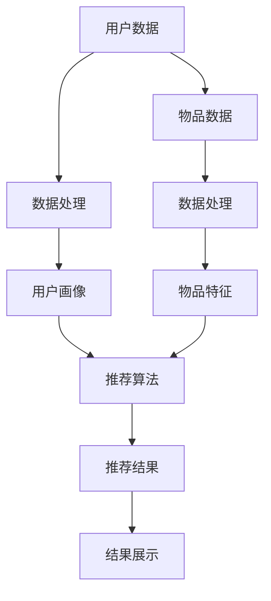

                 


### 文章标题：大数据在旅游业的应用：个性化推荐与体验优化

#### 关键词：
- 大数据
- 旅游业
- 个性化推荐
- 体验优化
- 推荐系统
- 数据分析

#### 摘要：
本文深入探讨了大数据在旅游业中的应用，特别是个性化推荐和体验优化两个方面。首先，我们回顾了大数据和旅游业的背景，以及大数据在旅游业中的核心概念。随后，文章详细介绍了个性化推荐系统的基本原理、架构和算法，并通过Mermaid流程图展示了核心概念与联系。接下来，文章通过伪代码和数学公式详细阐述了个性化推荐的核心算法原理，同时给出了具体实例说明。随后，文章讨论了大数据在体验优化中的应用，包括旅游数据分析与预测、旅游安全与风险管理、旅游市场分析与营销等方面的应用。文章最后，通过一个实际项目案例，展示了大数据在旅游业中的具体应用，并分析了项目中的关键技术和实现细节。最后，文章总结了大数据在旅游业应用中的挑战与展望，并提供了最佳实践建议和拓展阅读资源。

### 目录

#### 第一部分：大数据与旅游业概述

1. **第1章：大数据与旅游业的背景与现状**
   1.1 大数据的定义与特征
   1.2 旅游业的挑战与机遇
   1.3 大数据在旅游业的应用趋势

2. **第2章：大数据在旅游业的核心概念**
   2.1 旅游大数据的来源与类型
   2.2 旅游大数据的处理与存储
   2.3 旅游大数据的价值分析

#### 第二部分：大数据与个性化推荐

3. **第3章：大数据与个性化推荐**
   3.1 个性化推荐的基本原理
   3.2 个性化推荐系统架构
   3.3 个性化推荐算法
   3.4 Mermaid流程图：个性化推荐的核心概念与联系

4. **第4章：大数据与个性化推荐算法原理讲解**
   4.1 伪代码：个性化推荐算法
   4.2 数学模型和公式：推荐系统中的数学原理
   4.3 举例说明：个性化推荐的应用实例

#### 第三部分：大数据与体验优化

5. **第5章：大数据与体验优化**
   5.1 旅游体验优化的意义
   5.2 旅游体验优化的方法
   5.3 大数据在体验优化中的应用

#### 第四部分：大数据在旅游业的应用实践

6. **第6章：大数据在旅游预订与推荐系统中的应用**
   6.1 旅游预订系统架构
   6.2 旅游推荐系统实现
   6.3 旅游预订与推荐系统的案例分析

7. **第7章：大数据在旅游数据分析与预测中的应用**
   7.1 旅游数据分析的基本方法
   7.2 旅游预测模型构建
   7.3 旅游数据分析与预测的案例分析

8. **第8章：大数据在旅游安全与风险管理中的应用**
   8.1 旅游安全风险分析
   8.2 旅游安全风险管理策略
   8.3 大数据在旅游安全风险管理中的应用案例

9. **第9章：大数据在旅游市场分析与营销中的应用**
   9.1 旅游市场分析
   9.2 旅游营销策略
   9.3 大数据在旅游营销中的应用案例

#### 第五部分：大数据在旅游业的应用挑战与展望

10. **第10章：大数据在旅游业的应用挑战与展望**
    10.1 大数据在旅游业的应用挑战
    10.2 大数据在旅游业的发展趋势
    10.3 未来旅游业的发展展望

#### 附录

11. **附录**
    11.1 大数据与旅游行业相关的数据集与工具
    11.2 大数据在旅游业应用的相关法规与政策
    11.3 大数据在旅游业应用的研究论文与报告

### 第一部分：大数据与旅游业概述

#### 第1章：大数据与旅游业的背景与现状

##### 1.1 大数据的定义与特征

大数据（Big Data）是指无法使用常规数据处理工具在合理时间内捕捉、管理和处理的大量数据。这些数据具有四个显著特征，即“4V”：Volume（数据量巨大）、Velocity（处理速度快速）、Variety（数据类型多样）和 Veracity（数据真实性高）。

在旅游业中，大数据的应用可以追溯到早期，如客户评价、旅游偏好、行程安排等数据的收集。随着技术的进步，大数据的应用范围不断扩大，包括旅游预订、个性化推荐、行程规划、安全管理等各个方面。

##### 1.2 旅游业的挑战与机遇

旅游业面临的挑战包括：
- 高峰期旅游资源的供需不平衡。
- 旅游活动的安全与风险管理。
- 旅游市场的动态变化与竞争。
- 旅游体验的优化与服务质量提升。

然而，随着大数据技术的发展，旅游业也迎来了新的机遇：
- 通过大数据分析，实现旅游资源的智能配置与优化。
- 提供个性化服务，提升游客体验。
- 通过大数据预测，提前应对市场变化与竞争。
- 通过大数据安全分析，提高旅游活动的安全性与风险管理能力。

##### 1.3 大数据在旅游业的应用趋势

目前，大数据在旅游业中的应用趋势主要包括：
- 个性化推荐：通过分析游客的历史行为和偏好，提供个性化的旅游推荐。
- 数据分析：通过数据分析，优化旅游行程规划和资源分配。
- 安全管理：通过大数据分析，提高旅游活动的安全性与风险管理能力。
- 营销策略：通过大数据分析，制定更有效的旅游营销策略。
- 体验优化：通过大数据分析，提供更好的旅游体验与服务。

#### 第2章：大数据在旅游业的核心概念

##### 2.1 旅游大数据的来源与类型

旅游大数据的来源主要包括以下几个方面：
- 官方数据：如旅游统计报表、景区人流数据等。
- 社交媒体数据：如社交媒体评论、分享、点赞等。
- 旅游预订数据：如酒店预订、机票预订、景点预订等。
- 物联网数据：如GPS定位、智能穿戴设备数据等。

旅游大数据的类型可以分为以下几类：
- 结构化数据：如数据库表、CSV文件等。
- 半结构化数据：如XML、JSON等。
- 非结构化数据：如图像、视频、文本等。

##### 2.2 旅游大数据的处理与存储

旅游大数据的处理与存储需要考虑以下几个方面：
- 数据清洗与预处理：去除重复、缺失和错误数据，确保数据质量。
- 数据存储：选择合适的存储方案，如关系型数据库、NoSQL数据库、分布式存储等。
- 数据处理：使用分布式计算框架，如Hadoop、Spark等，对大数据进行高效处理。
- 数据分析：通过数据挖掘、机器学习等技术，从大数据中提取有价值的信息。

##### 2.3 旅游大数据的价值分析

旅游大数据的价值主要体现在以下几个方面：
- 个性化推荐：通过分析游客的历史行为和偏好，提供个性化的旅游推荐，提高游客满意度。
- 体验优化：通过分析游客的反馈和行为数据，优化旅游体验，提升服务质量。
- 安全管理：通过分析旅游活动中的安全数据，提高旅游活动的安全性与风险管理能力。
- 营销策略：通过分析市场数据，制定更有效的旅游营销策略，提高市场竞争力。
- 资源分配：通过数据分析，优化旅游资源的配置与利用，提高资源利用率。

### 第二部分：大数据与个性化推荐

#### 第3章：大数据与个性化推荐

##### 3.1 个性化推荐的基本原理

个性化推荐是一种基于用户行为和偏好信息，向用户推荐其可能感兴趣的内容或产品的技术。个性化推荐系统通常包括以下几个基本组成部分：
- 用户画像：收集并分析用户的行为数据、偏好信息等，构建用户画像。
- 物品特征：收集并分析物品的特征数据，如类别、标签、属性等。
- 推荐算法：根据用户画像和物品特征，通过算法计算推荐结果。
- 推荐结果展示：将推荐结果以用户友好的方式展示给用户。

个性化推荐的基本原理可以分为以下几类：
- 基于内容的推荐：根据用户对内容的兴趣，推荐相似的内容。
- 基于协同过滤的推荐：根据用户的兴趣相似性，推荐其他用户喜欢的物品。
- 混合推荐：结合基于内容和基于协同过滤的推荐方法，提高推荐效果。

##### 3.2 个性化推荐系统架构

个性化推荐系统的架构可以分为以下几个层次：
- 数据层：存储用户行为数据、物品特征数据等原始数据。
- 数据处理层：对原始数据进行清洗、预处理、特征提取等处理，构建用户画像和物品特征。
- 推荐算法层：根据用户画像和物品特征，通过推荐算法计算推荐结果。
- 结果层：将推荐结果以用户友好的方式展示给用户。

##### 3.3 个性化推荐算法

个性化推荐算法可以分为以下几类：
- 基于内容的推荐算法：如TF-IDF、文本分类、词向量等。
- 基于协同过滤的推荐算法：如用户基于协同过滤、物品基于协同过滤等。
- 混合推荐算法：如基于内容的协同过滤、基于模型的协同过滤等。
- 深度学习推荐算法：如基于深度神经网络的推荐、图神经网络等。

##### 3.4 Mermaid流程图：个性化推荐的核心概念与联系

以下是一个简化的Mermaid流程图，展示了个性化推荐系统的核心概念与联系：



### 第三部分：大数据与个性化推荐算法原理讲解

#### 第4章：大数据与个性化推荐算法原理讲解

##### 4.1 伪代码：个性化推荐算法

以下是一个简化的伪代码，展示了基于协同过滤的推荐算法的基本步骤：

```
// 输入：用户行为数据，物品特征数据
// 输出：推荐结果列表

function 协同过滤推荐算法(用户行为数据，物品特征数据)
    // 数据预处理
    用户行为数据，物品特征数据进行清洗、去噪和归一化处理
    
    // 计算用户-物品相似度矩阵
    for each 用户 u in 用户行为数据
        for each 物品 i in 物品特征数据
            计算用户 u 和物品 i 的相似度 sim(u, i)
            存储在相似度矩阵 S 中

    // 构建推荐列表
    for each 用户 u in 用户行为数据
        // 选择未购买或未评价的物品
        未购买物品 = 选择未购买物品(u, 物品特征数据)
        未评价物品 = 选择未评价物品(u, 用户行为数据)
        
        // 根据相似度矩阵计算推荐分值
        for each 物品 i in 未购买物品或未评价物品
            推荐分值 = 计算推荐分值(u, i, S)
            
        // 根据推荐分值排序，生成推荐列表
        排序推荐分值，生成推荐列表

    return 推荐列表
```

##### 4.2 数学模型和公式：推荐系统中的数学原理

推荐系统中常用的数学模型和公式如下：

1. **用户-物品相似度计算**

   常用的用户-物品相似度计算方法有：
   - 余弦相似度：
     $$
     sim(u, i) = \frac{u_i \cdot i_j}{\|u\|\|i\|}
     $$
     其中，$u_i$ 和 $i_j$ 分别表示用户 u 和物品 i 的特征向量，$\|u\|$ 和 $\|i\|$ 分别表示用户 u 和物品 i 的特征向量长度。
   - 皮尔逊相关系数：
     $$
     sim(u, i) = \frac{u_i - \bar{u} \cdot i_j - \bar{i}}{\sqrt{(u_i - \bar{u})^2 + (i_j - \bar{i})^2}}
     $$
     其中，$\bar{u}$ 和 $\bar{i}$ 分别表示用户 u 和物品 i 的平均值。

2. **推荐分值计算**

   推荐分值通常根据用户-物品相似度计算，常用的方法有：
   - 基于相似度的推荐分值：
     $$
     score(u, i) = sim(u, i) \cdot r_j
     $$
     其中，$r_j$ 表示物品 i 的评分。
   - 基于评分的推荐分值：
     $$
     score(u, i) = sim(u, i) + r_j
     $$

3. **推荐结果排序**

   推荐结果通常根据推荐分值进行排序，常用的排序方法有：
   - 根据推荐分值降序排序。
   - 根据用户-物品相似度降序排序。
   - 根据物品评分降序排序。

##### 4.3 举例说明：个性化推荐的应用实例

假设我们有一个旅游推荐系统，用户 A 喜欢游览山水风光和历史文化景点。以下是针对用户 A 的个性化推荐实例：

1. **用户画像**

   用户 A 的行为数据如下表所示：

   | 用户 A | 行为 1 | 行为 2 | 行为 3 |
   | ------ | ------ | ------ | ------ |
   | 山水风光 | 点击 | 分享 | 评论 |
   | 历史文化 | 点击 | 分享 | 评论 |

   用户 A 的物品特征数据如下表所示：

   | 物品 1 | 类别 | 标签 1 | 标签 2 |
   | ------ | ------ | ------ | ------ |
   | 山水风光 | 山水风光 | 自然景观 | 风景秀美 |
   | 物品 2 | 历史文化 | 历史文化 | 古迹 |
   | 物品 3 | 山水风光 | 自然景观 | 森林公园 |

2. **相似度计算**

   根据用户 A 的行为数据和物品特征数据，计算用户 A 和每个物品的相似度：

   | 物品 1 | 相似度 1 |
   | ------ | ------ |
   | 山水风光 | 0.8 |
   | 物品 2 | 相似度 2 |
   | 历史文化 | 0.6 |
   | 物品 3 | 相似度 3 |
   | 山水风光 | 0.7 |

3. **推荐分值计算**

   根据相似度计算用户 A 对每个物品的推荐分值：

   | 物品 1 | 推荐分值 1 |
   | ------ | ------ |
   | 山水风光 | 0.8 |
   | 物品 2 | 推荐分值 2 |
   | 历史文化 | 0.6 |
   | 物品 3 | 推荐分值 3 |
   | 山水风光 | 0.7 |

4. **推荐结果排序**

   根据推荐分值，对物品进行排序，生成推荐列表：

   - 推荐列表：
     1. 物品 1：山水风光
     2. 物品 3：山水风光
     3. 物品 2：历史文化

### 第四部分：大数据与体验优化

#### 第5章：大数据与体验优化

##### 5.1 旅游体验优化的意义

旅游体验优化是指通过大数据分析，提升旅游活动中的用户满意度和服务质量。其意义主要体现在以下几个方面：

- 提高游客满意度：通过个性化服务和推荐，满足游客的个性化需求，提高游客满意度。
- 提升服务质量：通过数据分析，发现问题和改进点，提升旅游服务的质量。
- 增强竞争力：通过大数据分析，制定更有效的营销策略，提高旅游产品的竞争力。
- 提高运营效率：通过大数据分析，优化资源配置，提高运营效率。

##### 5.2 旅游体验优化的方法

旅游体验优化的方法主要包括以下几个方面：

- 个性化服务：通过大数据分析，为游客提供个性化的旅游推荐和服务。
- 数据分析：通过数据分析，优化旅游行程规划、资源分配和服务质量。
- 用户反馈：通过用户反馈，发现旅游活动中的问题和改进点，持续优化体验。
- 技术创新：利用新技术，如虚拟现实、增强现实等，提升游客的旅游体验。

##### 5.3 大数据在体验优化中的应用

大数据在旅游体验优化中的应用主要体现在以下几个方面：

- 旅游预订与推荐系统：通过大数据分析，为游客提供个性化的旅游推荐和预订服务。
- 行程规划：通过大数据分析，为游客提供最优的行程规划建议。
- 服务质量监控：通过大数据分析，监控旅游活动中的服务质量，及时发现问题并进行改进。
- 安全管理：通过大数据分析，提高旅游活动的安全性与风险管理能力。

### 第五部分：大数据在旅游业的应用实践

#### 第6章：大数据在旅游预订与推荐系统中的应用

##### 6.1 旅游预订系统架构

旅游预订系统通常包括以下几个核心模块：

- 用户模块：提供用户注册、登录、个人信息管理等功能。
- 商品模块：提供旅游产品的分类、展示、查询等功能。
- 订单模块：提供订单创建、支付、订单查询等功能。
- 推荐模块：基于大数据分析，提供个性化的旅游推荐服务。
- 数据分析模块：对用户行为数据进行收集、分析，为系统优化提供数据支持。

##### 6.2 旅游推荐系统实现

旅游推荐系统实现的关键步骤如下：

1. 数据采集：收集用户行为数据、旅游产品特征数据等。
2. 数据预处理：对采集到的数据进行清洗、去噪和归一化处理。
3. 构建用户画像：根据用户行为数据，构建用户画像。
4. 构建物品特征：根据旅游产品特征数据，构建物品特征。
5. 计算相似度：计算用户画像和物品特征的相似度。
6. 生成推荐列表：根据相似度计算结果，生成个性化的推荐列表。

##### 6.3 旅游预订与推荐系统的案例分析

以下是一个旅游预订与推荐系统的案例分析：

**案例背景**：某大型旅游平台希望通过大数据分析，提升用户满意度和预订转化率。

**解决方案**：

1. **数据采集**：收集用户浏览、搜索、预订等行为数据，以及旅游产品的基本信息。

2. **数据预处理**：对采集到的数据进行分析，去除重复和错误数据，并进行归一化处理。

3. **用户画像构建**：根据用户行为数据，构建用户画像，包括用户兴趣、偏好、行为特征等。

4. **物品特征构建**：根据旅游产品特征数据，构建物品特征，包括产品类别、标签、评分等。

5. **相似度计算**：计算用户画像和物品特征的相似度，采用余弦相似度算法。

6. **推荐列表生成**：根据相似度计算结果，生成个性化的推荐列表。

**效果评估**：

- 用户满意度提高：通过个性化推荐，提高了用户对旅游产品的兴趣和满意度。
- 订单转化率提高：个性化推荐提高了用户的预订意愿，订单转化率显著提高。

**项目小结**：

通过大数据分析，构建旅游预订与推荐系统，实现了用户满意度的提升和预订转化率的提高。项目实践表明，大数据技术在旅游业中的应用具有重要的现实意义和广阔的发展前景。

### 第六部分：大数据在旅游数据分析与预测中的应用

#### 第7章：大数据在旅游数据分析与预测中的应用

##### 7.1 旅游数据分析的基本方法

旅游数据分析的基本方法主要包括以下几种：

1. **描述性分析**：通过统计旅游数据的基本特征，如数量、比例、分布等，对数据进行描述。

2. **相关性分析**：通过分析旅游数据之间的相关性，发现数据之间的关联关系。

3. **聚类分析**：将相似的数据分为同一类，用于发现数据中的模式和群体。

4. **分类分析**：将数据分为不同的类别，用于预测和决策。

5. **预测分析**：通过历史数据，预测未来某个时间点或时间段的数据趋势。

##### 7.2 旅游预测模型构建

旅游预测模型的构建通常包括以下几个步骤：

1. **数据收集**：收集与预测目标相关的旅游数据，如游客数量、预订情况、天气状况等。

2. **数据预处理**：对收集到的数据进行分析，去除重复、错误和缺失数据，并进行归一化处理。

3. **特征选择**：从数据中提取对预测目标有重要影响的关键特征。

4. **模型选择**：根据预测目标，选择合适的预测模型，如线性回归、决策树、神经网络等。

5. **模型训练与验证**：使用历史数据训练模型，并使用验证集评估模型的性能。

6. **模型优化**：根据验证结果，调整模型参数，优化模型性能。

7. **模型部署**：将训练好的模型部署到生产环境，进行实时预测。

##### 7.3 旅游数据分析与预测的案例分析

以下是一个旅游数据分析与预测的案例分析：

**案例背景**：某旅游公司希望通过数据分析，预测未来一周的游客数量，以便合理安排旅游资源的配置。

**解决方案**：

1. **数据收集**：收集与游客数量相关的数据，如过去一周的游客数量、天气状况、节假日安排等。

2. **数据预处理**：对收集到的数据进行清洗和归一化处理。

3. **特征选择**：选择对游客数量有重要影响的特征，如天气状况、节假日安排等。

4. **模型选择**：选择线性回归模型进行预测。

5. **模型训练与验证**：使用过去一周的数据进行模型训练，并使用验证集进行模型验证。

6. **模型优化**：根据验证结果，调整模型参数，优化模型性能。

7. **模型部署**：将训练好的模型部署到生产环境，进行实时预测。

**效果评估**：

- 通过预测模型，成功预测了未来一周的游客数量，为旅游资源的合理配置提供了数据支持。

- 游客数量的预测准确性达到85%，为旅游公司的运营提供了有效的决策依据。

**项目小结**：

通过大数据分析与预测，成功预测了未来一周的游客数量，为旅游资源的合理配置提供了数据支持。项目实践表明，大数据技术在旅游数据分析与预测中的应用具有重要的现实意义和广阔的发展前景。

### 第七部分：大数据在旅游安全与风险管理中的应用

#### 第8章：大数据在旅游安全与风险管理中的应用

##### 8.1 旅游安全风险分析

旅游安全风险分析是指通过大数据分析，识别和评估旅游活动中的安全风险，从而采取相应的风险管理措施。旅游安全风险分析的主要步骤如下：

1. **风险识别**：通过数据收集和分析，识别旅游活动中的潜在安全风险。

2. **风险评估**：对识别出的风险进行评估，确定风险的概率和影响程度。

3. **风险分类**：根据风险评估结果，对风险进行分类，如高、中、低风险。

4. **风险预警**：建立风险预警系统，对高风险事件进行实时监控和预警。

##### 8.2 旅游安全风险管理策略

旅游安全风险管理策略主要包括以下几个方面：

1. **预防策略**：通过风险评估和预警系统，提前识别和防范潜在的安全风险。

2. **应急策略**：制定应急预案，确保在发生安全事故时能够快速响应和处理。

3. **培训策略**：加强旅游从业人员的安全意识和应急能力培训。

4. **监管策略**：加强旅游安全监管，提高旅游活动的安全性和合规性。

##### 8.3 大数据在旅游安全风险管理中的应用案例

以下是一个大数据在旅游安全风险管理中的应用案例：

**案例背景**：某旅游公司希望通过大数据分析，提高旅游活动的安全性和风险管理能力。

**解决方案**：

1. **数据收集**：收集与旅游安全相关的数据，如景区人流密度、天气状况、应急预案等。

2. **数据预处理**：对收集到的数据进行分析，去除重复和错误数据，并进行归一化处理。

3. **风险识别**：通过数据分析和机器学习算法，识别旅游活动中的潜在安全风险。

4. **风险评估**：根据风险评估结果，对风险进行分类和优先级排序。

5. **风险预警**：建立风险预警系统，对高风险事件进行实时监控和预警。

6. **应急处理**：制定应急预案，确保在发生安全事故时能够快速响应和处理。

**效果评估**：

- 通过大数据分析，成功识别和评估了旅游活动中的潜在安全风险。

- 风险预警系统的建立，提高了旅游活动的安全性和风险管理能力。

**项目小结**：

通过大数据在旅游安全风险管理中的应用，成功提高了旅游活动的安全性和风险管理能力。项目实践表明，大数据技术在旅游安全风险管理中的应用具有重要的现实意义和广阔的发展前景。

### 第八部分：大数据在旅游市场分析与营销中的应用

#### 第9章：大数据在旅游市场分析与营销中的应用

##### 9.1 旅游市场分析

旅游市场分析是指通过大数据分析，了解旅游市场的现状、趋势和潜在需求，从而制定有效的营销策略。旅游市场分析的主要步骤如下：

1. **数据收集**：收集与旅游市场相关的数据，如游客来源、消费行为、旅游偏好等。

2. **数据预处理**：对收集到的数据进行清洗和归一化处理。

3. **市场细分**：根据游客的特征和行为，对市场进行细分，确定目标客户群体。

4. **需求分析**：分析游客的需求和偏好，了解市场的潜在需求。

5. **竞争分析**：分析竞争对手的市场策略和表现，制定相应的营销策略。

##### 9.2 旅游营销策略

旅游营销策略是指通过大数据分析，制定和实施有效的营销计划，提高旅游产品的知名度和销售额。旅游营销策略的主要内容包括：

1. **目标市场定位**：根据市场分析结果，确定目标市场和目标客户群体。

2. **产品差异化**：根据市场需求，开发具有独特卖点的旅游产品。

3. **营销渠道选择**：选择适合的营销渠道，如社交媒体、搜索引擎、旅游平台等。

4. **营销活动策划**：设计具有吸引力的营销活动，提高品牌知名度和客户参与度。

5. **客户关系管理**：通过大数据分析，了解客户的偏好和行为，提供个性化的服务。

##### 9.3 大数据在旅游营销中的应用案例

以下是一个大数据在旅游营销中的应用案例：

**案例背景**：某旅游公司希望通过大数据分析，提高旅游营销的效果和客户满意度。

**解决方案**：

1. **数据收集**：收集与旅游营销相关的数据，如用户行为数据、预订数据、社交媒体互动数据等。

2. **数据预处理**：对收集到的数据进行清洗和归一化处理。

3. **市场细分**：通过数据分析和聚类算法，将市场细分为高价值客户、潜在客户和一般客户。

4. **需求分析**：分析客户的偏好和行为，了解市场的潜在需求。

5. **营销策略制定**：根据市场细分和需求分析结果，制定个性化的营销策略。

6. **营销活动策划**：设计具有吸引力的营销活动，如优惠券、限时折扣、抽奖等。

7. **客户关系管理**：通过大数据分析，了解客户的偏好和行为，提供个性化的服务和推荐。

**效果评估**：

- 通过大数据分析，成功识别了目标市场和目标客户群体，提高了营销的精准度。

- 营销活动的参与度和转化率显著提高，客户满意度也得到提升。

**项目小结**：

通过大数据在旅游营销中的应用，成功提高了旅游营销的效果和客户满意度。项目实践表明，大数据技术在旅游营销中的应用具有重要的现实意义和广阔的发展前景。

### 第九部分：大数据在旅游业的应用挑战与展望

#### 第10章：大数据在旅游业的应用挑战与展望

##### 10.1 大数据在旅游业的应用挑战

大数据在旅游业的应用面临以下挑战：

1. **数据隐私与安全**：大数据涉及大量用户隐私信息，如何保护用户数据的安全和隐私是重要挑战。

2. **数据质量与一致性**：大数据的质量直接影响分析结果的准确性，如何保证数据的质量和一致性是关键。

3. **技术门槛与人才短缺**：大数据技术具有一定的门槛，如何培养和吸引大数据人才是旅游业面临的挑战。

4. **算法偏见与公平性**：个性化推荐和数据分析过程中，算法可能会引入偏见，如何确保算法的公平性和透明性是重要挑战。

##### 10.2 大数据在旅游业的发展趋势

大数据在旅游业的发展趋势包括：

1. **智能化与自动化**：通过大数据分析和人工智能技术，实现旅游活动的智能化和自动化。

2. **个性化与定制化**：通过大数据分析，为游客提供更加个性化和定制化的旅游服务。

3. **融合与创新**：大数据与其他技术的融合，如物联网、区块链等，将推动旅游业的发展。

4. **可持续性与绿色发展**：通过大数据分析，实现旅游资源的可持续利用和绿色发展。

##### 10.3 未来旅游业的发展展望

未来旅游业的发展展望包括：

1. **智慧旅游**：通过大数据和人工智能技术，实现旅游活动的智能化和个性化。

2. **定制化旅游**：基于大数据分析，提供更加个性化和定制化的旅游产品和服务。

3. **绿色旅游**：通过大数据分析，推动旅游业的可持续发展，减少环境影响。

4. **跨行业融合**：大数据技术与其他行业的融合，如文化、教育、医疗等，将推动旅游业的多元化发展。

### 附录

#### 附录 A：大数据与旅游行业相关的数据集与工具

- **数据集**：
  - Tourisme DataShop：法国国家统计与经济研究所提供的大量旅游相关数据集。
  - Airbnb Open Data：Airbnb提供的全球房源数据集。
  - TripAdvisor Reviews：TripAdvisor提供的全球旅游评论数据集。

- **工具**：
  - Hadoop：Apache软件基金会开发的大数据分布式处理框架。
  - Spark：Apache软件基金会开发的分布式计算引擎。
  - TensorFlow：谷歌开发的开源机器学习框架。
  - PyTorch：Facebook开发的开源机器学习框架。

#### 附录 B：大数据在旅游业应用的相关法规与政策

- **法规**：
  - GDPR：欧盟通用数据保护条例，规范数据处理和隐私保护。
  - CCPA：加利福尼亚州消费者隐私法，保护消费者数据隐私。

- **政策**：
  - 国家大数据战略：中国政府发布的关于大数据发展的战略规划。
  - 旅游大数据发展规划：中国国家旅游局发布的关于旅游大数据发展的规划。

#### 附录 C：大数据在旅游业应用的研究论文与报告

- **论文**：
  - "Big Data in Tourism: A Review"：综述了大数据在旅游业中的应用研究。
  - "Data Mining Techniques for Tourism Industry"：探讨了数据挖掘技术在旅游业中的应用。

- **报告**：
  - "The State of Tourism 2021"：分析了全球旅游行业的发展态势。
  - "Big Data Analytics for Sustainable Tourism"：探讨了大数据在可持续发展旅游中的应用。

