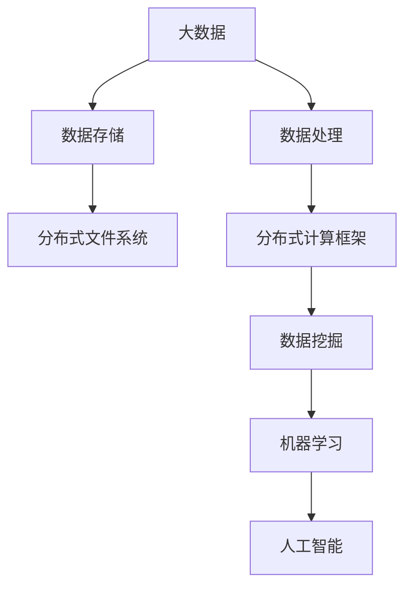
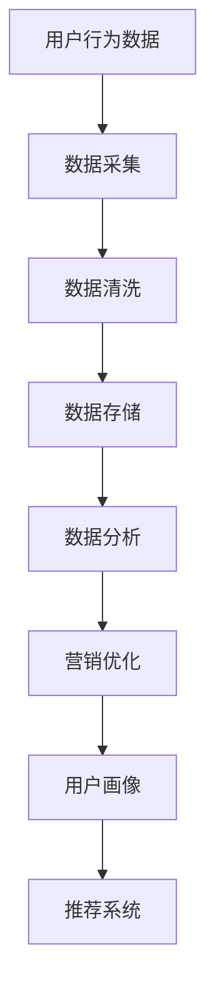
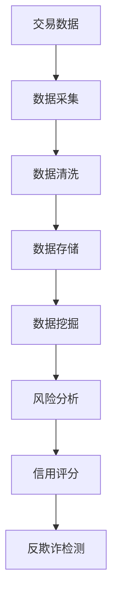
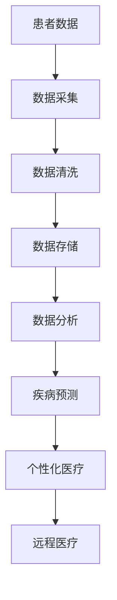

                 

### 第一部分：引言与基础

#### 第1章：大数据处理框架概述

> **关键词**：大数据处理、分布式文件系统、分布式计算框架、数据仓库、数据流处理框架

> **摘要**：本章将介绍大数据处理框架的基本概念、重要性以及相关技术发展趋势，为后续章节的技术选型与架构设计打下基础。

##### 1.1 大数据处理的重要性

**核心概念与联系**

让我们首先通过一个Mermaid流程图来理解大数据处理的核心概念及其相互关系。



**大数据处理的基本概念**

大数据处理是指对大规模、多类型的数据进行存储、处理、分析和挖掘，以提取有价值的信息和知识的过程。

**数据规模与类型**

大数据的规模通常用“4V”来描述，即：

- **Volume（数据量）**：指数据量非常庞大，例如PB级。
- **Velocity（数据速度）**：指数据生成和消费的速度非常快。
- **Variety（数据多样性）**：指数据类型多种多样，包括结构化、半结构化和非结构化数据。
- **Veracity（数据真实性）**：指数据的不确定性，真实性和可靠性是大数据处理中的重要问题。

**数据处理挑战**

大数据处理的挑战主要包括：

- **数据存储与访问**：如何高效地存储海量数据并快速访问。
- **数据处理性能**：如何提高数据处理速度和效率。
- **数据安全与隐私**：如何确保数据的安全和用户隐私。
- **数据整合与一致性**：如何整合不同来源、格式和结构的数据。

##### 1.2 大数据处理的基本概念

**基本概念介绍**

大数据处理涵盖了从数据采集、存储、处理、分析到可视化的整个流程。

**数据处理流程**

数据处理流程通常包括以下步骤：

1. **数据采集**：从各种数据源收集数据，包括数据库、日志文件、传感器数据等。
2. **数据清洗**：去除重复数据、处理缺失值和异常值。
3. **数据存储**：将清洗后的数据存储到分布式文件系统或数据仓库中。
4. **数据处理**：使用分布式计算框架对数据进行计算和分析。
5. **数据挖掘与机器学习**：提取数据中的有价值信息，构建预测模型。
6. **数据可视化**：将分析结果以图表等形式展示出来。

**大数据处理的应用领域**

大数据处理在多个领域有着广泛的应用，包括：

- **电商与社交媒体**：用户行为分析、推荐系统、广告投放优化。
- **金融与保险**：风险管理、信用评分、欺诈检测。
- **医疗与健康**：电子病历管理、医学图像分析、个性化医疗。
- **物联网与智能制造**：设备监控、生产优化、供应链管理。

##### 1.3 大数据处理的技术发展趋势

**硬件技术的发展**

随着硬件技术的进步，大数据处理的性能和效率不断提高。特别是GPU和FPGA等专用硬件的引入，使得数据处理速度大幅提升。

**软件技术的发展**

大数据处理软件技术的不断演进，如分布式计算框架（如Hadoop、Spark）和流处理框架（如Storm、Flink），使得数据处理更加高效和灵活。

**人工智能与大数据的融合**

人工智能技术在大数据处理中的应用越来越广泛，例如深度学习模型用于图像识别、自然语言处理等，使得大数据分析更加智能和精准。

##### 1.4 大数据处理的应用领域

**电商与社交媒体**

在大数据处理的帮助下，电商企业可以通过用户行为分析和推荐系统来提高销售额，社交媒体平台可以通过数据分析来优化用户体验和广告投放策略。

**金融与保险**

金融行业利用大数据技术进行风险管理、信用评分和欺诈检测，提高业务效率和安全性。保险公司则通过大数据分析来优化保险产品和定价策略。

**医疗与健康**

医疗行业利用大数据技术进行电子病历管理、医学图像分析和个性化医疗，提高医疗服务质量和效率。

**物联网与智能制造**

物联网设备产生的海量数据通过大数据处理技术进行分析，可以实现设备监控、生产优化和供应链管理，推动智能制造的发展。

**结论**

大数据处理框架在现代社会中扮演着越来越重要的角色。了解其基本概念、重要性和应用领域，将有助于我们更好地利用大数据技术解决实际问题。

## 第二部分：技术选型

#### 第2章：大数据处理技术框架

> **关键词**：分布式文件系统、分布式计算框架、数据仓库、数据流处理框架

> **摘要**：本章将深入探讨大数据处理中的关键技术框架，包括分布式文件系统、分布式计算框架、数据仓库和数据流处理框架，为读者提供技术选型的指导。

##### 2.1 分布式文件系统

**HDFS原理与架构**

HDFS（Hadoop Distributed File System）是Hadoop项目中的核心组件之一，用于存储大规模数据。以下是HDFS的原理与架构：

```python
def hdfs_architecture():
    # 伪代码描述HDFS架构
    # NameNode: 负责管理文件系统命名空间和客户端交互
    # DataNode: 负责存储实际数据块并向客户端提供服务
    pass
```

- **NameNode**：负责管理文件的元数据，如文件目录、数据块的分配和复制等。
- **DataNode**：负责存储实际的数据块，并向客户端提供数据块的读写服务。

**HDFS应用场景与优势**

HDFS适用于以下场景：

- **海量数据存储**：HDFS可以存储PB级数据，适用于大数据场景。
- **高可用性**：HDFS具有自动复制和数据备份功能，确保数据的高可用性。
- **高吞吐量**：HDFS适合大规模数据的批量处理。

**HDFS与其他分布式文件系统的比较**

与GFS（Google File System）相比，HDFS：

- **更容易实现**：HDFS是基于Java开发的，相对容易理解和实现。
- **更注重高吞吐量**：HDFS设计时更注重数据的高吞吐量，而非单个任务的性能。

与Ceph、GlusterFS等其他分布式文件系统相比，HDFS：

- **更适合大数据处理**：HDFS专为大数据处理而设计，支持数据块的分布式存储和高效访问。

##### 2.2 分布式计算框架

**MapReduce原理与架构**

MapReduce是Google提出的一种分布式数据处理模型，用于处理大规模数据集。以下是MapReduce的原理与架构：

```python
def mapreduce_pipeline(data):
    # 伪代码描述MapReduce处理流程
    # map: 对输入数据进行映射操作
    # reduce: 对映射结果进行归约操作
    pass
```

- **Map**：将输入数据分解为键值对，并对每个键值对进行映射操作。
- **Reduce**：将Map阶段生成的中间键值对进行归约操作，生成最终的输出结果。

**MapReduce应用场景与优势**

MapReduce适用于以下场景：

- **批量数据处理**：MapReduce适合处理大规模数据的批量操作，如日志分析、数据清洗等。
- **高容错性**：MapReduce具有自动故障恢复功能，确保数据处理过程的高可用性。

**MapReduce与Spark的比较**

与Spark相比，MapReduce：

- **性能较低**：Spark基于内存计算，相比基于磁盘的MapReduce，性能更高。
- **功能更丰富**：Spark不仅支持批处理，还支持实时流处理，功能更丰富。

##### 2.3 数据仓库与数据湖

**数据仓库原理与架构**

数据仓库是一种用于存储和管理大量数据的系统，用于支持数据分析和报告。以下是数据仓库的原理与架构：

```python
def data_warehouse():
    # 伪代码描述数据仓库架构
    # 数据源：包含各种数据来源，如数据库、日志文件等
    # 数据集成：将数据源中的数据集成到数据仓库中
    # 数据存储：存储经过清洗和整合的数据
    # 数据分析：对存储的数据进行分析和报告
    pass
```

**数据仓库应用场景与优势**

数据仓库适用于以下场景：

- **企业级数据管理**：数据仓库可以存储和管理大量的企业数据，支持复杂的数据分析和报告。
- **业务智能**：数据仓库支持各种业务智能应用，如销售分析、财务报表等。

**数据湖的概念与架构**

数据湖是一种用于存储原始数据的系统，不同于数据仓库对数据进行预处理和整合，数据湖保留数据的原始格式。以下是数据湖的原理与架构：

```python
def data_lake():
    # 伪代码描述数据湖架构
    # 数据源：包含各种数据来源，如数据库、日志文件等
    # 数据存储：存储原始数据，未经清洗和整合
    # 数据处理：对数据湖中的数据进行处理和转换
    # 数据分析：对处理后的数据进行分析和报告
    pass
```

**数据仓库与数据湖的比较**

数据仓库与数据湖的主要区别在于：

- **数据处理**：数据仓库在数据存储前进行预处理，数据湖则保留数据的原始格式。
- **使用场景**：数据仓库适用于业务智能和报告，数据湖适用于数据科学和机器学习。

##### 2.4 数据流处理框架

**流处理的概念与特点**

数据流处理框架用于处理实时数据流，对数据进行实时分析和处理。以下是流处理的概念与特点：

- **实时处理**：流处理框架可以对数据进行实时处理，确保数据处理的速度和及时性。
- **事件驱动**：流处理框架以事件为单位进行处理，适用于处理事件驱动的应用场景。

**Storm原理与架构**

Storm是一个开源的实时数据流处理框架，以下是Storm的原理与架构：

```python
def storm_pipeline(data_stream):
    # 伪代码描述Storm处理流程
    # Spout: 数据源，负责生成数据流
    # Bolt: 处理单元，负责对数据进行处理和分析
    pass
```

- **Spout**：生成数据流，可以是外部数据源或系统内部事件。
- **Bolt**：对数据进行处理和分析，可以是多个Bolt组成一个处理管道。

**Flink原理与架构**

Flink是一个开源的流处理和批处理框架，以下是Flink的原理与架构：

```python
def flink_pipeline(data_stream):
    # 伪代码描述Flink处理流程
    # Source: 数据源
    # Transform: 数据转换
    # Sink: 数据输出
    pass
```

- **Source**：数据源，生成数据流。
- **Transform**：数据转换，对数据进行处理和分析。
- **Sink**：数据输出，将处理结果输出到外部系统或存储。

**Storm与Flink的比较**

Storm与Flink都是流行的实时数据流处理框架，主要区别在于：

- **性能**：Flink在性能上通常优于Storm，特别是在大数据处理场景。
- **功能**：Flink不仅支持流处理，还支持批处理，功能更丰富。

##### 2.5 数据存储与索引技术

**NoSQL数据库的概念与分类**

NoSQL数据库是一种非关系型数据库，用于存储大规模的非结构化或半结构化数据。以下是NoSQL数据库的概念与分类：

- **键值存储（如Redis）**：以键值对的形式存储数据，适用于缓存和实时数据处理。
- **文档存储（如MongoDB）**：以文档的形式存储数据，支持复杂的查询和分析。
- **列存储（如HBase）**：以列簇的形式存储数据，适用于大规模数据的随机访问。
- **图数据库（如Neo4j）**：以图的形式存储数据，适用于社交网络和推荐系统。

**HBase原理与架构**

HBase是一个分布式、可扩展的大规模数据存储系统，基于Google的BigTable模型。以下是HBase的原理与架构：

```python
def hbase_architecture():
    # 伪代码描述HBase架构
    # RegionServer: 负责存储Region中的数据
    # Master: 负责管理RegionServer和HBase集群
    pass
```

- **RegionServer**：负责存储Region中的数据，可以水平扩展。
- **Master**：负责管理RegionServer和HBase集群，负责负载均衡和故障恢复。

**Elasticsearch原理与架构**

Elasticsearch是一个开源的分布式搜索引擎，适用于快速全文搜索和分析。以下是Elasticsearch的原理与架构：

```python
def elasticsearch_architecture():
    # 伪代码描述Elasticsearch架构
    # Node: Elasticsearch的运行实例
    # Cluster: 多个Node组成的集群
    # Index: 文档集合
    # Type: 文档类型
    # Document: 文档实体
    pass
```

- **Node**：Elasticsearch的运行实例，负责存储和检索数据。
- **Cluster**：多个Node组成的集群，提供高可用性和负载均衡。
- **Index**：文档集合，类似于关系数据库的表。
- **Type**：文档类型，用于分类和组织文档。
- **Document**：文档实体，以JSON格式存储。

**NoSQL数据库的应用场景与优势**

NoSQL数据库适用于以下场景：

- **大规模数据存储**：NoSQL数据库可以水平扩展，适用于存储海量数据。
- **高可用性和高性能**：NoSQL数据库具有自动故障恢复和高性能的特点。
- **灵活的数据模型**：NoSQL数据库支持非结构化或半结构化数据，具有更高的灵活性。

##### 2.6 分布式消息队列

**消息队列的概念与作用**

消息队列是一种用于异步通信和消息传递的系统，以下是消息队列的概念与作用：

- **异步通信**：消息队列可以将任务分解为多个独立的处理单元，实现异步处理。
- **解耦**：消息队列可以解耦系统的不同模块，提高系统的灵活性和可扩展性。
- **高可用性**：消息队列具有高可用性和容错性，确保消息传递的可靠性。

**Kafka原理与架构**

Kafka是一个分布式消息队列系统，适用于大规模数据流处理和实时数据处理。以下是Kafka的原理与架构：

```python
def kafka_architecture():
    # 伪代码描述Kafka架构
    # Producer: 数据生产者，负责发送消息
    # Broker: 消息代理，负责存储和转发消息
    # Consumer: 数据消费者，负责接收和消费消息
    pass
```

- **Producer**：数据生产者，负责发送消息到Kafka集群。
- **Broker**：消息代理，负责存储和转发消息，Kafka集群由多个Broker组成。
- **Consumer**：数据消费者，负责接收和消费消息。

**RabbitMQ原理与架构**

RabbitMQ是一个开源的消息队列中间件，适用于各种消息传递应用。以下是RabbitMQ的原理与架构：

```python
def rabbitmq_architecture():
    # 伪代码描述RabbitMQ架构
    # Producer: 数据生产者，负责发送消息
    # Exchange: 消息交换，负责转发消息
    # Queue: 消息队列，负责存储消息
    # Consumer: 数据消费者，负责接收和消费消息
    pass
```

- **Producer**：数据生产者，负责发送消息到RabbitMQ。
- **Exchange**：消息交换，负责根据路由规则转发消息。
- **Queue**：消息队列，负责存储消息。
- **Consumer**：数据消费者，负责接收和消费消息。

**Kafka与RabbitMQ的比较**

Kafka与RabbitMQ都是流行的消息队列系统，主要区别在于：

- **性能**：Kafka在性能上通常优于RabbitMQ，特别是在大规模数据处理场景。
- **使用场景**：Kafka适用于大数据流处理和实时数据处理，RabbitMQ适用于各种消息传递应用。

##### 2.7 数据同步与数据整合

**数据同步的概念与作用**

数据同步是将不同数据源中的数据同步到一个统一的数据存储系统中，以确保数据的一致性和完整性。以下是数据同步的概念与作用：

- **数据一致性**：数据同步确保不同数据源中的数据保持一致。
- **数据完整性**：数据同步确保数据的完整性和准确性。

**Apache Kafka在数据同步中的应用**

Apache Kafka是一种分布式流处理平台，适用于大规模数据同步。以下是Apache Kafka在数据同步中的应用：

- **数据采集**：Kafka可以采集来自不同数据源的数据，如数据库、日志文件等。
- **数据传输**：Kafka将采集到的数据传输到一个统一的数据存储系统中，如数据仓库或数据湖。
- **数据整合**：Kafka支持数据的实时整合和批量处理，确保数据的一致性和完整性。

**数据整合工具**

以下是一些常用的数据整合工具：

- **Apache NiFi**：用于自动化数据流和数据整合。
- **Apache Spark**：用于大规模数据处理和数据整合。
- **Talend**：提供丰富的数据整合功能。

**数据同步与数据整合的挑战**

数据同步与数据整合面临的挑战包括：

- **数据一致性**：如何确保数据在不同数据源之间的一致性。
- **数据准确性**：如何确保数据的准确性和完整性。
- **性能优化**：如何优化数据同步和整合的性能。

### 第三部分：架构设计

#### 第3章：大数据处理架构设计原则

> **关键词**：大数据处理架构、设计原则、生命周期管理、可扩展性与容错性设计

> **摘要**：本章将探讨大数据处理架构设计的基本原则，包括生命周期管理、可扩展性与容错性设计，为构建高效、可靠的大数据处理系统提供指导。

##### 3.1 大数据处理架构设计的基本原则

**模块化**

模块化是将系统划分为多个独立的模块，每个模块负责特定的功能。模块化具有以下优点：

- **易于维护**：模块化使系统更易于维护和扩展。
- **降低耦合**：模块化降低不同模块之间的耦合度，提高系统的灵活性。
- **代码复用**：模块化可以促进代码复用，减少重复工作。

**分布式**

分布式是将系统划分为多个分布式节点，每个节点负责一部分功能。分布式具有以下优点：

- **高可用性**：分布式系统具有自动故障恢复能力，提高系统的可用性。
- **可扩展性**：分布式系统可以水平扩展，以应对不断增加的数据量和用户需求。
- **负载均衡**：分布式系统可以实现负载均衡，提高系统的性能和响应速度。

**弹性**

弹性是指系统在面临动态负载变化时，能够自动调整资源分配，保持性能稳定。弹性具有以下优点：

- **动态资源分配**：弹性系统可以根据负载变化动态调整资源分配，提高资源利用率。
- **性能优化**：弹性系统可以自动优化性能，确保系统在高负载情况下仍能保持高效运行。
- **用户体验**：弹性系统可以提高用户体验，确保系统的响应速度和稳定性。

**安全性**

安全性是指系统在处理数据时，能够防止数据泄露、篡改和未授权访问。安全性具有以下优点：

- **数据保护**：安全性确保数据在存储、传输和处理过程中得到保护。
- **合规性**：安全性符合相关法律法规和行业标准，确保企业的合规运营。
- **信任与声誉**：安全性可以增强用户对系统的信任，提高企业的声誉。

**可扩展性与容错性设计**

**可扩展性设计**

可扩展性设计是指系统能够适应不断增长的数据量和用户需求，确保系统性能和稳定性。可扩展性设计包括以下几个方面：

- **水平扩展**：通过增加节点数量来提高系统处理能力。
- **垂直扩展**：通过提高节点性能（如增加CPU、内存等）来提高系统处理能力。
- **负载均衡**：通过负载均衡器来分配请求，确保系统资源得到充分利用。
- **动态资源管理**：通过自动化资源管理，确保系统在负载变化时能够动态调整资源分配。

**容错性设计**

容错性设计是指系统在面临故障时，能够自动恢复，确保系统持续运行。容错性设计包括以下几个方面：

- **数据冗余**：通过数据冗余来确保数据不丢失，提高系统的可靠性。
- **故障检测**：通过故障检测机制来及时发现故障，并进行故障恢复。
- **自动恢复**：通过自动恢复机制来自动恢复系统故障，减少系统停机时间。
- **备份与恢复**：通过备份和恢复机制来确保系统在故障发生时能够快速恢复。

**架构设计的生命周期管理**

**需求分析**

在架构设计阶段，首先需要进行分析和需求分析，明确系统的功能、性能和安全要求。需求分析包括以下几个方面：

- **业务需求**：了解系统的业务目标和应用场景，确保系统设计符合业务需求。
- **技术需求**：了解系统所需的技术栈和硬件资源，确保系统具备良好的性能和扩展性。
- **安全需求**：了解系统的安全要求和合规性要求，确保系统的安全性。

**架构设计**

在需求分析的基础上，进行架构设计。架构设计包括以下几个方面：

- **模块划分**：将系统划分为多个模块，明确各模块的功能和接口。
- **数据流设计**：设计系统的数据流，确保数据能够高效、可靠地流动。
- **接口设计**：设计系统的接口，确保模块之间能够无缝集成。
- **性能优化**：设计系统的性能优化策略，确保系统在高负载情况下仍能保持高效运行。

**实现与部署**

在架构设计完成后，进行系统的实现与部署。实现与部署包括以下几个方面：

- **编码**：根据架构设计进行系统编码，实现各模块的功能。
- **测试**：对系统进行测试，确保系统功能正确、性能稳定和安全可靠。
- **部署**：将系统部署到生产环境中，确保系统能够稳定运行。

**维护与优化**

在系统上线后，进行维护与优化。维护与优化包括以下几个方面：

- **故障处理**：及时处理系统故障，确保系统持续稳定运行。
- **性能优化**：对系统进行性能优化，提高系统的性能和响应速度。
- **安全加固**：对系统进行安全加固，确保系统的安全性。
- **功能升级**：根据用户需求和业务发展，对系统进行功能升级和扩展。

**结论**

大数据处理架构设计是一个复杂的过程，需要充分考虑系统的需求、性能、安全和可扩展性。通过遵循基本设计原则和生命周期管理，可以构建出高效、可靠的大数据处理系统，为企业的业务发展提供有力支持。

## 第四部分：大数据处理系统的性能优化

#### 第4章：大数据处理系统的性能优化

> **关键词**：性能优化、数据倾斜、性能监控与调优**

> **摘要**：本章将探讨大数据处理系统中性能优化的关键要素，包括数据倾斜问题分析、性能优化策略与方法，以及系统的性能监控与调优，帮助读者提升大数据处理系统的效率。

##### 4.1 性能优化策略与方法

**数据倾斜问题分析**

在分布式大数据处理系统中，数据倾斜（Data Skew）是一个常见且严重的问题。数据倾斜会导致某些节点负载过高，而其他节点负载较低，从而影响系统的整体性能。以下是数据倾斜的问题及其分析方法：

- **原因**：数据倾斜可能是由于数据分布不均匀、数据量差异较大或处理逻辑不同导致的。
- **影响**：数据倾斜会导致任务执行时间延长，系统资源利用率降低，甚至可能导致任务失败。

**分析方法**：

- **数据量分析**：通过统计每个节点处理的数据量，找出数据量差异较大的节点。
- **处理时间分析**：通过监控每个节点的处理时间，找出处理时间差异较大的节点。
- **数据处理逻辑分析**：分析数据处理逻辑，找出可能导致数据倾斜的环节。

**性能优化策略**

针对数据倾斜问题，可以采取以下性能优化策略：

- **数据预处理**：在数据处理前，对数据进行预处理，尽量平衡数据分布。
- **负载均衡**：使用负载均衡技术，合理分配任务到各个节点。
- **动态调整**：在任务执行过程中，动态调整任务的分配，以应对数据倾斜的变化。

**性能优化方法**

- **并行化**：通过并行化技术，将任务分解为多个子任务，并行执行。
- **缓存**：使用缓存技术，减少数据读取和写入的开销。
- **索引**：使用索引技术，提高数据查询的效率。
- **压缩**：使用数据压缩技术，减少数据传输和存储的开销。

**案例**：数据预处理

假设在一个大数据处理任务中，数据源的数据分布不均匀，导致某些节点的数据量远大于其他节点。为了解决这个问题，可以采取以下数据预处理步骤：

1. **数据拆分**：将大文件拆分为多个小文件，确保每个文件的数据量相近。
2. **数据采样**：对数据进行采样，找出数据分布不均匀的部分。
3. **数据重排**：根据采样结果，对数据进行重排，使得每个节点的数据量更均匀。

##### 4.2 数据倾斜与性能问题分析

**数据倾斜的具体案例**

假设在MapReduce任务中，Map阶段生成的中间数据分布不均匀，导致某些Reduce任务的负载远大于其他任务。以下是一个具体案例：

- **Map输出数据分布**：有100个Map任务，其中50个任务的输出数据量远大于其他任务。
- **Reduce任务负载**：对应的50个Reduce任务的负载远大于其他Reduce任务。

**性能问题分析**

1. **负载分析**：通过监控系统的负载，发现部分节点的负载远高于其他节点。
2. **处理时间分析**：通过分析处理时间，发现数据倾斜的节点处理时间较长。
3. **任务失败分析**：发现数据倾斜的节点可能因为负载过高而任务失败。

**解决方案**

- **负载均衡**：通过负载均衡技术，重新分配任务，使得各节点的负载更加均匀。
- **动态调整**：在任务执行过程中，根据负载情况动态调整任务的分配。

##### 4.3 系统性能监控与调优

**性能监控的重要性**

性能监控是保证大数据处理系统稳定运行的关键。通过性能监控，可以及时发现系统性能问题，并进行优化。

**性能监控指标**

- **CPU利用率**：监控CPU的利用率，确保系统资源得到充分利用。
- **内存使用率**：监控内存的使用率，防止内存溢出。
- **磁盘I/O**：监控磁盘的读写性能，确保数据存储和访问的效率。
- **网络带宽**：监控网络带宽的使用情况，确保数据传输的效率。
- **任务处理时间**：监控任务的执行时间，确保系统性能。

**性能监控工具**

- **Grafana**：用于可视化性能监控数据。
- **Prometheus**：用于收集和存储性能监控数据。
- **Zabbix**：用于实时监控系统的各种性能指标。

**性能调优方法**

1. **性能瓶颈定位**：通过监控数据，定位系统性能瓶颈。
2. **资源调整**：根据性能瓶颈，调整系统资源（如CPU、内存、磁盘等）。
3. **算法优化**：优化数据处理算法，提高系统的处理效率。
4. **负载均衡**：优化负载均衡策略，确保系统资源得到充分利用。

**案例**：负载均衡策略优化

假设在一个分布式数据处理系统中，部分节点的负载远高于其他节点。以下是一个负载均衡策略优化的案例：

1. **负载监控**：通过监控发现节点A的负载远高于其他节点。
2. **负载均衡调整**：通过负载均衡器，将部分任务从节点A重新分配到其他节点。
3. **性能监控**：监控调整后的系统性能，确保负载更加均匀。

**结论**

性能优化是大数据处理系统中的重要环节。通过分析数据倾斜、监控系统性能，并采取相应的优化策略，可以显著提升大数据处理系统的效率。持续的性能监控和调优，有助于确保系统在高负载情况下仍能保持高效稳定运行。

## 第五部分：大数据处理系统的安全性保障

#### 第5章：大数据处理系统的安全性保障

> **关键词**：大数据处理安全、安全性需求、安全性设计原则、数据加密、访问控制策略**

> **摘要**：本章将讨论大数据处理系统的安全性保障，包括安全性需求、设计原则、数据加密和访问控制策略，以确保系统的数据安全、完整性和合规性。

##### 5.1 大数据处理系统的安全性需求

在大数据处理系统中，安全性需求至关重要，主要包括以下几个方面：

**数据保密性**

确保数据在传输和存储过程中的保密性，防止未授权的访问和泄露。

**数据完整性**

确保数据在传输和存储过程中的完整性，防止数据被篡改或损坏。

**数据可用性**

确保数据在系统正常运行时的可用性，防止因故障或攻击导致数据丢失或不可访问。

**身份认证**

确保系统能够对用户进行有效的身份认证，防止未授权的用户访问系统。

**访问控制**

根据用户角色和权限，对系统资源进行访问控制，确保用户只能访问其有权访问的资源。

**审计与监控**

对系统的访问和操作进行审计和监控，及时发现和响应安全事件。

**合规性**

确保系统符合相关法律法规和行业标准，如数据保护法规、信息安全标准等。

##### 5.2 安全性设计原则

为了保证大数据处理系统的安全性，设计时需遵循以下原则：

**最小权限原则**

用户和程序只能访问其必要的最小权限，以减少潜在的安全风险。

**最小泄露原则**

在数据传输和存储过程中，只泄露必要的数据，减少信息泄露的风险。

**安全多级隔离**

通过多层次的安全隔离机制，如网络隔离、主机隔离等，防止不同安全级别的数据互相干扰。

**数据加密**

使用加密技术对数据进行加密存储和传输，防止未授权访问和数据泄露。

**访问控制**

根据用户角色和权限，对系统资源进行严格的访问控制，防止未授权访问。

**安全审计**

定期进行安全审计，确保系统安全策略的有效性和完整性。

**应急响应**

建立应急响应机制，及时处理和响应安全事件，减少损失。

##### 5.3 安全性设计原则与实践

**数据加密**

数据加密是保障数据安全的重要手段。在大数据处理系统中，可以对数据进行以下加密处理：

- **存储加密**：对存储在磁盘上的数据进行加密，防止数据泄露。
- **传输加密**：对传输中的数据进行加密，如使用HTTPS协议进行数据传输。
- **加密算法**：选择合适的加密算法，如AES、RSA等，确保数据加密的强度和效率。

**访问控制**

访问控制可以防止未授权的用户访问系统资源和数据。以下是一些访问控制的方法：

- **基于角色的访问控制（RBAC）**：根据用户的角色和权限分配访问权限。
- **基于属性的访问控制（ABAC）**：根据用户的属性（如部门、职位等）分配访问权限。
- **访问控制列表（ACL）**：为每个资源设置访问控制列表，定义用户的访问权限。
- **多因素认证**：结合密码、指纹、短信验证码等多种认证方式，提高认证的安全性。

**数据备份与恢复**

数据备份与恢复是保障数据可用性的关键措施。以下是一些数据备份与恢复的方法：

- **本地备份**：在本地磁盘或网络存储设备上进行数据备份。
- **远程备份**：将数据备份到远程数据中心或云存储服务。
- **增量备份**：只备份数据的变化部分，减少备份时间和存储空间。
- **恢复策略**：制定数据恢复计划，确保在数据丢失或损坏时能够快速恢复。

**安全审计**

安全审计是确保系统安全性和合规性的重要手段。以下是一些安全审计的方法：

- **日志记录**：记录系统操作的日志，如用户登录、数据访问等。
- **审计分析**：定期分析日志数据，发现潜在的安全事件和异常行为。
- **合规性检查**：检查系统是否符合相关法律法规和行业标准。

**应急响应**

应急响应是处理安全事件的关键。以下是一些应急响应的措施：

- **应急响应计划**：制定应急响应计划，明确应急响应的步骤和责任。
- **应急演练**：定期进行应急演练，提高应急响应的能力。
- **事件响应**：及时发现和处理安全事件，减少损失和影响。

##### 5.4 数据加密与访问控制策略

**数据加密策略**

- **数据加密算法**：使用强加密算法，如AES-256，确保数据在传输和存储过程中的安全性。
- **数据加密存储**：对存储在磁盘上的数据进行加密，确保数据在物理损坏或非法访问时不会被泄露。
- **数据加密传输**：使用HTTPS等加密协议进行数据传输，防止数据在传输过程中被截获或篡改。

**访问控制策略**

- **用户认证**：使用强密码和多因素认证，确保用户身份的真实性。
- **角色与权限管理**：根据用户的角色和职责分配访问权限，确保用户只能访问其需要的资源。
- **最小权限原则**：用户和程序只拥有完成其任务所必需的最低权限。
- **审计与监控**：对用户的访问和操作进行审计和监控，及时发现和响应异常行为。

**结论**

大数据处理系统的安全性是确保数据安全、完整性和合规性的关键。通过遵循安全性设计原则，实施数据加密和访问控制策略，以及建立完善的备份与恢复、安全审计和应急响应机制，可以大幅提高大数据处理系统的安全性。持续的安全监控和改进，有助于确保系统在面对各种安全威胁时能够保持稳定和可靠。

## 第六部分：案例分析

#### 第6章：大数据处理框架的实际应用

> **关键词**：大数据处理框架、实际应用、案例研究**

> **摘要**：本章将通过几个具体案例，展示大数据处理框架在电商、金融和医疗等领域的实际应用，分析案例中的技术实现和解决方案，为读者提供实际操作和借鉴。

##### 6.1 案例一：电商大数据处理

**背景介绍**

电商行业是一个高度依赖数据驱动的领域，通过对海量用户行为数据的分析，电商企业可以优化营销策略、提高客户体验和提升销售额。

**核心概念与联系**

通过Mermaid流程图，我们可以直观地了解电商大数据处理的核心概念和联系：



**技术实现**

- **数据采集**：通过网站日志、点击流数据和用户反馈等途径收集用户行为数据。
- **数据清洗**：使用Hadoop和Spark对数据进行清洗，去除重复数据、处理缺失值和异常值。
- **数据存储**：将清洗后的数据存储在HDFS和HBase中，确保数据的可靠性和高效访问。
- **数据分析**：使用MapReduce和Spark对数据进行分析，提取用户行为特征和购买偏好。
- **营销优化**：基于分析结果，优化广告投放和促销活动，提高营销效果。
- **用户画像**：构建用户画像，用于个性化推荐和精准营销。
- **推荐系统**：利用机器学习和深度学习技术，构建推荐系统，提高用户满意度和转化率。

**解决方案**

- **数据仓库与数据湖**：结合使用数据仓库和数据湖，实现对用户行为数据的全面管理和高效分析。
- **实时流处理**：使用Apache Kafka和Flink进行实时数据流处理，实时反馈用户行为，优化营销策略。
- **机器学习平台**：搭建机器学习平台，支持数据科学家进行模型训练和预测分析。

**项目小结**

电商大数据处理案例展示了如何通过大数据技术提升营销效果和用户满意度。通过数据采集、清洗、存储、分析和优化，电商企业能够更好地理解用户需求，提供个性化的服务和产品推荐。

##### 6.2 案例二：金融行业数据处理

**背景介绍**

金融行业对数据处理的准确性、实时性和安全性要求极高，通过大数据技术，金融机构可以提升风险管理能力、优化业务流程和提升客户体验。

**核心概念与联系**

金融行业数据处理的核心概念和联系可以用以下Mermaid流程图表示：



**技术实现**

- **数据采集**：通过交易所、支付系统、银行系统等收集海量交易数据。
- **数据清洗**：使用Hadoop和Spark对交易数据进行分析和清洗，去除重复数据、处理缺失值和异常值。
- **数据存储**：将清洗后的数据存储在HDFS和HBase中，确保数据的可靠性和高效访问。
- **数据挖掘**：使用MapReduce和Spark进行数据挖掘，提取交易行为特征和风险指标。
- **风险分析**：利用机器学习和统计模型进行风险分析，预测潜在风险和欺诈行为。
- **信用评分**：根据交易行为和风险分析结果，为用户生成信用评分。
- **反欺诈检测**：使用实时流处理技术，对交易进行实时监控和检测，发现和阻止欺诈行为。

**解决方案**

- **分布式计算框架**：使用分布式计算框架（如Spark和MapReduce），提升数据处理速度和效率。
- **实时流处理**：使用Apache Kafka和Flink进行实时数据流处理，确保交易数据的实时性和准确性。
- **机器学习平台**：搭建机器学习平台，支持数据科学家进行模型训练和预测分析。

**项目小结**

金融行业数据处理案例展示了如何利用大数据技术提升风险管理能力和客户服务质量。通过数据采集、清洗、存储、挖掘和分析，金融机构能够更好地理解市场动态和用户行为，提供更加精准和安全的金融服务。

##### 6.3 案例三：医疗数据处理

**背景介绍**

医疗行业是一个高度依赖数据驱动的领域，通过大数据技术，医疗机构可以提高诊疗质量、优化业务流程和提升患者体验。

**核心概念与联系**

医疗数据处理的核心概念和联系可以用以下Mermaid流程图表示：



**技术实现**

- **数据采集**：通过电子病历、医学影像、健康监测设备等收集海量患者数据。
- **数据清洗**：使用Hadoop和Spark对医疗数据进行清洗，去除重复数据、处理缺失值和异常值。
- **数据存储**：将清洗后的数据存储在HDFS和HBase中，确保数据的可靠性和高效访问。
- **数据分析**：使用MapReduce和Spark进行数据分析，提取疾病预测模型和个性化医疗方案。
- **疾病预测**：利用机器学习和深度学习技术，构建疾病预测模型，提前预警疾病风险。
- **个性化医疗**：根据患者的基因、病史和实时监测数据，提供个性化的医疗方案。
- **远程医疗**：通过大数据平台，实现医生与患者的远程互动和诊疗。

**解决方案**

- **医疗数据集成**：将不同来源的医疗数据整合到一个统一的平台上，确保数据的全面性和一致性。
- **实时流处理**：使用Apache Kafka和Flink进行实时数据流处理，确保医疗数据的实时性和准确性。
- **深度学习平台**：搭建深度学习平台，支持医学图像分析和疾病预测模型的训练。

**项目小结**

医疗数据处理案例展示了如何利用大数据技术提升医疗服务的质量和效率。通过数据采集、清洗、存储、分析和预测，医疗机构能够更好地理解患者需求和疾病趋势，提供个性化、高质量的医疗服务。

### 6.4 大数据处理框架的发展趋势

**未来趋势**

- **云计算与大数据的融合**：随着云计算技术的发展，大数据处理将更加依赖于云基础设施，实现更高效、灵活的数据处理能力。
- **边缘计算**：随着物联网和5G技术的普及，边缘计算将使数据处理更加靠近数据源头，提高实时性和响应速度。
- **人工智能与大数据的结合**：人工智能技术将更加深入地融入大数据处理，实现自动化、智能化的数据处理和分析。
- **数据隐私与安全**：随着数据隐私和安全问题的日益突出，大数据处理将更加注重数据保护，采用更先进的技术和策略确保数据安全。

### 6.5 大数据处理技术的创新与应用

**创新方向**

- **图数据库**：图数据库在社交网络和推荐系统中的应用，将使数据处理和分析更加高效。
- **区块链**：区块链技术在数据存储、共享和隐私保护中的应用，将提升大数据处理的透明度和安全性。
- **量子计算**：量子计算在数据处理和分析中的潜在应用，将大幅提高数据处理速度和效率。

**应用领域**

- **智慧城市**：通过大数据技术，实现城市交通、环境、公共安全等领域的智能化管理和优化。
- **智能医疗**：通过大数据技术和人工智能，实现疾病的早期诊断、精准治疗和个性化医疗。
- **智能制造**：通过大数据技术，实现生产过程的智能化优化和设备故障预测，提高生产效率和质量。

### 6.6 结论

大数据处理框架在实际应用中展现出强大的潜力和广泛的应用前景。通过不断的技术创新和应用拓展，大数据处理技术将继续推动各行各业的数字化转型和创新发展。了解和应用大数据处理技术，将成为企业和组织获取竞争优势的重要途径。

### 附录

#### 附录A：常用大数据处理技术汇总

> **关键词**：大数据处理技术、汇总、技术选型参考指南

> **摘要**：本附录将对常用的大数据处理技术进行汇总，并提供技术选型参考指南，帮助读者更好地理解和选择合适的大数据处理技术。

**A.1 常用大数据处理技术列表**

1. **分布式文件系统**
   - **HDFS（Hadoop Distributed File System）**：用于存储海量数据，支持高吞吐量数据访问。
   - **Ceph**：开源分布式存储系统，支持块存储、文件存储和对象存储。
   - **GlusterFS**：分布式文件系统，支持文件级和块级存储。

2. **分布式计算框架**
   - **MapReduce**：Google提出的分布式数据处理模型，适用于批量数据处理。
   - **Spark**：内存计算框架，支持批处理和实时流处理，性能优于MapReduce。
   - **Flink**：流处理和批处理框架，支持低延迟和高吞吐量数据处理。

3. **数据仓库与数据湖**
   - **Hive**：基于Hadoop的数据仓库工具，用于数据分析和报表。
   - **HBase**：基于Hadoop的分布式列存储数据库，适用于海量数据的随机访问。
   - **Alluxio**：虚拟分布式存储层，加速大数据处理速度。

4. **数据流处理框架**
   - **Storm**：分布式实时数据流处理框架，适用于实时计算和机器学习。
   - **Flink**：支持流处理和批处理，适用于复杂实时数据处理。
   - **Kafka**：分布式流处理平台，用于数据收集和实时处理。

5. **数据存储与索引技术**
   - **MongoDB**：文档型NoSQL数据库，支持高扩展性和灵活的数据模型。
   - **Elasticsearch**：开源分布式搜索引擎，适用于全文搜索和分析。
   - **Redis**：键值存储数据库，适用于高速缓存和数据共享。

6. **分布式消息队列**
   - **RabbitMQ**：开源消息队列中间件，支持多种消息传递模式。
   - **Kafka**：分布式消息队列系统，适用于大数据处理和实时数据处理。
   - **Pulsar**：分布式消息传递系统，支持高吞吐量和多语言客户端。

**A.2 技术选型参考指南**

**1. 根据数据处理需求选型**

- **数据量**：如果数据量较大，建议使用分布式文件系统（如HDFS、Ceph）和分布式计算框架（如Spark、Flink）。
- **数据处理速度**：对于实时数据处理需求，选择流处理框架（如Storm、Flink）更为合适。
- **数据处理模式**：如果主要处理批量数据，选择MapReduce或Spark更为合适；如果需要同时处理批处理和实时流数据，建议选择Flink。

**2. 根据应用场景选型**

- **电商与社交媒体**：选择支持复杂查询和数据实时处理的框架（如Spark、Elasticsearch）。
- **金融与保险**：选择支持高可靠性和高安全性的框架（如HBase、RabbitMQ）。
- **医疗与健康**：选择支持大规模数据和复杂计算的医疗专用数据仓库和框架（如Hive、Alluxio）。

**3. 根据技术栈选型**

- **开源生态**：如果项目已经在开源生态中，可以选择与现有技术栈兼容的框架（如Apache Hadoop生态中的组件）。
- **企业级支持**：如果需要企业级支持，可以考虑使用商业化的解决方案（如Cloudera、Hortonworks）。

**4. 根据性能和成本考虑**

- **性能需求**：根据项目的性能需求选择合适的框架，如需要高性能计算可以选择GPU加速的框架。
- **成本预算**：考虑整体解决方案的成本，包括硬件、软件和运维成本，选择性价比高的方案。

通过以上技术选型参考指南，读者可以根据具体需求和场景选择合适的大数据处理技术，构建高效、可靠的大数据处理系统。不断关注新技术的发展和应用，有助于优化选型策略，提高数据处理能力和效率。

---

**作者：AI天才研究院/AI Genius Institute & 禅与计算机程序设计艺术 /Zen And The Art of Computer Programming**

