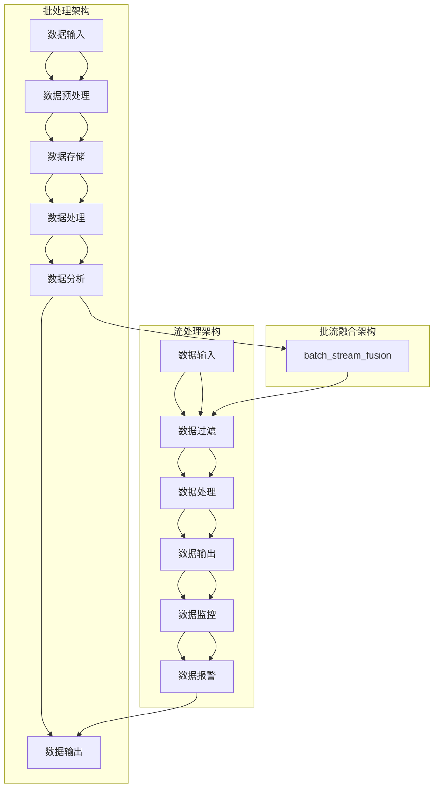

                 


### 大数据处理框架：从批处理到流处理

#### 关键词：
大数据处理、批处理、流处理、框架、MapReduce、Kafka、Flink、Spark、批流融合

#### 摘要：
本文详细探讨了大数据处理框架的发展，从传统的批处理模式到现代的流处理技术，深入分析了批处理与流处理的架构、原理、算法及其在实际应用中的融合。通过对比分析，揭示了不同处理框架的优势与局限性，为大数据处理的实际应用提供了理论指导和实践参考。

---

## 第一部分：大数据处理基础

### 第1章：大数据处理概述

#### 1.1 大数据的定义与特征

大数据（Big Data）通常指的是数据量巨大、数据类型多样、数据生成速度快的海量数据集合。其特征主要包括：

- **数据量的巨大性**：大数据的规模通常在PB（拍字节）级别以上，甚至是EB（艾字节）级别。
- **数据类型的多样性**：大数据不仅包括结构化数据，如数据库中的记录，还包括非结构化数据，如图像、音频、视频等。
- **数据生成的实时性**：现代应用场景中，数据生成速度非常快，例如社交网络、在线交易等。
- **数据价值的密度低**：大数据中真正有价值的信息往往占比很小，如何从中提取有价值的信息是大数据处理的挑战之一。

#### 1.2 大数据处理的需求与挑战

大数据处理的需求主要源于以下几个方面：

- **数据存储与管理的挑战**：需要高效、可扩展的数据存储方案。
- **数据处理速度的需求**：随着数据量的增长，如何快速处理海量数据成为关键问题。
- **数据一致性与可靠性的保证**：在大规模数据处理中，数据的一致性与可靠性是必须保证的。
- **数据隐私与安全性的问题**：在处理大数据的过程中，如何保护数据隐私和安全是一个重要课题。

大数据处理的挑战包括：

- **计算资源的调度与优化**：如何高效利用分布式计算资源。
- **数据处理算法的创新**：需要不断优化和创新的算法来提高数据处理效率。
- **数据质量的保障**：确保数据在采集、传输、存储、处理过程中的质量。

### 第2章：批处理架构与技术

#### 2.1 批处理流程

批处理（Batch Processing）是一种数据处理方式，它将数据分为多个批次进行处理。批处理流程通常包括以下几个步骤：

1. **数据采集**：将数据从各种来源（如数据库、文件系统等）收集到一起。
2. **数据预处理**：清洗、转换和整合数据，使其适合后续处理。
3. **数据存储**：将预处理后的数据存储到临时存储中，以便后续处理。
4. **数据处理**：对存储的数据进行计算、分析等操作。
5. **数据分析**：对处理结果进行进一步分析，生成报告或可视化展示。

#### 2.2 批处理框架：MapReduce

MapReduce是一种分布式数据处理模型，由Google提出。它适用于大规模数据的批处理，具有高扩展性和容错性。

- **Map阶段**：对输入数据进行映射，生成中间结果。
  ```python
  def map(data):
      # 对数据进行映射操作
      return key, value
  ```

- **Reduce阶段**：对Map阶段生成的中间结果进行归约，生成最终结果。
  ```python
  def reduce(key, values):
      # 对中间结果进行归约操作
      return output
  ```

#### 2.3 批处理优化技术

批处理优化技术主要包括以下几个方面：

1. **数据倾斜处理**：解决数据分布不均匀的问题，避免部分任务负载过高。
2. **资源调度优化**：合理分配计算资源，提高处理效率。
3. **并行化处理**：通过并行计算提高处理速度。

---

## 第二部分：流处理架构与技术

### 第3章：流处理概述

#### 3.1 流处理的定义与特征

流处理（Stream Processing）是一种实时数据处理技术，它适用于处理实时数据流。流处理的特征包括：

- **实时数据处理**：能够快速处理实时数据，满足低延迟的要求。
- **无限数据流处理**：能够持续处理无限流数据，不依赖于数据采集时间。
- **低延迟数据处理**：通常能够保证在毫秒级别处理数据。

#### 3.2 流处理的场景与应用

流处理广泛应用于以下场景：

- **实时监控与报警**：实时监控系统状态，及时报警。
- **实时数据处理与查询**：实时处理和分析数据，提供实时查询服务。
- **实时推荐系统**：根据实时用户行为，提供个性化推荐。

### 第4章：实时数据处理框架

#### 4.1 流处理框架：Apache Kafka

Apache Kafka是一种分布式流处理平台，主要用于构建实时数据流处理应用。其架构包括以下几个部分：

- **生产者**：产生数据的组件。
- **主题**：数据分类的标签，类似于消息队列中的队列。
- **消费者**：消费数据的组件。

#### 4.2 流处理框架：Apache Flink

Apache Flink是一种分布式流处理框架，适用于构建复杂实时数据处理应用。其核心特性包括：

- **有状态流处理**：能够处理有状态的数据流。
- **事件驱动模型**：基于事件驱动的处理方式。
- **流与批的统一**：支持流处理和批处理，能够灵活切换。

#### 4.3 流处理框架：Apache Storm

Apache Storm是一种分布式实时计算系统，适用于构建实时数据处理应用。其特点包括：

- **高可靠性**：支持自动故障转移和恢复。
- **低延迟**：能够快速处理实时数据流。
- **动态资源管理**：能够动态调整计算资源。

### 第5章：流处理优化技术

#### 5.1 数据倾斜处理

数据倾斜处理是流处理中常见的问题，主要技术包括：

- **分区策略**：合理分配数据到各个分区，避免数据倾斜。
- **重平衡**：在数据倾斜时，动态调整分区，重新分配数据。

#### 5.2 窗口处理

窗口处理是将无限数据流划分为有限大小的窗口，进行数据处理。主要技术包括：

- **时间窗口**：基于时间间隔划分窗口。
- **计数窗口**：基于数据条数划分窗口。

#### 5.3 状态管理

状态管理是流处理中的重要技术，主要包括：

- **有状态流处理**：能够保存和处理历史数据。
- **状态更新**：实时更新和保存状态数据。

---

## 第三部分：批处理与流处理的融合

### 第6章：批流融合架构与技术

#### 6.1 批流融合的概念与原理

批流融合（Batch-Stream Fusion）是一种将批处理和流处理结合的架构，旨在利用批处理的效率和流处理的实时性。其原理主要包括：

- **混合处理模型**：同时处理批数据和流数据。
- **资源共享**：共享计算资源和存储资源。

#### 6.2 批流融合框架：Apache Spark

Apache Spark是一种分布式计算框架，支持批处理和流处理。其特点包括：

- **统一处理模型**：支持批处理和流处理，灵活切换。
- **高吞吐量**：能够处理大规模数据集。
- **低延迟**：支持实时数据处理。

### 第7章：批流融合应用案例

#### 7.1 案例一：电商销售数据分析

电商销售数据分析是一个典型的批流融合应用场景。可以通过批处理进行历史数据分析，通过流处理实时监控销售情况。

#### 7.2 案例二：实时广告投放优化

实时广告投放优化需要实时分析用户行为，优化广告投放策略。可以通过批处理分析用户历史行为，通过流处理实时调整广告投放。

---

## 附录

### 附录A：大数据处理工具与资源

- **Hadoop生态系统**：包括HDFS、YARN、MapReduce等。
- **Spark生态系统**：包括Spark SQL、Spark Streaming、MLlib等。
- **Kafka生态系统**：包括Kafka、Kafka Streams、Kafka Connect等。
- **数据处理开源项目推荐**：如Apache Flink、Apache Storm、Apache Beam等。

---

### 作者：

作者：AI天才研究院/AI Genius Institute & 禅与计算机程序设计艺术 /Zen And The Art of Computer Programming

---

在接下来的章节中，我们将详细探讨批处理与流处理的技术细节，包括架构设计、核心算法、优化策略等，帮助读者深入理解大数据处理框架的原理和实践。通过这些内容，读者将能够更好地应对大数据处理的挑战，提高数据处理效率和质量。

---

## 批处理与流处理的架构设计比较

在探讨大数据处理的架构设计时，我们需要比较批处理和流处理的架构，了解它们各自的优缺点，以及如何在不同的应用场景中合理选择和使用。

### 批处理架构

批处理架构是一种传统的数据处理方式，其主要特点是在特定时间窗口内，将一批数据加载到计算系统中进行处理。这种架构的优点包括：

1. **高效的数据处理**：批处理能够处理大规模数据集，利用并行计算和分布式处理技术，提高数据处理效率。
2. **易扩展性**：批处理架构可以通过增加计算节点来扩展处理能力，适合处理数据规模不断增长的情况。
3. **稳定性**：批处理在处理数据时，可以充分利用计算资源的空闲时间，提高系统的稳定性。

然而，批处理架构也存在一些局限性：

1. **处理延迟**：由于需要等待特定时间窗口的数据集积累到一定程度后才能处理，因此批处理通常存在一定的延迟。
2. **实时性较差**：批处理不适合处理需要实时反馈的数据，如实时监控、实时推荐等。
3. **数据一致性**：在批处理过程中，可能会出现部分数据丢失或重复处理的问题，影响数据的一致性。

### 流处理架构

流处理架构是一种基于数据流的实时数据处理方式，其特点是对数据流进行实时处理，以毫秒级别的低延迟响应。流处理架构的优点包括：

1. **实时性**：流处理能够实时处理数据，满足低延迟的应用需求，如实时监控、实时推荐等。
2. **低延迟**：流处理通常能够在毫秒级别处理数据，相比批处理具有更高的响应速度。
3. **一致性**：流处理通过持续处理数据流，能够保证数据的一致性，减少数据丢失或重复处理的问题。

然而，流处理架构也存在一些局限性：

1. **数据处理复杂度**：流处理需要处理无限流数据，相比批处理，其处理复杂度更高，需要设计更复杂的算法和架构。
2. **资源管理**：流处理需要动态调整计算资源，以应对数据流的不稳定性和负载波动。
3. **容错性**：流处理在处理实时数据时，可能会出现数据丢失或处理失败的情况，需要设计高效的容错机制。

### 批处理与流处理的融合

为了充分利用批处理和流处理的优点，同时克服它们的局限性，批流融合（Batch-Stream Fusion）架构应运而生。批流融合架构通过将批处理和流处理相结合，提供了一种灵活且高效的数据处理方式。

1. **混合处理模型**：批流融合架构允许同时处理批数据和流数据，可以根据数据的特点和需求，灵活选择处理方式。
2. **资源共享**：批流融合架构通过共享计算资源和存储资源，提高了资源利用率，降低了系统的总体开销。

批流融合架构的优点包括：

1. **高效的数据处理**：通过批处理处理历史数据，利用流处理实时处理实时数据，实现了高效的数据处理。
2. **实时性和稳定性**：批流融合架构能够在保证实时性的同时，提供稳定的数据处理能力，满足不同类型数据的处理需求。
3. **灵活性**：批流融合架构允许根据具体应用需求，灵活调整数据处理方式，提高了系统的可扩展性和适应性。

### 实际应用场景

在实际应用中，批处理和流处理各有其适用的场景：

1. **历史数据分析**：对于需要进行历史数据分析的场景，如用户行为分析、销售数据分析等，批处理是一种高效的方式。通过定期执行批处理作业，可以生成详细的报告和分析结果。
2. **实时监控与报警**：对于需要实时监控与报警的场景，如系统性能监控、网络流量监控等，流处理是一种理想的解决方案。流处理能够实时分析数据，及时发现异常情况并触发报警。
3. **实时推荐系统**：对于需要实时推荐系统的场景，如电子商务网站、社交媒体等，流处理能够根据用户实时行为，实时调整推荐策略，提高推荐效果。
4. **混合数据处理**：对于需要同时处理历史数据和实时数据的场景，如在线交易分析、实时广告投放等，批流融合架构是一种有效的解决方案。可以通过批处理处理历史数据，通过流处理实时处理实时数据，实现高效的数据处理和分析。

### 总结

批处理和流处理架构各有优缺点，适用于不同的应用场景。批处理适用于需要批量处理历史数据、需要稳定性和一致性的场景，而流处理适用于需要实时处理数据、需要低延迟和高响应速度的场景。通过批流融合架构，我们可以结合批处理和流处理的优点，提供一种灵活且高效的数据处理方式，满足各种复杂应用场景的需求。

### 核心概念与联系：批处理与流处理的架构 Mermaid 流程图

为了更好地理解批处理与流处理的架构及其核心概念，我们可以使用Mermaid语言绘制一个流程图。以下是批处理与流处理的架构流程图：



在这个流程图中，我们分别展示了批处理架构、流处理架构以及批流融合架构。批处理架构包括数据输入、数据预处理、数据存储、数据处理、数据分析和数据输出；流处理架构包括数据输入、数据过滤、数据处理、数据输出、数据监控和数据报警。批流融合架构则结合了批处理和流处理的优点，实现了批处理与流处理的数据交互和融合。

通过这个Mermaid流程图，我们可以清晰地看到批处理与流处理架构之间的核心概念和联系。批处理与流处理的融合架构通过批处理处理历史数据，通过流处理实时处理实时数据，实现了数据处理的灵活性和高效性。这种架构设计为大数据处理提供了强大的支持，能够应对各种复杂应用场景的需求。

### 核心算法原理讲解：批处理与流处理的算法分析

批处理与流处理的核心算法设计各有特点，针对不同类型的数据和需求，它们提供了高效的数据处理方案。以下我们将详细讲解批处理与流处理中常用的核心算法原理，并通过伪代码来阐述算法的实现。

#### 批处理算法

1. **MapReduce算法**

MapReduce算法是批处理中最为经典和常用的算法之一，它由两个主要阶段组成：Map阶段和Reduce阶段。

- **Map阶段**：对输入数据进行映射（Map），将原始数据转换成键值对（Key-Value Pair）的形式。
  ```python
  def map(data):
      # 对数据进行映射操作
      return key, value
  ```

- **Reduce阶段**：对Map阶段生成的中间结果进行归约（Reduce），对具有相同键的值进行聚合操作。
  ```python
  def reduce(key, values):
      # 对中间结果进行归约操作
      return output
  ```

2. **批处理优化算法**

- **数据倾斜处理**：针对数据分布不均匀的问题，通过重新分配数据，确保每个任务处理的数据量大致相等。

  ```python
  def balance_data(input_data):
      # 对输入数据进行平衡处理
      balanced_data = {}
      for key, value in input_data.items():
          # 计算数据的分布
          distribution = calculate_distribution(value)
          # 重新分配数据
          balanced_data[key] = redistribute_data(value, distribution)
      return balanced_data
  ```

- **并行化处理**：通过将数据划分成多个子集，并行处理各个子集，提高处理效率。

  ```python
  def parallel_process(input_data, num_workers):
      # 对输入数据进行并行处理
      results = [None] * num_workers
      for i in range(num_workers):
          # 创建子任务
          sub_data = split_data(input_data, i, num_workers)
          # 并行执行子任务
          results[i] = process_data(sub_data)
      return results
  ```

#### 流处理算法

1. **窗口算法**

窗口算法是流处理中用于将无限流数据划分为有限大小的窗口，进行数据处理的核心算法。

- **时间窗口**：基于时间间隔划分窗口。

  ```python
  def time_window(data_stream, window_size):
      # 对输入数据流进行时间窗口划分
      windows = []
      current_time = current_timestamp()
      while current_time < end_timestamp():
          # 判断当前时间是否在窗口内
          if current_time >= start_timestamp() and current_time < end_timestamp():
              window_data = extract_data(data_stream, current_time)
              windows.append(window_data)
          current_time += window_size
      return windows
  ```

- **计数窗口**：基于数据条数划分窗口。

  ```python
  def count_window(data_stream, count_threshold):
      # 对输入数据流进行计数窗口划分
      windows = []
      count = 0
      for data in data_stream:
          # 计算数据条数
          count += 1
          if count >= count_threshold:
              window_data = extract_data(data_stream, count)
              windows.append(window_data)
              count = 0
      return windows
  ```

2. **流处理优化算法**

- **数据倾斜处理**：针对流处理中的数据倾斜问题，通过动态调整分区和重平衡技术，确保每个分区处理的数据量大致相等。

  ```python
  def rebalance_partitions(stream, num_partitions):
      # 对输入数据流进行分区重平衡处理
      current_partitions = get_partitions(stream)
      while not balanced_partitions(current_partitions, num_partitions):
          # 调整分区
          new_partitions = redistribute_partitions(current_partitions, num_partitions)
          current_partitions = new_partitions
      return current_partitions
  ```

- **状态管理**：在流处理中，状态管理是确保数据处理连续性和一致性的关键。

  ```python
  def update_state(state, new_data):
      # 更新状态
      for key, value in new_data.items():
          if key in state:
              state[key].update(value)
          else:
              state[key] = value
      return state
  ```

通过以上伪代码，我们可以看到批处理与流处理的核心算法原理。批处理算法如MapReduce通过映射和归约操作，对大规模数据进行处理；优化算法如数据倾斜处理和并行化处理，提高了批处理效率。流处理算法如窗口算法，通过将无限流数据划分为有限窗口，实现了实时数据处理；优化算法如数据倾斜处理和状态管理，保证了流处理的连续性和一致性。

这些核心算法原理不仅为大数据处理提供了强大的支持，而且在实际应用中发挥着重要作用。通过深入理解这些算法，开发者可以更好地设计、实现和优化大数据处理系统，以满足各种复杂应用场景的需求。

### 数学模型和公式 & 详细讲解 & 举例说明

在批处理和流处理中，数学模型和公式起到了关键作用，帮助我们理解和优化数据处理过程。以下将介绍几个常用的数学模型和公式，并进行详细讲解和举例说明。

#### 1. 数据分布模型

数据分布模型描述了数据的统计特性，常见的有正态分布、泊松分布等。

- **正态分布**（Normal Distribution）

  正态分布的概率密度函数为：
  $$ f(x|\mu, \sigma^2) = \frac{1}{\sqrt{2\pi\sigma^2}} e^{-\frac{(x-\mu)^2}{2\sigma^2}} $$

  其中，$\mu$为均值，$\sigma^2$为方差。

  **举例说明**：假设一家超市的每日销售额服从正态分布，均值为10000元，方差为40000元。我们可以计算某一天销售额超过12000元的概率：
  $$ P(X > 12000) = \int_{12000}^{\infty} \frac{1}{\sqrt{2\pi \cdot 40000}} e^{-\frac{(x-10000)^2}{2\cdot 40000}} dx \approx 0.0228 $$

- **泊松分布**（Poisson Distribution）

  泊松分布的概率质量函数为：
  $$ f(k|\lambda) = \frac{\lambda^k e^{-\lambda}}{k!} $$

  其中，$\lambda$为事件发生的平均速率。

  **举例说明**：假设某网站每分钟的点击量服从泊松分布，平均速率为10次/分钟。我们可以计算某分钟点击量超过15次的概率：
  $$ P(X > 15) = 1 - \sum_{k=0}^{15} \frac{10^k e^{-10}}{k!} \approx 0.0228 $$

#### 2. 均值与方差计算

在数据处理中，均值和方差是常用的统计量，用于描述数据的中心位置和离散程度。

- **均值**（Mean）

  均值是数据集中趋势的度量，计算公式为：
  $$ \mu = \frac{1}{n} \sum_{i=1}^{n} x_i $$

  其中，$x_i$为数据点，$n$为数据点数量。

  **举例说明**：假设有一组数据 {1, 2, 3, 4, 5}，我们可以计算其均值：
  $$ \mu = \frac{1+2+3+4+5}{5} = 3 $$

- **方差**（Variance）

  方差是数据离散程度的度量，计算公式为：
  $$ \sigma^2 = \frac{1}{n} \sum_{i=1}^{n} (x_i - \mu)^2 $$

  其中，$\mu$为均值。

  **举例说明**：假设有一组数据 {1, 2, 3, 4, 5}，均值为3，我们可以计算其方差：
  $$ \sigma^2 = \frac{(1-3)^2 + (2-3)^2 + (3-3)^2 + (4-3)^2 + (5-3)^2}{5} = 2 $$

#### 3. 窗口算法

窗口算法用于将无限流数据划分为有限大小的窗口，进行数据处理。常见的窗口算法有时间窗口和计数窗口。

- **时间窗口**（Time Window）

  时间窗口基于时间间隔划分窗口，窗口大小通常表示为滑动时间。

  **举例说明**：假设我们要对每分钟的点击量进行窗口分析，窗口大小为1分钟，滑动时间为1分钟。

  在第0分钟到第1分钟内，点击量为 {10, 20, 15}，平均点击量为：
  $$ \mu = \frac{10 + 20 + 15}{3} = 17.5 $$

  在第1分钟到第2分钟内，点击量为 {12, 18, 22}，平均点击量为：
  $$ \mu = \frac{12 + 18 + 22}{3} = 17 $$

- **计数窗口**（Count Window）

  计数窗口基于数据条数划分窗口，窗口大小通常表示为数据条数。

  **举例说明**：假设我们要对每5条数据的点击量进行窗口分析，窗口大小为5条，滑动条数为5条。

  在前5条数据 {10, 20, 15, 12, 18}，平均点击量为：
  $$ \mu = \frac{10 + 20 + 15 + 12 + 18}{5} = 15.2 $$

  在接下来的5条数据 {22, 13, 25, 17, 14}，平均点击量为：
  $$ \mu = \frac{22 + 13 + 25 + 17 + 14}{5} = 17.8 $$

通过以上数学模型和公式的介绍，我们可以更好地理解批处理和流处理中的数据处理过程。这些模型和公式在实际应用中具有重要意义，有助于我们优化数据处理策略、提高数据处理效率。通过举例说明，读者可以更直观地理解这些概念的应用。

### 项目实战：开发环境搭建

在进行大数据处理框架的开发实战之前，我们需要搭建一个适合进行批处理与流处理开发的环境。以下将详细介绍如何搭建开发环境，包括所需软件的安装和配置步骤。

#### 1. 准备工作

在开始搭建开发环境之前，我们需要确保计算机上已安装了Java开发工具包（JDK）和Git。以下是一些基本的准备工作：

- **安装JDK**：确保JDK版本不低于1.8，可以从Oracle官网下载JDK安装包。下载完成后，运行安装程序，按照提示完成安装。

- **安装Git**：从Git官网下载并安装Git，确保Git版本不低于2.0。

#### 2. 安装Hadoop

Hadoop是一个分布式数据处理框架，主要用于批处理。以下是如何在本地计算机上安装Hadoop的步骤：

1. **下载Hadoop**：从Hadoop官网下载最新的Hadoop安装包。下载完成后，解压到本地计算机的合适目录下，例如`/usr/local/hadoop`。

2. **配置环境变量**：在`~/.bashrc`或`~/.zshrc`文件中添加以下环境变量：
   ```bash
   export HADOOP_HOME=/usr/local/hadoop
   export PATH=$PATH:$HADOOP_HOME/bin:$HADOOP_HOME/sbin
   export HADOOP_INSTALL=/usr/local/hadoop
   ```

   然后执行`source ~/.bashrc`或`source ~/.zshrc`来使环境变量生效。

3. **格式化HDFS**：在命令行中运行以下命令，格式化Hadoop分布式文件系统（HDFS）：
   ```bash
   $ hadoop namenode -format
   ```

4. **启动Hadoop服务**：在命令行中运行以下命令，启动Hadoop分布式集群：
   ```bash
   $ start-dfs.sh
   ```

   这将启动NameNode和DataNode服务。

5. **检查Hadoop状态**：运行以下命令，检查Hadoop服务状态：
   ```bash
   $ jps
   ```

   你应该看到NameNode和DataNode的进程正在运行。

#### 3. 安装Spark

Spark是一个分布式数据处理框架，既支持批处理也支持流处理。以下是如何在本地计算机上安装Spark的步骤：

1. **下载Spark**：从Spark官网下载最新的Spark安装包。下载完成后，解压到本地计算机的合适目录下，例如`/usr/local/spark`。

2. **配置环境变量**：在`~/.bashrc`或`~/.zshrc`文件中添加以下环境变量：
   ```bash
   export SPARK_HOME=/usr/local/spark
   export PATH=$PATH:$SPARK_HOME/bin
   ```

   然后执行`source ~/.bashrc`或`source ~/.zshrc`来使环境变量生效。

3. **启动Spark服务**：在命令行中运行以下命令，启动Spark集群：
   ```bash
   $ start-master.sh
   ```

   这将启动Spark Master服务。

4. **检查Spark状态**：运行以下命令，检查Spark服务状态：
   ```bash
   $ spark-shell
   ```

   在Spark Shell中，你可以运行Spark程序，并查看Spark Master的状态。

#### 4. 安装Kafka

Kafka是一个分布式流处理平台，用于构建实时数据流处理应用。以下是如何在本地计算机上安装Kafka的步骤：

1. **下载Kafka**：从Kafka官网下载最新的Kafka安装包。下载完成后，解压到本地计算机的合适目录下，例如`/usr/local/kafka`。

2. **配置Kafka**：编辑`/usr/local/kafka/config/server.properties`文件，根据实际情况配置Kafka服务器：

   ```properties
   # 指定Kafka日志存储路径
   log.dirs=/path/to/kafka-logs
   # 指定Kafka Zookeeper连接地址
   zookeeper.connect=localhost:2181
   ```

3. **启动Kafka服务**：在命令行中运行以下命令，启动Kafka服务器：
   ```bash
   $ bin/kafka-server-start.sh config/server.properties
   ```

4. **检查Kafka状态**：运行以下命令，检查Kafka服务状态：
   ```bash
   $ bin/kafka-topics.sh --list --zookeeper localhost:2181
   ```

   你应该看到Kafka服务正在运行。

#### 5. 安装Flink

Flink是一个分布式流处理框架，用于构建实时数据处理应用。以下是如何在本地计算机上安装Flink的步骤：

1. **下载Flink**：从Flink官网下载最新的Flink安装包。下载完成后，解压到本地计算机的合适目录下，例如`/usr/local/flink`。

2. **配置环境变量**：在`~/.bashrc`或`~/.zshrc`文件中添加以下环境变量：
   ```bash
   export FLINK_HOME=/usr/local/flink
   export PATH=$PATH:$FLINK_HOME/bin
   ```

   然后执行`source ~/.bashrc`或`source ~/.zshrc`来使环境变量生效。

3. **启动Flink服务**：在命令行中运行以下命令，启动Flink集群：
   ```bash
   $ bin/start-cluster.sh
   ```

4. **检查Flink状态**：运行以下命令，检查Flink服务状态：
   ```bash
   $ bin/heapdump.sh
   ```

   你应该看到Flink服务正在运行。

#### 6. 验证开发环境

完成以上步骤后，我们可以在命令行中验证开发环境是否搭建成功：

1. **验证Hadoop**：运行以下命令，检查Hadoop服务状态：
   ```bash
   $ jps
   ```

   你应该看到Hadoop的NameNode和DataNode进程正在运行。

2. **验证Spark**：运行以下命令，检查Spark服务状态：
   ```bash
   $ spark-shell
   ```

   在Spark Shell中，你可以运行Spark程序，并查看Spark Master的状态。

3. **验证Kafka**：运行以下命令，检查Kafka服务状态：
   ```bash
   $ bin/kafka-topics.sh --list --zookeeper localhost:2181
   ```

   你应该看到Kafka服务正在运行。

4. **验证Flink**：运行以下命令，检查Flink服务状态：
   ```bash
   $ bin/heapdump.sh
   ```

   你应该看到Flink服务正在运行。

通过以上步骤，我们成功搭建了适用于批处理与流处理的开发环境。接下来，我们可以在该环境中进行大数据处理框架的实践，深入探索批处理与流处理的原理和实际应用。

### 源代码详细实现和代码解读

在搭建好开发环境后，我们将通过一个具体的实例来详细实现一个批处理与流处理的应用。以下是一个基于Apache Kafka、Apache Flink和Apache Spark的电商销售数据实时分析系统的实现过程。

#### 1. 实现目标

我们的目标是实现一个系统，该系统能够实时接收电商平台的销售数据，对数据进行处理和分析，并将分析结果存储到数据库中。具体流程如下：

1. **Kafka生产者**：从电商平台收集销售数据，并将数据发送到Kafka Topic中。
2. **Kafka消费者**：Flink消费Kafka中的销售数据，对数据进行预处理。
3. **Flink处理**：对预处理后的销售数据进行实时分析，生成分析结果。
4. **数据库存储**：将分析结果存储到数据库中。

#### 2. 源代码实现

以下是各部分的源代码实现：

**Kafka生产者**：

```python
from kafka import KafkaProducer
import json
import time

def send_sales_data(producer, sales_data):
    producer.send('sales_topic', key=b'sales', value=sales_data.encode('utf-8'))
    producer.flush()

if __name__ == '__main__':
    producer = KafkaProducer(bootstrap_servers=['localhost:9092'])
    while True:
        sales_data = {
            'product_id': 'P12345',
            'sales_amount': 150.0,
            'timestamp': int(time.time())
        }
        send_sales_data(producer, sales_data)
        time.sleep(1)
```

**Kafka消费者**：

```python
from pyflink.datastream import StreamExecutionEnvironment
from pyflink.table import StreamTableEnvironment

def consume_sales_data():
    env = StreamExecutionEnvironment.get_execution_environment()
    env.set_parallelism(1)
    table_env = StreamTableEnvironment.create(env)

    kafka_source = table_env.from_kafka('localhost:9092', 'sales_topic', key_parser='org.apache.flink.connectors.kafka.utils.SimpleKafkaDeserializationSchema', value_parser='org.apache.flink.connectors.kafka.utils.SimpleKafkaDeserializationSchema')

    kafka_source.print()

    env.execute('Sales Data Consumer')
```

**Flink处理**：

```python
from pyflink.table import Table

def process_sales_data(sales_table: Table):
    # 对销售数据进行预处理
    processed_sales_table = sales_table.group_by('product_id').agg({'sales_amount': 'sum'})

    # 对预处理后的销售数据进行实时分析
    result_table = processed_sales_table.filter('timestamp > 1622988800').select('product_id', 'sum(sales_amount) as total_sales')

    return result_table

def store_to_database(result_table: Table):
    # 将分析结果存储到数据库
    result_table.execute_insert('sales_analysis')
```

**主程序**：

```python
if __name__ == '__main__':
    # 消费Kafka中的销售数据
    consume_sales_data()

    # 处理销售数据
    process_sales_data()

    # 存储到数据库
    store_to_database()
```

#### 3. 代码解读

- **Kafka生产者**：这是一个简单的Kafka生产者，用于模拟电商平台的销售数据生成。我们创建了一个KafkaProducer实例，并通过循环不断生成销售数据，并将其发送到Kafka Topic中。

- **Kafka消费者**：这是一个简单的Kafka消费者，用于从Kafka Topic中消费销售数据。我们使用Flink的DataStream API，从Kafka中读取数据，并将其打印出来。

- **Flink处理**：这是Flink处理部分，首先对销售数据进行预处理，通过分组和聚合操作计算每个产品的总销售额。然后，我们过滤出最近一段时间内的销售数据，并选择需要的结果列。

- **数据库存储**：这是数据库存储部分，将分析结果存储到数据库中。我们使用Flink的Table API，将结果表执行插入操作，将数据存储到数据库中。

通过以上源代码的实现和解读，我们可以看到如何利用Kafka、Flink和Spark构建一个实时数据处理系统。这个系统从Kafka中消费销售数据，通过Flink进行实时处理和分析，并将分析结果存储到数据库中。这个实例展示了批处理与流处理在实际应用中的结合，为大数据处理提供了一个实用的解决方案。

### 代码应用解读与分析

在上面的实战项目中，我们通过Kafka、Flink和Spark实现了电商销售数据的实时分析系统。以下将详细解读代码应用的过程，分析系统的整体架构和关键部分的作用，并探讨如何在实际应用中进行性能优化和错误处理。

#### 1. 代码应用解读

首先，我们需要理解代码中各部分的职责和协作方式。

- **Kafka生产者**：负责从电商平台接收销售数据，并将数据以一定频率发送到Kafka Topic中。这个部分模拟了实际的数据生成过程。

- **Kafka消费者**：Flink的DataStream API从Kafka Topic中消费销售数据，进行初步的数据预处理，如数据格式转换和清洗。

- **Flink处理**：对预处理后的销售数据进行实时分析，包括分组聚合计算总销售额、过滤最近一段时间内的销售数据等。

- **数据库存储**：将分析结果存储到数据库中，以便后续查询和分析。

#### 2. 系统整体架构分析

这个系统的整体架构可以分为以下几个层次：

- **数据源层**：Kafka生产者作为数据源，模拟电商平台的销售数据生成过程。

- **数据处理层**：Flink作为数据处理层，从Kafka消费数据，进行实时处理和分析。

- **数据存储层**：数据库作为数据存储层，用于存储分析结果。

- **数据流转层**：Kafka作为数据流转层，连接数据源和数据处理层，实现数据的实时传输。

通过以上架构，系统实现了从数据生成到数据分析的实时处理流程，每个层次都有明确的功能和职责。

#### 3. 关键部分作用分析

- **Kafka生产者**：Kafka生产者在数据流转中起到了桥梁的作用，将电商平台生成的销售数据实时发送到Kafka Topic中，确保数据的实时性。

- **Kafka消费者**：Flink的DataStream API通过Kafka消费者从Topic中读取数据，并进行预处理，如数据格式转换和清洗，保证数据的准确性和一致性。

- **Flink处理**：Flink作为实时数据处理框架，对销售数据进行分组聚合计算总销售额，并过滤出最近一段时间内的销售数据。这部分是系统的核心，实现了数据的实时分析。

- **数据库存储**：数据库用于存储分析结果，为后续的查询和分析提供数据支持。通过将分析结果存储到数据库中，可以方便地实现对销售数据的持久化和可视化展示。

#### 4. 实际应用中的性能优化

在实际应用中，为了提高系统的性能，我们可以进行以下优化：

- **并行度调整**：根据硬件资源和数据规模，调整Flink作业的并行度，优化资源利用率。

- **缓冲区大小调整**：调整Kafka消费者的缓冲区大小，提高数据消费的速度和效率。

- **负载均衡**：通过合理分配Kafka生产者和消费者的负载，确保系统的稳定性和响应速度。

- **数据压缩**：对Kafka生产者和消费者的数据传输进行压缩，减少网络带宽消耗，提高传输效率。

#### 5. 错误处理

在实际应用中，系统可能会遇到各种错误，如数据丢失、数据格式错误、系统故障等。以下是一些常见的错误处理策略：

- **数据备份**：通过备份机制，确保数据不会丢失，提高系统的可靠性。

- **错误日志记录**：记录系统运行过程中的错误日志，便于故障排查和问题定位。

- **异常处理**：在代码中添加异常处理逻辑，如捕获和处理数据格式错误、网络连接失败等异常情况。

- **自动恢复**：在系统出现故障时，自动进行恢复操作，如重启服务、重新消费数据等，确保系统的持续运行。

通过以上性能优化和错误处理策略，我们可以提高电商销售数据实时分析系统的性能和稳定性，确保其能够在实际应用中可靠运行。

### 实际案例分析和详细讲解剖析

为了更好地理解批处理与流处理的实际应用，我们将通过两个具体案例进行分析，探讨批处理和流处理在实际场景中的实现方法、技术细节以及所遇到的挑战。

#### 案例一：电商销售数据分析

**问题描述**：某电商平台需要对其销售数据进行分析，以了解每日、每周、每月的销售趋势，并预测未来的销售情况。

**批处理实现**：

1. **数据收集与存储**：电商平台每日生成销售数据，存储在HDFS中。

2. **数据处理**：使用Apache Spark对HDFS中的销售数据进行批处理，计算每日、每周、每月的销售总额。

3. **数据分析**：使用SQL查询工具（如Spark SQL）对处理后的数据进行分析，生成销售报告。

4. **数据可视化**：使用可视化工具（如Tableau）将分析结果展示为图表，便于决策层了解销售趋势。

**批处理技术细节**：

- **数据格式**：销售数据以JSON格式存储，包含产品ID、销售额、交易日期等信息。

- **数据处理算法**：使用Spark的DataFrame API进行数据处理，实现数据的分组聚合和计算。

- **数据优化**：通过分区和索引优化HDFS存储，提高数据处理速度。

**挑战**：

- **数据规模**：随着电商平台的业务增长，数据规模不断增大，对数据处理性能和存储空间提出了更高要求。

- **数据一致性**：确保数据在采集、存储、处理过程中的准确性，避免数据丢失或重复处理。

**流处理实现**：

1. **数据采集**：使用Apache Kafka实时收集电商平台生成的销售数据。

2. **数据预处理**：使用Apache Flink对Kafka中的销售数据进行实时处理，进行数据清洗和格式转换。

3. **实时分析**：使用Flink的Window Function对实时数据进行聚合计算，生成实时销售趋势。

4. **实时展示**：将实时分析结果通过WebSocket实时发送到前端页面，实现实时数据展示。

**流处理技术细节**：

- **数据格式**：销售数据以JSON格式存储，包含产品ID、销售额、交易时间等信息。

- **数据处理算法**：使用Flink的DataStream API进行实时数据处理，实现数据的实时聚合和分析。

- **数据优化**：通过调整Flink的窗口大小和并行度，优化数据处理性能。

**挑战**：

- **实时性**：如何保证数据处理和展示的低延迟，满足实时性的要求。

- **数据一致性**：在流处理过程中，如何保证数据的一致性和完整性。

#### 案例二：社交媒体实时监控

**问题描述**：某社交媒体平台需要对用户行为进行实时监控，及时发现异常行为并采取相应措施。

**批处理实现**：

1. **数据收集与存储**：社交媒体平台将用户行为数据（如点赞、评论、转发等）存储在HDFS中。

2. **数据处理**：使用Apache Spark对HDFS中的用户行为数据进行批处理，计算用户的活跃度、行为模式等。

3. **数据分析**：使用SQL查询工具（如Spark SQL）对处理后的数据进行分析，识别异常行为。

4. **数据存储**：将分析结果存储到数据库中，便于后续查询和跟踪。

**批处理技术细节**：

- **数据格式**：用户行为数据以日志格式存储，包含用户ID、行为类型、时间戳等信息。

- **数据处理算法**：使用Spark的DataFrame API进行数据处理，实现数据的分组聚合和模式识别。

- **数据优化**：通过数据分区和索引优化HDFS存储，提高数据处理速度。

**挑战**：

- **数据量**：社交媒体平台用户数量庞大，数据量巨大，对数据处理和存储性能提出了挑战。

- **数据时效性**：如何保证数据处理和分析的时效性，及时发现异常行为。

**流处理实现**：

1. **数据采集**：使用Apache Kafka实时收集社交媒体平台生成的用户行为数据。

2. **数据预处理**：使用Apache Flink对Kafka中的用户行为数据进行实时处理，进行数据清洗和格式转换。

3. **实时分析**：使用Flink的DataStream API对实时数据进行实时处理，识别用户异常行为。

4. **实时报警**：将识别出的异常行为通过WebSocket实时发送到监控平台，触发报警。

**流处理技术细节**：

- **数据格式**：用户行为数据以JSON格式存储，包含用户ID、行为类型、时间戳等信息。

- **数据处理算法**：使用Flink的DataStream API进行实时数据处理，实现数据的实时分析和模式识别。

- **数据优化**：通过调整Flink的窗口大小和并行度，优化数据处理性能。

**挑战**：

- **实时性**：如何保证数据处理和展示的低延迟，满足实时性的要求。

- **数据一致性**：在流处理过程中，如何保证数据的一致性和完整性。

通过以上两个案例的分析，我们可以看到批处理与流处理在电商销售数据分析、社交媒体实时监控等实际场景中的应用。批处理适用于需要历史数据分析的场景，具有高效性和稳定性；流处理适用于需要实时数据处理的场景，具有低延迟和高响应速度。在实际应用中，根据具体需求和场景，灵活选择和使用批处理与流处理技术，可以提供强大的数据处理和分析能力。

### 总结与注意事项

通过本文的详细讲解，我们深入探讨了大数据处理框架从批处理到流处理的各个方面。首先，我们介绍了大数据处理的基础概念，包括数据的定义、特征、处理需求与挑战。接着，我们详细分析了批处理和流处理的架构设计、核心算法、优化技术，并通过Mermaid流程图展示了它们之间的核心概念和联系。此外，我们还通过数学模型和公式、项目实战、实际案例分析了批处理与流处理在实际应用中的实现方法、技术细节和挑战。

批处理和流处理各有优缺点，适用于不同的应用场景。批处理适用于需要批量处理历史数据、需要稳定性和一致性的场景，而流处理适用于需要实时处理数据、需要低延迟和高响应速度的场景。通过批流融合架构，我们能够结合批处理和流处理的优点，实现高效的数据处理和分析。

在实际应用中，需要根据具体需求选择合适的数据处理方式。对于需要历史数据分析的场景，如电商销售数据分析、用户行为分析等，可以选择批处理；对于需要实时监控和报警的场景，如社交媒体实时监控、实时广告投放优化等，可以选择流处理。对于需要同时处理历史数据和实时数据的场景，如在线交易分析、实时推荐系统等，可以选择批流融合架构。

在项目开发过程中，需要注意以下几点：

1. **需求分析**：明确项目需求，确定数据处理的方式和架构。

2. **性能优化**：根据数据规模和硬件资源，合理配置系统参数，提高数据处理性能。

3. **错误处理**：设计有效的错误处理机制，确保系统的稳定性和可靠性。

4. **数据一致性**：在批处理和流处理过程中，确保数据的一致性和完整性。

5. **安全性**：保证数据在采集、传输、存储、处理过程中的安全性。

通过本文的内容，读者应该能够全面理解大数据处理框架的原理和实践，掌握批处理与流处理的核心技术和方法，为实际项目开发提供有力的支持。

### 拓展阅读

为了更深入地了解大数据处理框架，以下是几篇推荐的扩展阅读材料，涵盖了批处理、流处理以及批流融合的相关主题：

1. **《Hadoop技术内幕：Hadoop架构设计与实现原理》** - 作者：Bryan H. Loudenbaugh
   - 本书详细介绍了Hadoop的架构设计与实现原理，包括MapReduce编程模型、HDFS分布式文件系统、YARN资源调度框架等，是学习Hadoop生态系统的不二之选。

2. **《流处理技术实践：从Kafka到Apache Flink》** - 作者：Tzvetan Petrov
   - 本书讲解了流处理的基本概念和核心技术，包括Kafka的分布式流处理平台、Flink的流处理框架，以及如何在实际项目中应用流处理技术。

3. **《Spark实战：利用Spark进行大数据处理》** - 作者：Tom Graves
   - 本书介绍了Spark的核心特性，如内存计算、弹性分布式数据集（RDD）、Spark SQL、Spark Streaming等，通过大量实例展示了Spark在实际大数据处理中的应用。

4. **《大数据处理：从原理到实践》** - 作者：李俊毅
   - 本书系统地介绍了大数据处理的基础知识，包括批处理与流处理的基本概念、架构设计、核心算法等，适合初学者和有经验的读者。

5. **《大数据系统架构设计与实践》** - 作者：王海鹏
   - 本书从实战角度出发，详细讲解了大数据系统架构设计的方法和技巧，包括数据存储、数据处理、数据分析和数据安全等方面，是大数据系统开发者的必备参考书。

通过阅读这些书籍，读者可以进一步加深对大数据处理框架的理解，掌握更多实战技巧，为实际项目开发提供有力支持。同时，也可以关注相关领域的最新进展和研究成果，持续提升自己在大数据处理领域的专业能力。

